# 三叶草安全技术小组第十五届极客大挑战

## Reverse

### 先来一道签到题

直接硬分析汇编代码，看到长字符串，同时遍历输入字符串（ecx）

~~~assembly
movl    -84(%rbp), %eax          
movl    %eax, %ecx               
shl     %ecx                      
movzbl  (%rdi,%rcx), %eax        
xorb    $7, %al                  
movb    %al, (%rdi,%rcx)          
movzbl  1(%rdi,%rcx), %eax        
subb    $5, %al                    
movb    %al, 1(%rdi,%rcx)       
addl    $1, -84(%rbp)  
~~~

直接尝试异或7或加上5，发现奇数位应该+5，偶数位^7

~~~python
s = "TTDv^jrZu`Gg6tXfi+pZojpZSjXmbqbmt.&x"
print(len(s))
flag = ""
for i in range(len(s)):
    if i % 2:
        flag += chr(ord(s[i])+5)
    else:
        flag += chr(ord(s[i])^7)
print(flag)	# SYC{You_re@l1y_kn0w_how_To_revers3!}
~~~

赛后才发现可以直接`gcc ssssss.s -o task`获取可执行文件，做复杂了

### 让我康康你的调试

直接rc4解密，解密完额外做个异或

~~~python
import struct


def KSA(key):
    """ Key-Scheduling Algorithm (KSA) 密钥调度算法"""
    S = list(range(256))
    j = 0
    for i in range(256):
        j = (j + S[i] + key[i % len(key)]) % 256
        S[i], S[j] = S[j], S[i]
    return S


def PRGA(S):
    """ Pseudo-Random Generation Algorithm (PRGA) 伪随机数生成算法"""
    i, j = 0, 0
    while True:
        i = (i + 1) % 256
        j = (j + S[i]) % 256
        S[i], S[j] = S[j], S[i]
        K = S[(S[i] + S[j]) % 256]
        yield K


def RC4(key, text):
    """ RC4 encryption/decryption """
    S = KSA(key)
    keystream = PRGA(S)
    res = []
    for char in text:
        res.append(char ^ next(keystream))
    return bytes(res)


if __name__ == "__main__":
    key = b"syclover"
    text = [0xA67A02C9047D5B94, 0x7EF9680DBC980739, 0x7104F81698BFBD08, 0x61DB8498B686155F]
    text = b"".join([struct.pack("<Q", text[i]) for i in range(len(text))])
    print(len(text))
    text = RC4(key, text)
    flag = ""
    for i in range(len(text)):
        flag += chr(text[i]^0x14)
    print(flag)
# SYC{we1come_t0_Geek's_3asy_rc4!}
~~~

### ezzzz

题目很明显是xtea加密，但是用python做了半天才发现java比较特殊，貌似溢出不太一样，所以只好写了一遍java的解密脚本

~~~java
public class a {
    public static String encrypt(String arg7) {
        int v0 = arg7.length();
        int[] v1 = new int[v0];
        int v2 = 0;
        int v3;
        for(v3 = 0; v3 < v0; ++v3) {
            v1[v3] = arg7.charAt(v3);
        }

        int[] v3_1 = new int[4];
        int v4;
        for(v4 = 0; v4 < 4; ++v4) {
            v3_1[v4] = "GEEK".charAt(v4);
        }

        int v7;
        for(v7 = 0; v7 < v0; v7 += 2) {
            int v5 = v7 + 1;
            int[] v4_1 = {v1[v7], v1[v5]};
            a.encrypt(v4_1, v3_1);
            v1[v7] = v4_1[0];
            v1[v5] = v4_1[1];
        }

        StringBuilder v7_1 = new StringBuilder();
        while(v2 < v0) {
            v7_1.append(String.format("%08x", ((int)v1[v2])));
            ++v2;
        }

        return v7_1.toString();
    }

    private static void encrypt(int[] arg8, int[] arg9) {
        int v1 = arg8[0];
        int v3 = arg8[1];
        int v4 = 0;
        int v5 = 0;
        while(v4 < 0x20) {
            v1 += (v3 << 4 ^ v3 >> 5) + v3 ^ arg9[v5 & 3] + v5 ^ v5 + v4;
            v5 -= 1640531527;
            v3 += (v1 << 4 ^ v1 >> 5) + v1 ^ arg9[v5 >>> 11 & 3] + v5 ^ v5 + v4;
            ++v4;
        }
        arg8[0] = v1;
        arg8[1] = v3;
    }

    public static String decrypt() {
        int[] v1 = new int[]{0xf1f186b2, 0x5a96c782, 0xe6c63a0b, 0x70b61b5c, 0xed6bf848, 0x89700d6b, 0x09381b5c, 0xcb2f24fa, 0xb1c79e79, 0x6d822d9c, 0xdcc55f76, 0x0f780e75, 0x0d65c4af, 0xb89084a9, 0xe978c382, 0x7a8dd810, 0x91f28df3, 0xa84dbaca, 0xb4d75f75, 0xf19af8e5, 0xb90f80fc, 0xfc10a5c3, 0xd20679fb, 0x2bc734c8, 0xccb31c92, 0x1ac52ad3, 0xe7f922b7, 0x2e24d923, 0xfb4ce9f5, 0x3548a9e5, 0x71ebc25a, 0xdf38862e, 0x10059186, 0x32750946, 0x3dd4d54c, 0x905abc36, 0xc26d5312, 0xd2cd42c0, 0x772d99e5, 0x0cd4c466, 0x5c3178d6, 0x3a7ffe71, 0xada251c0, 0x70568d5a, 0x5798c292, 0x1ec0f7fc, 0x3ae9d841, 0x84607629, 0x30ca6a2d, 0xccef51d2, 0xa1a80854, 0x91b0f82d, 0x686ca347, 0x74c52d0f, 0x0f26449f, 0xc28d362c, 0x86f3311b, 0x8adc4fb1, 0xa4497e34, 0xe0f0915d};
        int v0 = v1.length;
        int v2 = 0;


        int[] v3_1 = new int[4];
        int v4;
        for(v4 = 0; v4 < 4; ++v4) {
            v3_1[v4] = "GEEK".charAt(v4);
        }

        int v7;
        for(v7 = 0; v7 < v0; v7 += 2) {
            int v5 = v7 + 1;
            int[] v4_1 = {v1[v7], v1[v5]};
            a.decrypt(v4_1, v3_1);
            v1[v7] = v4_1[0];
            v1[v5] = v4_1[1];
        }
        StringBuilder v7_1 = new StringBuilder();
        while(v2 < v0) {
            v7_1.append(((char)v1[v2]));
            ++v2;
        }

        return v7_1.toString();
    }

    private static void decrypt(int[] arg8, int[] arg9) {
        int v1 = arg8[0];
        int v3 = arg8[1];
        int v4 = 0x1f;
        int v5 = -957401312;
        while(v4 >= 0) {
            v3 -= (v1 << 4 ^ v1 >> 5) + v1 ^ arg9[v5 >>> 11 & 3] + v5 ^ v5 + v4;
            v5 += 1640531527;
            v1 -= (v3 << 4 ^ v3 >> 5) + v3 ^ arg9[v5 & 3] + v5 ^ v5 + v4;
            --v4;
        }
        arg8[0] = v1;
        arg8[1] = v3;
    }

    public static void main(String[] args) {
        System.out.println(a.encrypt("12"));
        System.out.println(a.decrypt());
    }

}
~~~

### hello_re

64位魔改upx手动脱壳：https://blog.csdn.net/m0_62280492/article/details/140280845

照着教程脱壳后就是很简单的异或，解密脚本如下

~~~python
key = 'REVOLCYS'[::-1]
data = [0, 1, 2, 52, 3, 96, 47, 28, 107, 15, 9, 24, 45, 62, 60, 2, 17, 123, 39, 58, 41, 48, 96, 26, 8, 52, 63, 100, 33, 106, 122, 48]
flag = ""
for i in range(len(data)):
    flag += chr(i ^ data[i] ^ ord(key[i%8]))
print(flag)	# SYC{H3lI0_@_new_R3vers3_Ctf3r!!}
~~~

### 我勒个z3啊

首先找到等式要用z3求解

~~~c
__int64 __fastcall sub_40179A(__int64 a1)
{
  int i; // [rsp+Ch] [rbp-4h]

  for ( i = 0; i <= 31; i += 4 )
  {
    if ( *(char *)(a1 + i) + 8 * *(char *)(a1 + i + 1) + 6 * *(char *)(a1 + i + 2) + *(char *)(a1 + i + 3) != dword_4040A0[i]
      || *(char *)(a1 + i + 1) + 8 * *(char *)(a1 + i + 2) + 6 * *(char *)(a1 + i + 3) + *(char *)(a1 + i) != dword_4040A0[i + 1]
      || *(char *)(a1 + i + 2) + 8 * *(char *)(a1 + i + 3) + 6 * *(char *)(a1 + i) + *(char *)(a1 + i + 1) != dword_4040A0[i + 2]
      || *(char *)(a1 + i + 3) + 8 * *(char *)(a1 + i) + 6 * *(char *)(a1 + i + 1) + *(char *)(a1 + i + 2) != dword_4040A0[i + 3] )
    {
      return 0i64;
    }
  }
  return 1i64;
}
~~~

python z3求解

~~~python
from z3 import sat, Int, Solver

s = Solver()
data = [0x0000019B, 0x00000113, 0x00000189, 0x000001C9, 0x00000250, 0x00000536, 0x000004DE, 0x000001BC, 0x0000041B, 0x00000724, 0x000006D0, 0x000004A1, 0x00000645, 0x00000475, 0x000004CA, 0x0000068C, 0x000003E5, 0x000001C7, 0x0000033D, 0x000005B7, 0x0000028D, 0x00000244, 0x0000030E, 0x00000291, 0x00000271, 0x00000301, 0x0000045F, 0x0000046F, 0x00000517, 0x0000041E, 0x00000426, 0x000004B5]
a = [Int(f"a{i}") for i in range(32)]
for i in range(0, 32, 4):
    s.add(a[i]+8*a[i+1]+6*a[i+2]+a[i+3]==data[i])
    s.add(a[i+1]+8*a[i+2]+6*a[i+3]+a[i]==data[i+1])
    s.add(a[i+2]+8*a[i+3]+6*a[i]+a[i+1]==data[i+2])
    s.add(a[i+3]+8*a[i]+6*a[i+1]+a[i+2]==data[i+3])
idx = [0x2A, 0x0E, 0x0E, 0x14, 0x3F, 0x3F, 0x3F, 0x26, 0x11, 0x0A, 0x15, 0x15, 0x0E, 0x17, 0x10, 0x0E]
table = '0123456789abcdefghijklmnopqrstuvwxyzABCDEFGHIJKLMNOPQRSTUVWXYZ?_'
s1 = [ord(table[idx[i]]) for i in range(len(idx))]
print(len(s1), s1, "".join(map(chr, s1)))
if s.check() == sat:
    ans = s.model()
    print(ans)
~~~

然后输入还做了如下处理才得到a

~~~c
const char *__fastcall sub_401AAC(const char *a1, __int64 a2)
{
  const char *result; // rax
  int v3; // [rsp+28h] [rbp-8h]
  int i; // [rsp+2Ch] [rbp-4h]

  sub_4019EB(a1);
  result = (const char *)strlen(a1);
  v3 = (int)result;
  for ( i = 0; i <= 31; ++i )
  {
    a1[i] ^= a1[(v3 + i - 1) % v3];
    result = &a1[i];
    *result ^= *(_BYTE *)(a2 + (47 - i) % 16) ^ (unsigned __int8)i;
  }
  return result;
}
~~~

解密得到flag

~~~python
if s.check() == sat:
    ans = s.model()
    print(ans)
    flag = []
    for i in range(len(a)):
        flag.append(ans[a[i]].as_long())
    print(list(map(hex, flag)))
    for i in range(len(flag)-1, -1, -1):
        flag[i] ^= (s1[(47-i)%16]^i)
        flag[i] ^= flag[i-1]
    flag = "".join(map(chr, flag))
    print(flag)
    for i in range(0, 32, 4):
        print(flag[i+(i//4*3%4):i+4]+flag[i:i+(i//4*3%4)], end="")
~~~

### 也许你也听jay

给了python脚本，变量做了混淆，直接重写个运行就好

~~~python
b = [0x96, 0xa1, 0xa0, 0x9b, 0x9b, 0x5f, 0x49, 0x46, 0x85, 0x82, 0x53, 0x95, 0x7d, 0x36, 0x8d, 0x74, 0x82, 0x88, 0x46, 0x7a, 0x81, 0x65, 0x80, 0x6c, 0x78, 0x2f, 0x6b, 0x6a, 0x27, 0x50, 0x61, 0x38, 0x3f, 0x37, 0x33, 0xf1, 0x27, 0x32, 0x34, 0x1f, 0x39, 0x23, 0xde, 0x1c, 0x17, 0xd4]
c = [0x01, 0x02, 0x03, 0x04, 0x05, 0x06, 0x07, 0x08, 0x09, 0x0A, 0x0B, 0x0C, 0x0D, 0x0E, 0x0F, 0x10, 0x11, 0x12, 0x13, 0x14, 0x15, 0x16, 0x17, 0x18, 0x19, 0x1A, 0x1B, 0x1C, 0x1D, 0x1E, 0x1F, 0x20, 0x21, 0x22, 0x23, 0x24, 0x25, 0x26, 0x27, 0x28, 0x29, 0x2A, 0x2B, 0x2C, 0x2D, 0x2E, 0x2F, 0x30, 0x31, 0x32, 0x33, 0x34, 0x35, 0x36, 0x37, 0x38, 0x39, 0x3A, 0x3B, 0x3C, 0x3D, 0x3E, 0x3F, 0x40, 0x41, 0x42, 0x43, 0x44, 0x45, 0x46, 0x47, 0x48, 0x49, 0x4A, 0x4B, 0x4C, 0x4D, 0x4E, 0x4F, 0x50, 0x51, 0x52, 0x53, 0x54, 0x55, 0x56, 0x57, 0x58, 0x59, 0x5A, 0x5B, 0x5C, 0x5D, 0x5E, 0x5F, 0x60, 0x61, 0x62, 0x63, 0x64, 0x65, 0x66, 0x67, 0x68, 0x69, 0x6A, 0x6B, 0x6C, 0x6D, 0x6E, 0x6F, 0x70, 0x71, 0x72, 0x73, 0x74, 0x75, 0x76, 0x77, 0x78, 0x79, 0x7A, 0x7B, 0x7C, 0x7D, 0x7E, 0x7F, 0x80, 0x81, 0x82, 0x83, 0x84, 0x85, 0x86, 0x87, 0x88, 0x89, 0x8A, 0x8B, 0x8C, 0x8D]
d = [0x5D, 0x5C, 0x5B, 0x5A, 0x59, 0x58, 0x57, 0x56, 0x55, 0x54, 0x53, 0x52, 0x51, 0x50, 0x4F, 0x4E, 0x4D, 0x4C, 0x4B, 0x4A, 0x49, 0x48, 0x47, 0x46, 0x45, 0x44, 0x43, 0x42, 0x41, 0x40, 0x3F, 0x3E, 0x3D, 0x3C, 0x3B, 0x3A, 0x39, 0x38, 0x37, 0x36, 0x35, 0x34, 0x33, 0x32, 0x31, 0x30, 0x2F, 0x2E, 0x2D, 0x2C, 0x2B, 0x2A, 0x29, 0x28, 0x27, 0x26, 0x25, 0x24, 0x23, 0x22, 0x21, 0x20, 0x1F, 0x1E, 0x1D, 0x1C, 0x1B, 0x1A, 0x19, 0x18, 0x17, 0x16, 0x15, 0x14, 0x13, 0x12, 0x11, 0x10, 0x0F, 0x0E, 0x0D, 0x0C, 0x0B, 0x0A, 0x09, 0x08, 0x07, 0x06, 0x05, 0x04, 0x03, 0x02, 0x01]
e = [0x65, 0x64, 0x63, 0x62, 0x61, 0x60, 0x5F, 0x5E, 0x5D, 0x5C, 0x5B, 0x5A, 0x59, 0x58, 0x57, 0x56, 0x55, 0x54, 0x53, 0x52, 0x51, 0x50, 0x4F, 0x4E, 0x4D, 0x4C, 0x4B, 0x4A, 0x49, 0x48, 0x47, 0x46, 0x45, 0x44, 0x43, 0x42, 0x41, 0x40, 0x3F, 0x3E, 0x3D, 0x3C, 0x3B, 0x3A, 0x39, 0x38, 0x37, 0x36, 0x35, 0x34, 0x33, 0x00, 0x31, 0x30, 0x2F]
print(len(b))
print(len(c))
print(len(d))
print(len(e))
a = []
for i in range(46):
    a.append(b[i] - d[i])
for i in range(45, -1, -1):
    c[i] ^= e[51]
    a[i] += c[47+i]
for i in range(46):
    e[i] += c[i]
for i in range(46):
    a[i] ^= c[i]
    a[i] &= 0xff

print("".join(map(chr, a)))		# https://am1re-sudo.github.io/Coisni.github.io/
~~~

得到了个网址，访问下，下拉看到base64密文

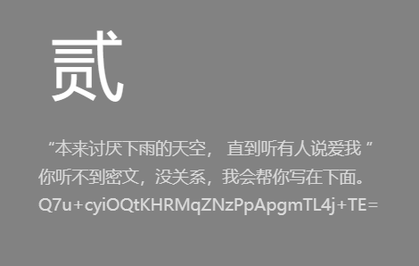

再往下提示了密钥为`lovebeforeBC`，最后说了rc4用密钥

所以直接上脚本解密

~~~python
def KSA(key):
    """ Key-Scheduling Algorithm (KSA) 密钥调度算法"""
    S = list(range(256))
    j = 0
    for i in range(256):
        j = (j + S[i] + key[i % len(key)]) % 256
        S[i], S[j] = S[j], S[i]
    return S


def PRGA(S):
    """ Pseudo-Random Generation Algorithm (PRGA) 伪随机数生成算法"""
    i, j = 0, 0
    while True:
        i = (i + 1) % 256
        j = (j + S[i]) % 256
        S[i], S[j] = S[j], S[i]
        K = S[(S[i] + S[j]) % 256]
        yield K


def RC4(key, text):
    """ RC4 encryption/decryption """
    S = KSA(key)
    keystream = PRGA(S)
    res = []
    for char in text:
        res.append(char ^ next(keystream))
    return bytes(res)


from base64 import b64decode

c = "Q7u+cyiOQtKHRMqZNzPpApgmTL4j+TE="
text = b64decode(c.encode())
key = b"lovebeforeBC"
print(len(text))
print(RC4(key, text))
print(RC4(key, text).decode())	# SYC{ILIKELISTENJAYSONG}
~~~

### DH爱喝茶

tea魔改了下，key和delta每轮都在变

~~~python
import struct
from ctypes import c_uint32


def tea_decrypt(r, v, key, delta):
    v0, v1 = c_uint32(v[0]), c_uint32(v[1])
    total = c_uint32(delta * r)
    for i in range(r):
        v1.value -= ((v0.value << 4) + key[2]) ^ (v0.value + total.value) ^ ((v0.value >> 5) + key[3])
        v0.value -= ((v1.value << 4) + key[0]) ^ (v1.value + total.value) ^ ((v1.value >> 5) + key[1])
        total.value -= delta
    return v0.value, v1.value


def rol(v, r):
    return (v << r | v >> (32 - r)) & 0xffffffff


if __name__ == "__main__":
    k = [0x56789ABC, 0x6789ABCD, 0x789ABCDE, 0x89ABCDEF]
    v = [0x1F85A965, 0xEEC063EC, 0x5BF1D0B6, 0xF2FDE7B0, 0xAA38809A, 0x670772E9, 0x360D24B9, 0xE98C688C]
    for i in range(0, len(v), 2):
        k[i // 2] = rol(k[i // 2], 6)
        delta = ((k[0] ^ k[1])&0xff) - 0x6789ABCE
        v[i:i+2] = tea_decrypt(32, v[i:i+2], k, delta)
    str_list = []
    for i in range(len(v)):
        str_list.append(struct.pack('<I', v[i]).decode())
    print('decrypted: %s' % ''.join(str_list))
# SYC{DH_likes_flower_and_tea!!!!}
~~~

### 奇怪的RC4

pyinstaller解包再pyc反编译得到如下：

~~~python
# uncompyle6 version 3.9.2
# Python bytecode version base 3.8.0 (3413)
# Decompiled from: Python 3.8.19 | packaged by conda-forge | (default, Mar 20 2024, 12:38:07) [MSC v.1929 64 bit (AMD64)]
# Embedded file name: easy_xor_and_rc4.py
from Rc4 import *

def xor1(plaintext, xor_list):
    try:
        xor_list = [ord(i) for i in xor_list]
    except:
        pass
    else:
        try:
            plaintext = [ord(i) for i in plaintext]
        except:
            pass
        else:
            for i in range(len(plaintext)):
                plaintext[i] ^= xor_list[i]
            else:
                return plaintext


def xor2(plaintext):
    try:
        plaintext = [ord(i) for i in plaintext]
    except:
        pass
    else:
        for i in range(len(plaintext) - 1):
            plaintext[i + 1] = plaintext[i] ^ plaintext[i + 1]
        else:
            return plaintext


def enc(plaintext, key, xor_list):
    plaintext = rc4(plaintext, key)
    plaintext = xor1(plaintext, xor_list)
    plaintext = xor2(plaintext)
    return plaintext


plaintext = input("please give your input:")
key = "SYCFOREVER"
xor_list = list(range(len(plaintext)))
cipher = [158, 31, 205, 434, 354, 15, 383, 298, 304, 351, 465, 312, 261, 442, 
 397, 474, 310, 397, 31, 21, 78, 67, 47, 133, 168, 48, 153, 99, 103, 
 204, 137, 29, 22, 13, 228, 3, 136, 141, 248, 124, 26, 26, 65, 200, 
 7]
plaintext = enc(plaintext, key, xor_list)
for i in range(len(cipher)):
    if cipher[i] != plaintext[i]:
        print("Wrong")
        exit(1)
else:
    print("You know the flag!!")

# okay decompiling .\easy_xor_and_rc4.pyc

~~~

发现导入的包rc4被魔改了，魔改如下（已修改反编译后的一些错误），

~~~python
def KSA(key):
    j = 0
    S = list(range(256))
    key_length = len(key)
    for i in range(256):
        j = (j + S[i] + key[i % key_length]) % 256
        S[i], S[j] = S[j], S[i]
    return S


def PRGA(S):
    i = 0
    j = 0
    while True:
        i = (i + 1) % 256
        j = (j + S[i]) % 256
        S[i], S[j] = S[j], S[i]
        k = (S[i] + S[j]) % 256
        yield k


def rc4(plaintext, key):
    key = [ord(i) for i in key]
    # plaintext = [ord(i) for i in plaintext]
    S = KSA(key)
    xor_value = PRGA(S)
    for i in range(len(plaintext)):
        plaintext[i] ^= int(next(xor_value)) + 6
    for i in range(len(plaintext)):
        plaintext[i] -= i
    return plaintext

~~~

解密如下

~~~python
from Rc4 import *


def xor1(plaintext, xor_list):
    # xor_list = [ord(i) for i in xor_list]
    # plaintext = [ord(i) for i in plaintext]
    for i in range(len(plaintext)):
        plaintext[i] ^= xor_list[i]
    return plaintext


def xor2(plaintext):
    # plaintext = [ord(i) for i in plaintext]
    for i in range(len(plaintext) - 1, 0, -1):
        plaintext[i] = plaintext[i] ^ plaintext[i-1]
    return plaintext


def enc(plaintext, key, xor_list):
    plaintext = xor2(plaintext)
    plaintext = xor1(plaintext, xor_list)
    plaintext = rc4(plaintext, key)
    return plaintext


key = "SYCFOREVER"
cipher = [158, 31, 205, 434, 354, 15, 383, 298, 304, 351, 465, 312, 261, 442, 397, 474, 310, 397, 31, 21, 78, 67, 47, 133, 168, 48, 153, 99, 103, 204, 137, 29, 22, 13, 228, 3, 136, 141, 248, 124, 26, 26, 65, 200, 7]
xor_list = list(range(len(cipher)))
plaintext = enc(cipher, key, xor_list)
print("".join(map(chr, cipher)))
# SYC{Bel1eve_thAt_you_a3e_Unique_@nd_tHe_beSt}
~~~

### 长颈鹿喜欢吃彩虹

做了ollvm混淆，直接dflat解混淆，最后是个简单的异或

~~~python
key = b"BOb0m0oN"
xor_data = [0x1D, 0x36, 0x73, 0x16, 0x49, 0x2D, 0x1A, 0x1D, 0x29, 0x06, 0x42, 0x2C, 0x76, 0x07, 0x10, 0x0E, 0x7E, 0x39, 0x55, 0x32, 0x75, 0x03, 0x1B, 0x1D, 0x19, 0x5F, 0x52, 0x23, 0x01, 0x03, 0x1D, 0x3F]
flag = ""
for i in range(len(xor_data)):
    flag += chr(xor_data[i]^key[7 - i%8])
print(flag)	# SYC{yOU_girAFe_L0Ve_EaT_W0bN1aR}
~~~

### CPP_flower

存在花指令，解决办法是nop掉连续的jz、jnz以及其后一个字节

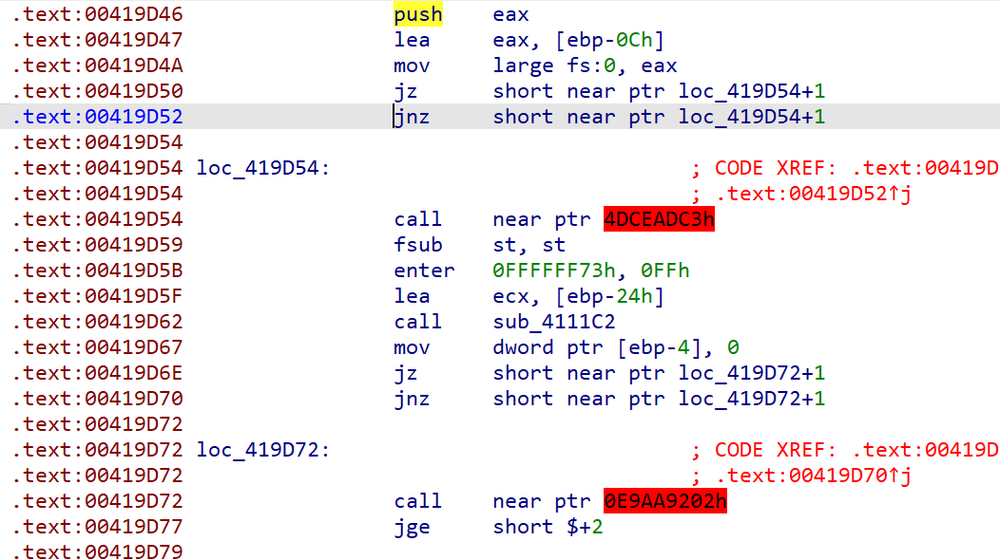

这里是call花指令，直接nop掉call loc开始到mov esi前

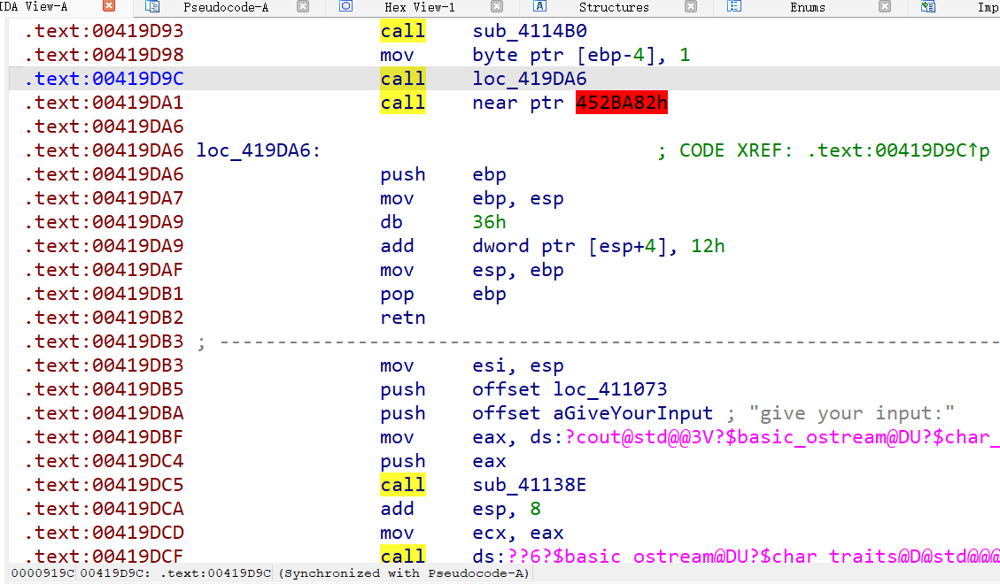

这里红框直接nop掉整个函数（里面直接esp+12，即从419e7f到419e91）

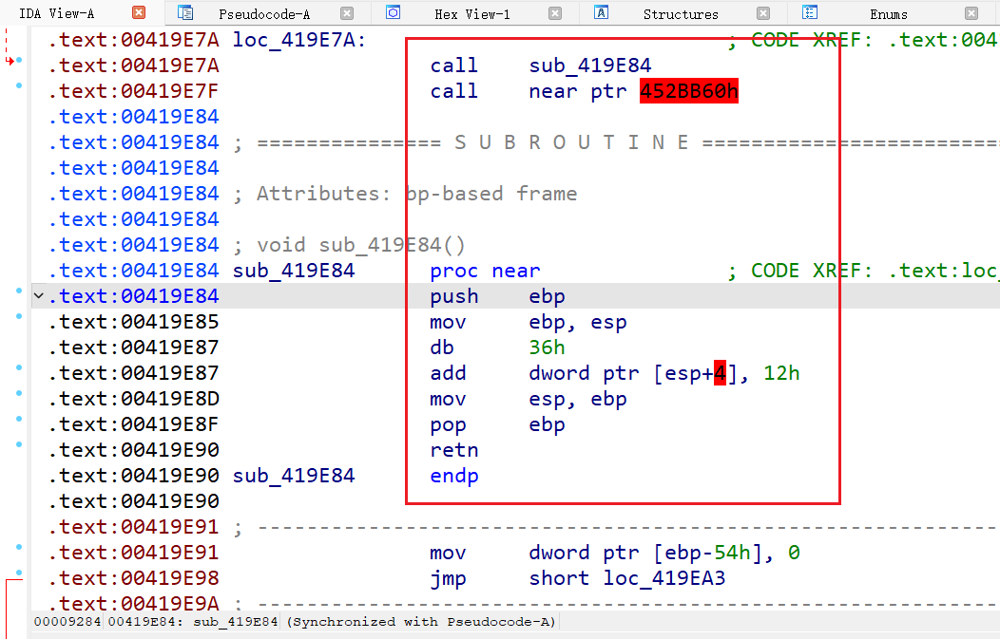

undefine中间所有的函数，然后在最开头的push ebp创建函数

~~~c
__int64 sub_419D10()
{
  int v0; // eax
  __int64 v1; // rax
  _DWORD *v2; // esi
  int v3; // eax
  __int64 v5; // [esp-8h] [ebp-23Ch]
  int v6[41]; // [esp+2Ch] [ebp-208h] BYREF
  int v7; // [esp+104h] [ebp-130h]
  int Buf2[52]; // [esp+110h] [ebp-124h] BYREF
  int i; // [esp+1E0h] [ebp-54h]
  char v10[36]; // [esp+1ECh] [ebp-48h] BYREF
  char v11[20]; // [esp+210h] [ebp-24h] BYREF
  int v12; // [esp+230h] [ebp-4h]
  int savedregs; // [esp+234h] [ebp+0h] BYREF

  sub_411127(0x10u);
  sub_4111C2(v11);
  v12 = 0;
  srand(0x7DE9u);
  sub_411519();
  sub_4114B0(v10);
  LOBYTE(v12) = 1;
  v0 = sub_41138E(std::cout, "give your input:");
  std::ostream::operator<<(v0, sub_411073);
  sub_411519();
  sub_4113F7(std::cin, v10);
  if ( sub_41181B(v10) == dword_426004 )
  {
    for ( i = 0; i < dword_426004; ++i )
    {
      rand();
      v6[0] = sub_411519() % 255;
      sub_4112E4(v6);
    }
    for ( i = 0; i < dword_426004; ++i )
    {
      v2 = (_DWORD *)sub_41128A(i);
      v7 = *v2 ^ *(char *)sub_411113(i);
      Buf2[i] = v7;
    }
    if ( !j_memcmp(&unk_422C30, Buf2, 4 * dword_426004) )
      v3 = sub_41138E(std::cout, "you get it");
    else
      v3 = sub_41138E(std::cout, "Wrong");
    std::ostream::operator<<(v3, sub_411073);
    sub_411519();
    LOBYTE(v12) = 0;
    sub_411438();
    v12 = -1;
    sub_411726(v11);
    LODWORD(v1) = 0;
  }
  else
  {
    v6[3] = 0;
    LOBYTE(v12) = 0;
    sub_411438();
    v12 = -1;
    sub_411726(v11);
    LODWORD(v1) = 0;
  }
  v5 = v1;
  sub_411456(&savedregs, &dword_41A008);
  return v5;
}
~~~

解密如下

~~~c++
#include<iostream>
#include<time.h>
using namespace std;

int main() {
    unsigned char data[50] = {
        0x0000003E, 0x00000098, 0x000000EB, 0x00000026, 0x00000025, 0x0000008E, 0x00000025, 0x000000E5, 
        0x00000086, 0x000000C8, 0x0000003F, 0x00000098, 0x000000C8, 0x000000DE, 0x00000052, 0x00000044, 
        0x000000A0, 0x000000CB, 0x0000002B, 0x0000002A, 0x0000003C, 0x000000AA, 0x000000BE, 0x000000CB, 
        0x00000088, 0x00000055, 0x0000009E, 0x0000006D, 0x000000D9, 0x00000094, 0x00000097, 0x0000001C, 
        0x00000052, 0x00000031, 0x00000059, 0x000000FE, 0x0000001A, 0x0000001A, 0x000000E8, 0x000000D0, 
        0x0000003A, 0x0000009C, 0x00000006, 0x0000005E, 0x00000025, 0x0000005A, 0x000000E4, 0x00000022, 
        0x000000A1, 0x000000C5
    };
    srand(0x7de9);
    for (int i = 0; i < 50; i++) {
        data[i] ^= rand()%255;
    }
    printf("%s", data);
}
~~~

### 玩就行了

游戏通关后会写入Data.txt，里面4d5a开头，正好是dos文件格式（CE也可以修改内存值从而快速完成游戏）

解密如下

~~~python
s = "0A161230300C2D0A2B303D2428233005242C2D26182206233E097F133A"
s = list(bytes.fromhex(s))
key = "GEEK"
for i in range(len(s)):
	s[i] ^= ord(key[i%4])
for i in range(len(s)):
	if chr(s[i]).islower():
		s[i] = chr((s[i] - 97 - 20) % 26 + 97)
	elif chr(s[i]).isupper():
		s[i] = chr((s[i] - 65 - 20) % 26 + 65)
	elif chr(s[i]).isdigit():
		s[i] = chr((s[i] - 48 - 20) % 10 + 48)
	else:
		s[i] = chr(s[i])
print("".join(s))	# SYC{cOnGraduulaTions_mIneR:D}
~~~

### 好像是python？

给了python字节码，一步步分析就好了

~~~python
# def func1(s, R):
#     result = []
#     for i in s:
#         if "A" <= i <= "Z":
#             result.append(chr((ord(i) - ord("A") + R) % 26 + ord("A")))
#         elif "a" <= i <= "z":
#             result.append(chr((ord(i) - ord("a") + R) % 26 + ord("a")))
#         elif "0" <= i <= "9":
#             result.append(chr((ord(i) - ord("0") + R) % 10 + ord("0")))
#         else:
#             result.append(i)
#     return "".join(result)
#
#
# def func2(s2):
#     key = "SYC"
#     length = 18
#     cipher = []
#     for i in range(length):
#         cipher.append((ord(s2[i]) ^ i) + (~ord(key[i % 3]) + 1))
#     return cipher
#
#
# input0 = input()
# a = 13
# b = 14
# c = a ^ (a + b)
# d = b * 100
# e = a ^ b
# m = e + (d - c * 4) - 1
# r = m % 26
# cipher1 = func1(input0, r)
# cipher2 = func2(cipher1)
# print(cipher2)
# num = [-1, -36, 26, -5, 14, 41, 6, -9, 60, 29, -28, 17, 21, 7, 35, 38, 26, 48]
# for i in range(18):
#     if cipher2[i] != num[i]:
#         print("wrong!")
#     else:
#         print("Rrrright!")


def func1(s, R):
    result = []
    for i in s:
        if "A" <= chr(i) <= "Z":
            result.append(chr((i - ord("A") - R) % 26 + ord("A")))
        elif "a" <= chr(i) <= "z":
            result.append(chr((i - ord("a") - R) % 26 + ord("a")))
        elif "0" <= chr(i) <= "9":
            result.append(chr((i - ord("0") - R) % 10 + ord("0")))
        else:
            result.append(chr(i))
    return "".join(result)


def func2(s2):
    key = "SYC"
    length = 18
    cipher = []
    for i in range(length):
        cipher.append((s2[i] - (~ord(key[i % 3]) + 1)) ^ i)
    return cipher


# input0 = input()
a = 13
b = 14
c = a ^ (a + b)
d = b * 100
e = a ^ b
m = e + (d - c * 4) - 1
r = m % 26		# 也可以直接爆破
num = [-1, -36, 26, -5, 14, 41, 6, -9, 60, 29, -28, 17, 21, 7, 35, 38, 26, 48]
cipher2 = func2(num)
cipher1 = func1(cipher2, r)
import hashlib

print(cipher1)
print("SYC{" + hashlib.md5(cipher1.encode()).hexdigest() + "}")

~~~

### blasting_master

脚本爆破，每四位md5加密一次，总共40次，加密后数据共640字节，正好对应md5加密完16字节

~~~python
from string import ascii_uppercase, ascii_lowercase, digits
from itertools import product
from hashlib import md5

data = [0xB2, 0x50, 0xA0, 0xBC, 0x3A, 0x7F, 0x54, 0x6D, 0x96, 0x07, 0x0F, 0x71, 0x9A, 0x72, 0xEB, 0xA5, 0xA0, 0xB5, 0x71, 0xA4, 0x6A, 0xB8, 0xBA, 0xFA, 0xE4, 0x31, 0xC3, 0x71, 0x54, 0x29, 0xA7, 0x59, 0x20, 0x2B, 0x13, 0x21, 0xBD, 0x67, 0x5F, 0x8D, 0x65, 0x3A, 0x02, 0x27, 0x08, 0x4F, 0x92, 0x9C, 0xB5, 0x7C, 0xDF, 0x69, 0x34, 0xB8, 0x82, 0x2D, 0xF6, 0xCA, 0x7A, 0x65, 0x98, 0x63, 0xDC, 0x51, 0x2A, 0x34, 0x97, 0x4F, 0xF8, 0xBC, 0x23, 0x1F, 0x38, 0xA8, 0xA6, 0x2F, 0xA9, 0x0D, 0x64, 0x4C, 0xAC, 0x2F, 0xF9, 0xF5, 0x2D, 0xB1, 0x91, 0xA8, 0xD5, 0x76, 0xD9, 0x2D, 0xC6, 0xAC, 0x2E, 0x69, 0x32, 0xD5, 0x64, 0x1D, 0xC1, 0x3C, 0xEC, 0xF5, 0x2C, 0x90, 0xED, 0xF4, 0x17, 0x8B, 0x55, 0x4C, 0xE4, 0x6C, 0x3B, 0xB3, 0xDA, 0x29, 0xC0, 0x7B, 0x39, 0xDF, 0x92, 0x73, 0xFC, 0xC9, 0xC2, 0xA8, 0x68, 0x11, 0x22, 0x2B, 0x64, 0x3F, 0x12, 0x9B, 0x95, 0x73, 0x2A, 0x05, 0xD3, 0x3F, 0x2E, 0x33, 0xF1, 0x85, 0xED, 0x07, 0x7B, 0x86, 0x8F, 0x62, 0x2D, 0x79, 0x03, 0xAC, 0x80, 0xCE, 0xF5, 0xB2, 0xA0, 0x0C, 0xF7, 0xE1, 0xC5, 0x0E, 0x63, 0x27, 0xD1, 0x65, 0x23, 0xEA, 0x5A, 0x1C, 0x02, 0x0B, 0x32, 0xBA, 0x1F, 0xE5, 0xC7, 0x22, 0xA5, 0x66, 0x77, 0xEA, 0x5B, 0xE4, 0x64, 0xAB, 0x8B, 0x60, 0xB6, 0xDF, 0x00, 0xDC, 0xF7, 0x6D, 0x93, 0xEC, 0x2F, 0x2F, 0x68, 0x07, 0x50, 0xE0, 0xD1, 0x1A, 0x3F, 0xC6, 0x4E, 0x2E, 0xC6, 0xBB, 0xAE, 0x08, 0x40, 0xD8, 0x5B, 0x11, 0xB5, 0xDC, 0x15, 0x35, 0x7F, 0x63, 0x49, 0x3E, 0x5B, 0x9C, 0x0D, 0xFC, 0x0D, 0xB6, 0x80, 0xB7, 0x2B, 0x00, 0xEF, 0x3C, 0x0C, 0x2F, 0xEB, 0x86, 0x44, 0x57, 0x74, 0x9E, 0x5F, 0x1F, 0x8B, 0xA1, 0xC9, 0x01, 0xF1, 0xD8, 0xF4, 0x92, 0x82, 0x95, 0x6F, 0x85, 0xD2, 0x15, 0x22, 0x1F, 0xF0, 0x9F, 0xD1, 0xAB, 0x51, 0x39, 0x9A, 0xB6, 0xC4, 0xDA, 0xFB, 0x38, 0x8D, 0xE6, 0x8C, 0x57, 0x19, 0x5E, 0x94, 0xDA, 0x57, 0xCC, 0xF0, 0xB9, 0x0A, 0x4A, 0x17, 0x82, 0xFC, 0xC5, 0x4F, 0x4B, 0x5A, 0xA5, 0xF4, 0xE5, 0x3E, 0xFA, 0x3A, 0x0A, 0xF4, 0xB4, 0x8E, 0x7F, 0x25, 0x84, 0x75, 0x90, 0xCD, 0x35, 0x87, 0xEB, 0xC3, 0xCE, 0x81, 0x2B, 0x86, 0xC9, 0x16, 0x7E, 0x85, 0x68, 0x2D, 0xF1, 0xDB, 0x8E, 0x74, 0x15, 0xCF, 0x95, 0x51, 0x07, 0x88, 0x5E, 0x1B, 0xE9, 0x37, 0xC9, 0x5B, 0xBA, 0x61, 0xEB, 0x9F, 0x7B, 0xE4, 0x89, 0x10, 0xF0, 0x6E, 0xCD, 0x75, 0x71, 0xAD, 0x09, 0x74, 0x58, 0x49, 0xA3, 0xF5, 0x33, 0x83, 0x75, 0x22, 0x95, 0x1B, 0xE3, 0x3C, 0x48, 0x05, 0x5C, 0xAD, 0xA8, 0x6B, 0xFD, 0x41, 0xEB, 0xAF, 0xC6, 0x02, 0x28, 0xC6, 0x5E, 0xCF, 0x36, 0xAE, 0x50, 0xCE, 0x93, 0xF2, 0x70, 0x88, 0x9D, 0x3F, 0x4A, 0x9F, 0x86, 0xE7, 0x67, 0x64, 0xB0, 0x02, 0x96, 0x0C, 0xAB, 0x9F, 0xEB, 0x4B, 0x03, 0x44, 0x92, 0xDE, 0x6C, 0xF4, 0xCE, 0x32, 0x4F, 0x4F, 0x38, 0xE2, 0x52, 0x59, 0xCA, 0x95, 0x4A, 0x11, 0xD8, 0x30, 0xA2, 0x7B, 0xD5, 0x3A, 0xE6, 0x11, 0xDA, 0x3A, 0x4A, 0x33, 0x61, 0x39, 0x65, 0x26, 0xD2, 0x78, 0xBC, 0xED, 0xBD, 0xA5, 0x8B, 0x2B, 0x87, 0x4C, 0x95, 0x47, 0x25, 0x02, 0xBA, 0x83, 0x3D, 0xDC, 0xE4, 0x6A, 0xAD, 0x67, 0xDD, 0x22, 0xB1, 0xBD, 0x2B, 0x7C, 0x53, 0x11, 0x3C, 0xD9, 0x23, 0x06, 0x3D, 0x20, 0xBA, 0x28, 0xC8, 0x2D, 0x89, 0x51, 0x57, 0x63, 0x82, 0xA0, 0xC8, 0xA8, 0xDE, 0x29, 0x61, 0xC1, 0x53, 0x51, 0xB0, 0xBC, 0x37, 0x04, 0xEE, 0xC9, 0x35, 0x8A, 0xA8, 0xA2, 0x66, 0xBA, 0x6F, 0x24, 0xB6, 0x3F, 0x62, 0x41, 0x6D, 0x10, 0x46, 0xCB, 0x06, 0x12, 0x39, 0xD9, 0x0E, 0xF9, 0xDC, 0x19, 0xA7, 0x65, 0xB8, 0xC0, 0x40, 0xBE, 0xF6, 0x99, 0x9A, 0xAF, 0x02, 0x16, 0x37, 0x4D, 0xA5, 0x75, 0x4C, 0x42, 0x4B, 0x1A, 0xF0, 0x52, 0xDA, 0x38, 0xF3, 0x6B, 0xA9, 0x1A, 0xDC, 0xFA, 0x80, 0xB0, 0x60, 0xB1, 0xFD, 0x73, 0x7B, 0x78, 0xD9, 0x62, 0x83, 0x26, 0xBF, 0x16, 0x33, 0x71, 0x79, 0x6F, 0x11, 0x2F, 0xE9, 0xA7, 0xBB, 0x46, 0x46, 0xD6, 0x8F, 0xF6, 0x21, 0x7E, 0xFC, 0x68, 0x12, 0x86, 0x6B, 0xFC, 0x51, 0xC9, 0x70, 0x7A, 0x74, 0xBC, 0x8F, 0x6E, 0x0B, 0x86, 0x42, 0x6F, 0x5C, 0xFD, 0xF7, 0x4E, 0x27, 0x71, 0xFE, 0x37, 0xE6, 0xC8, 0x62, 0x47, 0xFC, 0xD5, 0x6C, 0xBA, 0x5C, 0xD9, 0x29, 0x5A, 0x73, 0xAE, 0xC3, 0x8F, 0xF0, 0x46, 0x95, 0x32, 0x42, 0x2D, 0xD0]
char_list = list(ascii_uppercase + digits + ascii_lowercase) + ["}", "-", "_", "!", "@", "$", "?"]
flag = "SYC{"
for i in range(16, len(data), 16):
    cmp = data[i:i+16]
    for c in product(char_list, repeat=1):
        word = flag[-3:] + c[0]
        out = list(bytes.fromhex(md5(word.encode()).hexdigest()))
        for j in range(16):
            out[j] = (7 * ((j + 42) ^ out[j]) + 82 * (j % 15)) & 0xff
        if out == cmp:
            flag += word[-1]
            break
print(flag)	# SYC{W0w!y0u_@re_th3_BeSt_blasting_Exp3rt!!}
~~~

前4个字符可以直接爆，加快爆破速度

### 致我的星星

给的js里有暗示z3求解

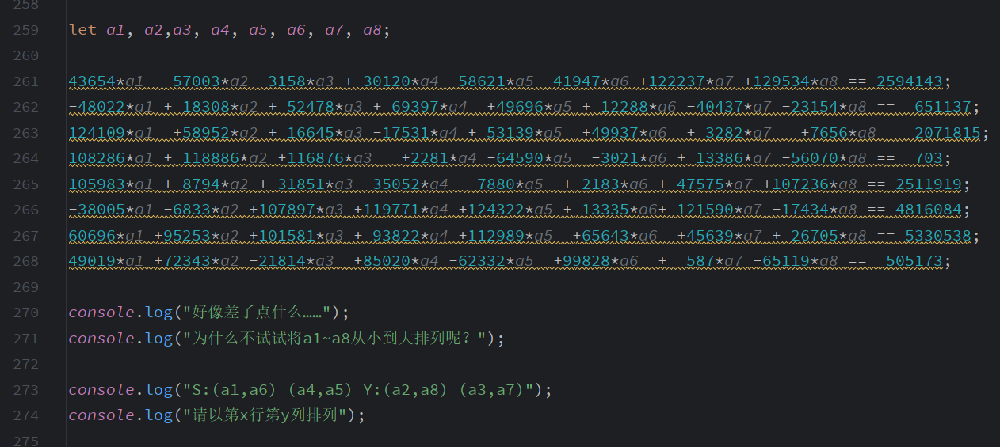

~~~python
from z3 import *

s = Solver()
a1 = Int("a1")
a2 = Int("a2")
a3 = Int("a3")
a4 = Int("a4")
a5 = Int("a5")
a6 = Int("a6")
a7 = Int("a7")
a8 = Int("a8")
s.add(43654*a1 - 57003*a2 -3158*a3 + 30120*a4 -58621*a5 -41947*a6 +122237*a7 +129534*a8 == 2594143)
s.add(-48022*a1 + 18308*a2 + 52478*a3 + 69397*a4  +49696*a5 + 12288*a6 -40437*a7 -23154*a8 ==  651137)
s.add(124109*a1  +58952*a2 + 16645*a3 -17531*a4 + 53139*a5  +49937*a6  + 3282*a7   +7656*a8 == 2071815)
s.add(108286*a1 + 118886*a2 +116876*a3   +2281*a4 -64590*a5  -3021*a6 + 13386*a7 -56070*a8 ==  703)
s.add(105983*a1 + 8794*a2 + 31851*a3 -35052*a4  -7880*a5  + 2183*a6 + 47575*a7 +107236*a8 == 2511919)
s.add(-38005*a1 -6833*a2 +107897*a3 +119771*a4 +124322*a5 + 13335*a6+ 121590*a7 -17434*a8 == 4816084)
s.add(60696*a1 +95253*a2 +101581*a3 + 93822*a4 +112989*a5  +65643*a6  +45639*a7 + 26705*a8 == 5330538)
s.add(49019*a1 +72343*a2 -21814*a3  +85020*a4 -62332*a5  +99828*a6  +  587*a7 -65119*a8 ==  505173)
if s.check() == sat:
    print(s.model())

~~~

然后是迷宫题，js里可以看出来是两个10*10

~~~js
function locate1() {
    for (let i = 0; i <= 9; i++) {
        for (let j = 0; j <= 9; j++) {
            if (map[100 * chance + 10 * i + j] === 'S') {
                x = i;
                y = j;
                return;
            }
        }
    }
}
~~~

打印一下迷宫

~~~python
var = [
    "#",
    "#",
    "#",
    "#",
    "#",
    "#",
    "#",
    "#",
    "#",
    "#",
    "#",
    "#",
    "#",
    "#",
    "#",
    "#",
    "#",
    "#",
    "#",
    "#",
    "#",
    "#",
    "#",
    "#",
    "#",
    "#",
    "#",
    "#",
    "#",
    "#",
    "#",
    "*",
    "*",
    "*",
    "*",
    "#",
    "#",
    "#",
    "#",
    "#",
    "#",
    "*",
    "#",
    "#",
    "*",
    "#",
    "#",
    "#",
    "#",
    "#",
    "#",
    "*",
    "*",
    "#",
    "*",
    "#",
    "#",
    "#",
    "#",
    "#",
    "#",
    "#",
    "#",
    "#",
    "*",
    "#",
    "#",
    "#",
    "#",
    "#",
    "#",
    "#",
    "#",
    "#",
    "*",
    "#",
    "#",
    "#",
    "#",
    "#",
    "#",
    "#",
    "#",
    "#",
    "#",
    "#",
    "#",
    "#",
    "#",
    "#",
    "#",
    "#",
    "#",
    "#",
    "#",
    "#",
    "#",
    "#",
    "#",
    "#",
    "#",
    "#",
    "#",
    "#",
    "#",
    "#",
    "#",
    "*",
    "*",
    "#",
    "#",
    "#",
    "*",
    "#",
    "*",
    "*",
    "#",
    "#",
    "*",
    "#",
    "#",
    "*",
    "*",
    "#",
    "*",
    "*",
    "#",
    "*",
    "*",
    "#",
    "#",
    "*",
    "#",
    "#",
    "#",
    "*",
    "#",
    "#",
    "#",
    "#",
    "#",
    "*",
    "#",
    "#",
    "#",
    "*",
    "#",
    "#",
    "#",
    "#",
    "#",
    "*",
    "*",
    "*",
    "*",
    "*",
    "*",
    "#",
    "#",
    "#",
    "#",
    "*",
    "#",
    "#",
    "#",
    "#",
    "#",
    "#",
    "#",
    "#",
    "#",
    "#",
    "*",
    "*",
    "#",
    "*",
    "#",
    "#",
    "*",
    "#"
]
k = 0
var[2*20+12] = "S"
var[7*20+12] = "S"
var[3*20+14] = "Y"
var[5*20+14] = "Y"
for i in range(18):
    for j in range(10):
        print(var[i*10+j], end=" ")
    print()
# [3, 13] [8, 13] [4, 15] [6, 15]
# STTAAARRRRAAATTTTS
~~~

可以走出STTAAARRRRAAATTTTS，就是flag（但是做题时候发现貌似多解）

### 你干嘛~~

给了个加密过的gif文件，从文件头可以知道开头异或了qwer...，但具体后面不知道怎么异或的，分析exe

有花指令去除下得到如下

~~~c
int __cdecl main(int argc, const char **argv, const char **envp)
{//...
  v32 = &v9;
  if ( IsDebuggerPresent() )
    exit(1);
  FileName = "Dusk_witnesses_devout_believers.gif";
  sub_FF1020("  ____   __   __   ____   _        ___   __     __  _____   ____  \n", v9);
  sub_FF1020(" / ___|  \\ \\ / /  / ___| | |      / _ \\  \\ \\   / / | ____| |  _ \\ \n", v9);
  sub_FF1020(" \\___ \\   \\ V /  | |     | |     | | | |  \\ \\ / /  |  _|   | |_) |\n", v9);
  sub_FF1020("  ___) |   | |   | |___  | |___  | |_| |   \\ V /   | |___  |  _ < \n", v9);
  sub_FF1020(" |____/    |_|    \\____| |_____|  \\___/     \\_/    |_____| |_| \\_\\\n", v9);
  sub_FF1020(aWhatAreYouDoin, v9);
  sub_FF1050("%s", (char)&Arglist);
  p_Arglist = &Arglist;
  v12 = v30;
  p_Arglist += strlen(p_Arglist);
  v11 = ++p_Arglist - v30;
  Size = p_Arglist - v30;
  Block = sub_FF1290((int)&Arglist, p_Arglist - v30);
  v33 = 0;
  qmemcpy(v31, "0O00O0O00OO0O0O01III1II111I1I1I1", sizeof(v31));
  sub_FF2010(v27, 0xCu);
  qmemcpy(v18, "!l", 2);
  v18[2] = -3;
  v18[3] = -90;
  v18[4] = -74;
  v18[5] = -126;
  v18[6] = -81;
  v18[7] = -52;
  v18[8] = 81;
  v18[9] = 106;
  v18[10] = -47;
  v18[11] = -30;
  v18[12] = -87;
  v18[13] = 62;
  v18[14] = -90;
  v18[15] = -112;
  v8 = sub_FF2170(&v17);
  v3 = (_DWORD *)unknown_libname_1(v18, v19);
  sub_FF20B0(*v3, v3[1], v8);
  LOBYTE(v33) = 2;
  sub_FF2010(v28, 0xCu);
  v26 = 0;
  v4 = sub_FF2170(&v16);
  sub_FF2110(Size, (int)&v26, v4);
  LOBYTE(v33) = 3;
  v5 = sub_FF2050(v28);
  sub_FF1A50(v31, &v31[16], v5);
  if ( Size % 0x10 || !(unsigned __int8)sub_FF2180(v28, v27) )
  {
    if ( Block )
    {
      v20 = "ZmFrZXthcmVfeW08X6JlYWx4X6JpZ7h9fQ==";
      v21 = (char *)Block;
      while ( 1 )
      {
        v25 = *v21;
        v6 = v25 < (unsigned int)*v20;
        if ( v25 != *v20 )
          break;
        if ( !v25 )
          goto LABEL_12;
        v24 = v21[1];
        v6 = v24 < (unsigned int)v20[1];
        if ( v24 != v20[1] )
          break;
        v21 += 2;
        v20 += 2;
        if ( !v24 )
        {
LABEL_12:
          v13 = 0;
          goto LABEL_14;
        }
      }
      v13 = v6 ? -1 : 1;
LABEL_14:
      v10 = v13;
      if ( v13 )
        sub_FF1020(aBase, v9);
      else
        sub_FF1020(asc_FF43F8, v9);
      free(Block);
    }
  }
  else
  {
    sub_FF1020("wow\n", v9);
    sub_FF13B0(FileName, &Arglist);
    sub_FF1530(FileName);
  }
  LOBYTE(v33) = 2;
  sub_FF2060(v28);
  LOBYTE(v33) = 1;
  sub_FF2060(v27);
  return 0;
}
~~~

魔改base64解密是个假的flag，上面的sub_FF1A50分析后可知是sm4加密，动态调试发现"0O00O0O00OO0O0O01III1II111I1I1I1"，前16字节key，后16字节iv。cyberchef解密直接拿到真实的异或字符串，正好对上了前面

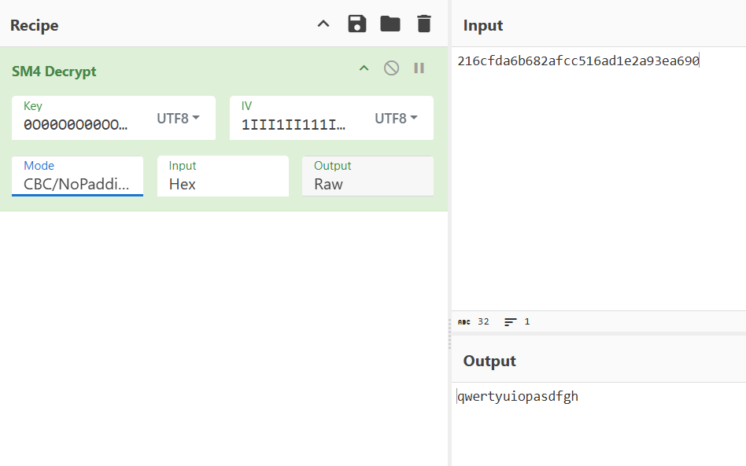

还原gif

~~~python
with open("Dusk_witnesses_devout_believers.gif", "rb") as f:
    data = f.read()
new_data = b""
s = "qwertyuiopasdfgh"
print(len(s))
for i in range(0, len(data)):
    new_data += (data[i]^ord(s[i%len(s)])).to_bytes(1,'big')
with open("out.gif", "wb") as f1:
    f1.write(new_data)
~~~

快速截个图拿到flag

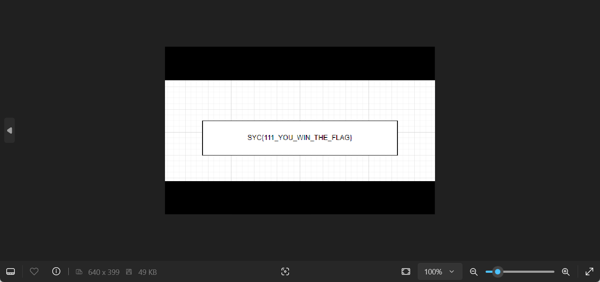

### ez_hook

存在hook函数

~~~c
BOOL __fastcall sub_401911(_BYTE *a1, int a2)
{
  __int64 v3; // [rsp+2Bh] [rbp-15h]
  DWORD flOldProtect; // [rsp+34h] [rbp-Ch] BYREF
  SIZE_T dwSize; // [rsp+38h] [rbp-8h]

  dwSize = 5i64;
  VirtualProtect(a1, 5ui64, 0x40u, &flOldProtect);
  LOBYTE(v3) = -23;
  *(_DWORD *)((char *)&v3 + 1) = a2 - (_DWORD)a1 - 5;
  *(_DWORD *)a1 = v3;
  a1[4] = BYTE4(v3);
  return VirtualProtect(a1, dwSize, flOldProtect, &flOldProtect);
}
~~~

第一个函数是

~~~c
size_t __fastcall sub_4017E0(const char *a1)
{
  size_t result; // rax
  char v2[22]; // [rsp+20h] [rbp-60h] BYREF
  _WORD v3[5]; // [rsp+36h] [rbp-4Ah] BYREF

  memset(v2, 7, 2);
  v2[2] = 10;
  v2[3] = 7;
  v2[4] = 18;
  v2[5] = 62;
  v2[6] = 77;
  v2[7] = 7;
  v2[8] = 7;
  v2[9] = 7;
  v2[10] = 7;
  v2[11] = 0;
  v2[12] = 20;
  v2[13] = 17;
  v2[14] = 33;
  v2[15] = 51;
  v2[16] = 43;
  v2[17] = 3;
  v2[18] = 47;
  v2[19] = 7;
  v2[20] = 7;
  v2[21] = 7;
  strcpy((char *)v3, "Y0S\t");
  for ( *(_DWORD *)&v3[3] = 0; ; ++*(_DWORD *)&v3[3] )
  {
    result = strlen(a1);
    if ( *(int *)&v3[3] >= result )
      break;
    a1[*(int *)&v3[3]] ^= v2[*(int *)&v3[3]];
  }
  return result;
}
~~~

第二个是

~~~c
size_t __fastcall sub_4018B4(const char *a1)
{
  size_t result; // rax
  int i; // [rsp+2Ch] [rbp-54h]

  for ( i = 0; ; ++i )
  {
    result = strlen(a1);
    if ( i >= result )
      break;
    a1[i] ^= 7u;
  }
  return result;
}
~~~

将第一个替换为第二个，所以主函数main实际执行的是sub_4018B4的异或7操作

~~~c
int __fastcall main(int argc, const char **argv, const char **envp)
{
  BOOL pbDebuggerPresent; // [rsp+2Ch] [rbp-54h] BYREF
  char Str[64]; // [rsp+30h] [rbp-50h] BYREF
  char v6[32]; // [rsp+70h] [rbp-10h] BYREF
  HANDLE hProcess; // [rsp+90h] [rbp+10h]
  unsigned int v8; // [rsp+98h] [rbp+18h]
  int i; // [rsp+9Ch] [rbp+1Ch]

  sub_401B90(argc, argv, envp);
  v8 = 3;
  puts("plz input the flag:");
  scanf("%s", Str);
  sub_40167D(Str);
  pbDebuggerPresent = 0;
  hProcess = GetCurrentProcess();
  if ( CheckRemoteDebuggerPresent(hProcess, &pbDebuggerPresent) && pbDebuggerPresent )
    return 0;
  sub_4016E4(Str, v8, v6);
  sub_4017E0(v6);
  for ( i = 0; i < strlen(Str); ++i )
  {
    if ( v6[i] != aZoxpihLhx6sox7[i] )
    {
      puts("Failed!");
      getchar();
      getchar();
      exit(0);
    }
  }
  puts("Success!");
  getchar();
  getchar();
  return 0;
}
~~~

此外，在sub_4016E4还对Str字符串进行了换位操作，直接输入a-z动态调试看v6变成啥

~~~python
s = 'zoXpih^lhX6soX7lr~DTHtGpX|'
print(len(s))
new_s = ""
for i in range(len(s)):
    new_s += chr((ord(s[i]) ^ 7))
table = "abcdefghijklmnopqrstuvwxyz"
c_table = "zvrnjfbywusqomkigecaxtplhd"
flag = ""
for i in range(26):
    flag += new_s[c_table.index(table[i])]
print(flag)	# SYC{you_kn0w_wh@t_1s_hoOk}
~~~

### LinkedListModular

rsa相关元素进行了异或加密

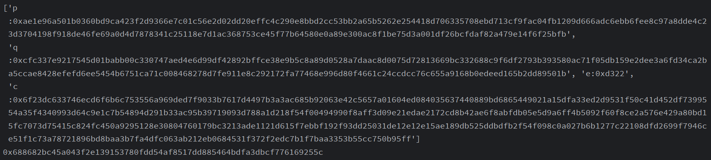

难点在于这个rsa解密中，phi和e不互素，当时卡了好久最后才找到[思路](https://zhouyetao.github.io/2021/11/03/RSA%E7%AC%94%E8%AE%B0/)，把他们公约数q求出来，原来的$c\equiv m^{e}(mod\ d)$相当于$c\equiv (m^{q})^{e//q}(mod\ d)$，此时求解得到的是$m^q$，只需开q次方，检查发现每次结果正好32字节，对应输入总共4次每次64位十六进制字符串，共256个字符

~~~python
import math

from Crypto.Util.number import long_to_bytes
import gmpy2
from gmpy2 import gcd

key = b"IKnowYouLikeCrypto"
for i in range(4):
    with open(f"output/cmp{i}.enc", "r") as f:
        enc_data = f.read()
    enc_data = list(eval(enc_data))
    for j in range(len(enc_data)):
        enc_data[j] ^= key[j%len(key)]
    data = bytes(enc_data).decode().split()
    print(data)
    p = int(data[0][2:], 16)
    q = int(data[1][2:], 16)
    e = int(data[2][2:], 16)
    # e = (e >> 8) | (e << 8 & 0xffff)
    c = int(data[3][2:], 16)
    # print(p, q, e, c)
    n = p * q
    phi = (p - 1) * (q - 1)
    q = gcd(phi, e)
    d = gmpy2.invert(e // q, phi)
    m = pow(c, d, n)
    m = gmpy2.iroot(m, q)[0]
    print(hex(m))
"""
0x688682bc45a043f2e139153780fdd54af8517dd885464bdfa3dbcf776169255c
0x9304306d542508c59abf30f99b98fefcd2951df2effc81fca8e5aa26414819cb
0x144576b4302a8c5262d7d4d9b2ebb3468835c709cc88fc0b8b38b52a6f31d3ab
0x6b25edeccfcf74f0dfc77abc90d757a49c1d0fb1c90e67db7918c61be80ad59c
"""
~~~

得到的十六进制字符串拼接后md5即为flag

### AES!

魔改了aes的SBOX数组值，直接网上找了个不依赖库实现AES加解密的脚本，然后再找了个求SBOX逆元的脚本，直接拿flag

~~~python
MIX_C  = [[0x2, 0x3, 0x1, 0x1], [0x1, 0x2, 0x3, 0x1], [0x1, 0x1, 0x2, 0x3], [0x3, 0x1, 0x1, 0x2]]
I_MIXC = [[0xe, 0xb, 0xd, 0x9], [0x9, 0xe, 0xb, 0xd], [0xd, 0x9, 0xe, 0xb], [0xb, 0xd, 0x9, 0xe]]
RCon   = [0x01000000, 0x02000000, 0x04000000, 0x08000000, 0x10000000, 0x20000000, 0x40000000, 0x80000000, 0x1B000000, 0x36000000]
S_BOX = [0x7C, 0xCA, 0x7B, 0x77, 0xF2, 0x6B, 0x6F, 0xC5, 0x30, 0x01, 0x67, 0x2B, 0xFE, 0xD7, 0x47, 0xAB, 0x76, 0x63, 0x82, 0xC9, 0x7D, 0xFA, 0x59, 0xF0, 0xAD, 0xD4, 0xA2, 0xAF, 0x9C, 0xA4, 0x72, 0xC0, 0xB7, 0xFD, 0x93, 0x26, 0x36, 0x3F, 0xF7, 0xCC, 0x34, 0xA5, 0xE5, 0xF1, 0x71, 0xD8, 0x31, 0x15, 0x04, 0xC7, 0x23, 0xC3, 0x18, 0x96, 0x05, 0x9A, 0x07, 0x12, 0x80, 0xE2, 0xEB, 0x27, 0xB2, 0x75, 0x09, 0x83, 0x2C, 0x1A, 0x1B, 0x6E, 0x5A, 0xA0, 0x52, 0x3B, 0xD6, 0xB3, 0x29, 0xE3, 0x2F, 0x84, 0x53, 0xD1, 0x00, 0xED, 0x20, 0xFC, 0xB1, 0x5B, 0x6A, 0xCB, 0xBE, 0x39, 0x4A, 0x4C, 0x58, 0xCF, 0xD0, 0xEF, 0xAA, 0xFB, 0x43, 0x4D, 0x33, 0x85, 0x45, 0xF9, 0x02, 0x7F, 0x50, 0x3C, 0x9F, 0xA8, 0x51, 0xA3, 0x40, 0x8F, 0x92, 0x9D, 0x38, 0xF5, 0xBC, 0xB6, 0xDA, 0x21, 0x10, 0xFF, 0xF3, 0xD2, 0x97, 0xCD, 0x0C, 0x13, 0xEC, 0x5F, 0x44, 0x17, 0xC4, 0xA7, 0x7E, 0x3D, 0x64, 0x5D, 0x19, 0x73, 0x60, 0x81, 0x4F, 0xDC, 0x22, 0x2A, 0x90, 0x88, 0x46, 0xEE, 0xB8, 0x14, 0xDE, 0x5E, 0x0B, 0xDB, 0xE0, 0x32, 0x3A, 0x0A, 0x49, 0x06, 0x24, 0x5C, 0xC2, 0xD3, 0xAC, 0x62, 0x91, 0x95, 0xE4, 0x79, 0xE7, 0xC8, 0x37, 0x6D, 0x8D, 0xD5, 0x4E, 0xA9, 0x6C, 0x56, 0xF4, 0xEA, 0x65, 0x7A, 0xAE, 0x08, 0xBA, 0x78, 0x25, 0x2E, 0x1C, 0xA6, 0xB4, 0xC6, 0xE8, 0xDD, 0x74, 0x1F, 0x4B, 0xBD, 0x8B, 0x8A, 0x70, 0x3E, 0xB5, 0x66, 0x48, 0x03, 0xF6, 0x0E, 0x61, 0x35, 0x57, 0xB9, 0x86, 0xC1, 0x1D, 0x9E, 0xE1, 0xF8, 0x98, 0x11, 0x69, 0xD9, 0x8E, 0x94, 0x9B, 0x1E, 0xE9, 0xCE, 0x55, 0x28, 0xDF, 0x8C, 0xA1, 0x89, 0x0D, 0xBF, 0xE6, 0x42, 0x68, 0x41, 0x99, 0x2D, 0x0F, 0xB0, 0x54, 0xBB, 0x16, 0x87]

new_contrary_sbox = [0] * 256

for i in range(256):
    line = (S_BOX[i] & 0xf0) >> 4
    rol = S_BOX[i] & 0xf
    new_contrary_sbox[(line * 16) + rol] = i

S_BOX = [S_BOX[i*16: i*16+16] for i in range(16)]
I_SBOX = [new_contrary_sbox[i*16: i*16+16] for i in range(16)]
class AES:


    def SubBytes(self, State):
        # 字节替换
        return [S_BOX[i][j] for i, j in
               [(_ >> 4, _ & 0xF) for _ in State]]

    def SubBytes_Inv(self, State):
        # 字节逆替换
        return [I_SBOX[i][j] for i, j in
               [(_ >> 4, _ & 0xF) for _ in State]]

    def ShiftRows(self, S):
        # 行移位
        return [S[ 0], S[ 5], S[10], S[15],
                S[ 4], S[ 9], S[14], S[ 3],
                S[ 8], S[13], S[ 2], S[ 7],
                S[12], S[ 1], S[ 6], S[11]]

    def ShiftRows_Inv(self, S):
        # 逆行移位
        return [S[ 0], S[13], S[10], S[ 7],
                S[ 4], S[ 1], S[14], S[11],
                S[ 8], S[ 5], S[ 2], S[15],
                S[12], S[ 9], S[ 6], S[ 3]]

    def MixColumns(self, State):
        # 列混合
        return self.Matrix_Mul(MIX_C, State)

    def MixColumns_Inv(self, State):
        # 逆列混合
        return self.Matrix_Mul(I_MIXC, State)

    def RotWord(self, _4byte_block):
        # 用于生成轮密钥的字移位
        return ((_4byte_block & 0xffffff) << 8) + (_4byte_block >> 24)

    def SubWord(self, _4byte_block):
        # 用于生成密钥的字节替换
        result = 0
        for position in range(4):
            i = _4byte_block >> position * 8 + 4 & 0xf
            j = _4byte_block >> position * 8 & 0xf
            result ^= S_BOX[i][j] << position * 8
        return result

    def mod(self, poly, mod = 0b100011011):
        # poly模多项式mod
        while poly.bit_length() > 8:
            poly ^= mod << poly.bit_length() - 9
        return poly

    def mul(self, poly1, poly2):
        # 多项式相乘
        result = 0
        for index in range(poly2.bit_length()):
            if poly2 & 1 << index:
                result ^= poly1 << index
        return result

    def Matrix_Mul(self, M1, M2):  # M1 = MIX_C  M2 = State
        # 用于列混合的矩阵相乘
        M = [0] * 16
        for row in range(4):
            for col in range(4):
                for Round in range(4):
                    M[row + col*4] ^= self.mul(M1[row][Round], M2[Round+col*4])
                M[row + col*4] = self.mod(M[row + col*4])
        return M

    def round_key_generator(self, _16bytes_key):
        # 轮密钥产生
        w = [_16bytes_key >> 96,
             _16bytes_key >> 64 & 0xFFFFFFFF,
             _16bytes_key >> 32 & 0xFFFFFFFF,
             _16bytes_key & 0xFFFFFFFF] + [0]*40
        for i in range(4, 44):
            temp = w[i-1]
            if not i % 4:
                temp = self.SubWord(self.RotWord(temp)) ^ RCon[i//4-1]
            w[i] = w[i-4] ^ temp
        return [self.num_2_16bytes(
                    sum([w[4 * i] << 96, w[4*i+1] << 64,
                         w[4*i+2] << 32, w[4*i+3]])
                    ) for i in range(11)]

    def AddRoundKey(self, State, RoundKeys, index):
        # 异或轮密钥
        return self._16bytes_xor(State, RoundKeys[index])

    def _16bytes_xor(self, _16bytes_1, _16bytes_2):
        return [_16bytes_1[i] ^ _16bytes_2[i] for i in range(16)]

    def _16bytes2num(cls, _16bytes):
        # 16字节转数字
        return int.from_bytes(_16bytes, byteorder = 'big')

    def num_2_16bytes(cls, num):
        # 数字转16字节
        return num.to_bytes(16, byteorder = 'big')

    def aes_encrypt(self, plaintext_list, RoundKeys):
        State = plaintext_list
        State = self.AddRoundKey(State, RoundKeys, 0)
        for Round in range(1, 10):
            State = self.SubBytes(State)
            State = self.ShiftRows(State)
            State = self.MixColumns(State)
            State = self.AddRoundKey(State, RoundKeys, Round)
        State = self.SubBytes(State)
        State = self.ShiftRows(State)
        State = self.AddRoundKey(State, RoundKeys, 10)
        return State

    def aes_decrypt(self, ciphertext_list, RoundKeys):
        State = ciphertext_list
        State = self.AddRoundKey(State, RoundKeys, 10)
        for Round in range(1, 10):
            State = self.ShiftRows_Inv(State)
            State = self.SubBytes_Inv(State)
            State = self.AddRoundKey(State, RoundKeys, 10-Round)
            State = self.MixColumns_Inv(State)
        State = self.ShiftRows_Inv(State)
        State = self.SubBytes_Inv(State)
        State = self.AddRoundKey(State, RoundKeys, 0)
        return State

if __name__ == '__main__':

    aes = AES()
    key = int("SYCLOVERSYCLOVER".encode().hex(), 16)
    print(hex(key))
    RoundKeys = aes.round_key_generator(key)

    # 加密
    plaintext = 0x31313131313131313131313131313131
    # 0x00112233445566778899aabbccddeeff -> b'\x00\x11"3DUfw\x88\x99\xaa\xbb\xcc\xdd\xee\xff'
    plaintext = aes.num_2_16bytes(plaintext)
    ciphertext = aes.aes_encrypt(plaintext, RoundKeys)
    print('ciphertext = ' + hex(aes._16bytes2num(ciphertext)))
    flag = b""
    # 解密
    ciphertext = 0x99E8B801C882519312EE8964E7EF638D
    ciphertext = aes.num_2_16bytes(ciphertext)
    plaintext = aes.aes_decrypt(ciphertext, RoundKeys)
    flag += (bytes.fromhex(hex(aes._16bytes2num(plaintext))[2:]))

    ciphertext = 0x51DF5D7839AA3962A0B4503047302106
    ciphertext = aes.num_2_16bytes(ciphertext)
    plaintext = aes.aes_decrypt(ciphertext, RoundKeys)
    flag += bytes.fromhex(hex(aes._16bytes2num(plaintext))[2:])
    print(flag)
# SYC{B3l1eue_Th@t_y0u__l3aRn_Aes}
~~~

### baby_vm

chatgpt生成和调整了一个vm打印代码

~~~c
#include <stdio.h>
#include <stdlib.h>
#include <string.h>
#include <time.h>

#define MAX_STACK_SIZE 100
#define MAX_STR_SIZE 126

// Global variables used in some cases (as per original code context)
int stack[MAX_STACK_SIZE];  // Emulates a stack or storage area
// char byte_7FF7009C7000[MAX_STR_SIZE];    // Example byte array

unsigned char byte_7FF7009C7000[64] = {
    0x0E, 0x40, 0x7E, 0x1E, 0x13, 0x34, 0x1A, 0x17, 0x6E, 0x1B, 0x1C, 0x17, 0x2E, 0x0C, 0x1A, 0x30, 
    0x69, 0x32, 0x26, 0x16, 0x1A, 0x15, 0x25, 0x0E, 0x1C, 0x42, 0x30, 0x32, 0x0B, 0x42, 0x79, 0x17, 
    0x6E, 0x42, 0x29, 0x17, 0x6E, 0x5A, 0x2D, 0x20, 0x1A, 0x16, 0x26, 0x10, 0x05, 0x15, 0x6E, 0x0D, 
    0x58, 0x24, 0x00, 0x00, 0x00, 0x00, 0x00, 0x00, 0x00, 0x00, 0x00, 0x00, 0x00, 0x00, 0x00, 0x00
};

// Function declaration
long long sub_7FF7009C13B4(unsigned int *a1, char r[0]);

int main() {
    // Example usage of the function
    long long a1 = (long long)malloc(100 * sizeof(int));  // Mock memory area
    char r[16] = {0, 0, 0, 0, 0, 0, 0, 0, 0, 0, 0, 0, 0, 0, 0, 0};                         // Initializing r
    unsigned int unk_7FF7009C7040[60] = {
        0x00000046, 0x0000003F, 0x00000000, 0x0000003C, 0x0000003F, 0x00000019, 0x0000003D, 0x0000003A, 
        0x0000003E, 0x0000003F, 0x00000053, 0x00000033, 0x00000038, 0x0000003F, 0x00000059, 0x0000003E, 
        0x00000039, 0x00000034, 0x0000003E, 0x0000003F, 0x00000043, 0x00000037, 0x00000038, 0x00000040, 
        0x00000042, 0x0000003C, 0x0000003F, 0x00000063, 0x0000003E, 0x0000003A, 0x00000037, 0x0000003E, 
        0x0000003F, 0x00000079, 0x00000033, 0x00000038, 0x0000003F, 0x00000073, 0x0000003E, 0x00000039, 
        0x00000034, 0x00000038, 0x00000040, 0x00000042, 0x0000003C, 0x00000043, 0x00000026, 0x0000003F, 
        0x00000031, 0x0000003C, 0x0000003F, 0x00000032, 0x0000003D, 0x00000041, 0x0000003E, 0x00000039, 
        0x00000044, 0x00000043, 0x00000004, 0x000000FF
    };
    sub_7FF7009C13B4(unk_7FF7009C7040, r);

    free((int *)a1);  // Free allocated memory
    return 0;
}

long long sub_7FF7009C13B4(unsigned int *a1, char r[0]) {
    unsigned char v2;
    int v3, v4;
    int v7;
    char Str[MAX_STR_SIZE];                  // String for case 58 and others
    while (1) {
        v7 = a1[*((int *)r + 2)];  // Emulates a1[r[2]]
        
        if (v7 <= 70 && v7 >= 51) {
            switch (v7) {
                case 51:
                    printf("Case 51: r[0] += r[3], %d, %d\n", r[0], r[3]);
                    r[0] += r[3];
                    ++*((unsigned int *)r + 2);
                    break;
                case 52:
                    printf("Case 52: r[0] -= r[3], %d, %d\n", r[0], r[3]);
                    r[0] -= r[3];
                    ++*((unsigned int *)r + 2);
                    break;
                case 53:
                    printf("Case 53: r[0] *= r[3], %d, %d\n", r[0], r[3]);
                    r[0] *= r[3];
                    ++*((unsigned int *)r + 2);
                    break;
                case 54:
                    printf("Case 54: r[0] /= r[3], %d, %d\n", r[0], r[3]);
                    r[0] = (unsigned char)r[0] / (unsigned char)r[3];
                    ++*((unsigned int *)r + 2);
                    break;
                case 55:
                    printf("Case 55: r[0] ^= r[3], %d, %d\n", r[0], r[3]);
                    r[0] = ~(r[0] & r[3]) & ~(~r[3] & ~r[0]);  // XOR logic
                    ++*((unsigned int *)r + 2);
                    break;
                case 56:
                    printf("Case 56: Push r[0]\n");
                    v2 = r[0];
                    v3 = *((unsigned int *)r + 3);
                    *((unsigned int *)r + 3) = v3 + 1;
                    stack[v3] = v2;
                    ++*((unsigned int *)r + 2);
                    break;
                case 57:
                    printf("Case 57: Pop r[0]\n");
                    r[0] = stack[--*((unsigned int *)r + 3)];
                    ++*((unsigned int *)r + 2);
                    break;
                case 58:
                    printf("Case 58: r[0] = Str[r[1]]: %c, %d\n", Str[(unsigned char)r[1]], r[1]);
                    r[0] = Str[(unsigned char)r[1]];
                    ++*((unsigned int *)r + 2);
                    break;
                case 59:
                    printf("Case 59: r[0] = r[3], %d\n", r[3]);
                    r[0] = r[3];
                    ++*((unsigned int *)r + 2);
                    break;
                case 60:
                    printf("Case 60: r[1] = r[0], %d\n", r[0]);
                    r[1] = r[0];
                    ++*((unsigned int *)r + 2);
                    break;
                case 61:
                    printf("Case 61: r[2] = r[0], %d\n", r[0]);
                    r[2] = r[0];
                    ++*((unsigned int *)r + 2);
                    break;
                case 62:
                    printf("Case 62: r[3] = r[0], %d\n", r[0]);
                    r[3] = r[0];
                    ++*((unsigned int *)r + 2);
                    break;
                case 63:
                    printf("Case 63: r[0] = a1[r[12] + 1], %d\n", a1[*((int *)r + 2) + 1]);
                    r[0] = a1[*((int *)r + 2) + 1];
                    *((unsigned int *)r + 2) += 2;
                    break;
                case 64:
                    printf("Case 64: r[0] = r[1], %d\n", r[1]);
                    r[0] = r[1];
                    ++*((unsigned int *)r + 2);
                    break;
                case 65:
                    printf("Case 65: r[0] = byte_7FF7009C7000[r[1]], %d\n", byte_7FF7009C7000[(unsigned char)r[1]]);
                    r[0] = byte_7FF7009C7000[(unsigned char)r[1]];
                    ++*((unsigned int *)r + 2);
                    break;
                case 66:
                    printf("Case 66: Inc r[0], %d\n", r[0]);
                    ++r[0];
                    ++*((unsigned int *)r + 2);
                    break;
                case 67:
                    printf("Case 67: Conditional jump based on r[2]\n");
                    if (--r[2]) {
                        v4 = *((unsigned int *)r + 2) - a1[*((int *)r + 2) + 1];
                    } else {
                        v4 = *((unsigned int *)r + 2) + 2;
                    }
                    printf("Jump to %d\n", v4);
                    *((unsigned int *)r + 2) = v4;
                    break;
                case 68:
                    printf("Case 68: Compare r[0] and r[3], set r[4] if unequal\n");
                    if (r[0] != r[3]) {
                        r[4] = 1;
                        printf("r[0] != r[3], %d, %d\n", r[0], r[3]);
                    }
                    --r[1];
                    ++*((unsigned int *)r + 2);
                    break;
                case 69:
                    printf("Case 69: r[0] = a1[r[12] + 1], %d\n", a1[*((unsigned int *)r + 2) + 1]);
                    r[0] = a1[*((unsigned int *)r + 2) + 1];
                    *((unsigned int *)r + 2) += 2;
                    break;
                case 70:
                    printf("Case 70: Input\n"); 
                    scanf("%s", &Str);
                    ++*((unsigned int *)r + 2);
                    continue;
                default:
                    printf("Unknown opcode: %d\n", v7);
                    return -1;
            }
        } else if (v7 == 255) {
            if (r[4]) {
                printf("Error: something wrong\n");
            } else {
                printf("Good!!!\n");
            }
            return 0;
        } else {
            printf("Unknown opcode: %d\n", v7);
            return -1;
        }
    }
}
~~~

打印文本很长，总体来看就是检查每一位字符，奇数位偶数位操作不一样

~~~python
b = [0x0E, 0x40, 0x7E, 0x1E, 0x13, 0x34, 0x1A, 0x17, 0x6E, 0x1B, 0x1C, 0x17, 0x2E, 0x0C, 0x1A, 0x30, 0x69, 0x32, 0x26, 0x16, 0x1A, 0x15, 0x25, 0x0E, 0x1C, 0x42, 0x30, 0x32, 0x0B, 0x42, 0x79, 0x17, 0x6E, 0x42, 0x29, 0x17, 0x6E, 0x5A, 0x2D, 0x20, 0x1A, 0x16, 0x26, 0x10, 0x05, 0x15, 0x6E, 0x0D, 0x58, 0x24, 0x00, 0x00, 0x00, 0x00, 0x00, 0x00, 0x00, 0x00, 0x00, 0x00, 0x00, 0x00, 0x00, 0x00]
flag = ""
for i in range(50):
    if i % 2 == 0:
        flag += chr((b[i]^67)+6)
    else:
        flag += chr((b[i]-6)^99)
print(flag)
~~~

官方还提到可以爆破的

### ez_re

aes加密，需要动态调试获取key值，然后cyberchef解密

~~~python
v3 = [0x2f, 0x46, 0x6e, 0xa0, 0x3e, 0x6f, 0x26, 0x92, 0xd4, 0x70, 0x9c, 0xa9, 0xd, 0x10, 0x25, 0x81]
v2 = [0x82, 0x9b, 0xb5, 0xa8, 0x13, 0xb6, 0x6b, 0x58, 0x6e, 0xa5, 0x4b, 0xff, 0x34, 0xfa, 0xec, 0x5b]
key = []
for i in range(16):
    key.append(v2[i] ^ v3[i])
print(len(key))
print(bytes(key).hex())
# key

# iv 633BBDFB3A2CC6FF5C0862A2CDA2EAB4
# data dde04c75973314b817b61911618a60234616e21a65c35b2668f5ad30b1ee4bc6abb59ebb73954ac278efcba9be71e1a0

~~~

### 贝斯！贝斯！

大量魔改base，包括base58和base64。其中base58表需要根据c语言里的时间爆破

~~~c
#include <stdio.h>
#include <stdlib.h>
#include <string.h>
#include <time.h>

long long sub_401550(char *a1, int day) {
    struct tm Tm = {0};               // Initialize Tm struct for setting date info
    time_t Time;                      // Time variable for current time
    int v4[60] = {0};                 // Array to keep track of used indices in Str
    char Str[] = "123456789ABCDEFGHJKLMNPQRSTUVWXYZabcdefghijkmnopqrstuvwxyz";
    int v6;                           // Random index for character selection
    unsigned int Seed;                // Seed for srand
    struct tm *v8;                    // Pointer to hold localtime result
    int v9 = strlen(Str);             // Length of Str
    int i;

    // Get current time and convert it to localtime for date-based seeding
    Time = time(NULL);
    v8 = localtime(&Time);
    
    // Initialize Tm struct with today's year, month, and day
    Tm.tm_year = v8->tm_year;
    Tm.tm_mon = v8->tm_mon-2;
    Tm.tm_mday = 30 - day;

    // Seed the random number generator with the midnight timestamp of today
    Seed = (unsigned int)mktime(&Tm);
    srand(Seed);

    // Generate 58 unique random characters from Str and store at a1
    for (i = 0; i < 58; ++i) {
        do {
            v6 = rand() % v9;  // Random index within Str's length
        } while (v4[v6]);      // Ensure unique selection by checking v4 array

        a1[i] = Str[v6];       // Assign the selected character to memory at a1 + i
        v4[v6] = 1;            // Mark the character as used
    }

    // Null-terminate the generated string
    a1[58] = '\0';

    return (long long)(a1 + 58);  // Return pointer to end of the string as a long long
}

int main() {
    for (int i = 0; i < 30; i++) {
        char result[59];  // Array to store the 58-character result plus null terminator
        sub_401550(result, i);
        printf("\"%s\"", result);
        printf(",\n");
    }
    return 0;
}

~~~

我把近一个月的所有可能的表全打印出来继续放到base58解密里

~~~python
import base64

from Crypto.Util.number import bytes_to_long

correct_table = '0123456789ABCDEFGHIJKLMNOPQRSTUVWXYZabcdefghijklmnopqrstuvwxyz!#$%&()*+-;<=>?@^_`{|}~'
table = 'eM+wr=x8aYZ/[zU$yRB&kbO;%p0P5f*7d(n]1Eug4ojc62AC,v39!h-^qQ.G?s)i:DFlS<>#@HINJTmtKLVWX'
c = 'RjB6Myu#,>Bgoq&u.H(nBgdIaOKJbgEYj1GR4S.w'
new_c = []
for i in range(len(c)):
    new_c.append(correct_table[table.index(c[i])])
base85_c = base64.b85decode(''.join(new_c))
print(base85_c) # 6pmB34FC9sbYxcKP9rjGGiyRsx1s6c72

b58_list = ["K75qMosjadPUyGNmtT6bCzLvW4wXhpgc1Dx2iukS38JVHR9EFZArQnYefB",
"TfRCQJ85UVHtM1AuDFmiErXYwy63qgSnKbeWxpjBosZ79zavG4cN2PLhdk",
"ZGkXUoSQKvmj46VgyPwtaeJzcLY1pu52RFB8d3EDrh9HCbAfiq7nTNWMsx",
"hp8uXLiCJaTk7SzvxYEZGMHsBwP9c3dF5qVeQU2ytbRrfgDnW6A4Noj1Km",
"oQTGZpx43AD8VsRbkUXhamdnu9vwEWfySL6MJ7K2jYg15cqtrCezFNPHiB",
"txodKFNw4spbmgeMnrBzRLZvjkQ3EXSUuTA9YJi561aPCHfc82qVhGWDy7",
"2Y9zgpXjnxWFahSZfG315LkvtyoNs8KRd6bTeQBHEcuDAr4CP7UVmiwJMq",
"86ULkMn3fs9ASdJbyRjDBzghcuVQTFxpo5YEN4rm1CqiHWXaPZt27wevKG",
"Ggrhn5MYjos1zVTFi4ZaQ2Dt3p8XAUbWyRBJSkwuedmfqc96xLPNKEHC7v",
"NFB4qMLhQdSXJPiz7CypVrubEgvc6k9Z85R3jtAHoUa1nY2wDmefxWKGTs",
"UqXRutc2H6DimQJzgr5eEjaT9fnh1BypxLwGokv8KFYbNP7A4CSVdsW3ZM",
"cPsnwuN8j9C1rxBmoLe5Z4vVkHEQFYfK2RXWAtp7qJDG6zU3aibSTgydMh",
"iyC8ztAg1JNbaXpWfedxZ4UuHLqrTMjhD56QEF37vP9w2YKnsmSoGBVkcR",
"rXaV4RzuC2GY9Zt7qWpTJv56nSidQUcmBP3MeA8oNkyjLgH1EDhfFxbsKw",
"x7urvjMk6fRGEXTeS94ALVstzhwn1UFCQPocHJgmqW3yid5BZN8YapKDb2",
"4fFDBRzdxKcreq3HA8MQLXPWuynUhbJE51s6VN7ZvwtCS9agGmYk2jiTop",
"CDbawF1VrxJG2ejY9EcfZsLuXR8hSTBAUi7kQoPNWM4n5qKg6mvpdt3yHz",
"JpvGSYKNmbzhQd41F79Dj8CWk5ufeVMT6sBgqUwtayxH3oiZnPr2RLAXcE",
"QNJHLwpeDfF8n5Ztb2Bu4aGg3M6RrvcqY7TXzmhWxoACKjski1y9VUSdPE",
"YxdeNU5z6XtMAoS4kwVHyvDETJjuBGQRcmngiP37rCabpqFL8Z1shfW92K",
"eWy1RNJzY3VLacpkDPGCvrEhSQunmKoAt4wjix8UB76MTqsgZ5XFd9fbH2",
"n6KPVUdeqBjQvDG51Nof9uJHW7gRAtLrCcTkXhz2ips3Sb8yFmYa4xZMEw",
"tegkX1wyiCpNqJuAbMacG3D6nv2H78ShYK4RmVdzUjWZBoLsETP9fFQxr5",
"zE25aWCHZ6U4FgdBXGMPv7oAi8pjTK3kDQNe1brfVhwSRnsYtuqLcyJmx9",
"8oMSe1Tdz7kg4Kyc3ZQnsYi2u6btjxLPqrJFHXVmDRaAvEB9GWCwUphf5N",
"EPhoYkwLtmS73svK241dcyNpReZTAgDW69JMqQuFn5BVjxXfUbCr8GaHiz",
"Nw3Bm2JkQ8XpjenYCAryEvDz9VuosGM4dTFH5iZxqUWRfc61PShatbgKL7",
"TXQYoHc4fxCh8e27bKGmvpuytka9AZFSnW6LqisJVjPzgBEdR35MwNDr1U",
"Z5ksr2avhVP9bfWpUXg7uTKE6NmCxnQG3dMDYSBzAiqFjwRtHoyL4J1ce8",
"hf5EvZqGoTL9xsVPt1u7dm8r4gbkCRSzHMpUwJ6e2NQijYKWnAcXBayD3F"
            ]
for base58_alphabet in b58_list:

    def custom_base58_encode(input_string):
        # 初始化字符表

        # 计算输出缓冲区大小 `v7`
        v7 = 138 * len(input_string) // 100 + 1

        # 初始化 Block 和 v5，模拟 C 代码中的 malloc
        block = [0] * v7
        encoded_result = [""] * v7

        # `v10` 用于遍历 input_string，`v8` 为 encoded_result 的索引
        v10 = 0

        while v10 < len(input_string):
            v9 = ord(input_string[v10])  # 当前字符的 ASCII 值
            # 类似于进制转换，将每个字符映射到 Base58 字符集中
            for i in range(v7 - 1, -1, -1):
                v9 += block[i] << 8  # 左移以累加 ASCII 值
                block[i] = v9 % 58  # 取余以限制在 Base58 范围内
                v9 //= 58  # 整除以进行进位
                if v9 == 0:
                    break
            v10 += 1
        # print(block)
        # 处理前导零
        i = 0
        while i < v7 and block[i] == 0:
            i += 1

        # 将编码结果填充到 encoded_result 中
        v8 = 0
        while i < v7:
            encoded_result[v8] = base58_alphabet[block[i]]
            v8 += 1
            i += 1

        # 组合成最终字符串，模拟 C 中的 null-terminated 字符串
        return ''.join(encoded_result[:v8])


    def custom_base58_decode(encoded_string):
        # Initialize character table
        base58_map = {char: idx for idx, char in enumerate(base58_alphabet)}

        # Initialize block size based on the encoded string length
        block_size = 100

        # Initialize block array and result array
        block = [0] * block_size

        for char in encoded_string:
            value = base58_map[char]  # Get index of character in base58_alphabet
            for i in range(block_size - 1, -1, -1):
                value += block[i] * 58  # Scale up by 58 for the reverse of modulo
                block[i] = value % 256  # Take modulo 256 for byte value
                value //= 256  # Move to next byte
            if value != 0:
                raise ValueError("Base58 decoding error: non-zero value remains.")

        # Skip leading zeroes
        i = 0
        while i < len(block) and block[i] == 0:
            i += 1

        # Convert decoded bytes into characters
        decoded_result = ''.join(chr(b) for b in block[i:])

        return decoded_result

    print(custom_base58_decode("6pmB34FC9sbYxcKP9rjGGiyRsx1s6c72"))

~~~

可以在所有可能中找到正确的flag

### Math

base64魔改解密下，所有密码学知识均可以在网上找到例题，用脚本跑下即可

~~~python
import base64

from Crypto.Util.number import long_to_bytes
from sympy import discrete_log, factor
from sympy.ntheory.modular import crt

correct_table = 'ABCDEFGHIJKLMNOPQRSTUVWXYZabcdefghijklmnopqrstuvwxyz0123456789+/'
table = 'CDEqrIJKNOPABdefghijklmQRSTstuvwxyz01VWXYZabcnop456L23FGHUM789+/'


c = 'd0BURFg2dLNFBLDySWN5RmrUS0k2ejDzdJRLSJkLR0gGBqIVSmR3RLR5RmI1BqRLdqlWemk4Bqr4B0rLdqD0S01HemS0Bqx6d01LS0t2djt5dWO1BLV1Bqr3dL1LSjR6RWk4eq15BFh0R0x6R0OzdWBHSmg3dWg5dmr2RFB6BLDyd0DVRjrHdmg3ejdyeqkHR0gGB0tFRLg4BFBGemNFSJr6BFN3d0IzB0C4B013RjyySJhzRjuydqxFd0D1BjuyemlVS0B6BWk2BLDzejBURml0RLh0RjD0BJR2SWd0BqCLdjN2RFh0RjRHR0uzSj1Ldj1FBWR2R0hySqy0RmS1dg=='
new_c = []
for i in range(len(c)):
    if c[i] != '=':
        new_c.append(correct_table[table.index(c[i])])
    else:
        new_c.append(c[i])
cc = int(base64.b64decode(''.join(new_c)).decode(), 16)
print("c: ", cc)

c = 'BjI1S0t5djR4dj14dWBURFS0ejCFSWIWdJg4BWrLeqDzejgHemSVeq14ejk6RFSzRLtGBjdyS0xGBqB5R0R5RjhyBFr4SjO0dqSzRjxUSmR2d0OyBFrGdFhVS0u1dmhVBJr4Rjr4R0d1BjB4BFIWRLCFSmgGRWBUS0CGSjC5Sj1HeqdzBqS0SjrGRLNUBJSVdjk4eqg2RFRUBqNHS0k4d0g6Sjg5ejD0RFN5BFd1S0DzR0C2ejdVdqBGRLk2Smk5dLR2BLN4BWd0BmNLdjt2BjN4eq13dFlzdWB5eqgLB01UR0g2eqDVdWgLBWrLBjI1SjSWSqSWdJNUSqVVeJSyRx=='
new_c = []
for i in range(len(c)):
    if c[i] != '=':
        new_c.append(correct_table[table.index(c[i])])
    else:
        new_c.append(c[i])
n1 = int(base64.b64decode(''.join(new_c)).decode(), 16)
print("n1: ", n1)

c = 'dmrGd0yVeJkLSjhVSWk3BmR3d0S1dLu1SqVyBjB5BWR3BL1HRWBUSjIWRjhVeqNHRWkFRjdzdWIyd0r4emhVBqO0dJlVRLk6dJk6BFOWBqxLdWNGR0N3S0kLdJr2B01GdqhVejx4RWh0BFI0SqtGRjx5BLd0djgLSmr5RFR2S0gFd0lWRWg2dWO0B0I1BLyVSJgFBJrFeqt4BquVBqtUejx4RFI0ejuVBjCUejR5BJIVRFlVSjdzSWR5BLgHBLBUdWr2RFSzBqR5SJRGSqlzRFkURLuWRWrFRmk5dJSzSmI1dmR3dWIyej14S0NLSmkURFOVeJrHSWB4d0S1dmSy'
new_c = []
for i in range(len(c)):
    if c[i] != '=':
        new_c.append(correct_table[table.index(c[i])])
    else:
        new_c.append(c[i])
c1 = int(base64.b64decode(''.join(new_c)).decode(), 16)
print("c1: ", c1)

c = 'RLdWSqx2RWlVR0NLd0d1dqr2eqgHSWhydjxUeq1Gd0R6dmO0RWNUd0BGejx6S0xLeqkLRjS0ejSVd0h0eJl0ejgFdqk2BqVzdLCLdWkLR0rHdFl0S01LBJk6ejhWRLg2eJB2RmBFRWSyej12djCGeqB4BJN5d0rURWBUeJg5BLNGdjtGBJR3d0NHdLh0dFS1BLxURWrUSmR2SjC3BqrUd0BLdjRFSjR3RWrUdmk3RjB4SjNURjg3R0tUdLt2RLSyRml1eqVyRjgLBjC3djCHSjxFeq12BmBHBjxFBjr6BJR3BJSVBjx6SjBLR0x4dLC5SjrGBjg6BqkGdjVWBLx4'
new_c = []
for i in range(len(c)):
    if c[i] != '=':
        new_c.append(correct_table[table.index(c[i])])
    else:
        new_c.append(c[i])
hint1 = int(base64.b64decode(''.join(new_c)).decode(), 16)
print("hint1: ", hint1)

c = 'BFd0BqCFSjD1Smr4dFRHBLg2Bjx5BqVyRLy0Bmr2dqt6djy0dFhyBqr6B0B5BquWSqN3djB4BLR5BFdVemSWRLdWRmrGdqx6BFr6eJlyBmk6BjIyBLh0BLgUS0N4R0gURWN4Bqg2dLtGdFk2SquWdjrLejN5emkFBWSzej1LdjR6S0uVdLC3SjCUBjV0RFO0dqr2ejkFSjyydWd0BFk4Bjx5BWdydWlzBjC3djx4d0DWSjDWdFB4dWhyd0dVdmgFBjRUSmr3dL14SjxFS0dVBWkHBqh1BL1USqr2B013B0V1BLCLBjtLeJR5BLhVd0rURjD1Smd0Sjr6RWhVdJd1'
new_c = []
for i in range(len(c)):
    if c[i] != '=':
        new_c.append(correct_table[table.index(c[i])])
    else:
        new_c.append(c[i])
n2 = int(base64.b64decode(''.join(new_c)).decode(), 16)
print("n2: ", n2)

c = 'BWhVdmg3Bj15RWR6dLVzRjdVRjBLeJO1dqBUBJr5eJg4B0BLSJrUSjC3BJNLRmr6d0g2Rj12B0uVSWRGequzdJgGdJIyBFBGSJBLdqyWB0r2B0gGej1GRmkLBWSzeqR2B0xUBLlVd0r6BLhWemlWd0dVemN3d0O0dqDzdWN4dFBUBjBLRFI1dqRGBWBURmrGS0k5dmgLS0u1BqRGR0R5equ1BLDVdqB2dWB2RmSVRFlySjCLBmBLBjrFRFdWejuyRFI1SJN6RmR2BWg2djV0d0I0SjD1S0uzdjS0SjIVBJOyBjl0S0NHRml1djg5djR5dmIyejBUeJSzdq12Sjlz'
new_c = []
for i in range(len(c)):
    if c[i] != '=':
        new_c.append(correct_table[table.index(c[i])])
    else:
        new_c.append(c[i])
c2 = int(base64.b64decode(''.join(new_c)).decode(), 16)
print("c2: ", c2)

c = 'BWh1BLDzBqxFS0I0eJSydLxFBJl1dmd1SjIVBqOyBqR6SjxGB0OySj1HB0B3dLVWdLR2Sql1RjxFSmB6djDzBWhWSmkFejB2dqRLRjCFR0rLBFgGejI0BFdWRWk3S0xHRjgLRWSySjuWB0l0SWNLSmSzd0I0BjDyRjt5BJIydLSVB0N6ejN2Bj1HdWSzBjSWBmIVBLhyeqRGRFNGRWrFdqI1djRLdFNGBJrUB0C6dLgGemkURLrHSqrLdLN4djVydJk4dJrGB01HRLlzB0tUSWrFSqx2RmO0BmN2d0SzB0VzRWrHRjIyBWlyemkHRmg3d0y0BjhyS0rGRLhWdjDV'
new_c = []
for i in range(len(c)):
    if c[i] != '=':
        new_c.append(correct_table[table.index(c[i])])
    else:
        new_c.append(c[i])
hint2 = int(base64.b64decode(''.join(new_c)).decode(), 16)
print("hint2: ", hint2)

c = 'BLkGdjr2BqO1Sjd0R0DWd0gHBjg3BmrGR0BFd0lzBFh1Sqr3RLVWBJI1BqtLejy0dJlVBLl0BqIWS016dWh1B0k2dmh0dqI1dj15SWdydjyzdqx3Sjd0Sqr5dJgGRLDyd0t5ejSWejlWRFlzRL1LejIWBjD0eqV1Smg6R0IVS0dVdjC5dJIzeJSVdmlyBLdVBWIWR0I0SqVyS0u1eqhWRFr5dFk3dWkGdjVzBjBFdjtHRLNUS0RGemrFdJR4SjN4d0C2ejOVSmk6d0yyS0NLBqhWdFBFeqVVRFkFBJrUdqIzRjx5BqD1SqD1BWIWBmr2djgUemIWSqr4RFRUSmIy'
new_c = []
for i in range(len(c)):
    if c[i] != '=':
        new_c.append(correct_table[table.index(c[i])])
    else:
        new_c.append(c[i])
hint3 = int(base64.b64decode(''.join(new_c)).decode(), 16)
print("hint3: ", hint3)

c = 'RLC6eJIWBLOVdj14ejyWBjx6BqkUSjCUSqg2d0d0BLhydLIzdmhzejy1BJg3BLxLBqk5BqO0SjRHRFhydLOWd0xUdLR4dWS1eJgUBLdzdjrFBLdVd0d0d0dzSjkURFBLdqk2Sjy1Bqh1B0xGSmhyBLkLdmR6BmrHRL12ejSWemk3R0R6Smh0eqIVR01GBmg3dmNUSmd0B0DzdJgFd0t5dLCUSjtLRmR5BjD1BmOVS012BjdVejtHd0CLBWg6d0yWSqu1B0gLSqC5RFdzSJOVR0CGdjuVdmr3RmSWRWBUdLSVeqdWeqlzSJkFeqkFBjy1dj16SWk6BFgGdjgUBjVyBx=='
new_c = []
for i in range(len(c)):
    if c[i] != '=':
        new_c.append(correct_table[table.index(c[i])])
    else:
        new_c.append(c[i])
a = int(base64.b64decode(''.join(new_c)).decode(), 16)
print("a: ", a)

from gmpy2 import gcd, invert

e1 = 2323
e2 = 2424
a1 = 2023
a2 = 2024
q2 = gcd(pow(a2, (-e2 * e1), n2) * pow(hint3, e1, n2) - pow(a1, (-e1 * e2), n2) * pow(hint2, e2, n2), n2)
# p2 = gcd(pow(a1, (-e1 * e2), n2) * pow(hint2, e2, n2) - pow(a2, (-e1 * e2), n2) * pow(hint3, e1, n2), n2)
p2 = n2 // q2
print("p2: ", p2)
print("q2: ", q2)

phi2 = (p2 - 1) * (q2 - 1)
d2 = invert(44021, phi2)
q = pow(c2, d2, n2)

p1 = gcd(n1, pow(2024, n1, n1)-hint1)
q1 = n1 // p1
print("p1: ", p1)
print("q1: ", q1)
phi1 = (p1-1)*(q1-1)
d1 = invert(39847, phi1)
p = pow(c1, d1, n1)
print("p: ", p)

na = int("9c5ab7c1cc9a4f60b1d53afafd7016d00e811e5a1c6fb258c75a246a0630a75644100828e21757de1d9a5ff99ebd05257aa9d895c1de40a2eb619fa52f32b38acb52669841d528351df863137b0a14f4aff6506cf0c7cdf1801c2bd3d7fb4e583811f4f771f7e5c0e5f42a85839affed38df8b913fa6a4e782adc028e5e86162f", 16)
ma = int("488d156b0cbef000f1bf6c47006a3595", 16)
print(ma)
print(na)

e = 3035716141
phi = (p-1)*(q-1)
d = invert(e, phi)
flag = pow(cc, d, p*q)
print(long_to_bytes(flag))
~~~

### ez_raw

misc取证+re，真的服了，就差这道re就能ak了，当时用volatility搜文件用错了查找文件方法，用windows.filescan的时候导出到了txt，但是由于有gbk字符写入失败（感觉算是个[bug](https://github.com/volatilityfoundation/volatility3/issues/637)，跟控制台字体有点关系），没有弄完整，应该在linux下做题的

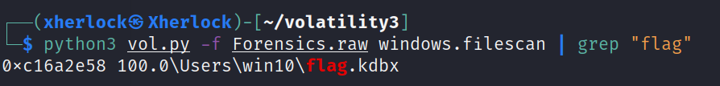

找到flag.kbdx，kbdx是KeePass密码安全创建的数据文件，下载keepass然后打开kbdx文件，直接空密码进入。找到密码

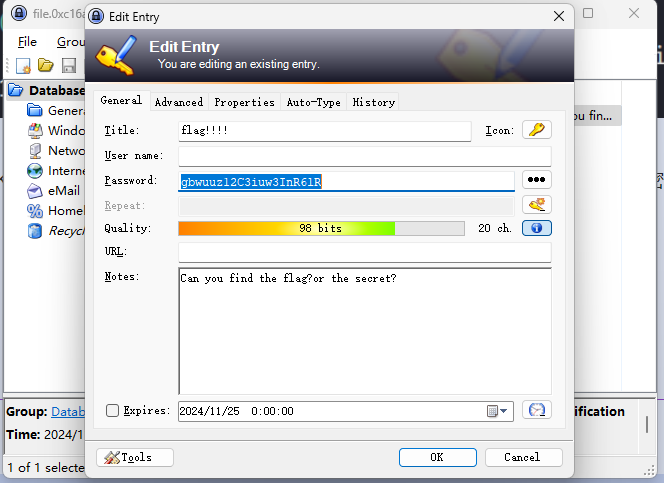

再去找可以找到类似移位密码的东西

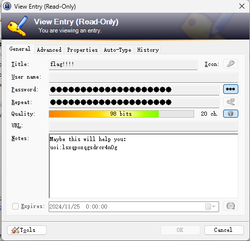

还原是：`key:bingfengwithsh4d0w`，正好是俩出题人

此外提示找二进制文件，直接搜'elf'，但我寻思大部分二进制不是都没有elf结尾的。找到后导出再反编译如下

~~~c
int __fastcall main(int argc, const char **argv, const char **envp)
{
  const char *v3; // rbx
  const char *v4; // rbp

  if ( argc <= 1 )
  {
    printf("Usage: %s <key>\n", *argv);
  }
  else
  {
    v3 = argv[1];
    v4 = argv[2];
    if ( strlen(v3) == 18 )
    {
      sub_11D0(v4, v3);
      if ( !memcmp(v4, &unk_4040, 0x20uLL) )
        printf("right");
    }
  }
  return 0;
}
~~~

主函数检查输入两个参数，前一个是key且长度应该是18，经过sub_11D0加密和unk_4040数组比较

~~~c
__int64 __fastcall sub_11D0(__m128i *a1, __int64 a2)
{
  __m128i v2; // xmm1
  __int64 result; // rax
  __m128i v4; // xmm0
  __m128i v5; // xmm0
  __m128i v6; // xmm0

  v2 = _mm_loadu_si128(a1);
  result = 0LL;
  v4 = _mm_add_epi8(_mm_add_epi8(v2, v2), v2);	// 3倍
  v5 = _mm_add_epi8(v4, v4);	// 6倍
  v6 = _mm_add_epi8(v5, v5);	// 12倍
  *a1 = _mm_sub_epi8(_mm_add_epi8(v6, v6), v2);	// 24-1=23倍
  do
  {
    a1->m128i_i8[result] ^= *(_BYTE *)(a2 + (unsigned int)result % 0x12) ^ 0x33;
    ++result;
  }
  while ( result != 32 );
  return result;
}
~~~

上面对输入flag进行了前16位处理，发现是乘以23可以爆破前十六位

~~~python
cmp = [0x24, 0xA5, 0x58, 0x59, 0x0B, 0x45, 0xEC, 0x94, 0x7A, 0xA6, 0xCE, 0x11, 0x10, 0x65, 0x8E, 0xA6, 0x6C, 0x31, 0x23, 0x05, 0x3E, 0x64, 0x3A, 0x26, 0x6E, 0x26, 0x25, 0x2E, 0x76, 0x34, 0x2E, 0x26]
flag = []
key = b"bingfengwithsh4d0w"
for i in range(len(cmp)):
    flag += [cmp[i]^0x33^key[i%len(key)]]
for i in range(16):
    for j in range(32, 128):
        if (j * 23) & 0xff == flag[i]:
            flag[i] = j
            break
print("".join(map(chr, flag)))
~~~

## Crypto

### RSA

常规rsa解密

~~~python
import gmpy2
from Crypto.Util.number import long_to_bytes

p = 192173332221883349384646293941837353967
q = 172282016556631997385463935089230918399
n = 33108009203593648507706487693709965711774665216872550007309537128959455938833
e = 65537
c = 5366332878961364744687912786162467698377615956518615197391990327680664213847
d = gmpy2.invert(e, (p-1)*(q-1))
m = pow(c, d, n)
print(long_to_bytes(m))
~~~

### 不是套娃

太恶心了，套了无数层

分别考到了摩斯密码、维吉尼亚、cmd5解密、栅栏密码、base100、base64

### 共模攻击

~~~python
n = 19742875423645690846073637620470497648804310111201409901059297083827103813674034450200432098143959078292346910591785265323563248781526393718834491458926162514713269984791730816121181307827624489725923763353393879316510062227511469438742429290073999388690825732236465647396755899136346150862848924231619666069528077790933176798057396704758072769660663756346237040909579775389576227450505746914753205890194457812893098491264392293949768193694560954874603451253079446652049592976605414438411872223250039782381259212718733455588477129910357095186014496957765297934289263536712574572533650393220492870445376144568199077767
c1 = 18676091924461946809127036439355116782539894105245796626898495935702348484076501694838877829307466429933623102626122909782775514926293363853121828819237500456062111805212209491398720528499589486241208820804465599279152640624618194425740368495072591471531868392274503936869225072123214869399971636428177516761675388589238329574042518038702529606188240859751459632643230538522947412931990009143731829484941397093509641320264169403755707495153433568106934850283614529793695266717330769019091782929139589939928210818515744604847453929432990185347112319971445630830477574679898503825626294542336195240055995445217249602983
c2 = 4229417863231092939788858229435938841085459330992709019823280977891432565586698228613770964563920779991584732527715378842621171338649745186081520176123907689669636473919678398014317024138622949923292787095400632018991311254591786179660603414693984024161009444842277220189315861986306573182865656366278782315864366857374874763243428496061153290565891942968876789905670073321426112497113145141539289020571684634406829272902118484670099097148727072718299512735637087933649345419433312872607209633402427461708181971718804026293074540519907755129917132236240606834816534369171888633588190859475764799895410284484045429152
e1e2 = 911*967

import libnum
import gmpy2


def rsa_gong_N_def(e1, e2, c1, c2, n):  # 共模攻击函数
    e1, e2, c1, c2, n = int(e1), int(e2), int(c1), int(c2), int(n)
    print("e1,e2:", e1, e2)
    s = gmpy2.gcdext(e1, e2)
    print("mpz:", s)
    s1 = s[1]
    s2 = s[2]
    if s1 < 0:
        s1 = - s1
        c1 = gmpy2.invert(c1, n)
    elif s2 < 0:
        s2 = - s2
        c2 = gmpy2.invert(c2, n)
    m = (pow(c1, s1, n) * pow(c2, s2, n)) % n
    return int(m)


def de(c, e, n):  # 因为此时的m不是真正的m，而是m^k，所以对m^k进行爆破
    k = 0
    while k < 1000:  # 指定k小于1000
        mk = c + n * k
        flag, true1 = gmpy2.iroot(mk, e)  # 返回的第一个数值为开方数，第二个数值为布尔型，可整除为true，可自行测试
        if True == true1:
            # print(libnum.n2s(int(flag)))
            return flag
        k += 1


for e1 in range(2, e1e2):
    if e1e2 % e1 == 0:  # 爆破可整除的e
        e2 = e1e2 // e1
        c = rsa_gong_N_def(e1, e2, c1, c2, n)
        e = gmpy2.gcd(e1, e2)
        m1 = de(c, e, n)
        if m1:  # 指定输出m1
            print(libnum.n2s(int(m1)))
~~~

### ECBpad

网上有类似题目，改下pwn连接即可

~~~python
from pwn import *

r = remote('nc1.ctfplus.cn', 42948)
def bruteforce():
    flag = ''
    total = 32 - 1
    chars = 'ABCDEFGHIJKLMNOPQRSTUVWXYZ0123456789_{}-~!?#%&@abcdefghijklmnopqrstuvwxyz'

    r.recvuntil(b'[-] ')
    while True:
        payload = '1' * (total - len(flag))
        r.sendline(b"yes")
        r.recvuntil(b'[-] ')
        r.sendline(payload.encode())
        ciphertext_1 = r.recvuntil(b'[-] ').split(b":")[-1].split(b"\n")[0]
        # print(ciphertext_1)
        for c in chars:
            r.sendline(b"yes")
            r.recvuntil(b'[-] ')
            # print(payload + flag + c)
            r.sendline((payload + flag + c).encode())
            ciphertext_2 = r.recvuntil(b'[-] ').split(b":")[-1].split(b"\n")[0]
            # Comapare the middle blocks ([32:64]) of each encrypted text
            if ciphertext_2[32:64] == ciphertext_1[32:64]:
                flag += c
                print(flag)
                break

bruteforce()

~~~

### ezRSA

~~~python
n = 98776098002891477120992675696155328927086322526307976337988006606436135336004472363084175941067711391936982491358233723506086793155908108571814951698009309071244571404116817767749308434991695075517682979438837852005396491907180020541510210086588426719828012276157990720969176680296088209573781988504138607511
c = 9379399412697943604731810117788765980709097637865795846842608472521416662350816995261599566999896411508374352899659705171307916591351157861393506101348972544843696221631571188094524310759046142743046919075577350821523746192424192386688583922197969461446371843309934880019670502610876840610213491163201385965
h = 111518648179416351438603824560360041496706848494616308866057817087295675324528913254309319829895222661760009533326673551072163865
# for i in range(10000):
#     if (i*n + h+2023) % 2024 == 0:
#         # print(i)
#         print(((i*n + h+2023) // 2024).bit_length())
m = (0 * n + h+2023) // 2024

# def phase2(high_m, n, c):
#     R.<x> = PolynomialRing(Zmod(n), implementation='NTL')
#     m = high_m + x
#     M = m((m^3 - c).small_roots()[0])
#     print(hex(int(M))[2:])
#
# phase2(m, n, c)
print(bytes.fromhex("5359437b63727970746f5f69735f766572795f696e746572657374696e675f7768795f646f6e745f796f755f6a6f696e5f75737d"))
~~~

### Number theory

~~~python
from Crypto.Util.number import getPrime, isPrime, long_to_bytes
from gmpy2 import gcd, invert

h0 = 3220497006402049508998763812708472832647814868290156746347730942871191356255789659370553564805270033069126673720344310199953651087754072020225702916105541813428786992668144172000495857408180695235017329451164552864440669887978780387408892281885728829108705426036377534262123812335152528611168777211280571694805002313718755871797426493929314877273385162106226582910473718696585558235361302211164190022765345477880209355073870857330694309139033191510002831755011163554405501084092882774630793037506647051531578470767441695642108269033577519614546722167605348209455599860877630930453549375215766657975702946679735793440
n1 = 20609629372145649869124883931477035418773265506807982287973634398860995335157854064383658546598627777214414513344620919765235474447787454254677033199140440513722365295528339478763686234572386246701669139829187532179573583918405628738545887852577214800663095592976049188005405242091639210252676232732956312108538849591909382864675439965387851084691144379692503823575367370407191667133473482821484955537306602611587604747693171586870973700406072872451067709522642066831289686968535823774273770385924779368338446367102184983154486987531633971065357864924738084803301054789863293592286600424063888458243900130876991944561
h1 = 49194502383195208917988199785355579000471120627698824524136563939112767971337049691779758664899497703009458337602635607307068610164325874221815125058246159504553260658300727486252329656228567456351563661171511248498573151135374757953887871426130912974127123668357951196795364055703535399924661649957282476915345782505912688106575686848420343362888
h2 = 56029812337811022982598747354987989915364610368395101948222609237230875599013444593473706280586983516630982411154519894488542135837471701015074142753084529513202513061481615522865380857058628008542724882609524855349464549317203533208567803034618377155637303135785566874122555481931560957334493233423618193735362609235034574175221191665401074291634
n2 = 21127172569887870569621986802814771398069606826661397979515556618791602174698226712111670185315617811180192688381471253591193212149192104216153890060029438171543010427356810059660168369171504065120474047401466632600230981702536898738744701541132759858595341068713321976579864810553447534204513491008705215041861247277449063318972113826820821732327255577559447446606667162763843696891825420560307688553022453470653875157114663943723258181186659915926780802902213978395961981750159147594076399769386787561910947372748908551775527715538708855235861297549189165238857651886658156332640360898769204102407630920314871304057
c = 5607552428806279725164332098717496105359323731793797865776852054987286366396268835656116948807084338497364746716217052175055013330847114498067023163878490040957130515880922531725226729467904687450269817551037876044274898360914422201634758724176912018795267171627398316542607462818553194467631468793807762529509728325759331142060865432879561622747895422022839077034959965640817419843376693946391886148327389538923557583964708218796910422008150480950732394548385083016293891237783400286493750498647816940000092965104858068292374074379723230507283787259827582725133425982004517180631242028412315096023451549819804660838

q = gcd(n1, pow(2024, n1, n1) - h0)

prime_list = []
for i in range(2 ** 12 + 1, 2 ** 13):
    if isPrime(i):
        prime_list.append(i)
print(prime_list)

from itertools import permutations

p_list = []
for cc in permutations(prime_list, 2):
    result = abs(cc[0] * h1 - cc[1] * h2)
    p = gcd(result, n2)
    if p.bit_length() == 1024:
        print(p)
        p_list.append(p)
print(p_list)

p = p_list[0]
phi = (p-1) * (q-1)
d = invert(65537, phi)
m = pow(c, d, p*q)
print(long_to_bytes(m))
~~~

### X0R

~~~python
from Crypto.Util.number import *
from pwn import xor
enc = 10706859949950921239354880312196039515724907^3062959364761961602614252587049328627114908^4585958212176920650644941909171976689111990
key = xor(long_to_bytes(enc)[:4], "SYC{")
print(xor(long_to_bytes(enc), key))
~~~

### ncoCRT

~~~python
from Cryptodome.Util.number import long_to_bytes

p = [1921232050179818686537976490035, 2050175089402111328155892746480, 1960810970476421389691930930824, 1797713136323968089432024221276, 2326915607951286191807212748022]
c = [1259284928311091851012441581576, 1501691203352712190922548476321, 1660842626322200346728249202857, 657314037433265072289232145909, 2056630082529583499248887436721]
n = 5  # 同余方程个数

"""扩展欧几里得"""


def exgcd(a, b):
    if 0 == b:
        return 1, 0, a
    x, y, q = exgcd(b, a % b)
    x, y = y, (x - a // b * y)
    return x, y, q


"""扩展中国剩余定理"""


def CRT():
    if n == 1:
        if p[0] > c[0]:
            return c[0]
        else:
            return -1

    for i in range(n):
        if p[i] <= c[i]:
            return -1

        x, y, d = exgcd(p[0], p[i])
        if (c[i] - c[0]) % d != 0:
            return -1

        t = p[i] // d
        x = (c[i] - c[0]) // d * x % t
        c[0] = x * p[0] + c[0]
        p[0] = p[0] * p[i] // d
        c[0] = (c[0] % p[0] + p[0]) % p[0]

    return c[0]


ans = CRT()
print(long_to_bytes(ans)[:-23].decode())

~~~

### ecc

前面的sagemath求下，然后再python转为flag

~~~python
# p = 93202687891394085633786409619308940289806301885603002539703165565954917915237
# a = 619398863196797048716428124691975702784687120972413594924940810635907737556
# b = 80546187587527518012258369984400999843218609481640396827119274116524742672463
# k = 58946963503925758614502522844777257459612909354227999110879446485128547020161
# E = EllipticCurve(GF(p),[a,b])
# c1 = E([40485287784577105052142632380297282223290388901294496494726004092953216846111,81688798450940847410572480357702533480504451191937977779652402489509511335169])
# c2 = E([51588540344302003527882762117190244240363885481651104291377049503085003152858, 77333747801859674540077067783932976850711668089918703995609977466893496793359])
# cipher_left = 34210996654599605871773958201517275601830496965429751344560373676881990711573
# cipher_right = 62166121351090454316858010748966403510891793374784456622783974987056684617905
# m = c1 - k * c2
# left = cipher_left//m[0]
# right = cipher_right//m[1] # 不能转int或Integer型，不然结果为0，不知道为什么，很奇怪
# print(int(left),int(right))
#
#
from Crypto.Util.number import long_to_bytes

print(long_to_bytes(1537511878348658386025)+long_to_bytes(543689197014958751245437))
~~~

### highlow

~~~python
from Crypto.Util.number import long_to_bytes
from gmpy2 import invert

c = 11017336122691034053241992293963114590816319844384287448629663672049205892828600396465505710922907685545939978376321927394655458727494361852952898280905220963163625482295222856129164172619564344634365520328815972232825639292605311741655988427166811406091329613627961070231457035303298793651546412496975662225857123805867756651901374507447803198638466304862480202099076813471571495380132563252630789218173007275890600746758285415274434393381125742526014986039652677605642226576741424053749512280825231217420239089105794080707322357602941046822659335487420672699022969372037662958497832065752272061853723653365171768556
n = 14091206320622523674847720139761543154822190879035380245424481267482550932229611965964424965958386255076593911062804299275581742665134207390532802109700225140999812698020838683697375891035625255222001884477214361835101442288725383073334392995186053867261497679234362794914108033574681292656522807928680812726462195077833184018122369579002715900477290345396065912536529290811962117814900448319776590712946259540382461632468634827959957286905806432005632864663985014872365672653476822833921870071851313424903481282350342304819149894610089804321405589433980650340610521659031234826823369114800150883988613877877881069579
pxor = 124229245244085791439650934438639686782423445183921252684721764061493908790073948877623812930339081158169421854801552819088679937157357924845248082716160727839419054107753000815066526032809275137495740454967765165248115412626716101315676902716808647904092798908601183908297141420793614426863816161203796966951

p_high = pxor >> (400+352)
p_low = pxor % (2**400)
print(p_high, p_low, pxor.bit_length())

p = 124229245244085791439650934438639686782423445183921252684721764061493908790073948870293397345832864335042475785728973083585314359884258149847711858397514908905613053545356103378803167400248049812953390169260920922532533579636992286759858305144877980057956578200502522929436738617263575249394601586523948318247
q = n // p
phi = (p-1) * (q-1)
d = invert(65537, phi)
m = pow(c, d, p*q)
print(long_to_bytes(m))

# # sage
# n = 14091206320622523674847720139761543154822190879035380245424481267482550932229611965964424965958386255076593911062804299275581742665134207390532802109700225140999812698020838683697375891035625255222001884477214361835101442288725383073334392995186053867261497679234362794914108033574681292656522807928680812726462195077833184018122369579002715900477290345396065912536529290811962117814900448319776590712946259540382461632468634827959957286905806432005632864663985014872365672653476822833921870071851313424903481282350342304819149894610089804321405589433980650340610521659031234826823369114800150883988613877877881069579
# p_high = 5244053423075647293050369760845296155021923134625924343880602074121699910488679402
# p_low = 46291966435171693820219825274244375014507574686529957758905749683380065400998575584457395943124858249361545281828683303
# mod1 = 256 ^ 50
# mod2 = 256 ^ 94
# PR.<x> = PolynomialRing(Zmod(n))
# f = p_high * mod2 + x * mod1 + p_low
# f = f.monic()
# out_p = f.small_roots(2 ^ 352,beta = 0.4,epsilon = 0.03)
#
# p = gcd(int(f(out_p[0])),n)
# print(p)
# https://blog.csdn.net/XiongSiqi_blog/article/details/130113175
~~~

### dp

~~~python
import gmpy2 as gp

e = 65537
n = 157667866005866043809675592336288962106125998780791920007920833145068421861029354497045918471672956655205541928071253023208751202980457919399456984628429198438149779785543371372206661553180051432786094530268099696823142821724314197245158942206348670703497441629288741715352106143317909146546420870645633338871
dp = 2509050304161548479367108202753097217949816106531036020623500808413533337006939302155166063392071003278307018323129989037561756887882853296553118973548769

c = 127916287434936224964530288403657504450134210781148845328357237956681373722556447001247137686758965891751380034827824922625307521221598031789165449134994998397717982461775225812413476283147124013667777578827293691666320739053915493782515447112364470583788127477537555786778672970196314874316507098162498135060

for i in range(1, e):
    if (dp * e - 1) % i == 0:
        if n % (((dp * e - 1) // i) + 1) == 0:
            p = ((dp * e - 1) // i) + 1
            q = n // (((dp * e - 1) // i) + 1)
            phi = (q - 1) * (p - 1)
            d = gp.invert(e, phi)
            m = pow(c, d, n)

print(m)

print(bytes.fromhex(hex(m)[2:]))

~~~

### LLL

~~~python
# p = 131724494512065658801039766546788821718063963144467818735768040631367069153816254855229655449559099188694403260044990366292026916085340250077198735215774149087025577263769846650728593180101073940507285459917860726551385227481715873503612683249433020201729190862430476054822102865441136763977415824331858801617
# b = 169790849804323540946197204708402762862586197604183102589270741859708550301920348112941305999764092197996929298474590062625556806793613268527763774013772685954699561684244945434843656515307801882995934869499880288594142919381501796488815033294127591623260894764750214588993456840404443515671353802614450411717
# a = 87985708831523238980948938165414984318379459926002798504435964538203443877988599888615810231215118828138306895572062833107988965151522391460216837691927960249874511818878134399363147008042562222910234739940697553852540265617603482995091203105040187460485673579382171260197291783748886765929376179151804062085
# M = Matrix(ZZ, [[p, 0, 0], [-b, 1, 0], [a, 0, 2 ** 400]])  # Matrix()函数通常采用数值作为参数并返回一个矩阵对象
# c, m, k = M.LLL()[0]
# print(m)
'''LLL 算法是一种格约化算法，用于查找格的约简基。
LLL 方法返回一个由两个元素组成的元组：
简化基和将原始基转换为简化基的矩阵'''

from Crypto.Util.number import *
m = 178031712611238596731249743701069017647681195469247290391686157388613750102558209749690172438492797
flag = long_to_bytes(int(m))
print(flag)
~~~

### 凯撒加密

在线cyberchef即可

### easy_LLL

~~~python
# p = 114770017142688382362918268558878024848633097928402093647914503696492833723966801545716194546592346338592062332306371502256979159033965343002132956304625610134374822329402499359634555710129039614275145668904822690744696925414716152630310915301980153974374009140517084226870950134327432658087834138202887501571
# b = 177876163920838720585474640511391249051418827853372387342635245341495792468826199544624082182728094652999191797576747605771062756630817438777653951772485569478516324903956113309190795622258346824643390004835397272889256696087356239515881459115499360779486974615331766141255410923960657795391638070660994726539
# a = 25269157674120082500323585451842928560404625967932662908517922704871828513397233858615005968124017428639853960550468542894270451871612496631645175015826203493265945456529848647562285359912541672751550625137876486033809099678631009005979648033707322772087110235116987698692692467320479776960630479772236446980
# M = Matrix(ZZ, [[p, 0, 0], [-b, 1, 0], [a, 0, 2 ** 400]])  # Matrix()函数通常采用数值作为参数并返回一个矩阵对象
# c, m, k = M.LLL()[0]
# print(m)
'''LLL 算法是一种格约化算法，用于查找格的约简基。
LLL 方法返回一个由两个元素组成的元组：
简化基和将原始基转换为简化基的矩阵'''

from Crypto.Util.number import *
m = 37699681559436018350327914966284743321192587012153263983384281146421292382333
flag = long_to_bytes(int(m))
print(flag)
~~~

### nc

爆破

```python
from pwn import *
import re
import string
import itertools
from hashlib import sha256

r = remote("nc1.ctfplus.cn", port=15302)
content = r.recvuntil(b": ").decode()
print(content)
proof = re.findall(r'X\+(.*?)\)', content)[0]
sha256_value = re.findall(r'== (.*?)\n', content)[0]
choices = string.ascii_letters+string.digits
flag = []
for c in itertools.product(choices, repeat=4):
    if sha256(("".join(c)+proof).encode()).hexdigest() == sha256_value:
        print("".join(c))
        r.sendline("".join(c).encode())
        r.recvuntil(b"[-] ")
        for i in range(1, 33):
            r.sendline(str(i).encode())
            content = r.recvuntil(b"[-] ")
            flag.append(content)
        break
flag = "".join(chr(i[4]) for i in flag)
print(flag)
```

## Misc

### Truth of Word

bandzip解压word，数据都在word文件夹下

1. document.xml里有`Flag01=SYC{W0_H@5}`

2. word里打开visual basic编辑器可以看到`Flag02=@_Ama1n9_`

   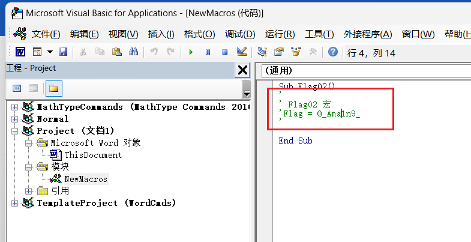

3. media文件夹里的图片有`Flag03=StrUCtu3e!}`

### 2024 geek challenge!签到

公众号获取

### doSomeMath

构造脚本即可，看i用的是内置函数ge，n2结果为2

~~~python
num = 99*100^60
print(bin(num))
n2 = "(().__ge__(())+().__ge__(()))"
l = []
while num:
    l.append(num % 2)
    num //= 2
s = ""
for i in range(len(l)):
    if l[i]:
        s += i * (n2 + "*")
        s = s[:-1] + "+"
print(s[:-1])
print(eval(s[:-1]))
~~~

### Welcome_jail

~~~python
# s = "ls"
# s = "cat start.sh"
s = "env"
exp = ""
for i in range(len(s)):
    exp += f"chr({ord(s[i])})+"
print(f"[].__class__.__mro__[-1].__subclasses__()[-4].__init__.__globals__[(bytes([115])+bytes([121])+bytes([115])+bytes([116])+bytes([101])+bytes([109])).decode()](({exp[:-1]})).decode()")
~~~

### ez_pcap_1

直接wireshark导出smb对象找到flag

### ez_jpg

先base64解密得到16进制字符串，再反转存储为字节得到jpg，然后再脚本爆破宽度在640的时候得到flag

### ez_climbstairs

~~~python
from pwn import *

class Solution:
    def climbStairs(self, n: int) -> int:
        if n <= 3:
            return n
        # 初始化dp数组，用来保存每个台阶的方法数
        dp = [0] * (n + 1)
        dp[1] = 1
        dp[2] = 2
        dp[3] = 4
        # 从第3个台阶开始，根据递推公式计算方法数
        for i in range(4, n + 1):
            dp[i] = dp[i - 1] + dp[i - 2] +dp[i - 3]
        return dp[n]

sys.set_int_max_str_digits(100000000)
r = remote("nc1.ctfplus.cn", port=30927)
s = Solution()
for i in range(100):
    content = r.recvuntil("：")
    stairs = content.decode().split()[1]
    count = s.climbStairs(int(stairs))
    print(stairs)
    r.sendline(str(count))
    r.recvline()
print(r.recv())
~~~

### cimbar

这题我很笨，没找到官网解法，只按照官网给的图例逆向推理了下每个字符对应的4bit值

~~~python
flag = [0b01010011, 0b01011001, 0b01000011, 0b01111011,
        0b01000001, 0b01101110, 0b00110000, 0b01110100,
        0b01101000, 0b00110011, 0b01110010, 0b01011111,
        0b01000001, 0b01101101, 0b01000000, 0b01111010,
        0b00110001, 0b01101110, 0b00111001, 0b01011111,
        0b01010001, 0b01010010, 0b01011111, 0b01000011,
        0b01101111, 0b00110100, 0b01100101, 0b01111101]
print("".join(map(chr,flag)))
print(bin(ord("}")))
# 1100 1110 0000
~~~

擦，有[官方解释](https://github.com/sz3/libcimbar/blob/master/DETAILS.md)的，做题时候没找到
