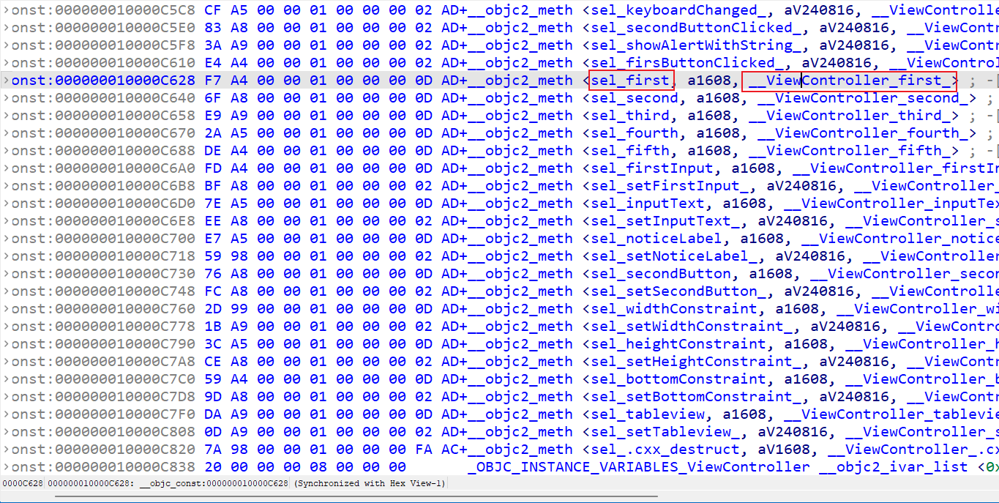

# ByteCTF

体验很差，题目是不错，但是碰到的都是我的技术盲区，什么反序列化（flatbuffer）、flutter app、ios逆向动态调试等等，一道都做不出来，太菜了

## Reverse

### byteapk

思路没错，就是用blutter脚本还原符号表，定位关键词，但我找错位置了，应该分析的是librust_lib_babyapk.so文件

详细记录下这类题目

首先是flutter扫盲，chatgpt介绍如下

> Flutter 是一个由 Google 开发的开源 UI 软件开发工具包，用于构建跨平台的应用程序。它允许开发者使用 Dart 编程语言编写一次代码，然后在 iOS、Android、Web 和桌面等多个平台上运行。Flutter 的主要特点包括：
>
> 1. **高性能**：Flutter 通过直接与底层操作系统交互，提供接近原生应用的性能。
> 2. **快速开发**：提供热重载功能，开发者可以实时查看代码更改的效果。
> 3. **丰富的组件**：提供了丰富的预制组件和工具，可以轻松构建美观的用户界面。
> 4. **高度可定制**：允许开发者自定义 UI 组件，创建独特的应用外观。
>
> Flutter 适合用于构建移动应用、Web 应用和桌面应用，因其开发效率和灵活性受到广泛欢迎。

jeb反编译java层可以看到大量flutter字眼，这时可以确定其为flutter开发

https://juejin.cn/post/7115275762634063903 博客介绍了flutter逆向的难点，最主要的是逆向工程工具无法定位Dart对象的使用，无法分析so文件

现有针对ctf中flutter用的逆向工具基本都是[blutter](https://github.com/worawit/blutter)，当前版本的B(l)utter仅支持Android libapp.so（ARM64），可以帮助广大研究人员对基于Flutter开发的移动端应用程序进行逆向工程分析。挺不错的，支持windows环境下逆向

具体做法是jeb提取Libraraies下arm64-v8a所有的so文件，然后在blutter根目录执行python代码

~~~
python blutter.py path/to/app/lib/arm64-v8a out_dir
~~~

得到output目录如下，核心是ida_script和asm文件夹

asm文件夹下可以找到babyapk文件夹，正好是apk名，里面有src文件夹和main.dart，打开dart查找关键词可以看到flag格式

接着向下找可以定位判断语句，上面是simple.dart调用的一个`m3N4B6V6`函数

去src目录下找到simple.dart，很短基本可以看出来调用了rust api

~~~dart
// lib: , url: package:babyapk/src/rust/api/simple.dart

// class id: 1048594, size: 0x8
class :: {

  static _ m3N4B5V6(/* No info */) {
    // ** addr: 0x265088, size: 0x98
    // 0x265088: EnterFrame
    //     0x265088: stp             fp, lr, [SP, #-0x10]!
    //     0x26508c: mov             fp, SP
    // 0x265090: AllocStack(0x8)
    //     0x265090: sub             SP, SP, #8
    // 0x265094: SetupParameters(dynamic _ /* r1 => r2, fp-0x8 */)
    //     0x265094: mov             x2, x1
    //     0x265098: stur            x1, [fp, #-8]
    // 0x26509c: CheckStackOverflow
    //     0x26509c: ldr             x16, [THR, #0x38]  ; THR::stack_limit
    //     0x2650a0: cmp             SP, x16
    //     0x2650a4: b.ls            #0x265118
    // 0x2650a8: r0 = InitLateStaticField(0x4d8) // [package:babyapk/src/rust/frb_generated.dart] RustLib::instance
    //     0x2650a8: ldr             x0, [THR, #0x68]  ; THR::field_table_values
    //     0x2650ac: ldr             x0, [x0, #0x9b0]
    //     0x2650b0: ldr             x16, [PP, #0x40]  ; [pp+0x40] Sentinel
    //     0x2650b4: cmp             w0, w16
    //     0x2650b8: b.ne            #0x2650c8
    //     0x2650bc: add             x2, PP, #8, lsl #12  ; [pp+0x8278] Field <RustLib.instance>: static late final (offset: 0x4d8)
    //     0x2650c0: ldr             x2, [x2, #0x278]
    //     0x2650c4: bl              #0x3b9dc8
    // 0x2650c8: LoadField: r1 = r0->field_b
    //     0x2650c8: ldur            w1, [x0, #0xb]
    // 0x2650cc: DecompressPointer r1
    //     0x2650cc: add             x1, x1, HEAP, lsl #32
    // 0x2650d0: cmp             w1, NULL
    // 0x2650d4: b.eq            #0x2650f8
    // 0x2650d8: LoadField: r0 = r1->field_f
    //     0x2650d8: ldur            w0, [x1, #0xf]
    // 0x2650dc: DecompressPointer r0
    //     0x2650dc: add             x0, x0, HEAP, lsl #32
    // 0x2650e0: mov             x1, x0
    // 0x2650e4: ldur            x2, [fp, #-8]
    // 0x2650e8: r0 = crateApiSimpleM3N4B5V6()
    //     0x2650e8: bl              #0x26519c  ; [package:babyapk/src/rust/frb_generated.dart] RustLibApiImpl::crateApiSimpleM3N4B5V6
    // 0x2650ec: LeaveFrame
    //     0x2650ec: mov             SP, fp
    //     0x2650f0: ldp             fp, lr, [SP], #0x10
    // 0x2650f4: ret
    //     0x2650f4: ret             
    // 0x2650f8: r0 = StateError()
    //     0x2650f8: bl              #0x188914  ; AllocateStateErrorStub -> StateError (size=0x10)
    // 0x2650fc: mov             x1, x0
    // 0x265100: r0 = "flutter_rust_bridge has not been initialized. Did you forget to call `await RustLib.init();`\? (If you have configured a different lib name, change `RustLib` to your name.)"
    //     0x265100: add             x0, PP, #8, lsl #12  ; [pp+0x8420] "flutter_rust_bridge has not been initialized. Did you forget to call `await RustLib.init();`\? (If you have configured a different lib name, change `RustLib` to your name.)"
    //     0x265104: ldr             x0, [x0, #0x420]
    // 0x265108: StoreField: r1->field_b = r0
    //     0x265108: stur            w0, [x1, #0xb]
    // 0x26510c: mov             x0, x1
    // 0x265110: r0 = Throw()
    //     0x265110: bl              #0x3b9f2c  ; ThrowStub
    // 0x265114: brk             #0
    // 0x265118: r0 = StackOverflowSharedWithoutFPURegs()
    //     0x265118: bl              #0x3bbe84  ; StackOverflowSharedWithoutFPURegsStub
    // 0x26511c: b               #0x2650a8
  }
}
~~~

我在比赛中按照其他教程还原了下ida的符号表，利用的正是blutter输出的`ida_script`。ida64打开libapp.so文件，然后File-Script file找到ida_script下的addName.py，打开后ida会自动还原大部分函数符号名

我们可以搜到那个核心函数

这时候要去librust\_lib\_babyapk.so里搜索simple字眼，找和rust相关的地方【就是这里我比赛时候一直在分析libapp导致错过了解出flag的机会】

定位函数

~~~c
__int64 __fastcall sub_3AEE0(unsigned __int8 *a1, __int64 a2)
{//...
  v57 = 0LL;
  v58 = 4LL;
  if ( a2 != 36 )
    return 0LL;
  v2 = byte_18E46[*a1];
  if ( (_DWORD)v2 == 36 )
    return 0LL;
  v3 = byte_18E46[a1[v2]] + v2;
  if ( v3 == 36 )
    return 0LL;
  v4 = v3 + byte_18E46[a1[v3]];
  if ( v4 == 36 )
    return 0LL;
  v5 = v4 + byte_18E46[a1[v4]];
  if ( v5 == 36 )
    return 0LL;
  v6 = v5 + byte_18E46[a1[v5]];
  if ( v6 == 36 )
    return 0LL;
  v7 = v6 + byte_18E46[a1[v6]];
  if ( v7 == 36 )
    return 0LL;
  v8 = v7 + byte_18E46[a1[v7]];
  if ( v8 == 36 )
    return 0LL;
  v9 = v8 + byte_18E46[a1[v8]];
  if ( v9 == 36 )
    return 0LL;
  v10 = a1[v9];
  if ( ((char)a1[v9] & 0x80000000) != 0 )	// 这一步明显恒等于0
  {
    if ( v10 < 0xE0 )
    {
      v10 = a1[v9 + 1] & 0x3F | ((v10 & 0x1F) << 6);
    }
    else
    {
      v11 = a1[v9 + 2] & 0x3F | ((a1[v9 + 1] & 0x3F) << 6);
      if ( v10 < 0xF0 )
        v10 = v11 | ((v10 & 0x1F) << 12);
      else
        v10 = a1[v9 + 3] & 0x3F | (v11 << 6) & 0xFFE3FFFF | ((v10 & 7) << 18);
    }
  }
  if ( v10 != '-' )
    return 0LL;
  v12 = v9 + byte_18E46[a1[v9]];
  if ( v12 == 36 )
    return 0LL;
  v13 = v12 + byte_18E46[a1[v12]];
  if ( v13 == 36 )
    return 0LL;
  v14 = v13 + byte_18E46[a1[v13]];
  if ( v14 == 36 )
    return 0LL;
  v15 = v14 + byte_18E46[a1[v14]];
  if ( v15 == 36 )
    return 0LL;
  v16 = v15 + byte_18E46[a1[v15]];
  if ( v16 == 36 )
    return 0LL;
  v18 = a1[v16];
  if ( ((char)a1[v16] & 0x80000000) != 0 )
  {
    if ( v18 < 0xE0 )
    {
      v18 = a1[v16 + 1] & 0x3F | ((v18 & 0x1F) << 6);
    }
    else
    {
      v19 = a1[v16 + 2] & 0x3F | ((a1[v16 + 1] & 0x3F) << 6);
      if ( v18 < 0xF0 )
        v18 = v19 | ((v18 & 0x1F) << 12);
      else
        v18 = a1[v16 + 3] & 0x3F | (v19 << 6) & 0xFFE3FFFF | ((v18 & 7) << 18);
    }
  }
  if ( v18 != 45 )
    return 0LL;
  v20 = v16 + byte_18E46[a1[v16]];
  if ( v20 == 36 )
    return 0LL;
  v21 = v20 + byte_18E46[a1[v20]];
  if ( v21 == 36 )
    return 0LL;
  v22 = v21 + byte_18E46[a1[v21]];
  if ( v22 == 36 )
    return 0LL;
  v23 = v22 + byte_18E46[a1[v22]];
  if ( v23 == 36 )
    return 0LL;
  v24 = v23 + byte_18E46[a1[v23]];
  if ( v24 == 36 )
    return 0LL;
  v25 = a1[v24];
  if ( ((char)a1[v24] & 0x80000000) != 0 )
  {
    if ( v25 < 0xE0 )
    {
      v25 = a1[v24 + 1] & 0x3F | ((v25 & 0x1F) << 6);
    }
    else
    {
      v26 = a1[v24 + 2] & 0x3F | ((a1[v24 + 1] & 0x3F) << 6);
      if ( v25 < 0xF0 )
        v25 = v26 | ((v25 & 0x1F) << 12);
      else
        v25 = a1[v24 + 3] & 0x3F | (v26 << 6) & 0xFFE3FFFF | ((v25 & 7) << 18);
    }
  }
  if ( v25 != 45 )
    return 0LL;
  v27 = v24 + byte_18E46[a1[v24]];
  if ( v27 == 36 )
    return 0LL;
  v28 = v27 + byte_18E46[a1[v27]];
  if ( v28 == 36 )
    return 0LL;
  v29 = v28 + byte_18E46[a1[v28]];
  if ( v29 == 36 )
    return 0LL;
  v30 = v29 + byte_18E46[a1[v29]];
  if ( v30 == 36 )
    return 0LL;
  v31 = v30 + byte_18E46[a1[v30]];
  if ( v31 == 36 )
    return 0LL;
  v32 = a1[v31];
  if ( ((char)a1[v31] & 0x80000000) != 0 )
  {
    if ( v32 < 0xE0 )
    {
      v32 = a1[v31 + 1] & 0x3F | ((v32 & 0x1F) << 6);
    }
    else
    {
      v33 = a1[v31 + 2] & 0x3F | ((a1[v31 + 1] & 0x3F) << 6);
      if ( v32 < 0xF0 )
        v32 = v33 | ((v32 & 0x1F) << 12);
      else
        v32 = a1[v31 + 3] & 0x3F | (v33 << 6) & 0xFFE3FFFF | ((v32 & 7) << 18);
    }
  }
  if ( v32 != 45 )
    return 0LL;
  v34 = 0LL;
  v35 = 0LL;
  while ( 1 )
  {
    v36 = a1[v35];
    if ( ((char)a1[v35] & 0x80000000) != 0 )
    {
      v37 = a1[v35 + 1] & 0x3F;
      if ( v36 < 0xE0 )
      {
        v35 += 2LL;
        v36 = v37 & 0xFFFFF83F | ((v36 & 0x1F) << 6);
      }
      else
      {
        v38 = v35 + 3;
        v39 = a1[v35 + 2] & 0x3F | (v37 << 6);
        if ( v36 < 0xF0 )
        {
          v36 = v39 | ((v36 & 0x1F) << 12);
          v35 += 3LL;
        }
        else
        {
          v35 += 4LL;
          v36 = a1[v38] & 0x3F | (v39 << 6) & 0xFFE3FFFF | ((v36 & 7) << 18);
        }
      }
    }
    else
    {
      ++v35;
    }
    if ( v36 != 45 )
      break;
LABEL_55:
    if ( v35 == 36 )
      goto LABEL_67;
  }
  if ( v36 != 1114112 )
  {
    if ( v34 == v57 )
      sub_3B688(&v57);
    *(_DWORD *)(v58 + 4 * v34++) = v36;
    v59 = v34;
    goto LABEL_55;
  }
LABEL_67:
  v40 = v34 >> 3;
  v41 = 0LL;
  if ( (v34 & 7) != 0 )
    ++v40;
  v42 = v40 + 1;
  v43 = 8LL;
  while ( --v42 )
  {
    if ( v43 > v34 )
      goto LABEL_88;
    if ( v43 - 8 >= 0x19 )
    {
      v43 = 40LL;
      v34 = 32LL;
LABEL_88:
      sub_7674C(v43, v34, (__int64)&off_801E0);
    }
    v45 = *(_DWORD *)(v58 + v41 * 4 + 8);
    v44 = *(_DWORD *)(v58 + v41 * 4 + 12);
    v46 = *(_DWORD *)(v58 + v41 * 4);
    v47 = *(_DWORD *)(v58 + v41 * 4 + 4);
    v48 = *(_DWORD *)(v58 + v41 * 4 + 16);
    v49 = *(_DWORD *)(v58 + v41 * 4 + 20);
    v50 = *(_DWORD *)(v58 + v41 * 4 + 24);
    v51 = *(_DWORD *)(v58 + v41 * 4 + 28);
    if ( v51 + v47 * v44 * v49 - (v46 + v50 + v45 * v48) == dword_18F60[v41] )
    {
      v52 = v46 * v49;
      if ( v44 - v48 - v46 * v49 + v51 * v47 + v45 + v50 == dword_18F60[v41 + 1]
        && v52 - (v48 + v51 * v47) + v45 + v50 * v44 == dword_18F60[v41 + 2] )
      {
        v53 = v48 * v46;
        if ( v47 + v48 * v46 - (v51 + v45) + v50 * v49 * v44 == dword_18F60[v41 + 3]
          && v49 * v44 + v47 + v45 * v48 - (v50 + v51 * v46) == dword_18F60[v41 + 4]
          && v52 + v47 * v44 + v45 - (v50 + v48 * v51) == dword_18F60[v41 + 5]
          && v51 - v47 + v45 * v49 + v50 - v53 * v44 == dword_18F60[v41 + 6] )
        {
          v43 += 8LL;
          v54 = v44 - v51 - (v47 + v49);
          v55 = &dword_18F60[v41];
          v41 += 8LL;
          if ( v54 + v53 + v50 * v45 == v55[7] )
            continue;
        }
      }
    }
    if ( v57 )
      sub_3B870(v58, 4 * v57, 4LL);
    return 0LL;
  }
  if ( v57 )
    sub_3B870(v58, 4 * v57, 4LL);
  return 1LL;
}
~~~

第一眼看到很多等式，每次八个等式求解

~~~python
from z3 import Solver, BitVec, sat

result = [0x0001EE59, 0x0000022A, 0x00001415, 0x00040714, 0x000013E0, 0x000008B8, 0xFFFDCEA0, 0x0000313B, 0x0003D798, 0xFFFFFE6B, 0x00000C4E, 0x00023884, 0x0000008D, 0x00001DB4, 0xFFFC1328, 0x00001EAC, 0x00043C64, 0x0000142B, 0xFFFFF622, 0x00023941, 0xFFFFEF6D, 0x0000120C, 0xFFFBD30F, 0x00001EBE, 0x00045158, 0xFFFFEF66, 0x00001D3F, 0x0004C46B, 0xFFFFF97A, 0x00001BFD, 0xFFFBA235, 0x00001ED2]
flag = ""
for i in range(0, 32, 8):
    s = Solver()
    v = [BitVec(f"v{j}", 32) for j in range(8)]
    v45 = v[2]
    v44 = v[3]
    v46 = v[0]
    v47 = v[1]
    v48 = v[4]
    v49 = v[5]
    v50 = v[6]
    v51 = v[7]
    s.add(v51 + v47 * v44 * v49 - (v46 + v50 + v45 * v48) == result[i])
    s.add(v44 - v48 - v46 * v49 + v51 * v47 + v45 + v50 == result[i + 1])
    v52 = v46 * v49
    s.add(v52 - (v48 + v51 * v47) + v45 + v50 * v44 == result[i + 2])
    s.add(v47 + v48 * v46 - (v51 + v45) + v50 * v49 * v44 == result[i + 3])
    s.add(v49 * v44 + v47 + v45 * v48 - (v50 + v51 * v46) == result[i + 4])
    s.add(v52 + v47 * v44 + v45 - (v50 + v48 * v51) == result[i + 5])
    v53 = v48 * v46
    s.add(v51 - v47 + v45 * v49 + v50 - v53 * v44 == result[i + 6])
    v54 = v44 - v51 - (v47 + v49)
    s.add(v54 + v53 + v50 * v45 == result[i + 7])
    for j in range(8):
        s.add(v[j] >= 0, v[j] <= 0x7f)
    if s.check() == sat:
        ans = s.model()
        for item in v:
            flag += chr(ans[item].as_long())
print(flag, len(flag))	# 32e750c8fb214562af22973fb5176b9c 32
~~~

解正好是32位，但和前面不对应（长度36），往前分析发现如下代码，插入了横线正好是flag格式

~~~c
  if ( v10 != '-' )
    return 0LL;
~~~

再去看发现正好四次判断，发现跟着byte_18E46数组，分别出现7、5、5、5次，猜测`-`位置在7、12、17、22位置

得到flag `ByteCTF{32e750c8-fb21-4562-af22-973fb5176b9c}`

也可以分析代码逻辑，计算位置，打印每次a1里的下标

~~~python
flag = "32e750c8fb214562af22973fb5176b9c"
table = [0x01, 0x01, 0x01, 0x01, 0x01, 0x01, 0x01, 0x01, 0x01, 0x01, 0x01, 0x01, 0x01, 0x01, 0x01, 0x01, 0x01, 0x01, 0x01, 0x01, 0x01, 0x01, 0x01, 0x01, 0x01, 0x01, 0x01, 0x01, 0x01, 0x01, 0x01, 0x01, 0x01, 0x01, 0x01, 0x01, 0x01, 0x01, 0x01, 0x01, 0x01, 0x01, 0x01, 0x01, 0x01, 0x01, 0x01, 0x01, 0x01, 0x01, 0x01, 0x01, 0x01, 0x01, 0x01, 0x01, 0x01, 0x01, 0x01, 0x01, 0x01, 0x01, 0x01, 0x01, 0x01, 0x01, 0x01, 0x01, 0x01, 0x01, 0x01, 0x01, 0x01, 0x01, 0x01, 0x01, 0x01, 0x01, 0x01, 0x01, 0x01, 0x01, 0x01, 0x01, 0x01, 0x01, 0x01, 0x01, 0x01, 0x01, 0x01, 0x01, 0x01, 0x01, 0x01, 0x01, 0x01, 0x01, 0x01, 0x01, 0x01, 0x01, 0x01, 0x01, 0x01, 0x01, 0x01, 0x01, 0x01, 0x01, 0x01, 0x01, 0x01, 0x01, 0x01, 0x01, 0x01, 0x01, 0x01, 0x01, 0x01, 0x01, 0x01, 0x01, 0x01, 0x01, 0x01, 0x01, 0x00, 0x00, 0x00, 0x00, 0x00, 0x00, 0x00, 0x00, 0x00, 0x00, 0x00, 0x00, 0x00, 0x00, 0x00, 0x00, 0x00, 0x00, 0x00, 0x00, 0x00, 0x00, 0x00, 0x00, 0x00, 0x00, 0x00, 0x00, 0x00, 0x00, 0x00, 0x00, 0x00, 0x00, 0x00, 0x00, 0x00, 0x00, 0x00, 0x00, 0x00, 0x00, 0x00, 0x00, 0x00, 0x00, 0x00, 0x00, 0x00, 0x00, 0x00, 0x00, 0x00, 0x00, 0x00, 0x00, 0x00, 0x00, 0x00, 0x00, 0x00, 0x00, 0x00, 0x00, 0x00, 0x00, 0x02, 0x02, 0x02, 0x02, 0x02, 0x02, 0x02, 0x02, 0x02, 0x02, 0x02, 0x02, 0x02, 0x02, 0x02, 0x02, 0x02, 0x02, 0x02, 0x02, 0x02, 0x02, 0x02, 0x02, 0x02, 0x02, 0x02, 0x02, 0x02, 0x02, 0x03, 0x03, 0x03, 0x03, 0x03, 0x03, 0x03, 0x03, 0x03, 0x03, 0x03, 0x03, 0x03, 0x03, 0x03, 0x03, 0x04, 0x04, 0x04, 0x04, 0x04, 0x00, 0x00, 0x00, 0x00, 0x00, 0x00, 0x00, 0x00, 0x00, 0x00, 0x00]
check = 0
for i in [7, 5, 5, 5, 5]:
    for j in range(i):
        check += table[ord(flag[check])]
        print(check, end=" ")
    v10 = ord(flag[check])
    # break
    print("\n", v10)
"""
1 2 3 4 5 6 7 
 56
8 9 10 11 12 
 52
13 14 15 16 17 
 102
18 19 20 21 22 
 51
23 24 25 26 27 
 55
"""
~~~

可以下标是按照顺序取的，因此直接保证每行最后一个下标为"-"即可得到正确flag

### ByteBuffer

比赛时候很明显看出有逻辑

有点有线，但比赛实在受打击，查了半天没思路。赛后才遗憾自己怎么不去提取下点和线的结构体，试着画图

难点主要是找准Edge的两个点id，Dot的坐标

~~~python
import struct

with open("ByteBuffer.bin", "rb") as f:
    data = f.read()
k = 0x3ac
Edge = []
size = 9
while k < 0x11f0:
    Edge.append(data[k:k+4*size])
    k += 4*size
    if k > 0x10e0:
        size = 8
for i in range(len(Edge)):
    e = Edge[i]
    base = 8
    Edge[i] = (struct.unpack("<I", e[base:base+4])[0], struct.unpack("<I", e[base+4:base+8])[0])
Edge.append((2, 1))     # 手动添加
print(Edge)

k = 0x1230
Dot = []
size = 8
while k < 0x1f80:
    Dot.append(data[k:k+4*size])
    k += 4*size
    if k == 0x14d0:
        size = 7
for i in range(len(Dot)):
    d = Dot[i]
    base = 4
    Dot[i] = (struct.unpack("<I", d[base:base+4])[0], struct.unpack("<I", d[base+4:base+8])[0])
Dot = Dot[::-1]
Dot.insert(1, (25, 75))    # 手动添加
print(Dot)

import matplotlib.pyplot as plt

plt.figure(figsize=(12, 12))
# 绘制点
for point_id, (x, y) in enumerate(Dot):
    plt.scatter(x, y)
    plt.text(x, y, point_id+1)

# 绘制线段
for e in Edge:
    x_values = [Dot[e[0]-1][0], Dot[e[1]-1][0]]
    y_values = [Dot[e[0]-1][1], Dot[e[1]-1][1]]
    plt.plot(x_values, y_values, color='blue', marker='o')
plt.gca().invert_yaxis()
# 添加标签和图例
plt.xlabel('X Axis')
plt.ylabel('Y Axis')
plt.title('Dot and Edge')
plt.legend()
plt.axis('equal')
# 显示图形
plt.show()
~~~

要反转y轴，反转完后就是flag

### ByteKit

> One of our physical server have been hacked, we re-install the OS but there is still something there. Can you find it? 
>
> 1. execute "./run_qemu.sh" and login with username root and empty password 
> 2. after login, execute "./getflag.sh <your input>" 
> 3. it will reboot 
> 4. after reboot, re-login with root and empty password, execute "./getflag.sh <your input>" again, and you will get your flag.

可以提取文件：https://www.freebuf.com/articles/system/246025.html，使用[UEFI_RETool](https://github.com/yeggor/UEFI_RETool)

~~~
 python .\uefi_retool.py get-images E:\CTF\CTF-Writeups\ByteCTF_2024\Reverse\ByteKit\bios.bin
~~~

在工具根目录下的modules目录里可以找到`ByteKitLoaderDxe`文件，里面应该是代码逻辑，ida64查看发现是OLLVM

新学习到了一个ida反编译插件，可以去除平坦化[d810](https://gitlab.com/eshard/d810)

~~~c
EFI_STATUS __fastcall ModuleEntryPoint(EFI_HANDLE ImageHandle, EFI_SYSTEM_TABLE *SystemTable)
{//...
  v37[4] = (__int64)&SystemTable->Hdr.Revision;
  v37[1] = (__int64)v37;
  v26 = 0;
  LOBYTE(v31) = 1;
  LOBYTE(v32) = ImageHandle != 0i64;
  qword_1CA90 = (__int64)SystemTable;
  LOBYTE(v33) = 1;
  LOBYTE(v34) = SystemTable != 0i64;
  qword_1CA80 = (__int64)SystemTable->BootServices;
  LOBYTE(v25) = 1;
  LOBYTE(v19) = qword_1CA80 != 0;
  v20 = 0i64;
  for ( i = -1227761683; i != 23738806; i = 23738806 )
    qword_1CA88 = (__int64)SystemTable->RuntimeServices;
  LOBYTE(v24) = 0;
  v35 = 0;
  for ( j = -494123489; j == -494123489; j = 857817886 )
    ;
  if ( (unsigned __int8)sub_200() != 0 )
  {
    v16 = (*(__int64 (__fastcall **)(__int64, _QWORD, __int64 *))(qword_1CA80 + 64))(
            4i64,
            (unsigned int)dword_3A28,
            &qword_1CA78);
    if ( v16 >= 0 )
    {
      sub_AD1(qword_1CA78, &unk_3A37, (unsigned int)dword_3A28);
      qword_1CA64 = qword_1CA78;
      qword_1CA6C = qword_1CA78 + (unsigned int)dword_3A28;
      v5 = 0i64;
    }
    else
    {
      v5 = v16;
    }
    v28 = v5;
    if ( v28 >= 0 )
    {
      v36 = dword_3A28;
      if ( v36 >= 5 && (v31 = qword_1CA78) != 0 )
      {
        for ( k = 0i64; ; k = v19 + 1 )
        {
          v19 = k;
          v27 = dword_3A28;
          if ( k >= (unsigned int)dword_3A28 )
            break;
          v25 = v19 % 11;
          *(_BYTE *)(qword_1CA78 + v19) ^= *((_BYTE *)&unk_3A20 + v19 % 11 + 12);
        }
        v32 = qword_1CA78;
        v33 = (unsigned int)(v27 - 4);
        v8 = -1;
        v7 = (unsigned __int8 *)qword_1CA78;
        for ( m = 0i64; m < v33; ++m )
        {
          v21 = v8 >> 8;
          v22 = byte_1CAC0[*v7 ^ (unsigned __int8)v8];
          v23 = v22 ^ (v8 >> 8);
          ++v7;
          v8 = v23;
        }
        v24 = ~v8;
        v34 = qword_1CA78 + (unsigned int)dword_3A28;
        if ( v24 == *(_DWORD *)(v34 - 4) )
          v11 = 0i64;
        else
          v11 = 0x8000000000000015ui64;
        v6 = v11;
      }
      else
      {
        v6 = 0x8000000000000002ui64;
      }
      v29 = v6;
      if ( v29 >= 0 )
      {
        v20 = &v19;
        v18 = (*(__int64 (__fastcall **)(_QWORD, EFI_HANDLE, void *, __int64, _QWORD, __int64 *))(qword_1CA80 + 200))(
                0i64,
                ImageHandle,
                &unk_1CA5C,
                qword_1CA78,
                (unsigned int)dword_3A28,
                &v19);
        LOBYTE(v25) = v18 < 0;
        if ( (_BYTE)v25 )
        {
          v12 = v18;
        }
        else
        {
          (*(__int64 (__fastcall **)(__int64, _QWORD, _QWORD))(qword_1CA80 + 208))(v19, 0i64, 0i64);
          v12 = 0i64;
        }
        v30 = v12;
        if ( v30 >= 0 )
        {
          v17 = qword_1CA80;
          for ( n = 2125084176; n != 898532110; n = 898532110 )
            (*(void (__fastcall **)(__int64))(v17 + 72))(qword_1CA78);
        }
      }
    }
  }
  v37[3] = 0i64;
  return 0i64;
}
~~~

关键点在异或那里，qword_1CA78值和unk_3A20异或，qword_1CA78由unk_3A37的来，大小是dword_3A28（0x6c4）

~~~python
from idaapi import *
startaddr=0x3A37
keyaddr=0x3A2C
isize=0x6c4
for i in range(isize):
    patch_byte(startaddr+i,get_byte(startaddr+i)^get_byte(keyaddr+i%11))
~~~

异或完查看unk_3A37可以看到.text，说明又有个可执行文件产生，因此导出

~~~python
startaddr=0x3A37
fp=open("./out","wb+")
fp.write(get_bytes(startaddr,isize))
fp.close()
~~~

导出后ida64分析

~~~c
EFI_STATUS __fastcall ModuleEntryPoint(EFI_HANDLE ImageHandle, EFI_SYSTEM_TABLE *SystemTable)
{
  EFI_BOOT_SERVICES *BootServices; // rax
  EFI_RUNTIME_SERVICES *RuntimeServices; // rdx
  __int64 v4; // rax
  __int64 v5; // rcx
  __int64 v6; // r11
  __int64 v7; // rax
  __int64 v9; // rcx
  __int64 *v10; // r11
  unsigned __int64 v11; // r9
  __int64 *v12; // rsi
  __int64 *v13; // rdx
  __int64 v14; // rax
  unsigned __int64 v15; // r10
  __int64 v16; // rbx
  __int64 v17; // rdx
  unsigned __int64 v18; // rax
  unsigned __int64 v19; // r8
  __int64 v20; // [rsp+38h] [rbp-30h]
  char v21[4]; // [rsp+44h] [rbp-24h] BYREF
  unsigned __int64 v22[4]; // [rsp+48h] [rbp-20h] BYREF

  qword_5F8 = (__int64)SystemTable;
  BootServices = SystemTable->BootServices;
  RuntimeServices = SystemTable->RuntimeServices;
  qword_5D0 = (__int64)ImageHandle;
  qword_5F0 = (__int64)BootServices;
  qword_5D8 = (__int64)RuntimeServices;
  qword_5E8 = 0i64;
  qword_5E0 = 0i64;
  v22[0] = 256i64;
  if ( ((__int64 (__fastcall *)(__int64, __int64, __int64 *))BootServices->AllocatePool)(6i64, 256i64, &qword_5E8) >= 0 )
  {
    v4 = (*(__int64 (__fastcall **)(const __int16 *, void *, char *, unsigned __int64 *, __int64))(qword_5D8 + 72))(
           L"ByteCTFIn",
           &unk_580,
           v21,
           v22,
           qword_5E8);
    v5 = qword_5E8;
    if ( v4 >= 0
      && (v6 = v22[0], v22[0] > 4)
      && ((char *)qword_5E8 == "KEY:" || (v20 = qword_5E8, v7 = sub_240(qword_5E8, "KEY:", 4i64), v5 = v20, !v7)) )
    {
      qword_5E0 = v6;
    }
    else
    {
      (*(void (__fastcall **)(__int64))(qword_5F0 + 72))(v5);
    }
  }
  if ( !qword_5E8 )
    return 0x8000000000000015ui64;
  v9 = qword_5E0;
  if ( (unsigned __int64)qword_5E0 <= 4 )
    return 0x8000000000000015ui64;
  v10 = qword_4A0;
  v11 = qword_5E0 - 1;
  v12 = &qword_4A0[27];
  v13 = qword_4A0;
  do
  {
    v14 = v13[1];
    v15 = v14 + v13[2];
    while ( v15 > v14 )
    {
      if ( v14 >= 0 && v11 >= v14 )
        *(_BYTE *)(v14 + qword_5E8) ^= *(_BYTE *)v13;
      ++v14;
    }
    v13 += 3;
  }
  while ( v12 != v13 );
  if ( v9 != 32 )
    return 0x8000000000000015ui64;
  v16 = qword_5E8;
  if ( (_UNKNOWN *)qword_5E8 != &unk_5A0 && (sub_240(qword_5E8, &unk_5A0, 32i64) || !v16) )
    return 0x8000000000000015ui64;
  do
  {
    v17 = v10[1];
    v18 = 31 - v17;
    v19 = 31 - (v10[2] + v17);
    while ( v18 > v19 )
    {
      if ( v18 <= 0x1F )
        *(_BYTE *)(qword_5E8 + v18) ^= *(_BYTE *)v10;
      --v18;
    }
    v10 += 3;
  }
  while ( v12 != v10 );
  if ( (*(__int64 (__fastcall **)(const __int16 *, void *, __int64, __int64, __int64))(qword_5D8 + 88))(
         L"ByteCTFOut",
         &unk_5C0,
         7i64,
         32i64,
         qword_5E8) >= 0 )
    return 0i64;
  else
    return 0x8000000000000015ui64;
}
~~~

很明显一连串异或操作，逆向代码即可

~~~python
v = [0x0000000000000062, 0x0000000000000001, 0x000000000000000B, 0x0000000000000079, 0x0000000000000002, 0x0000000000000003, 0x0000000000000074, 0x0000000000000003, 0x0000000000000007, 0x0000000000000065, 0x0000000000000004, 0x000000000000000E, 0x0000000000000064, 0x0000000000000005, 0x000000000000000D, 0x0000000000000061, 0x0000000000000006, 0x000000000000000A, 0x000000000000006E, 0x0000000000000007, 0x000000000000000F, 0x0000000000000063, 0x0000000000000008, 0x000000000000000C, 0x0000000000000065, 0x0000000000000009, 0x000000000000000A, 0x0000000000000000]
arr = [0x4B, 0x27, 0x42, 0x55, 0x48, 0x6E, 0x41, 0x29, 0x1F, 0x5E, 0x04, 0x04, 0x6B, 0x3E, 0x57, 0x5F, 0x08, 0x07, 0x5F, 0x3A, 0x31, 0x17, 0x40, 0x30, 0x5F, 0x7A, 0x75, 0x67, 0x36, 0x36, 0x36, 0x36]
print("".join(map(chr, arr)))
i = 0
while i < len(v)-1:
    v14 = v[i+1]
    v15 = v14+v[i+2]
    while v15 > v14:
        if 0 <= v14 <= len(arr)-1:
            arr[v14] ^= v[i]
        v14 += 1
    i += 3
print("".join(map(chr, arr)))	# KEY:By71d@nnc6_Wan77_y@0_zug6666
~~~

## Mobile

### 极限逃脱

ios逆向，直接压缩包打开找到ByteCTFDemo文件ida64反编译，ios很多代码api命名十分清楚，可以直接理解含义

~~~objective-c
void __cdecl -[ViewController secondButtonClicked:](ViewController *self, SEL a2, id a3)
{//...
  v4 = objc_msgSend_inputText(self, a2, a3);
  v5 = objc_retainAutoreleasedReturnValue(v4);
  v7 = objc_msgSend_text(v5, v6);
  v8 = objc_retainAutoreleasedReturnValue(v7);  // 获取输入字符串
  objc_release(v5);
  v139 = 0LL;
  v10 = objc_msgSend_regularExpressionWithPattern_options_error_(
          &OBJC_CLASS___NSRegularExpression,
          v9,
          CFSTR("^ByteCTF\\{([0-9a-z]){8}-([0-9a-z]){4}-([0-9a-z]){4}-([0-9a-z]){4}-([0-9a-z]){12}\\}$"),
          1LL,
          &v139);                               // 检查格式
  v11 = objc_retainAutoreleasedReturnValue(v10);
  if ( objc_msgSend_length(v8, v12) )
  {
    v14 = objc_msgSend_length(v8, v13);         // 获取长度
    MatchInString_options_range = objc_msgSend_firstMatchInString_options_range_(v11, v15, v8, 1LL, 0LL, v14);
    v17 = objc_retainAutoreleasedReturnValue(MatchInString_options_range);
    objc_release(v17);
    if ( v17 )                                  // 替换字符串为空
    {
      v19 = objc_msgSend_stringByReplacingOccurrencesOfString_withString_(v8, v18, CFSTR("ByteCTF"), &stru_10000C1E8);
      v20 = objc_retainAutoreleasedReturnValue(v19);
      objc_release(v8);
      v22 = objc_msgSend_stringByReplacingOccurrencesOfString_withString_(v20, v21, CFSTR("{"), &stru_10000C1E8);
      v23 = objc_retainAutoreleasedReturnValue(v22);
      objc_release(v20);
      v25 = objc_msgSend_stringByReplacingOccurrencesOfString_withString_(v23, v24, CFSTR("}"), &stru_10000C1E8);
      v8 = objc_retainAutoreleasedReturnValue(v25);
      objc_release(v23);
      v27 = objc_msgSend_componentsSeparatedByString_(v8, v26, CFSTR("-"));// 按照-拆分字符串
      v28 = objc_retainAutoreleasedReturnValue(v27);
      if ( (unsigned __int64)objc_msgSend_count(v28, v29) > 4 )// 拆分后数目需要大于4
      {                                         // 这里是开始发送什么数据，可以看到分成了五个；检查发现send绑定了初始值
        v31 = objc_msgSend_first(self, v30);    // ffb53588
        v138 = objc_retainAutoreleasedReturnValue(v31);
        v33 = objc_msgSend_second(self, v32);   // b092
        v34 = objc_retainAutoreleasedReturnValue(v33);
        v36 = objc_msgSend_third(self, v35);    // bd3e
        v37 = objc_retainAutoreleasedReturnValue(v36);
        v39 = objc_msgSend_fourth(self, v38);   // e777
        v40 = objc_retainAutoreleasedReturnValue(v39);
        v42 = objc_msgSend_fifth(self, v41);    // a67be199da4b
        v132 = v40;
        v135 = v37;
        v136 = objc_retainAutoreleasedReturnValue(v42);
        v137 = v34;
        v44 = objc_msgSend_stringWithFormat_(
                &OBJC_CLASS___NSString,
                v43,
                CFSTR("{%@-%@-%@-%@-%@}"),      // 重新组合得到'{a67be199da4b-b092-bd3e-e777-a67be199da4b}'
                v136,
                v34,
                v37,
                v40,
                v136);                          // 重新组成新的字符串
        v45 = objc_retainAutoreleasedReturnValue(v44);
        v131 = objc_retainAutorelease(v45);
        v47 = (const char *)objc_msgSend_UTF8String(v131, v46);
        v48 = strlen(v47);                      // 获取新字符串长度
        CC_SHA256(v47, v48, (unsigned __int8 *)md);// sha256加密新字符串并存到md
        v50 = objc_msgSend_string(&OBJC_CLASS___NSMutableString, v49);
        v52 = objc_retainAutoreleasedReturnValue(v50);
        for ( i = 0LL; i != 32; ++i )
          objc_msgSend_appendFormat_(v52, v51, CFSTR("%02x"), (unsigned __int8)md[i]);// 转为16进制
        v54 = objc_msgSend_length(v138, v51);
        v56 = objc_msgSend_substringWithRange_(v52, v55, 1LL, v54);// 截取前v138长度的字符串，8
        v57 = objc_retainAutoreleasedReturnValue(v56);
        v59 = objc_msgSend_stringByReplacingOccurrencesOfString_withString_(v57, v58, CFSTR("a"), CFSTR("b"));// 替换
        v60 = objc_retainAutoreleasedReturnValue(v59);
        objc_release(v57);
        v62 = (char *)objc_msgSend_length(v138, v61) + 1;
        v64 = objc_msgSend_length(v137, v63);
        v66 = objc_msgSend_substringWithRange_(v52, v65, v62, v64);// 4
        v67 = objc_retainAutoreleasedReturnValue(v66);
        v69 = objc_msgSend_stringByReplacingOccurrencesOfString_withString_(v67, v68, CFSTR("b"), CFSTR("c"));
        v129 = objc_retainAutoreleasedReturnValue(v69);
        objc_release(v67);
        v71 = (char *)objc_msgSend_length(v137, v70) + 1;
        v73 = objc_msgSend_length(v37, v72);
        v75 = objc_msgSend_substringWithRange_(v52, v74, v71, v73);// 4
        v76 = objc_retainAutoreleasedReturnValue(v75);
        v78 = objc_msgSend_stringByReplacingOccurrencesOfString_withString_(v76, v77, CFSTR("c"), CFSTR("d"));
        v134 = objc_retainAutoreleasedReturnValue(v78);
        objc_release(v76);
        v80 = (char *)objc_msgSend_length(v37, v79) + 1;
        v82 = objc_msgSend_length(v132, v81);
        v84 = objc_msgSend_substringWithRange_(v52, v83, v80, v82);// 4
        v85 = objc_retainAutoreleasedReturnValue(v84);
        v87 = objc_msgSend_stringByReplacingOccurrencesOfString_withString_(v85, v86, CFSTR("d"), CFSTR("e"));
        v133 = objc_retainAutoreleasedReturnValue(v87);
        objc_release(v85);
        v89 = (char *)objc_msgSend_length(v132, v88) + 1;
        v91 = objc_msgSend_length(v136, v90);
        v93 = objc_msgSend_substringWithRange_(v52, v92, v89, v91);
        v94 = objc_retainAutoreleasedReturnValue(v93);
        v96 = objc_msgSend_stringByReplacingOccurrencesOfString_withString_(v94, v95, CFSTR("e"), CFSTR("f"));
        v97 = objc_retainAutoreleasedReturnValue(v96);
        objc_release(v94);
        v99 = objc_msgSend_objectAtIndexedSubscript_(v28, v98, 0LL);
        v100 = objc_retainAutoreleasedReturnValue(v99);
        v130 = v60;
        v102 = (unsigned __int8)objc_msgSend_isEqualToString_(v100, v101, v60);
        objc_release(v100);
        if ( (v102 & 1) != 0 )
        {
          v104 = objc_msgSend_objectAtIndexedSubscript_(v28, v103, 1LL);
          v105 = objc_retainAutoreleasedReturnValue(v104);
          v106 = v129;
          v108 = (unsigned __int8)objc_msgSend_isEqualToString_(v105, v107, v129);
          objc_release(v105);
          if ( (v108 & 1) == 0 )
            goto LABEL_17;
          v110 = objc_msgSend_objectAtIndexedSubscript_(v28, v109, 2LL);
          v111 = objc_retainAutoreleasedReturnValue(v110);
          v113 = (unsigned __int8)objc_msgSend_isEqualToString_(v111, v112, v134);
          objc_release(v111);
          if ( (v113 & 1) == 0 )
            goto LABEL_17;
          v114 = objc_msgSend_objectAtIndexedSubscript_(v28, v109, 3LL);
          v115 = objc_retainAutoreleasedReturnValue(v114);
          v117 = (unsigned __int8)objc_msgSend_isEqualToString_(v115, v116, v133);
          objc_release(v115);
          if ( (v117 & 1) == 0 )
            goto LABEL_17;
          v118 = objc_msgSend_objectAtIndexedSubscript_(v28, v109, 4LL);
          v119 = objc_retainAutoreleasedReturnValue(v118);
          v121 = (unsigned __int8)objc_msgSend_isEqualToString_(v119, v120, v97);
          objc_release(v119);
          if ( (v121 & 1) != 0 )
          {
            v122 = objc_msgSend_alertControllerWithTitle_message_preferredStyle_(
                     &OBJC_CLASS___UIAlertController,
                     v109,
                     CFSTR("提示"),
                     CFSTR("恭喜"),
                     1LL);
            v123 = objc_retainAutoreleasedReturnValue(v122);
            v125 = objc_msgSend_actionWithTitle_style_handler_(
                     &OBJC_CLASS___UIAlertAction,
                     v124,
                     CFSTR("确定"),
                     0LL,
                     &__block_literal_global);
            v126 = objc_retainAutoreleasedReturnValue(v125);
            objc_msgSend_addAction_(v123, v127, v126);
            objc_msgSend_presentViewController_animated_completion_(self, v128, v123, 1LL, 0LL);
            objc_release(v126);
            objc_release(v123);
          }
          else
          {
LABEL_17:
            objc_msgSend_showAlertWithString_(self, v109, CFSTR("flag不正确"));
          }
        }
        else
        {
          objc_msgSend_showAlertWithString_(self, v103, CFSTR("flag不正确"));
          v106 = v129;
        }
        objc_release(v97);
        objc_release(v133);
        objc_release(v134);
        objc_release(v106);
        objc_release(v130);
        objc_release(v52);
        objc_release(v131);
        objc_release(v136);
        objc_release(v132);
        objc_release(v135);
        objc_release(v137);
        objc_release(v138);
      }
      else
      {
        objc_msgSend_showAlertWithString_(
          self,
          v30,
          CFSTR("flag格式为：ByteCTF{xxxxxxxx-xxxx-xxxx-xxxx-xxxxxxxxxxxx}"));
      }
      objc_release(v28);
    }
    else
    {
      objc_msgSend_showAlertWithString_(
        self,
        v18,
        CFSTR("flag格式为：ByteCTF{xxxxxxxx-xxxx-xxxx-xxxx-xxxxxxxxxxxx}"));
    }
  }
  else
  {
    objc_msgSend_showAlertWithString_(self, v13, CFSTR("请输入内容"));
  }
  objc_release(v11);
  objc_release(v8);
}
~~~

其中的objc_msgSend_first绑定了值，可以去ViewController里查看

还原下代码逻辑：由此可知可以直接动态调试得到要比较的值

~~~python
from hashlib import sha256

s = '{a67be199da4b-b092-bd3e-e777-a67be199da4b}'
hash = sha256(s.encode()).hexdigest()
lens = [8, 4, 4, 4, 12]
flag = "ByteCTF{"
k = 1
for i in range(len(lens)):
    flag += hash[k:k+lens[i]].replace(chr(97+i), chr(97+i+1))
    k = 1 + lens[i]
    if i!=len(lens)-1:
        flag += "-"
flag += "}"
print(flag)	# ByteCTF{c9838b3c-6810-8a3d-8a3c-8a3c6810bdb2}
~~~

### JSBMaster

> 1、https://i.blackhat.com/asia-21/Friday-Handouts/as-21-Qin-The-Tangled-WebView-JavascriptInterface-Once-More.pdf
>
> 2、Remote system -> "system-images;android-34;google_apis;x86_64". Exploit chain: Bypass host verification -> Bypass JSBridge URL check by Browser-initiated navigations -> UXSS in https://m.toutiao.com/

看了唯一题解，这是web题！。。。https://pankas.top/2024/09/22/%E5%88%9D%E6%8E%A2jsb%E9%89%B4%E6%9D%83%E6%9D%A1%E4%BB%B6%E7%AB%9E%E4%BA%89%E7%BB%95%E8%BF%87-%E4%BB%A5bytectf2024-jsbmaster%E4%B8%BA%E4%BE%8B/
