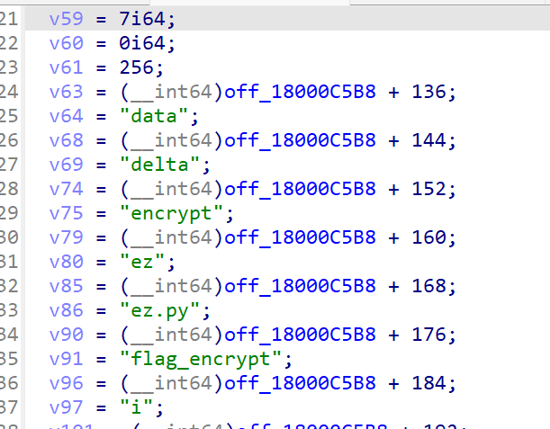
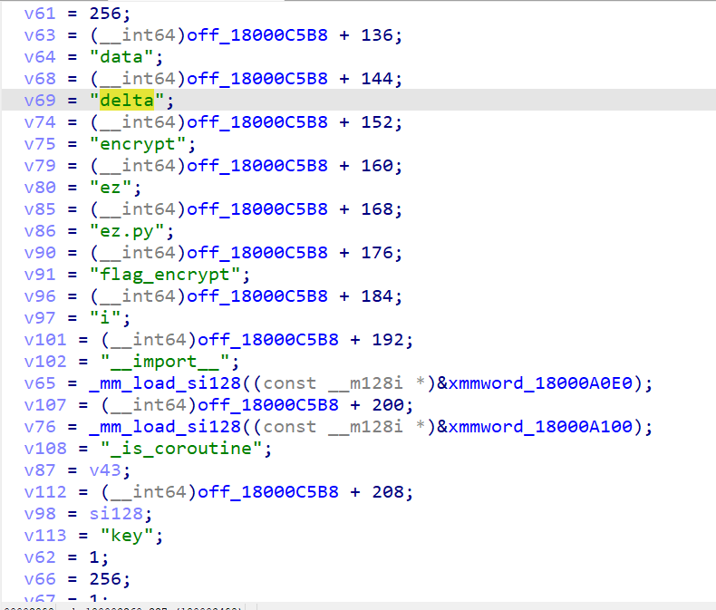
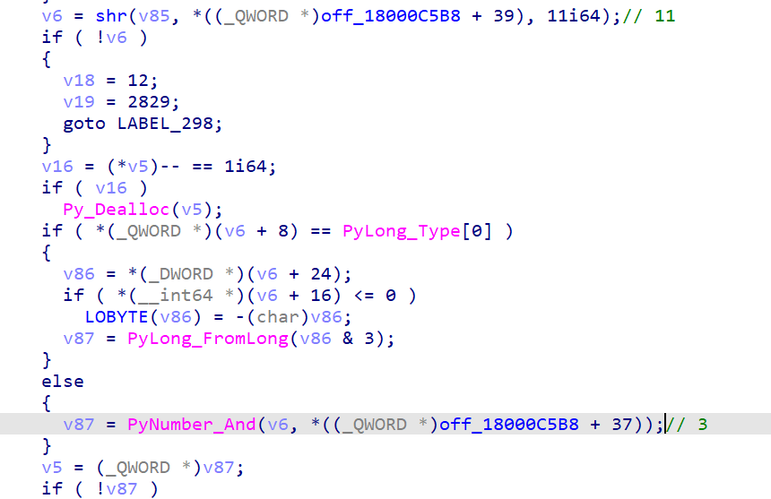

# CISCN&长城杯2024 初赛 wp

五道逆向出了两道，都是被打烂的50分题，最后一道cython赛后出了，很可惜，思路几乎对了

总结：ciscn是真喜欢python相关逆向

## Reverse

### ezCsky

直接ida打开，不管他能不能反编译，可以发现符号表里存在和rc4相关的函数名，找到了密钥testkey和密文解密即可，解密完还需要从后往前异或后一位，最后一位已知是"}"

```Python
def KSA(key):
    """ Key-Scheduling Algorithm (KSA) 密钥调度算法"""
    S = list(range(256))
    j = 0
    for i in range(256):
        j = (j + S[i] + key[i % len(key)]) % 256
        S[i], S[j] = S[j], S[i]
    return S


def PRGA(S):
    """ Pseudo-Random Generation Algorithm (PRGA) 伪随机数生成算法"""
    i, j = 0, 0
    while True:
        i = (i + 1) % 256
        j = (j + S[i]) % 256
        S[i], S[j] = S[j], S[i]
        K = S[(S[i] + S[j]) % 256]
        yield K


def RC4(key, text):
    """ RC4 encryption/decryption """
    S = KSA(key)
    keystream = PRGA(S)
    res = []
    i = 0
    for char in text:
        res.append(char ^ next(keystream))
        i += 1
    return bytes(res)


if __name__ == "__main__":
    key = b"testkey"
    text = [0x96, 0x8F, 0xB8, 0x08, 0x5D, 0xA7, 0x68, 0x44, 0xF2, 0x64, 0x92, 0x64, 0x42, 0x7A, 0x78, 0xE6, 0xEA, 0xC2, 0x78, 0xB8, 0x63, 0x9E, 0x5B, 0x3D, 0xD9, 0x28, 0x3F, 0xC8, 0x73, 0x06, 0xEE, 0x6B, 0x8D, 0x0C, 0x4B, 0xA3, 0x23, 0xAE, 0xCA, 0x40, 0xED, 0xD1]
    # for i in range(256):
    result = RC4(key, text)
    print(list(result))
    result = list(result)
    result[-1] = ord("}")
    for i in range(len(result)-2, -1, -1):
        result[i] ^= result[i+1]
    print("".join(map(chr, result)))
```

### dump

题目里找到输入为命令行后第一个参数，测试发现用了换表，大写字母减去63，小写字母减去67，数字只有1、2可以直接替换，还有等号、花括号也可以直接找对应，需要注意0、3-9直接换为0，因此需要爆破

```Python
s = [0x23, 0x29, 0x1E, 0x24, 0x38, 0x0E, 0x15, 0x20, 0x37, 0x0E, 0x05, 0x20, 0x00, 0x0E, 0x37, 0x12, 0x1D, 0x0F, 0x24, 0x01, 0x01, 0x39]
print(len(s))
xor = [69, 69, 127, 67, 67, 68]
for i in range(len(s)):
    if s[i] == 1:
        s[i] = ord("=")
        continue
    if s[i] == 0x38:
        s[i] = ord("{")
        continue
    if s[i] == 0x39:
        s[i] = ord("}")
        continue
    if s[i] == 0x1c:
        s[i] = ord("1")
        continue
    if s[i] == 0x1d:
        s[i] = ord("2")
        continue
    if s[i] + 67 in list(range(97, 123)):
        s[i] += 67
    elif s[i] + 63 in list(range(65, 91)):
        s[i] += 63
from base64 import b64decode
for i in ["0", "3", "4", "5", "6", "7", "8", "9"]:
    s[12] = ord(i)
    print("".join(map(chr, s)))
    print(b64decode("".join(map(chr, s[5:-1])).encode()))
```

最后测试的是前四个里，记不清交的哪个了以及交的是base4解密前的还是后的了，一个个试即可

```Python
22
flag{MTczMDc0MzQ2Ng==}
b'1730743466'
flag{MTczMDc3MzQ2Ng==}
b'1730773466'
flag{MTczMDc4MzQ2Ng==}
b'1730783466'
flag{MTczMDc5MzQ2Ng==}
b'1730793466'
flag{MTczMDc6MzQ2Ng==}
b'17307:3466'
flag{MTczMDc7MzQ2Ng==}
b'17307;3466'
flag{MTczMDc8MzQ2Ng==}
b'17307<3466'
flag{MTczMDc9MzQ2Ng==}
b'17307=3466'
```

### rand0m

额外学习下pyd生成和还原符号表

没想到可以还原符号表，跟着[赛后wp](https://www.a1natas.com/2024-CISCNxCCB/#reverse)复现了下，先python编写个包含很多运算符号和我们函数的脚本

~~~python
def check(flag):
    a = 1 * 1
    b = 2 * 2
    c = 2 ^ 3
    a = [0] * 6
    b = 0
    while b:
        print("11")
        b -= 1
    rand0m(flag) 
    return a + b + c + flag

def rand0m(x):
    return x ^ 123

__test__ = {}
~~~

然后另写一个生成pyd，运行脚本后面带上`build_ext --inplace`参数

~~~python
from setuptools import setup, Extension
from Cython.Build import cythonize

ext_module = [
    Extension(
        name="restore_symbol",
        sources=["restore_symbol.py"],
        extra_compile_args=["/Zi"],
        extra_link_args=["/DEBUG"]
    )
]

setup(
    name="restore_symbol",
    ext_modules=cythonize(ext_module, annotate=True),
)
~~~

得到的pyd用ida打开再保存，bindiff即可。后面试着分析了下，发现不需要还原符号表也能读懂代码，有种悟通了的感觉

-----

下面是分析算法，主要是两个函数，一个check输入十六进制字符串返回True或False，一个rand0m输入十六进制字符串返回两个数字值

基本可以确定前一个函数调用了后一个函数加密并在自身里面和多个硬编码值比较

因此先看rand0m，在py里写了几个例子用来观察结果和验证加密算法

~~~python
import rand0m

# rand0m.rand0m 输入异或0x9e3779b9，再右移11位，再rsa加密
# check长度25以上
flag = "aa"
print(list(map(hex, rand0m.rand0m(flag))))
flag = "aa" * 4
print(list(map(hex, rand0m.rand0m(flag))))
flag = "a" * 28
print(list(map(hex, rand0m.rand0m(flag)))) #
flag = "abcdef" * 4 + "012"
print(list(map(hex, rand0m.rand0m(flag))))
"""
['0xae0f3021', '0xaa0']
['0xb8d939ca', '0xaa2aaaaa']
['0xc0dcedd5', '0xaaaaaaaaaaaab54d5554a']
['0x24e520ad', '0xabcdefabcdf073f7f0cb']
"""
~~~

找到根据rand0m找到加密函数，找到rand0m字符串，往下找有一堆数据赋值和计算操作基本就能确定是加密函数

~~~c
__int64 __fastcall sub_1800012B0(__int64 a1, _DWORD *a2)
{//...
  v2 = 0i64;
  v3 = 0i64;
  v5 = 0i64;
  v6 = 0i64;
  v7 = 2;
  v8 = (int *)PyTuple_New(2i64);
  if ( !v8 )
  {
    v9 = 2594;
    goto LABEL_77;
  }
  if ( *a2 != -1 )
    ++*a2;
  v10 = off_18000B688;
  *((_QWORD *)v8 + 3) = a2;
  v11 = (_DWORD *)v10[36];
  if ( *v11 != -1 )
    ++*v11;
  *((_QWORD *)v8 + 4) = v10[36];                // 16
  input = sub_1800042B0(PyLong_Type[0], (__int64)v8);
  if ( !input )
  {
    v9 = 2602;
LABEL_48:
    if ( *v8 >= 0 )
    {
      v13 = (*(_QWORD *)v8)-- == 1i64;
      if ( v13 )
LABEL_50:
        Py_Dealloc(v8);
    }
LABEL_77:
    sub_180006240("rand0m.rand0m", v9, v7, (__int64)"rand0m.pyx");
    if ( !v5 )
      goto LABEL_87;
    goto LABEL_84;
  }
  if ( *v8 >= 0 )
  {
    v13 = (*(_QWORD *)v8)-- == 1i64;
    if ( v13 )
      Py_Dealloc(v8);
  }
  v5 = (int *)input;
  v14 = PyNumber_Xor(input, *((_QWORD *)off_18000B688 + 44));// 0x9e3779b9
  if ( !v14 )
  {
    v9 = 2615;
    v7 = 3;
    goto LABEL_77;
  }
  v6 = (int *)v14;
  v15 = shr(input, *((_QWORD *)off_18000B688 + 33), 5, 0);// 5
  if ( !v15 )
  {
    v9 = 2627;
    v7 = 4;
    goto LABEL_77;
  }
  v16 = off_18000B688;
  v3 = (int *)v15;
  v17 = PyLong_Type[0];
  v18 = *((_QWORD *)off_18000B688 + 32);        // 4
  if ( *(_QWORD *)(input + 8) != PyLong_Type[0] )
    goto LABEL_32;
  v19 = *(_QWORD *)(input + 16);
  if ( (v19 & 1) != 0 )
  {
    if ( *(_DWORD *)input != -1 )
      ++*(_DWORD *)input;
    v8 = (int *)input;
    goto LABEL_36;
  }
  if ( v19 >= 0x10 )
  {
    switch ( (v19 >> 3) * (1 - (*(_QWORD *)(input + 16) & 3i64)) )
    {
      case 0xFFFFFFFFFFFFFFFEui64:
        v20 = -(__int64)(*(unsigned int *)(input + 24) | ((unsigned __int64)*(unsigned int *)(input + 28) << 30));
        goto LABEL_29;
      case 2ui64:
        v20 = *(unsigned int *)(input + 24) | ((unsigned __int64)*(unsigned int *)(input + 28) << 30);
        goto LABEL_29;
      default:
        v21 = (*(__int64 (__fastcall **)(__int64, _QWORD))(PyLong_Type[12] + 88i64))(
                input,
                *((_QWORD *)off_18000B688 + 32));
        break;
    }
    goto LABEL_33;
  }
  LODWORD(v20) = *(_DWORD *)(input + 24) * (1 - (v19 & 3));
  if ( (_DWORD)v20 != (16 * (int)v20) >> 4 && (_DWORD)v20 )
  {
    v20 = (int)v20;
LABEL_29:
    if ( v20 == (__int64)(16 * v20) >> 4 )
    {
      v21 = PyLong_FromLongLong(16 * v20, 16 * v20, PyLong_Type[0], v18);
      goto LABEL_33;
    }
LABEL_32:
    v21 = PyNumber_Lshift(input, *((_QWORD *)off_18000B688 + 32));// 4
    goto LABEL_33;
  }
  v21 = PyLong_FromLong((unsigned int)(16 * v20));
LABEL_33:
  input = v21;
  v8 = (int *)v21;
  if ( !v21 )
  {
    v9 = 2639;
    v7 = 5;
    goto LABEL_77;
  }
  v16 = off_18000B688;
LABEL_36:
  v22 = (int *)PyNumber_And(input, v16[48], v17, v18);// 0xfa3affff
  if ( !v22 )
  {
    v9 = 2641;
    v7 = 5;
LABEL_66:
    if ( *v8 >= 0 )
    {
      v13 = (*(_QWORD *)v8)-- == 1i64;
      if ( v13 )
        goto LABEL_50;
    }
    goto LABEL_77;
  }
  if ( *(int *)input >= 0 )
  {
    v13 = (*(_QWORD *)input)-- == 1i64;
    if ( v13 )
      Py_Dealloc(input);
  }
  v23 = v5;
  v5 = v22;
  if ( *v23 >= 0 )
  {
    v13 = (*(_QWORD *)v23)-- == 1i64;
    if ( v13 )
      Py_Dealloc(v23);
  }
  v24 = shr((__int64)v3, *((_QWORD *)off_18000B688 + 37), 23, 0);
  v8 = (int *)v24;
  if ( !v24 )
  {
    v9 = 0xA5E;
    v7 = 6;
    goto LABEL_77;
  }
  v25 = PyNumber_Add(v22, v24);
  if ( !v25 )
  {
    v9 = 2656;
    v7 = 6;
    goto LABEL_48;
  }
  if ( *v8 >= 0 )
  {
    v13 = (*(_QWORD *)v8)-- == 1i64;
    if ( v13 )
      Py_Dealloc(v8);
  }
  v26 = v3;
  v3 = (int *)v25;
  if ( *v26 >= 0 )
  {
    v13 = (*(_QWORD *)v26)-- == 1i64;
    if ( v13 )
      Py_Dealloc(v26);
  }
  v27 = shr((__int64)v6, *((_QWORD *)off_18000B688 + 35), 11, 1);// 11
  v28 = v27;
  if ( !v27 )
  {
    v9 = 2669;
    v7 = 7;
    goto LABEL_77;
  }
  v29 = v6;
  v6 = (int *)v27;
  if ( *v29 >= 0 )
  {
    v13 = (*(_QWORD *)v29)-- == 1i64;
    if ( v13 )
      Py_Dealloc(v29);
  }
  v30 = PyNumber_Power(v28, *((_QWORD *)off_18000B688 + 38), Py_NoneStruct);// 65537
  v8 = (int *)v30;
  if ( !v30 )
  {
    v9 = 2681;
    v7 = 8;
    goto LABEL_77;
  }
  v31 = (int *)PyNumber_Remainder(v30, *((_QWORD *)off_18000B688 + 49));// 0xfffffffd
  if ( !v31 )
  {
    v9 = 2683;
    v7 = 8;
    goto LABEL_66;
  }
  if ( *v8 >= 0 )
  {
    v13 = (*(_QWORD *)v8)-- == 1i64;
    if ( v13 )
      Py_Dealloc(v8);
  }
  v5 = v31;
  if ( *v22 >= 0 )
  {
    v13 = (*(_QWORD *)v22)-- == 1i64;
    if ( v13 )
      Py_Dealloc(v22);
  }
  v32 = PyTuple_New(2i64);
  if ( !v32 )
  {
    v9 = 2697;
    v7 = 9;
    goto LABEL_77;
  }
  if ( *v31 != -1 )
    ++*v31;
  *(_QWORD *)(v32 + 24) = v31;
  if ( *v3 != -1 )
    ++*v3;
  *(_QWORD *)(v32 + 32) = v3;
  v2 = v32;
LABEL_84:
  if ( *v5 >= 0 )
  {
    v13 = (*(_QWORD *)v5)-- == 1i64;
    if ( v13 )
      Py_Dealloc(v5);
  }
LABEL_87:
  if ( v6 )
  {
    if ( *v6 >= 0 )
    {
      v13 = (*(_QWORD *)v6)-- == 1i64;
      if ( v13 )
        Py_Dealloc(v6);
    }
  }
  if ( v3 )
  {
    if ( *v3 >= 0 )
    {
      v13 = (*(_QWORD *)v3)-- == 1i64;
      if ( v13 )
        Py_Dealloc(v3);
    }
  }
  return v2;
}
~~~

返回值分别为v31和v3，从下往上一步步找操作，分析如下：

输入字符串转16进制数字input

* 第一个返回值：input异或0x9e3779b9，再右移11位，再rsa加密（n小，p、q均可求，e已知，即可求input去掉后后11位的结果）
* 第二个返回值：原来的input先右移5位再右移23位得到一个数，原来的input左移4位再和0xfa3affff和运算，两部分相加（由于和运算后4字节是0xffff，相当于知道左移4位后的数后4字节，即input的后11位结果）

两个合起来能求出input，观察上面check里的硬编码数字正好都是4字节32位，共8个，结合check里对列表的切片基本可知，每两个一组正好是rand0m的加密结果，写脚本逆向（根本不需要z3或者爆破什么的，一些wp做麻烦了）

~~~python
from gmpy2 import invert
cmp = [0x12287f38, 0x98d24b3a, 0x4a30f74d, 0xe0f1db77, 0x23a1268, 0xadf38403, 0x88108807, 0xd8499bb6]
flag = ""
for i in range(0, 8, 2):
    # 第一部分
    c = cmp[i+1]
    p = 9241
    q = 464773
    phi = (p-1) * (q-1)
    d = invert(65537, phi)
    m1 = pow(c, d, 0xfffffffd)
    m1 <<= 11
    m1 ^= 0x9e3779b9
    m1 >>= 11
    # 第二部分
    assert m1 >> 17 == cmp[i] & 0xf
    m2 = (cmp[i]>>4) & (2**11-1)
    m = (m1 << 11) + m2
    flag += hex(m)[2:].zfill(8)
print(f"flag{{{flag}}}")
~~~

### cython

前面提取exe和反编译都要用对应的python版本，反编译失败（jump_backward的原因）用pycdas可以读汇编代码

可以找到调用pyd找到里面比较的结果

~~~
ez.data
PyDev console: starting.
[(4155019432, 2368680594), (2728037222, 3242858786), (161971026, 1131913268)]
~~~

结合两个一组以及pyd里的信息基本可以确定是tea类型加密



找到对应的加密代码

~~~c
__int64 __fastcall sub_180001440(__int64 a1, __int64 a2, __int64 a3, __int64 a4)
{//...
  v4 = 0i64;
  v5 = 0i64;
  v6 = 0i64;
  v9 = 0i64;
  v98 = 0i64;
  v100 = 0i64;
  v99 = 0i64;
  v101 = 0i64;
  if ( qword_18000CEB8 == *(_QWORD *)(*(_QWORD *)off_18000C5B8 + 24i64) )
  {
    if ( qword_18000CE90 )
    {
      ++*(_QWORD *)qword_18000CE90;
      Item_KnownHash = (_QWORD *)qword_18000CE90;
    }
    else
    {
      v11 = *((_QWORD *)off_18000C5B8 + 12);
      Item_KnownHash = (_QWORD *)sub_180004A80(*((_QWORD *)off_18000C5B8 + 1), v11);
      if ( !Item_KnownHash && !PyErr_Occurred() )
        PyErr_Format(PyExc_NameError, "name '%U' is not defined", v11);
    }
    goto LABEL_11;
  }
  v12 = *((_QWORD *)off_18000C5B8 + 12);
  Item_KnownHash = (_QWORD *)PyDict_GetItem_KnownHash(*(_QWORD *)off_18000C5B8, v12, *(_QWORD *)(v12 + 24));
  qword_18000CEB8 = *(_QWORD *)(*(_QWORD *)off_18000C5B8 + 24i64);
  qword_18000CE90 = (__int64)Item_KnownHash;
  if ( !Item_KnownHash )
  {
    if ( PyErr_Occurred() )
      goto LABEL_320;
    Item_KnownHash = (_QWORD *)sub_180004BA0(v12);
LABEL_11:
    if ( Item_KnownHash )
      goto LABEL_12;
LABEL_320:
    v18 = 5;
    v19 = 2620;
    goto LABEL_72;
  }
  ++*Item_KnownHash;
LABEL_12:
  v13 = 0;
  if ( Item_KnownHash[1] == PyMethod_Type )
  {
    v4 = (_QWORD *)Item_KnownHash[3];
    if ( v4 )
    {
      v14 = (_QWORD *)Item_KnownHash[2];
      v15 = Item_KnownHash;
      ++*v4;
      Item_KnownHash = v14;
      ++*v14;
      v16 = (*v15)-- == 1i64;
      if ( v16 )
        Py_Dealloc(v15);
      v13 = 1;
    }
  }
  v102[0] = a2;
  v17 = (_QWORD *)sub_180005180(Item_KnownHash, &v102[-v13], (unsigned int)(v13 + 1));
  if ( v4 )
  {
    v16 = (*v4)-- == 1i64;
    if ( v16 )
      Py_Dealloc(v4);
  }
  if ( !v17 )
  {
    v18 = 5;
    v19 = 2640;
    goto LABEL_300;
  }
  v16 = (*Item_KnownHash)-- == 1i64;
  if ( v16 )
    Py_Dealloc(Item_KnownHash);
  Item_KnownHash = 0i64;
  if ( qword_18000CED0 == *(_QWORD *)(*(_QWORD *)off_18000C5B8 + 24i64) )
  {
    if ( qword_18000CE80 )
    {
      ++*(_QWORD *)qword_18000CE80;
      v9 = (_QWORD *)qword_18000CE80;
    }
    else
    {
      v20 = *((_QWORD *)off_18000C5B8 + 12);
      v9 = (_QWORD *)sub_180004A80(*((_QWORD *)off_18000C5B8 + 1), v20);
      if ( !v9 && !PyErr_Occurred() )
        PyErr_Format(PyExc_NameError, "name '%U' is not defined", v20);
    }
  }
  else
  {
    v21 = *((_QWORD *)off_18000C5B8 + 12);
    v9 = (_QWORD *)PyDict_GetItem_KnownHash(*(_QWORD *)off_18000C5B8, v21, *(_QWORD *)(v21 + 24));
    qword_18000CED0 = *(_QWORD *)(*(_QWORD *)off_18000C5B8 + 24i64);
    qword_18000CE80 = (__int64)v9;
    if ( v9 )
    {
      ++*v9;
      goto LABEL_32;
    }
    if ( PyErr_Occurred() )
    {
      v9 = 0i64;
      v19 = 2644;
      v18 = 5;
      goto LABEL_298;
    }
    v9 = (_QWORD *)sub_180004BA0(v21);
  }
  if ( !v9 )
  {
    v18 = 5;
    v19 = 2644;
LABEL_298:
    v16 = (*v17)-- == 1i64;
    if ( v16 )
      Py_Dealloc(v17);
LABEL_300:
    if ( !Item_KnownHash )
      goto LABEL_308;
    goto LABEL_306;
  }
LABEL_32:
  v22 = 0;
  if ( v9[1] == PyMethod_Type )
  {
    v6 = v9[3];
    if ( v6 )
    {
      v23 = (_QWORD *)v9[2];
      v24 = v9;
      ++*(_QWORD *)v6;
      v9 = v23;
      ++*v23;
      v16 = (*v24)-- == 1i64;
      if ( v16 )
        Py_Dealloc(v24);
      v22 = 1;
    }
  }
  v102[1] = v6;
  v103[0] = a3;
  Item_KnownHash = (_QWORD *)sub_180005180(v9, &v103[-v22], (unsigned int)(v22 + 1));
  if ( v6 )
  {
    v16 = (*(_QWORD *)v6)-- == 1i64;
    if ( v16 )
      Py_Dealloc(v6);
  }
  v6 = 0i64;
  if ( !Item_KnownHash )
  {
    v18 = 5;
    v19 = 2664;
    goto LABEL_298;
  }
  v16 = (*v9)-- == 1i64;
  if ( v16 )
    Py_Dealloc(v9);
  v25 = off_18000C5B8;
  v9 = v17;
  v98 = v17;
  v26 = Item_KnownHash;
  v100 = Item_KnownHash;
  ++**((_QWORD **)off_18000C5B8 + 42);
  v27 = (_QWORD *)v25[42];
  v99 = v27;
  if ( qword_18000CE78 == *(_QWORD *)(*v25 + 24i64) )
  {
    if ( qword_18000CEA0 )
    {
      ++*(_QWORD *)qword_18000CEA0;
      v17 = (_QWORD *)qword_18000CEA0;
      goto LABEL_60;
    }
    v28 = v25[12];
    v17 = (_QWORD *)sub_180004A80(v25[1], v28);
    if ( !v17 && !PyErr_Occurred() )
      PyErr_Format(PyExc_NameError, "name '%U' is not defined", v28);
  }
  else
  {
    v29 = v25[12];
    v30 = (_QWORD *)PyDict_GetItem_KnownHash(*v25, v29, *(_QWORD *)(v29 + 24));
    v25 = off_18000C5B8;
    v17 = v30;
    qword_18000CE78 = *(_QWORD *)(*(_QWORD *)off_18000C5B8 + 24i64);
    qword_18000CEA0 = (__int64)v30;
    if ( v30 )
    {
      ++*v30;
      goto LABEL_61;
    }
    if ( PyErr_Occurred() )
    {
LABEL_319:
      v18 = 8;
      v19 = 2690;
      goto LABEL_72;
    }
    v17 = (_QWORD *)sub_180004BA0(v29);
  }
  v25 = off_18000C5B8;
LABEL_60:
  if ( !v17 )
    goto LABEL_319;
LABEL_61:
  v31 = 0i64;
  v32 = 0;
  if ( v17[1] == PyMethod_Type )
  {
    v31 = (_QWORD *)v17[3];
    if ( v31 )
    {
      v33 = (_QWORD *)v17[2];
      v34 = v17;
      ++*v31;
      v17 = v33;
      ++*v33;
      v16 = (*v34)-- == 1i64;
      if ( v16 )
      {
        Py_Dealloc(v34);
        v25 = off_18000C5B8;
      }
      v32 = 1;
    }
  }
  v104 = v25[35];
  v103[1] = (__int64)v31;
  v101 = sub_180005180(v17, &v104 - v32, v32 + 1);
  v35 = (_QWORD *)v101;
  Item_KnownHash = (_QWORD *)v101;
  if ( v31 )
  {
    v16 = (*v31)-- == 1i64;
    if ( v16 )
      Py_Dealloc(v31);
  }
  if ( !v101 )
  {
    v98 = v9;
    v9 = 0i64;
    v99 = v27;
    v6 = 0i64;
    v100 = v26;
    v5 = 0i64;
    v101 = 0i64;
    v18 = 8;
    v19 = 2710;
    if ( !v17 )
      goto LABEL_71;
    goto LABEL_298;
  }
  v16 = (*v17)-- == 1i64;
  if ( v16 )
    Py_Dealloc(v17);
  v105 = 0;
  v18 = 11;
  do
  {
    v39 = *((_QWORD *)off_18000C5B8 + 34);
    v40 = *(__int64 (__fastcall **)(_QWORD *, __int64))(v9[1] + 144i64);
    if ( v40 )
      Attr = v40(v9, v39);
    else
      Attr = PyObject_GetAttr(v9, v39, 0i64);
    Item_KnownHash = (_QWORD *)Attr;
    if ( !Attr )
    {
      v18 = 10;
      v19 = 2734;
      goto LABEL_72;
    }
    v42 = *((_QWORD *)off_18000C5B8 + 34);
    v43 = *(__int64 (__fastcall **)(_QWORD *, __int64))(v26[1] + 144i64);
    if ( v43 )
      v44 = v43(v26, v42);
    else
      v44 = PyObject_GetAttr(v26, v42, 0i64);
    v17 = (_QWORD *)v44;
    if ( !v44 )
    {
      v19 = 2736;
      v9 = 0i64;
      goto LABEL_303;
    }
    v9 = (_QWORD *)sub_180005340(v44, *((_QWORD *)off_18000C5B8 + 37));
    if ( !v9 )
    {
      v6 = 0i64;
      v19 = 2738;
      goto LABEL_296;
    }
    v16 = (*v17)-- == 1i64;
    if ( v16 )
      Py_Dealloc(v17);
    v45 = *((_QWORD *)off_18000C5B8 + 34);
    v46 = *(__int64 (__fastcall **)(_QWORD *, __int64))(v26[1] + 144i64);
    if ( v46 )
      v47 = v46(v26, v45);
    else
      v47 = PyObject_GetAttr(v26, v45, 0i64);
    v17 = (_QWORD *)v47;
    if ( !v47 )
    {
      v19 = 2741;
LABEL_303:
      v6 = 0i64;
      goto LABEL_304;
    }
    v6 = sub_180005450(v47, *((_QWORD *)off_18000C5B8 + 38), 6i64);
    if ( !v6 )
    {
      v19 = 2743;
      goto LABEL_296;
    }
    v16 = (*v17)-- == 1i64;
    if ( v16 )
      Py_Dealloc(v17);
    v17 = (_QWORD *)PyNumber_Xor(v9, v6);
    if ( !v17 )
    {
      v19 = 2746;
      goto LABEL_304;
    }
    v16 = (*v9)-- == 1i64;
    if ( v16 )
      Py_Dealloc(v9);
    v9 = 0i64;
    v16 = (*(_QWORD *)v6)-- == 1i64;
    if ( v16 )
      Py_Dealloc(v6);
    v48 = *((_QWORD *)off_18000C5B8 + 34);
    v49 = *(__int64 (__fastcall **)(_QWORD *, __int64))(v26[1] + 144i64);
    if ( v49 )
      v50 = v49(v26, v48);
    else
      v50 = PyObject_GetAttr(v26, v48, 0i64);
    v6 = v50;
    if ( !v50 )
    {
      v19 = 2750;
      goto LABEL_296;
    }
    v9 = (_QWORD *)PyNumber_Add(v17, v50);
    if ( !v9 )
    {
      v19 = 2752;
LABEL_296:
      v5 = 0i64;
      goto LABEL_297;
    }
    v16 = (*v17)-- == 1i64;
    if ( v16 )
      Py_Dealloc(v17);
    v16 = (*(_QWORD *)v6)-- == 1i64;
    if ( v16 )
      Py_Dealloc(v6);
    v51 = *((_QWORD *)off_18000C5B8 + 34);
    v52 = *(__int64 (__fastcall **)(__int64, __int64))(*(_QWORD *)(v101 + 8) + 144i64);
    if ( v52 )
      v53 = v52(v101, v51);
    else
      v53 = PyObject_GetAttr(v101, v51, 0i64);
    v6 = v53;
    if ( !v53 )
    {
      v19 = 2756;
      goto LABEL_304;
    }
    v54 = *((_QWORD *)off_18000C5B8 + 34);
    v55 = *(__int64 (__fastcall **)(__int64, __int64))(*(_QWORD *)(v101 + 8) + 144i64);
    if ( v55 )
      v56 = v55(v101, v54);
    else
      v56 = PyObject_GetAttr(v101, v54, 0i64);
    v17 = (_QWORD *)v56;
    if ( !v56 )
    {
      v19 = 2758;
LABEL_304:
      v5 = 0i64;
      goto LABEL_305;
    }
    if ( *(_QWORD *)(v56 + 8) == PyLong_Type[0] )
    {
      v57 = *(_DWORD *)(v56 + 24);
      if ( *(__int64 *)(v56 + 16) <= 0 )
        LOBYTE(v57) = -(char)v57;
      v58 = PyLong_FromLong(v57 & 3);
    }
    else
    {
      v58 = PyNumber_And(v56, *((_QWORD *)off_18000C5B8 + 37));
    }
    v5 = (_QWORD *)v58;
    if ( !v58 )
    {
      v19 = 2760;
      goto LABEL_297;
    }
    v16 = (*v17)-- == 1i64;
    if ( v16 )
      Py_Dealloc(v17);
    v17 = (_QWORD *)sub_180005690(a4, v5);
    if ( !v17 )
    {
      v19 = 2763;
      goto LABEL_305;
    }
    v16 = (*v5)-- == 1i64;
    if ( v16 )
      Py_Dealloc(v5);
    v5 = (_QWORD *)PyNumber_Add(v6, v17);
    if ( !v5 )
    {
      v19 = 2766;
      goto LABEL_297;
    }
    v16 = (*(_QWORD *)v6)-- == 1i64;
    if ( v16 )
      Py_Dealloc(v6);
    v6 = 0i64;
    v16 = (*v17)-- == 1i64;
    if ( v16 )
      Py_Dealloc(v17);
    v17 = (_QWORD *)PyNumber_Xor(v9, v5);
    if ( !v17 )
    {
      v19 = 2770;
LABEL_305:
      v18 = 10;
LABEL_306:
      v16 = (*Item_KnownHash)-- == 1i64;
      if ( v16 )
        Py_Dealloc(Item_KnownHash);
LABEL_308:
      if ( v9 )
      {
        v16 = (*v9)-- == 1i64;
        if ( v16 )
          Py_Dealloc(v9);
      }
      if ( v6 )
      {
LABEL_312:
        v16 = (*(_QWORD *)v6)-- == 1i64;
        if ( v16 )
          Py_Dealloc(v6);
      }
      if ( v5 )
      {
LABEL_315:
        v9 = v98;
LABEL_316:
        v16 = (*v5)-- == 1i64;
        if ( v16 )
          Py_Dealloc(v5);
LABEL_72:
        v36 = v99;
        sub_180006E50("ez.encrypt", v19, v18, "ez.py");
        v26 = v100;
        v37 = 0i64;
        v35 = (_QWORD *)v101;
        if ( v9 )
          goto LABEL_73;
        goto LABEL_75;
      }
LABEL_71:
      v9 = v98;
      goto LABEL_72;
    }
    v16 = (*v9)-- == 1i64;
    if ( v16 )
      Py_Dealloc(v9);
    v9 = 0i64;
    v16 = (*v5)-- == 1i64;
    if ( v16 )
      Py_Dealloc(v5);
    v5 = (_QWORD *)PyNumber_InPlaceAdd(Item_KnownHash, v17);
    if ( !v5 )
    {
      v19 = 2774;
LABEL_297:
      v18 = 10;
      goto LABEL_298;
    }
    v16 = (*Item_KnownHash)-- == 1i64;
    if ( v16 )
      Py_Dealloc(Item_KnownHash);
    Item_KnownHash = 0i64;
    v16 = (*v17)-- == 1i64;
    if ( v16 )
      Py_Dealloc(v17);
    v59 = *((_QWORD *)off_18000C5B8 + 34);
    v60 = *(__int64 (__fastcall **)(_QWORD *, __int64, _QWORD *))(v98[1] + 152i64);
    if ( v60 )
      v61 = v60(v98, v59, v5);
    else
      v61 = PyObject_SetAttr(v98, v59, v5, 0i64);
    if ( v61 < 0 )
    {
      v18 = 10;
      v19 = 2778;
      goto LABEL_315;
    }
    v16 = (*v5)-- == 1i64;
    if ( v16 )
      Py_Dealloc(v5);
    v62 = *((_QWORD *)off_18000C5B8 + 34);
    v63 = *(__int64 (__fastcall **)(__int64, __int64))(*(_QWORD *)(v101 + 8) + 144i64);
    if ( v63 )
      v64 = v63(v101, v62);
    else
      v64 = PyObject_GetAttr(v101, v62, 0i64);
    v5 = (_QWORD *)v64;
    if ( !v64 )
    {
      v19 = 2788;
      goto LABEL_71;
    }
    v17 = (_QWORD *)PyNumber_InPlaceAdd(v64, v99);
    if ( !v17 )
    {
      v19 = 2790;
      goto LABEL_315;
    }
    v16 = (*v5)-- == 1i64;
    if ( v16 )
      Py_Dealloc(v5);
    v5 = 0i64;
    v65 = *((_QWORD *)off_18000C5B8 + 34);
    v66 = *(__int64 (__fastcall **)(__int64, __int64, _QWORD *))(*(_QWORD *)(v101 + 8) + 152i64);
    if ( v66 )
      v67 = v66(v101, v65, v17);
    else
      v67 = PyObject_SetAttr(v101, v65, v17, 0i64);
    if ( v67 < 0 )
    {
      v19 = 2793;
      goto LABEL_298;
    }
    v16 = (*v17)-- == 1i64;
    if ( v16 )
      Py_Dealloc(v17);
    v68 = *((_QWORD *)off_18000C5B8 + 34);
    v69 = *(__int64 (__fastcall **)(_QWORD *, __int64))(v26[1] + 144i64);
    if ( v69 )
      v70 = v69(v26, v68);
    else
      v70 = PyObject_GetAttr(v26, v68, 0i64);
    v17 = (_QWORD *)v70;
    if ( !v70 )
    {
      v18 = 12;
      v19 = 2803;
      goto LABEL_71;
    }
    v71 = *((_QWORD *)off_18000C5B8 + 34);
    v72 = *(__int64 (__fastcall **)(_QWORD *, __int64))(v98[1] + 144i64);
    if ( v72 )
      v73 = v72(v98, v71);
    else
      v73 = PyObject_GetAttr(v98, v71, 0i64);
    v5 = (_QWORD *)v73;
    if ( !v73 )
    {
      v18 = 12;
      v19 = 2805;
      goto LABEL_298;
    }
    Item_KnownHash = (_QWORD *)sub_180005340(v73, *((_QWORD *)off_18000C5B8 + 37));
    if ( !Item_KnownHash )
    {
      v18 = 12;
      v19 = 2807;
      goto LABEL_298;
    }
    v16 = (*v5)-- == 1i64;
    if ( v16 )
      Py_Dealloc(v5);
    v74 = *((_QWORD *)off_18000C5B8 + 34);
    v75 = *(__int64 (__fastcall **)(_QWORD *, __int64))(v98[1] + 144i64);
    if ( v75 )
      v76 = v75(v98, v74);
    else
      v76 = PyObject_GetAttr(v98, v74, 0i64);
    v5 = (_QWORD *)v76;
    if ( !v76 )
    {
      v18 = 12;
      v19 = 2810;
      goto LABEL_298;
    }
    v9 = (_QWORD *)sub_180005450(v76, *((_QWORD *)off_18000C5B8 + 38), 6i64);
    if ( !v9 )
    {
      v18 = 12;
      v19 = 2812;
      goto LABEL_298;
    }
    v16 = (*v5)-- == 1i64;
    if ( v16 )
      Py_Dealloc(v5);
    v5 = (_QWORD *)PyNumber_Xor(Item_KnownHash, v9);
    if ( !v5 )
    {
      v18 = 12;
      v19 = 2815;
      goto LABEL_298;
    }
    v16 = (*Item_KnownHash)-- == 1i64;
    if ( v16 )
      Py_Dealloc(Item_KnownHash);
    Item_KnownHash = 0i64;
    v16 = (*v9)-- == 1i64;
    if ( v16 )
      Py_Dealloc(v9);
    v77 = *((_QWORD *)off_18000C5B8 + 34);
    v78 = *(__int64 (__fastcall **)(_QWORD *, __int64))(v98[1] + 144i64);
    if ( v78 )
      v79 = v78(v98, v77);
    else
      v79 = PyObject_GetAttr(v98, v77, 0i64);
    v9 = (_QWORD *)v79;
    if ( !v79 )
    {
      v18 = 12;
      v19 = 2819;
      goto LABEL_298;
    }
    Item_KnownHash = (_QWORD *)PyNumber_Add(v5, v79);
    if ( !Item_KnownHash )
    {
      v18 = 12;
      v19 = 2821;
      goto LABEL_298;
    }
    v16 = (*v5)-- == 1i64;
    if ( v16 )
      Py_Dealloc(v5);
    v5 = 0i64;
    v16 = (*v9)-- == 1i64;
    if ( v16 )
      Py_Dealloc(v9);
    v80 = *((_QWORD *)off_18000C5B8 + 34);
    v81 = *(__int64 (__fastcall **)(__int64, __int64))(*(_QWORD *)(v101 + 8) + 144i64);
    if ( v81 )
      v82 = v81(v101, v80);
    else
      v82 = PyObject_GetAttr(v101, v80, 0i64);
    v9 = (_QWORD *)v82;
    if ( !v82 )
    {
      v18 = 12;
      v19 = 2825;
      goto LABEL_298;
    }
    v83 = *((_QWORD *)off_18000C5B8 + 34);
    v84 = *(__int64 (__fastcall **)(__int64, __int64))(*(_QWORD *)(v101 + 8) + 144i64);
    if ( v84 )
      v85 = v84(v101, v83);
    else
      v85 = PyObject_GetAttr(v101, v83, 0i64);
    v5 = (_QWORD *)v85;
    if ( !v85 )
    {
      v18 = 12;
      v19 = 2827;
      goto LABEL_298;
    }
    v6 = sub_180005450(v85, *((_QWORD *)off_18000C5B8 + 39), 11i64);
    if ( !v6 )
    {
      v18 = 12;
      v19 = 2829;
      goto LABEL_298;
    }
    v16 = (*v5)-- == 1i64;
    if ( v16 )
      Py_Dealloc(v5);
    if ( *(_QWORD *)(v6 + 8) == PyLong_Type[0] )
    {
      v86 = *(_DWORD *)(v6 + 24);
      if ( *(__int64 *)(v6 + 16) <= 0 )
        LOBYTE(v86) = -(char)v86;
      v87 = PyLong_FromLong(v86 & 3);
    }
    else
    {
      v87 = PyNumber_And(v6, *((_QWORD *)off_18000C5B8 + 37));
    }
    v5 = (_QWORD *)v87;
    if ( !v87 )
    {
      v18 = 12;
      v19 = 2832;
      goto LABEL_298;
    }
    v16 = (*(_QWORD *)v6)-- == 1i64;
    if ( v16 )
      Py_Dealloc(v6);
    v6 = sub_180005690(a4, v5);
    if ( !v6 )
    {
      v18 = 12;
      v19 = 2835;
      goto LABEL_298;
    }
    v16 = (*v5)-- == 1i64;
    if ( v16 )
      Py_Dealloc(v5);
    v5 = (_QWORD *)PyNumber_Add(v9, v6);
    if ( !v5 )
    {
      v18 = 12;
      v19 = 2838;
      goto LABEL_298;
    }
    v16 = (*v9)-- == 1i64;
    if ( v16 )
      Py_Dealloc(v9);
    v9 = 0i64;
    v16 = (*(_QWORD *)v6)-- == 1i64;
    if ( v16 )
      Py_Dealloc(v6);
    v6 = PyNumber_Xor(Item_KnownHash, v5);
    if ( !v6 )
    {
      v18 = 12;
      v19 = 2842;
      goto LABEL_298;
    }
    v16 = (*Item_KnownHash)-- == 1i64;
    if ( v16 )
      Py_Dealloc(Item_KnownHash);
    Item_KnownHash = 0i64;
    v16 = (*v5)-- == 1i64;
    if ( v16 )
      Py_Dealloc(v5);
    v5 = (_QWORD *)PyNumber_InPlaceAdd(v17, v6);
    if ( !v5 )
    {
      v18 = 12;
      v19 = 2846;
      goto LABEL_298;
    }
    v16 = (*v17)-- == 1i64;
    if ( v16 )
      Py_Dealloc(v17);
    v16 = (*(_QWORD *)v6)-- == 1i64;
    if ( v16 )
      Py_Dealloc(v6);
    v88 = *((_QWORD *)off_18000C5B8 + 34);
    v89 = *(__int64 (__fastcall **)(_QWORD *, __int64, _QWORD *))(v26[1] + 152i64);
    if ( v89 )
      v90 = v89(v26, v88, v5);
    else
      v90 = PyObject_SetAttr(v26, v88, v5, 0i64);
    if ( v90 < 0 )
    {
      v18 = 12;
      v19 = 2850;
      goto LABEL_315;
    }
    v16 = (*v5)-- == 1i64;
    if ( v16 )
      Py_Dealloc(v5);
    v9 = v98;
    ++v105;
  }
  while ( v105 < 64 );
  v91 = *((_QWORD *)off_18000C5B8 + 34);
  v92 = *(__int64 (__fastcall **)(_QWORD *, __int64))(v98[1] + 144i64);
  if ( v92 )
    v93 = v92(v98, v91);
  else
    v93 = PyObject_GetAttr(v98, v91, 0i64);
  v5 = (_QWORD *)v93;
  if ( !v93 )
  {
    v18 = 14;
    v19 = 2862;
    goto LABEL_72;
  }
  v94 = *((_QWORD *)off_18000C5B8 + 34);
  v95 = *(__int64 (__fastcall **)(_QWORD *, __int64))(v26[1] + 144i64);
  if ( v95 )
    v96 = v95(v26, v94);
  else
    v96 = PyObject_GetAttr(v26, v94, 0i64);
  v6 = v96;
  if ( !v96 )
  {
    v18 = 14;
    v19 = 2864;
    goto LABEL_316;
  }
  v97 = PyTuple_New(2i64);
  v37 = v97;
  if ( !v97 )
  {
    v18 = 14;
    v19 = 2866;
    goto LABEL_312;
  }
  *(_QWORD *)(v97 + 24) = v5;
  v36 = v99;
  *(_QWORD *)(v97 + 32) = v6;
LABEL_73:
  v16 = (*v9)-- == 1i64;
  if ( v16 )
    Py_Dealloc(v9);
LABEL_75:
  if ( v26 )
  {
    v16 = (*v26)-- == 1i64;
    if ( v16 )
      Py_Dealloc(v26);
  }
  if ( v36 )
  {
    v16 = (*v36)-- == 1i64;
    if ( v16 )
      Py_Dealloc(v36);
  }
  if ( v35 )
  {
    v16 = (*v35)-- == 1i64;
    if ( v16 )
      Py_Dealloc(v35);
  }
  return v37;
}
~~~

找到delta字眼



至于分析出xtea是因为发现了右移11位以及和3求按位和



因此确定xtea加密后的值、key、delta、以及里面的操作（魔改了左右移的位数）、轮数未知可以爆破

~~~python
import struct
from ctypes import c_uint32


def xtea_decrypt(r, v, key):
    v0, v1 = c_uint32(v[0]), c_uint32(v[1])
    delta = 0x54646454
    total = c_uint32(delta * r)
    for i in range(r):
        v1.value -= (((v0.value << 3) ^ (v0.value >> 6)) + v0.value) ^ (total.value + key[(total.value >> 11) & 3])
        total.value -= delta
        v0.value -= (((v1.value << 3) ^ (v1.value >> 6)) + v1.value) ^ (total.value + key[total.value & 3])
    return v0.value, v1.value


if __name__ == "__main__":
    k = [102, 108, 97, 103]
    for j in range(1000):
        try:
        # v = [0x9A77B52, 0x4377A034, 0x8d2f3292, 0xa29a8b66, 0xc14a1922, 0xf7a890a8]
            v = [4155019432, 2368680594, 2728037222, 3242858786, 161971026, 1131913268]
            for i in range(0, len(v), 2):
                v[i:i+2] = xtea_decrypt(j, v[i:i+2], k)
            str_list = []
            for i in range(len(v)):
                str_list.append(struct.pack('>I', v[i]).decode())
            print('decrypted: %s' % ''.join(str_list))	# 只有decode不报错才会打印
        except:
            continue
~~~

