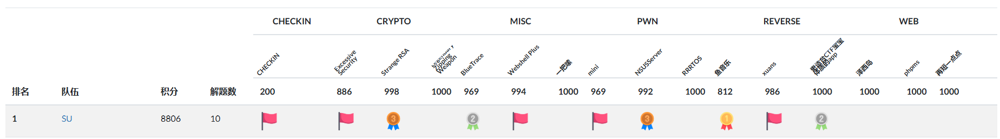
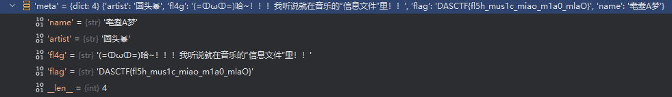
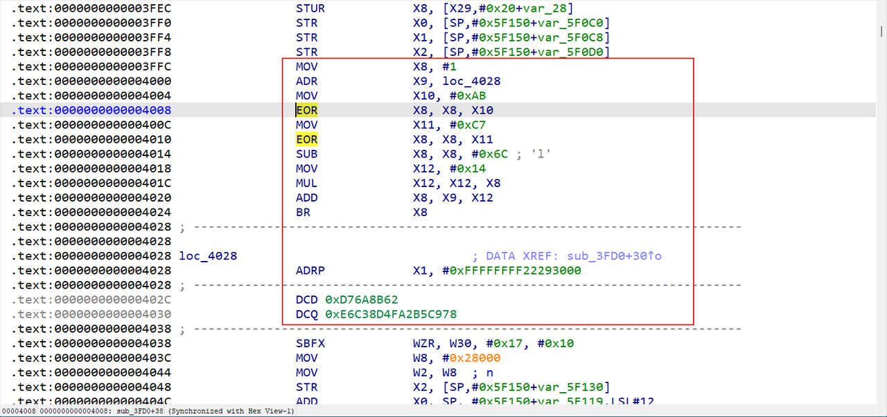
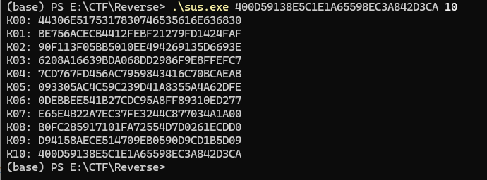
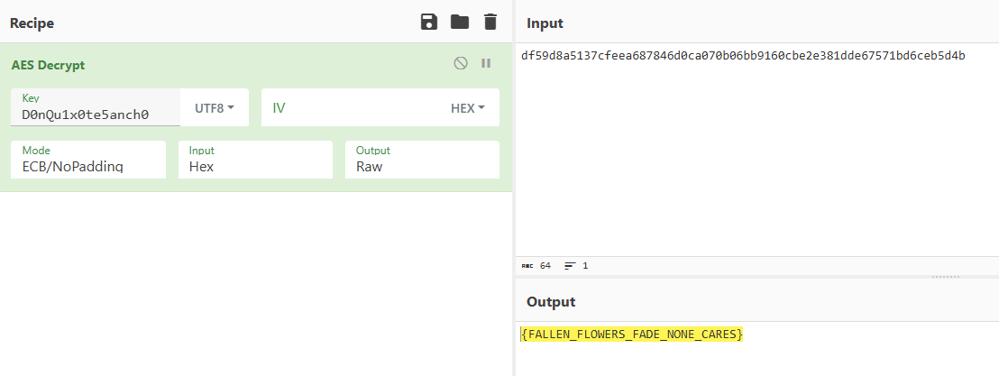
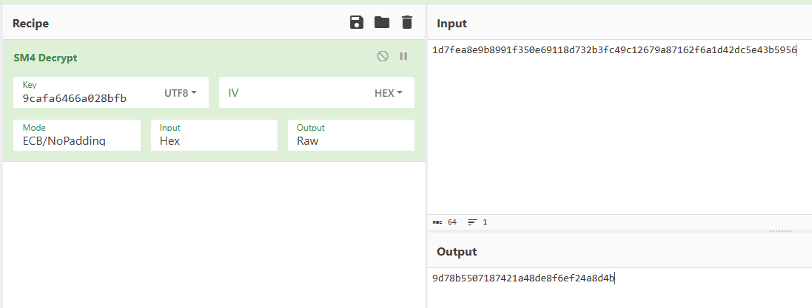

# DASCTF上半年赛 RE wp

1st！和队友们拿下了好几个血

## 鱼音乐

exe很明显pyinstaller打包的，解包找到main.pyc和xianyu_decrypt.cp38-win_amd64.pyd，pylingual反编译pyc可知是python3.8

核心代码如下

~~~python
info = load_and_decrypt_xianyu(file_path)
meta = info['meta']
cover_path = info['cover_path']
audio_path = info['audio_path']
if cover_path and os.path.exists(cover_path):
    pixmap = QPixmap(cover_path)
    self.cover_label.setPixmap(pixmap)
else:
    self.cover_label.setText('无封面')
url = QUrl.fromLocalFile(audio_path)
self.player.setMedia(QMediaContent(url))
self.player.play()
name = meta.get('name', '未知')
artist = meta.get('artist', '未知歌手')
fl4g = meta.get('fl4g', 'where_is_the_flag?')
~~~

把pyd拿过来和main、xianyu后缀文件放同一目录动态调试即可得到flag

感觉很多人做复杂了，我直接动调就出了他们还跑去分析了pyd，我这个应该是非预期了

flag是`DASCTF{fl5h_mus1c_miao_m1a0_mlaO}`

## 更适合CTF宝宝体质的app

第一次接触白盒AES，竟然没看出来是白盒AES

java层是假的flag（tea加密）

so层分析后发现还是arm好读，里面有几个函数开头有花指令

分析可以发现在跳转BR X8后的代码反汇编失败，分析X8值，首先是X8=(1^0xAB^0xC7)-0x6C=1，然后X8=X9+X12*X8=0x4028+0x14=0x403C，所以实际上实现了一个计算跳转地址，中间所有的都是花指令，直接IDA nop即可

去花后可以反编译，根据JNI_OnLoad找到Check函数如下

~~~c++
bool __fastcall sub_3A9C(__int64 a1)
{
  _BOOL4 v3; // [xsp+3Ch] [xbp-144h]
  _OWORD v4[2]; // [xsp+40h] [xbp-140h] BYREF
  _BYTE v5[64]; // [xsp+60h] [xbp-120h] BYREF
  _OWORD s1[2]; // [xsp+150h] [xbp-30h] BYREF
  __int64 v7; // [xsp+178h] [xbp-8h]

  v7 = *(_ReadStatusReg(ARM64_SYSREG(3, 3, 13, 0, 2)) + 40);
  s1[1] = xmmword_D84;
  s1[0] = xmmword_D74;
  memset(v4, 0, sizeof(v4));
  sub_3FD0(a1, v5);
  sub_3FD0(a1 + 16, &v5[16]);
  sub_37F0(v5, v4, 0x20uLL, 0x6C6F7665);
  v3 = memcmp(s1, v4, 0x20uLL) == 0;
  _ReadStatusReg(ARM64_SYSREG(3, 3, 13, 0, 2));
  return v3;
}
__int64 __fastcall sub_3FD0(__int64 a1, __int64 a2)
{
  // [COLLAPSED LOCAL DECLARATIONS. PRESS NUMPAD "+" TO EXPAND]

  v17 = *(_ReadStatusReg(ARM64_SYSREG(3, 3, 13, 0, 2)) + 40);
  memset(v16, 0, sizeof(v16));
  memset(v15, 0, sizeof(v15));
  memset(s, 0, sizeof(s));
  __memcpy_chk(v16, &unk_6FA4, 163840LL, 163840LL);
  __memcpy_chk(v15, &unk_2EFA4, 4096LL, 4096LL);
  __memcpy_chk(s, &unk_2FFA4, 221184LL, 221184LL);
  __memcpy_chk(v13, a1, 16LL, 16LL);
  for ( i = 0; i <= 8; ++i )
  {
    shift(v13);
    for ( j = 0; j <= 3; ++j )
    {
      v8 = *&v16[0x4000 * i + 1024 * (4 * j) + 4 * v13[4 * j]];
      v7 = *&v16[0x4000 * i + 1024 * ((4 * j) | 1) + 4 * v13[(4 * j) | 1]];
      v6 = *&v16[0x4000 * i + 1024 * ((4 * j) | 2) + 4 * v13[(4 * j) | 2]];
      v5 = *&v16[0x4000 * i + 1024 * ((4 * j) | 3) + 4 * v13[(4 * j) | 3]];
      v4 = 24 * j;
      v13[4 * j] = *(&s[1536 * i
                      + 16 * (24 * j + 5)
                      + *(&s[1536 * i + 16 * (24 * j + 2) + (HIBYTE(v8) & 0xF)] + (HIBYTE(v7) & 0xF))]
                   + *(&s[1536 * i + 16 * (24 * j + 3) + (HIBYTE(v6) & 0xF)] + (HIBYTE(v5) & 0xF))) | (16 * *(&s[1536 * i + 16 * (24 * j + 4) + *(&s[1536 * i + 16 * (24 * j) + (v8 >> 28)] + (v7 >> 28))] + *(&s[1536 * i + 16 * (24 * j + 1) + (v6 >> 28)] + (v5 >> 28))));
      v13[(4 * j) | 1] = *(&s[1536 * i
                            + 16 * (v4 + 11)
                            + *(&s[1536 * i + 16 * (24 * j + 8) + (BYTE2(v8) & 0xF)] + (BYTE2(v7) & 0xF))]
                         + *(&s[1536 * i + 16 * (24 * j + 9) + (BYTE2(v6) & 0xF)] + (BYTE2(v5) & 0xF))) | (16 * *(&s[1536 * i + 16 * (v4 + 10) + *(&s[1536 * i + 16 * (24 * j + 6) + ((v8 >> 20) & 0xF)] + ((v7 >> 20) & 0xF))] + *(&s[1536 * i + 16 * (24 * j + 7) + ((v6 >> 20) & 0xF)] + ((v5 >> 20) & 0xF))));
      v13[(4 * j) | 2] = *(&s[1536 * i
                            + 16 * (v4 + 17)
                            + *(&s[1536 * i + 16 * (24 * j + 14) + ((v8 >> 8) & 0xF)] + ((v7 >> 8) & 0xF))]
                         + *(&s[1536 * i + 16 * (24 * j + 15) + ((v6 >> 8) & 0xF)] + ((v5 >> 8) & 0xF))) | (16 * *(&s[1536 * i + 16 * (v4 + 16) + *(&s[1536 * i + 16 * (24 * j + 12) + (v8 >> 12)] + (v7 >> 12))] + *(&s[1536 * i + 16 * (24 * j + 13) + (v6 >> 12)] + (v5 >> 12))));
      v13[(4 * j) | 3] = *(&s[1536 * i
                            + 16 * (24 * j + 23)
                            + *(&s[1536 * i + 16 * (24 * j + 20) + (v8 & 0xF)] + (v7 & 0xF))]
                         + *(&s[1536 * i + 16 * (24 * j + 21) + (v6 & 0xF)] + (v5 & 0xF))) | (16
                                                                                            * *(&s[1536 * i
                                                                                                 + 16 * (24 * j + 22)
                                                                                                 + *(&s[1536 * i + 16 * (24 * j + 18) + (v8 >> 4)] + (v7 >> 4))]
                                                                                              + *(&s[1536 * i + 16 * (24 * j + 19) + (v6 >> 4)]
                                                                                                + (v5 >> 4))));
    }
  }
  result = shift(v13);
  for ( k = 0; k <= 15; ++k )
    *(a2 + k) = v15[256 * k + v13[k]];
  _ReadStatusReg(ARM64_SYSREG(3, 3, 13, 0, 2));
  return result;
}
__int64 __fastcall sub_37F0(__int64 a1, __int64 a2, unsigned __int64 a3, int a4)
{
  __int64 result; // x0
  unsigned __int64 i; // [xsp+8h] [xbp-38h]
  int v9; // [xsp+34h] [xbp-Ch] BYREF
  __int64 v10; // [xsp+38h] [xbp-8h]

  v10 = *(_ReadStatusReg(ARM64_SYSREG(3, 3, 13, 0, 2)) + 40);
  v9 = a4;
  result = sub_3750(&v9, 4uLL);
  for ( i = 0LL; i < a3; ++i )
    *(a2 + i) = *(a1 + i) ^ (result >> (8 * (i & 3)));
  _ReadStatusReg(ARM64_SYSREG(3, 3, 13, 0, 2));
  return result;
}
__int64 __fastcall sub_3750(__int64 a1, unsigned __int64 a2)
{
  unsigned __int64 i; // [xsp+10h] [xbp-20h]
  unsigned int v4; // [xsp+1Ch] [xbp-14h]

  (loc_3678)();
  v4 = -1;
  for ( i = 0LL; i < a2; ++i )
    v4 = dword_65FB8[(v4 ^ *(a1 + i))] ^ (v4 >> 8);
  return ~v4;
}
void Java_com_example_test_MainActivity_Get()
{
  int j; // [xsp+4h] [xbp-2Ch]
  unsigned int v1; // [xsp+8h] [xbp-28h]
  int i; // [xsp+Ch] [xbp-24h]

  __break(1u);
  if ( !dword_65FB4 )
  {
    for ( i = 0; i < 256; ++i )
    {
      v1 = i;
      for ( j = 0; j < 8; ++j )
      {
        if ( (v1 & 1) != 0 )
          v1 = (v1 >> 1) ^ 0xEDB88320;
        else
          v1 >>= 1;
      }
      dword_65FB8[i] = v1;
    }
    dword_65FB4 = 1;
  }
}
~~~

分析可知s1是密文，sub_3FD0是白盒AES（很大的查表操作），sub_37F0是带有crc的异或加密

首先分析crc加密，使用了dword_65FB8来查表计算，交叉引用发现在Java_com_example_test_MainActivity_Get进行了初始化，可以直接模拟逻辑生成。

~~~python
def init_crc_table():
    crc_table = [0] * 256
    for i in range(256):
        x = i
        for _ in range(8):
            if x & 1:
                x = (x >> 1) ^ 0xEDB88320
            else:
                x >>= 1
        crc_table[i] = x
    return crc_table

crc_table = init_crc_table()

def compute_crc(data):
    crc = 0xFFFFFFFF
    for byte in data:
        crc = (crc >> 8) ^ crc_table[(crc ^ byte) & 0xFF]
    return crc ^ 0xFFFFFFFF

key_crc = compute_crc(b'love'[::-1])

def invert_sub_37F0(s1, key_crc):
    v5 = bytearray(32)
    for i in range(32):
        shift = 8 * (i % 4)
        v5[i] = s1[i] ^ ((key_crc >> shift) & 0xFF)
    return bytes(v5)

s = list(bytes.fromhex("0BCF797EC7EA5F31BCEEE70B1E91AADD6F07C1103675200632E3D066B87DFC90"))
v5 = invert_sub_37F0(s, key_crc)
print(v5.hex())    # df59d8a5137cfeea687846d0ca070b06bb9160cbe2e381dde67571bd6ceb5d4b
~~~

然后是白盒AES，需要提取密钥，关注到sub_3FD0中的unk_6FA4大小是163840，正好是4\*10\*16\*256，unk_2EFA4大小是4096，正好是16\*256，结合aes白盒板子（SW大佬用他的板子直接秒了拿到了密钥）要得到tyibox和tbox，idc提取数据填入即可

~~~python
import idc
import ida_bytes

# 参数配置
base = 0x6FA4
dim1, dim2, dim3 = 10, 16, 256
total_u32 = dim1 * dim2 * dim3
byte_count = total_u32 * 4

# 目标输出路径（注意 Windows 路径反斜杠）
output_path = r"tyibox.txt"

# 读取内存块
data = ida_bytes.get_bytes(base, byte_count)
if data is None:
    print("读取地址失败！请检查地址是否有效。")
else:
    with open(output_path, 'w', encoding='utf-8') as f:
        f.write("uint32_t tyibox[10][16][256] = {\n")
        idx = 0
        for i in range(dim1):
            f.write("  {\n")  # tyibox[i]
            for j in range(dim2):
                f.write("    {")
                line = ""
                for k in range(dim3):
                    offset = idx * 4
                    u32val = int.from_bytes(data[offset:offset+4], byteorder='little')
                    line += f"0x{u32val:08X}, "
                    idx += 1
                # 去掉结尾多余逗号
                line = line.rstrip(", ")
                f.write(line)
                f.write("},\n")
            f.write("  },\n")
        f.write("};\n")
    print(f"导出成功！已写入到: {output_path}")
    
    import idc
import ida_bytes

# 参数配置
base = 0x2EFA4  # 对应 unk_2EFA4
dim1, dim2 = 16, 256
total_bytes = dim1 * dim2

# 输出文件路径
output_path = r"tbox.txt"

# 读取字节数据
data = ida_bytes.get_bytes(base, total_bytes)
if data is None:
    print(f"读取地址 0x{base:X} 失败！")
else:
    with open(output_path, 'w', encoding='utf-8') as f:
        f.write("uint8_t tbox[16][256] = {\n")
        for i in range(dim1):
            f.write("  {")
            row = ""
            for j in range(dim2):
                val = data[i * dim2 + j]
                row += f"0x{val:02X}, "
            row = row.rstrip(", ")  # 去掉最后一个逗号
            f.write(row)
            f.write("},\n")
        f.write("};\n")
    print(f"导出成功，写入到: {output_path}")
~~~

c++生成故障数据

~~~c++
#include<iostream>
#include<cstdlib>
#include<cmath>
#include<string>
#include<windows.h>
using namespace std;
#include <stdio.h>
#include <string.h>
typedef unsigned char u8;
typedef unsigned int u32;

u8 gmul(u8 ap, u8 bp) {
  u8 p = 0, a = ap, b = bp;
  while (a != 0 && b != 0) {
    if (b & 1 != 0) p ^= a;
    if ((a & 0x80) != 0)
      a = (a << 1) ^ 0x1b;
    else
      a <<= 1;
    b >>= 1;
  }
  return p & 0xFF;
}

void shiftRows(u8 state[16]) {
  u8 tmp = state[1];
  state[1] = state[5];
  state[5] = state[9];
  state[9] = state[13];
  state[13] = tmp;
  tmp = state[2];
  state[2] = state[10];
  state[10] = tmp;
  tmp = state[6];
  state[6] = state[14];
  state[14] = tmp;
  tmp = state[15];
  state[15] = state[11];
  state[11] = state[7];
  state[7] = state[3];
  state[3] = tmp;
}
void add_round_shiftkey(u8 state[16], u32 expandedKey[4]) {
  for (int i = 0; i < 4; i++)
    for (int j = 0; j < 4; j++)
      state[i * 4 + j] ^= (expandedKey[(j + i) % 4] >> (24 - 8 * j)) & 0xFF;
}
void add_round_key(u8 state[16], u32 expandedKey[4]) {
  for (int i = 0; i < 4; i++)
    for (int j = 0; j < 4; j++)
      state[i * 4 + j] ^= (expandedKey[i] >> (24 - 8 * j)) & 0xFF;
}

void getXorTable(u8 table[16][16]) {
  for (int i = 0; i < 16; i++)
    for (int j = 0; j < 16; j++)
      table[i][j] = i ^ j;
}
void getTyiTable(u8 table[4][256][4]) {
  for (int i = 0; i < 256; i++) {
    table[0][i][0] = gmul(i, 0x02);
    table[0][i][1] = gmul(i, 0x03);
    table[0][i][2] = i;
    table[0][i][3] = i;
    table[1][i][0] = i;
    table[1][i][1] = gmul(i, 0x02);
    table[1][i][2] = gmul(i, 0x03);
    table[1][i][3] = i;
    table[2][i][0] = i;
    table[2][i][1] = i;
    table[2][i][2] = gmul(i, 0x02);
    table[2][i][3] = gmul(i, 0x03);
    table[3][i][0] = gmul(i, 0x03);
    table[3][i][1] = i;
    table[3][i][2] = i;
    table[3][i][3] = gmul(i, 0x02);
  }
}
void getTyiBox(u8 tbox[10][16][256], u32 tyibox[9][16][256]) {
  u8 tyitable[4][256][4] = {0};
  getTyiTable(tyitable);
  for (int r = 0; r < 9; r++)
    for (int x = 0; x < 256; x++)
      for (int j = 0; j < 4; j++)
        for (int i = 0; i < 4; i++) {
          u32 v0 = tyitable[0][tbox[r][j * 4 + i][x]][i];
          u32 v1 = tyitable[1][tbox[r][j * 4 + i][x]][i];
          u32 v2 = tyitable[2][tbox[r][j * 4 + i][x]][i];
          u32 v3 = tyitable[3][tbox[r][j * 4 + i][x]][i];
          tyibox[r][j * 4 + i][x] = (v0 << 24) | (v1 << 16) | (v2 << 8) | v3;
        }
}
u32 tyibox[10][16][256] = {...};    //太长略去

u8 tbox[16][256] = {...};

int index = 0;

void aes_encrypt_by_table(u8 input[16], int isDFA) {

  u32 a, b, c, d, aa, bb, cc, dd;
  u8 xortable[16][16] = {0};
  

  getXorTable(xortable);

  for (int i = 0; i < 9; i++) {
    if (isDFA && i == 8 ) {
      srand(index);
      input[index] = rand() % 256;
    }
    shiftRows(input);

    for (int j = 0; j < 4; j++) {
      a = tyibox[i][4 * j + 0][input[4 * j + 0]];
      b = tyibox[i][4 * j + 1][input[4 * j + 1]];
      c = tyibox[i][4 * j + 2][input[4 * j + 2]];
      d = tyibox[i][4 * j + 3][input[4 * j + 3]];
      aa = xortable[(a >> 28) & 0xf][(b >> 28) & 0xf];
      bb = xortable[(c >> 28) & 0xf][(d >> 28) & 0xf];
      cc = xortable[(a >> 24) & 0xf][(b >> 24) & 0xf];
      dd = xortable[(c >> 24) & 0xf][(d >> 24) & 0xf];
      input[4 * j + 0] = ((aa ^ bb) << 4) | (cc ^ dd);
      aa = xortable[(a >> 20) & 0xf][(b >> 20) & 0xf];
      bb = xortable[(c >> 20) & 0xf][(d >> 20) & 0xf];
      cc = xortable[(a >> 16) & 0xf][(b >> 16) & 0xf];
      dd = xortable[(c >> 16) & 0xf][(d >> 16) & 0xf];
      input[4 * j + 1] = ((aa ^ bb) << 4) | (cc ^ dd);
      aa = xortable[(a >> 12) & 0xf][(b >> 12) & 0xf];
      bb = xortable[(c >> 12) & 0xf][(d >> 12) & 0xf];
      cc = xortable[(a >> 8) & 0xf][(b >> 8) & 0xf];
      dd = xortable[(c >> 8) & 0xf][(d >> 8) & 0xf];
      input[4 * j + 2] = ((aa ^ bb) << 4) | (cc ^ dd);
      aa = xortable[(a >> 4) & 0xf][(b >> 4) & 0xf];
      bb = xortable[(c >> 4) & 0xf][(d >> 4) & 0xf];
      cc = xortable[a & 0xf][b & 0xf];
      dd = xortable[c & 0xf][d & 0xf];
      input[4 * j + 3] = ((aa ^ bb) << 4) | (cc ^ dd);
    }
  }
  shiftRows(input);
  for (int j = 0; j < 16; j++) {
    input[j] = tbox[j][input[j]];
  }
}

int main() {
  unsigned char input1[17] = {0x33, 0x33, 0x33, 0x33, 0x33, 0x33, 0x33, 0x33, 0x33, 0x33, 0x33, 0x33, 0x33, 0x33, 0x33, 0x33};
  aes_encrypt_by_table(input1, 0);
  for (int i = 0 ; i < 16 ; i ++ ) {
    printf("%02x", input1[i]);
  }
  puts("");
  for (int j = 0 ; j < 16 ; j ++ ) {
    unsigned char input[17] = {0x33, 0x33, 0x33, 0x33, 0x33, 0x33, 0x33, 0x33, 0x33, 0x33, 0x33, 0x33, 0x33, 0x33, 0x33, 0x33};
    aes_encrypt_by_table(input, 1);

    for (int i = 0 ; i < 16 ; i ++ ) {
      printf("%02x", input[i]);
    }
    puts("");
    
    index++;
  }
}
~~~

得到故障数据，用phoneixAES生成轮密钥

~~~python
#!/usr/bin/env python3
import phoenixAES

with open('tracefile', 'wb') as t:
    t.write("""
db997e69af7daf43bfadaa94bc68bbef
9b997e69af7daf52bfad4494bc64bbef
db997e93af7d2043bf20aa94a968bbef
db99de69af8aaf43bbadaa94bc68bbfc
db237e69417daf43bfadaa8cbc68c7ef
dbef7e69ef7daf43bfadaac5bc6822ef
b8997e69af7dafd3bfadbc94bc56bbef
db997e69af7daf43bfadaa94bc68bbef
db99f569af4aaf43deadaa94bc68bbf4
db99d669afcaaf43ebadaa94bc68bb00
db4b7e69c07daf43bfadaa86bc68bdef
c0997e69af7dafdcbfad5a94bc03bbef
db997e5baf7d5a43bf22aa943b68bbef
db997ed4af7da743bfc3aa941068bbef
db995969af5aaf437aadaa94bc68bb5f
db057e697a7daf43bfadaa6cbc684cef
a2997e69af7dafd8bfad6694bc18bbef
""".encode('utf8'))

print(phoenixAES.crack_file('tracefile'))
# Last round key #N found:
# 040D08DA68001026F3DC0D68897148B4
~~~

sus求解第一轮密钥：

K00就是AES密钥，D0nQu1x0te5anch0

得到flag为 `DASCTF{FALLEN_FLOWERS_FADE_NONE_CARES}`

## xuans

动调发现会失败，找到了反调试点

反调试在调用main的函数里，有个funcs数组第二个里出现了TracerPid，tracerPid值非零则意味着当前进程被调试

~~~c++
__int64 sub_402D58()
{
  int v0; // r8d
  int v1; // r9d
  int v3; // [rsp+1Ch] [rbp-114h] BYREF
  _BYTE v4[264]; // [rsp+20h] [rbp-110h] BYREF
  __int64 v5; // [rsp+128h] [rbp-8h]

  v5 = sub_410860("/proc/self/status", "r");
  if ( !v5 )
    sub_4071A0(0LL);
  v3 = 0;
  while ( sub_410560(v4, 255LL, v5) )
  {
    if ( sub_401068(v4, "TracerPid") )
    {
      sub_407420(
        (unsigned int)v4,
        (unsigned int)"TracerPid:%d",
        (unsigned int)&v3,
        (unsigned int)"TracerPid:%d",
        v0,
        v1);
      break;
    }
  }
  if ( v3 )
    sub_433AE0(1LL);
  return 0LL;
}
~~~

只需要patch下if v3处直接跳转return即可绕开反调试

然后我结合gemini把main函数基本还原

~~~c++
int __fastcall main(int argc, const char **argv, const char **envp)
{
  // [COLLAPSED LOCAL DECLARATIONS. PRESS NUMPAD "+" TO EXPAND]

  sub_4113D0(off_4DC750, 0LL, 2, 0LL);
  v55 = fork();
  if ( v55 )
  {
    sleep(0x1F4u);
    v38 = 0LL;
    v39[0] = 0xE87D8948E5894855LL;
    v39[1] = 0xEB0000000FFC45C7LL;
    v39[2] = 0x48D06348FC458B3ALL;
    v39[3] = 0xB60FD00148E8458BLL;
    v39[4] = 0x8D489848FC458B30LL;
    v39[5] = 0x148E8458B48FF50LL;
    v39[6] = 0x48FC458B08B60FD0LL;
    v39[7] = 0x148E8458B48D063LL;
    v39[8] = 0x831088F289CE31D0LL;
    v40[0] = 0x7F00FC7D8301FC6DLL;
    *(v40 + 7) = 0xC35D9090C07FLL;
    v54 = v55;
    ptrace(16LL, v55, 0LL, 0LL, v3, v4, argv);
    wait(0LL);
    library_base = find_library_base(-1, "libc.so", v5, v6, v7, v8);
    v52 = find_library_base(v55, "libc.so", "libc.so", v9, v10, v11);
    v51 = mmap + v52 - library_base;
    v50 = mprotect + v52 - library_base;
    v36[0] = 0LL;
    v36[1] = 0x4000LL;
    v36[2] = 7LL;
    v36[3] = 34LL;
    v37 = 0uLL;
    ptrace_getregs(v55, v43, v43, v12, v13, v14);
    ptrace_getregs(v54, v41, v41, v15, v16, v17);
    sub_402B16(v54, v51, v36, 6LL, v41);
    v49 = v42;
    ptrace_writedata(v54, v39, v42, 87, v18, v19);
    ptrace_writedata(v54, &unk_4DC110, v49 + 256, 16, v20, v21);
    v46 = v49 + 256;
    sub_402B16(v54, v49, &v46, 1LL, v41);
    ptrace_readdata(v54, &unk_4DC110, v42 - 1, 17, v22, v23);
    ptrace_writedata(v54, &unk_4DC110, &unk_4DC110, 17, v24, v25);
    v44 = 0xE9;
    v45 = sub_40320C(v50);
    ptrace_writedata(v54, &v44, v50, 5, v26, v27);
    ptrace_setregs(v54, v43, v43, v28, v29, v30);
    ptrace_detach(v54, v43, v31, v32, v33, v34);
    kill(v55, 18);
    waitpid(v55, 0LL, 0);
    exit(0LL);
  }
  sub_406C40(0x13u);
  printf("Please Input the flag :");
  sub_410400(off_4DC750);
  fgets(v41, 256, off_4DC758);
  if ( strlen(v41) != 41 )
  {
    printf("Length Wrong!\n");
    exit(0LL);
  }
  if ( sub_401070(v41, "DASCTF{", 7LL) )
  {
    printf("Invalid format: should start with DASCTF{");
    exit(0LL);
  }
  v48 = sub_4010E8(v41, '}');
  if ( !v48 )
  {
    printf("Invalid format: missing closing brace");
    exit(0LL);
  }
  v47 = v48 - (v41 + 7);
  sub_401078(v39, v41 + 7, v48 - (v41 + 7));
  *(v39 + v47) = 0;
  key_extend(v43, &unk_4DC110);
  sm4(v43, 1LL, 32, v39, v36);
  if ( j_mprotect() )	// 这里得看汇编，实际上j_mprotect最开始是strncmp，里面传入的假密文
    printf("Wrong!\n");
  else
    printf("You are right\n");
  return 0;
}
~~~

大体逻辑是：

1. fork开出子进程
2. 进入if，等待1s然后父进程附加到子进程（ptrace，16-PTRACE_ATTACH）
3. wait父进程等待子进程
4. 分别计算父子进程的libc.so地址（由于ASLR导致地址随机化，因此要做计算）
5. 找到mmap和mprotect地址
6. 第一个sub_402B16调用了mmap，并传入v36作为mmap参数
7. 然后把v39视为函数字节（正好87字节），对unk_4DC110进行了修改
8. sub_40320C inline hook了j_mprotect（通过+5）跳转到了sub_4019A5，相当于最后其实做的是密文去做方程校验，因此可以z3求解密文

~~~c++
__int64 __fastcall sub_40320C(int a1)
{
  return (&loc_4019A0 - a1);
}
_BOOL8 __fastcall sub_4019A5(unsigned __int8 *a1)
{
  if ( 118 * a1[2] + 173 * *a1 + 48 * a1[1] + 193 * a1[3] != 66131 )
    return 1LL;
  if ( 196 * a1[1] + 68 * *a1 + 104 * a1[2] + 10 * a1[3] != 52620 )
    return 1LL;
  if ( 88 * a1[2] + 22 * *a1 + 37 * a1[1] + 71 * a1[3] != 36011 )
    return 1LL;
  if ( 59 * a1[2] + 141 * a1[1] + 89 * *a1 + 194 * a1[3] != 61842 )
    return 1LL;
  if ( 175 * a1[6] + 88 * a1[5] + 40 * a1[4] + 89 * a1[7] != 65258 )
    return 1LL;
  if ( 26 * a1[6] + 166 * a1[5] + 82 * a1[4] + 78 * a1[7] != 58176 )
    return 1LL;
  if ( 149 * a1[6] + 73 * a1[4] + 10 * a1[5] + 116 * a1[7] != 62478 )
    return 1LL;
  if ( 176 * a1[6] + 198 * a1[4] + 80 * a1[5] + 193 * a1[7] != 114069 )
    return 1LL;
  if ( 178 * a1[10] + 100 * a1[9] + 83 * a1[8] + 30 * a1[11] != 56170 )
    return 1LL;
  if ( 143 * a1[10] + 148 * (a1[8] + a1[9]) + 168 * a1[11] != 70647 )
    return 1LL;
  if ( 33 * a1[8] + 194 * a1[9] + 10 * a1[10] + 186 * a1[11] != 53174 )
    return 1LL;
  if ( 32 * a1[10] + (a1[8] << 7) + 33 * a1[9] + 152 * a1[11] != 26118 )
    return 1LL;
  if ( 184 * a1[14] + 115 * a1[13] + 164 * a1[12] + 29 * a1[15] != 81254 )
    return 1LL;
  if ( 129 * a1[13] + 35 * a1[12] + 129 * a1[14] + 165 * a1[15] != 78646 )
    return 1LL;
  if ( 134 * a1[13] + 54 * a1[12] + 39 * a1[14] + 18 * a1[15] != 29827 )
    return 1LL;
  if ( 106 * a1[14] + 133 * a1[13] + 80 * a1[12] + 43 * a1[15] != 53660 )
    return 1LL;
  if ( 121 * a1[18] + 187 * a1[16] + 32 * a1[17] + 2 * a1[19] != 24667 )
    return 1LL;
  if ( 170 * a1[17] + 66 * a1[16] + 58 * a1[18] + 36 * a1[19] != 44188 )
    return 1LL;
  if ( 103 * a1[16] + 120 * a1[17] + 12 * a1[18] + 175 * a1[19] != 52310 )
    return 1LL;
  if ( 83 * a1[16] + 92 * a1[17] + 129 * a1[18] + 143 * a1[19] != 46020 )
    return 1LL;
  if ( 141 * a1[22] + 54 * a1[21] + 100 * a1[20] + 122 * a1[23] != 66732 )
    return 1LL;
  if ( 85 * a1[21] + 171 * a1[20] + 69 * a1[22] + 7 * a1[23] != 46817 )
    return 1LL;
  if ( (a1[22] << 7) + 197 * a1[20] + 48 * a1[21] + 132 * a1[23] != 83536 )
    return 1LL;
  if ( 181 * a1[21] + 101 * a1[20] + 79 * a1[22] + 144 * a1[23] != 80587 )
    return 1LL;
  if ( 149 * a1[24] + 187 * a1[25] + 24 * a1[26] + 142 * a1[27] != 92687 )
    return 1LL;
  if ( 49 * a1[26] + 86 * a1[25] + 118 * a1[24] + 50 * a1[27] != 49285 )
    return 1LL;
  if ( 164 * a1[26] + 170 * a1[25] + 70 * a1[24] + 193 * a1[27] != 92711 )
    return 1LL;
  if ( 95 * a1[26] + 198 * a1[25] + 96 * a1[24] + a1[27] != 61904 )
    return 1LL;
  if ( 114 * a1[28] + 179 * a1[29] + 37 * a1[30] + 163 * a1[31] != 53864 )
    return 1LL;
  if ( 132 * a1[30] + 94 * a1[29] + 49 * a1[28] + 99 * a1[31] != 36980 )
    return 1LL;
  if ( 150 * a1[30] + 113 * a1[29] + 43 * a1[28] + (a1[31] << 7) == 40829 )
    return 115 * a1[30] + 139 * a1[29] + a1[28] + 44 * a1[31] != 22448;
  return 1LL;
}
~~~

先看怎么修改密钥的，把所有87字节写入二进制文件反编译如下（发现一个坑点，*(v40 + 7) = 0xC35D9090C07FLL;是从第七字节开始修改的，所以多了一个0x7F字节）

反编译如下，一目了然，对密钥做了循环异或

~~~c++
_BYTE *__fastcall sub_0(__int64 a1)
{
  _BYTE *result; // rax
  int i; // [rsp+14h] [rbp-4h]

  for ( i = 15; i > 0; --i )
  {
    result = (_BYTE *)(i + a1);
    *result ^= *(_BYTE *)(i - 1LL + a1);
  }
  return result;
}
~~~

至此全部搞明白了，写脚本求解即可

**没想到这里也遇到了一个大坑**：首先由于做了乘法BitVec如果8位的话会溢出，此外遍历做范围限制（小于0x100）不能直接小于号，因为求出来的是有符号数，如果第一比特位是1会直接认为负数也满足范围了，但实际上应该比较无符号数，搜了下有这个函数z3.ULT。

其实直接用int感觉更合适，把移位改成乘法就好

~~~python
import z3

solver = z3.Solver()
a = [z3.BitVec(f"a{i}", 16) for i in range(32)]
solver.add(118 * a[2] + 173 * a[0] + 48 * a[1] + 193 * a[3] == 66131 )
solver.add(196 * a[1] + 68 * a[0] + 104 * a[2] + 10 * a[3] == 52620 )
solver.add(88 * a[2] + 22 * a[0] + 37 * a[1] + 71 * a[3] == 36011 )
solver.add(59 * a[2] + 141 * a[1] + 89 * a[0] + 194 * a[3] == 61842 )
solver.add(175 * a[6] + 88 * a[5] + 40 * a[4] + 89 * a[7] == 65258 )
solver.add(26 * a[6] + 166 * a[5] + 82 * a[4] + 78 * a[7] == 58176 )
solver.add(149 * a[6] + 73 * a[4] + 10 * a[5] + 116 * a[7] == 62478 )
solver.add(176 * a[6] + 198 * a[4] + 80 * a[5] + 193 * a[7] == 114069 )
solver.add(178 * a[10] + 100 * a[9] + 83 * a[8] + 30 * a[11] == 56170 )
solver.add(143 * a[10] + 148 * (a[8] + a[9]) + 168 * a[11] == 70647 )
solver.add(33 * a[8] + 194 * a[9] + 10 * a[10] + 186 * a[11] == 53174 )
solver.add(32 * a[10] + (a[8] << 7) + 33 * a[9] + 152 * a[11] == 26118 )
solver.add(184 * a[14] + 115 * a[13] + 164 * a[12] + 29 * a[15] == 81254 )
solver.add(129 * a[13] + 35 * a[12] + 129 * a[14] + 165 * a[15] == 78646 )
solver.add(134 * a[13] + 54 * a[12] + 39 * a[14] + 18 * a[15] == 29827 )
solver.add(106 * a[14] + 133 * a[13] + 80 * a[12] + 43 * a[15] == 53660 )
solver.add(121 * a[18] + 187 * a[16] + 32 * a[17] + 2 * a[19] == 24667 )
solver.add(170 * a[17] + 66 * a[16] + 58 * a[18] + 36 * a[19] == 44188 )
solver.add(103 * a[16] + 120 * a[17] + 12 * a[18] + 175 * a[19] == 52310 )
solver.add(83 * a[16] + 92 * a[17] + 129 * a[18] + 143 * a[19] == 46020 )
solver.add(141 * a[22] + 54 * a[21] + 100 * a[20] + 122 * a[23] == 66732 )
solver.add(85 * a[21] + 171 * a[20] + 69 * a[22] + 7 * a[23] == 46817 )
solver.add((a[22] << 7) + 197 * a[20] + 48 * a[21] + 132 * a[23] == 83536 )
solver.add(181 * a[21] + 101 * a[20] + 79 * a[22] + 144 * a[23] == 80587 )
solver.add(149 * a[24] + 187 * a[25] + 24 * a[26] + 142 * a[27] == 92687 )
solver.add(49 * a[26] + 86 * a[25] + 118 * a[24] + 50 * a[27] == 49285 )
solver.add(164 * a[26] + 170 * a[25] + 70 * a[24] + 193 * a[27] == 92711 )
solver.add(95 * a[26] + 198 * a[25] + 96 * a[24] + a[27] == 61904 )
solver.add(114 * a[28] + 179 * a[29] + 37 * a[30] + 163 * a[31] == 53864 )
solver.add(132 * a[30] + 94 * a[29] + 49 * a[28] + 99 * a[31] == 36980 )
solver.add(150 * a[30] + 113 * a[29] + 43 * a[28] + (a[31] << 7) == 40829 )
solver.add(115 * a[30] + 139 * a[29] + a[28] + 44 * a[31] == 22448)
for i in range(32):
    solver.add(z3.ULT(a[i], 0x100))

if solver.check() == z3.sat:
    model = solver.model()
    print(model)
    result_bytes = [model[a[i]].as_long() for i in range(32)]
    print(bytes(result_bytes).hex())	# 1d7fea8e9b8991f350e69118d732b3fc49c12679a87162f6a1d42dc5e43b5956
~~~

xuans参考了这个大佬的[博客](https://blog.rkk.moe/2025/06/23/DASCTF-2025-First-Writeup/)才搞懂inline hook的玩法

得到flag为 `DASCTF{9d78b5507187421a48de8f6ef24a8d4b}`
