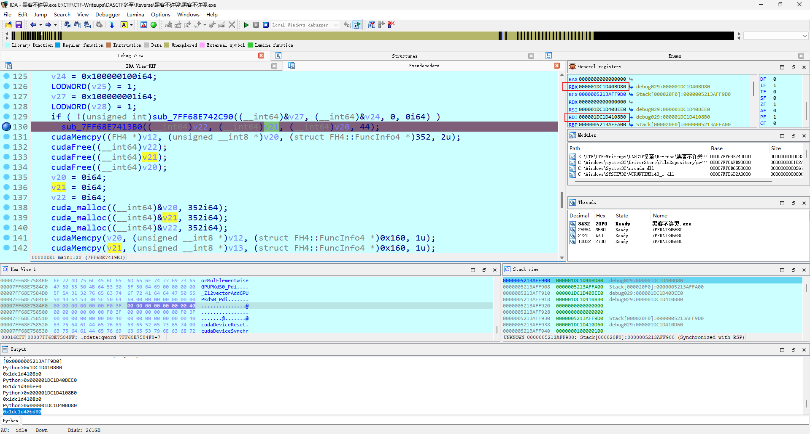
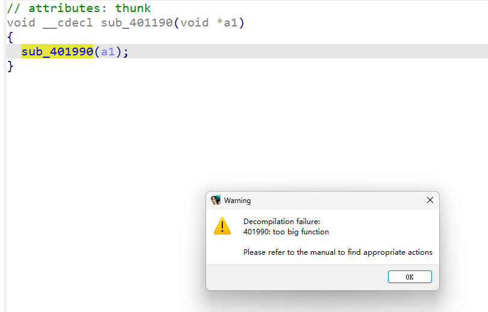
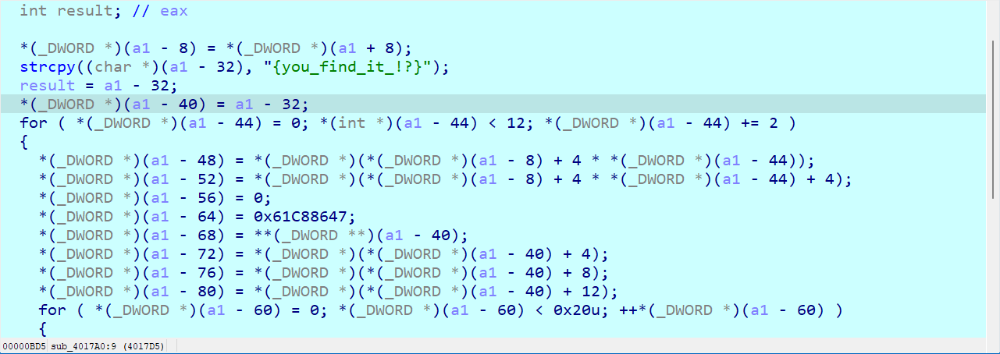
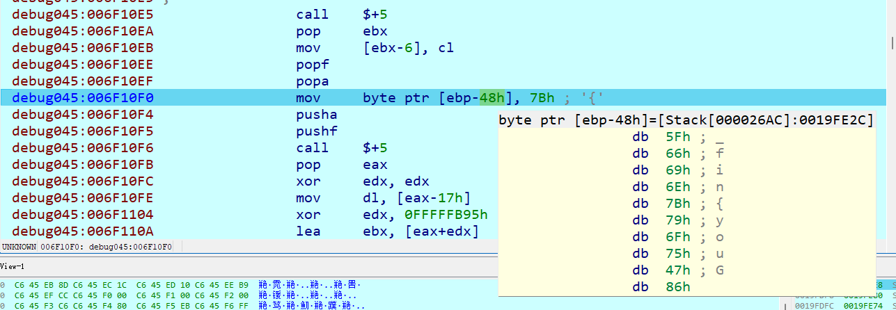
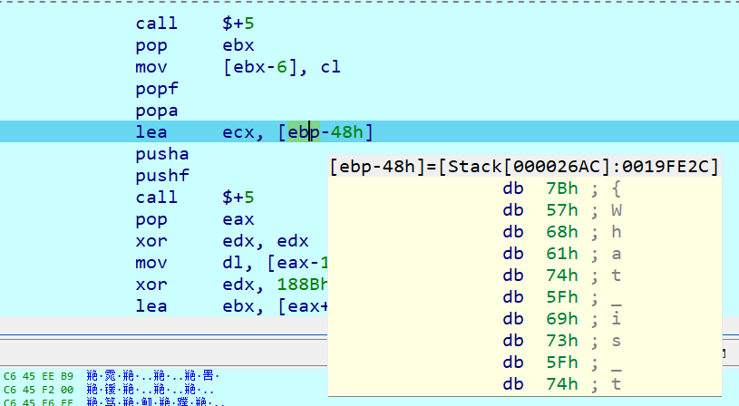
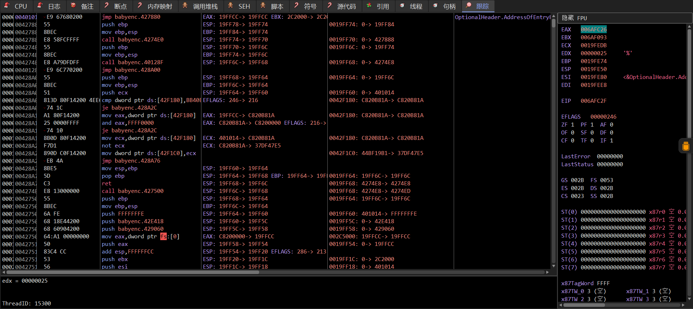

# DASCTF冬至最终之战

第六名，刚好拿了个三等，全靠web队友带

## tryre

- [x] 二血，过于简单，cyberchef秒了

找到可疑base64字符串和table，先异或2再base64解密得到flag，甚至没脚本直接cyberchef

## secret_of_inkey

- [x] 二血，读懂代码很简单，难度在那个很多方格的aes解密上

ida动态调试可知是aes解密，找到aes加密的数组（ida很多连续128字节数组），共961个，然后bfs遍历解密即可(已知初始565位置的key)，解密出来的是其他方块的index和key

```Python
from Crypto.Cipher import AES

with open("aes_enc", "rb") as f:
    data = f.read()

dec_result = [b""] * 961
dec_result[565] = b"9fc82e15d9de6ef2"
visited = [0] * 961

def decrypt(ciphertext, key):
    aes = AES.new(key, mode=AES.MODE_ECB)
    ciphertext = list(ciphertext)
    for i in range(len(ciphertext)):
        ciphertext[i] ^= key[i&0xf] ^ (i%32)
    new_result = []
    for i in range(0, len(ciphertext), 32):
        result = aes.decrypt(bytes(ciphertext[i:i+32]))
        try:
            key = result.split(b'"')[1]
            index = int(result.split(b'_')[2].decode())
            dec_result[index] = key
            new_result.append((index, key))
        except:
            print(result)
    return new_result


def bfs(result):
    if b"" not in dec_result:
        return
    new_result = []
    for i in range(len(result)):
        index = result[i][0]
        key = result[i][1]
        if visited[index] == 1:
            continue
        if index != 0:
            new_result += decrypt(data[-(index * 128 + 128):-(index * 128)], key)
        else:
            new_result += decrypt(data[-(index * 128 + 128):], key)
        visited[index] = 1
    if len(new_result) == 0:
        return
    bfs(new_result)


bfs([(565, b"9fc82e15d9de6ef2")])
print(dec_result)
```

最后在print(result)的结果里找到flag，DASCTF{Do_y0u_l1ke_wh4t_you_s3e}

## 黑客不许哭

- [ ] 能看懂是对flag做了浮点数计算操作，但是有点想骂人，那个最后的+100哪来的，比赛的时候都试遍了

前面很简单，能看出来对输入进行了乘法运算，还初始化了一个很大的数组，可以用python打印下来

~~~c
for ( i = 0; i < 44u; ++i )
{
  *(double *)&v8[8 * i] = (double)input[i] * *(double *)&qword_7FF68E76A000;
  *((_QWORD *)v13 + i) = qword_7FF68E76A010[i];
}
~~~

~~~python
import struct
from math import floor
from string import printable

cmp = [0x40B10696501E2585, 0x40B7EA4C5D638866, 0x40A0DD7DD1A21EA3, 0x40B755047D4E0978, 0x40C1EAEBA1FD156A, 0x40B814ADA31A4BDC, 0x40C802C39E8C47A1, 0x40AFF6A7A615A8DF, 0x40AA4164A3C64346, 0x40A2C755834091C1, 0x40A8FEE8FFDA4053, 0x40B3621E15011905, 0x40C025342C5E2CDC, 0x40A65E2036C9C0A9, 0x40905281565C2D28, 0x4090AE1F9D2BF552, 0x40A922F3E0157EED, 0x40B874F165C2D278, 0x40A99DE7B6FE2E6F, 0x4064172C9F2FDB90, 0x4082A661C68EC52A, 0x40A99BF2314013EC, 0x40B8E0C1F1F14984, 0x408A56DD68405B3A, 0x40B7252467CF1C32, 0x40A7CDDFD3B29A1C, 0x40C8E83135EB7458, 0x40A315184DFCE315, 0x409C8CA8B7E4DE3C, 0x40B327F640746456, 0x40B5F3DE9DF97AAB, 0x40AE167EEED8904F, 0x40B178FCD63CB817, 0x40C9A7D18476F2A6, 0x4099A285C5718EB9, 0x408E7B6FB86F47B6, 0x40A0FCC251E321A3, 0x40A1E3B0E1932D6F, 0x40A45B6A35B4EDB3, 0x40974258E8640208, 0x40C7DC0282E019B1, 0x40B1EC453A92A305, 0x40B2C35CF8B588E3, 0x40C975A6BC947065]
q = [0x404E425D046E0BBB, 0x40565E512BF5D8B8, 0x403807F2B4213872, 0x40552C14447517EC, 0x405A2AD9AF654289, 0x4054F066D7613C59, 0x40581A44A6E4B3A1, 0x4052D1537507F1FE, 0x404E2A6B8DC298FB, 0x40470D68C58C4673, 0x404C248F861F26DB, 0x4055AC1E8D98806B, 0x4054382EE9A71D0C, 0x404BA643C8564EC4, 0x40228603E483838D, 0x4034A091037CC6AF, 0x403F3092EE0B55F5, 0x405D0BF09991B04A, 0x403EDC239A70405A, 0x3FF10375A0B3084C, 0x40252ED23DE7CA70, 0x404BD327D12458CF, 0x405EBCD4229121F6, 0x401C90032C647FA6, 0x404BB99219281A65, 0x404F69DC68DC3E59, 0x405F53916405F1AA, 0x4046F8F189CB08B0, 0x404049328046AECF, 0x405717DDE2051F18, 0x405D6B8D70BC5387, 0x404FB611B00DAE6F, 0x4055057FF386071B, 0x405F536D3AFD1487, 0x403A812D835F129C, 0x402F378F374892AB, 0x4041D7F213D10431, 0x4042D635EB91F98C, 0x4038530805E42BBA, 0x4039B146B0E17FE6, 0x405D1DAF5CB6FEB2, 0x4055935E957A3B8B, 0x4053E1452099E93C, 0x405929B634E59ED1]
for i in range(len(cmp)):
    cmp[i] = struct.unpack(">d", bytes.fromhex(hex(cmp[i])[2:].zfill(16)))[0]
for i in range(len(q)):
    q[i] = struct.unpack(">d", bytes.fromhex(hex(q[i])[2:].zfill(16)))[0]
   
"""
[4358.58716, 6122.2983, 2158.74574, 5973.017537, 9173.840881, 6164.67827, 12293.528276, 4091.327439, 3360.696562, 2403.667017, 3199.455077, 4962.117508, 8266.407604, 2863.062918, 1044.626306, 1067.5308730000002, 3217.476319, 6260.942959, 3278.952568, 160.724197, 596.797742, 3277.973032, 6368.757598, 842.858109, 5925.142209, 3046.937162, 12752.384458, 2442.54747, 1827.164764, 4903.961921, 5619.869598, 3851.247916, 4472.987644, 13135.636855, 1640.630636, 975.429551, 2174.379531, 2289.845471, 2605.707441, 1488.586824, 12216.019619, 4588.270425, 4803.36317, 13035.30263]
[60.51846366284686, 89.4737043286176, 24.031047113523933, 84.68873702464015, 104.66953644646323, 83.75627693648984, 96.41044018110416, 75.27071882034213, 60.33140727998576, 46.10475987767577, 56.28563000222285, 86.68936481373537, 80.87786332435297, 55.29894355978243, 9.261748448423328, 20.6272127322797, 31.189741971747896, 116.18656005122571, 30.859918262868042, 1.0633446004217317, 10.591447767777225, 55.64965261721374, 122.95044769452201, 7.140637105592679, 55.44977106531295, 62.827038867512506, 125.30574894504994, 45.94487116254584, 32.57185367060958, 92.37291765689986, 117.68050783530462, 63.422414786033976, 84.08593452538155, 125.30354189600813, 26.504600725852114, 15.6085145259943, 35.687075116213585, 37.67352051379848, 24.32434117146088, 25.692484908155073, 116.46382825728031, 86.30264794289376, 79.51984419851664, 100.65174601005425]
"""
~~~

看cmp基本可以看出来很大，应该是做了input和q做了乘法

往后面就有点难读懂了，得动态调试确定下数据的变化（比赛没想到看寄存器里的地址，果然不能轻易相信ida给的值）



如上图，在第一个if里，v22是v4拷贝的，全是1（看RBX地址），v21是v8拷贝的，是输入*1.020123456789的结果（看RDI）

哦问了大佬们才知道动调找不出来函数作用，数据貌似去gpu上了。但是里面的cudaLaunchKernel里调用的第一个参数就是实际函数，可以交叉引用查看字符串知道该函数的作用，分别是vectorAddGPU和vectorMulElementwiseGPU

因此可以先根据数据的处理来猜测

~~~c
int __fastcall main(int argc, const char **argv, const char **envp)
{//...
  if ( IsDebuggerPresent() )
    exit(0);
  cuda_malloc((__int64)&Block, 8i64);
  cudaFree((__int64)Block);
  sub_7FF68E741D40("please input your flag:");
  sub_7FF68E741DA0("%s");
  v3 = -1i64;
  do
    ++v3;
  while ( input[v3] );
  if ( (_DWORD)v3 == 44 )
  {
    v4 = (unsigned __int8 *)operator new(0x160ui64);
    v27 = (__int64)v4;
    v29 = v4 + 352;
    v5 = (__m128i *)v4;
    si128 = _mm_load_si128((const __m128i *)&xmmword_7FF68E758500);// 1
    v7 = 2i64;
    do
    {
      *v5 = si128;
      v5[1] = si128;
      v5[2] = si128;
      v5[3] = si128;
      v5[4] = si128;
      v5[5] = si128;
      v5[6] = si128;
      v5 += 8;
      v5[-1] = si128;
      --v7;
    }
    while ( v7 );
    *v5 = si128;
    v5[1] = si128;
    v5[2] = si128;
    v5[3] = si128;
    v5[4] = si128;
    v5[5] = si128;
    v28 = v4 + 352;
    v8 = (unsigned __int8 *)operator new(0x160ui64);
    v24 = (__int64)v8;
    v26 = v8 + 352;
    v9 = (__m128i *)v8;
    v10 = _mm_load_si128((const __m128i *)&xmmword_7FF68E758510);// 2
    v11 = 2i64;
    do
    {
      *v9 = v10;
      v9[1] = v10;
      v9[2] = v10;
      v9[3] = v10;
      v9[4] = v10;
      v9[5] = v10;
      v9[6] = v10;
      v9 += 8;
      v9[-1] = v10;
      --v11;
    }
    while ( v11 );
    *v9 = v10;
    v9[1] = v10;
    v9[2] = v10;
    v9[3] = v10;
    v9[4] = v10;
    v9[5] = v10;
    v25 = v8 + 352;
    v12 = operator new(0x160ui64);
    v30 = v12;
    v32 = (__int64)v12 + 352;
    memset(v12, 0, 0x160ui64);
    v31 = (__int64)v12 + 352;
    v13 = operator new(0x160ui64);
    v33 = v13;
    v35 = (__int64)v13 + 352;
    memset(v13, 0, 0x160ui64);
    v34 = (__int64)v13 + 352;
    Block = operator new(0x160ui64);
    memset(Block, 0, 0x160ui64);
    for ( i = 0; i < 44u; ++i )
    {
      *(double *)&v8[8 * i] = (double)input[i] * *(double *)&qword_7FF68E76A000;
      *((_QWORD *)v13 + i) = qword_7FF68E76A010[i];
    }
    cuda_malloc((__int64)&v22, 352i64);
    cuda_malloc((__int64)&v21, 352i64);
    cuda_malloc((__int64)&v20, 352i64);
    cudaMemcpy(v22, v4, (struct FH4::FuncInfo4 *)0x160, 1u);
    cudaMemcpy(v21, v8, (struct FH4::FuncInfo4 *)0x160, 1u);
    v24 = 0x100000100i64;
    LODWORD(v25) = 1;
    v27 = 0x100000001i64;
    LODWORD(v28) = 1;
    if ( !(unsigned int)sub_7FF68E742C90((__int64)&v27, (__int64)&v24, 0i64, 0i64) )
      vectorAddGPU((__int64)v22, (__int64)v21, (__int64)v20, 44);
    cudaMemcpy((FH4 *)v12, (unsigned __int8 *)v20, (struct FH4::FuncInfo4 *)352, 2u);
    cudaFree((__int64)v22);
    cudaFree((__int64)v21);
    cudaFree((__int64)v20);
    v20 = 0i64;
    v21 = 0i64;
    v22 = 0i64;
    cuda_malloc((__int64)&v20, 352i64);
    cuda_malloc((__int64)&v21, 352i64);
    cuda_malloc((__int64)&v22, 352i64);
    cudaMemcpy(v20, (unsigned __int8 *)v12, (struct FH4::FuncInfo4 *)0x160, 1u);
    cudaMemcpy(v21, (unsigned __int8 *)v13, (struct FH4::FuncInfo4 *)0x160, 1u);
    v27 = 0x100000400i64;
    LODWORD(v28) = 1;
    v24 = 0x100000001i64;
    LODWORD(v25) = 1;
    if ( !(unsigned int)sub_7FF68E742C90((__int64)&v24, (__int64)&v27, 0i64, 0i64) )
      vectorMulElementwiseGPU((__int64)v20, (__int64)v21, (__int64)v22, 44);
    cudaDeviceSynchronize();
    if ( !(unsigned int)cudaGetLastError() )
      cudaMemcpy((FH4 *)v4, (unsigned __int8 *)v22, (struct FH4::FuncInfo4 *)0x160, 2u);
    cudaFree((__int64)v20);
    cudaFree((__int64)v21);
    cudaFree((__int64)v22);
    if ( *(double *)v4 == 1.0 )
    {
      sub_7FF68E741D40("hacker!");
      exit(0);
    }
    v15 = 0;
    while ( 1 )
    {
      v16 = *(double *)&v4[8 * v15];
      v17 = qword_7FF68E76A170[v15];
      if ( v16 != v17 )
        break;
      if ( ++v15 >= 44u )
      {
        v18 = "yes you get the flag";
        goto LABEL_25;
      }
    }
    v18 = "wrong";
LABEL_25:
    sub_7FF68E741D40(v18);
    if ( Block )
      j_j_free(Block);
    if ( v13 )
      j_j_free(v13);
    if ( v12 )
      j_j_free(v12);
    if ( v8 )
      j_j_free(v8);
    if ( v4 )
      j_j_free(v4);
  }
  else
  {
    sub_7FF68E741D40("wrong");
  }
  return 0;
}
~~~

第一个字符肯定是"D"，可以计算下，结果发现正好差100

~~~
(68*1.020123456789+1)*60.51846366284686
4258.58715955144
4358.58716-4258.58715955144
100.00000044856006
~~~

验证下第二个"A"也是接近100

~~~
(65*1.020123456789+1)*89.4737043286176
6022.298300171327
6122.2983-6022.298300171327
99.99999982867303
~~~

ok脚本解密即可

~~~python
import struct

cmp = [0x40B10696501E2585, 0x40B7EA4C5D638866, 0x40A0DD7DD1A21EA3, 0x40B755047D4E0978, 0x40C1EAEBA1FD156A, 0x40B814ADA31A4BDC, 0x40C802C39E8C47A1, 0x40AFF6A7A615A8DF, 0x40AA4164A3C64346, 0x40A2C755834091C1, 0x40A8FEE8FFDA4053, 0x40B3621E15011905, 0x40C025342C5E2CDC, 0x40A65E2036C9C0A9, 0x40905281565C2D28, 0x4090AE1F9D2BF552, 0x40A922F3E0157EED, 0x40B874F165C2D278, 0x40A99DE7B6FE2E6F, 0x4064172C9F2FDB90, 0x4082A661C68EC52A, 0x40A99BF2314013EC, 0x40B8E0C1F1F14984, 0x408A56DD68405B3A, 0x40B7252467CF1C32, 0x40A7CDDFD3B29A1C, 0x40C8E83135EB7458, 0x40A315184DFCE315, 0x409C8CA8B7E4DE3C, 0x40B327F640746456, 0x40B5F3DE9DF97AAB, 0x40AE167EEED8904F, 0x40B178FCD63CB817, 0x40C9A7D18476F2A6, 0x4099A285C5718EB9, 0x408E7B6FB86F47B6, 0x40A0FCC251E321A3, 0x40A1E3B0E1932D6F, 0x40A45B6A35B4EDB3, 0x40974258E8640208, 0x40C7DC0282E019B1, 0x40B1EC453A92A305, 0x40B2C35CF8B588E3, 0x40C975A6BC947065]
q = [0x404E425D046E0BBB, 0x40565E512BF5D8B8, 0x403807F2B4213872, 0x40552C14447517EC, 0x405A2AD9AF654289, 0x4054F066D7613C59, 0x40581A44A6E4B3A1, 0x4052D1537507F1FE, 0x404E2A6B8DC298FB, 0x40470D68C58C4673, 0x404C248F861F26DB, 0x4055AC1E8D98806B, 0x4054382EE9A71D0C, 0x404BA643C8564EC4, 0x40228603E483838D, 0x4034A091037CC6AF, 0x403F3092EE0B55F5, 0x405D0BF09991B04A, 0x403EDC239A70405A, 0x3FF10375A0B3084C, 0x40252ED23DE7CA70, 0x404BD327D12458CF, 0x405EBCD4229121F6, 0x401C90032C647FA6, 0x404BB99219281A65, 0x404F69DC68DC3E59, 0x405F53916405F1AA, 0x4046F8F189CB08B0, 0x404049328046AECF, 0x405717DDE2051F18, 0x405D6B8D70BC5387, 0x404FB611B00DAE6F, 0x4055057FF386071B, 0x405F536D3AFD1487, 0x403A812D835F129C, 0x402F378F374892AB, 0x4041D7F213D10431, 0x4042D635EB91F98C, 0x4038530805E42BBA, 0x4039B146B0E17FE6, 0x405D1DAF5CB6FEB2, 0x4055935E957A3B8B, 0x4053E1452099E93C, 0x405929B634E59ED1]
for i in range(len(cmp)):
    cmp[i] = struct.unpack(">d", bytes.fromhex(hex(cmp[i])[2:].zfill(16)))[0]
for i in range(len(q)):
    q[i] = struct.unpack(">d", bytes.fromhex(hex(q[i])[2:].zfill(16)))[0]
print(struct.unpack(">d", bytes.fromhex("3FF0526CF94CA8DB"))[0])

print(cmp)
print(q)
flag = ""
for i in range(len(cmp)):
    flag += chr(int(round(((cmp[i]-100)/q[i]-1)/1.020123456789)))
print(flag)
# DASCTF{34056b0c-a3d7-71ef-b132-92e8688d4e29}
~~~

## 刻板印象re

- [ ] 疯狂套娃，套了好几层加密，卡在最后一层了

**第一层**：看着很简单就是个异或，实际上sub_40126C被hook过了

~~~c
int __cdecl main_0(int argc, const char **argv, const char **envp)
{
  char v4; // [esp+0h] [ebp-44h]
  char v5; // [esp+0h] [ebp-44h]
  char Str[60]; // [esp+8h] [ebp-3Ch] BYREF

  printf(aWelcomeToDasct, v4);
  scanf(a48s, (char)Str);
  if ( strlen(Str) == 48 )
  {
    sub_40126C(Str);
    if ( !memcmp(Str, &unk_42F000, 0x30u) )
      printf(aRight, v5);
    else
      printf(aWrong, v5);
    return 0;
  }
  else
  {
    printf(aLengthWrong, v5);
    return 0;
  }
}
// attributes: thunk
int __cdecl sub_40126C(int a1)
{
  return sub_401740(a1);
}
int __cdecl sub_401740(int a1)
{
  int result; // eax
  int i; // [esp+58h] [ebp-4h]

  for ( i = 0; i < 48; ++i )
  {
    *(_BYTE *)(i + a1) ^= byte_42F090[i % 26];
    result = i + 1;
  }
  return result;
}
~~~

hook函数，结合动态调试可知

~~~c
void *sub_401540()
{
  DWORD flOldProtect[3]; // [esp+Ch] [ebp-30h] BYREF
  int Src[3]; // [esp+18h] [ebp-24h] BYREF
  int v3; // [esp+24h] [ebp-18h]
  int v4; // [esp+28h] [ebp-14h]
  void *v5; // [esp+2Ch] [ebp-10h]
  LPVOID lpAddress; // [esp+30h] [ebp-Ch]
  int v7; // [esp+34h] [ebp-8h]
  int (__cdecl *v8)(int); // [esp+38h] [ebp-4h]

  v8 = sub_40126C;
  v7 = (int)sub_40126C + 1;
  lpAddress = (char *)sub_40126C + *(_DWORD *)((char *)sub_40126C + 1) + 5;
  v5 = &sub_4010F0;
  v4 = (int)&sub_4010F0 + 1;
  v3 = (int)&sub_4010F0 + *(_DWORD *)((char *)&sub_4010F0 + 1) + 5;
  Src[2] = v3 - ((_DWORD)sub_40126C + 5);
  Src[0] = v3 - ((_DWORD)lpAddress + 5);
  VirtualProtect(lpAddress, 5u, 0x40u, flOldProtect);
  memcpy(&unk_42F6C0, lpAddress, 5u);
  *(_BYTE *)lpAddress = -23;
  return memcpy((char *)lpAddress + 1, Src, 4u);
}
~~~

**第二层**：真实函数是先异或完再去xtea加密（sub_40126C return跳转到xtea）

~~~c
int __cdecl sub_41F000(int a1)
{
  int v2[3]; // [esp+4h] [ebp-14h] BYREF
  void *lpAddress; // [esp+14h] [ebp-4h]

  memset(v2, 204, 10);
  lpAddress = malloc(0x4359u);
  sub_401190(lpAddress);
  sub_40119A();
  sub_40126C(a1);
  VirtualProtect(lpAddress, 0x4358u, 0x40u, (PDWORD)&v2[2]);
  v2[0] = (int)lpAddress + 1;
  return ((int (__cdecl *)(int))((char *)lpAddress + 1))(a1);
}
~~~



第一个函数里mov传入了大量shellcode，导致代码无法直接反编译，因此可以动态调试，异或return直接跳到了xtea加密



**第三层**：sub_41F000函数最后又进行了加密`((int (__cdecl *)(int))((char *)lpAddress + 1))(a1);`，不过不太常规，没法直接构建函数

动态调试查看汇编代码如下，主要是借助pusha（16位通用寄存器入栈）、pushf（16位标志寄存器入栈）以及popa、popf来操作数据，借助xor生成新的跳转位置使用jmp ebx跳转，很麻烦，貌似只能人工读代码

~~~
debug045:006ED049                 mov     ecx, 77h ; 'w'
debug045:006ED04E                 call    $+5
debug045:006ED053                 pop     ebx
debug045:006ED054                 mov     [ebx-0Bh], cl
debug045:006ED057                 push    ebp
debug045:006ED058                 pusha
debug045:006ED059                 pushf
debug045:006ED05A                 call    $+5
debug045:006ED05F                 pop     eax
debug045:006ED060                 xor     edx, edx
debug045:006ED062                 mov     dl, [eax-17h]
debug045:006ED068                 xor     edx, 1D82h
debug045:006ED06E                 lea     ebx, [eax+edx]
debug045:006ED071                 mov     ecx, 35h ; '5'
debug045:006ED076                 mov     byte ptr [eax-17h], 0
debug045:006ED07D                 jmp     ebx
~~~

调试过程中先观察到修改了上面xtea字符串，使用的方法都是`mov byte ptr [ebp-xxh], xxh`



直到赋值结束，发现新的字符串（`{What_is_this_?}`，长度正好16字节）地址给ecx



到这里基本搞懂了需要trace，找到popa和pusha的指令。尝试了一晚上发现ida没法实现指令打印，貌似和代码段在debug里的原因，最后只好用[x32dbg](https://www.52pojie.cn/thread-1780428-1-1.html)，只能说真香。设置下eip停止的位置，把前面所有的指令全部追踪了出来，复制下来到txt



然后用了大佬wp给的脚本读取

~~~python
# 读取文件并提取每列的数据
class CODE:
    def __init__(self, index, eip, asm, dis):
        self.index = index
        self.eip = eip
        self.asm = asm
        self.dis = dis
def extract_columns_from_file(file_path):
    # 打开文件并读取所有行
    with open(file_path, 'r', encoding='utf-8') as file:
        lines = file.readlines()
    codes = []
    # 处理每一行，提取每一列的数据
    for i in range(len(lines)):
        line = lines[i]
        # 去除行首尾的空白符，并按'|'分割
        parts = line.strip().split('|')
        # 确保行包含至少7个部分，防止异常
        if len(parts) >= 6:
            #column1.append(parts[0].strip())
            eip = int(parts[1].strip(), 16)
            asm = parts[2].strip().replace(" ", "")
            dis = parts[3].strip()
            code = CODE(i, eip, asm, dis)
            codes.append(code)
            # 返回每列的数据作为结果
    return codes

file_path = 'babyenc.log'
codes = extract_columns_from_file(file_path)

final_codes = []
final_codes.append(codes[0x5])
for i in range(0x16, len(codes) - 1):
    insert1 = 0
    insert2 = 0
    code = codes[i]
    #普通的指令
    if codes[i - 1].dis == "popad" and codes[i + 1].dis == "pushad":
        insert1 = 1
        # for k in range(len(final_codes)):
        #     if final_codes[k].eip == code.eip:
        #         insert1 = 0
        #         break
    #跳转指令
    if codes[i - 2].dis == "pushfd" and codes[i + 1].dis == "popfd":
        insert2 = 1
        # for k in range(len(final_codes)):
        #     if final_codes[k].eip == code.eip:
        #         insert2 = 0
        #         break
    if insert1 == 1 or insert2 == 1:
        final_codes.append(code)
final_codes.append(codes[len(codes)- 1])
for i in range(len(final_codes)):
    code = final_codes[i]
    print(f"{(code.eip):X} {code.asm} {code.dis}")
~~~

得到很完整的函数操作

~~~
4274 8BEC mov ebp,esp
6B0E 8BEC mov ebp,esp
6B28 83EC78 sub esp,78
6B11 56 push esi
6AF1 57 push edi
6AF4 C745EC0C000000 mov dword ptr ss:[ebp-14],C
6B10 8B4508 mov eax,dword ptr ss:[ebp+8]
6AF8 8945F0 mov dword ptr ss:[ebp-10],eax
6B31 C645B87B mov byte ptr ss:[ebp-48],7B
6B2D C645B957 mov byte ptr ss:[ebp-47],57
6B06 C645BA68 mov byte ptr ss:[ebp-46],68
6B28 C645BB61 mov byte ptr ss:[ebp-45],61
6B16 C645BC74 mov byte ptr ss:[ebp-44],74
6B0A C645BD5F mov byte ptr ss:[ebp-43],5F
6B1C C645BE69 mov byte ptr ss:[ebp-42],69
6AF2 C645BF73 mov byte ptr ss:[ebp-41],73
6AF4 C645C05F mov byte ptr ss:[ebp-40],5F
6B0C C645C174 mov byte ptr ss:[ebp-3F],74
6AF1 C645C268 mov byte ptr ss:[ebp-3E],68
6B1B C645C369 mov byte ptr ss:[ebp-3D],69
6B23 C645C473 mov byte ptr ss:[ebp-3C],73
6B15 C645C55F mov byte ptr ss:[ebp-3B],5F
6B00 C645C63F mov byte ptr ss:[ebp-3A],3F
6B0B C645C77D mov byte ptr ss:[ebp-39],7D
6AFB 8D4DB8 lea ecx,dword ptr ss:[ebp-48]
6B14 894DD8 mov dword ptr ss:[ebp-28],ecx
6B19 837DEC01 cmp dword ptr ss:[ebp-14],1
6B00 0F8EC7F4FFFF jle 6AF57A
6B1D B834000000 mov eax,34
6B19 99 cdq
6B18 F77DEC idiv dword ptr ss:[ebp-14]
6B30 83C006 add eax,6
6AF2 8945E4 mov dword ptr ss:[ebp-1C],eax
6B2A C745E800000000 mov dword ptr ss:[ebp-18],0
6B28 8B55EC mov edx,dword ptr ss:[ebp-14]
6B0D 8B45F0 mov eax,dword ptr ss:[ebp-10]
6B2C 8B4C90FC mov ecx,dword ptr ds:[eax+edx*
6B18 894DF8 mov dword ptr ss:[ebp-8],ecx
6B20 8B55E8 mov edx,dword ptr ss:[ebp-18]
6B1C 81C219144511 add edx,11451419
6B1C 8955E8 mov dword ptr ss:[ebp-18],edx
6B25 8B45E8 mov eax,dword ptr ss:[ebp-18]
6B0C C1E802 shr eax,2
6B19 83E003 and eax,3
...
~~~

发现了关键特征6+52//n即xxtea加密

~~~
6B1D B834000000 mov eax,34
6B18 F77DEC idiv dword ptr ss:[ebp-14]
6B30 83C006 add eax,6
~~~

此外发现add edx, 0x11451419出现10次，正好对应6+52//12，12个4字节正好是输入的48字节。

还要注意的是看最后发现出现了多次重复`6B1C 33C1 xor eax,ecx`正好48次，猜测异或了数组，离第一个异或位置上头赋值了新数组，基本确定是和它异或

ok到这里所有数据都拿到了，解密启动

~~~python
import struct
from ctypes import c_uint32


def xtea_encrypt(r, v, key):
    v0, v1 = c_uint32(v[0]), c_uint32(v[1])
    delta = 0x61C88647
    total = c_uint32(0)
    for i in range(r):
        v0.value += (((v1.value << 4) ^ (v1.value >> 5)) + v1.value) ^ (total.value + key[total.value & 3])
        total.value -= delta
        v1.value += (((v0.value << 4) ^ (v0.value >> 5)) + v0.value) ^ (total.value + key[(total.value >> 11) & 3])
    return v0.value, v1.value

def xtea_decrypt(r, v, key):
    v0, v1 = c_uint32(v[0]), c_uint32(v[1])
    delta = 0x61C88647
    total = c_uint32(-delta * r)
    for i in range(r):
        v1.value -= (((v0.value << 4) ^ (v0.value >> 5)) + v0.value) ^ (total.value + key[(total.value >> 11) & 3])
        total.value += delta
        v0.value -= (((v1.value << 4) ^ (v1.value >> 5)) + v1.value) ^ (total.value + key[total.value & 3])
    return v0.value, v1.value

def xxtea_decrypt(n, v, key):
    # 全部转为c_unit32格式
    v = [c_uint32(i) for i in v]
    r = 6 + 52 // n
    v0 = v[0].value
    delta = 0x11451419
    total = c_uint32(delta * r)
    for i in range(r):
        e = (total.value >> 2) & 3
        for j in range(n-1, 0, -1):
            v1 = v[j-1].value
            v[j].value -= ((((v1 >> 5) ^ (v0 << 2)) + ((v0 >> 3) ^ (v1 << 4))) ^ ((total.value ^ v0) + (key[(j & 3) ^ e] ^ v1)))
            v0 = v[j].value
        v1 = v[n-1].value
        v[0].value -= ((((v1 >> 5) ^ (v0 << 2)) + ((v0 >> 3) ^ (v1 << 4))) ^ ((total.value ^ v0) + (key[(0 & 3) ^ e] ^ v1)))
        v0 = v[0].value
        total.value -= delta
    return [i.value for i in v]


xxtea_xor = [0x8f, 0x6c, 0xa6, 0x3f, 0x94, 0x3d, 0xf5, 0xd9, 0x36, 0x66, 0x51, 0xd7, 0x66, 0x2f, 0xb3, 0x8f, 0xc0, 0x61, 0x9e, 0xce, 0xe9, 0xd7, 0xe1, 0xbf, 0x13, 0x14, 0x16, 0x14, 0xc2, 0xe7, 0xc3, 0x3a, 0x7f, 0x94, 0xa1, 0xe7, 0x24, 0xe, 0xa7, 0x5c, 0xd3, 0x77, 0xfe, 0x4f, 0x11, 0xdc, 0x69, 0x23]
v = [0x18, 0x09, 0x1C, 0x14, 0x37, 0x1D, 0x16, 0x2D, 0x3C, 0x05, 0x16, 0x3E, 0x02, 0x03, 0x10, 0x2C, 0x0E, 0x31, 0x39, 0x15, 0x04, 0x3A, 0x39, 0x03, 0x0D, 0x13, 0x2B, 0x3E, 0x06, 0x08, 0x37, 0x00, 0x17, 0x0B, 0x00, 0x1D, 0x1C, 0x00, 0x16, 0x06, 0x07, 0x17, 0x30, 0x03, 0x30, 0x06, 0x0A, 0x71, 0xC2, 0x39, 0x3F, 0xF7, 0xEB, 0x24, 0x94, 0x4D, 0x99, 0x41, 0x7E, 0xFC, 0x41, 0x79, 0xAB, 0xC8, 0x5E, 0xD0, 0x3B, 0xD7, 0x85, 0x63, 0xD3, 0x1D, 0xCB, 0x98, 0x5A, 0x06, 0x21, 0x8B, 0xA3, 0xD8, 0xE3, 0x86, 0x1A, 0x37, 0x4A, 0x8A, 0x5C, 0xD2, 0x53, 0xCB, 0x14, 0x3C, 0x89, 0xEB, 0x71, 0xEB][:48]
for i in range(48):
    v[i] ^= xxtea_xor[i]
k = b"{What_is_this_?}"
k = [struct.unpack("<I", k[i:i+4])[0] for i in range(0, 16, 4)]
v = [struct.unpack("<I", bytes(v[i:i+4]))[0] for i in range(0, len(v), 4)]
v = xxtea_decrypt(len(v), v, k)
tmp_v = []
for i in range(len(v)):
    tmp_v += list(struct.pack('<I', v[i]))

xtea_xor = [0xDA, 0x30, 0x23, 0xE3, 0xDC, 0x39, 0x82, 0x60, 0xA5, 0x44, 0x68, 0xC2, 0x43, 0x7A, 0xBB, 0xE4, 0x50, 0xE1, 0x02, 0xC2, 0x81, 0x59, 0xEA, 0x1E, 0xC6, 0x8B, 0x71, 0x38, 0x27, 0x83, 0x94, 0xD8, 0xF4, 0x8D, 0x1A, 0x2A, 0x56, 0x8A, 0x4A, 0xD4, 0x54, 0xDC, 0x24, 0x3F, 0xB9, 0xED, 0x7B, 0x9A]
for i in range(48):
    tmp_v[i] = tmp_v[i] ^ xtea_xor[i]
v = [struct.unpack("<I", bytes(tmp_v[i:i+4]))[0] for i in range(0, len(tmp_v), 4)]
k = b"{you_find_it_!?}"
k = [struct.unpack("<I", k[i:i+4])[0] for i in range(0, 16, 4)]
for i in range(0, len(v), 2):
    v[i:i+2] = xtea_decrypt(32, v[i:i+2], k)
str_list = []
for i in range(len(v)):
    str_list += list(struct.pack('<I', v[i]))

key = b"Laughter_is_poison_to_fear"
for i in range(len(str_list)):
    str_list[i] ^= key[i%26]
print("".join(map(chr, str_list)))
# DASCTF{You_come_to_me_better_than_all_the_good.}
~~~

通过这道题学会了trace的思想，ida和x96dbg都试着用了下