# DeadSec CTF 2024 WP

## Reverse

### JavaCPScript

- [x] solved

给了四个文件：input、main.js、package.json、Util.js

~~~js
"use strict";

const { Mutex, sleep, Recurse, TaskManager, ProcessTask, ProcessTaskSequence, Solver, callImmediate, callSetTimeout, callNextTick, callReadFileSync } = require('./Util.js');
const fs = require('node:fs');
const mutex = [new Mutex(1), new Mutex(3)];
console.log = (...args) => {fs.writeFileSync(1, `${args}\n`)};

function manageTasks(execute) {
    function taskHandler(taskId, action) {
        if (taskId < 2304)
            return ProcessTask(taskId, action, (a) => { return execute(taskId + 1, a); })
        else {
            return ProcessTaskSequence(action,
                (id, i, completeTask) => {
                    return TaskManager((r) => {
                        return async (i, obj) => {
                            let idx = (id % 8) ? 0 : 1;
                            switch (i) {
                                case 0:
                                    await callReadFileSync(obj, mutex[idx], id);
                                    break;
                                case 1:
                                    callSetTimeout(obj, mutex[idx]);
                                    callImmediate(obj, mutex[idx]);
                                    break;
                                case 2:
                                    callNextTick(obj);
                                    obj.data ^= ((obj.data >> 6) | (obj.data << 2));
                                    break;
                                default:
                                    return completeTask(obj);
                            }
                            await sleep(0);
                            return r(i + 1,obj);
                        }})(0, { data: id });
                },
                (action) => {
                    return ProcessTask(3895813, null,
                        (task) => ProcessTask(3893664, task,
                        (task) => ProcessTask(3895583, task,
                        (task) => ProcessTask(3893639, task,
                        (task) => ProcessTask(3919755, task,
                        (task) => ProcessTask(3893694, task,
                        (task) => ProcessTask(3871506, task,
                        (task) => ProcessTask(3871544, task,
                        (task) => ProcessTask(3810527, task,
                        (task) => ProcessTask(3921672, task,
                        (task) => ProcessTask(3913158, task,
                        (task) => ProcessTask(3813122, task,
                        (task) => ProcessTask(3869603, task,
                        (task) => ProcessTask(3813209, task,
                        (task) => ProcessTask(3910936, task,
                        (task) => ProcessTask(3911023, task,
                        (task) => ProcessTask(3896081, task,
                        (task) => ProcessTask(3822626, task,
                        (task) => ProcessTask(3913160, task,
                        (task) => ProcessTask(3919793, task,
                        (task) => ProcessTask(3822653, task,
                        (task) => ProcessTask(3895614, task,
                        (task) => ProcessTask(3820987, task,
                        (task) => ProcessTask(3820987, task,
                        (task) => ProcessTask(3932159, task,
                        (task) => ProcessTask(3911025, task,
                        (task) => ProcessTask(3893657, task,
                        (task) => ProcessTask(3921671, task,
                        (task) => ProcessTask(3820578, task,
                        (task) => ProcessTask(3921709, task,
                        (task) => ProcessTask(3921698, task,
                        (task) => ProcessTask(3910918, task, (task) => Solver(task, action, (flag) => { console.log(`flag: ${flag}`); })
                    ))))))))))))))))))))))))))))))));
                }
            );
        }
    }
    return taskHandler;
}

TaskManager(manageTasks)(0, null);

~~~

直接运行main.js报错，调用栈的数目过大，目测和ExecuteTask有关

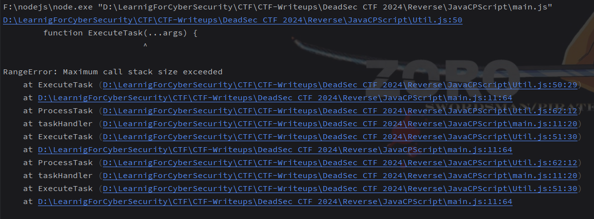

比赛的时候脑袋没转过来，忽视了package.json里给的运行方法，node加上参数即可运行

~~~json
{
  "name": "JavaCPScript",
  "version": "1.0.0",
  "description": "Mutex in JavaCPScript",
  "scripts": {
    "release": "node --stack-size=1000000000 main.js",
    "debug": "node --stack-size=1000000000 --trace-event-categories node.async_hooks,node.promises main.js"
  }
}
~~~

但是说到根本还是调用了过多的栈，导致运行较长时间。首先关注input文件的调用（Util.js中）

~~~js
async function callReadFileSync(obj, mutex, range) {
    const release = await mutex.lock();
    const chunk = fs.readFileSync('input');
    obj.data ^= chunk[range%32];
    release();
}
~~~

这里读取了input的字节到chunk变量中，obj.data变量与chunk[range%32]异或，值赋给obj.data。这里可以合理猜测input内容为32位，逐位做了异或处理

因此关注obj.data变量的去向，发现main和Util中共有6处地方出现

~~~js
// main case 2
obj.data ^= ((obj.data >> 6) | (obj.data << 2));
// Util
return d(i, k, (g) && ((h == null) ? true : (h == j.data)))		// Solver
obj.data ^= ((obj.data >> 7) | (obj.data << 1));	// callImmediate
obj.data ^= ((obj.data >> 4) | (obj.data << 4));	// callSetTimeout
obj.data ^= ((obj.data >> 5) | (obj.data << 3));	// callNextTick
obj.data ^= chunk[range%32];						// callReadFileSync
~~~

其中return后的三元运算符为判断是否相等，其余均为处理步骤。回到main的switch-case

~~~js
return async (i, obj) => {
    let idx = (id % 8) ? 0 : 1;	// id为8的倍数时idx=0
    switch (i) {
        case 0:
            await callReadFileSync(obj, mutex[idx], id);
            break;
        case 1:
            callSetTimeout(obj, mutex[idx]);
            callImmediate(obj, mutex[idx]);
            break;
        case 2:
            callNextTick(obj);
            obj.data ^= ((obj.data >> 6) | (obj.data << 2));
            break;
        default:
            return completeTask(obj);
    }
    await sleep(0);
    return r(i + 1,obj);
}})(0, { data: id });	// 初始data为id值
~~~

可以看到每个case均对obj.data做了处理，关键是处理的顺序，正常来说肯定是按照0、1、2顺序逐步执行，但是其中mutex变量的命名说明采用了互斥锁原理，同时函数里存在settimeout、immediate等字眼，说明执行顺序不是正常的

比赛时这道题我采用动态调试的方法一步步看函数的调用，断点就下在这些obj.data处理的步骤，观察到执行顺序如下：

* 当id不为8的倍数时：callReadFileSync-->main-->callNextTick-->callSetTimeout-->callImmediate
* 当id为8的倍数时：callReadFileSync-->callImmediate-->main-->callNextTick-->callSetTimeout

最终的值正好一一对应main.js里ProcessTask函数里的id（多调试测试下即可，注意为了减少堆栈调用可以把main.js里的`if (taskId < 2304)`的范围改小比如32）

2304正好是32的倍数，因此最后取得i是2304-32到2303范围（每32一组，保留最后一组值，动态调试看出来的）

写[脚本](./Reverse/JavaCPScript/solve.py)还原思路

~~~python
task = []
for i in range(2304-32, 2304):
    t = []
    for j in range(32, 126):	# 可打印字符范围
        data = i	# id
        data ^= j	# callReadFileSync
        if i % 8 != 0:
            data ^= ((data >> 6) | (data << 2))
            data ^= ((data >> 5) | (data << 3))
            data ^= ((data >> 4) | (data << 4))
            data ^= ((data >> 7) | (data << 1))
        else:
            data ^= ((data >> 7) | (data << 1))
            data ^= ((data >> 6) | (data << 2))
            data ^= ((data >> 5) | (data << 3))
            data ^= ((data >> 4) | (data << 4))
        t.append(data)
    task.append(t)
# print(task)
s = [3910918, 3921698, 3921709, 3820578, 3921671, 3893657, 3911025, 3932159, 3820987, 3820987, 3895614, 3822653, 3919793, 3913160, 3822626, 3896081, 3911023, 3910936, 3813209, 3869603, 3813122, 3913158, 3921672, 3810527, 3871544, 3871506, 3893694, 3919755, 3893639, 3895583, 3893664, 3895813]
s = s[::-1]	# 堆栈从里到外调用，顺序反过来
flag = ""
for i in range(len(s)):
    flag += chr(task[i].index(s[i])+32)	# 索引值+32为ascii值
print(flag)
~~~

flag：DEAD{CPS7yl3_4nd_3vn7_10op_h3ll}

### FlagChecker

- [ ] solved

提供了elf文件，ida检查可以发现py标志，说明是pyinstaller创建的，pyinstxtractor脚本提取即可

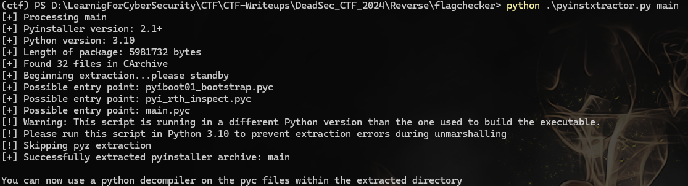

由图可知python版本3.10，因此uncompyle6无法使用，因此使用[pycdc](https://github.com/zrax/pycdc)

~~~
pycdc.exe main.pyc > main.py
~~~

得到一下代码，第一眼看上去很简单只是个异或，但是运行完（忽视checker调用和chk值）打印的是Wrong

~~~python
# Source Generated with Decompyle++
# File: main.pyc (Python 3.10)


def emulate(opcodes):
    exec(opcodes, globals())


def main():
    global chk, t, FLAG, checker
    chk = 0
    t = [92, 138, 226, 248, 124, 187, 195, 106, 182, 233, 9, 79, 134, 101, 53, 240, 196, 183, 141, 83, 84, 118, 226, 6, 251, 74, 94, 37, 117, 90]
    
    try:
        FLAG = list(input('Flag : ').encode())
    finally:
        pass
    print()
    # return None	# 应该没有
    import checker
    if chk == 4919:
        checker.check()
        for i, c in enumerate([11, 248, 141, 150, 27, 187, 195, 106, 182, 233, 9, 79, 134, 101, 53, 240, 196, 183, 141, 83, 84, 118, 226, 6, 251, 74, 94, 37, 117, 90]):
            t[i] ^= c
        print(''.join(map(chr, t)))
        return None
    None('Wrong')	# 估计是print
    return None


if __name__ == '__main__':
    main()
    return None
~~~

由此可见真正的逻辑在checker库里，需要满足chk==4919且t值变化，所以去看之前提取文件夹里的checker.so，找到check函数调用

~~~c
__int64 PyInit_checker()
{
  bool v1; // [rsp+Fh] [rbp-31h]
  int i; // [rsp+10h] [rbp-30h]
  __int64 v3; // [rsp+18h] [rbp-28h]
  __int64 v4; // [rsp+20h] [rbp-20h]
  __int64 Item; // [rsp+30h] [rbp-10h]
  __int64 v6; // [rsp+30h] [rbp-10h]

  qword_6780 = PyImport_ImportModule("__main__");	// 导入模块
  qword_6788 = sub_13ED(qword_6780, &unk_307F);	// emulate
  v3 = PyModule_Create2(&unk_6480, 1013LL);		// 创建模块
  if ( !v3 )
    return 0LL;
  if ( (int)PyModule_AddFunctions(v3, &off_6500) >= 0 )	// 往先前模块添加了某个函数
  {
    v4 = sub_13ED(qword_6780, "钩靖");	// FLAG
    if ( PyList_Size(v4) == 32 )
    {
      Item = PyList_GetItem(v4, 31LL);	// 根据下标取字符
      v1 = PyLong_AsLong(Item) == 125;
      for ( i = 0; i <= 4; ++i )
      {
        v6 = PyList_GetItem(v4, i);
        if ( (unsigned int)PyLong_AsLong(v6) != off_6460[i] )	// DEAD{
          v1 = 0;
      }
    }
    else
    {
      v1 = 0;
    }
    if ( v1 )
    {
      sub_13ED(qword_6780, &unk_3087);	// ch
      PyLong_FromLong(4919LL);
      PyObject_SetAttrString();
    }
    ++dword_6790;
    return v3;
  }
  else
  {
    sub_1396(v3);
    return 0LL;
  }
}
~~~

其中sub_13ED函数如下，

~~~c
__int64 __fastcall sub_13ED(__int64 a1, const char *a2)
{
  int i; // [rsp+18h] [rbp-28h]
  __int64 v4; // [rsp+1Eh] [rbp-22h] BYREF
  __int16 v5; // [rsp+26h] [rbp-1Ah]
  unsigned __int64 v6; // [rsp+28h] [rbp-18h]

  v6 = __readfsqword(0x28u);
  v4 = 0LL;
  v5 = 0;
  for ( i = 0; i < strlen(a2); ++i )
    *((_BYTE *)&v4 + i) = ~a2[i];
  return off_66A0(a1, &v4);
}
~~~

&unk_307F值为[0x9A, 0x92, 0x8A, 0x93, 0x9E, 0x8B, 0x9A]，取非得到字符串emulate，以此类推

根据上述代码得到以下信息：

* sub_13ED获取变量字符串并通过PyObject_GetAttrString实现调用
* FLAG长度应为32，且以`DEAD{`开头`}`结尾

这里为了更好判断函数，在linux中进行动态调试（windows上so文件没法调用），在import checker后断点并查看模块下的函数，如红框所示，可以看到多个类似A和X的函数

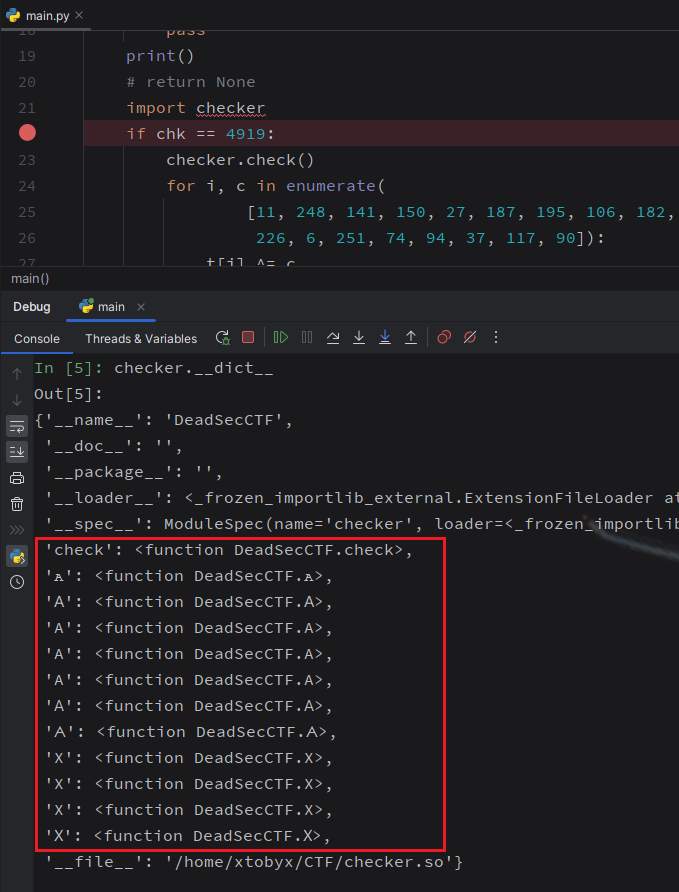

经过ida逐个函数对比查看可知：上面11个特殊符号的函数对应下面红框里的函数，均为一个处理操作，如ror、rol、+=、-=、<<等

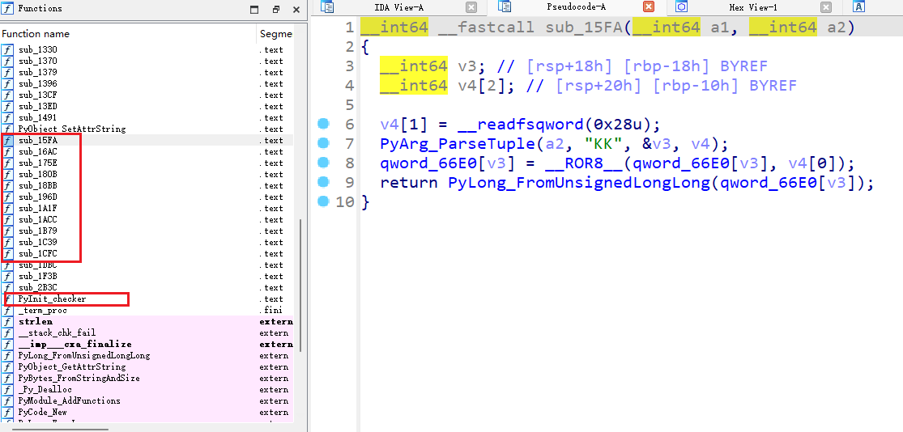

定位check函数（&off_6500），可以看到4个qword数分别和64位数异或，只有全部相等if才成立，取t变量并逐元素赋值

~~~c
__int64 sub_2B3C()
{
  __int64 v0; // rax
  int i; // [rsp+0h] [rbp-10h]
  signed int j; // [rsp+4h] [rbp-Ch]
  __int64 v4; // [rsp+8h] [rbp-8h]

  sub_1F3B();
  for ( i = 0; i <= 2; ++i )
    sub_1DBC();
  if ( !(qword_66F0 ^ 0xFDF61CB53A00DAA8LL | qword_66E8 ^ 0x273AED9AEFD29A3CLL | qword_66E0 ^ 0x7AB48E39E26BE2A7LL | qword_66F8 ^ 0xFC796489FC8864EELL) )
  {
    v4 = sub_13ED(qword_6780, byte_3048);	// t
    for ( j = 0; (unsigned int)j <= 0x1D; ++j )
    {
      v0 = PyLong_FromUnsignedLongLong(byte_6410[j]);
      PyList_SetItem(v4, j, v0);
    }
  }
  return sub_13CF(&Py_NoneStruct);
}
~~~

导出byte_6410结果如下

~~~python
[0x48, 0x97, 0xFF, 0xE4, 0x7E, 0xD8, 0xB7, 0x4B, 0xB6, 0xE9, 0x09, 0x4F, 0x86, 0x65, 0x35, 0xF0, 0xC4, 0xB7, 0x8D, 0x53, 0x54, 0x76, 0xE2, 0x06, 0xFB, 0x4A, 0x5E, 0x25, 0x75, 0x5A, 0x00, 0x00]
~~~

分别和main.py里check后的数组异或，打印正好是`Correct!`

再看sub_1F3B

~~~c
__int64 sub_1F3B()
{
  v72 = sub_13ED(qword_6780, "钩靖");	// 同前 FLAG
  v73 = PyList_Size();
  for ( i = 0; v73 > i; ++i )
  {
    Item = PyList_GetItem(v72, i);
    *((_BYTE *)qword_66E0 + i) = PyLong_AsLong(Item);	
  }
  v67 = PyLong_FromUnsignedLongLong(117LL);	// 这里不要看反编译结果，直接看汇编代码可以看到，全部push到了PyTuple_Pack准备调用的栈中
  PyLong_FromUnsignedLongLong(167LL);
  PyLong_FromUnsignedLongLong(217LL);
  PyLong_FromUnsignedLongLong(174LL);
  PyLong_FromUnsignedLongLong(251LL);
  PyLong_FromUnsignedLongLong(123LL);
  PyLong_FromUnsignedLongLong(115LL);
  PyLong_FromUnsignedLongLong(253LL);
  PyLong_FromUnsignedLongLong(150LL);
  PyLong_FromUnsignedLongLong(216LL);
  PyLong_FromUnsignedLongLong(93LL);
  PyLong_FromUnsignedLongLong(47LL);
  PyLong_FromUnsignedLongLong(238LL);
  PyLong_FromUnsignedLongLong(19LL);
  PyLong_FromUnsignedLongLong(87LL);
  PyLong_FromUnsignedLongLong(2LL);
  PyLong_FromUnsignedLongLong(133LL);
  PyLong_FromUnsignedLongLong(206LL);
  PyLong_FromUnsignedLongLong(138LL);
  PyLong_FromUnsignedLongLong(163LL);
  PyLong_FromUnsignedLongLong(189LL);
  PyLong_FromUnsignedLongLong(90LL);
  PyLong_FromUnsignedLongLong(202LL);
  PyLong_FromUnsignedLongLong(1LL);
  PyLong_FromUnsignedLongLong(51LL);
  PyLong_FromUnsignedLongLong(85LL);
  v60 = PyLong_FromUnsignedLongLong(140LL);
  v59 = PyLong_FromUnsignedLongLong(3LL);
  v58 = PyLong_FromUnsignedLongLong(110LL);
  v57 = PyLong_FromUnsignedLongLong(97LL);
  v56 = PyLong_FromUnsignedLongLong(177LL);
  v55 = PyLong_FromUnsignedLongLong(8LL);
  v0 = PyLong_FromUnsignedLongLong(40LL);
  v1 = PyLong_FromUnsignedLongLong(255LL);
  v2 = PyLong_FromUnsignedLongLong(0LL);
  v3 = PyLong_FromUnsignedLongLong(6LL);
  v4 = PyLong_FromUnsignedLongLong(5LL);
  v5 = PyLong_FromUnsignedLongLong(4LL);
  v36 = v67;
  qword_6748 = PyTuple_Pack(39LL, &Py_NoneStruct, v5, v4, v3, v2, v1, v0, v55, v56, v57, v58, v59, v60);
  PyLong_FromUnsignedLongLong(0x498E0B410BEE2B9ELL);
  PyLong_FromUnsignedLongLong(0x14051B581BA4A8ECLL);
  PyLong_FromUnsignedLongLong(0x29DD2DB2114BF812LL);
  PyLong_FromUnsignedLongLong(0x982A5ED5AD23B3F5LL);
  PyLong_FromUnsignedLongLong(0x54ACA4906A29539BLL);
  PyLong_FromUnsignedLongLong(0xA1D8A9D784041E4LL);
  PyLong_FromUnsignedLongLong(0x273E52F26CEB226BLL);
  PyLong_FromUnsignedLongLong(0x7B66780079BCF18DLL);
  PyLong_FromUnsignedLongLong(55LL);
  PyLong_FromUnsignedLongLong(39LL);
  PyLong_FromUnsignedLongLong(0x79584D73A695110CLL);
  PyLong_FromUnsignedLongLong(0x9F0093FA7D70E962LL);
  PyLong_FromUnsignedLongLong(0x9E69F9D52FE5A72ALL);
  PyLong_FromUnsignedLongLong(46LL);
  PyLong_FromUnsignedLongLong(0x24ACE0DA2A14EF6DLL);
  PyLong_FromUnsignedLongLong(0x3F3CD0B931FB83BALL);
  PyLong_FromUnsignedLongLong(42LL);
  PyLong_FromUnsignedLongLong(0x23683B20A006C3F1LL);
  PyLong_FromUnsignedLongLong(26LL);
  PyLong_FromUnsignedLongLong(63LL);
  PyLong_FromUnsignedLongLong(0x15A37CDF4F1C5ECELL);
  PyLong_FromUnsignedLongLong(13LL);
  PyLong_FromUnsignedLongLong(0x78F00494B1FD4117LL);
  PyLong_FromUnsignedLongLong(30LL);
  PyLong_FromUnsignedLongLong(0x5D13D65E4A7935DDLL);
  PyLong_FromUnsignedLongLong(56LL);
  PyLong_FromUnsignedLongLong(58LL);
  PyLong_FromUnsignedLongLong(0xC6B76B35DC565F4BLL);
  PyLong_FromUnsignedLongLong(0x6011664A1FEADD72LL);
  PyLong_FromUnsignedLongLong(0x8C27C187B5925EA7LL);
  PyLong_FromUnsignedLongLong(57LL);
  PyLong_FromUnsignedLongLong(60LL);
  PyLong_FromUnsignedLongLong(0xB948CBBF8C616936LL);
  PyLong_FromUnsignedLongLong(38LL);
  PyLong_FromUnsignedLongLong(0x7D27118487B24A4CLL);
  PyLong_FromUnsignedLongLong(0x5350EA4003B419E1LL);
  v54 = PyLong_FromUnsignedLongLong(52LL);
  v53 = PyLong_FromUnsignedLongLong(9LL);
  v51 = PyLong_FromUnsignedLongLong(44LL);
  v49 = PyLong_FromUnsignedLongLong(0xA324444E39C3E7E7LL);
  v46 = PyLong_FromUnsignedLongLong(45LL);
  v43 = PyLong_FromUnsignedLongLong(0x37E4241DF14718DLL);
  v40 = PyLong_FromUnsignedLongLong(0xCADC9BA99A2AE444LL);
  v6 = PyLong_FromUnsignedLongLong(0x92BFDDFEC2F52F3BLL);
  v7 = PyLong_FromUnsignedLongLong(0LL);
  v8 = PyLong_FromUnsignedLongLong(0xA5B577C2FB57F719LL);
  v9 = PyLong_FromUnsignedLongLong(2LL);
  v10 = PyLong_FromUnsignedLongLong(1LL);
  v11 = PyLong_FromUnsignedLongLong(3LL);
  qword_6750 = PyTuple_Pack(50LL, &Py_NoneStruct, v11, v10, v9, v8, v7, v6, v40, v43, v46, v49, v51, v53);
  v68 = PyLong_FromUnsignedLongLong(3LL);
  v65 = PyLong_FromUnsignedLongLong(2LL);
  v12 = PyLong_FromUnsignedLongLong(1LL);
  v13 = PyLong_FromUnsignedLongLong(256360629LL);
  v14 = PyLong_FromUnsignedLongLong(509917840LL);
  v15 = PyLong_FromUnsignedLongLong(4021042316LL);
  v16 = PyLong_FromUnsignedLongLong(3129497952LL);
  v63 = PyLong_FromUnsignedLongLong(32LL);
  v62 = PyLong_FromUnsignedLongLong(0LL);
  v61 = PyLong_FromUnsignedLongLong(5LL);
  v17 = PyLong_FromUnsignedLongLong(4LL);
  qword_6758 = PyTuple_Pack(12LL, &Py_NoneStruct, v17, v61, v62, v63, v16, v15, v14, v13, v12, v65, v68, v36);
  v18 = sub_1491((__int64)&unk_301A);
  v19 = sub_1491((__int64)&unk_301E);
  v69 = sub_1491((__int64)&unk_3022);
  v20 = sub_1491((__int64)&unk_3024);
  v21 = sub_1491((__int64)&unk_3026);
  v22 = sub_1491((__int64)&unk_3029);
  v23 = sub_1491((__int64)&unk_302E);
  qword_6768 = PyTuple_Pack(7LL, v23, v22, v21, v20, v69, v19, v18, v37, v40, v43, v46, v49, v51);
  v24 = sub_1491((__int64)&unk_3026);
  v25 = sub_1491((__int64)&unk_3036);
  v26 = sub_1491((__int64)&unk_303A);
  v27 = sub_1491((__int64)&unk_3029);
  v70 = sub_1491((__int64)&unk_3022);
  v66 = sub_1491((__int64)&unk_303F);
  v64 = sub_1491((__int64)&unk_3042);
  v28 = sub_1491((__int64)&unk_3045);
  v29 = sub_1491((__int64)&unk_302E);
  qword_6770 = PyTuple_Pack(9LL, v29, v28, v64, v66, v70, v27, v26, v25, v24, v38, v41, v44, v47);
  v30 = sub_1491((__int64)&unk_301E);
  v31 = sub_1491((__int64)&unk_3022);
  v32 = sub_1491((__int64)&unk_301A);
  v33 = sub_1491((__int64)&unk_3029);
  v34 = sub_1491((__int64)&unk_302E);
  result = PyTuple_Pack(5LL, v34, v33, v32, v31, v30, v39, v42, v45, v48, v50, v52, v53, v54);
  qword_6778 = result;
  return result;
}
~~~

分析要点如下

* 函数首先读取FLAG变量，遍历赋值给qword_66E0数组（正好是check后面if里的比较数组）
* 接下来是6组PyTuple_Pack处理，查询api可知该函数返回一个元组对象

综上可以推测该函数主要完成一些初始化操作

接着分析sub_1DBC，其循环执行了3次

~~~c
__int64 sub_1DBC()
{
  v16 = PyBytes_FromString(&unk_3011);
  v0 = sub_1491(&unk_3011);
  v1 = sub_1491(&unk_3011);
  v2 = PyTuple_New(0LL);
  v3 = PyTuple_New(0LL);
  v4 = PyTuple_New(0LL);
  v15 = qword_6760[dword_6790];
  v14 = qword_6740[dword_6790];
  v5 = PyBytes_FromStringAndSize(qword_6440[dword_6790], dword_6430[dword_6790]);
  v6 = PyCode_New(0LL, 0LL, 0LL, 16LL, 0LL, v5, v14, v15, v4, v3, v2, v1, v0, 0LL, v16);
  v11 = PyTuple_Pack(1LL, v6, v7, v8, v9, v10, v13, v14, v15, v16, v17, v6, v18, v19);
  PyObject_CallObject(qword_6788, v11);
  return (unsigned int)++dword_6790;
}
~~~

这里参考了[zzre](https://github.com/zzre/DeadSecCTF-2024-FlagChecker/blob/main/README.md)的代码，其中使用了types.CodeType函数来生成代码字节，重点利用了下面

* PyCodeObject ***PyCode_New**(int argcount, int kwonlyargcount, int nlocals, int stacksize, int flags, PyObject *code, PyObject *consts, PyObject *names, PyObject *varnames, PyObject *freevars, PyObject *cellvars, PyObject *filename, PyObject *name, PyObject *qualname, int firstlineno, PyObject *linetable, PyObject *exceptiontable)

  v5对应code、v14对应const、v15对应name、v1和v0对应filename和name

* *class* types.**CodeType**(***kwargs*)[¶](https://docs.python.org/3/library/types.html#types.CodeType)

  The type of [code objects](https://docs.python.org/3/reference/datamodel.html#code-objects) such as returned by [`compile()`](https://docs.python.org/3/library/functions.html#compile). pycharm查到传入参数为以下（看版本，此处`sys.info=(3,8)`）：

  ~~~python
  def __init__(
      self,
      __argcount: int,
      __posonlyargcount: int,
      __kwonlyargcount: int,
      __nlocals: int,
      __stacksize: int,
      __flags: int,
      __codestring: bytes,
      __constants: tuple[object, ...],
      __names: tuple[str, ...],
      __varnames: tuple[str, ...],
      __filename: str,
      __name: str,
      __firstlineno: int,
      __lnotab: bytes,
      __freevars: tuple[str, ...] = ...,
      __cellvars: tuple[str, ...] = ...,
  ) -> None: ...
  ~~~

因此对照着构建代码类

~~~python
types.CodeType(0,0,0,0,16,0,v5,v14,v15,(),"","",16,b"",(),())
~~~

返回的是[Code objects](https://docs.python.org/3/reference/datamodel.html#code-objects)，接着只需要加上pyc的头部字节即可得到pyc字节，导出即可

所以关键是获取v5、v14、v15

~~~c
v5 = PyBytes_FromStringAndSize(qword_6440[dword_6790], dword_6430[dword_6790]);
// PyObject *PyBytes_FromStringAndSize(const char *v, Py_ssize_t len)
// 成功时返回一个以字符串 v 的副本为值且长度为 len 的新字节串对象，失败时返回 NULL。 如果 v 为 NULL，则不初始化字节串对象的内容。
~~~

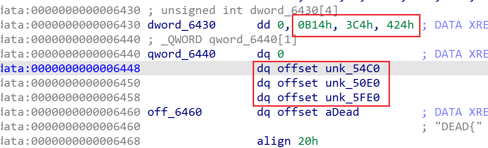

qword_6440正好对应三组数据，dword_6430对应三个数据长度，idapython导出即可（这里分析可知dword_6790只能从1到3，没找到初始赋值的地方）

~~~python
print("v5 = ", idc.get_bytes(0x54c0,0xb14))
print("v5 = ", idc.get_bytes(0x50e0,0x3c4))
print("v5 = ", idc.get_bytes(0x5fe0,0x424))
~~~

v14、v15比较麻烦，需要在初始化里确定

~~~c
v15 = qword_6760[dword_6790];	// 从1开始的话正好qword_6768、qword_6770、qword_6778
v14 = qword_6740[dword_6790];	// 从1开始的话正好qword_6748、qword_6750、qword_6758
~~~

因此一个个导入数据然后处理数据

~~~python
def sub_1491(data):
    a = [0xc0,0x5e,0xad,0xde][::-1]
    for i in range(len(data)):
        data[i] ^= a[i%4]
    return list(map(hex,data))


unk_301A = [0x3F, 0x23, 0xF4]
unk_301E = [0x3F, 0x3A, 0xDB]
unk_3022 = [0x9F]
unk_3024 = [0x86]
unk_3026 = [0x10, 0x0A]
unk_302E = [0xBD, 0xC5, 0x3B, 0xA3, 0xB5, 0xC8, 0x2C]
unk_3029 = [0x2E, 0x3D, 0xD4, 0x50]
unk_3036 = [0x3F, 0x19, 0xDE]
unk_303A = [0x2E, 0x3D, 0xD4, 0x60]
unk_303F = [0x10, 0x3C]
unk_3042 = [0x0E, 0x3D]
unk_3045 = [0x0E, 0x08]
print(sub_1491(unk_301A))
print(sub_1491(unk_301E))
print(sub_1491(unk_3022))
print(sub_1491(unk_3024))
print(sub_1491(unk_3026))
print(sub_1491(unk_302E))
print(sub_1491(unk_3029))
print(sub_1491(unk_3036))
print(sub_1491(unk_303A))
print(sub_1491(unk_303F))
print(sub_1491(unk_3042))
print(sub_1491(unk_3045))
"""
['0xe1', '0x8e', '0xaa']
['0xe1', '0x97', '0x85']
['0x41']
['0x58']
['0xce', '0xa7']
['0x63', '0x68', '0x65', '0x63', '0x6b', '0x65', '0x72']
['0xf0', '0x90', '0x8a', '0x90']
['0xe1', '0xb4', '0x80']
['0xf0', '0x90', '0x8a', '0xa0']
['0xce', '0x91']
['0xd0', '0x90']
['0xd0', '0xa5']
"""
~~~

由于v15对应name，因此寻找对应的函数名

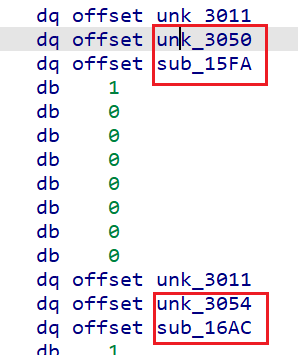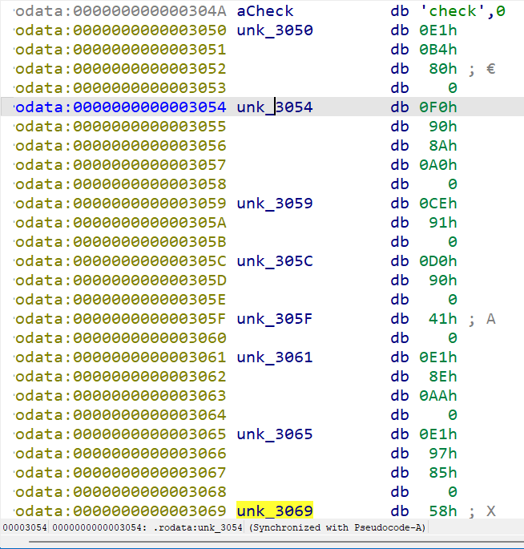

如图可以看到一一映射的函数，因此可以提前分析一波每个函数，然后取个新名，这里直接拿了zzre的代码

最后写完整的导出pyc脚本

~~~python
'''
1. python3 pyinstxtractor.py main
2. pycdc main.pyc
3. extract bytecode from checker.so (python3.10 bytecode_to_pyc.py)
4. decompile bytecodes -> z3
'''

from z3 import *

class Checker:
    def __init__(self):
        self.REG = [BitVec(f'flag_{i}', 64) for i in range(16)]

    def ROR(self, i, j):
        self.REG[i] = RotateRight(self.REG[i], j)

    def ROL(self, i, j):
        self.REG[i] = RotateLeft(self.REG[i], j)

    def ADD(self, i, j):
        self.REG[i] += j

    def SUB(self, i, j):
        self.REG[i] -= j

    def SHR(self, i, j):
        self.REG[i] = LShR(self.REG[i], j)

    def SHL(self, i, j):
        self.REG[i] <<= j

    def AND(self, i, j):
        self.REG[i] &= j

    def XOR(self, i, j):
        self.REG[i] ^= j

    def REG_ADD(self, i, j):
        self.REG[i] += self.REG[j]

    def REG_SUB(self, i, j):
        self.REG[i] -= self.REG[j]

    def REG_XOR(self, i, j):
        self.REG[i] ^= self.REG[j]

s = Solver()

checker = Checker()
orig_flag = [x for x in checker.REG]

# 1.py
checker.REG_XOR(4, 4)
checker.REG_XOR(5, 5)
checker.REG_XOR(6, 6)
checker.REG_ADD(4, 0)
checker.REG_ADD(5, 4)
checker.AND(5, 255)
checker.XOR(5, 40)
checker.REG_XOR(6, 5)
checker.SHL(6, 8)
checker.SHR(4, 8)
checker.REG_XOR(5, 5)
checker.REG_ADD(5, 4)
checker.AND(5, 255)
checker.XOR(5, 177)
checker.REG_XOR(6, 5)
checker.SHL(6, 8)
checker.SHR(4, 8)
checker.REG_XOR(5, 5)
checker.REG_ADD(5, 4)
checker.AND(5, 255)
checker.XOR(5, 97)
checker.REG_XOR(6, 5)
checker.SHL(6, 8)
checker.SHR(4, 8)
checker.REG_XOR(5, 5)
checker.REG_ADD(5, 4)
checker.AND(5, 255)
checker.XOR(5, 110)
checker.REG_XOR(6, 5)
checker.SHL(6, 8)
checker.SHR(4, 8)
checker.REG_XOR(5, 5)
checker.REG_ADD(5, 4)
checker.AND(5, 255)
checker.XOR(5, 3)
checker.REG_XOR(6, 5)
checker.SHL(6, 8)
checker.SHR(4, 8)
checker.REG_XOR(5, 5)
checker.REG_ADD(5, 4)
checker.AND(5, 255)
checker.XOR(5, 140)
checker.REG_XOR(6, 5)
checker.SHL(6, 8)
checker.SHR(4, 8)
checker.REG_XOR(5, 5)
checker.REG_ADD(5, 4)
checker.AND(5, 255)
checker.XOR(5, 85)
checker.REG_XOR(6, 5)
checker.SHL(6, 8)
checker.SHR(4, 8)
checker.REG_XOR(5, 5)
checker.REG_ADD(5, 4)
checker.AND(5, 255)
checker.XOR(5, 51)
checker.REG_XOR(6, 5)
checker.REG_XOR(0, 0)
checker.REG_ADD(0, 6)
checker.REG_XOR(4, 4)
checker.REG_XOR(5, 5)
checker.REG_XOR(6, 6)
checker.REG_ADD(4, 1)
checker.REG_ADD(5, 4)
checker.AND(5, 255)
checker.XOR(5, 202)
checker.REG_XOR(6, 5)
checker.SHL(6, 8)
checker.SHR(4, 8)
checker.REG_XOR(5, 5)
checker.REG_ADD(5, 4)
checker.AND(5, 255)
checker.XOR(5, 90)
checker.REG_XOR(6, 5)
checker.SHL(6, 8)
checker.SHR(4, 8)
checker.REG_XOR(5, 5)
checker.REG_ADD(5, 4)
checker.AND(5, 255)
checker.XOR(5, 189)
checker.REG_XOR(6, 5)
checker.SHL(6, 8)
checker.SHR(4, 8)
checker.REG_XOR(5, 5)
checker.REG_ADD(5, 4)
checker.AND(5, 255)
checker.XOR(5, 163)
checker.REG_XOR(6, 5)
checker.SHL(6, 8)
checker.SHR(4, 8)
checker.REG_XOR(5, 5)
checker.REG_ADD(5, 4)
checker.AND(5, 255)
checker.XOR(5, 138)
checker.REG_XOR(6, 5)
checker.SHL(6, 8)
checker.SHR(4, 8)
checker.REG_XOR(5, 5)
checker.REG_ADD(5, 4)
checker.AND(5, 255)
checker.XOR(5, 206)
checker.REG_XOR(6, 5)
checker.SHL(6, 8)
checker.SHR(4, 8)
checker.REG_XOR(5, 5)
checker.REG_ADD(5, 4)
checker.AND(5, 255)
checker.XOR(5, 163)
checker.REG_XOR(6, 5)
checker.SHL(6, 8)
checker.SHR(4, 8)
checker.REG_XOR(5, 5)
checker.REG_ADD(5, 4)
checker.AND(5, 255)
checker.XOR(5, 133)
checker.REG_XOR(6, 5)
checker.REG_XOR(1, 1)
checker.REG_ADD(1, 6)
checker.REG_XOR(4, 4)
checker.REG_XOR(5, 5)
checker.REG_XOR(6, 6)
checker.REG_ADD(4, 2)
checker.REG_ADD(5, 4)
checker.AND(5, 255)
checker.XOR(5, 87)
checker.REG_XOR(6, 5)
checker.SHL(6, 8)
checker.SHR(4, 8)
checker.REG_XOR(5, 5)
checker.REG_ADD(5, 4)
checker.AND(5, 255)
checker.XOR(5, 19)
checker.REG_XOR(6, 5)
checker.SHL(6, 8)
checker.SHR(4, 8)
checker.REG_XOR(5, 5)
checker.REG_ADD(5, 4)
checker.AND(5, 255)
checker.XOR(5, 238)
checker.REG_XOR(6, 5)
checker.SHL(6, 8)
checker.SHR(4, 8)
checker.REG_XOR(5, 5)
checker.REG_ADD(5, 4)
checker.AND(5, 255)
checker.XOR(5, 47)
checker.REG_XOR(6, 5)
checker.SHL(6, 8)
checker.SHR(4, 8)
checker.REG_XOR(5, 5)
checker.REG_ADD(5, 4)
checker.AND(5, 255)
checker.XOR(5, 93)
checker.REG_XOR(6, 5)
checker.SHL(6, 8)
checker.SHR(4, 8)
checker.REG_XOR(5, 5)
checker.REG_ADD(5, 4)
checker.AND(5, 255)
checker.XOR(5, 216)
checker.REG_XOR(6, 5)
checker.SHL(6, 8)
checker.SHR(4, 8)
checker.REG_XOR(5, 5)
checker.REG_ADD(5, 4)
checker.AND(5, 255)
checker.XOR(5, 150)
checker.REG_XOR(6, 5)
checker.SHL(6, 8)
checker.SHR(4, 8)
checker.REG_XOR(5, 5)
checker.REG_ADD(5, 4)
checker.AND(5, 255)
checker.XOR(5, 253)
checker.REG_XOR(6, 5)
checker.REG_XOR(2, 2)
checker.REG_ADD(2, 6)
checker.REG_XOR(4, 4)
checker.REG_XOR(5, 5)
checker.REG_XOR(6, 6)
checker.REG_ADD(4, 3)
checker.REG_ADD(5, 4)
checker.AND(5, 255)
checker.XOR(5, 115)
checker.REG_XOR(6, 5)
checker.SHL(6, 8)
checker.SHR(4, 8)
checker.REG_XOR(5, 5)
checker.REG_ADD(5, 4)
checker.AND(5, 255)
checker.XOR(5, 140)
checker.REG_XOR(6, 5)
checker.SHL(6, 8)
checker.SHR(4, 8)
checker.REG_XOR(5, 5)
checker.REG_ADD(5, 4)
checker.AND(5, 255)
checker.XOR(5, 123)
checker.REG_XOR(6, 5)
checker.SHL(6, 8)
checker.SHR(4, 8)
checker.REG_XOR(5, 5)
checker.REG_ADD(5, 4)
checker.AND(5, 255)
checker.XOR(5, 251)
checker.REG_XOR(6, 5)
checker.SHL(6, 8)
checker.SHR(4, 8)
checker.REG_XOR(5, 5)
checker.REG_ADD(5, 4)
checker.AND(5, 255)
checker.XOR(5, 174)
checker.REG_XOR(6, 5)
checker.SHL(6, 8)
checker.SHR(4, 8)
checker.REG_XOR(5, 5)
checker.REG_ADD(5, 4)
checker.AND(5, 255)
checker.XOR(5, 217)
checker.REG_XOR(6, 5)
checker.SHL(6, 8)
checker.SHR(4, 8)
checker.REG_XOR(5, 5)
checker.REG_ADD(5, 4)
checker.AND(5, 255)
checker.XOR(5, 167)
checker.REG_XOR(6, 5)
checker.SHL(6, 8)
checker.SHR(4, 8)
checker.REG_XOR(5, 5)
checker.REG_ADD(5, 4)
checker.AND(5, 255)
checker.XOR(5, 117)
checker.REG_XOR(6, 5)
checker.REG_XOR(3, 3)
checker.REG_ADD(3, 6)

# 2.py
checker.REG_SUB(3, 1)
checker.SUB(2, 0xA5B577C2FB57F719)
checker.REG_SUB(0, 3)
checker.ADD(0, 0x92BFDDFEC2F52F3B)
checker.XOR(2, 0xCADC9BA99A2AE444)
checker.SUB(3, 0x37E4241DF14718D)
checker.REG_XOR(3, 1)
checker.ROL(3, 45)
checker.REG_SUB(3, 0)
checker.XOR(2, 0xA324444E39C3E7E7)
checker.ROR(0, 44)
checker.ROR(1, 9)
checker.REG_SUB(0, 2)
checker.REG_ADD(1, 2)
checker.ROR(1, 52)
checker.SUB(2, 0x5350EA4003B419E1)
checker.REG_SUB(3, 1)
checker.REG_ADD(3, 2)
checker.XOR(3, 0x7D27118487B24A4C)
checker.ROL(2, 38)
checker.REG_SUB(3, 0)
checker.XOR(1, 0xB948CBBF8C616936)
checker.ROR(1, 60)
checker.ROL(0, 57)
checker.XOR(0, 0x8C27C187B5925EA7)
checker.REG_SUB(0, 3)
checker.REG_ADD(1, 0)
checker.SUB(2, 0x6011664A1FEADD72)
checker.SUB(3, 0xC6B76B35DC565F4B)
checker.ROL(0, 58)
checker.ROR(1, 56)
checker.REG_XOR(2, 3)
checker.XOR(2, 0x5D13D65E4A7935DD)
checker.REG_XOR(0, 2)
checker.ROL(3, 30)
checker.XOR(2, 0x78F00494B1FD4117)
checker.REG_ADD(2, 0)
checker.REG_XOR(1, 0)
checker.ROL(1, 13)
checker.SUB(1, 0x15A37CDF4F1C5ECE)
checker.ROL(3, 63)
checker.ROL(1, 26)
checker.REG_XOR(3, 0)
checker.SUB(0, 0x23683B20A006C3F1)
checker.REG_SUB(3, 0)
checker.REG_SUB(1, 3)
checker.ROR(0, 42)
checker.ADD(2, 0x3F3CD0B931FB83BA)
checker.ADD(2, 0x24ACE0DA2A14EF6D)
checker.REG_SUB(1, 0)
checker.ROR(2, 46)
checker.SUB(0, 0x9E69F9D52FE5A72A)
checker.REG_XOR(3, 1)
checker.ROL(2, 57)
checker.REG_SUB(0, 3)
checker.XOR(1, 0x9F0093FA7D70E962)
checker.REG_SUB(1, 3)
checker.REG_XOR(2, 0)
checker.ADD(0, 0x79584D73A695110C)
checker.REG_SUB(1, 2)
checker.ROL(3, 39)
checker.ROL(2, 55)
checker.REG_XOR(1, 2)
checker.XOR(2, 0x7B66780079BCF18D)
checker.REG_SUB(0, 1)
checker.ADD(3, 0x273E52F26CEB226B)
checker.XOR(1, 0xA1D8A9D784041E4)
checker.REG_ADD(1, 3)
checker.ADD(3, 0x54ACA4906A29539B)
checker.REG_SUB(2, 1)
checker.REG_ADD(0, 2)
checker.REG_ADD(2, 3)
checker.SUB(3, 0x982A5ED5AD23B3F5)
checker.ADD(0, 0x29DD2DB2114BF812)
checker.REG_SUB(0, 2)
checker.REG_XOR(0, 2)
checker.ROL(2, 13)
checker.ADD(0, 0x14051B581BA4A8EC)
checker.ROR(3, 58)
checker.XOR(1, 0x498E0B410BEE2B9E)

# 3.py
checker.REG_XOR(4, 4)
checker.REG_XOR(5, 5)
checker.REG_XOR(4, 0)
checker.SHR(4, 32)
checker.REG_XOR(5, 0)
checker.XOR(4, 0xBA885960)
checker.REG_XOR(4, 5)
checker.REG_XOR(5, 4)
checker.REG_XOR(4, 5)
checker.XOR(4, 0xEFAC3C8C)
checker.REG_XOR(4, 5)
checker.REG_XOR(5, 4)
checker.REG_XOR(4, 5)
checker.XOR(4, 509917840)
checker.REG_XOR(4, 5)
checker.REG_XOR(5, 4)
checker.REG_XOR(4, 5)
checker.XOR(4, 256360629)
checker.SHL(4, 32)
checker.REG_XOR(0, 0)
checker.REG_XOR(0, 4)
checker.REG_XOR(0, 5)
checker.REG_XOR(4, 4)
checker.REG_XOR(5, 5)
checker.REG_XOR(4, 1)
checker.SHR(4, 32)
checker.REG_XOR(5, 1)
checker.XOR(4, 0xBA885960)
checker.REG_XOR(4, 5)
checker.REG_XOR(5, 4)
checker.REG_XOR(4, 5)
checker.XOR(4, 0xEFAC3C8C)
checker.REG_XOR(4, 5)
checker.REG_XOR(5, 4)
checker.REG_XOR(4, 5)
checker.XOR(4, 509917840)
checker.REG_XOR(4, 5)
checker.REG_XOR(5, 4)
checker.REG_XOR(4, 5)
checker.XOR(4, 256360629)
checker.SHL(4, 32)
checker.REG_XOR(1, 1)
checker.REG_XOR(1, 4)
checker.REG_XOR(1, 5)
checker.REG_XOR(4, 4)
checker.REG_XOR(5, 5)
checker.REG_XOR(4, 2)
checker.SHR(4, 32)
checker.REG_XOR(5, 2)
checker.XOR(4, 0xBA885960)
checker.REG_XOR(4, 5)
checker.REG_XOR(5, 4)
checker.REG_XOR(4, 5)
checker.XOR(4, 0xEFAC3C8C)
checker.REG_XOR(4, 5)
checker.REG_XOR(5, 4)
checker.REG_XOR(4, 5)
checker.XOR(4, 509917840)
checker.REG_XOR(4, 5)
checker.REG_XOR(5, 4)
checker.REG_XOR(4, 5)
checker.XOR(4, 256360629)
checker.SHL(4, 32)
checker.REG_XOR(2, 2)
checker.REG_XOR(2, 4)
checker.REG_XOR(2, 5)
checker.REG_XOR(4, 4)
checker.REG_XOR(5, 5)
checker.REG_XOR(4, 3)
checker.SHR(4, 32)
checker.REG_XOR(5, 3)
checker.XOR(4, 0xBA885960)
checker.REG_XOR(4, 5)
checker.REG_XOR(5, 4)
checker.REG_XOR(4, 5)
checker.XOR(4, 0xEFAC3C8C)
checker.REG_XOR(4, 5)
checker.REG_XOR(5, 4)
checker.REG_XOR(4, 5)
checker.XOR(4, 509917840)
checker.REG_XOR(4, 5)
checker.REG_XOR(5, 4)
checker.REG_XOR(4, 5)
checker.XOR(4, 256360629)
checker.SHL(4, 32)
checker.REG_XOR(3, 3)
checker.REG_XOR(3, 4)
checker.REG_XOR(3, 5)

s.add(checker.REG[2] == 0xFDF61CB53A00DAA8)
s.add(checker.REG[1] == 0x273AED9AEFD29A3C)
s.add(checker.REG[0] == 0x7AB48E39E26BE2A7)
s.add(checker.REG[3] == 0xFC796489FC8864EE)

assert s.check() == sat

m = s.model()
flag = [m[x].as_long() for x in orig_flag[:4]]
flag = [int.to_bytes(flag[i], 8, 'little') for i in range(4)]

print(b''.join(flag))
# b'DEAD{run_pybyt3c0d3_w1th_C_4P1!}'
~~~

真是很有意义的一道题，深入学习了cython的逆向，学会了导出字节为pyc的方法（types、marshal），更重要的是会分析更复杂的代码了

### no_math_rev

- [ ] solved

太难了完全看不懂，也没有题解可以参考，留待未来强些再来做

## Misc

### Mic Check

- [x] solved

最开始没想到是输的慢还以为是有什么规律，看到群里有人说输快点就可以过才明白是干啥的，必须要借助自动化工具快速输入

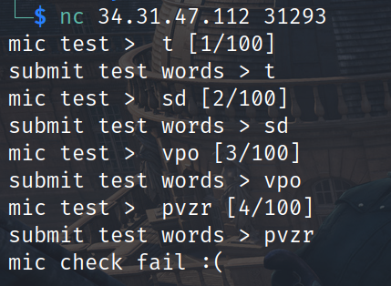

~~~python
from pwn import *
conn = remote('34.172.99.29', 32089)
for i in range(100):
    c = conn.recvuntil(b'submit test words > ')
    print(c.decode())
    s = c.decode().split()[3]
    # print(conn.recvline().decode())
    conn.sendline(s.encode())
print(conn.recv())
~~~

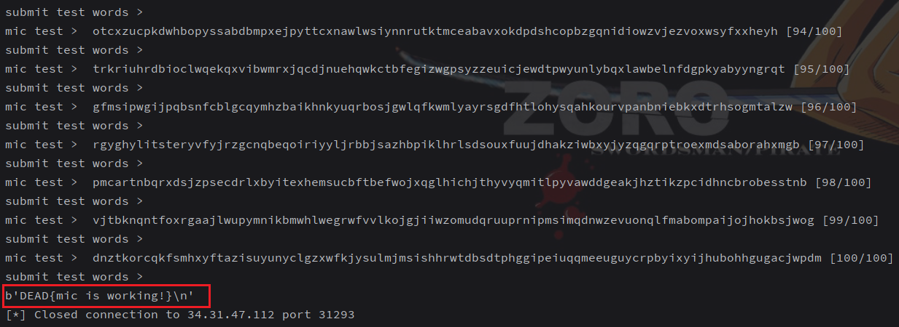

### flag_injection

- [ ] solved

事后看了wp才知道可以通过报错来打印flag

~~~python
from string import ascii_lowercase
from time import sleep
from os import getenv

ALPHABET     = set(ascii_lowercase + "_")
SECRET_FLAG  = getenv("FLAG", "DEAD{test_flag_which_is_exactly_this_long}")
SECRET_FLAG  = SECRET_FLAG.replace("{", "_").replace("}", "_").replace("DEAD","dead")

assert len(SECRET_FLAG) == 42, "Bad flag length"
assert set(SECRET_FLAG).issubset(ALPHABET), "Bad flag chars"

def get_flag():
    print(SECRET_FLAG)

def split_flag():
    start_offset = int(input("Start of flag substring: "))
    end_offset   = int(input("End of flag substring: "))
    new_flag     = SECRET_FLAG[start_offset:end_offset]
    assert       len(new_flag) >= 13, "Can't have such a small piece"
    anything     = input("Anything to add? Tell me: ").strip()[:20]
    assert       set(anything).issubset(ALPHABET), "That's a crazy thing to add!"
    new_flag     += anything
    globals()[new_flag] = ":)"

if __name__ == "__main__":
    split_flag()
    what_to_do = input("What should I do now? Tell: ")
    if not set(what_to_do).issubset(ALPHABET):
        print("Plz no hack :(")
    else:
        # No brute force for you. Test locally instead!
        # sleep(10)
        print(eval(what_to_do))
~~~

限制只能输入小写和下划线，正好对应SECRET_FLAG处理后只有小写和下划线。这里不要用windows的python测试，linux才可以显示报错提示

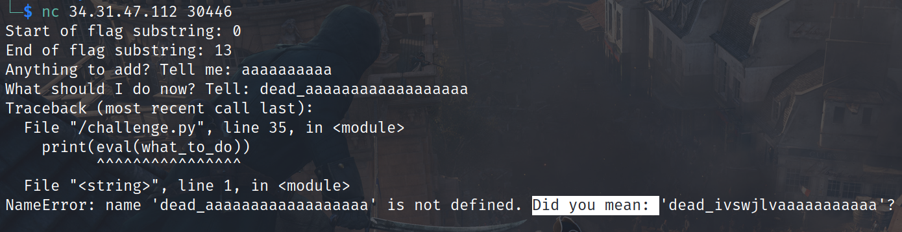

已知开头必然是`dead_`，可以拼接个长点的随机字符，就会报错提示真实flag的一部分

不断测试得到`dead_ivswjlvahxmifksxjgifrzfhljkdprcaubac_`，替换下即可拿到flag：`DEAD{ivswjlvahxmifksxjgifrzfhljkdprcaubac}`

贴一下群里国际大佬们的代码

~~~cmd
#dead_test_flag_which_is_exactly_this_long_
#XXXXXXXXXXXXXffffffffffffffffffff
echo "0\n13\nffffffffffffffffffff\ndaaaaaaaaaaaaffffffffffffffffffff" | nc 34.121.62.108 32564
# dead_ivswjlvaffffffffffffffffffff
echo "10\n23\nffffffffffffffffffff\nlva__________ffffffffffffffffffff" | nc 34.121.62.108 32564
# lvahxmifksxjgffffffffffffffffffff
echo "20\n33\nffffffffffffffffffff\nxjg__________ffffffffffffffffffff" | nc 34.121.62.108 32564
# xjgifrzfhljkdffffffffffffffffffff
echo "29\n42\nffffffffffffffffffff\nljkd__________ffffffffffffffffffff" | nc 34.121.62.108 32564
# ljkdprcaubac_ffffffffffffffffffff


# dead_ivswjlvahxmifksxjgifrzfhljkdprcaubac_
# DEAD{ivswjlvahxmifksxjgifrzfhljkdprcaubac}
~~~

### GoLParty

- [ ] solved

差一点做出来，到最后看到组办方提示才查到是Game of Life（生命游戏，conway）的缩写。当时在写脚本但跑了两遍结果都不对，比赛就结束了

参考https://github.com/thomas-broethaler/conways-game-of-life/blob/master/conways_game_of_life.ipynb

~~~python
from pwn import *
import numpy as np
import sys
from copy import deepcopy


class GameOfLife:

    def __init__(self, cells=[], generations=1):
        """
        initialize all variables and calculate the dimensions
        """

        self.cells = cells.copy()
        self.generations = generations
        self.dim_y = len(cells)
        self.dim_x = len(cells[0])
        self.cur_dim_y = 0
        self.cur_dim_x = 0

    def get_neighbors(self, y, x):
        """
        gets all neighbors around current cell and returns them in a list
        """
        neighbor_list = []

        for i in range(y - 1, y + 2):
            if i < 0 or i > (self.cur_dim_y - 1):
                continue
            else:
                for j in range(x - 1, x + 2):
                    if j < 0 or j > (self.cur_dim_x - 1):
                        continue
                    elif i == y and j == x:
                        continue
                    else:
                        neighbor_list.append(self.cells[i][j])

        return neighbor_list

    def check_neighbors(self, cur_cell, neighbor_list):
        """
        checks cur_cell if living or dead and returns status of next generation cell by
        comparing next generation by evaluating the neighborlist
        """
        next_gen_cell = cur_cell
        alive_count = neighbor_list.count(1)

        if cur_cell == 1:
            if alive_count == 2 or alive_count == 3:
                next_gen_cell = 1
            else:
                next_gen_cell = 0
        else:
            if alive_count == 3:
                next_gen_cell = 1

        return next_gen_cell

    def add_empty_boarder(self, cur_field, cur_dim_y, cur_dim_x):
        """
        adds around the current field a boarder with dead cells
        """
        new_field = np.zeros((cur_dim_y + 2, cur_dim_x + 2))
        for y, row in enumerate(cur_field):
            for x, cur_cell in enumerate(row):
                new_field[y + 1, x + 1] = cur_cell

        return new_field

    def remove_empty_boarder(self, new_cells):
        """
        removes the every empty column and row of the field
        """
        new_cells = np.array(new_cells)
        removing = True

        while removing == True:
            if len(new_cells) == 0:
                return [[]]
            elif np.count_nonzero(new_cells[0]) == 0:
                new_cells = np.delete(new_cells, 0, 0)
            elif np.count_nonzero(new_cells[::-1][0]) == 0:
                new_cells = np.delete(new_cells, -1, 0)
            elif np.count_nonzero(new_cells.T[0]) == 0:
                new_cells = np.delete(new_cells, 0, 1)
            elif np.count_nonzero(new_cells.T[::-1][0]) == 0:
                new_cells = np.delete(new_cells, -1, 1)
            else:
                removing = False

        return new_cells

    def evaluate_generations(self):
        """
        visits every element of the field, gets neighbors, checks neighbors and updates
        cells.
        """
        self.cells = deepcopy(self.add_empty_boarder(self.cells, self.dim_y, self.dim_x))
        new_cells = deepcopy(self.cells)

        for generation in range(0, self.generations):
            self.cur_dim_y = len(self.cells)
            self.cur_dim_x = len(self.cells[0])
            new_cells = deepcopy(self.add_empty_boarder(new_cells, self.cur_dim_y, self.cur_dim_x))
            self.cells = deepcopy(new_cells)
            for y, row in enumerate(self.cells):
                for x, cur_cell in enumerate(row):
                    neighbor_list = self.get_neighbors(y, x)
                    new_cells[y][x] = self.check_neighbors(cur_cell, neighbor_list)

        new_cells = self.remove_empty_boarder(new_cells)
        return new_cells.tolist()


conn = remote('34.31.85.60', 32431)
conn.recvuntil(b"Game On :D\x1b[m\n\n")
while True:
    try:
        board = conn.recvuntil(b"generations: ").decode().split("\n")
    except:
        print(conn.recvall())
        break
    generations = int(board[-1].split()[-2])
    print("\n".join(board[0:-2]))
    print(board[-1])
    cells = [[0 if i == '.' else 1 for i in row] for row in board[0:-2]]
    result = GameOfLife(cells, generations).evaluate_generations()
    living_lives = sum([row.count(1) for row in result])
    print(living_lives)
    conn.sendline(str(living_lives).encode())
    print(conn.recvline())
~~~

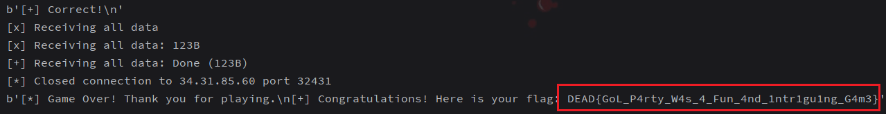

现在复现才发现错的是题目得跑好几轮，而不是一轮才出结果，等于没做循环接收，太失误了

### MAN in the middle

- [ ] solved

给了个音频文件，很明显是音频隐写，做题的时候也发现了一短一长波形

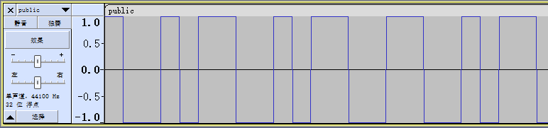

~~~python
from scipy.io import wavfile
samplerate, data = wavfile.read('public.wav')
~~~

调试发现data只有32767、-32767和0，其中0在最后可以忽略，每组32767或-32767是44或88个。比赛的时候没想到是按照正负来判断01，一直按照波形长短计算，导致做不出来（其实仔细分析按照波形不合理）

~~~python
from scipy.io import wavfile

samplerate, data = wavfile.read('public.wav')
flag = ""
for i in range(0, len(data), 44):
    if data[i] == 32767:
        flag += "1"
    elif data[i] == -32767:
        flag += "0"
print(flag, len(flag)/7)
"""
1001011001011001100101101010100110010110010101101001...
"""
~~~

发现不是7的倍数，是8的倍数但没法转成ascii可读字符，细看可以发现只有10、01组合，可以进一步分成二进制

~~~python
flag = "".join(["1" if flag[i:i+2] == "10" else "0" for i in range(0, len(flag), 2)])
print(flag, len(flag)/8)
# 10010010 10011110 10010001 10011100 10010111 10011010 10001100...
~~~

可以敏锐的发现都是1开头，所以01反过来都是ascii范围，打印出来就是包含flag的文本

~~~python
flag = "".join(["0" if flag[i:i+2] == "10" else "1" for i in range(0, len(flag), 2)])
print("".join([chr(int(flag[i:i+8], 2)) for i in range(0, len(flag), 8)]))
"""
manchester encoding is a method of encoding digital data in which each bit of data is represented by two voltage levels, ensuring a transition at the middle of each bit period. this transition serves as both a clock and data signal, making it highly effective for synchronous communication. developed by g. e. thomas, manchester encoding is widely used in various communication protocols, including ethernet. its primary advantage lies in its robustness against timing errors and ease of clock recovery, as the regular transitions enable the receiver to maintain synchronization with the transmitter. by embedding the clock signal within the data stream, manchester encoding mitigates the risk of synchronization loss, making it a reliable choice for high-speed digital data transmission. and here is your flag: dead{m4nch3573r_4_7h3_w1n} good job!
"""
~~~

看文本才知道MAN是指的曼彻斯特编码

### Forgotten Password

- [ ] solved

> I was going to create this extremely easy forensics challenge for you, but accidentally used the flag as the password when I encrypted the archive. This flag is now deleted, and since it is not possible to brute-force it, I guess that means this challenge can no longer be solved, or can it?

~~~python
from io import BytesIO
import os
import subprocess
import pycdlib # pip install pycdlib

try:
    FLAG = open("flag.txt","r").read()
except FileNotFoundError:
    FLAG = "fake_flag_for_testing"

iso = pycdlib.PyCdlib()
iso.new(interchange_level=4)

iso.add_fp(BytesIO(FLAG.encode()), len(FLAG), '/flag.txt;1')

iso.write('challenge.iso')
iso.close()

subprocess.check_output(["zip", "challenge.zip", "challenge.iso", "-P", FLAG])
~~~

这题很明显要用bkcrack明文攻击，但是比赛时候还不了解明文攻击方法导致做不出来

首先，虽然本题可以获取iso部分内容即明文，但是采用了Deflate压缩算法，跟据[bkcrack](https://github.com/kimci86/bkcrack/blob/master/example/tutorial.md#The%20not%20so%20easy%20way:%20deflated%20file)的解释，必须要知道压缩后的明文（比赛时候没注意，就一直在那错误地拿着iso文件0字节来明文攻击）

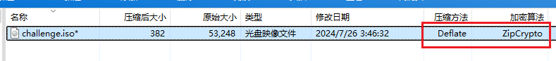

因此要做的是看iso压缩完后的共性（生成两个iso信息是有区别的，比如时间戳）

zip压缩iso文件

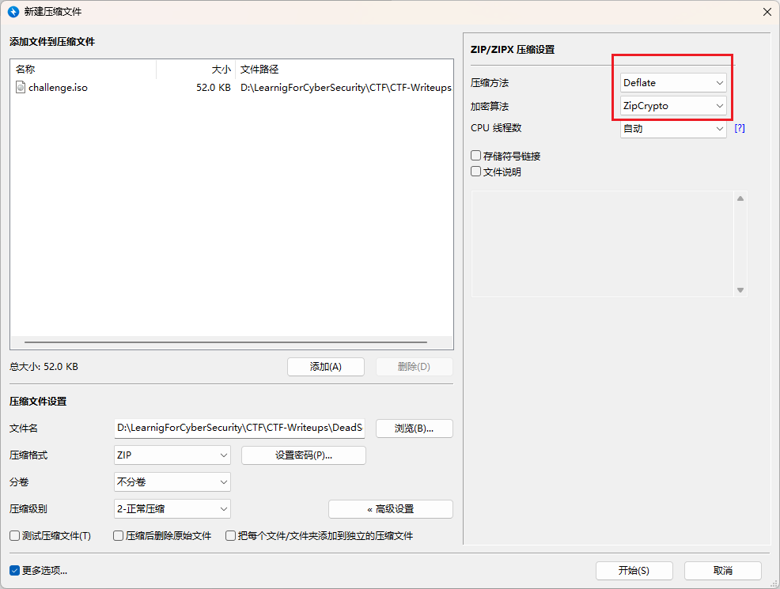

得到的两个zip对比文件数据区，可以发现都有32个0字节，但是不确定偏移地址可以尝试中间的0x70，16字节

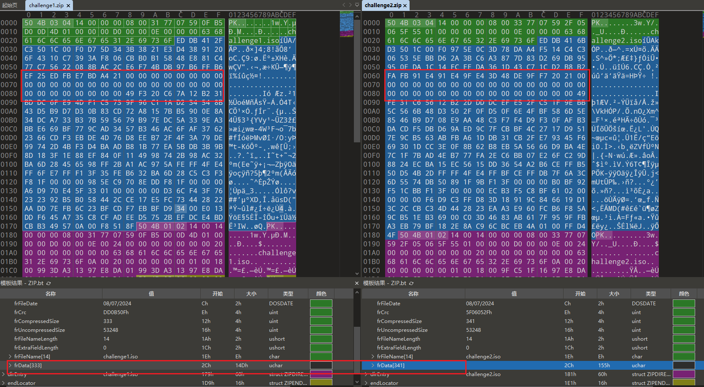

~~~
.\bkcrack.exe -C .\challenge.zip -c challenge.iso -x 70 00000000000000000000000000000000
~~~

-x跟的是偏移和字节，均为16进制

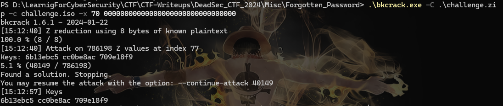

直接得到key，继续用bkcrack解密得到去除密码的zip

~~~
.\bkcrack.exe -C .\challenge.zip -k 6b13ebc5 cc0be8ac 709e18f9 -D no_passwd.zip
~~~

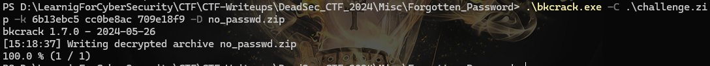

解压hex编辑器查看即可看到flag：`DEAD{weird_how_this_encryption_is_the_default_in_2024}`

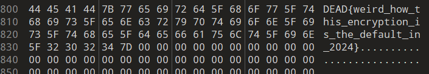

## Crypto

### Flag Killer

- [x] solved

赛后才做，题目比较简单直接逆向代码即可

~~~python
output = "0e98b103240e99c71e320dd330dd430de2629ce326a4a2b6b90cd201030926a090cfc5269f904f740cd1001c290cd10002900cd100ee59269a8269a026a4a2d05a269a82aa850d03a2b6b900883"
flag = ""
for i in range(0, len(output), 5):
    value = int(output[i:i+5], 16)
    temp = []
    while value > 0:
        temp.append(value%3)
        value //= 3
    add = 0
    for j in range(len(temp)):
        temp[j] += add
        add = 0
        if temp[j] == 3:
            temp[j] = 0
            add = 1
        elif temp[j] == 2:
            temp[j] = -1
            add = 1
    if add == 1:
        temp.append(1)
    temp = temp[::-1]
    for j in temp:
        value = value * 2 + j
    flag += hex(value)[2:].zfill(3)
print(bytes.fromhex(flag[:-3])+bytes.fromhex(flag[-2:]))
~~~

### Raul Rosas

- [ ] solved

完全不会，就是看看，别人的wp超厉害

```python
from Crypto.Util.number import * 
from sympy import nextprime
isPrime()
p1 = bin(getPrime(1024))[2:]
p2 = p1[:605]
p2 = p2 + ('0'*(len(p1)-len(p2)))

p1 = int(p1,2)
p2 = nextprime(int(p2,2))

q1 = getPrime(300)
q2 = getPrime(300)

n1 = p1*p1*q1 
n2 = p2*p2*q2 

e = 65537 
flag = bytes_to_long(b'REDACTED')
c1 = pow(flag,e,n1)
c2 = pow(flag,e,n2)

print(f'{n1=}')
print(f'{n2=}')
print(f'{c1=}')
print(f'{c2=}')

"""
n1=33914684861748025775039281034732118800210172226202865626649257734640860626122496857824722482435571212266837521062975265470108636677204118801674455876175256919094583111702086440374440069720564836535455468886946320281180036997133848753476194808776154286740338853149382219104098930424628379244203425638143586895732678175237573473771798480275214400819978317207532566320561087373402673942574292313462136068626729114505686759701305592972367260477978324301469299251420212283758756993372112866755859599750559165005003201133841030574381795101573167606659158769490361449603797836102692182242091338045317594471059984757228202609971840405638858696334676026230362235521239830379389872765912383844262135900613776738814453
n2=45676791074605066998943099103364315794006332282441283064976666268034083630735700946472676852534025506807314001461603559827433723291528233236210007601454376876234611894686433890588598497194981540553814858726066215204034517808726230108550384400665772370055344973309767254730566845236167460471232855535131280959838577294392570538301153645042892860893604629926657287846345355440026453883519493151299226289819375073507978835796436834205595029397133882344120359631326071197504087811348353107585352525436957117561997040934067881585416375733220284897170841715716721313708208669285280362958902914780961119036511592607473063247721427765849962400322051875888323638189434117452309193654141881914639294164650898861297303
c1=5901547799381070840359392038174495588170513247847714273595411167296183629412915012222227027356430642556122066895371444948863326101566394976530551223412292667644441453331065752759544619792554573114517925105448879969399346787436142706971884168511458472259984991259195488997495087540800463362289424481986635322685691583804462882482621269852340750338483349943910768394808039522826196641550659069967791745064008046300108627004744686494254057929843770761235779923141642086541365488201157760211440185514437408144860842733403640608261720306139244013974182714767738134497204545868435961883422098094282377180143072849852529146164709312766146939608395412424617384059645917698095750364523710239164016515753752257367489
c2=3390569979784056878736266202871557824004856366694719533085092616630555208111973443587439052592998102055488632207160968490605754861061546019836966349190018267098889823086718042220586285728994179393183870155266933282043334755304139243271973119125463775794806745935480171168951943663617953860813929121178431737477240925668994665543833309966378218572247768170043609879504955562993281112055931542971553613629203301798161781786253559679002805820092716314906043601765180455118897800232982799905604384587625502913096329061269176369601390578862509347479694697409545495592160695530037113884443071693090949908858172105089597051790694863761129626857737468493438459158669342430468741236573321658187309329276080990875017
"""
```

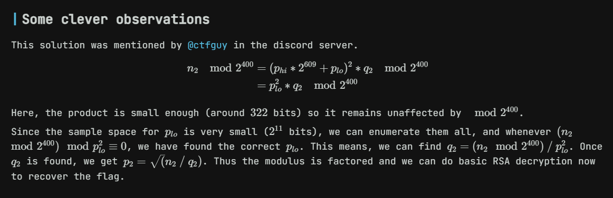

可以直接模2的400次方，结果很小可以直接factordb分解，直接分出来一个300位的q，然后就可以求出p，进而求解m

~~~python
from Crypto.Util.number import *

n = 45676791074605066998943099103364315794006332282441283064976666268034083630735700946472676852534025506807314001461603559827433723291528233236210007601454376876234611894686433890588598497194981540553814858726066215204034517808726230108550384400665772370055344973309767254730566845236167460471232855535131280959838577294392570538301153645042892860893604629926657287846345355440026453883519493151299226289819375073507978835796436834205595029397133882344120359631326071197504087811348353107585352525436957117561997040934067881585416375733220284897170841715716721313708208669285280362958902914780961119036511592607473063247721427765849962400322051875888323638189434117452309193654141881914639294164650898861297303
c = 3390569979784056878736266202871557824004856366694719533085092616630555208111973443587439052592998102055488632207160968490605754861061546019836966349190018267098889823086718042220586285728994179393183870155266933282043334755304139243271973119125463775794806745935480171168951943663617953860813929121178431737477240925668994665543833309966378218572247768170043609879504955562993281112055931542971553613629203301798161781786253559679002805820092716314906043601765180455118897800232982799905604384587625502913096329061269176369601390578862509347479694697409545495592160695530037113884443071693090949908858172105089597051790694863761129626857737468493438459158669342430468741236573321658187309329276080990875017
print(n%(2**400))
q = 1651764208712002362909070586532659043033781575172011989418709627827265240039573208353001543
print(n//q)
p = 166292923040204084265843130636698637584359774921220490721462725292059948122441620862133604226598302739069191920030887836407496935178966085862511815981684351701520622219816752182249648058443547518074081342679902265863213271998193281562912084447381292514071508413273157158843445022146713567281397262106520191111
phi = p * (p - 1) * (q - 1)
d = pow(65537, -1, phi)
m = pow(c, d, n)
print(long_to_bytes(int(m)))
"""
30103402703776243064017811439557711059290669207509918507155982967151908999721221722233453121175
27653336253255238379827094897749950208595873233518832983149353155784602058511465758319686112715417881236702423606079290048408035597283049129236579459628879350916832127330907200962350085675198980026507798280603868416962580954962570246970343658013477277384963571365444631728737777279720183041319776941865781551399583980373726767524769802434664129759993539697357856216922927883121570077381548265047941826399637246441802792846499797650223479986765449084919493629806022113238632039240712350974864290481764774551668558594287902806408273006034188767054604967838542505842989713775704160670640395878630138050827278323963414321
b'DEAD{Rual_R0s4s_Chiweweiner!!}'
"""
~~~

### SSP

- [ ] solved

背包算法，不会，略，需要大量计算

### Password Guesser

- [ ] solved

题如其名，就是合理地猜

~~~python
from collections import Counter
from Crypto.Util.number import *
from Crypto.Cipher import AES
import hashlib
from Crypto.Util.Padding import pad
import math

flag = b'<REDACTED>'
P = 13**37
password = b'<REDACTED>' # password charset is string.printable
pl = list(password)     # 转为数字列表
pl = sorted(pl)         # 从小到大排序
assert math.prod(pl) % P == sum(pl) % P     # 乘积、和模P值相等
password2 = bytes(pl)

print(f"counts = {[cnt for _, cnt in Counter(password2).items()]}")
cipher = AES.new(hashlib.sha256(password2).digest(), AES.MODE_CBC)
print(f"c = {cipher.encrypt(pad(flag, 16))}")           # 32
print(f"iv = {cipher.iv}")                                       # 16
'''
counts = [5, 4, 7, 5, 5, 8, 9, 4, 5, 7, 4, 4, 7, 5, 7, 8, 4, 2, 5, 5, 4, 3, 10, 4, 5, 7, 4, 4, 4, 6, 5, 12, 5, 5, 5, 8, 7, 9, 2, 3, 2, 5, 8, 6, 4, 4, 7, 2, 4, 5, 7, 9, 4, 9, 7, 4, 7, 8, 4, 2, 4, 4, 4, 4, 3, 3, 7, 4, 6, 9, 4, 4, 4, 6, 7, 4, 4, 4, 1, 3, 5, 8, 4, 9, 11, 7, 4, 2, 4]
c = b'q[\n\x05\xad\x99\x94\xfb\xc1W9\xcb`\x96\xb9|CA\xb8\xb5\xe0v\x93\xff\x85\xaa\xa7\x86\xeas#c'
iv = b'+\xd5}\xd8\xa7K\x88j\xb5\xf7\x8b\x95)n53'
'''
~~~

统计发现counts里89个，可打印字符100个，同时合理猜测pl里尽可能没有13的倍数（8个），防止assert里左边的出现多个13导致模结果为0，此时字符范围缩为92，问题复杂度转为$`C_{92}^{4}`$

直接贴个其他wp的代码，重点是学习思路思维

~~~python
from string import printable
from Crypto.Cipher import AES
from Crypto.Util.Padding import unpad
import hashlib

P = 13^37
counts = [5, 4, 7, 5, 5, 8, 9, 4, 5, 7, 4, 4, 7, 5, 7, 8, 4, 2, 5, 5, 4, 3, 10, 4, 5, 7, 4, 4, 4, 6, 5, 12, 5, 5, 5, 8, 7, 9, 2, 3, 2, 5, 8, 6, 4, 4, 7, 2, 4, 5, 7, 9, 4, 9, 7, 4, 7, 8, 4, 2, 4, 4, 4, 4, 3, 3, 7, 4, 6, 9, 4, 4, 4, 6, 7, 4, 4, 4, 1, 3, 5, 8, 4, 9, 11, 7, 4, 2, 4]

for perm in Combinations([ord(i) for i in sorted(printable) if ord(i)%13 != 0], 89):
    key, pd, sm = b"", 1, 0
    for i in range(89):
        pd *= perm[i] ^ counts[i]
        sm += perm[i] * counts[i]
        key += bytes([perm[i]]) * counts[i]
    if pd % P == sm % P:
        ct = b'q[\n\x05\xad\x99\x94\xfb\xc1W9\xcb`\x96\xb9|CA\xb8\xb5\xe0v\x93\xff\x85\xaa\xa7\x86\xeas#c'
        iv = b'+\xd5}\xd8\xa7K\x88j\xb5\xf7\x8b\x95)n53'
        cipher = AES.new(hashlib.sha256(key).digest(), AES.MODE_CBC, iv)

        raise ZeroDivisionError(unpad(cipher.decrypt(ct), 16).decode())

>> ZeroDivisionError: DEAD{y0u_Gu3ssEd_mY_p4s5w0rD}
~~~

## OSINT

第一次国际大赛就接触到开源情报赛题，完全不知道怎么做，不知道工具导致简单题都没做出来。不过题目非常有意思

### Windows Server

- [ ] solved

> Description Author: onsra03 From this picture, please provide me with the following information: https://drive.proton.me/urls/KSJY67NMH8#aknwBbWzNv32 - IP - ISP - ASN Flag format: **all in lowercase** DEAD{192.168.1.1_internet service provider_asn}

直接shodan搜，人麻了，忘记了这个工具


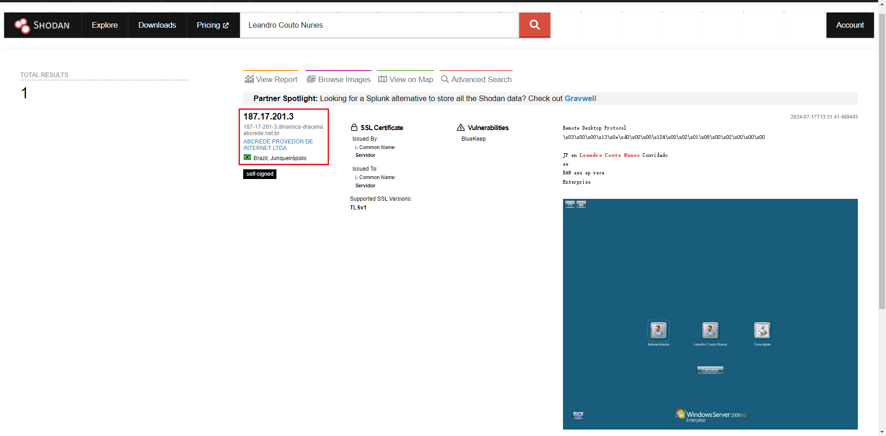

### Who is that man?

- [ ] solved

给了个图（丢了，找不到别人的wp）只能搜索引擎识图

看了官wp才知道必须得yandex image search才能搜到比较准确结果

### Financial supporter 1、2、3

- [ ] solved

> You have received a secret mission, which is to attack a criminal organization. There is no information about this oranization; we only know the name ofthe financial supporter for this organization, whose name is "Calista Diamante". Your task is to find her weak points, then infitrate and attack the companyFirst, let me know what phone she uses.
>

国外账号老被封，不太好复现

1. `https://whatsmyname.app/` 上找"Calista Diamante"
2. 在推特上找@c411sta

...
