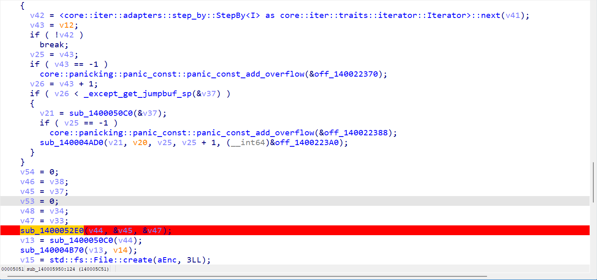

# GHCTF 2025 RE

p3师傅说题目挺好就过来看了看最后两波题，很不错学到了很多东西！

## Room 0

可惜没出，思路对了但是一位除0异常输入和SMC异或值不同，中间手动改了输入，导致SMC完rc4输入的密钥一直不对

主函数快速写脚本逆下就知道是fake flag，查看汇编发现try-catch，真实逻辑应该在catch里，要想进入catch需要有异常，只有检测密钥sub_402000可以满足，即除0异常

~~~c++
int __cdecl sub_402000(char *Str)
{
// 。。。
  v2 = sub_402590(Str);
  if ( !v2 )
    return 0;
  v6 = 0;
  v9 = v2;
  v8 = HIBYTE(v2);
  v5 = BYTE2(v2);
  v4 = BYTE1(v2);
  for ( i = 0; i < 32; ++i )
  {
    v7 = v6 * (v8 + 1415881080) * (v9 - 1467486175) * ((v8 - v9) ^ (v8 >> 4));
    v5 = (v9 + v5) ^ (8 * v4);
    v4 = (v9 + v8) ^ (8 * v5);
    v8 = (v9 + v4) ^ (8 * v5);
    v9 -= v4 + v5 + v8;
    v6 = v7 + (v8 + 1467486175) * (((v8 - v9) ^ (unsigned __int64)(v8 >> 4)) / (unsigned int)(v9 - 1415881080));
  }
  return v9 ^ v6;
}
~~~

这里用z3解出了一个结果，没发现是多解

~~~python
from z3 import *
s = Solver()
v9 = BitVec('v9', 32)
v8 = (v9 >> 24) & 0xff
v5 = (v9 >> 16) & 0xff
v4 = (v9 >> 8) & 0xff
v5 = (v9 + v5) ^ (8 * v4)
v4 = (v9 + v8) ^ (8 * v5)
v8 = (v9 + v4) ^ (8 * v5)
v9 -= v4 + v5 + v8
s.add(v9==0x5464A178)
if s.check() == sat:
    m = s.model()
    print(hex(m[m[0]].as_long()))	# 7ab5c3bd
~~~

loc_402410去下花指令（两种花指令如下）即可发现对.enc段做了SMC，动调发现异或的正是输入的key

~~~
.text:0040246A loc_40246A:                             ; CODE XREF: .text:00402449↑j
.text:0040246A                 push    eax
.text:0040246B                 mov     eax, 0
.text:00402470                 call    $+5
.text:00402475                 add     eax, 1
.text:00402478                 cmp     eax, 2
.text:0040247B                 jz      short loc_40247E
.text:0040247D                 retn
.text:0040247E ; ---------------------------------------------------------------------------
.text:0040247E
.text:0040247E loc_40247E:                             ; CODE XREF: .text:0040247B↑j
.text:0040247E                 pop     eax

.text:004024D1                 jz      short loc_4024D6
.text:004024D3                 jnz     short loc_4024D6
.text:004024D3 ; ---------------------------------------------------------------------------
.text:004024D5                 db 0E8h
~~~

~~~c++
int __stdcall sub_402410(unsigned int a1)
{
  int result; // eax
  int v2; // [esp+10h] [ebp-30h]
  char *v3; // [esp+18h] [ebp-28h]
  int j; // [esp+20h] [ebp-20h]
  __int16 v5; // [esp+24h] [ebp-1Ch]
  HMODULE ModuleHandleW; // [esp+28h] [ebp-18h]
  char *Str1; // [esp+2Ch] [ebp-14h]
  int i; // [esp+30h] [ebp-10h]
  int k; // [esp+34h] [ebp-Ch]
  int v10; // [esp+38h] [ebp-8h]

  ModuleHandleW = GetModuleHandleW(0);
  v10 = 0;
  for ( i = 0; i < 4; ++i )
    *((_BYTE *)&v10 + i) = a1 >> (8 * (3 - i));
  v5 = *(_WORD *)((char *)ModuleHandleW + *((_DWORD *)ModuleHandleW + 15) + 6);
  result = (int)ModuleHandleW + *((_DWORD *)ModuleHandleW + 15) + 248;
  Str1 = (char *)result;
  for ( j = 0; j < v5; ++j )
  {
    if ( !strcmp(Str1, ".enc") )
    {
      v2 = *((_DWORD *)Str1 + 4);
      v3 = (char *)ModuleHandleW + *((_DWORD *)Str1 + 3);
      for ( k = 0; ; ++k )
      {
        result = k;
        if ( k >= v2 )
          break;
        v3[k] ^= *((_BYTE *)&v10 + k % 4);
      }
      return result;
    }
    result = (int)(Str1 + 40);
    Str1 += 40;
  }
  return result;
}
~~~

可以根据函数前几个常见指令手动计算下异或值，ida尝试还原下

~~~
Python>0x20^0x55
0x75
Python>0xd4^0x8b
0x5f
Python>0x1c^0xec
0xf0
Python>0x83^0x52	// 大概查看了下大部分第四字节是sub，有0x83和0x81，两个都试下会发现0x81是对的
0xd1
Python>0x52^0xd3
0x81
Python>0x81^0x52
0xd3
~~~

~~~python
xor=[0x75,0x5f,0xf0,0xd3]
addr=0x401000
for i in range(0x600):
    idc.patch_byte(addr+i, ord(idc.get_bytes(addr+i, 1))^xor[i%4])
~~~

发现这个755ff0d3也满足前面的除0（比赛做题时候没发现），在call sub_401000前下断点，可以发现已还原为正确函数（去花后）

~~~c++
void __cdecl __noreturn sub_401000(char *Str, unsigned int a2)
{
//。。。
  v18[0] = 0;
  v18[1] = 0;
  memset(v17, 0, sizeof(v17));
  for ( i = 0; i < 8; ++i )
  {
    if ( i >= 4 )
      v4 = 7 - i;
    else
      v4 = i;
    *((_BYTE *)v18 + i) = a2 >> (8 * v4);
  }
  for ( j = 0; j < 256; ++j )
    v17[j] = j;
  memset(v16, 0, sizeof(v16));
  for ( k = 0; k < 256; ++k )
    v16[k] = *((_BYTE *)v18 + k % 8);
  v5 = 0;
  for ( m = 0; m < 256; ++m )
  {
    v5 = ((unsigned __int8)v16[m] + v5 + (unsigned __int8)v17[m]) % 256;
    v13 = v17[m];
    v17[m] = v17[v5];
    v17[v5] = v13;
  }
  v15 = 0;
  v14 = 0;
  v3 = strlen(Str);
  for ( n = 0; n < v3; ++n )
  {
    v14 += v17[++v15];
    v12 = v17[v15];
    v17[v15] = v17[v14];
    v17[v14] = v12;
    Str[n] ^= *((_BYTE *)v18 + (v15 & 7)) ^ v17[((unsigned __int8)v17[v14] + (unsigned __int8)v17[v15]) % 256];
  }
  for ( ii = 0; ii < 32; ++ii )
  {
    if ( byte_405020[ii] != Str[ii] )
    {
      sub_4028C0("You shouldn't come here, get out of that room!\n", v2);
      exit(0);
    }
  }
  sub_4028C0("Welcome to Room-0.\n", v2);
  system("pause");
  exit(0);
}
~~~

是魔改的rc4，多异或了key

~~~python
def KSA(key):
    """ Key-Scheduling Algorithm (KSA) 密钥调度算法"""
    S = list(range(256))
    j = 0
    for i in range(256):
        j = (j + S[i] + key[i % len(key)]) % 256
        S[i], S[j] = S[j], S[i]
    return S

def PRGA(S, key):
    """ Pseudo-Random Generation Algorithm (PRGA) 伪随机数生成算法"""
    i, j = 0, 0
    while True:
        i = (i + 1) % 256
        j = (j + S[i]) % 256
        S[i], S[j] = S[j], S[i]
        K = S[(S[i] + S[j]) % 256] ^ key[i&7]
        yield K

def RC4(key, text):
    """ RC4 encryption/decryption """
    S = KSA(key)
    keystream = PRGA(S, key)
    res = []
    for char in text:
        res.append(char ^ next(keystream))
    return bytes(res)

key = [0xD4, 0x35, 0x6D, 0xF8, 0xF8, 0x6D, 0x35, 0xD4]
text = [0x22, 0xC4, 0xA0, 0x5A, 0xDE, 0xED, 0x62, 0x5E, 0x25, 0xE2, 0x6D, 0xA6, 0x05, 0xA7, 0x20, 0x8D, 0x7D, 0x99, 0x52, 0x3E, 0x8C, 0xA7, 0x7F, 0xFA, 0x09, 0xD8, 0x62, 0xDB, 0x00, 0x80, 0xC2, 0xA9]
print(RC4(key, text))	# NSSCTF{Int3r3st1ng_5MC_Pr0gr@m?}
~~~

## TimeSpaceRescue

aes前后多了异或和换位+时间爆破（2024每一天）

首先注意密钥生成的时候有很多坑点：

~~~c++
int __cdecl sub_721DD0(int a1)
{
  __time64_t v1; // rax
  HANDLE CurrentProcess; // eax
  int v4; // [esp+0h] [ebp-28h]
  int i; // [esp+8h] [ebp-20h]
  __time64_t Time; // [esp+Ch] [ebp-1Ch] BYREF
  BOOL pbDebuggerPresent; // [esp+14h] [ebp-14h] BYREF
  _DWORD Src[3]; // [esp+18h] [ebp-10h] BYREF

  LODWORD(v1) = sub_722180(0);
  Time = v1;
  v4 = sub_721F80(&Time);
  memset(Src, 0, sizeof(Src));
  pbDebuggerPresent = 0;
  CurrentProcess = GetCurrentProcess();
  CheckRemoteDebuggerPresent(CurrentProcess, &pbDebuggerPresent);
  if ( !pbDebuggerPresent )
    memcpy(Src, (const void *)(v4 + 12), sizeof(Src));
  sub_7221A0(Src, 0xCu, a1);
  for ( i = 0; i < 16; ++i )
    *(_BYTE *)(i + a1) ^= 0x14u;
  return 39;
}
~~~

1. 反调试，if需要进去才能赋值时间

2. ida反编译不完整，需要nop掉花指令

   ~~~
   .text:00721E8E                 push    eax
   .text:00721E8F                 xor     eax, eax
   .text:00721E91                 call    $+5
   .text:00721E96                 add     eax, 5
   .text:00721E99                 add     eax, 6
   .text:00721E9C                 add     eax, 7
   .text:00721E9F                 shl     eax, 1
   .text:00721EA1                 xor     eax, 2
   .text:00721EA4                 add     eax, 1
   .text:00721EA7                 cmp     eax, 71h ; 'q'
   .text:00721EAA                 jz      short loc_721EAD
   .text:00721EAC                 retn
   .text:00721EAD ; ---------------------------------------------------------------------------
   .text:00721EAD
   .text:00721EAD loc_721EAD:                             ; CODE XREF: sub_721DD0+DA↑j
   .text:00721EAD                 pop     eax
   ~~~

   得到完整代码发现相当于密钥循环异或了5

   ~~~c++
     for ( i = 0; i < 16; ++i )
     {
       result = (*(unsigned __int8 *)(i + a1) ^ 0x114) & 0x800000FF;
       *(_BYTE *)(i + a1) ^= 0x14u;
     }
     for ( j = 0; j < 16; ++j )
     {
       result = j + a1;
       *(_BYTE *)(j + a1) ^= 0x11u;
     }
   ~~~

   接下来直接爆破好了，最好用crypto的aes库

~~~python
def xor5(a):
    a = list(a)
    for i in range(0, len(a), 2):
        a[i] ^= 5
        a[i + 1] ^= 5
        a[i], a[i + 1] = a[i + 1], a[i]
    return bytes(a)

def xorf(p):
    p = list(p)
    for i in range(0, len(p), 16):
        for j in range(8):
            p[i + j] ^= 15
            p[i + 15-j] ^= 15
            p[i + j], p[i + 15-j] = p[i + 15-j], p[i + j]
    return bytes(p)

import hashlib
from Crypto.Cipher import AES

# Function to calculate MD5 hash
def calculate_md5(data):
    return hashlib.md5(data).digest()

# Function to decrypt AES-128 using a given key and ciphertext
def aes_decrypt(key, ct):
    key = xor5(key)
    ct = xor5(ct)
    cipher = AES.new(key, AES.MODE_ECB)
    plain = cipher.decrypt(ct)
    plain = xorf(plain)
    return plain

# Function to simulate C code's AES decryption
def decrypt_ct(ct):
    # Iterate over each month in 2024
    for month in range(12):
        days_in_month = get_days_in_month_2024(month)
        # Iterate over each day in the month
        for day in range(1, days_in_month + 1):
            # Create the time data for the current day, month, and year (2024)
            time_data = bytearray(12)
            time_data[0:4] = day.to_bytes(4, byteorder='little')
            time_data[4:8] = month.to_bytes(4, byteorder='little')
            time_data[8:12] = (2024 - 1900).to_bytes(4, byteorder='little')

            # Calculate the MD5 hash of the time data
            md5_hash = calculate_md5(time_data)

            # Generate AES key by XORing MD5 hash with 0x14 byte-by-byte
            aes_key = bytes([md5_hash[i] ^ 5 for i in range(16)])

            # Decrypt the ciphertext with the generated AES key
            decrypted = aes_decrypt(aes_key, ct)
            if is_printable(decrypted):
                print(f"Date: 2024-{month+1:02d}-{day:02d}")
                print(decrypted)

# Helper function to get the number of days in a month for 2024
def get_days_in_month_2024(month):
    # Months with 31 days
    if month in [0, 2, 4, 6, 7, 9, 11]:
        return 31
    # Months with 30 days
    elif month in [3, 5, 8, 10]:
        return 30
    # February 2024 has 29 days (since 2024 is a leap year)
    else:
        return 29

def is_printable(data):
    return all(32 <= byte <= 126 for byte in data)

# Main execution
if __name__ == "__main__":
    # Given ciphertext
    ct = bytes([
        0xCD, 0x16, 0xDB, 0xB5, 0xD1, 0x02, 0xA4, 0x82,
        0x8E, 0x59, 0x73, 0x9E, 0x96, 0x26, 0x56, 0xF2,
        0x16, 0x8E, 0x46, 0xF2, 0x55, 0x7B, 0x92, 0x31,
        0x30, 0xDC, 0xAA, 0x8A, 0xF3, 0x1C, 0xA0, 0xAA
    ])

    decrypt_ct(ct)

~~~

## Canon

函数逻辑很简单，就是对三部分做不同加密最终得到新的三部分比较

~~~c++
int __fastcall main(int argc, const char **argv, const char **envp)
{
  int j; // [rsp+20h] [rbp-1F8h]
  int i; // [rsp+24h] [rbp-1F4h]
  int v6; // [rsp+28h] [rbp-1F0h]
  _DWORD v7[4]; // [rsp+30h] [rbp-1E8h]
  __int64 v8; // [rsp+40h] [rbp-1D8h]
  __int64 v9; // [rsp+48h] [rbp-1D0h]
  __int64 v10; // [rsp+50h] [rbp-1C8h]
  _DWORD v11[8]; // [rsp+58h] [rbp-1C0h]
  _DWORD v12[4]; // [rsp+78h] [rbp-1A0h]
  char Str[12]; // [rsp+88h] [rbp-190h] BYREF
  char Source[12]; // [rsp+94h] [rbp-184h] BYREF
  char v15[16]; // [rsp+A0h] [rbp-178h] BYREF
  char Destination[112]; // [rsp+B0h] [rbp-168h] BYREF
  char Str1[112]; // [rsp+120h] [rbp-F8h] BYREF
  char v18[112]; // [rsp+190h] [rbp-88h] BYREF

  printf("Enter the flag: ");
  scanf("%36s", Str);
  if ( strlen(Str) == 36 )
  {
    strncpy(Destination, Str, 0xCuLL);
    v8 = 12LL;
    Destination[12] = 0;
    strncpy(Str1, Source, 0xCuLL);
    v9 = 12LL;
    Str1[12] = 0;
    strncpy(v18, v15, 0xCuLL);
    v10 = 12LL;
    v18[12] = 0;
    v11[0] = 1;
    v11[1] = 5;
    v11[2] = 6;
    v11[3] = 3;
    v11[4] = 4;
    v11[5] = 1;
    v11[6] = 4;
    v11[7] = 5;
    v12[0] = 0;
    v12[1] = 1;
    v12[2] = 2;
    v7[0] = 0;
    v7[1] = 0;
    v7[2] = 0;
    for ( i = 0; i < 8; ++i )
    {
      for ( j = 0; j < 3; ++j )
      {
        if ( i >= v12[j] )
        {
          v6 = v7[j];
          if ( v6 < 8 )
          {
            if ( j )
            {
              if ( j == 1 )
              {
                sub_1400015D0(Str1, v18, (unsigned int)v11[v6]);
              }
              else if ( j == 2 )
              {
                sub_1400015D0(v18, Destination, (unsigned int)v11[v6]);
              }
            }
            else
            {
              sub_1400015D0(Destination, Str1, (unsigned int)v11[v6]);
            }
            ++v7[j];
          }
        }
      }
    }
    if ( !strcmp(Destination, "WgvDmssEvcY326bHo3nNro3vXvvfmgrz")
      && !strcmp(Str1, "gX+Ri9PG=bt5=00B6hscPQOL")
      && !strcmp(v18, "T6bHgUPL2gXUd=xT=FNHtPzV") )
    {
      printf("Congratulations! You have found the flag!\n");
    }
    else
    {
      printf("Invalid flag!\n");
    }
    return 0;
  }
  else
  {
    printf("Invalid flag!\n");
    return 0;
  }
}

void __fastcall sub_1400015D0(char *a1, const char *a2, int a3)
{
  size_t v3; // rax
  unsigned int v4; // eax
  size_t v5; // rax
  unsigned int v6; // eax
  int i; // [rsp+20h] [rbp-F8h]
  int j; // [rsp+24h] [rbp-F4h]
  int v9; // [rsp+28h] [rbp-F0h]
  int v10; // [rsp+2Ch] [rbp-ECh]
  char v11; // [rsp+30h] [rbp-E8h]
  int m; // [rsp+34h] [rbp-E4h]
  int n; // [rsp+38h] [rbp-E0h]
  int i1; // [rsp+3Ch] [rbp-DCh]
  int k; // [rsp+40h] [rbp-D8h]
  int ii; // [rsp+44h] [rbp-D4h]
  int jj; // [rsp+48h] [rbp-D0h]
  int v18; // [rsp+4Ch] [rbp-CCh]
  int nn; // [rsp+50h] [rbp-C8h]
  int kk; // [rsp+54h] [rbp-C4h]
  int v21; // [rsp+58h] [rbp-C0h]
  int v22; // [rsp+5Ch] [rbp-BCh]
  int mm; // [rsp+60h] [rbp-B8h]
  _QWORD *Block; // [rsp+68h] [rbp-B0h]
  int v25; // [rsp+7Ch] [rbp-9Ch]
  _DWORD *v26; // [rsp+88h] [rbp-90h]
  void *v27; // [rsp+90h] [rbp-88h]
  void *v28; // [rsp+98h] [rbp-80h]
  char *Source; // [rsp+A0h] [rbp-78h]
  char *v30; // [rsp+A8h] [rbp-70h]
  char *v31; // [rsp+B0h] [rbp-68h]
  _DWORD v32[12]; // [rsp+B8h] [rbp-60h]
  __int64 v33; // [rsp+E8h] [rbp-30h]
  __int64 v34; // [rsp+F0h] [rbp-28h]

  v9 = strlen(a1);
  v21 = strlen(a2);
  switch ( a3 )
  {
    case 1:
      for ( i = 0; i < v9; ++i )
      {
        v22 = a2[i % v21];
        if ( a1[i] < 65 || a1[i] > 90 )
        {
          if ( a1[i] < 97 || a1[i] > 122 )
          {
            if ( a1[i] >= 48 && a1[i] <= 57 )
              a1[i] = (a1[i] + v22 - 48) % 10 + 48;
          }
          else
          {
            a1[i] = (a1[i] + v22 - 97) % 26 + 97;
          }
        }
        else
        {
          a1[i] = (a1[i] + v22 - 65) % 26 + 65;
        }
      }
      break;
    case 2:
      v32[0] = 1;
      v32[1] = 3;
      v32[2] = 5;
      v32[3] = 7;
      v32[4] = 9;
      v32[5] = 11;
      v32[6] = 15;
      v32[7] = 17;
      v32[8] = 19;
      v32[9] = 21;
      v32[10] = 23;
      v32[11] = 25;
      for ( j = 0; j < v9; ++j )
      {
        if ( a1[j] < 65 || a1[j] > 90 )
        {
          if ( a1[j] >= 97 && a1[j] <= 122 )
            a1[j] = (a2[j % v21] + v32[j % 12] * (a1[j] - 97)) % 26 + 97;
        }
        else
        {
          a1[j] = (a2[j % v21] + v32[j % 12] * (a1[j] - 65)) % 26 + 65;
        }
      }
      break;
    case 3:
      v10 = *a2 % 10 + 2;
      v33 = v10;
      Block = malloc(saturated_mul(v10, 8uLL));
      for ( k = 0; k < v10; ++k )
      {
        Block[k] = malloc(v9 + 1);
        memset((void *)Block[k], 0, v9 + 1);
      }
      for ( m = 0; v10 * m < v9; ++m )
      {
        for ( n = 0; n < v10 && n + v10 * m < v9; ++n )
          *(_BYTE *)(Block[n] + m) = a1[n + v10 * m];
      }
      v18 = 0;
      for ( ii = 0; ii < v10; ++ii )
      {
        for ( jj = 0; jj < m; ++jj )
        {
          if ( *(_BYTE *)(Block[ii] + jj) && v18 < v9 )
            a1[v18++] = *(_BYTE *)(Block[ii] + jj);
        }
      }
      a1[v18] = 0;
      for ( kk = 0; kk < v10; ++kk )
        free((void *)Block[kk]);
      free(Block);
      break;
    case 4:
      v25 = *a2 % 10 + 2;
      for ( mm = 0; mm < v25; ++mm )
      {
        v11 = a1[v9 - 1];
        for ( nn = v9 - 1; nn > 0; --nn )
          a1[nn] = a1[nn - 1];
        *a1 = v11;
      }
      break;
    case 5:
      v34 = v9;
      v26 = malloc(saturated_mul(v9, 4uLL));
      for ( i1 = 0; i1 < v9; ++i1 )
        v26[i1] = (a2[i1 % v21] + 57) ^ a1[i1];
      Source = (char *)sub_140001470(v26, (unsigned int)v9);
      strcpy(a1, Source);
      free(v26);
      free(Source);
      break;
    case 6:
      v3 = saturated_mul(strlen(a1), 4uLL);
      v27 = malloc(v3);
      sub_140001020(a1, a2, v27);
      v4 = strlen(a1);
      v30 = (char *)sub_140001470(v27, v4);
      strcpy(a1, v30);
      free(v27);
      free(v30);
      break;
    case 7:
      v5 = saturated_mul(strlen(a1), 4uLL);
      v28 = malloc(v5);
      sub_140001250(a1, a2, v28);
      v6 = strlen(a1);
      v31 = (char *)sub_140001470(v28, v6);
      strcpy(a1, v31);
      free(v28);
      free(v31);
      break;
  }
}
~~~

ida下条件断点，打印log（下面这个是最开始写的，在进入sub_1400015D0时候断点打印的）

~~~python
addr=idc.get_reg_value("rcx")
print(idc.get_bytes(addr, 12).hex(), end=", ")
addr=idc.get_reg_value("rdx")
print(idc.get_bytes(addr, 12).hex(), end=", ")
print(idc.get_reg_value("r8"))
~~~

如下是新的log，可以根据顺序来逆向

~~~
1<-2, 616161616161616161616161, 626262626262626262626262, 1
1<-2, 757575757575757575757575, 626262626262626262626262, 5
2<-3, 626262626262626262626262, 636363636363636363636363, 1
1<-2, 6e616e616e616e616e616e616e616e61, 777777777777777777777777, 6
2<-3, 777777777777777777777777, 636363636363636363636363, 5
3<-1, 636363636363636363636363, 584b31396d6546632f586d79636b5758416d785970733d3d, 1
1<-2, 584b31396d6546632f586d79636b5758416d785970733d3d, 6d7162586d7162586d7162586d716258, 3
2<-3, 6d7162586d7162586d7162586d716258, 6d7a7a68687a7578786d6874, 6
3<-1, 6d7a7a68687a7578786d6874, 58793d4b633d316b39576d586541466d63782f5958706d73, 5
1<-2, 58793d4b633d316b39576d586541466d63782f5958706d73, 495a7668694451774a6c7362334a76643731314a7a733d3d, 4
2<-3, 495a7668694451774a6c7362334a76643731314a7a733d3d, 72344d346e3738347a70633272496e52, 3
3<-1, 72344d346e3738347a70633272496e52, 5958706d7358793d4b633d316b39576d586541466d63782f, 6
1<-2, 5958706d7358793d4b633d316b39576d586541466d63782f, 495133315a774a4a764a767a686c64736973373d4462313d, 1
2<-3, 495133315a774a4a764a767a686c64736973373d4462313d, 6a6572573562695669785a45636a45334f336a65344d3d3d, 4
3<-1, 6a6572573562695669785a45636a45334f336a65344d3d3d, 54416f6a654d753d59793d336b3753785970444f6377752f, 3
1<-2, 54416f6a654d753d59793d336b3753785970444f6377752f, 6973373d4462313d495133315a774a4a764a767a686c6473, 4
2<-3, 6973373d4462313d495133315a774a4a764a767a686c6473, 6a69636a65566a65726945345778334d355a4f3d6245333d, 1
3<-1, 6a69636a65566a65726945345778334d355a4f3d6245333d, 70444f6377752f54416f6a654d753d59793d336b37537859, 4
1<-2, 70444f6377752f54416f6a654d753d59793d336b37537859, 6b74363d416a373d53523233496d49497756776962636362, 5
2<-3, 6b74363d416a373d53523233496d49497756776962636362, 6245333d6a69636a65566a65726945345778334d355a4f3d, 4
3<-1, 6245333d6a69636a65566a65726945345778334d355a4f3d, 6836514d78386a43446533356c73773166703672696f53654d6f535966712f75, 1
~~~

~~~python
from base64 import b64decode, b64encode

def KSA(key):
    """ Key-Scheduling Algorithm (KSA) 密钥调度算法"""
    S = list(range(256))
    j = 0
    for i in range(256):
        j = (j + S[i] + key[i % len(key)]) % 256
        S[i], S[j] = S[j], S[i]
    return S

def PRGA(S):
    """ Pseudo-Random Generation Algorithm (PRGA) 伪随机数生成算法"""
    i, j = 0, 0
    while True:
        i = (i + 1) % 256
        j = (j + S[i]) % 256
        S[i], S[j] = S[j], S[i]
        K = S[(S[i] + S[j]) % 256]
        yield K

def RC4(key, text):
    """ RC4 encryption/decryption """
    S = KSA(key)
    keystream = PRGA(S)
    res = []
    for char in text:
        res.append((((char- 57)&0xff) ^ next(keystream)))	# 魔改了，注意下加减号
    return bytes(res)

def case1(a, b):
    original_a1 = []
    for i in range(len(a)):
        c = a[i]
        v22 = b[i % len(b)]
        if 65 <= c <= 90:  # 大写字母
            x = (c - 65 - v22 + 26) % 26 + 65
            original_a1.append(chr(x))
        elif 97 <= c <= 122:  # 小写字母
            x = (c - 97 - v22 + 26) % 26 + 97
            original_a1.append(chr(x))
        elif 48 <= c <= 57:  # 数字
            x = (c - 48 - v22 + 10) % 10 + 48
            original_a1.append(chr(x))
        else:  # 非字母数字字符
            original_a1.append(chr(c))

    return ''.join(original_a1).encode()

def case3(a, b):	# 其实就是栅栏加密
    # 计算分块的行数
    rows = b[0] % 10 + 2
    # 计算分块的列数
    if len(a) % rows:
        cols = len(a) // rows + 1
    else:
        cols = len(a) // rows

    # 初始化一个二维数组 Block
    Block = [[None for _ in range(cols)] for _ in range(rows)]

    # 将 encoded_str 按行优先填充到 Block 中
    index = 0
    if len(a) % rows:
        for i in range(rows):
            for j in range(cols):
                if index < len(a):
                    if i >= len(a) % rows and j == cols - 1:
                        Block[i][j] = None
                    else:
                        Block[i][j] = a[index]
                        index += 1
                else:
                    Block[i][j] = None  # 填充空值
    else:
        for i in range(rows):
            for j in range(cols):
                if index < len(a):
                    Block[i][j] = a[index]
                    index += 1
                else:
                    Block[i][j] = None  # 填充空值

    # 按列优先读取 Block，还原原始字符串
    original_str = []
    for j in range(cols):
        for i in range(rows):
            if Block[i][j] is not None:
                original_str.append(Block[i][j])

    # 将列表转换为字符串
    return ''.join(map(chr, original_str)).encode()

def case4(a, b):
    k = b[0] % 10 + 2
    return a[k:] + a[:k]

def mybase64(c):
    c = c.decode()
    correct_table = 'ABCDEFGHIJKLMNOPQRSTUVWXYZabcdefghijklmnopqrstuvwxyz0123456789+/'
    table = 'stuvwxyz0123456789+/ABCDEFGHIJKLMNOPQRSTUVWXYZabcdefghijklmnopqr'
    new_c = []
    for i in range(len(c)):
        if c[i] != '=':
            new_c.append(correct_table[table.index(c[i])])
        else:
            new_c.append(c[i])
    return list(b64decode(''.join(new_c)))

def mybase641(c):
    c = b64encode(c)
    correct_table = 'ABCDEFGHIJKLMNOPQRSTUVWXYZabcdefghijklmnopqrstuvwxyz0123456789+/'
    table = 'stuvwxyz0123456789+/ABCDEFGHIJKLMNOPQRSTUVWXYZabcdefghijklmnopqr'
    new_c = []
    for i in range(len(c)):
        if chr(c[i]) != '=':
            new_c.append(table[correct_table.index(chr(c[i]))])
        else:
            new_c.append(chr(c[i]))
    return ''.join(new_c).encode()

def case5(a, b):
    a = mybase64(a)
    for i in range(len(a)):
        a[i] ^= (b[i%len(b)] + 57)
    return bytes(a)

def case6(a, b):
    a = mybase64(a)
    return RC4(b, a)

str1 = b"WgvDmssEvcY326bHo3nNro3vXvvfmgrz"
str2 = b"gX+Ri9PG=bt5=00B6hscPQOL"
str3 = b"T6bHgUPL2gXUd=xT=FNHtPzV"
str3 = case1(str3, str1)
str2 = case4(str2, str3)
str1 = case5(str1, str2)
str3 = case4(str3, str1)
str2 = case1(str2, str3)
str1 = case4(str1, str2)
str3 = case3(str3, str1)
str2 = case4(str2, str3)
str1 = case1(str1, str2)
str3 = case6(str3, str1)
str2 = case3(str2, str3)
str1 = case4(str1, str2)
str3 = case5(str3, str1)
str2 = case6(str2, str3)
str1 = case3(str1, str2)
str3 = case1(str3, str1)
str2 = case5(str2, str3)
str1 = case6(str1, str2)
str2 = case1(str2, str3)
str1 = case5(str1, str2)
str1 = case1(str1, str2)
print(str1+str2+str3)	# NSSCTF{P4ch3Lbel's_C@n0n_1n_D_mAjOr}
~~~

## 腐蚀

挺简单的rust，给了符号表和一个enc，enc很大解密后应该是png图片（输入要求）

一路调到这里，发现传入了整个文件（v47），以及前面从图像提取的16字节（v45固定的，png后八字节+前八字节，然后两两字节交换得到6082AE424E4449451A0A0D0A4E478950）

sub_7FF72C7352E0函数里有明显的rc4（256，三个while，key值处理），魔改点在最后多异或了0x1f

出来后发现还做了个字节逆转，逆向时候先反转下就好

~~~python
def KSA(key):
    """ Key-Scheduling Algorithm (KSA) 密钥调度算法"""
    S = list(range(256))
    j = 0
    for i in range(256):
        j = (j + S[i] + key[i % len(key)]) % 256
        S[i], S[j] = S[j], S[i]
    return S

def PRGA(S):
    """ Pseudo-Random Generation Algorithm (PRGA) 伪随机数生成算法"""
    i, j = 0, 0
    while True:
        i = (i + 1) % 256
        j = (j + S[i]) % 256
        S[i], S[j] = S[j], S[i]
        K = S[(S[i] + S[j]) % 256]
        yield K

def RC4(key, text):
    """ RC4 encryption/decryption """
    S = KSA(key)
    keystream = PRGA(S)
    res = []
    for char in text:
        res.append(char ^ next(keystream) ^ 0x1f)
    return bytes(res)

key = bytes.fromhex("6082AE424E4449451A0A0D0A4E478950")
with open("enc", "rb") as f:
    text = f.read()[::-1]
print(len(text))
with open("dec.png", "wb") as f:
    f.write(RC4(key, text))

~~~

## ezObfus

考点：花指令+反调试

这题没做出来还是花指令没学到位，不用考虑jmp这些指令跳转到哪里，ida指向的位置基本都是对的，直接u+c按键重新反汇编，再nop掉jmp到这个位置中间所有的汇编码

此外还有不少很不错的反调试：IsProcessorFeaturePresent、IsDebuggerPresent、[UnhandledExceptionFilter](https://blog.csdn.net/Simon798/article/details/107298726)，结合返回值修改下跳转逻辑即可

里面还是有很多变量名称混淆，比如一些数字出题人都用变量来表示，不直接用数据，可以换下命名；之后一点点扣代码，只关注有意义的代码

逻辑很简单了，真不明白自己当时咋没做出来

还有就是这种别用python，用C，这爆破速度没法比，而且别printf，我说为啥爆了半天原来printf也很费时间

~~~c
#include<stdio.h>

int main() {
    unsigned int s = 0;
    unsigned long long i;
    for (i = 0; i < 0xffffffff; i++) {
        s = 0x811C9DC5;
        for (int j = 0; j < 4; j++) {
            unsigned char v = i >> (j * 8);
            if (v % 2) 
                s ^= v;
            else
                s *= 16777619;
            s = (s >> 25) | (s << 7);
            s -= v;
        }
        if (s == 0x45E938F6) {
            printf("password: %ld\n", i);
            break;
        }
    }
    unsigned char cmp[32] = {0x54, 0x55, 0x79, 0x9E, 0xA8, 0xE1, 0x1C, 0xDA, 0x04, 0x1D, 0xC1, 0x6E, 0x80, 0x82, 0x0D, 0x8A, 0x4C, 0x65, 0xE1, 0x46, 0x71, 0x31, 0xED, 0xD2, 0x14, 0xC5, 0x39, 0xB5, 0x49, 0xE2, 0x04, 0xA9};
    for (int j = 0; j < 32; j++) {
        cmp[j] -= j;
        cmp[j] = (cmp[j] << 5) | (cmp[j] >> 3);
        cmp[j] ^= j ^ (i >> (((3 - j % 4)) * 8));
        printf("%c", cmp[j]^(8*0xe9)&0xff);
    }
}
~~~

