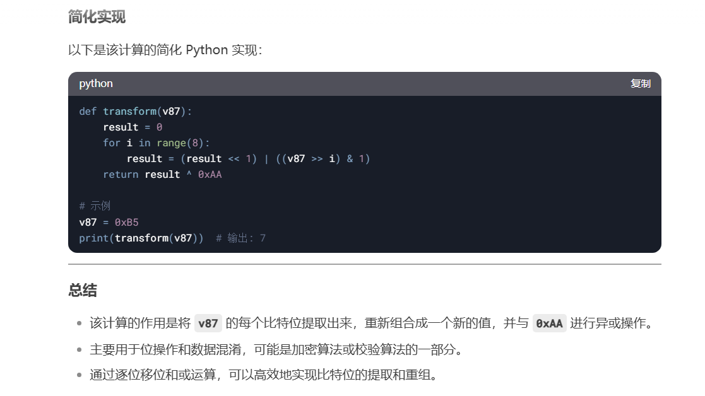
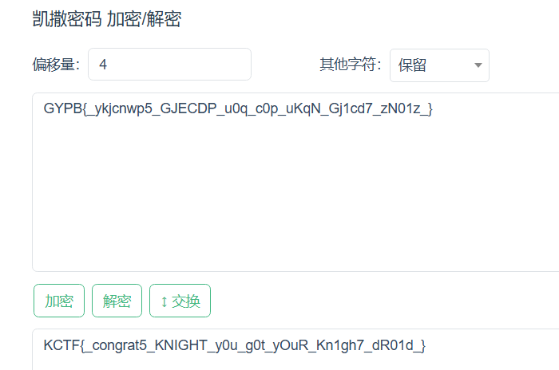

# KnightCTF 2025

比赛办的很一般，为了战队积分大晚上一块熬夜打了打，re过于简单，最后所有方向全ak，但是出的太晚排名不够拿奖励

**Flag Format : KCTF{s0mething_here}**

## Reverse

### Binary Quest

Upx -d ，跳过反调试，直接动调可以得到flag

### Knight’s Enigma

In the shadowed corridors of an ancient fortress, a legendary knight once safeguarded a secret so potent that countless contenders have vanished trying to decipher it. Now the seal has cracked, and echoes of its power seep into the present. Test your courage as you follow cryptic traces left by the knight’s hand, unraveling an enigma steeped in the mysticism of ages past. Will your wits prove enough to break the bindings and uncover the realm’s hidden legacy—or will you, too, fade into the swirling mists of history? The choice—and fate—are yours to determine.

题目提示enigma，猜测和Droid那道差不多移位密码+一些处理

动调输34位a发现结果都一样，因此可知后两位处理结果和前面一大堆一样，只需分析

```Python
s1[32] = ((2
           * ((2
             * ((2
               * ((2 * ((2 * ((2 * ((2 * v87) & 2 | ((v87 & 2) != 0))) | ((v87 & 4) != 0))) | ((v87 & 8) != 0))) | ((v87 & 0x10) != 0))) | ((v87 & 0x20) != 0))) | ((v87 & 0x40) != 0))) | ((unsigned __int8)v87 >> 7)) ^ 0xAA;
  LOBYTE(v87) = v107;
```

安利deepseek newbee!



测试了下对称加密，再transfrom下即可还原，然后前面有个判断字符范围是字母则+1因此要做个判断

```Python
def transform(v87):
    result = 0
    for i in range(8):
        result = (result << 1) | ((v87 >> i) & 1)
    return result
# 示例
v87 = 0x63
print(hex(transform(v87)))  # 输出: 7
v87 = 0xc6
print(hex(transform(v87)))  # 输出: 7 对称加密


s = [0x98, 0x88, 0x00, 0x48, 0x74, 0x50, 0x8C, 0xA6, 0x5C, 0xBC, 0x64, 0xEC, 0x04, 0x06, 0x50, 0x9C, 0x5C, 0xFC, 0xBC, 0x3C, 0x04, 0x50, 0xF4, 0xA6, 0xC4, 0x50, 0xBC, 0xA6, 0x04, 0x50, 0x26, 0x04, 0x50, 0x14]
for i in range(len(s)):
    s[i] ^= 0xaa
    s[i] = transform(s[i])
    if s[i] in range(65, 65+26) or s[i] in range(97, 97+26):
        s[i] -= 1
print("".join(map(chr, s)))
```

### Knight's Droid

For ages, a cryptic mechanical guardian has slumbered beneath the Knight’s Citadel. Some say it holds powerful secrets once wielded by ancient code-wielding Knights. Many have tried to reactivate the droid and claim its hidden knowledge—yet none have returned victorious. Will you be the one to solve its riddles and awaken this legendary machine?

看到字符串直接移位密码



### Easy Path to the Grail

```Python
s = "D2C22A62DEA62CCE9EFA0ECC86CE9AFA4ECC6EFAC6162C3636CC76E6A6BE"
for i in range(0, len(s), 2):
    n = int(s[i:i+2], 16)
    n = bin(n)[2:].zfill(8)[::-1]
    n = int(n, 2)
    print(chr(n), end="")
```

简单的位反转

### Worthy Knight

手动求解

```Python
s = [78, 106, 107, 83, ord("f"), ord("T"), 89,97, 73,105]
print("".join(map(chr, s)))    # KCTF{NjkSfTYaIi}
```