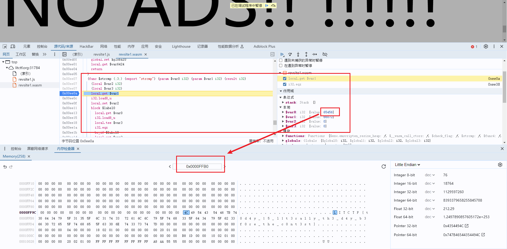

# LITCTF 2024 wp

## Reverse

### kablewy

- [x] solved

> **WARNING: your computer might go kablewy if you try to do this one...** URL: http://litctf.org:31782/

网页没法正常加载，爆cpu，不能直接访问，采用curl查看页面

~~~
curl http://litctf.org:31782/
<!doctype html>
<html lang="en">
  <head>
    <meta charset="UTF-8" />
    <link rel="icon" type="image/svg+xml" href="/vite.svg" />
    <meta name="viewport" content="width=device-width, initial-scale=1.0" />
    <title>Vite + TS</title>
    
  </head>
  <body>
    

  </body>
</html>
~~~

可以看到引用了一个js，获取js

~~~
curl http://litctf.org:31782/assets/index-DLdRi53f.js > kablewy.js
~~~

发现得到的js里存在大量base64加密后的字符串，选取一个解密得到：

~~~
(function(){"use strict";eval(atob("d2hpbGUgKHRydWUpIGNvbnNvbGUubG9nKCdrYWJsZXd5Jyk7CnBvc3RNZXNzYWdlKCdMJyk7"))})();

~~~

里面的base64再解密

~~~
while (true) console.log('kablewy');
postMessage('L');
~~~

由此发现网页崩溃的原因是无限循环，提示调用了一个postMessage函数打印了字符

因此编写脚本提取所有base64解码两次提取要打印的字符

~~~python
import re
from base64 import b64decode
with open("./kablewy.js") as f:
    content = f.read()
results = re.findall(r"\= \"(.*?)\"\n", content)
for i in results:
    a = b64decode(i.encode()).decode()
    r = re.findall(r"atob\(\"(.*?)\"", a)
    if len(r):
        b = b64decode(r[0].encode()).decode()
        print(re.findall(r"postMessage\(\'(.*?)\'", b)[0], end="")
~~~

得到flag`LITCTF{k3F7zH}`

### Burger Reviewer

- [x] solved

就是逆向java代码，直接在原函数基础上改

~~~python
import java.util.*;

public class Burgers {

    public static char[] bun(char[] s) {
        for (int i = 0; i < 7; i++) {
            s[i] = "LITCTF{".toCharArray()[i];
        }
        s[s.length - 1] = '}';
        return s;
    }

    public static char[] cheese(char[] s) {
        s[13] = '_';
        s[17] = 95;
        s[19] = '_';
        s[26] = (char) (190-s[19]);
        s[29] = '_';
        s[34] = 95;
        s[39] = '_';
        return s;
    }

    public static char[] meat(char[] s) {
        int m = 41;
        char[] meat = {'n', 'w', 'y', 'h', 't', 'f', 'i', 'a', 'i'};
        int[] dif = {4, 2, 2, 2, 1, 2, 1, 3, 3};
        for (int i = 0; i < meat.length; i++) {
            m -= dif[i];
            s[m] = meat[i];
        }
        return s;
    }

    public static char[] pizzaSauce(char[] s) {
        boolean[] isDigit = {false, false, false, true, false, true, false, false, true, false, false, false, false, false};
        char[] sauce = {'b', 'p', 'u', 'b', 'r', 'n', 'r', 'c'};
        int a = 7; int b = 20; int i = 0;
        while (a < b) {
            s[a] = sauce[i];
            s[b] = sauce[i+1];
            a++; b--; i += 2;
            while (isDigit[a-7] || s[a]=='_') a++;
            while (isDigit[b-7] || s[b]=='_') b--;
        }
        return s;
    }

    public static char[] veggies(char[] s) {
        int[] veg1 = {10, 12, 15, 22, 23, 25, 32, 36, 38, 40};
        int[] veg = new int[10];
        veg[0] = 9;
        veg[1] = 5;
        veg[2] = 4;
        veg[4] = 2;
        veg[3] = 2;
        veg[5] = 5;
        veg[6] = 3;
        veg[7] = 4;
        veg[8] = 7;
        veg[9] = 2;
        for (int i = 0; i < 10; i++) {
            s[veg1[i]] = (char) (veg[i] + '0');
        }
        return s;
    }

    public static void main(String[] args) {
        char[] input = new char[42];
        input = bun(input);
        input = cheese(input);
        input = meat(input);
        input = veggies(input);
        input = pizzaSauce(input);
        System.out.println(new String(input));
    }
}
~~~

题目没出好，有多解

### revsite1

- [x] solved

> It's a website?? (no ads ofc) URL: http://litctf.org:31784/

打开网页会发现一个输入框，检查源文件发现wasm代码，搜索cmp找到了函数，下断点；打开内存检查器，搜索本地变量里的地址，直接搜到了flag

比赛刚做第一道wasm题脑子没反应过来，动态调试一次次字符比较才做出来

### revsite2

> watch ads for a free flag, with amazing data integrity (patent not pending) URL: http://litctf.org:31785/

还是wasm题，这道题卡了好久，调试基本不可能，本地变量太多；只找到了比较1e18的地方（visit_ad函数）

最开始思路不对，一直想尝试修改变量值，结果找不到修改的方法；还尝试了本地保存为wat，在linux上修改比较值重新编译成wasm，再去浏览器里调试，结果发现打印乱字符

~~~
wat2wasm revsite2.wat -o revsite2.wasm 
~~~

说明修改比较值是不对的，只能看函数的实现，能找到的反编译wasm只有jeb，读起来是真痛苦，有些常量值还没有正常显示，比如gvar_1、gvar_1C等

~~~c
void visit_ad() {
    int v0 = __g0 - 0x800;

    __g0 -= 0x800;
    *(long long*)(v0 + 2040) = *(long long*)0x10320 + 123456789L;
    if(*(long long*)(v0 + 2040) != gvar_10300) {
        emscripten_run_script("document.body.innerHTML = \'data integrity violated: no flag points for you\';");
    }
    else {
        ++gvar_10300;
        gvar_10308 = (unsigned long long)(*(long long*)0x10320 * *(long long*)0x10320 * 3L + *(long long*)0x10320 * 5L + (gvar_10308 + 3L));
        gvar_10310 = (unsigned long long)(*(long long*)0x10320 * 8L * *(long long*)0x10320 * *(long long*)0x10320 + *(long long*)0x10320 * *(long long*)0x10320 * 3L + (*(long long*)0x10320 * 3L + gvar_10310) + 8L);
        *(long long*)0x10320 = *(long long*)0x10320 + &gvar_1;
        *(long long*)(v0 + 240) = *(long long*)0x10320;
        __f5(v0 + 240, "document.getElementById(\'pts\').innerHTML = \'%lld\';", v0 + 1936);
        emscripten_run_script(v0 + 1936);
        *(long long*)(v0 + 0x788) = *(long long*)0x10320 * *(long long*)0x10320 * *(long long*)0x10320 + *(long long*)0x10320 * *(long long*)0x10320 + (*(long long*)0x10320 + &gvar_1);
        if(*(long long*)(v0 + 0x788) != gvar_10308) {
            emscripten_run_script("document.body.innerHTML = \'data integrity violated: no flag points for you\';");
        }
        else if(*(long long*)0x10320 == 1000000000000000000L) {
            emscripten_run_script("document.getElementById(\'flag\').hidden = false;");
            int v1 = (int)(unsigned char)(((gvar_10310 >> &gvar_1) & 0x1ffL) ^ 0x75L);
            *(long long*)((char*)((int)&gvar_7 + v0) + &gvar_1) = ((gvar_10310 >> 41L) & 0x1ffL) ^ 0x110L;
            *(int*)v0 = v1;
            __f5(v0, "document.getElementById(\'%c\').style.left=\'%lldpx\'", v0 + 1824);
            emscripten_run_script(v0 + 1824);
            unsigned int v2 = (unsigned int)(unsigned char)(((gvar_10310 >> 46L) & 0x1ffL) ^ 0x1c7L);
            *(long long*)((int)&gvar_18 + v0) = ((gvar_10310 >> 43L) & 0x1ffL) ^ 0x144L;
            *(unsigned int*)((int)&gvar_10 + v0) = v2;
            __f5(v0 + &gvar_10, "document.getElementById(\'%c\').style.left=\'%lldpx\'", v0 + 1712);
            emscripten_run_script(v0 + 1712);
            int v3 = (int)(unsigned char)(((gvar_10310 >> 9L) & 0x1ffL) ^ 0x69L);
            *(long long*)(v0 + 40) = ((gvar_10310 >> 36L) & 0x1ffL) ^ 0x131L;
            *(int*)(v0 + 32) = v3;
            __f5(v0 + 32, "document.getElementById(\'%c\').style.left=\'%lldpx\'", v0 + 1600);
            emscripten_run_script(v0 + 1600);
            int v4 = (int)(unsigned char)(((gvar_10310 >> 47L) & 0x1ffL) ^ 0x1a7L);
            *(long long*)((int)&gvar_38 + v0) = ((gvar_10310 >> &gvar_1C) & 0x1ffL) ^ 0x1eL;
            *(int*)(v0 + 48) = v4;
            __f5(v0 + 48, "document.getElementById(\'%c\').style.left=\'%lldpx\'", v0 + 1488);
            emscripten_run_script(v0 + 1488);
            int v5 = (int)(unsigned char)(((gvar_10310 >> 18L) & 0x1ffL) ^ 0x82L);
            *(long long*)(v0 + 72) = ((gvar_10310 >> 5L) & 0x1ffL) ^ 0xd2L;
            *(int*)((char*)((int)&gvar_3D + v0) + 3) = v5;
            __f5(v0 + 64, "document.getElementById(\'%c\').style.left=\'%lldpx\'", v0 + 1376);
            emscripten_run_script(v0 + 1376);
            int v6 = (int)(unsigned char)(((gvar_10310 >> 23L) & 0x1ffL) ^ 0x106L);
            *(long long*)(v0 + 88) = ((gvar_10310 >> 23L) & 0x1ffL) ^ &gvar_B;
            *(int*)(v0 + 80) = v6;
            __f5(v0 + 80, "document.getElementById(\'%c\').style.left=\'%lldpx\'", v0 + 1264);
            emscripten_run_script(v0 + 1264);
            int v7 = (int)(unsigned char)(((gvar_10310 >> 46L) & 0x1ffL) ^ 0x1c5L);
            *(long long*)(v0 + 104) = ((gvar_10310 >> &gvar_1C) & 0x1ffL) ^ 0x2dL;
            *(int*)(v0 + 96) = v7;
            __f5(v0 + 96, "document.getElementById(\'%c\').style.left=\'%lldpx\'", v0 + 1152);
            emscripten_run_script(v0 + 1152);
            int v8 = (int)(unsigned char)(((gvar_10310 >> 54L) & 0x1ffL) ^ 0x2dL);
            *(long long*)(v0 + 120) = ((gvar_10310 >> 35L) & 0x1ffL) ^ 0x151L;
            *(int*)(v0 + 112) = v8;
            __f5(v0 + 112, "document.getElementById(\'%c\').style.left=\'%lldpx\'", v0 + 1040);
            emscripten_run_script(v0 + 1040);
            int v9 = (int)(unsigned char)(((gvar_10310 >> 51L) & 0x1ffL) ^ 0x6cL);
            *(long long*)(v0 + 0x88) = ((gvar_10310 >> &gvar_1) & 0x1ffL) ^ 0x68L;
            *(int*)(v0 + 128) = v9;
            __f5(v0 + 128, "document.getElementById(\'%c\').style.left=\'%lldpx\'", v0 + 928);
            emscripten_run_script(v0 + 928);
            int v10 = (int)(unsigned char)(((gvar_10310 >> 39L) & 0x1ffL) ^ 0xfL);
            *(long long*)(v0 + 152) = ((gvar_10310 >> 52L) & 0x1ffL) ^ 0x1f0L;
            *(int*)(v0 + 144) = v10;
            __f5(v0 + 144, "document.getElementById(\'%c\').style.left=\'%lldpx\'", v0 + 0x330);
            emscripten_run_script(v0 + 0x330);
            int v11 = (int)(unsigned char)(((gvar_10310 >> 30L) & 0x1ffL) ^ 0x16L);
            *(long long*)(v0 + 168) = ((gvar_10310 >> 43L) & 0x1ffL) ^ 0x1ffL;
            *(int*)(v0 + 160) = v11;
            __f5(v0 + 160, "document.getElementById(\'%c\').style.left=\'%lldpx\'", v0 + 704);
            emscripten_run_script(v0 + 704);
            int v12 = (int)(unsigned char)(((gvar_10310 >> 46L) & 0x1ffL) ^ 0x1c4L);
            *(long long*)(v0 + 184) = ((gvar_10310 >> 41L) & 0x1ffL) ^ 0xbbL;
            *(int*)(v0 + 176) = v12;
            __f5(v0 + 176, "document.getElementById(\'%c\').style.left=\'%lldpx\'", v0 + 592);
            emscripten_run_script(v0 + 592);
            int v13 = (int)(unsigned char)(((gvar_10310 >> 23L) & 0x1ffL) ^ 0x142L);
            *(long long*)(v0 + 200) = ((gvar_10310 >> 19L) & 0x1ffL) ^ 0x16aL;
            *(int*)(v0 + 192) = v13;
            __f5(v0 + 192, "document.getElementById(\'%c\').style.left=\'%lldpx\'", v0 + 480);
            emscripten_run_script(v0 + 480);
            int v14 = (int)(unsigned char)(((gvar_10310 >> &gvar_B) & 0x1ffL) ^ 0x1ecL);
            *(long long*)(v0 + 216) = ((gvar_10310 >> 52L) & 0x1ffL) ^ 0x199L;
            *(int*)(v0 + 208) = v14;
            __f5(v0 + 208, "document.getElementById(\'%c\').style.left=\'%lldpx\'", v0 + 368);
            emscripten_run_script(v0 + 368);
            int v15 = (int)(unsigned char)(((gvar_10310 >> 46L) & 0x1ffL) ^ 0x18dL);
            *(long long*)(v0 + 232) = ((gvar_10310 >> &gvar_18) & 0x1ffL) ^ 0xa8L;
            *(int*)(v0 + 224) = v15;
            __f5(v0 + 224, "document.getElementById(\'%c\').style.left=\'%lldpx\'", v0 + 0x100);
            emscripten_run_script(v0 + 0x100);
        }
    }

    __g0 = v0 + 0x800;
}
~~~

最后主要靠动态调试查关键数和关键词，读懂了逻辑，最后主要看gvar_10310变量的值（64位），每部分会根据其计算ascii值（%c）和偏移值（%lld），从而显示在html上。如下图所示，最开头的`LITCTF{`已给出，后面的flag里的内容会修改style里left值从而达到字符串的效果

计算gvar_10310的位置只有一个

~~~c
gvar_10310 = (unsigned long long)(*(long long*)0x10320 * 8L * *(long long*)0x10320 * *(long long*)0x10320 + *(long long*)0x10320 * *(long long*)0x10320 * 3L + (*(long long*)0x10320 * 3L + gvar_10310) + 8L);
~~~

这里0x10320是点击次数的地址值，设点击次数为$i$（从0开始算），gvar_10310为$x_{i}$（初始为3，所以$x_{0}=11$），则
$$
x_{i+1}=x_{i}+8\times i^{3}+3\times i^{2}+3\times i+8
$$
求的是$x_{1e18}$，即求
$$
x_{1e18}=\sum^{n=1e18-1}_{i=1}{(8\times i^{3}+3\times i^{2}+3\times i+8)+11}
$$
可以利用公式（立方和、平方和）直接简化，自己推导吧
$$
x_{1e18}=2\times n^{4}+5\times n^{3}+5\times n^{2}+10\times n+11
$$
需要注意的是gvar_10310是64位所以必然溢出，但每次是求和运算，所以只需结果模pow(2,64)即可

写了脚本计算gvar_10310，并提取了上面代码里计算字符ascii值和left偏移值

~~~python
n = pow(10, 18)-1
n1 = pow(n,2)%pow(2,64)
print(n1)
n2 = pow(n1,2)%pow(2,64)
print(n2)
n3 = (n1*n)%pow(2,64)
print(n3)
g = 10 * n + 5 * n1 + 2 * n2 + 5 * n3 + 11
g = g % pow(2,64)
print(g)
c_list, idx = [], []
c_list.append(chr(((g>>1)&0x1ff)^0x75))
idx.append(((g >> 41) & 0x1ff) ^ 0x110)
c_list.append(chr((((g >> 46) & 0x1ff) ^ 0x1c7)))
idx.append(((g >> 43) & 0x1ff) ^ 0x144)
c_list.append(chr((((g >> 9) & 0x1ff) ^ 0x69)))
idx.append(((g >> 36) & 0x1ff) ^ 0x131)
c_list.append(chr((((g >> 47) & 0x1ff) ^ 0x1a7)))
idx.append(((g >> 28) & 0x1ff) ^ 0x1e)
c_list.append(chr((((g >> 18) & 0x1ff) ^ 0x82)))
idx.append(((g >> 5) & 0x1ff) ^ 0xd2)
c_list.append(chr((((g >> 23) & 0x1ff) ^ 0x106)))
idx.append(((g >> 23) & 0x1ff) ^ 11)
c_list.append(chr((((g >> 46) & 0x1ff) ^ 0x1c5)))
idx.append(((g >> 28) & 0x1ff) ^ 0x2d)
c_list.append(chr((((g >> 54) & 0x1ff) ^ 0x2d)))
idx.append(((g >> 35) & 0x1ff) ^ 0x151)
c_list.append(chr((((g >> 51) & 0x1ff) ^ 0x6c)))
idx.append(((g >> 1) & 0x1ff) ^ 0x68)
c_list.append(chr((((g >> 39) & 0x1ff) ^ 0xf)))
idx.append(((g >> 52) & 0x1ff) ^ 0x1f0)
c_list.append(chr((((g >> 30) & 0x1ff) ^ 0x16)))
idx.append(((g >> 43) & 0x1ff) ^ 0x1ff)
c_list.append(chr((((g >> 46) & 0x1ff) ^ 0x1c4)))
idx.append(((g >> 41) & 0x1ff) ^ 0xbb)
c_list.append(chr((((g >> 23) & 0x1ff) ^ 0x142)))
idx.append(((g >> 19) & 0x1ff) ^ 0x16a)
c_list.append(chr((((g >> 11) & 0x1ff) ^ 0x1ec)))
idx.append(((g >> 52) & 0x1ff) ^ 0x199)
c_list.append(chr((((g >> 46) & 0x1ff) ^ 0x18d)))
idx.append(((g >> 24) & 0x1ff) ^ 0xa8)
print(c_list)
print(idx)
dict = zip(c_list, idx)
flag = "LITCTF{"
for item in sorted(list(dict), key=(lambda x:x[1])):
    flag += item[0]
print(flag)	# LITCTF{s0_l457minute!}
~~~

### hilbert

- [ ] solved

> You want the flag? Prove it!

太难了，涉及公理化证明
