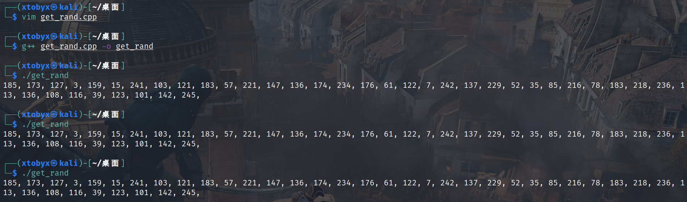
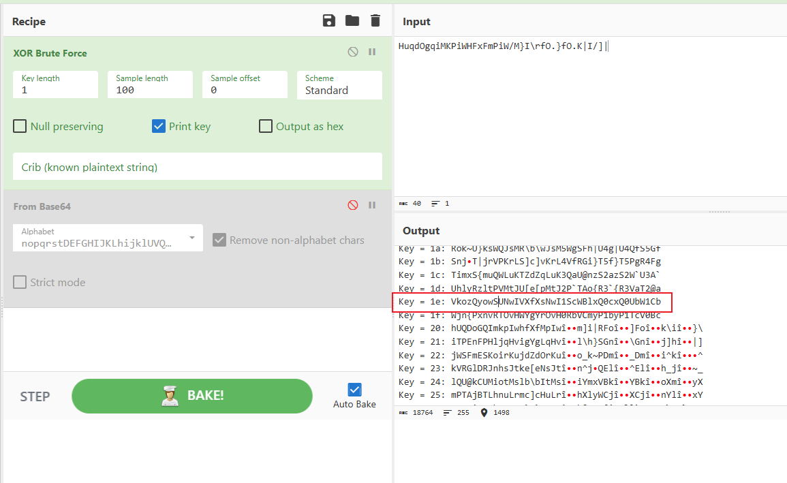
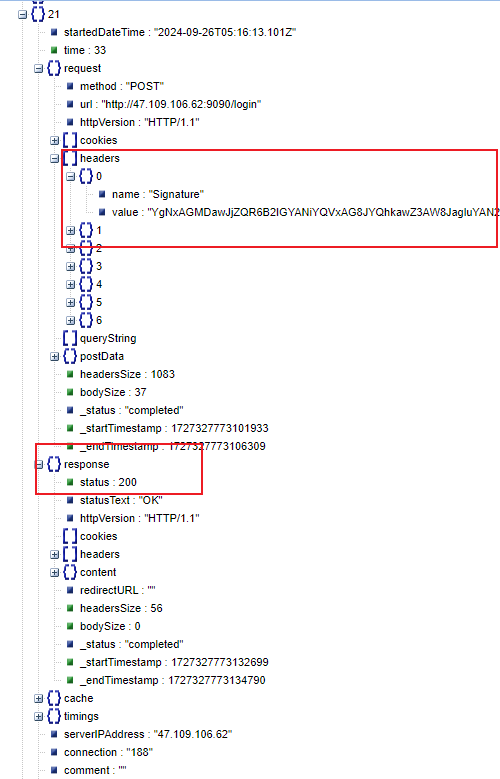
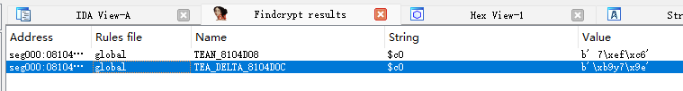
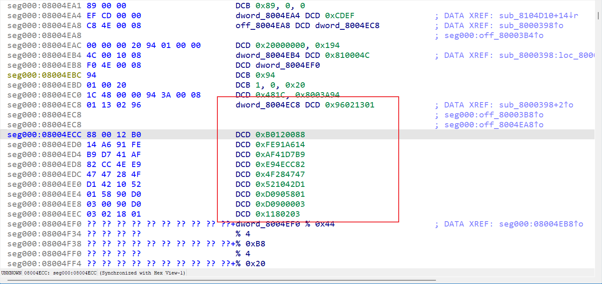
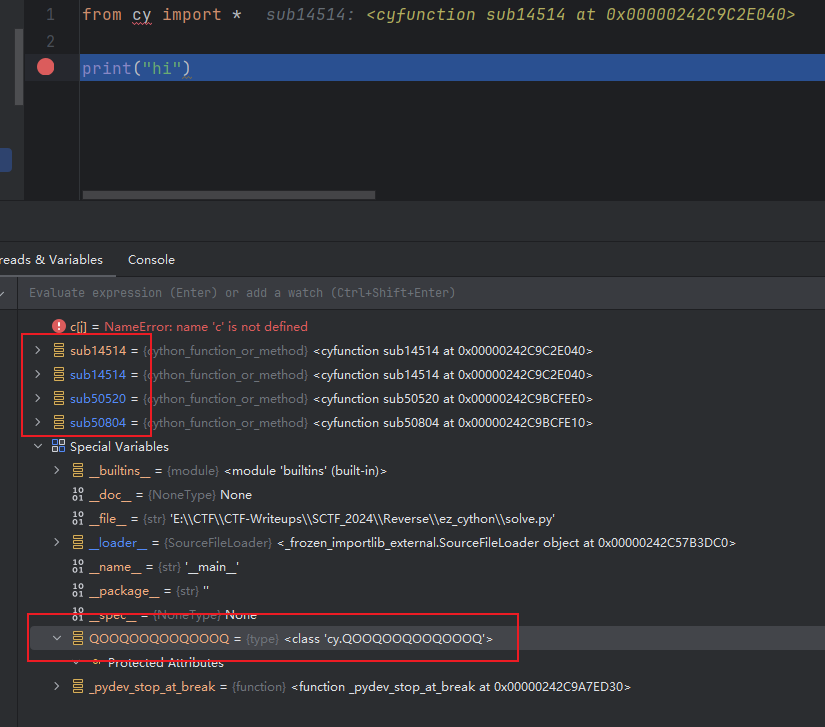
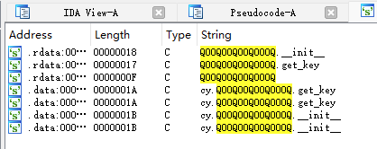
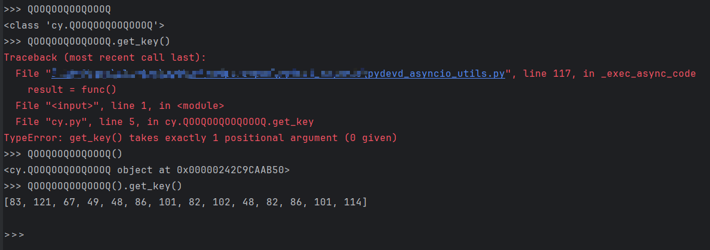

# SCTF

第一次跟SU战队一块参加比赛，不过感觉不知道都谁在做题，就挺迷得，排名前二十了，web有个佬带飞了我们

官wp（写的真好）：https://quick-mascara-699.notion.site/2024SCTF-wp-d34600322f1141e680e837abce5795ef#eaabd393c44b4b39a72a43e2f9418dd7

## Reverse

### BBox

这题是安卓逆向题目，java层混淆的很厉害，有一个encode加密；so层随机数异或+crc32加密，只做出了后半部分

java层：关注到strange类中存在一组64长度的数组，十分可能是base64表

~~~java
strange.short = new short[]{0xB82, 0xB83, 0xB9C, 0xB9D, 0xB9E, 0xB9F, 0xB98, 0xBA8, 0xBA9, 0xBAA, 0xBAB, 2980, 0xBA5, 0xBA6, 0xBA7, 0xBA0, 0xB84, 0xB85, 2950, 0xB87, 0xB80, 3001, 3002, 3005, 3006, 3007, 3000, 3011, 3003, 0xBB4, 0xBB5, 0xBB6, 0xB8D, 0xB8E, 0xBAD, 2990, 0xBAF, 0xB8F, 0xB88, 0xB89, 0xB8A, 0xB8B, 0xB81, 0xB99, 2970, 3034, 3035, 3028, 3029, 3015, 0xB9B, 0xB94, 0xB95, 0xB96, 3036, 3037, 3038, 0xBDF, 3032, 3033, 0xBA1, 0xBA2, 0xBA3, 3004};
~~~

我使用了jeb反编译，由于类名使用不可见字符进行了混淆，使用rename all功能重命名了所有类和函数，查看可能的调用，关注到`CLS6886.n`被频繁调用，查看其代码实现，发现是一个中转器作用，通过n函数参数个数和传入第一个参数var0值控制要选取的类和变量；我们要找的strange.short变量也在其中

~~~java
package np.protect;

import java.util.HashMap;
import java.util.Map;

public class CLS6886 extends CLS6885 {
    private static Map p1;
    private static Map p2;
    private static Map p3;

    static {
        CLS6886.p1 = new HashMap();
        CLS6886.p2 = new HashMap();
        CLS6886.p3 = new HashMap();
    }

    public static Object n(int var0) {
        String object = CLS6886.p3(var0);
        if(object == null) {
            switch(93500 ^ var0) {
                case 8234: {
                    object = CLS6885.MTH61787("java.lang.System", "out", "java.io.PrintStream");
                    break;
                }
                case 14356: {
                    object = CLS6885.MTH61787("com.example.bbandroid.strange", "LOOKUP", "[I");
                    break;
                }
                case 30979: {
                    object = CLS6885.MTH61787("com.example.bbandroid.strange", "short", "[S"); //看这里
                    break;
                }
                case 89656: {
                    object = "IlOTDy";
                    break;
                }
                case 90848: {
                    object = CLS6885.MTH61787("com.example.bbandroid.strange", "ALPHABET", "[C");
                    break;
                }
                case 121311: {
                    object = "LV4FmlkaVyEOjznZ4";
                }
            }
            CLS6886.p3(var0, object);
        }
        return CLS6886.MTH61784(object);
    }

    public static Object n(int var0, Object var1) {
        Object object = CLS6886.p2(var0);
        if(object == null) {
            if((0xBFC7 ^ var0) == 16200) {
                object = CLS6885.MTH61787("np.Test", "test", "int");
            }
            CLS6886.p2(var0, object);
        }
        return CLS6886.MTH61785(object, var1);
    }

    public static Object n(int var0, Object var1, Object[] var2) throws Throwable {
        Object object = CLS6886.p1(var0);
        if(object == null) {
            switch(0x9AA8 ^ var0) {
                case 2289: {
                    object = CLS6885.MTH61788("java.lang.String", "toCharArray", "[C", new String[0]);
                    break;
                }
                case 2985: {
                    object = CLS6885.MTH61788("java.io.PrintStream", "println", "void", new String[]{"java.lang.Object"});
                    break;
                }
                case 4664: {
                    object = CLS6885.MTH61788("java.lang.StringBuilder", "charAt", "char", new String[]{"int"});
                    break;
                }
                case 14540: {
                    object = CLS6885.MTH61788("java.lang.StringBuilder", "append", "java.lang.StringBuilder", new String[]{"char"});
                    break;
                }
                case 16175: {
                    object = CLS6885.MTH61788("com.example.bbandroid.MainActivity", "initSth", "boolean", new String[0]);
                    break;
                }
                case 24612: {
                    object = CLS6885.MTH61788("com.google.android.material.datepicker.\u06E6\u06E7\u06E3\u06E5", "????", "java.lang.String", new String[]{"[S", "int", "int", "int"});
                    break;
                }
                case 27829: {
                    object = CLS6885.MTH61788("java.lang.Double", "valueOf", "java.lang.Double", new String[]{"java.lang.String"});
                    break;
                }
                case 34484: {
                    object = CLS6885.MTH61788("androidx.core.view.autofill.\u06DF\u06E2\u06E6\u06E7\u06E5", "?????", "java.lang.String", new String[]{"java.lang.String"});
                    break;
                }
                case 37366: {
                    object = CLS6885.MTH61788("java.lang.System", "exit", "void", new String[]{"int"});
                    break;
                }
                case 51346: {
                    object = CLS6885.MTH61788("java.lang.Integer", "valueOf", "java.lang.Integer", new String[]{"java.lang.String"});
                    break;
                }
                case 57524: {
                    object = CLS6885.MTH61788("java.lang.StringBuilder", "length", "int", new String[0]);
                    break;
                }
                case 59388: {
                    object = CLS6885.MTH61788("androidx.constraintlayout.core.motion.key.\u06E2\u06E5\u06E3\u06E0", "?????", "int", new String[0]);
                    break;
                }
                case 59519: {
                    object = CLS6885.MTH61788("java.net.ServerSocket", "close", "void", new String[0]);
                    break;
                }
                case 100028: {
                    object = CLS6885.MTH61788("com.example.bbandroid.oOo0", "isPortInUse", "boolean", new String[]{"int"});
                    break;
                }
                case 122410: {
                    object = CLS6885.MTH61788("java.lang.StringBuilder", "toString", "java.lang.String", new String[0]);
                    break;
                }
                case 123679: {
                    object = CLS6885.MTH61788("java.lang.StringBuilder", "setCharAt", "void", new String[]{"int", "char"});
                    break;
                }
                case 125045: {
                    object = CLS6885.MTH61788("androidx.core.hardware.fingerprint.\u06E1\u06E5\u06E8\u06E4", "\u06DF\u06E7\u06E4\u06E4\u06E5", "java.lang.String", new String[]{"java.lang.String"});
                    break;
                }
                case 127711: {
                    object = CLS6885.MTH61788("java.util.Arrays", "fill", "void", new String[]{"[I", "int"});
                    break;
                }
                case 128812: {
                    object = CLS6885.MTH61788("androidx.lifecycle.viewmodel.\u06DF\u06E6\u06E1\u06DF\u06E5", "\u06DF\u06E5\u06E5\u06E5\u06E7", "int", new String[0]);
                }
            }
            CLS6886.p1(var0, object);
        }
        return CLS6886.MTH61786(object, var1, var2);
    }

    public static Object p1(int var) {
        return CLS6886.p1.get(Integer.valueOf(var));
    }

    public static void p1(int var, Object o) {
        CLS6886.p1.put(Integer.valueOf(var), o);
    }

    public static Object p2(int var) {
        return CLS6886.p2.get(Integer.valueOf(var));
    }

    public static void p2(int var, Object o) {
        CLS6886.p2.put(Integer.valueOf(var), o);
    }

    public static Object p3(int var) {
        return CLS6886.p3.get(Integer.valueOf(var));
    }

    public static void p3(int var, Object o) {
        CLS6886.p3.put(Integer.valueOf(var), o);
    }
}
~~~

找调用strange.short的地方：`CLS6886.n(93500^30979)=CLS6886.n(70719)`，搜索找到了strange里唯一调用的地方

~~~java
strange.ALPHABET = (char[])CLS6886.n(0x9259, ((String)CLS6886.n(0xFA8C, null, new Object[]{((short[])CLS6886.n(70719)), ((int)0), ((int)(CLS3302.FLD191 ^ -750)), ((int)3052)})), new Object[0]);
~~~

按照CLS6886.n的逻辑处理完得到

~~~java
strange.ALPHABET = toCharArray(f(strange.short, 0, 64, 3052))
~~~

f函数如下

~~~java
public static String f(short[] arg3, int arg4, int arg5, int arg6) {
    char[] v1 = new char[arg5];
    int v0;
    for(v0 = 0; v0 < arg5; ++v0) {
        v1[v0] = (char)(arg3[arg4 + v0] ^ arg6);
    }
    return new String(v1);
}
~~~

可知strange.ALPHABET是strange.short里每个数和3052异或的结果，python脚本打印出来最终结果

~~~python
s = [0xB82, 0xB83, 0xB9C, 0xB9D, 0xB9E, 0xB9F, 0xB98, 0xBA8, 0xBA9, 0xBAA, 0xBAB, 2980, 0xBA5, 0xBA6, 0xBA7, 0xBA0, 0xB84, 0xB85, 2950, 0xB87, 0xB80, 3001, 3002, 3005, 3006, 3007, 3000, 3011, 3003, 0xBB4, 0xBB5, 0xBB6, 0xB8D, 0xB8E, 0xBAD, 2990, 0xBAF, 0xB8F, 0xB88, 0xB89, 0xB8A, 0xB8B, 0xB81, 0xB99, 2970, 3034, 3035, 3028, 3029, 3015, 0xB9B, 0xB94, 0xB95, 0xB96, 3036, 3037, 3038, 0xBDF, 3032, 3033, 0xBA1, 0xBA2, 0xBA3, 3004]
for i in range(len(s)):
    s[i] ^= 3052
print("".join(map(chr, s)))	# nopqrstDEFGHIJKLhijklUVQRST/WXYZabABCcdefgmuv6789+wxyz012345MNOP
~~~

正好得到base64魔改表

再来看so层：

~~~c
__int64 __fastcall Java_com_example_bbandroid_MainActivity_checkFlag(JNIEnv *a1, __int64 a2, __int64 a3)
{
  __int64 v4; // rbx
  int v5; // r13d
  const char *v6; // rax
  const char *v7; // r12
  __int64 v8; // r14
  signed int v9; // ecx
  int v10; // eax
  signed int v11; // esi
  signed int v12; // edx
  signed int v13; // esi
  unsigned __int64 v14; // rax
  int v15; // edx
  int v16; // esi
  char v18[264]; // [rsp+0h] [rbp-138h] BYREF
  unsigned __int64 v19; // [rsp+108h] [rbp-30h]

  v19 = __readfsqword(0x28u);
  LODWORD(v4) = 0;
  v5 = time(0LL);
  v6 = (const char *)((__int64 (__fastcall *)(JNIEnv *, __int64, _QWORD))(*a1)->GetStringUTFChars)(a1, a3, 0LL);
  if ( v6 )
  {
    v7 = v6;
    strncpy(v18, v6, 0xFFuLL);
    v18[255] = 0;
    LODWORD(v4) = __strlen_chk(v18, 256LL);
    ((void (__fastcall *)(JNIEnv *, __int64, const char *))(*a1)->ReleaseStringUTFChars)(a1, a3, v7);
    srand(v5 / 1000000 / 100);                  // 限定了值，因此随机数固定
    if ( (int)v4 >= 4 )
    {
      v4 = (unsigned int)v4 >> 2;
      v8 = 0LL;
      do
      {
        v18[4 * v8] ^= rand();
        v18[4 * v8 + 1] ^= rand();
        v18[4 * v8 + 2] ^= rand();
        v18[4 * v8 + 3] ^= rand();
        v9 = *(_DWORD *)&v18[4 * v8];
        v10 = 32;
        do
        {
          v11 = (2 * v9) ^ 0x85B6874F;
          if ( v9 >= 0 )
            v11 = 2 * v9;
          v12 = (2 * v11) ^ 0x85B6874F;
          if ( v11 >= 0 )
            v12 = 2 * v11;
          v13 = (2 * v12) ^ 0x85B6874F;
          if ( v12 >= 0 )
            v13 = 2 * v12;
          v9 = (2 * v13) ^ 0x85B6874F;
          if ( v13 >= 0 )
            v9 = 2 * v13;
          v10 -= 4;
        }
        while ( v10 );                          // 循环8次 crc32加密
        *(_DWORD *)&v18[4 * v8++] = v9;
      }
      while ( v8 != v4 );
    }
    if ( v18[0] == 51 )
    {
      v14 = -1LL;
      while ( __PAIR64__(v18[v14 + 3], v18[v14 + 2]) == __PAIR64__(byte_B60[v14 + 3], byte_B60[v14 + 2])
           && v18[v14 + 4] == byte_B60[v14 + 4] )
      {
        if ( v14 == 35 )
        {
          v14 = 39LL;
LABEL_25:
          LOBYTE(v4) = v14 >= 0x27;
          return (unsigned int)v4;
        }
        v15 = v18[v14 + 5];
        v16 = byte_B60[v14 + 5];
        v14 += 4LL;
        if ( v15 != v16 )
          goto LABEL_25;
      }
    }
    LODWORD(v4) = 0;
  }
  return (unsigned int)v4;
}
~~~

由于`srand(v5 / 1000000 / 100); `限定了值，因此随机数固定

~~~c++
#include<iostream>
#include<bits/stdc++.h>
using namespace std;

int main () {
	srand(time(0)/1000000/100);
	for (int i = 0; i < 40; i++) {
		printf("%d, ", rand()&0xff);
	}
}
~~~

python解密so层代码

~~~python
import struct

b = [0x33, 0xC0, 0xC8, 0xA3, 0xF3, 0xBF, 0x1D, 0x1A, 0x3B, 0x41, 0xB7, 0xC6, 0xF1, 0x5E, 0x86, 0x52, 0x52, 0xCF, 0x6B, 0x1E, 0xC5, 0xF9, 0xCB, 0xBF, 0xED, 0x7B, 0x62, 0xF1, 0xF7, 0x43, 0x48, 0x54, 0xFB, 0x85, 0x4C, 0xD9, 0x35, 0x30, 0xF2, 0x6E]
b = list(struct.unpack("<10I", bytes(b)))
rand_list = [185, 173, 127, 3, 159, 15, 241, 103, 121, 183, 57, 221, 147, 136, 174, 234, 176, 61, 122, 7, 242, 137, 229, 52, 35, 85, 216, 78, 183, 218, 236, 113, 136, 108, 116, 39, 123, 101, 142, 245]
rand_list = list(struct.unpack("<10I", bytes(rand_list)))
input_list = []
for i in range(10):
    for j in range(32):
        bit = b[i] & 1
        if bit:
            b[i] ^= 0x85B6874F
        b[i] >>= 1
        if bit:
            b[i] |= 0x80000000
    input_list.append(b[i]^rand_list[i])
java_input = []
for i in input_list:
    while i:
        java_input.append(i&0xff)
        i >>= 8
print("".join(list(map(chr, java_input))))	# HuqdOgqiMKPiWHFxFmPiW/M}I\rfO.}fO.K|I/]|
~~~

得到了一个40位很像base64加密后的字符串，输入应该是30位字符串，猜测base64完做了个操作，猜测xor（感觉因为有些字母重复出现的原因，相同值异或完结果相同）

cyberchef找xor爆破完字符只有字母、数字、+、/的结果

发现异或的值正好是输入字符串的长度，这也就能解释了比赛时候另一个队友用frida hook后说输入长度不同结果不同，当时还以为换表猜了半天，base64解密后得到flag：`Y0u_@re_r1ght_r3ver53_is_easy!`

### logindemo

> 题目描述:李明的室友初学安卓写了一个登陆的逻辑，请根据har文件的流量中返回正确的请求的签名参数还原出正确的用户名和密码，flag为SCTF{用户名+密码}
>
> Li Ming’s roommate is a beginner in Android and has written a login logic. Please restore the correct username and password based on the signature parameters of the correct request returned in the traffic of the har file. The flag is SCTF{username+password}

考察了资源dex反编译+java反射

首先jeb分析主activity

~~~java
//...

public class LoginActivity extends AppCompatActivity {
    static final boolean $assertionsDisabled;
    public static final String EXTRA_MESSAGE;
    public Button btn_login;
    public EditText edit_password;
    public EditText edit_username;
    public String phone_number;
    public String secretKey;
    public String string1;

    static {
        LoginActivity.EXTRA_MESSAGE = "com.example.myapplication.MESSAGE";
    }

    public void login(View arg15) throws IOException, ClassNotFoundException, IllegalAccessException, InstantiationException, NoSuchMethodException, InvocationTargetException {
        InputStream inputStream = this.getAssets().open("dex_class.dex");
        File dexfile = new File(this.getCacheDir(), "dex_class.dex");	// 读取dex_class.dex
        OutputStream v4 = Build.VERSION.SDK_INT < 26 ? null : Files.newOutputStream(dexfile.toPath(), new OpenOption[0]);
        byte[] buffer = new byte[0x400];
        while(true) {
        label_20:
            int v6 = inputStream.read(buffer);
            if(v6 <= 0) {
                break;
            }

            if(v4 != null) {
                v4.write(buffer, 0, v6);
                goto label_20;
            }

            throw new AssertionError();
        }

        inputStream.close();
        if(v4 != null) {
            v4.close();
            Class clazz = new DexClassLoader(dexfile.getAbsolutePath(), this.getCacheDir().getAbsolutePath(), null, this.getClassLoader()).loadClass("com.example.emm.dex_class");	// 类反射
            Object dexlib_obj = clazz.newInstance();
            Method method = clazz.getDeclaredMethod("say_hello", String.class);	// 获取方法
            method.setAccessible(true);
            this.btn_login = (Button)this.findViewById(id.btn_login);
            this.btn_login.setOnClickListener((View arg5) -> new Thread(new com.example.sctf1.LoginActivity.1(this, method, dexlib_obj)).start());	# 监听
            return;
        }

        throw new AssertionError();

        class com.example.sctf1.LoginActivity.1 implements Runnable {
            com.example.sctf1.LoginActivity.1(Method arg2, Object arg3) {
            }

            @Override
            public void run() {
                LoginActivity.this.edit_username = (EditText)LoginActivity.this.findViewById(id.edit_username);
                LoginActivity.this.edit_password = (EditText)LoginActivity.this.findViewById(id.edit_password);
                LoginActivity.this.phone_number = Getstr.getNothing(LoginActivity.transform(GoodCard.anything(LoginActivity.this.edit_username.getText().toString() + LoginActivity.this.edit_password.getText().toString())));	// 对用户名+密码做了很多函数处理
                try {
                    LoginActivity.this.secretKey = Objects.requireNonNull(this.val$method.invoke(this.val$dexlib_obj, LoginActivity.this.phone_number)).toString();	// 从dex文件里获取密钥
                }
                catch(IllegalAccessException | InvocationTargetException v0) {
                    throw new RuntimeException(v0);
                }

                String signature = SignatureGenerator.generateSignature(LoginActivity.this.secretKey + "http://47.109.106.62:9090{\"name\":\"SCTF\",\"password\":\"88888888\"}");	// 输出签名
                RequestBody body = RequestBody.create(MediaType.parse("application/json"), "{\"name\":\"SCTF\",\"password\":\"88888888\"}");
                Request request = new Builder().url("http://47.109.106.62:9090/login").post(body).addHeader("Signature", signature).build();
                Call call = new OkHttpClient().newCall(request);
                Response response = null;
                try {
                    response = call.execute();
                    LoginActivity.this.string1 = response.body().string();
                    if(response.isSuccessful()) {
                        Intent intent = new Intent(LoginActivity.this, SecondActivity.class);
                        LoginActivity.this.startActivity(intent);
                    }
                    else {
                        Toast.makeText(LoginActivity.this, "用户已存在！或密码少于6位了或密码错误", 0).show();
                    }
                }
                catch(Exception v0_1) {
                    // ...
                }

                if(response != null) {
                    return;
                }
            }

            // String Decryptor: 10 succeeded, 0 failed
            public static String stringDecrypt(String arg8, int arg9) {
                try {
                    int length = arg8.length() / 2;
                    char[] hexChars = arg8.toCharArray();
                    byte[] stringByte = new byte[length];
                    int i;
                    for(i = 0; i < length; ++i) {
                        int pos = i * 2;
                        stringByte[i] = (byte)("0123456789abcdef".indexOf(((int)hexChars[pos])) << 4 | "0123456789abcdef".indexOf(((int)hexChars[pos + 1])));
                    }

                    stringByte[0] = (byte)(stringByte[0] ^ 73);
                    byte temp = stringByte[0];
                    int i;
                    for(i = 1; i < stringByte.length; ++i) {
                        stringByte[i] = (byte)(stringByte[i] ^ temp ^ ((byte)(arg9 ^ 15)));
                        temp = stringByte[i];
                    }

                    return new String(stringByte, "UTF-8");
                }
                catch(Exception e) {
                    e.printStackTrace();
                    return "";
                }
            }
        }

    }

    @Override  // androidx.fragment.app.FragmentActivity
    protected void onCreate(Bundle savedInstanceState) {
        super.onCreate(savedInstanceState);
        this.setContentView(layout.activity_login);
    }
    // ...
}
~~~

逐个分析对用户名+密码的处理函数

1. GoodCard.anything：实现了一种类似循环交换的功能

   ~~~java
   package com.example.sctf1;
   
   public class GoodCard {
       public static String anything(String str) {
           char[] card = str.toCharArray();
           int to = card.length - 1;
           GoodCard.perfect(card, 0, to, (to + 1) / 2);
           return String.valueOf(card);
       }
   
       public static void circle(char[] a, int from, int i, int n2) {
           int k;
           for(k = i * 2 % n2; k != i; k = k * 2 % n2) {
               char temp = a[i + from];
               a[i + from] = a[k + from];
               a[k + from] = temp;
           }
       }
   
       public static void perfect(char[] a, int from, int to, int n) {
           if(from >= to) {
               return;
           }
   
           if(from == to - 1) {
               MyMath.swap(a, from, to);
               return;
           }
   
           int k = 0;
           int p = n * 2 + 1;
           int k_3;
           for(k_3 = 1; k <= p / 3; k_3 *= 3) {
               ++k;
               p /= 3;
           }
   
           int m = (k_3 - 1) / 2;
           GoodCard.rightCircle(a, from + m, from + n + m - 1, m);
           int i = 0;
           int t;
           for(t = 1; i < k; t *= 3) {
               GoodCard.circle(a, from - 1, t, m * 2 + 1);
               ++i;
           }
   
           GoodCard.perfect(a, m * 2 + from, to, (to - (m * 2 + from) + 1) / 2);
       }
   
       public static void reverse(char[] a, int from, int to) {
           while(from < to) {
               MyMath.swap(a, from, to);
               ++from;
               --to;
           }
       }
   
       public static void rightCircle(char[] a, int from, int to, int n) {
           int m = n % (to - from + 1);
           GoodCard.reverse(a, to - m + 1, to);
           GoodCard.reverse(a, from, to - m);
           GoodCard.reverse(a, from, to);
       }
   }
   ~~~

   在java跑一下看交换的顺序：后面解密完发现长度为13，`0123456789abc`对应`4051627398bac`

   2. transform：字符值*100操作
   
      ~~~java
      public static String transform(String arg6) {
          StringBuilder result = new StringBuilder();
          char[] v1 = arg6.toCharArray();
          int v3;
          for(v3 = 0; v3 < v1.length; ++v3) {
              result.append(v1[v3] * 100);
          }
          return result.toString();
      }
   ~~~
   
3. Getstr.getNothing，so层的函数，里面出现了65537，是rsa的特征，具体实现根本看不懂
   
   rsa加密的话必然存在p、q，找了下字符串发现只有下面比较符合
   
   ~~~c
      sub_159AF4("144819424465842307806353672547344125290716753535239658417883828941232509622838692761917211806963011168822281666033695157426515864265527046213326145174398018859056439431422867957079149967592078894410082695714160599647180947207504108618794637872261572262805565517756922288320779308895819726074229154002310375209114514114514114514114514114514114514114514114514", 309LL, 10LL);
   ~~~
   
   函数读不懂，只能猜测从309位划分，得到两个数
   
   ~~~
      p = 106697219132480173106064317148705638676529121742557567770857687729397446898790451577487723991083173010242416863238099716044775658681981821407922722052778958942891831033512463262741053961681512908218003840408526915629689432111480588966800949428079015682624591636010678691927285321708935076221951173426894836169
      q = 144819424465842307806353672547344125290716753535239658417883828941232509622838692761917211806963011168822281666033695157426515864265527046213326145174398018859056439431422867957079149967592078894410082695714160599647180947207504108618794637872261572262805565517756922288320779308895819726074229154002310375209114514114514114514114514114514114514114514114514
   ~~~
   
   拿去factordb分解下，发现q不是质数，再往后看看到了下面代码，里面出现了q的结尾，猜测去除这些字符串
   
   ~~~c
      v58 = (_BYTE *)sub_BC89C("114514114514114514114514114514114514114514114514", 48LL);
   ~~~
   
   处理完发现p、q都是质数且309位，good！
   
4. dex的say_hello：功能是输入的字符串和key循环异或得到secretKey
   
   ~~~java
      package com.example.emm;
      
      public class dex_class {
          public String say_hello(String original) {
              String encrypted = xorEncryptDecrypt(original, "S0C0Z0Y0W");
              return encrypted;
          }
      
          public static String NonDigits(String input) {
              StringBuilder sb = new StringBuilder();
              for (char c : input.toCharArray()) {
                  if (Character.isDigit(c)) {
                      sb.append(c);
                  } else {
                      sb.append((int) c);
                  }
              }
              return sb.toString();
          }
      
          public static String xorEncryptDecrypt(String input, String key) {
              StringBuilder output = new StringBuilder();
              for (int i = 0; i < input.length(); i++) {
                  output.append((char) (input.charAt(i) ^ key.charAt(i % key.length())));
              }
              return output.toString();
          }
      }
   ~~~
   
5. SignatureGenerator.generateSignature对secretKey+"http://47.109.106.62:9090{\"name\":\"SCTF\",\"password\":\"88888888\"}"进行base64加密

​	最终得到的signature加入到对"http://47.109.106.62:9090/login"post请求的header里

~~~java
Request request = new Builder().url("http://47.109.106.62:9090/login").post(body).addHeader("Signature", signature).build();
~~~

可以在给的har文件里找到对应的base64密文，同时保证response响应码为200

按照流程解密

~~~python
import base64
import gmpy2

base64_cipher = "YgNxAGMDawJjZQR6B2IGYANiYQVxAG8JYQhkawZ3AW8JagluYAN2Am4GbQRmZAR6AWwBbQNlZANxCWsCaAlhZQRxAm4CbgRkZgl1AWIIawhmYAh3B2MBaAJmaghwAWoEbwliYgBwCWkIbQNuawlyAW0FYAhuYgB1Am8CawRuYAJxCG8CbgRgZAF3BWgJYQlhZwFzAGsJbwFlagV0CW0FawhgawNyCGkAbQNjYQh3Bm4FbwNkYAJ6A2IDaANmYwl2A2sEaQRlaglyAm0HaARmYQZ7AWsIbwZhYwB0B2sIYAlvYgN2AWsHYQJiZAByAGgDYANmYQB0BmwJYABhZwl1CGkEaQlmZQJzBm0IYQdjYwh6A20BbwVhZQl3CGoIaABmYAN1AW0IbQFvYAN0B2gFYAVhZAF1BW8HYQZvagZ6A20CaAhjZAl6BWkCYQhvZAN1AGgDaQJhYQZzCW8BYABjZAN0AW8BbQViZwVyA28JagJiagd1CGgDawhvYQJwB28GagNvYwd6AG0BYQFuawVyBGoBaQFkZAV1A24HbgdlYgd1AWwIYQNkagV6BW0DbglvZAl0A2kFaAhjawB3AmwAbwZgZwV3BGMEaQllYAhzAGsEYAFhYAJ6Bm4GaQdkagl6A20DawdkZgd3BW0JbgRgYQZyB2kJbANnZgdwA2gFaQFnYAh7BW4GbAdhYgd7Bm4DawJmawN0CWMDbgJgYwh0AmwGYQRiYQN2BmIGaAVkYwh2BmsDbAFhaglzB2kAbQBjZwJ1BGkCaghiZgByAWkJaAhhagZ3AG0JaghiYQVwAmMIaAFjYgVzBGh0dHA6Ly80Ny4xMDkuMTA2LjYyOjkwOTB7Im5hbWUiOiJTQ1RGIiwicGFzc3dvcmQiOiI4ODg4ODg4OCJ9"

xor_cipher = base64.b64decode(base64_cipher.encode()).split(b"http")[0]
xor_key = b"S0C0Z0Y0W"
rsa_cipher = b""
for i in range(len(xor_cipher)):
    rsa_cipher += (xor_cipher[i] ^ xor_key[i % len(xor_key)]).to_bytes(1, byteorder='big')  # 结果全是数字
rsa_cipher = int(rsa_cipher.decode())

p = 106697219132480173106064317148705638676529121742557567770857687729397446898790451577487723991083173010242416863238099716044775658681981821407922722052778958942891831033512463262741053961681512908218003840408526915629689432111480588966800949428079015682624591636010678691927285321708935076221951173426894836169
q = 144819424465842307806353672547344125290716753535239658417883828941232509622838692761917211806963011168822281666033695157426515864265527046213326145174398018859056439431422867957079149967592078894410082695714160599647180947207504108618794637872261572262805565517756922288320779308895819726074229154002310375209
n = p * q
mod = (p - 1) * (q - 1)
d = gmpy2.invert(65537, mod)
transform_cipher = pow(rsa_cipher, d, n)
goodcard_cipher = "".join(map(chr, map(int, str(transform_cipher).split("00")[:-1])))

table = "4051627398bac"
origin_table = "0123456789abc"
shuffle_order = [table.index(c) for c in origin_table]
flag = ''.join(goodcard_cipher[i] for i in shuffle_order)
print(flag)
# wshmyt7u5j6hg
~~~

### uds

> 能告诉我汽车的VIN码吗？
> Can you tell me the VIN number of the car?

这题知识点感觉和车联网比较相关，比赛反编译半天做不出来，看wp才知道要ida32用arm小端反编译

这题需要找rc4和tea解密特征，但是魔改了delta，我的findcrypt插件不知道为什么跑的时候报错

ok找到解决方案：https://blog.csdn.net/marosri/article/details/131171634

修好后找到了tea特征

~~~c
unsigned int *__fastcall sub_8104CA8(unsigned int *result, _DWORD *a2)
{
  unsigned int v2; // r2
  unsigned int v3; // r3
  int v4; // r4
  unsigned int i; // r5

  v2 = *result;
  v3 = result[1];
  v4 = -957401312;
  for ( i = 0; i < 0x20; ++i )
  {
    v3 -= (a2[2] + 16 * v2) ^ (v2 + v4) ^ (a2[3] + (v2 >> 5));
    v2 -= (*a2 + 16 * v3) ^ (v3 + v4) ^ (a2[1] + (v3 >> 5));
    v4 += 1640531527;
  }
  *result = v2;
  result[1] = v3;
  return result;
}
~~~

再看调用函数

~~~c
int __fastcall sub_8104D10(int a1, int a2, int a3)
{//...
  v4 = 0;
  v10 = 52719;
  v8 = 291;
  v9 = 0x89AB00004567LL;	// tea加密的key
  while ( v4 < a3 / 4 )
  {
    v12[v4] = (*(unsigned __int8 *)(a1 + 4 * v4) << 24) | (*(unsigned __int8 *)(a1 + 4 * v4 + 1) << 16) | (*(unsigned __int8 *)(a1 + 4 * v4 + 2) << 8) | *(unsigned __int8 *)(a1 + 4 * v4 + 3);
    v4 = (unsigned __int16)(v4 + 1);
  }
  for ( i = 0; i < a3 / 4; i = (unsigned __int16)(i + 1) )
    v11[i] = (*(unsigned __int8 *)(a2 + 4 * i) << 24) | (*(unsigned __int8 *)(a2 + 4 * i + 1) << 16) | (*(unsigned __int8 *)(a2 + 4 * i + 2) << 8) | *(unsigned __int8 *)(a2 + 4 * i + 3);
  sub_8104CA8(v12, &v8);
  for ( j = 0; j < a3 / 4; j = (unsigned __int16)(j + 1) )
  {
    if ( v12[j] != v11[j] )	// v12是a1经过tea加密后的结果，v11是传入的a2 都是dword小端值
      return 0;
  }
  return 1;
}
~~~

再看最开始的调用，可以看到a2初始值为v9、v10

~~~c
v9 = 0x44332211;
v10 = 0x88776655;
if ( !sub_8104D10(*((_DWORD *)a3 + 1), (int)&v9, *((unsigned __int16 *)a3 + 4)) )
	return 53;
sub_81045D0(*((_DWORD *)a3 + 1), 0x200000A8);
~~~

因此可以先tea加密（正向是tea解密，所以逆向要用tea加密）

~~~python
from ctypes import c_uint32

def tea_decrypt(r, v, key, delta):
    v0, v1 = c_uint32(v[0]), c_uint32(v[1])
    total = c_uint32(delta * r + 0xC6EF3720)
    for i in range(r):
        total.value -= delta
        v0.value += ((v1.value << 4) + key[0]) ^ (v1.value + total.value) ^ ((v1.value >> 5) + key[1])
        v1.value += ((v0.value << 4) + key[2]) ^ (v0.value + total.value) ^ ((v0.value >> 5) + key[3])
    return v0.value, v1.value

if __name__ == '__main__':
    v = [0x11223344, 0x55667788]
    k = [0x123, 0x4567, 0x89ab, 0xcdef]
    for i in range(0, len(v), 2):
        v[i:i + 2] = tea_decrypt(32, v[i:i + 2], k, 0x61C88647)
    print(list(map(hex, v)))
    key = struct.pack(">I", v[0])+struct.pack(">I", v[1])
    print(list(key)) 	# [96, 74, 138, 110, 157, 172, 177, 103]
~~~

查看sub_81045D0，其传入的*((_DWORD *)a3 + 1)正是上面脚本跑出的结果，

~~~c
unsigned int __fastcall sub_81045D0(int a1, int a2)
{//...
  sub_81047B8(a1);	// rc4根据key初始化s盒
  LOBYTE(v3) = 0;
  v4 = 0;
  for ( i = 0; ; ++i )
  {
    result = sub_810001E(a2);
    if ( result <= i )
      break;
    v4 = (v4 + 1) % 256;
    v3 = (unsigned __int8)(*(_BYTE *)(4 * v4 + 0x200035A8) + v3);
    v6 = *(_DWORD *)(4 * v4 + 0x200035A8);
    *(_DWORD *)(4 * v4 + 0x200035A8) = *(_DWORD *)(4 * v3 + 0x200035A8);
    *(_DWORD *)(4 * v3 + 0x200035A8) = v6;
    *(_BYTE *)(a2 + i) ^= *(_BYTE *)(4
                                   * (unsigned __int8)(*(_BYTE *)(4 * v4 + 0x200035A8) + *(_BYTE *)(4 * v3 + 0x200035A8))
                                   + 0x200035A8);
  }
  return result;
}

unsigned int __fastcall sub_81047B8(unsigned int result)
{//...
  v1 = (unsigned __int8 *)result;
  for ( i = 0; i <= 0xFF; ++i )
  {
    result = 536884648;
    *(_DWORD *)(4 * i + 0x200035A8) = i;
  }
  LOBYTE(v3) = 0;
  v4 = 0;
  for ( j = 0; j <= 0xFF; ++j )
  {
    v6 = *(_DWORD *)(4 * j + 0x200035A8);
    v3 = (unsigned __int8)(v3 + v6 + v1[v4]);
    *(_DWORD *)(4 * j + 0x200035A8) = *(_DWORD *)(4 * v3 + 0x200035A8);
    *(_DWORD *)(4 * v3 + 0x200035A8) = v6;
    result = (unsigned int)sub_810001E(v1);
    if ( result <= ++v4 )
      v4 = 0;
  }
  return result;
}
~~~

rc4这里加密有点奇怪，使用了地址0x200035A8，猜测是内存地址，其实可以直接看作S数组，比较麻烦的是怎么找0x200000A8对应的数组值

这一步不会，只找到了意思数据的地方，官wp不知道是怎么跑起来代码的，获取了这个地址的数据

看了https://blog.xmcve.com/2024/10/01/SCTF-2024-Writeup/#title-9，直接取出来他们的text值算rc4结果

~~~python
import struct

def KSA(key):
    """ Key-Scheduling Algorithm (KSA) 密钥调度算法"""
    S = list(range(256))
    j = 0
    for i in range(256):
        j = (j + S[i] + key[i % len(key)]) % 256
        S[i], S[j] = S[j], S[i]
    return S

def PRGA(S):
    """ Pseudo-Random Generation Algorithm (PRGA) 伪随机数生成算法"""
    i, j = 0, 0
    while True:
        i = (i + 1) % 256
        j = (j + S[i]) % 256
        S[i], S[j] = S[j], S[i]
        K = S[(S[i] + S[j]) % 256]
        yield K

def RC4(key, text):
    """ RC4 encryption/decryption """
    S = KSA(key)
    keystream = PRGA(S)
    res = []
    for char in text:
        res.append(char ^ next(keystream))
    return bytes(res)

if __name__ == '__main__':
	# key...
    text = [0x14, 0xA6, 0x91, 0xFE, 0xB9, 0xD7, 0x41, 0xAF, 0x82, 0xCC, 0x4E, 0xE9, 0x47, 0x47, 0x28, 0x4F, 0xD1]
    print(RC4(key, text))	# W0L000043MB541337
~~~

### ez_cython

直接pyinstaller解包exe，然后decompyle3反编译pyc得到

~~~python
# decompyle3 version 3.9.2
# Python bytecode version base 3.8.0 (3413)
# Decompiled from: Python 3.8.19 | packaged by conda-forge | (default, Mar 20 2024, 12:38:07) [MSC v.1929 64 bit (AMD64)]
# Embedded file name: ez_cython.py
import cy

def str_hex(input_str):
    return [ord(char) for char in input_str]

def main():
    print("欢迎来到猜谜游戏！")
    print("逐个输入字符进行猜测，直到 'end' 结束。")
    while True:
        while True:
            guess_chars = []
            while True:
                while True:
                    char = input("请输入一个字符（输入 'end' 结束）：")
                    if char == "end":
                        break
                    elif len(char) == 1:
                        guess_chars.append(char)

                print("请输入一个单独的字符。")

            guess_hex = str_hex("".join(guess_chars))
            if cy.sub14514(guess_hex):
                print("真的好厉害！flag非你莫属")
                break

        print("不好意思，错了哦。")
        retry = input("是否重新输入？(y/n)：")
        if retry.lower() != "y":
            break

    print("游戏结束")

if __name__ == "__main__":
    main()

# okay decompiling .\ez_cython.pyc

~~~

得找cy模块，import查看其下的方法和变量

一个个去pyd ida反编译里看，如下有对应

QOOQOOQOOQOOOQ里有个get_key方法，尝试调用获取结果，如下。转成字符串是`SyC10VeRf0RVer`

cython很难读懂代码，因此应该尝试黑盒猜测逻辑

国外一个队的wp：https://hackmd.io/@sahuang/H1A2qvIAR?utm_source=preview-mode&utm_medium=rec#ez_cython，里面尝试注入cy类，hook了int和list

~~~python
# from cy import *
#
# print("hi")

import cy
import inspect

class fakeint(int):
    def __init__(self, dat: int, name=None):
        self.dat = int(dat)
        if name is None:
            self.name = hex(id(self))[-6:]
        else:
            self.name = name

    def debugprint(self, dat):
        print(f'[{self.name}]{dat}')

    def __add__(self, other):
        r = self.dat + other
        self.debugprint(f'__add__({other}) -> {self.dat} + {other} = {r}')
        return fakeint(r)

    def __sub__(self, other):
        r = self.dat - other
        self.debugprint(f'__sub__({other}) -> {self.dat} - {other} = {r}')
        return fakeint(r)

    def __mul__(self, other):
        r = self.dat - other
        self.debugprint(f'__mul__({other}) -> {self.dat} * {other} = {r}')
        return fakeint(r)

    def __xor__(self, other):
        r = self.dat ^ other
        self.debugprint(f'__xor__({other}) -> {self.dat} ^ {other} = {r}')
        return fakeint(r)

    def __and__(self, other):
        r = self.dat & other
        self.debugprint(f'__and__({other}) -> {self.dat} & {other} = {r}')
        return fakeint(r)

    def __lshift__(self, other):
        r = self.dat << other
        self.debugprint(f'__lshift__({other}) -> {self.dat} << {other} = {r}')
        return fakeint(r)

    def __rshift__(self, other):
        r = self.dat >> other
        self.debugprint(f'__rshift__({other}) -> {self.dat} >> {other} = {r}')
        return fakeint(r)

    def __eq__(self, other):
        r = self.dat == other
        self.debugprint(f'__eq__({other}) -> {self.dat} == {other} = {r}')
        return fakeint(r)

    def __ne__(self, other):
        r = self.dat != other
        self.debugprint(f'__ne__({other}) -> {self.dat} != {other} = {r}')
        return fakeint(r)

    def __repr__(self):
        return f'fakeint({self.dat})'

key_idxs = []

class fakelist(list):
    def __init__(self, dat, name=None):
        super().__init__(dat)
        if name is None:
            self.name = hex(id(self))[-6:]
        else:
            self.name = name

    def debugprint(self, dat):
        print(f'[{self.name}] {dat}')

    def __getitem__(self, index):
        global key_idxs
        self.debugprint(f'__getitem__({index}), {super().__getitem__(index)}')

        if self.name == 'key':
            key_idxs.append(index)

        return super().__getitem__(index)

    def __setitem__(self, index, value):
        self.debugprint(f'__setitem__({index}, {value})')
        return super().__setitem__(index, value)

    def copy(self):
        return fakelist(super().copy(), self.name)

    def __eq__(self, other):
        global out
        r = super().__eq__(other)
        self.debugprint(f'__eq__({other}) -> {super().__repr__()} == {other} = {r}')
        out = self
        return r

key = b'SyC10VeRf0RVer'
def ret_key(arg):
    print(f'ret_key({arg})')
    return fakelist([fakeint(x) for x in key], 'key')
cy.QOOQOOQOOQOOOQ.get_key = ret_key
test = b'1'*32
dat = fakelist([fakeint(x) for x in test], 'dat')
print(cy.sub14514(dat))
print(key_idxs)
~~~

可以先传大小为1的数据，发现最后是大小为1的fakeint数组和和大小为32的int数组比较

~~~
[dat] __eq__([4108944556, 3404732701, 1466956825, 788072761, 1482427973, 782926647, 1635740553, 4115935911, 2820454423, 3206473923, 1700989382, 2460803532, 2399057278, 968884411, 1298467094, 1786305447, 3953508515, 2466099443, 4105559714, 779131097, 288224004, 3322844775, 4122289132, 2089726849, 656452727, 3096682206, 2217255962, 680183044, 3394288893, 697481839, 1109578150, 2272036063]) -> [fakeint(1504944570)] == [4108944556, 3404732701, 1466956825, 788072761, 1482427973, 782926647, 1635740553, 4115935911, 2820454423, 3206473923, 1700989382, 2460803532, 2399057278, 968884411, 1298467094, 1786305447, 3953508515, 2466099443, 4105559714, 779131097, 288224004, 3322844775, 4122289132, 2089726849, 656452727, 3096682206, 2217255962, 680183044, 3394288893, 697481839, 1109578150, 2272036063] = False
~~~

以此类推尝试，可以确定输入多少个字符，最终拿去比较的fakeint数组就有多大，因此可知输入字符串长度为32

此时结果如下，前者是我们传入数组处理的结果，后者是pyd里的数组，即密文

~~~
[dat] __eq__([4108944556, 3404732701, 1466956825, 788072761, 1482427973, 782926647, 1635740553, 4115935911, 2820454423, 3206473923, 1700989382, 2460803532, 2399057278, 968884411, 1298467094, 1786305447, 3953508515, 2466099443, 4105559714, 779131097, 288224004, 3322844775, 4122289132, 2089726849, 656452727, 3096682206, 2217255962, 680183044, 3394288893, 697481839, 1109578150, 2272036063]) -> [fakeint(2928086807), fakeint(2022347488), fakeint(2689869028), fakeint(3397751163), fakeint(91131334), fakeint(4232834532), fakeint(1864664492), fakeint(2663242653), fakeint(3010002931), fakeint(1822408642), fakeint(3220601968), fakeint(1652022015), fakeint(1627688607), fakeint(315365508), fakeint(2003845753), fakeint(2674601024), fakeint(54202997), fakeint(1850774509), fakeint(930437954), fakeint(76897951), fakeint(1604922910), fakeint(142907742), fakeint(2641249081), fakeint(1220932662), fakeint(3738697565), fakeint(790960958), fakeint(3548428048), fakeint(3402648463), fakeint(3649684004), fakeint(377817619), fakeint(4016064208), fakeint(1009715765)] == [4108944556, 3404732701, 1466956825, 788072761, 1482427973, 782926647, 1635740553, 4115935911, 2820454423, 3206473923, 1700989382, 2460803532, 2399057278, 968884411, 1298467094, 1786305447, 3953508515, 2466099443, 4105559714, 779131097, 288224004, 3322844775, 4122289132, 2089726849, 656452727, 3096682206, 2217255962, 680183044, 3394288893, 697481839, 1109578150, 2272036063] = False
~~~

此时再去分析前面对\[dat\]的处理，观察到对dat数组设置值有规律的循环了五遍共160次，每轮中间有大量移位操作，具体为右移3位+左移三位+右移4位+左移2位，其中还有and、xor、add操作，基本可以看出来是tea类型加密，但是魔改的很厉害

~~~
[387ac0]__rshift__(3) -> 461939992 >> 3 = 57742499
[389580]__lshift__(3) -> 1203789385 << 3 = 9630315080
[388fc0]__xor__(fakeint(9630315080)) -> 57742499 ^ fakeint(9630315080) = 9620940523
[389580]__rshift__(4) -> 1203789385 >> 4 = 75236836
[387ac0]__lshift__(2) -> 461939992 << 2 = 1847759968
[388fc0]__xor__(fakeint(1847759968)) -> 75236836 ^ fakeint(1847759968) = 1784582532
[388f40]__add__(fakeint(1784582532)) -> 9620940523 + fakeint(1784582532) = 11405523055
[389580]__xor__(387276957) -> 1203789385 ^ 387276957 = 1356152532
[key] __getitem__(1), fakeint(121)
[388480]__xor__(fakeint(461939992)) -> 121 ^ fakeint(461939992) = 461940065
[387f00]__add__(fakeint(461940065)) -> 1356152532 + fakeint(461940065) = 1818092597
[388fc0]__xor__(fakeint(1818092597)) -> 11405523055 ^ fakeint(1818092597) = 12005121114
[387fc0]__add__(fakeint(12005121114)) -> 1868897504 + fakeint(12005121114) = 13874018618
[387140]__and__(4294967295) -> 13874018618 & 4294967295 = 989116730
[dat] __setitem__(31, fakeint(989116730))
~~~

但是还是发现对xxtea做了很大的变动，测试发现key的id取值是固定的；因此手动复现下加密方式，再去对应着写解密；中间分析比较复杂，因为total.value+delta值并没有打印，但是通过比较常数可以发现是在不断+delta的，delta值为2654435769

~~~python
enc = [4108944556, 3404732701, 1466956825, 788072761, 1482427973, 782926647, 1635740553, 4115935911, 2820454423,
       3206473923, 1700989382, 2460803532, 2399057278, 968884411, 1298467094, 1786305447, 3953508515, 2466099443,
       4105559714, 779131097, 288224004, 3322844775, 4122289132, 2089726849, 656452727, 3096682206, 2217255962,
       680183044, 3394288893, 697481839, 1109578150, 2272036063]

from ctypes import c_uint32

def pyd_enc(v, key):
    total = c_uint32(0)
    for i in range(5):
        total.value += 2654435769
        for j in range(32):
            v0 = v[j - 1]
            v1 = v[(j + 1) % 32]
            s1 = (((v0 >> 3) ^ (v1 << 3)) + ((v1 >> 4) ^ (v0 << 2))) & 0xffffffff
            s2 = ((total.value ^ v1) + (key[key_idxs[i*32+j]] ^ v0)) & 0xffffffff
            v[j] += (s1 ^ s2)
            v[j] &= 0xffffffff
    return v

def pyd_dec(v, key):
    reverse_key_idx = sum([key_idxs[i:i+32] for i in range(0, len(key_idxs), 32)][::-1], [])
    total = c_uint32(2654435769 * 5)
    for i in range(5):
        for j in range(31, -1, -1):
            v0 = v[j - 1]
            v1 = v[(j + 1) % 32]
            s1 = (((v0 >> 3) ^ (v1 << 3)) + ((v1 >> 4) ^ (v0 << 2))) & 0xffffffff
            s2 = ((total.value ^ v1) + (key[reverse_key_idx[i*32+j]] ^ v0)) & 0xffffffff
            v[j] -= (s1 ^ s2)
            v[j] &= 0xffffffff
        total.value -= 2654435769
    return v

key = b'SyC1'
enc = pyd_dec(enc, key)
print(bytes(enc))	# b'SCTF{w0w_y0U_wE1_kNOw_of_cYtH0N}'
~~~

本题难点在于分析魔改tea的正向流程，并写出正确的逆向流程（只需改加减，移位不用动）

### SGAME

比赛的时候完全不会，看了官wp才知道是LUA+一堆反调试，代码目前还看不懂

https://hackmd.io/@sahuang/H1A2qvIAR?utm_source=preview-mode&utm_medium=rec#sgame

### ezgo

go语言逆向，删除了符号表，目前还不会
