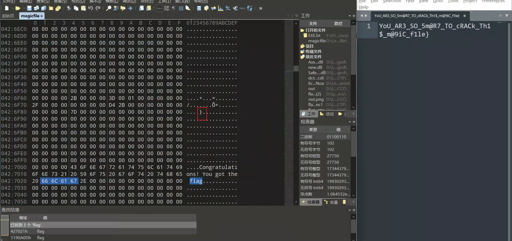

# TPCTF

22nd

## chase

nes游戏，装一个FCEUX模拟器，打通五关吃豆人获得flag part1，`TPCTF{D0_Y0U_L1KE_`

（补充快速通关法：FCEUX-Debug-Hex Editor 定位0x84（当前得分）修改值为0x85（目标得分）的值即可快速通关）

查看ppu viewer 得到flag part3，`ON_Y0UR_N3S?}`

flag part2以Tile形式存储在ROM内存里，还是在ppu viewer里可以看到Tile代表的十六进制数据，比如F是$26 L是$2C A是$21 G是$27

去ROM里找可以找到两处地方，交换下玩通关即可得到flag part2，`PLAY1N9_6@M3S_`

完整`TPCTF{D0_Y0U_L1KE_PLAY1N9_6@M3S_ON_Y0UR_N3S?}`

## obfuscator

发现运行完Obfuscator之后，会在根目录tmp文件夹下生成一个deno-compile-flag_checker.cache，可以看到里面有混淆过的js代码提取出来，发现开头有个校验如果我想知道eval值换行了就会导致进入catch打印`Error: the code has been tampered!`

~~~js
const jS0v=Tr5t(HkYv,bIQv(Y4QD.toString()));// 解密js代码字符串
    try
    {
        let DfTv=eval(jS0v);
        return DfTv.apply(null,Aevx);
    }
 catch(fNVv)
        {
            var zaOv=(0o203410-67316);
            while(zaOv<(0o400155%65575))
                switch(zaOv)
            {
            case (0x3004D%0o200023):
                zaOv=fNVv instanceof SyntaxError?(0o400115%0x1001F):(0o400157%0x10028);
                break;
            case (0o200702-0x101B3):
                zaOv=(0o400173%65582);
                {
                    console.log('Error: the code has been tampered!');
                    return
                }
                    break;
            }
            throw fNVv;
        }
~~~

因此需要直接把硬编码的Y4QD.toString()写入，做法是加入console.log(Y4QD.toString())，打印出来删去log代码即可得到完整代码字符串，替换掉Y4QD.toString()，加些换行下断点即可提取出jS0v字符串，得到下一层js

在线解混淆调整好格式发现中间大量字符串，结合中间异或可知存在更深的混淆字符串，直接动调到最后，发现解密的字符串里有一串gzip的base64以及运行flag_checker会出现的usage提示加上flag参数

cyberchef解密后下载为压缩包提出来是wasm，搜索flag定位到一大串明文

~~~
path	command-line-arguments
dep	github.com/fatih/color	v1.18.0	h1:S8gINlzdQ840/4pfAwic/ZE0djQEH3wM94VfqLTZcOM=
dep	github.com/mattn/go-colorable	v0.1.13	h1:fFA4WZxdEF4tXPZVKMLwD8oUnCTTo08duU7wxecdEvA=
dep	github.com/mattn/go-isatty	v0.0.20	h1:xfD0iDuEKnDkl03q4limB+vH+GxLEtL/jb4xVJSWWEY=
build	-buildmode=exe
build	-compiler=gc
build	-ldflags="   -X 'main.encryptedFlag=5ab82be11ac991707e166bbfcbf05cb5776b0ecb34ce659e6209542fecba7ab6ec82f44c1ab55e4f4fb06b37ef935b08'   -X 'main.maskedKey=960937ed01e77d7662565988a67abbfe0a2c11742abd00d6cf74de094447f7d3'   -X 'main.maskedIV=a7ccfe57d2af1deb1a0088517c0a9240'   -X 'main.mask=5dabc0b2b7296eefeaadd177746adb4acb2439e7990792cc7fdb7124b1a2633d'   -s -w "
build	CGO_ENABLED=0
build	GOARCH=wasm
build	GOOS=js
~~~

确定是带mask掩码的AES，CBC模式

~~~python
from Crypto.Cipher import AES
import binascii

masked_key_hex = "960937ed01e77d7662565988a67abbfe0a2c11742abd00d6cf74de094447f7d3"
masked_iv_hex = "a7ccfe57d2af1deb1a0088517c0a9240"
mask_hex = "5dabc0b2b7296eefeaadd177746adb4acb2439e7990792cc7fdb7124b1a2633d"
encrypted_flag_hex = "5ab82be11ac991707e166bbfcbf05cb5776b0ecb34ce659e6209542fecba7ab6ec82f44c1ab55e4f4fb06b37ef935b08"

masked_key = bytes.fromhex(masked_key_hex)
masked_iv = bytes.fromhex(masked_iv_hex)
mask = bytes.fromhex(mask_hex)
encrypted_flag = bytes.fromhex(encrypted_flag_hex)

# 计算 realKey 和 realIV
real_key = bytes(a ^ b for a, b in zip(masked_key, mask))
real_iv = bytes(a ^ b for a, b in zip(masked_iv, mask[:len(masked_iv)]))

print("Real Key:", real_key.hex())
print("Real IV:", real_iv.hex())

cipher = AES.new(real_key, AES.MODE_CBC, real_iv)
decrypted_flag = cipher.decrypt(encrypted_flag)

try:
    decrypted_flag = decrypted_flag.rstrip(b"\x00").decode("utf-8")
except:
    decrypted_flag = decrypted_flag.hex()

print("Decrypted Flag:", decrypted_flag)

#Real Key: cba2f75fb6ce139988fb88ffd21060b4c1082893b3ba921ab0afaf2df5e594ee
#Real IV: fa673ee565867304f0ad59260860490a
#Decrypted Flag: TPCTF{m47r3shk4_h4ppy_r3v3r53_g@_w45m}
~~~

## linuxpdf

可以找官网demo pdf下载下来对比下不同，010查看发现不同点在于embedded_files，官网给了vm_32.cfg题目给了vm_64.cfg，且题目明显base64太多了，因此提取出整个embedded_files，里面全是base64随便选一个cyberchef发现解密是zlib压缩的数据

因此写代码遍历字典base64解密并zlib解压，文件名就是字典key值，找找有`Flag:`的地方（linux.pdf运行会打印的内容）

~~~python
from base64 import b64decode
import zlib

embedded_files = {} # 太长了省略
for key, value in embedded_files.items():
    data = zlib.decompress(b64decode(value))
    if b"Flag:" in data:
        with open(f"checker_file", "wb") as f:
            f.write(zlib.decompress(b64decode(value)))
        break
~~~

反编译checker_file是risc-V格式，很明显是md5加密，比赛时候粗心没搞懂(char *)&unk_4220 + dword_4284传入的是前n个字符，最后靠队友意外爆破出最后一个md5解密是`F}`才搞懂正确逻辑

~~~python
int __cdecl main(int argc, const char **argv, const char **envp)
{
  __int64 v3; // a1
  __int64 v4; // a2

  puts("Flag: ", argv, envp);
  scanf("%29s", &unk_4220);
  for ( dword_4284 = 0; dword_4284 <= 27LL; ++dword_4284 )
    sub_2948((char *)&unk_4220 + dword_4284, (char *)&unk_4008 + 17 * dword_4284);
  puts("Correct", v3, v4);
  return 0;
}
__int64 __fastcall sub_2948(__int64 a1, __int64 a2, __int64 a3, __int64 a4)
{
  __int64 v4; // a0
  __int64 result; // a0
  __int64 v6; // a1
  __int64 v7; // a2
  _BYTE v10[16]; // [sp+18h] [-38h] BYREF
  _QWORD v11[2]; // [sp+28h] [-28h] BYREF

  sub_255C(v10, a2, a3, a4, 0LL);
  v4 = strlen(a1);
  sub_25DC(v10, a1, v4);
  v11[0] = 0LL;
  v11[1] = 0LL;
  sub_2790(v10, v11);
  result = memcmp(v11, a2, 16LL);
  if ( result )
  {
    puts("Wrong", v6, v7);
    exit(0LL);
  }
  return result;
}
__int64 __fastcall sub_255C(_DWORD *a1)
{
  __int64 result; // a0

  if ( !a1 )
    _assert_fail("ctx != NULL", "code.c", 116LL, "md5_init");
  result = memset(a1, 0LL, 16LL);
  *a1 = 0x67452301;
  a1[1] = 0xEFCDAB89;
  a1[2] = 0x98BADCFE;
  a1[3] = 0x10325476;
  return result;
}
~~~

从后往前爆破即可

~~~python
from hashlib import md5
from string import printable

s = [0x38, 0xF8, 0x8A, 0x3B, 0xC5, 0x70, 0x21, 0x0F, 0x8A, 0x8D, 0x95, 0x58, 0x5B, 0x46, 0xB0, 0x65, 0x00, 0x83, 0x05, 0x5A, 0xE8, 0x0C, 0xDC, 0x8B, 0xD5, 0x93, 0x78, 0xB8, 0x62, 0x8D, 0x73, 0x3F, 0xCB, 0x00, 0xFA, 0x7D, 0xAF, 0xFB, 0xD7, 0xAC, 0xEC, 0x13, 0xB0, 0x69, 0x5D, 0x93, 0x5A, 0x04, 0xBC, 0x0F, 0x00, 0xC2, 0x9C, 0xC0, 0xFD, 0x38, 0x01, 0xC7, 0xFD, 0xD3, 0x15, 0xC7, 0x82, 0x99, 0x9B, 0xD4, 0xCB, 0x00, 0x2B, 0xA2, 0xD0, 0x1A, 0xF1, 0x2D, 0x9B, 0xE3, 0x1A, 0x2B, 0x44, 0x32, 0x3C, 0x1A, 0x4F, 0x47, 0x00, 0xDD, 0xEE, 0xBA, 0xF0, 0x02, 0x52, 0x7A, 0x9E, 0xAD, 0x78, 0xBD, 0x16, 0x68, 0x45, 0x73, 0xCC, 0x00, 0xBF, 0x95, 0xB8, 0x99, 0x34, 0xA1, 0xB5, 0x55, 0xE1, 0x09, 0x0F, 0xEC, 0xDF, 0xD3, 0xDA, 0x9F, 0x00, 0xB6, 0x42, 0x2C, 0x30, 0xB0, 0x29, 0x38, 0x53, 0x5F, 0x8E, 0x64, 0x8D, 0x60, 0xA8, 0x7B, 0x94, 0x00, 0x08, 0xC1, 0xB7, 0x66, 0x43, 0xAF, 0x8D, 0xD5, 0x0C, 0xB0, 0x6D, 0x7F, 0xDD, 0x3C, 0xF8, 0xED, 0x00, 0x42, 0xD6, 0x97, 0x19, 0xF9, 0x70, 0x88, 0xF0, 0x65, 0x40, 0xF4, 0x12, 0xDC, 0x17, 0x06, 0xFB, 0x00, 0xA1, 0xF2, 0x3D, 0xA6, 0x16, 0x15, 0x40, 0x0E, 0x7B, 0xD9, 0xEA, 0x72, 0xD6, 0x35, 0x67, 0xEB, 0x00, 0x4E, 0x24, 0x6F, 0x0A, 0x5D, 0xD3, 0xCE, 0x59, 0x46, 0x5F, 0xF3, 0xD0, 0x2E, 0xC4, 0xF9, 0x84, 0x00, 0xB8, 0xCF, 0x25, 0xF9, 0x63, 0xE8, 0xE9, 0xF4, 0xC3, 0xFD, 0xDA, 0x34, 0xF6, 0xF0, 0x1A, 0x35, 0x00, 0x2D, 0x98, 0xD8, 0x20, 0x83, 0x5C, 0x75, 0xA9, 0xF9, 0x81, 0xAD, 0x4D, 0xB8, 0x26, 0xBF, 0x8E, 0x00, 0x70, 0x2E, 0xAD, 0x08, 0xA3, 0xDD, 0x56, 0xB3, 0x13, 0x4C, 0x7C, 0x38, 0x41, 0xA6, 0x52, 0xAA, 0x00, 0xD2, 0xD5, 0x57, 0xB6, 0x13, 0x66, 0x2B, 0x92, 0xF3, 0x99, 0xD6, 0x12, 0xFB, 0x91, 0x59, 0x1E, 0x00, 0xE4, 0x42, 0x2B, 0x63, 0x20, 0xED, 0x98, 0x9E, 0x7E, 0x3C, 0xB9, 0x7F, 0x36, 0x9C, 0xBA, 0x38, 0x00, 0x71, 0x80, 0x35, 0x86, 0xC6, 0x70, 0x59, 0xDD, 0xA3, 0x25, 0x25, 0xCE, 0x84, 0x4C, 0x50, 0x79, 0x00, 0x83, 0xB3, 0x71, 0x80, 0x1D, 0x0A, 0xDE, 0x07, 0xB5, 0xC4, 0xF5, 0x1E, 0x8C, 0x62, 0x15, 0xE2, 0x00, 0xB0, 0xD1, 0xB4, 0x88, 0x5B, 0xC2, 0xFD, 0xC5, 0xA6, 0x65, 0x26, 0x69, 0x24, 0x48, 0x6C, 0x5F, 0x00, 0x79, 0x2C, 0x9E, 0x7F, 0x05, 0xC4, 0x07, 0xC5, 0x6F, 0x3B, 0xEC, 0x4C, 0xA7, 0xE5, 0xC1, 0x71, 0x00, 0x38, 0x55, 0xE5, 0xA5, 0xBB, 0xC1, 0xCB, 0xE1, 0x8A, 0x6E, 0xAB, 0x5D, 0xD9, 0x7C, 0x06, 0x3C, 0x00, 0x88, 0x6D, 0x45, 0xE0, 0x45, 0x1B, 0xBB, 0xA7, 0xC0, 0x34, 0x1F, 0xE9, 0x0A, 0x95, 0x4F, 0x34, 0x00, 0x3A, 0x43, 0x7C, 0xBE, 0x65, 0x91, 0xEA, 0x34, 0x89, 0x64, 0x25, 0x85, 0x6E, 0xAE, 0x7B, 0x65, 0x00, 0x34, 0x30, 0x49, 0x67, 0xA0, 0x67, 0x30, 0x8A, 0x76, 0x70, 0x1F, 0x05, 0xC0, 0x66, 0x85, 0x51, 0x00, 0xD6, 0xAF, 0x7C, 0x4F, 0xED, 0xCF, 0x2B, 0x67, 0x77, 0xDF, 0x8E, 0x83, 0xC9, 0x32, 0xF8, 0x83, 0x00, 0xDF, 0x88, 0x93, 0x1E, 0x7E, 0xEF, 0xDF, 0xCC, 0x2B, 0xB8, 0x0D, 0x4A, 0x4F, 0x57, 0x10, 0xFB, 0x00, 0xCB, 0x0F, 0xC8, 0x13, 0x75, 0x5A, 0x45, 0xCE, 0x59, 0x84, 0xBF, 0xBA, 0x15, 0x84, 0x7C, 0x1E, 0x00]

flag = "}"
for j in range(len(s)-17, -1, -17):
    for i in printable:
        text = i + flag
        if md5(text.encode()).hexdigest() == bytes(s[j:j+16]).hex():
            print(text)
            flag = text
            break
~~~

## portable

~~耐心动调即可找到主函数逻辑~~  （下次比赛先去看.data段，直接就是数据）

~~~c++
__int64 __fastcall sub_407F30()
{
// 。。。
  
  sub_40B5B0();
  v354 = 0;
  sub_40B714(v12, 0);                           // printf+scanf
  // 。。。
  if ( v17 != 0x49 )                            // 长度73
    goto LABEL_62;
  v27 = 0;
  v203 = 0LL;
  v202 = 6LL;
  v201 = &v69;
  sub_42769E(6LL, 0LL, &v69);                   // 截断前6字符
  v200 = 0x45905ALL;
  v199 = v57;
  v198 = 0x45905ALL;
  v197 = 0x45905ALL;
  v196 = 0x45905ALL;
  v195 = 6LL;
  v194 = v57;
  v193 = v57;
  v192 = v57;
  v191 = v57;
  if ( (v57[0] & 1) != 0 )
  {
    v190 = v194;
    v189 = v194;
    v188 = v194;
    v28 = *((_QWORD *)v194 + 1);
  }
  else
  {
    v187 = v194;
    v186 = v194;
    v185 = v194;
    v28 = *v194 >> 1;                           // c除以2正好6
  }
  if ( v195 != v28 || (unsigned int)sub_427BFE(v198, -1LL, v195) != 0 )// 第一个参数是TPCTF{}地址
    goto LABEL_105;
  v184 = 72LL;
  v183 = 1LL;
  v182 = &v70;
  sub_42769E(1LL, 72LL, &v70);                  // 取出最后一位字符
  v27 = 1;
  v181 = 4558945LL;
  v180 = v58;
  v179 = 4558945LL;
  v178 = 4558945LL;
  v177 = 4558945LL;
  v176 = 1LL;
  v175 = v58;
  v174 = v58;
  v173 = v58;
  v172 = v58;
  if ( (v58[0] & 1) != 0 )
  {
    v171 = v175;
    v170 = v175;
    v169 = v175;
    v30 = *((_QWORD *)v175 + 1);
  }
  else
  {
    v168 = v175;                                // 还是进来
    v167 = v175;
    v166 = v175;
    v30 = *v175 >> 1;
  }
  if ( v176 != v30 || (unsigned int)sub_427BFE(v179, -1LL, v176) != 0 )// 检查最后一位是否等于}
LABEL_105:
    v32 = 1;
  else
    v32 = 0;
  if ( v27 )
    sub_4275C0();
  sub_4275C0();
  if ( v32 )                                    // 不要进去
  {
LABEL_62:
    v271 = 0x459044LL;
    v270 = 0x459044LL;
    v269 = 0x459044LL;
    v268 = (_QWORD *)&unk_49B010;
    v267 = 0x459044LL;
    v266 = 21LL;
    ((void (*)(void))sub_40B6DE)();
    if ( v51 )
    {
      v265 = (char *)v268 + *(_QWORD *)(*v268 - 24LL);
      v264 = v265 + 144;
      if ( *((_DWORD *)v265 + 36) == -1 )
      {
        v263 = v265;
        v262 = 32;
        sub_40ADB6();
        v261 = sub_40F56C();
        v260 = v262;
        v18 = (*(__int64 (**)(void))(*(_QWORD *)v261 + 56LL))();
        sub_40F51C();
        v259 = v265 + 144;
        v258 = v18;
        *((_DWORD *)v265 + 36) = v18;
      }
      v257 = v265 + 144;
      v19 = *((_DWORD *)v265 + 36);
      v20 = (char *)v268 + *(_QWORD *)(*v268 - 24LL);
      v256 = v20;
      if ( (*((_DWORD *)v20 + 2) & 0xB0) == 0x20 )
        v21 = v267 + v266;
      else
        v21 = v267;
      v255 = v268;
      v254 = (char *)v268 + *(_QWORD *)(*v268 - 24LL);
      v253 = v254;
      v66 = *((_QWORD *)v254 + 5);
      v50 = v66;
      v252 = v267;
      v251 = v21;
      v250 = v267 + v266;
      v249 = v20;
      v248 = v19;
      if ( v66 )
      {
        v247 = v250 - v252;
        v246 = v249;
        v245 = *((_QWORD *)v249 + 3);
        if ( v250 - v252 >= v245 )
          v245 = 0LL;
        else
          v245 -= v247;
        v244 = v251 - v252;
        if ( v251 - v252 <= 0
          || (v243 = v50,
              v242 = v252,
              v241 = v244,
              v22 = (*(__int64 (__fastcall **)(__int64, __int64))(*(_QWORD *)v50 + 96LL))(v252, v244),
              v244 == v22) )
        {
          if ( v245 <= 0 )
            goto LABEL_84;
          v240 = v245;
          v239 = v248;
          v238 = v49;
          v237 = &v68;
          v236 = v49;
          v235 = &v67;
          v234 = v49;
          v233 = v49;
          v232 = v49;
          sub_427734(v245, (unsigned int)v248);
          v231 = v49;
          v230 = v49;
          v229 = v49;
          v228 = v49;
          if ( (v49[0] & 1) != 0 )
          {
            v227 = v231;
            v226 = v231;
            v225 = v231;
            v23 = (_BYTE *)*((_QWORD *)v231 + 2);
          }
          else
          {
            v224 = v231;
            v223 = v231;
            v222 = v231;
            v221 = v231 + 1;
            v220 = v231 + 1;
            v23 = v231 + 1;
          }
          v219 = v23;
          v218 = v50;
          v217 = v23;
          v216 = v245;
          v24 = (*(__int64 (__fastcall **)(_BYTE *, __int64))(*(_QWORD *)v50 + 96LL))(v23, v245);
          if ( v245 == v24 )
          {
            v25 = 1;
          }
          else
          {
            v50 = 0LL;
            v1 = 0LL;
            v25 = 0;
          }
          sub_4275C0();
          if ( v25 == 1 )
          {
LABEL_84:
            v244 = v250 - v251;
            if ( v250 - v251 <= 0
              || (v215 = v50,
                  v214 = v251,
                  v213 = v244,
                  v26 = (*(__int64 (__fastcall **)(__int64, __int64))(*(_QWORD *)v50 + 96LL))(v251, v244),
                  v244 == v26) )
            {
              v212 = v249;
              v211 = 0LL;
              v210 = *((_QWORD *)v249 + 3);
              *((_QWORD *)v249 + 3) = 0LL;
              v1 = v50;
            }
            else
            {
              v50 = 0LL;
              v1 = 0LL;
            }
          }
        }
        else
        {
          v50 = 0LL;
          v1 = 0LL;
        }
      }
      else
      {
        v1 = 0LL;
      }
      v65 = v1;
      if ( !v1 )
      {
        v209 = (char *)v268 + *(_QWORD *)(*v268 - 24LL);
        v208 = 5;
        v207 = v209;
        v206 = 5;
        ((void (*)(void))sub_40ADD0)();
      }
    }
    sub_40B5B0();
    v205 = v268;
    v204 = 4238150LL;
    sub_40AB46();                               // Incorrect! Try again.
  }
  else
  {
    for ( i = 0; i <= 65; ++i )                 // 遍历flag格式里的字符
    {
      v165 = i + 6;                             // 下标
      v164 = &v55;
      v163 = &v55;
      v162 = &v55;
      v161 = &v55;
      if ( (v55 & 1) != 0 )
      {
        v160 = v164;
        v159 = v164;
        v158 = v164;
        v33 = *((_QWORD *)v164 + 1);
      }
      else
      {
        v157 = v164;
        v156 = v164;
        v155 = v164;
        v33 = *(_BYTE *)v164 >> 1;
      }
      if ( v33 < v165 )
        BUG();
      v154 = &v55;
      v153 = &v55;
      v152 = &v55;
      v151 = &v55;
      if ( (v55 & 1) != 0 )
      {
        v150 = v154;
        v149 = v154;
        v148 = v154;
        v34 = (char *)*((_QWORD *)v154 + 2);
      }
      else
      {
        v147 = v154;
        v146 = v154;
        v145 = v154;
        v144 = (char *)v154 + 1;
        v143 = (char *)v154 + 1;
        v34 = (char *)v154 + 1;
      }
      if ( ((unsigned __int8)byte_46B2A0[i % 12] ^ (unsigned __int8)v34[v165]) != byte_46B2C0[i] )
        goto LABEL_62; // 核心加密，循环异或罢了
    }
    // 。。。
}
~~~

解密下循环异或就好了，坑点flag不是ascii格式，是utf-8

~~~python
s = [0x34, 0x2A, 0x42, 0x0E, 0x00, 0x1D, 0x5C, 0x33, 0x5E, 0x44, 0x3E, 0x1A, 0x0B, 0x5C, 0x2C, 0x3A, 0x5F, 0x22, 0x03, 0x28, 0x36, 0x1B, 0x07, 0x31, 0x8D, 0xDE, 0x10, 0xA2, 0xEB, 0xB2, 0xDA, 0xA2, 0xD8, 0x18, 0x0D, 0x17, 0x1C, 0x1F, 0xBD, 0xD9, 0x1D, 0xBF, 0xEB, 0xA2, 0xD8, 0x16, 0x0D, 0xA0, 0xF6, 0x30, 0xBD, 0xD8, 0x17, 0xBE, 0xDA, 0x0F, 0xAB, 0xC1, 0xAE, 0xEA, 0x8D, 0xDE, 0x11, 0x01, 0xA1, 0xC5]
xor = b"Cosmopolitan"
flag = []
for i in range(len(s)):
    flag.append((xor[i%len(xor)]^s[i]))
print(f"TPCTF{{{bytes(flag).decode("utf-8")}}}")
~~~

TPCTF{wE1com3_70_tH3_W0RlD_of_αcτµαlly_pδrταblε_εxεcµταblε}

## stone-game

pycdc反编译stone_game.pyc失败，尝试https://pylingual.io/反编译，得到

~~~python
# Decompiled with PyLingual (https://pylingual.io)
# Internal filename: stone_game.py
# Bytecode version: 3.13.0rc3 (3571)
# Source timestamp: 1970-01-01 00:00:00 UTC (0)

import os
import time
import random
import sys
from game_logic import DigitalDisplayGame, MonteCarloAI
FLAG = open('FLAG').read()

class GameUI:
    def __init__(self, max_stones=10):
        self.max_stones = max_stones
        self.reset_game()

    def reset_game(self):
        """Reset the game for a new round"""  # inserted
        self.game = DigitalDisplayGame(self.max_stones)
        self.ai = MonteCarloAI(self.game, iterations=2000)
        self.game.current_player = 0

    def display_game(self):
        """Display the current game state"""  # inserted
        os.system('clear' if os.name == 'posix' else 'cls')
        print('\nDigital Display Game\n')
        print('\nCurrent stone count:')
        for i in range(7):
            print(f'Segment {i + 1}: {self.game.stones[i]} stones')
        print('\nCurrent player:', 'You' if self.game.current_player == 0 else None, 'AI')

    def get_player_move(self):
        """Get the player\'s move"""  # inserted
        pass
        try:
            print('\nEnter the number of stones to remove from each segment (space-separated, e.g.: 0 1 0 2 0 0 0):')
            move = list(map(int, input().split()))
            if len(move)!= 7:
                print('Input must be 7 numbers!')
                continue
            if self.game.is_valid_move(move):
                return move
            except ValueError:
                print('Please enter valid numbers!')

    def play_single_game(self):
        """Play a single round of the game"""  # inserted
        if not self.game.is_game_over():
            self.display_game()
            if self.game.current_player == 0:
                move = self.get_player_move()
                self.game.make_move(move)
        self.display_game()
        winner = self.game.get_winner()
        if winner == 0:
            print('\nYou won this round!')
        return True

def main():
    max_stones = 100
    total_rounds = 100
    win_threshold = 90
    print('Welcome to the Digital Display Game Challenge!')
    print('The player who cannot make a move loses.')
    print('You will always go first in each round.')
    print(f'You need to win at least {win_threshold} out of {total_rounds} rounds to get the flag.')
    print('Press Enter to start...')
    input()
    game = GameUI(max_stones)
    player_wins = 0
    for round_num in range(1, total_rounds + 1):
        print(f'\n=== Round {round_num}/{total_rounds} ===')
        print(f'Current score: {player_wins}/{round_num - 1}')
        game.reset_game()
        if game.play_single_game():
            player_wins += 1
        print(f'Score after round {round_num}: {player_wins}/{round_num}')
        if round_num < total_rounds:
            pass  # postinserted
        else:  # inserted
            print('Next round starting in 2 seconds...')
            time.sleep(2)
    print('\n=== Challenge Complete ===')
    print(f'Final score: {player_wins}/{total_rounds}')
    if player_wins >= win_threshold:
        print('\nCongratulations! You\'ve beaten the AI enough times to earn the flag:')
        print(FLAG)
    return None
if __name__ == '__main__':
    try:
        main()
    except KeyboardInterrupt:
        print('\nGame terminated by user.')
        sys.exit(0)
~~~

石子游戏，队友发现有个必下赢ai的策略：玩家先取走4组，AI只会拿剩下3堆中的一堆，这时候我们只需要再次等到我们拿取的时候将剩下的全部取走便可以获得胜利，即两轮必获胜

我实现了个自动化脚本，写自动化还是不太熟悉，几乎和队友手动差不多同时出

~~~python
import re
from pwn import *

def parse_segments(data):
    # 处理可能的换行符问题
    cleaned = data.replace('\r\n', '\n').replace('\r', '\n')
    matches = re.findall(r'Segment \d+: (\d+) stones', cleaned)
    return list(map(int, matches)) if len(matches) == 7 else None

def check_won(data):
    if "won" in data:
        return True

def main():
    conn = remote('1.95.128.179', 3626)  # 修改为实际地址
    conn.recvuntil(b'Press Enter to start...')
    conn.sendline()

    for _ in range(100):
        for i in range(2):
            # 接收数据直到输入提示
            data = conn.recvuntil(b'Enter the number of stones to remove from each segment (space-separated, e.g.: 0 1 0 2 0 0 0):').decode()
            print(data)
            # 解析石子数
            segments = parse_segments(data)[-7:]
            if i == 0:
                move = segments[:4]+[0]*3
            elif i == 1:
                move = segments
            # 发送移动
            move_str = ' '.join(map(str, move))
            print(f"Sending move: {move_str}")
            conn.sendline(move_str.encode())
            # 接收AI回合结果
            result = conn.recvuntil(b'Current player: AI', timeout=2).decode()
            print(result)

    # 获取最终结果
    print(conn.recv().decode())

if __name__ == '__main__':
    main()
~~~

## magicfile

赛后搞懂了，这题咋也跟misc似的，定位}往前一个个可见字符找拼起来即可得到flag

