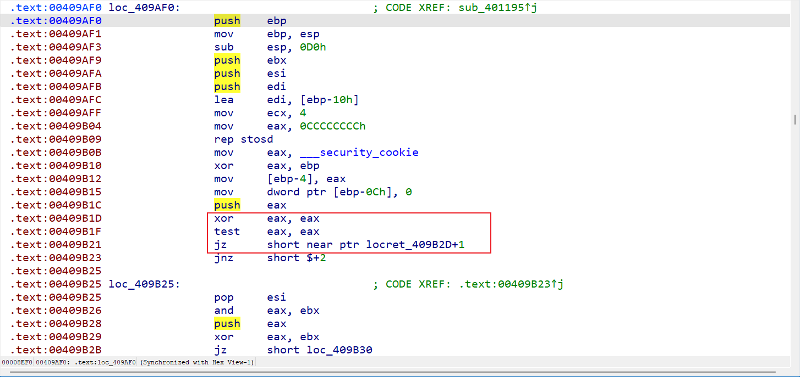
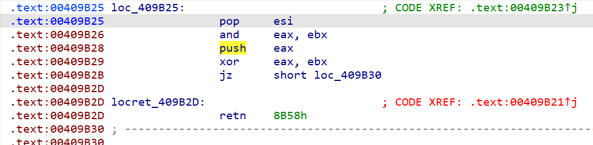
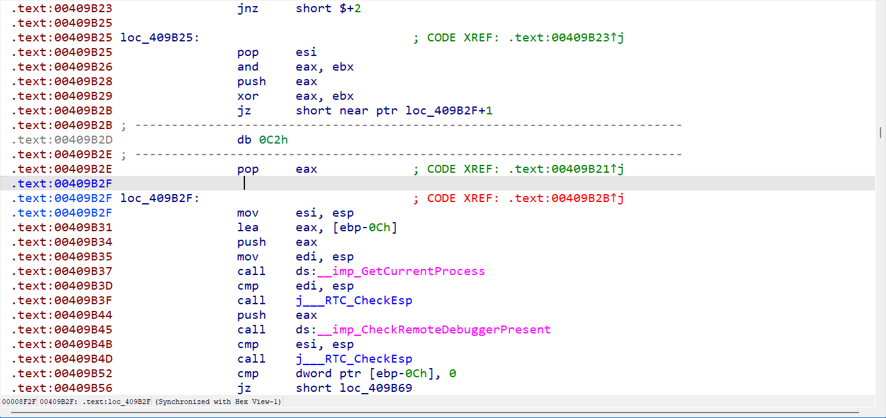

# WKCTF 2024 WP

隔了很久才想起来复现下，这个比赛印象挺深的，毕竟是早期参加的比赛，而且奖品是黑神话hhh，当时很菜名次很低，根本拿不到奖，不过后来有幸参加了另一个小比赛一等奖拿了个黑神话悟空豪华版✌

[TOC]

## Reverse

### so_easy

逻辑再清晰不过了，crc64加密，现在才知道

~~~c
__int64 __fastcall Java_com_so_easy_MainActivity_soEasy(__int64 a1, __int64 a2, __int64 a3)
{//...
  v22 = __readfsqword(0x28u);
  v5 = 0;
  v6 = (const char *)(*(__int64 (__fastcall **)(__int64, __int64, _QWORD))(*(_QWORD *)a1 + 1352LL))(a1, a3, 0LL);
  v7 = v6;
  memset(v20, 0, sizeof(v20));
  v21 = 0;
  if ( *v6 )
  {
    v8 = strlen(v6);
    v9 = 0LL;
    do
    {
      v10 = *(_QWORD *)&v7[v9];
      v11 = 255;
      do
      {
        v12 = (2 * v10) ^ 0x71234EA7D92996F5LL;
        if ( v10 >= 0 )
          v12 = 2 * v10;
        v13 = (2 * v12) ^ 0x71234EA7D92996F5LL;
        if ( v12 >= 0 )
          v13 = 2 * v12;
        v14 = (2 * v13) ^ 0x71234EA7D92996F5LL;
        if ( v13 >= 0 )
          v14 = 2 * v13;
        v15 = (2 * v14) ^ 0x71234EA7D92996F5LL;
        if ( v14 >= 0 )
          v15 = 2 * v14;
        v10 = (2 * v15) ^ 0x71234EA7D92996F5LL;
        if ( v15 >= 0 )
          v10 = 2 * v15;
        v11 -= 5;
      }
      while ( v11 );
      *(_QWORD *)((char *)v20 + v9) = v10;
      v9 += 8LL;
    }
    while ( v8 > v9 );
  }
  if ( *v7 )
  {
    v16 = strlen(v7);
    v17 = 0LL;
    LOBYTE(v5) = 0;
    do
    {
      v18 = v5 + (*(_WORD *)((char *)v20 + v17) == *(_WORD *)((char *)&unk_560 + v17));
      v17 += 2LL;
      v5 = v18;
    }
    while ( v16 > v17 );
  }
  (*(void (__fastcall **)(__int64, __int64, const char *))(*(_QWORD *)a1 + 1360LL))(a1, a3, v7);
  return v5;
}
~~~

~~~python
s = [0x540A95F0C1BA81AE, 0xF8844E52E24A0314, 0x09FD988F98143EC9, 0x3FC00F01B405AD5E]
new_s = []
for v10 in s:
    for i in range(255):
        bit = v10 & 1
        if bit:
            v10 ^= 0x71234EA7D92996F5
        v10 >>= 1
        if bit:
            v10 |= 0x8000000000000000
    new_s.append(v10)
print("".join([bytes.fromhex(hex(i)[2:]).decode()[::-1] for i in new_s]))
~~~

### quite_easy

hook+反调试+花指令，现在能看懂了

看到主函数直接给flag基本都是hook了，定位hook函数

~~~c
void __stdcall TlsCallback_0_0(int a1, int a2, int a3)
{
  __CheckForDebuggerJustMyCode(&unk_41A036);
  if ( a2 == 1 )
  {
    sub_401195();
    sub_4014A6();
  }
}
~~~

第一个函数sub_401195指向的内容如下

红框里是花指令，xor完eax=0，test eax eax zf=1，jz必然跳转，跳转的位置位retn中间

因此需要转为data再重新反编译，可以看到此时代码就很清晰，nop掉xor完到pop eax前中间的指令即可反编译整个代码

得到代码如下，很明显是反调试

~~~c
BOOL sub_409AF0()
{
  HANDLE CurrentProcess; // eax
  BOOL result; // eax
  BOOL pbDebuggerPresent; // [esp+D4h] [ebp-Ch] BYREF

  pbDebuggerPresent = 0;
  CurrentProcess = GetCurrentProcess();
  result = CheckRemoteDebuggerPresent(CurrentProcess, &pbDebuggerPresent);
  if ( pbDebuggerPresent )
    ExitProcess(0);
  return result;
}
~~~

另一个函数sub_4014A6同理，去除花指令后如下；看到了`ProcAddress = GetProcAddress(ModuleHandleA, "strcmp");`基本可以确定hook，真实函数为sub_401573

~~~c
PVOID sub_407C40()
{//...
  v8 = 0;
  v7 = 0;
  lpModuleName = "ucrtbased.dll";
  flOldProtect[3] = (DWORD)"strcmp";
  ModuleHandleA = GetModuleHandleA("ucrtbased.dll");
  ProcAddress = GetProcAddress(ModuleHandleA, "strcmp");
  ModuleHandleW = GetModuleHandleW(0);
  v14 = (char *)ImageDirectoryEntryToData(ModuleHandleW, 1u, 1u, Size);
  while ( 1 )
  {
    result = v14;
    if ( !*((_DWORD *)v14 + 4) )
      break;
    String1 = (char *)GetModuleHandleW(0) + *((_DWORD *)v14 + 3);
    if ( !_stricmp(String1, lpModuleName) )
    {
      for ( i = (FARPROC *)((char *)GetModuleHandleW(0) + *((_DWORD *)v14 + 4)); *i; ++i )
      {
        lpAddress = i;
        if ( *i == ProcAddress )
        {
          VirtualQuery(lpAddress, &Buffer, 0x1Cu);
          v7 = VirtualProtect(Buffer.BaseAddress, Buffer.RegionSize, 0x40u, flOldProtect);
          if ( v7 )
          {
            dword_417420 = *(_DWORD *)lpAddress;
            ::lpAddress = lpAddress;
            *(_DWORD *)lpAddress = sub_401573;
            v8 = 1;
            VirtualProtect(Buffer.BaseAddress, Buffer.RegionSize, flOldProtect[0], 0);
          }
          break;
        }
      }
      v14 += 20;
    }
    else
    {
      v14 += 20;
    }
  }
  if ( !v8 )
  {
    sub_40117C("are you ok?\n", v3);
    exit(1);
  }
  return result;
}
~~~

分析sub_401573

~~~c
int __cdecl sub_B5A5A0(char *Str, int a2)
{//...
  __CheckForDebuggerJustMyCode(&unk_B6A036);
  sub_B5111D(Str);
  v22 = 1;
  sub_B5111D((char *)&::Str);
  v2 = sub_B51663(v21);                         // 求长度
  srand(v2 + 89);
  for ( i = 0; i < 16; ++i )
  {
    v3 = rand();
    sub_B513E3(v3);
  }
  if ( sub_B51663(v21) != 48 )                  // 需要确保实际输入的长度为48，此时长度变长是因为加了随机数
    exit(99);
  for ( j = 0; j < 16; ++j )
  {
    v4 = *(char *)sub_B510DC(j);                // 取第j个字符
    v5 = *(char *)sub_B510DC(j + 32) ^ v4;      // 和第j+32即随机数第j个异或
    v6 = *(_BYTE *)sub_B510DC(j);
    v7 = (_BYTE *)sub_B510DC(j + 32);
    sub_B513E3(~(*v7 & v6) & v5);
  }
  for ( k = 16; k < 32; ++k )
  {
    v8 = *(char *)sub_B510DC(k);                // 取第k个字符
    v9 = *(char *)sub_B510DC(k - 16) ^ v8;      // 和第k-16个字符异或即前十六个字符
    v10 = *(_BYTE *)sub_B510DC(k);
    v11 = (_BYTE *)sub_B510DC(k - 16);
    sub_B513E3(~(*v11 & v10) & v9);
  }
  for ( m = 0; m < 32; ++m )
  {
    v14 = (_BYTE *)sub_B510DC(m);               // 取值正是之前异或操作完的结果
    *v14 -= *(_BYTE *)(m + a2);                 // 减去假的flag字符值
  }
  sub_B51460();
  v12 = (const char *)sub_B514E7(v20);
  v15 = strcmp(v12, Str2);
  LOBYTE(v22) = 0;
  sub_B51357(v20);
  v22 = -1;
  sub_B51357(v21);
  return v15;
}
~~~

这道题貌似必须得调试才能看懂逻辑，直接静态看不懂代码，不知道是什么原理

~~~python
str2 = [0x80, 0xD3, 0x6F, 0xFF, 0x15, 0x03, 0x98, 0x8C, 0xB4, 0x5B, 0x96, 0xC0, 0x59, 0xAC, 0x18, 0xDF, 0x2D, 0xCE, 0x3F, 0xFB, 0xC4, 0xED, 0xD8, 0xD2, 0xA8, 0x2D, 0xF8, 0x23, 0x9F, 0x22, 0x25, 0xCE]
fake_flag = "flag{ed1d665e6516a37ab09f0b7a40}"
rand_data = [0xB1, 0x74, 0x93, 0x32, 0xD6, 0x13, 0xCC, 0x85, 0x20, 0xA8, 0xF4, 0x96, 0x8A, 0xD2, 0x7D, 0x26]
for i in range(32):
    str2[i] = (str2[i] + ord(fake_flag[i])) & 0xff
for i in range(16):
    str2[i] ^= rand_data[i]
for i in range(16, 32):
    str2[i] ^= str2[i-16]
print("".join(map(chr, str2)))
~~~

### very_easy

不做了，出题人大傻逼

考察quickjs dump字节码，隐去了版本号，得对着函数表和github版本发布页找到对应版本【确定是2020-11-08版本】

然后修改编译器源码，把dump功能恢复下，网上有教程

但是反编译死活报错，怀疑给的字节码有问题；当时比赛就0解，联系了群里其他师傅说出题人根本不回复，装死，强烈怀疑题目有问题

## AI

跑去凑了个热闹还做出来了，感觉和逆向思路有点像，就是调试+逆向代码；

重点是得了解深度学习模型api的功能，比如nn.conv2d是在做什么，以及提取模型文件里每层的参数

~~~python
import torch
import torch.nn as nn
n=47
class Net(nn.Module):

    def __init__(self):
        super(Net, self).__init__()
        self.linear = nn.Linear(n, n*n)
        self.conv=nn.Conv2d(1, 1, (2, 2), stride=1,padding=1)

    def forward(self, x):
        x = self.linear(x)
        x = x.view(1, 1, n, n)
        x=self.conv(x)
        return x
mynet=Net()
mynet.load_state_dict(torch.load('model.pth'))
with open('ciphertext.txt') as f:
    output = f.readlines()
    output = [[float(i) for i in s.split()] for s in output]
    # print(output)

conv_before = []
for i in range(47):
    conv_line = []
    for j in range(47):
        if i == 0 and j == 0:
            conv_line.append((output[i][j]+4)/(-3))
        elif i == 0:
            conv_line.append((output[i][j]+4-conv_line[-1]*(-6))/(-3))
        elif j == 0:
            conv_line.append((output[i][j]+4-conv_before[-1][j]*9)/(-3))
        else:
            conv_line.append((output[i][j]+4-conv_line[-1]*(-6)-conv_before[-1][j]*9-conv_before[-1][j-1]*(-4))/(-3))
    conv_before.append(conv_line)
print(conv_before, len(conv_before), len(conv_before[0]))
linear_after = []
for i in conv_before:
    linear_after += i
from z3 import *
flag = [Int(f'flag{i}') for i in range(0, 47)]

solver = Solver()
for i in range(2209):
    sum = 0
    for j in range(47):
        sum += (mynet.linear.weight[i][j].item() * flag[j])
    solver.add(sum + mynet.linear.bias[i].item() == conv_before[i//47][i%47])
if solver.check() == sat:  # check()方法用来判断是否有解，sat(即satisify)表示满足有解
    ans = solver.model()  # model()方法得到解
    for i in flag:
        print(chr(ans[i].as_long()), end='')
~~~

