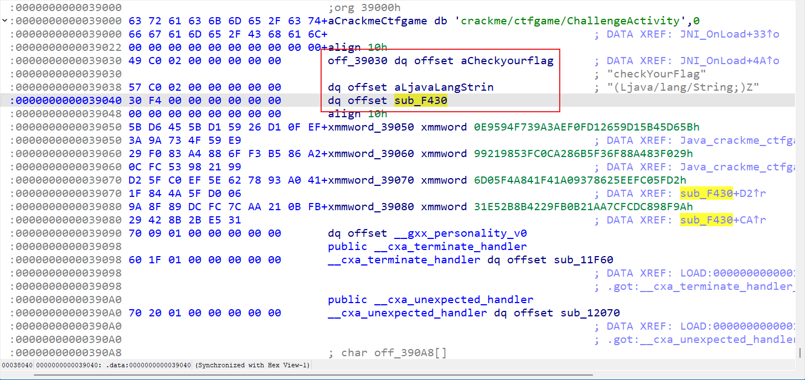
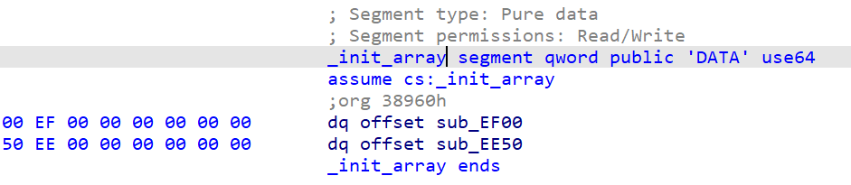
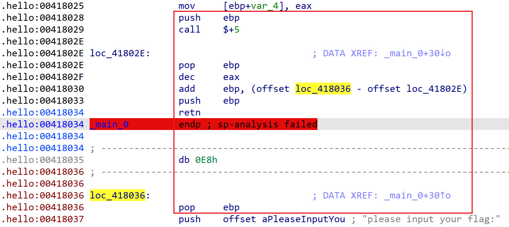

# WMCTF2024

## Reverse

### re1

- [ ] solved

这道题用到了较多的hook，学习下

首先是JNI_Onload的hook

~~~c
jint __stdcall JNI_OnLoad(JNIEnv *vm, void *reserved)
{
  __int64 v2; // rax
  JNIEnv *v4; // [rsp+8h] [rbp-10h] BYREF
  unsigned __int64 v5; // [rsp+10h] [rbp-8h]

  v5 = __readfsqword(0x28u);
  v4 = 0LL;
  ((void (__fastcall *)(JNIEnv *, JNIEnv **, __int64))(*vm)->FindClass)(vm, &v4, 65542LL);
  v2 = ((__int64 (__fastcall *)(JNIEnv *, char *))(*v4)->FindClass)(v4, aCrackmeCtfgame);
  if ( v2 )
    ((void (__fastcall *)(JNIEnv *, __int64, char **, __int64))(*v4)->RegisterNatives)(v4, v2, off_39030, 1LL);
  return 65542LL;
}
~~~

调用了off_39030结构体，第三个是实际函数而不是`Java_crackme_ctfgame_ChallengeActivity_checkYourFlag`函数

关键函数是sub_F140

~~~c
__int64 __fastcall sub_F430(JNIEnv *a1, __int64 a2, __int64 a3)
{
  __m128i *v3; // r14
  const char *v4; // rbx
  __int128 v6; // [rsp+0h] [rbp-58h] BYREF
  __m128i v7; // [rsp+10h] [rbp-48h] BYREF
  __m128i v8; // [rsp+20h] [rbp-38h] BYREF
  int v9; // [rsp+30h] [rbp-28h]
  unsigned __int64 v10; // [rsp+38h] [rbp-20h]

  v10 = __readfsqword(0x28u);
  LODWORD(v3) = 0;
  v4 = (const char *)((__int64 (__fastcall *)(JNIEnv *, __int64, _QWORD))(*a1)->GetStringUTFChars)(a1, a3, 0LL);
  if ( strlen(v4) == 32 )
  {
    v8 = 0LL;
    v7 = 0LL;
    v9 = 0;
    v3 = &v8;
    v6 = xmmword_2CD40;
    __strcpy_chk((__int64)&v7, (__int64)v4, 36LL);
    sub_F140(66LL, &v7, &v6);
    sub_F140(66LL, &v7.m128i_u64[1], &v6);
    sub_F140(66LL, &v8, &v6);
    sub_F140(66LL, &v8.m128i_u64[1], &v6);
    LOBYTE(v3) = _mm_movemask_epi8(
                   _mm_and_si128(
                     _mm_cmpeq_epi8(_mm_load_si128(&v7), (__m128i)xmmword_39070),
                     _mm_cmpeq_epi8(_mm_load_si128(&v8), (__m128i)xmmword_39080))) == 0xFFFF;
  }
  return (unsigned int)v3;
}
~~~

查看sub_F140，发现代码很怪异，出现各种printf、scanf

~~~c
unsigned __int64 __fastcall sub_F140(int a1, int *a2, const struct tm *a3)
{//...
  v3 = a2;
  v13 = __readfsqword(0x28u);
  v4 = *a2;
  maxsize_4 = v4;
  v5 = v3[1];
  maxsize = v5;
  *(_DWORD *)v10 = 0;
  if ( a1 )
  {
    v7 = a1;
    v9 = v3;
    do
    {
      printf((const char *)&maxsize_4, &maxsize, v10, a3, (char *)JNI_OnLoad + 1, v10, a3, v10, a3, a3);
      scanf(v10, (char *)JNI_OnLoad + 3, JNI_OnLoad, &scanf);
      strftime((char *)&maxsize_4, (size_t)&maxsize, v10, a3);
      --v7;
    }
    while ( v7 );
    v4 = maxsize_4;
    v5 = maxsize;
    v3 = v9;
  }
  fgetws(v3, v4, (__FILE *)v5);
  return __readfsqword(0x28u);
}
~~~

其实这时候应该想到是被hook了，去segments里找到.init_array

第一个函数如下，可以看到hook掉了很多常用函数

~~~c
unsigned __int64 sub_EF00()
{//...
  v13[1] = __readfsqword(0x28u);
  v0 = bytehook_hook_single("libEncrypt.so", 0LL, "memcmp", sub_F810, 0LL, 0LL);
  v13[0] = v0;
  v1 = qword_390C8;
  if ( qword_390C8 >= (unsigned __int64)qword_390D0 )
  {
    sub_F540(&unk_390C0, v13);
  }
  else
  {
    *(_QWORD *)qword_390C8 = v0;
    qword_390C8 = v1 + 8;
  }
  v2 = bytehook_hook_single("libEncrypt.so", 0LL, "strlen", sub_F8E0, 0LL, 0LL);
  v13[0] = v2;
  v3 = qword_390C8;
  if ( qword_390C8 >= (unsigned __int64)qword_390D0 )
  {
    sub_F540(&unk_390C0, v13);
  }
  else
  {
    *(_QWORD *)qword_390C8 = v2;
    qword_390C8 = v3 + 8;
  }
  v4 = bytehook_hook_single("libEncrypt.so", 0LL, "printf", sub_F6E0, 0LL, 0LL);
  v13[0] = v4;
  v5 = qword_390C8;
  if ( qword_390C8 >= (unsigned __int64)qword_390D0 )
  {
    sub_F540(&unk_390C0, v13);
  }
  else
  {
    *(_QWORD *)qword_390C8 = v4;
    qword_390C8 = v5 + 8;
  }
  v6 = bytehook_hook_single("libEncrypt.so", 0LL, "strftime", sub_F770, 0LL, 0LL);
  v13[0] = v6;
  v7 = qword_390C8;
  if ( qword_390C8 >= (unsigned __int64)qword_390D0 )
  {
    sub_F540(&unk_390C0, v13);
  }
  else
  {
    *(_QWORD *)qword_390C8 = v6;
    qword_390C8 = v7 + 8;
  }
  v8 = bytehook_hook_single("libEncrypt.so", 0LL, "scanf", sub_F730, 0LL, 0LL);
  v13[0] = v8;
  v9 = qword_390C8;
  if ( qword_390C8 >= (unsigned __int64)qword_390D0 )
  {
    sub_F540(&unk_390C0, v13);
  }
  else
  {
    *(_QWORD *)qword_390C8 = v8;
    qword_390C8 = v9 + 8;
  }
  v10 = bytehook_hook_single("libEncrypt.so", 0LL, "fgetws", sub_F7D0, 0LL, 0LL);
  v13[0] = v10;
  v11 = qword_390C8;
  if ( qword_390C8 >= (unsigned __int64)qword_390D0 )
  {
    sub_F540(&unk_390C0, v13);
  }
  else
  {
    *(_QWORD *)qword_390C8 = v10;
    qword_390C8 = v11 + 8;
  }
  return __readfsqword(0x28u);
}
~~~

分别查看`printf、scanf、strftime和fgetws`对应的hook代码（省略无关代码），可以看到`printf、scanf、strftime`组合起来正好是xtea加密中循环（66次）进行的三个步骤

~~~c
// 重命名完后逻辑就很清晰printf和scanf参数取到JNI_Onload前，估计是ida反编译参数识别错误，这样子明显看出来是xtea算法
//printf((const char *)&v1, &v0, total, key, (char *)JNI_OnLoad + 1, total, key, total, key, key);
//scanf(total, (char *)JNI_OnLoad + 3, JNI_OnLoad, &scanf);
//strftime((char *)&v1, (size_t)&v0, total, key);

__int64 __fastcall sub_F6E0(unsigned int *v1, _DWORD *v0, _DWORD *total, __int64 key)
{
  v4 = *v1 + ((*v0 + ((*v0 << 6) ^ (*v0 >> 6))) ^ (*(_DWORD *)(key + 4LL * (*total & 3)) + *total));
  *v1 = v4;
}
__int64 __fastcall sub_F730(unsigned int *total)
{
  v1 = *total - 0x5EEFEF3;
  *total = v1;
}
__int64 __fastcall sub_F770(_DWORD *v1, unsigned int *v0, unsigned int *total, __int64 key)
{
  v4 = *v1 + ((*v1 << 6) ^ (*v1 >> 6));
  v5 = *total;
  v6 = (v5 >> 4) & 0xC;
  v7 = *v0 + (v4 ^ (v5 + *(_DWORD *)(key + v6)));
  *v0 = v7;
}
__int64 __fastcall sub_F7D0(unsigned int *a1, unsigned int a2, unsigned int a3)
{
  *a1 = a2;
  a1[1] = a3;
}
~~~

还有strlen也被hook，里面的操作是异或0x5a和i

python解密

~~~python
import struct
from ctypes import c_uint32

def xtea_decrypt(r, v, key):
    v0, v1 = c_uint32(v[0]), c_uint32(v[1])
    delta = 0x5EEFEF3
    total = c_uint32(-delta * r)
    for i in range(r):
        v1.value -= (((v0.value << 6) ^ (v0.value >> 6)) + v0.value) ^ (total.value + key[(total.value & 0xff) >> 6])
        total.value += delta
        v0.value -= (((v1.value << 6) ^ (v1.value >> 6)) + v1.value) ^ (total.value + key[total.value & 3])
    return v0.value, v1.value

out = [0xEFC05FD2, 0x9378625E, 0x841F41A0, 0x06D05F4A, 0xDC898F9A, 0x21AA7CFC, 0x4229FB0B, 0x31E52B8B]
key = [0xFFFFFFFF, 0xAAAAAAAA, 0x11111111, 0x11111111]
for i in range(0, len(out), 2):
    out[i:i + 2] = xtea_decrypt(66, out[i:i + 2], key)
str_list = []
for i in range(len(out)):
    str_list.append(struct.pack('<I', out[i]))
flag = ""
str_list = b"".join(str_list)
for i in range(len(str_list)):
    flag += chr(i ^ 0x5a ^ str_list[i])
print(flag)	# WMCTF{b86d69bbeedeccb9257782534}
~~~

> 题目难点就在于so文件的.init_array之前一直不知道怎么看，这次知道在segment里查找，还有就是魔改xtea的细节，要能识别出key、v0、v1、total等参数的位置

### ez_learn

- [x] solved

main函数直接看到了sp-analysis错误，很明显花指令，直接nop掉红框里这种花指令

nop完后重新定义函数，得到正确反编译代码

~~~c
int __cdecl main_0(int argc, const char **argv, const char **envp)
{//...
  sub_4110F0("please input your flag:", v4);
  *(_DWORD *)Str = 0;
  v14 = 0;
  v15 = 0;
  v16 = 0;
  memset(v17, 0, 24);
  sub_411037("%32s", (char)Str);
  if ( j_strlen(Str) != 32 )
    exit(0);
  v12[0] = 140051;
  v12[1] = 8527343;
  v12[2] = 1192232;
  v12[3] = 1128481552;
  v11[6] = 19088743;
  v11[7] = -1985229329;
  v11[8] = -19088744;
  v11[9] = 1985229328;
  memset(v11, 0, 16);
  memset(v10, 0, 16);
  v8[0] = 111;
  v8[1] = -24;
  v8[2] = 118;
  v8[3] = -58;
  v8[4] = -8;
  v8[5] = -24;
  v8[6] = 103;
  v8[7] = -83;
  v8[8] = -84;
  v8[9] = -71;
  v8[10] = -99;
  v8[11] = -54;
  v8[12] = -114;
  v8[13] = 6;
  v8[14] = -82;
  v8[15] = -79;
  v9[0] = -104;
  v9[1] = 2;
  v9[2] = 27;
  v9[3] = -43;
  v9[4] = -45;
  v9[5] = -58;
  v9[6] = 39;
  v9[7] = -40;
  v9[8] = 53;
  v9[9] = -93;
  v9[10] = -91;
  v9[11] = 49;
  v9[12] = 102;
  v9[13] = 122;
  v9[14] = 58;
  v9[15] = -119;
  sub_411253(v12, Str, v11);
  for ( i = 0; i < 16; ++i )
  {
    if ( *((char *)v11 + i) != v8[i] )
    {
      sub_4110F0("flag wrong!!!1", v5);
      exit(0);
    }
  }
  sub_411253(v12, v17, v10);
  for ( j = 0; j < 16; ++j )
  {
    if ( *((char *)v10 + j) != v9[j] )
    {
      sub_4110F0("flag wrong!!!", v5);
      exit(0);
    }
  }
  sub_4110F0("you get your flag!", v5);
  return 0;
}
~~~

sub_411253很明显加密函数，分别处理一半flag

~~~c
__int64 __cdecl sub_411DF0(int a1, int *a2, _DWORD *a3)
{
  int i; // [esp+DCh] [ebp-C8h]
  int v5[3]; // [esp+E8h] [ebp-BCh] BYREF
  unsigned int v6[3]; // [esp+F4h] [ebp-B0h] BYREF
  char v7[12]; // [esp+100h] [ebp-A4h] BYREF
  int v8; // [esp+10Ch] [ebp-98h] BYREF
  int v9; // [esp+110h] [ebp-94h] BYREF
  int v10; // [esp+114h] [ebp-90h] BYREF
  _DWORD v11[34]; // [esp+118h] [ebp-8Ch] BYREF

  __CheckForDebuggerJustMyCode(&unk_41F0A2);
  v8 = *a2;
  v9 = a2[1];
  v10 = a2[2];
  v11[0] = a2[3];
  sub_41103C(a1);
  for ( i = 0; i < 32; ++i )
  {
    sub_4113CF(&v9 + i, &v11[i - 1], &v11[i], &dword_41D730[i], v7, 4);
    sub_411055(v7, v6, 4);
    v5[0] = ((v6[0] << 24) | ((unsigned __int64)v6[0] >> 8)) ^ ((v6[0] << 18) | ((unsigned __int64)v6[0] >> 14)) ^ ((v6[0] << 10) | ((unsigned __int64)v6[0] >> 22)) ^ v6[0] ^ ((4 * v6[0]) | ((unsigned __int64)v6[0] >> 30));
    sub_41134D(&v8 + i, v5, &v11[i + 1], 4);
  }
  *a3 = v11[32];
  a3[1] = v11[31];
  a3[2] = v11[30];
  a3[3] = v11[29];
  return 0xC00000000i64;
}
~~~

直接模拟代码

~~~python
b = [214, 144, 233, 254, 204, 225, 61, 183, 22, 182, 20, 194, 40, 251, 44, 5, 43, 103, 154, 118, 42, 190, 4, 195, 170, 68, 19, 38, 73, 134, 6, 153, 156, 66, 80, 244, 145, 239, 152, 122, 51, 84, 11, 67, 237, 207, 172, 98, 228, 179, 28, 169, 201, 8, 232, 149, 128, 223, 148, 250, 117, 143, 63, 166, 71, 7, 167, 252, 243, 115, 23, 186, 131, 89, 60, 25, 230, 133, 79, 168, 104, 107, 129, 178, 113, 100, 218, 139, 248, 235, 15, 75, 112, 86, 157, 53, 30, 36, 14, 94, 99, 88, 209, 162, 37, 34, 124, 59, 1, 33, 120, 135, 212, 0, 70, 87, 159, 211, 39, 82, 76, 54, 2, 231, 160, 196, 200, 158, 234, 191, 138, 210, 64, 199, 56, 181, 163, 247, 242, 206, 249, 97, 21, 161, 224, 174, 93, 164, 155, 52, 26, 85, 173, 147, 50, 48, 245, 140, 177, 227, 29, 246, 226, 46, 130, 102, 202, 96, 192, 41, 35, 171, 13, 83, 78, 111, 213, 219, 55, 69, 222, 253, 142, 47, 3, 255, 106, 114, 109, 108, 91, 81, 141, 27, 175, 146, 187, 221, 188, 127, 17, 217, 92, 65, 31, 16, 90, 216, 10, 193, 49, 136, 165, 205, 123, 189, 45, 116, 208, 18, 184, 229, 180, 176, 137, 105, 151, 74, 12, 150, 119, 126, 101, 185, 241, 9, 197, 110, 198, 132, 24, 240, 125, 236, 58, 220, 77, 32, 121, 238, 95, 62, 215, 203, 57, 72]
s_init = [0x00022313, 0x00821DEF, 0x00123128, 0x43434310]
u1 = [0xA3B1BAC6, 0x56AA3350, 0x677D9197, 0xB27022DC]
u2 = [0x00070E15, 0x1C232A31, 0x383F464D, 0x545B6269, 0x70777E85, 0x8C939AA1, 0xA8AFB6BD, 0xC4CBD2D9, 0xE0E7EEF5, 0xFC030A11, 0x181F262D, 0x343B4249, 0x50575E65, 0x6C737A81, 0x888F969D, 0xA4ABB2B9, 0xC0C7CED5, 0xDCE3EAF1, 0xF8FF060D, 0x141B2229, 0x30373E45, 0x4C535A61, 0x686F767D, 0x848B9299, 0xA0A7AEB5, 0xBCC3CAD1, 0xD8DFE6ED, 0xF4FB0209, 0x10171E25, 0x2C333A41, 0x484F565D, 0x646B7279]
d1 = []
v = []
for i in range(4):
    v.append(s_init[i]^u1[i]^0x34343434)
for i in range(32):
    y = v[1]^v[2]^v[3]^u2[i]^0x12121212
    x = (b[(y>>24)&0xff]<<24)+(b[(y>>16)&0xff]<<16)+(b[(y>>8)&0xff]<<8)+(b[y&0xff])
    x = (((x<<23)|(x>>9))^((x<<13)|(x>>19))^x)&0xffffffff
    d1.append(v[0]^x^0x34343434)
    v.append(v[0]^x^0x34343434)
    v = v[1:]
str = [0xc676e86f, 0xad67e8f8, 0xca9db9ac, 0xb1ae068e, 0xd51b0298, 0xd827c6d3, 0x31a5a335, 0x893a7a66]
v = str[:4]
for i in range(31, -1, -1):
    y = v[1]^v[2]^v[3]^d1[i]^0x12121212
    x = (b[(y>>24)&0xff]<<24)+(b[(y>>16)&0xff]<<16)+(b[(y>>8)&0xff]<<8)+(b[y&0xff])
    x = (((x<<24)|(x>>8))^((x<<18)|(x>>14))^((x<<10)|(x>>22))^((x<<2)|(x>>30))^x)&0xffffffff
    v.append(v[0]^x^0x34343434)
    v = v[1:]
flag1 = b""
for i in v:
    flag1 += bytes.fromhex(hex(i)[2:])
v = str[4:]
for i in range(31, -1, -1):
    y = v[1]^v[2]^v[3]^d1[i]^0x12121212
    x = (b[(y>>24)&0xff]<<24)+(b[(y>>16)&0xff]<<16)+(b[(y>>8)&0xff]<<8)+(b[y&0xff])
    x = (((x<<24)|(x>>8))^((x<<18)|(x>>14))^((x<<10)|(x>>22))^((x<<2)|(x>>30))^x)&0xffffffff
    v.append(v[0]^x^0x34343434)
    v = v[1:]
flag2 = b""
for i in v:
    flag2 += bytes.fromhex(hex(i)[2:])
print(flag1[::-1]+flag2[::-1])
# b'WMCTF{CRC32andAnti_IS_SO_EASY!!}'
~~~

### RustAndroid

- [x] solved

so文件识别出来算法就好做了

~~~c
bool __fastcall Java_com_wmctf_rustdroid_MainActivity_check(JNIEnv *a1, __int64 a2, __int64 a3)
{//...
  jni::wrapper::jnienv::JNIEnv::get_string::h48fa8994950ff556();
  if ( LOBYTE(v24[0]) != 15 )
  {
    v29[0] = v25;
    v27 = v24[0];
    v28 = v24[1];
    *(_QWORD *)&v29[1] = v26;
    core::result::unwrap_failed::h550b6ef9e7360b0b(&unk_50FD0, 19LL, &v27, &off_159FC8, &off_15A1A0);
  }
  *(_QWORD *)&v28 = *((_QWORD *)&v24[1] + 1);
  v27 = *(__int128 *)((char *)v24 + 8);
  jni::wrapper::strings::java_str::_$LT$impl$u20$core..convert..From$LT$jni..wrapper..strings..java_str..JavaStr$GT$$u20$for$u20$alloc..string..String$GT$::from::h0f13e534df6c236b();
  if ( v23 != '+'
    || (*(_DWORD *)v22 == 'TCMW' ? (v3 = *(unsigned __int16 *)(v22 + 4) == '{F') : (v3 = 0),
        !v3 || *(_BYTE *)(v22 + 42) != '}') )
  {
    v18 = 0;
    v19 = v21;
    if ( !v21 )
      return v18;
LABEL_34:
    __rust_dealloc(v22, v19);
    return v18;
  }
  if ( *(char *)(v22 + 6) <= -65 )
  {
    v31 = v22;
    core::str::slice_error_fail::h615e40659d23e566();
  }
  v30 = 0;
  v4 = 0LL;
  v5 = 0;
  LODWORD(v25) = 0;
  memset(v24, 0, sizeof(v24));
  qmemcpy(v29, " !\"#$%&'()*+,-./0123456789:;<=>?@ABCDEFGHIJKLMNOPQRSTUVWXYZ[\\]^_`abcdefghijklmno", 80);
  v29[5] = xmmword_4FEE0;
  v29[6] = xmmword_50430;
  v29[7] = xmmword_50400;
  v29[8] = xmmword_503B0;
  v29[9] = xmmword_50410;
  v29[10] = xmmword_50230;
  v29[11] = xmmword_50240;
  v29[12] = xmmword_4FEA0;
  v29[13] = xmmword_4FFD0;	// S盒初始化
  v6 = "fun@eZ";                                // key
  v27 = *(_OWORD *)"";                          // S盒
  v28 = xmmword_50680;
  do
  {
    v7 = *((unsigned __int8 *)&v27 + v4);
    v3 = v4 == 255;
    v8 = (unsigned __int8)v6[-6 * (v4 / 6)];
    ++v6;
    v5 += v7 + v8;
    *((_BYTE *)&v27 + v4++) = *((_BYTE *)&v27 + (unsigned __int8)v5);
    *((_BYTE *)&v27 + (unsigned __int8)v5) = v7;
  }
  while ( !v3 );
  v9 = (unsigned __int8)v30;
  v10 = HIBYTE(v30);
  v11 = 0LL;
  do
  {
    ++v9;
    v12 = ((*(unsigned __int8 *)(v22 + 6 + v11) >> 1) | (*(unsigned __int8 *)(v22 + 6 + v11) << 7)) ^ 0xFFFFFFEF;
    v13 = *((unsigned __int8 *)&v27 + (unsigned __int8)v9);
    v10 += v13;
    LOBYTE(v12) = (((unsigned __int8)((((unsigned __int8)v12 >> 2) | ((_BYTE)v12 << 6)) ^ 0xBE) >> 3) | (32 * ((((unsigned __int8)v12 >> 2) | ((_BYTE)v12 << 6)) ^ 0xBE))) ^ 0xAD;
    *((_BYTE *)&v27 + (unsigned __int8)v9) = *((_BYTE *)&v27 + (unsigned __int8)v10);
    *((_BYTE *)&v27 + (unsigned __int8)v10) = v13;
    v3 = v11 == 35;
    *((_BYTE *)v24 + v11) = byte_50958[v11 & 3] ^ *((_BYTE *)&v27
                                                  + (unsigned __int8)(*((_BYTE *)&v27 + (unsigned __int8)v9) + v13)) ^ (((unsigned __int8)((((unsigned __int8)v12 >> 4) | (16 * v12)) ^ 0xDE) >> 5) | (8 * ((((unsigned __int8)v12 >> 4) | (16 * v12)) ^ 0xDE)));
    ++v11;
  }
  while ( !v3 );                                // 35位
  v18 = *(_QWORD *)&v24[0] == 0x4E4FCE594215BA1FLL
     && *((_QWORD *)&v24[0] + 1) == 0xC745BAE69BFD994LL
     && *(_QWORD *)&v24[1] == 0x87081E9C7F8AFCC0LL
     && *((_QWORD *)&v24[1] + 1) == 0x2BB08F87F5646BF5LL
     && (_DWORD)v25 == 0x29FF53E2;
  v19 = v21;
  if ( v21 )
    goto LABEL_34;
  return v18;
}
~~~

很明显是RC4加密，但是在char异或S盒的地方进行了魔改（先循环移位再异或，最后才和S盒异或），逆向代码如下

~~~python
def KSA(key):
    """ Key-Scheduling Algorithm (KSA) 密钥调度算法"""
    S = list(range(256))
    j = 0
    for i in range(256):
        j = (j + S[i] + key[i % len(key)]) % 256
        S[i], S[j] = S[j], S[i]
    return S

def PRGA(S):
    """ Pseudo-Random Generation Algorithm (PRGA) 伪随机数生成算法"""
    i, j = 0, 0
    while True:
        i = (i + 1) % 256
        j = (j + S[i]) % 256
        S[i], S[j] = S[j], S[i]
        K = S[(S[i] + S[j]) % 256]
        yield K

def move(x, bit, xor):
    x ^= xor
    return ((x >> (8 - bit)) | (x << bit)) & 0xff

def RC4(key, text):
    """ RC4 encryption/decryption """
    S = KSA(key)
    keystream = PRGA(S)
    res = []
    b = [0x77, 0x88, 0x99, 0x66]
    for i in range(len(text)):
        char = text[i]
        char = char ^ next(keystream)
        char = move(char, 5, b[i&3])
        char = move(char, 4, 0xde)
        char = move(char, 3, 0xad)
        char = move(char, 2, 0xbe)
        char = move(char, 1, 0xef)
        res.append(char)
    return bytes(res), len(res)

if __name__ == "__main__":
    key = b"fun@eZ"
    v = [0x4E4FCE594215BA1F, 0x0C745BAE69BFD994, 0x87081E9C7F8AFCC0, 0x2BB08F87F5646BF5, 0x29FF53E2]
    text = []
    for i in v:
        while i:
            text.append(i&0xff)
            i >>= 8
    print(text, len(text))
    print(RC4(key, text))
# (b'2a04aed7-e736-43c4-80a7-f6ed28de34eb', 36)
~~~

### easyAndroid

- [ ] solved

还不太会
