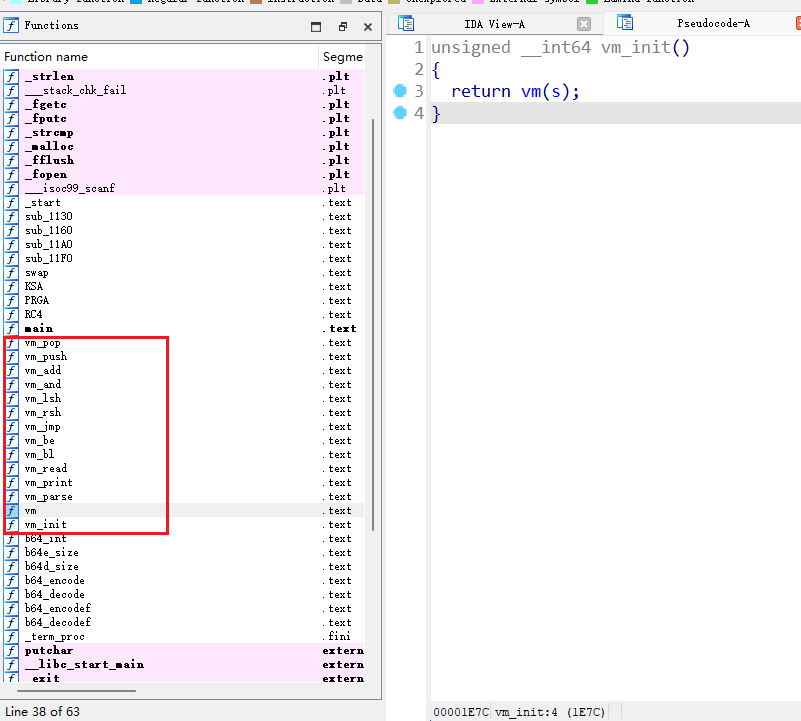

# 华为杯第三届

印象挺深的，十一假期完的比赛，当时技术太菜了，制作出来一道题

## BlackJack

patch下绕过或者脚本计算都可以

~~~python
flag = ""
for i in "mhzj}oR":
    flag += chr(ord(i)^0x29)
flag += "Bl4c"+chr(ord("k")-32)+"_"+chr(ord("J")+32)+chr(ord("a")-32)+"c"+chr(ord("k")-32)
for i in "\tg%\t0\x03"+chr(56)+chr(56)+"\x0f":
    flag += chr(ord(i)^0x56)
print(flag+"}")
~~~

## Detou4

两个加密，第一个key check是两个4*4矩阵乘法，第二个flag check是sm4

~~~python
from z3 import sat, Solver, Int

s = Solver()
v13 = [0]*16
v13[0] = 29324
v13[1] = 23096
v13[2] = 30330
v13[3] = 27321
v13[4] = 27565
v13[5] = 21206
v13[6] = 28367
v13[7] = 26831
v13[8] = 21609
v13[9] = 16523
v13[10] = 22755
v13[11] = 19997
v13[12] = 31007
v13[13] = 24521
v13[14] = 30962
v13[15] = 31181
string = "X:YsG:D4NL>ecG{8"
v = list(map(ord, string))
a = [Int(f"a{i}") for i in range(16)]
for i in range(4):
    for j in range(4):
        sum = 0
        for k in range(4):
            sum += v[j+4*k]*a[4*i+k]
        s.add(sum == v13[4*i+j])
key = ""
if s.check() == sat:
    ans = s.model()
    for i in a:
        key += chr(ans[i].as_long())
print(key)

from Crypto.Util.number import long_to_bytes

S_BOX = [0xD6, 0x90, 0xE9, 0xFE, 0xCC, 0xE1, 0x3D, 0xB7, 0x16, 0xB6, 0x14, 0xC2, 0x28, 0xFB, 0x2C, 0x05,
         0x2B, 0x67, 0x9A, 0x76, 0x2A, 0xBE, 0x04, 0xC3, 0xAA, 0x44, 0x13, 0x26, 0x49, 0x86, 0x06, 0x99,
         0x9C, 0x42, 0x50, 0xF4, 0x91, 0xEF, 0x98, 0x7A, 0x33, 0x54, 0x0B, 0x43, 0xED, 0xCF, 0xAC, 0x62,
         0xE4, 0xB3, 0x1C, 0xA9, 0xC9, 0x08, 0xE8, 0x95, 0x80, 0xDF, 0x94, 0xFA, 0x75, 0x8F, 0x3F, 0xA6,
         0x47, 0x07, 0xA7, 0xFC, 0xF3, 0x73, 0x17, 0xBA, 0x83, 0x59, 0x3C, 0x19, 0xE6, 0x85, 0x4F, 0xA8,
         0x68, 0x6B, 0x81, 0xB2, 0x71, 0x64, 0xDA, 0x8B, 0xF8, 0xEB, 0x0F, 0x4B, 0x70, 0x56, 0x9D, 0x35,
         0x1E, 0x24, 0x0E, 0x5E, 0x63, 0x58, 0xD1, 0xA2, 0x25, 0x22, 0x7C, 0x3B, 0x01, 0x21, 0x78, 0x87,
         0xD4, 0x00, 0x46, 0x57, 0x9F, 0xD3, 0x27, 0x52, 0x4C, 0x36, 0x02, 0xE7, 0xA0, 0xC4, 0xC8, 0x9E,
         0xEA, 0xBF, 0x8A, 0xD2, 0x40, 0xC7, 0x38, 0xB5, 0xA3, 0xF7, 0xF2, 0xCE, 0xF9, 0x61, 0x15, 0xA1,
         0xE0, 0xAE, 0x5D, 0xA4, 0x9B, 0x34, 0x1A, 0x55, 0xAD, 0x93, 0x32, 0x30, 0xF5, 0x8C, 0xB1, 0xE3,
         0x1D, 0xF6, 0xE2, 0x2E, 0x82, 0x66, 0xCA, 0x60, 0xC0, 0x29, 0x23, 0xAB, 0x0D, 0x53, 0x4E, 0x6F,
         0xD5, 0xDB, 0x37, 0x45, 0xDE, 0xFD, 0x8E, 0x2F, 0x03, 0xFF, 0x6A, 0x72, 0x6D, 0x6C, 0x5B, 0x51,
         0x8D, 0x1B, 0xAF, 0x92, 0xBB, 0xDD, 0xBC, 0x7F, 0x11, 0xD9, 0x5C, 0x41, 0x1F, 0x10, 0x5A, 0xD8,
         0x0A, 0xC1, 0x31, 0x88, 0xA5, 0xCD, 0x7B, 0xBD, 0x2D, 0x74, 0xD0, 0x12, 0xB8, 0xE5, 0xB4, 0xB0,
         0x89, 0x69, 0x97, 0x4A, 0x0C, 0x96, 0x77, 0x7E, 0x65, 0xB9, 0xF1, 0x09, 0xC5, 0x6E, 0xC6, 0x84,
         0x18, 0xF0, 0x7D, 0xEC, 0x3A, 0xDC, 0x4D, 0x20, 0x79, 0xEE, 0x5F, 0x3E, 0xD7, 0xCB, 0x39, 0x48
         ]

FK = [0xa3b1bac6, 0x56aa3350, 0x677d9197, 0xb27022dc]
CK = [
    0x00070e15, 0x1c232a31, 0x383f464d, 0x545b6269,
    0x70777e85, 0x8c939aa1, 0xa8afb6bd, 0xc4cbd2d9,
    0xe0e7eef5, 0xfc030a11, 0x181f262d, 0x343b4249,
    0x50575e65, 0x6c737a81, 0x888f969d, 0xa4abb2b9,
    0xc0c7ced5, 0xdce3eaf1, 0xf8ff060d, 0x141b2229,
    0x30373e45, 0x4c535a61, 0x686f767d, 0x848b9299,
    0xa0a7aeb5, 0xbcc3cad1, 0xd8dfe6ed, 0xf4fb0209,
    0x10171e25, 0x2c333a41, 0x484f565d, 0x646b7279
]

def wd_to_byte(wd, bys):
    bys.extend([(wd >> i) & 0xff for i in range(24, -1, -8)])

def bys_to_wd(bys):
    ret = 0
    for i in range(4):
        bits = 24 - i * 8
        ret |= (bys[i] << bits)
    return ret

def s_box(wd):
    """
    进行非线性变换，查S盒
    :param wd: 输入一个32bits字
    :return: 返回一个32bits字   ->int
    """
    ret = []
    for i in range(0, 4):
        byte = (wd >> (24 - i * 8)) & 0xff
        row = byte >> 4
        col = byte & 0x0f
        index = (row * 16 + col)
        ret.append(S_BOX[index])
    return bys_to_wd(ret)

def rotate_left(wd, bit):
    """
    :param wd: 待移位的字
    :param bit: 循环左移位数
    :return:
    """
    return (wd << bit & 0xffffffff) | (wd >> (32 - bit))

def Linear_transformation(wd):
    """
    进行线性变换L
    :param wd: 32bits输入
    """
    return wd ^ rotate_left(wd, 2) ^ rotate_left(wd, 10) ^ rotate_left(wd, 18) ^ rotate_left(wd, 24)

def Tx(k1, k2, k3, ck):
    """
    密钥扩展算法的合成变换
    """
    xor = k1 ^ k2 ^ k3 ^ ck
    t = s_box(k1 ^ k2 ^ k3 ^ ck)
    return t ^ rotate_left(t, 13) ^ rotate_left(t, 23)

def T(x1, x2, x3, rk):
    """
    加密算法轮函数的合成变换
    """
    t = x1 ^ x2 ^ x3 ^ rk
    t = s_box(t)
    return t ^ rotate_left(t, 2) ^ rotate_left(t, 10) ^ rotate_left(t, 18) ^ rotate_left(t, 24)

def key_extend(main_key):
    MK = [(main_key >> (128 - (i + 1) * 32)) & 0xffffffff for i in range(4)]
    # 将128bits分为4个字
    keys = [FK[i] ^ MK[i] for i in range(4)]
    # 生成K0~K3
    RK = []
    for i in range(32):
        t = Tx(keys[i + 1], keys[i + 2], keys[i + 3], CK[i])
        k = keys[i] ^ t
        keys.append(k)
        RK.append(k)
    return RK

def R(x0, x1, x2, x3):
    # 使用位运算符将数值限制在32位范围内
    x0 &= 0xffffffff
    x1 &= 0xffffffff
    x2 &= 0xffffffff
    x3 &= 0xffffffff
    s = f"{x3:08x}{x2:08x}{x1:08x}{x0:08x}"
    return s

def encode(plaintext, rk):
    X = [plaintext >> (128 - (i + 1) * 32) & 0xffffffff for i in range(4)]
    for i in range(32):
        t = T(X[1], X[2], X[3], rk[i])
        c = (t ^ X[0])
        X = X[1:] + [c]
    ciphertext = R(X[0], X[1], X[2], X[3])
    # 进行反序处理
    return ciphertext

def decode(ciphertext, rk):
    ciphertext = int(ciphertext, 16)
    X = [ciphertext >> (128 - (i + 1) * 32) & 0xffffffff for i in range(4)]
    for i in range(32):
        t = T(X[1], X[2], X[3], rk[31 - i])
        c = (t ^ X[0])
        X = X[1:] + [c]
    m = R(X[0], X[1], X[2], X[3])
    return m

def output(s, name):
    out = ""
    for i in range(0, len(s), 2):
        out += s[i:i + 2] + " "
    print(f"{name}:", end="")
    print(out.strip())

main_key = int(key.encode().hex(), 16)
rk = key_extend(main_key)
ciphertext = "6CC8A003051F4B79670E333A9B2AE249"
m = int(decode(ciphertext, rk), 16)
print(long_to_bytes(m), end="")

ciphertext = "478B3F3F220C817B0BF08B7BF0BE376E"
m = int(decode(ciphertext, rk), 16)
print(long_to_bytes(m))
~~~

## downcity

主函数一眼假的

~~~c
int __fastcall main(int argc, const char **argv, const char **envp)
{
  int v3; // eax
  char *s1; // [rsp+8h] [rbp-8h]

  __isoc99_scanf(&unk_3008, &input, envp);
  RC4(rc4key, &input, &encrypted);
  v3 = b64e_size(20LL);
  s1 = (char *)malloc((unsigned int)(v3 + 1));
  s1[(unsigned int)b64e_size(20LL)] = 0;
  b64_encode(&encrypted, 20LL, s1);
  if ( !strcmp(s1, cmpred) )
    puts("You Found it!??");
  else
    puts("Try Again!??");
  return 0;
}
~~~

真正的逻辑直接看符号表就知道是个vm

模拟下栈操作即可，vm_bl没用到，可以单字符爆破

~~~python
stack = []

def vm_parse(a1):
    a2 = a1 & 0xff
    if a2 in [6, 1, 5]:
        return a2, a1>>8
    else:
        return a2, 0
def vm_push(a2):
    stack.append(a2)

def vm_pop():
    stack.pop()

def vm_add():
    vm_push(stack.pop() + stack.pop())

def vm_and():
    vm_push(stack.pop() | stack.pop())

def vm_lsh(a2):
    vm_push(stack.pop() << a2)

def vm_rsh(a2):
    vm_push(stack.pop() >> a2)

def vm_read(c):
    vm_push(ord(c))

def vm_print():
    print(chr(stack.pop()))

def vm_jmp(a1):
    global ip
    ip = a1[stack.pop()]

def vm_be():
    if stack[-2] == stack[-3]:
        return stack[-1]
    else:
        return -1

def vm_bl(a1):
    global ip
    a1[501] -= 1
    v2 = a1[a1[501] - 1 + 502]
    a1[501] -= 1
    v3 = a1[a1[501] - 2 + 502]
    a1[501] -= 1
    if v3 >= a1[a1[501] - 3 + 502]:
        ip += 1
    else:
        ip = v2

def vm(s):
    what = False
    k = 0
    ip = 0
    a1 = [0x00000000, 0x00000007, 0x00000101, 0x00000003, 0x00004501, 0x00000801, 0x0000000A, 0x00017001, 0x00000009, 0x00000002, 0x00000002, 0x00000002, 0x00000007, 0x00000201, 0x00000003, 0x00004301, 0x00001301, 0x0000000A, 0x00017001, 0x00000009, 0x00000002, 0x00000002, 0x00000002, 0x00000007, 0x00000301, 0x00000003, 0x00005601, 0x00001E01, 0x0000000A, 0x00017001, 0x00000009, 0x00000002, 0x00000002, 0x00000002, 0x00000007, 0x00000101, 0x00000003, 0x00004401, 0x00002901, 0x0000000A, 0x00017001, 0x00000009, 0x00000002, 0x00000002, 0x00000002, 0x00000007, 0x00000201, 0x00000003, 0x00005601, 0x00003401, 0x0000000A, 0x00017001, 0x00000009, 0x00000002, 0x00000002, 0x00000002, 0x00000007, 0x00000301, 0x00000003, 0x00004901, 0x00003F01, 0x0000000A, 0x00017001, 0x00000009, 0x00000002, 0x00000002, 0x00000002, 0x00000007, 0x00000805, 0x00000101, 0x00000004, 0x007B0101, 0x00004B01, 0x0000000A, 0x00017001, 0x00000009, 0x00000002, 0x00000002, 0x00000002, 0x00000007, 0x00000805, 0x00000201, 0x00000004, 0x00680201, 0x00005701, 0x0000000A, 0x00017001, 0x00000009, 0x00000002, 0x00000002, 0x00000002, 0x00000007, 0x00000805, 0x00000301, 0x00000004, 0x00310301, 0x00006301, 0x0000000A, 0x00017001, 0x00000009, 0x00000002, 0x00000002, 0x00000002, 0x00000007, 0x00000805, 0x00000101, 0x00000004, 0x00440101, 0x00006F01, 0x0000000A, 0x00017001, 0x00000009, 0x00000002, 0x00000002, 0x00000002, 0x00000007, 0x00000805, 0x00000101, 0x00000004, 0x00650101, 0x00007B01, 0x0000000A, 0x00017001, 0x00000009, 0x00000002, 0x00000002, 0x00000002, 0x00000007, 0x00000805, 0x00000201, 0x00000004, 0x006E0201, 0x00008701, 0x0000000A, 0x00017001, 0x00000009, 0x00000002, 0x00000002, 0x00000002, 0x00000007, 0x00000805, 0x00000301, 0x00000004, 0x005F0301, 0x00009301, 0x0000000A, 0x00017001, 0x00000009, 0x00000002, 0x00000002, 0x00000002, 0x00000007, 0x00000101, 0x00000003, 0x00005701, 0x00009E01, 0x0000000A, 0x00017001, 0x00000009, 0x00000002, 0x00000002, 0x00000002, 0x00000007, 0x00000201, 0x00000003, 0x00006F01, 0x0000A901, 0x0000000A, 0x00017001, 0x00000009, 0x00000002, 0x00000002, 0x00000002, 0x00000007, 0x00000301, 0x00000003, 0x00006201, 0x0000B401, 0x0000000A, 0x00017001, 0x00000009, 0x00000002, 0x00000002, 0x00000002, 0x00000007, 0x00000101, 0x00000003, 0x00004A01, 0x0000BF01, 0x0000000A, 0x00017001, 0x00000009, 0x00000002, 0x00000002, 0x00000002, 0x00000007, 0x00000201, 0x00000003, 0x00003501, 0x0000CA01, 0x0000000A, 0x00017001, 0x00000009, 0x00000002, 0x00000002, 0x00000002, 0x00000007, 0x00000301, 0x00000003, 0x00006201, 0x0000D501, 0x0000000A, 0x00017001, 0x00000009, 0x00000002, 0x00000002, 0x00000002, 0x00000007, 0x00000201, 0x00000003, 0x00005501, 0x0000E001, 0x0000000A, 0x00017001, 0x00000009, 0x00000002, 0x00000002, 0x00000002, 0x00000007, 0x00000105, 0x0000DE01, 0x0000EA01, 0x0000000A, 0x00017001, 0x00000009, 0x00000002, 0x00000002, 0x00000002, 0x00000007, 0x00000205, 0x0001BC01, 0x0000F401, 0x0000000A, 0x00017001, 0x00000009, 0x00000002, 0x00000002, 0x00000002, 0x00000007, 0x00000305, 0x00018001, 0x0000FE01, 0x0000000A, 0x00017001, 0x00000009, 0x00000002, 0x00000002, 0x00000002, 0x00000007, 0x00000805, 0x00000101, 0x00000004, 0x005F0101, 0x00010A01, 0x0000000A, 0x00017001, 0x00000009, 0x00000002, 0x00000002, 0x00000002, 0x00000007, 0x00000805, 0x00000201, 0x00000004, 0x00460201, 0x00011601, 0x0000000A, 0x00017001, 0x00000009, 0x00000002, 0x00000002, 0x00000002, 0x00000007, 0x00000805, 0x00000301, 0x00000004, 0x00750301, 0x00012201, 0x0000000A, 0x00017001, 0x00000009, 0x00000002, 0x00000002, 0x00000002, 0x00000007, 0x00000105, 0x0000DC01, 0x00012C01, 0x0000000A, 0x00017001, 0x00000009, 0x00000002, 0x00000002, 0x00000002, 0x00000007, 0x00000205, 0x00017C01, 0x00013601, 0x0000000A, 0x00017001, 0x00000009, 0x00000002, 0x00000002, 0x00000002, 0x00000007, 0x00000305, 0x00010801, 0x00014001, 0x0000000A, 0x00017001, 0x00000009, 0x00000002, 0x00000002, 0x00000002, 0x00000007, 0x00000305, 0x0003E801, 0x00014A01, 0x0000000A, 0x00017001, 0x00000009, 0x00000002, 0x00000002, 0x00000002, 0x00004301, 0x00000008, 0x00006F01, 0x00000008, 0x00006E01, 0x00000008, 0x00006701, 0x00000008, 0x00007201, 0x00000008, 0x00006101, 0x00000008, 0x00007401, 0x00000008, 0x00007501, 0x00000008, 0x00006C01, 0x00000008, 0x00006101, 0x00000008, 0x00007401, 0x00000008, 0x00006901, 0x00000008, 0x00006F01, 0x00000008, 0x00006E01, 0x00000008, 0x00007301, 0x00000008, 0x00002101, 0x00000008, 0x00000A01, 0x00000008, 0x0000000C, 0x00005401, 0x00000008, 0x00007201, 0x00000008, 0x00007901, 0x00000008, 0x00002C01, 0x00000008, 0x00004101, 0x00000008, 0x00006701, 0x00000008, 0x00006101, 0x00000008, 0x00006901, 0x00000008, 0x00006E01, 0x00000008, 0x00002101, 0x00000008, 0x00000A01, 0x00000008, 0x0000000C, 0x00000000, 0x00000000, 0x00000000, 0x00000000, 0x00000000, 0x00000000, 0x00000000, 0x00000000, 0x00000000, 0x00000000, 0x00000000, 0x00000000, 0x00000000, 0x00000000, 0x00000000, 0x00000000, 0x00000000, 0x00000000, 0x00000000, 0x00000000, 0x00000000, 0x00000000, 0x00000000, 0x00000000, 0x00000000, 0x00000000, 0x00000000, 0x00000000, 0x00000000, 0x00000000, 0x00000000, 0x00000000, 0x00000000, 0x00000000, 0x00000000, 0x00000000, 0x00000000, 0x00000000, 0x00000000, 0x00000000, 0x00000000, 0x00000000, 0x00000000, 0x00000000, 0x00000000, 0x00000000, 0x00000000, 0x00000000, 0x00000000, 0x00000000, 0x00000000, 0x00000000, 0x00000000, 0x00000000, 0x00000000, 0x00000000, 0x00000000, 0x00000000, 0x00000000, 0x00000000, 0x00000000, 0x00000000, 0x00000000, 0x00000000, 0x00000000, 0x00000000, 0x00000000, 0x00000000, 0x00000000, 0x00000000, 0x00000000, 0x00000000, 0x00000000, 0x00000000, 0x00000000, 0x00000000, 0x00000000, 0x00000000, 0x00000000, 0x00000000, 0x00000000, 0x00000000, 0x00000000, 0x00000000, 0x00000000, 0x00000000, 0x00000000, 0x00000000, 0x00000000, 0x00000000, 0x00000000, 0x00000000, 0x00000000, 0x00000000, 0x00000000, 0x00000000, 0x00000000, 0x00000000, 0x00000000, 0x00000000, 0x00000000, 0x00000000, 0x00000000, 0x00000000, 0x00000000, 0x00000000, 0x00000000, 0x00000000, 0x00000000, 0x00000000, 0x00000000, 0x00000000, 0x00000000, 0x00000000, 0x00000000, 0x00000000, 0x00000000, 0x00000000, 0x00000000, 0x00000000, 0x00000000, 0x00000000, 0x00000000, 0x00000000, 0x00000000, 0x00000000, 0x00000000, 0x00000000, 0x00000000, 0x00000000, 0x00000000, 0x00000000, 0x00000000, 0x00000000, 0x00000000, 0x00000000, 0x00000000, 0x00000000, 0x00000000, 0x00000000, 0x00000000, 0x00000000, 0x00000000, 0x00000000, 0x00000000, 0x00000000, 0x00000000, 0x00000000, 0x00000000, 0x00000000, 0x00000000, 0x00000000, 0x00000000, 0x00000000, 0x00000000, 0x00000000, 0x00000000, 0x00000000, 0x00000000, 0x00000000, 0x00000000, 0x00000000, 0x00000000, 0x00000000, 0x00000000, 0x00000000, 0x00000000, 0x00000000, 0x00000000, 0x00000000, 0x00000000, 0x00000000, 0x00000000, 0x00000000, 0x00000000, 0x00000000, 0x00000000, 0x00000000, 0x00000000, 0x00000000, 0x00000000, 0x00000000, 0x00000000, 0x00000000, 0x00000000, 0x00000000, 0x00000000, 0x00000000, 0x00000000, 0x00000000, 0x00000000, 0x00000000, 0x00000000, 0x00000000, 0x00000000, 0x00000000, 0x00000000, 0x00000000, 0x00000000, 0x00000000, 0x00000000, 0x00000000, 0x00000000, 0x00000000, 0x00000000, 0x00000000, 0x00000000, 0x00000000, 0x00000000, 0x00000000, 0x00000000, 0x00000000, 0x00000000, 0x00000000, 0x00000000, 0x00000000]
    global stack
    stack = []
    while True:
        v2, v3 = vm_parse(a1[ip + 1])
        if v2 == 1:
            vm_push(v3)
            ip += 1
        elif v2 == 2:
            vm_pop()
            ip += 1
        elif v2 == 3:
            vm_add()
            ip += 1
        elif v2 == 4:
            vm_and()
            ip += 1
        elif v2 == 5:
            vm_lsh(v3)
            ip += 1
        elif v2 == 6:
            vm_rsh(v3)
            ip += 1
        elif v2 == 7:
            if k == len(s):
                what = True
                break
            vm_read(s[k])
            k += 1
            ip += 1
        elif v2 == 8:
            vm_print()
            ip += 1
        elif v2 == 9:
            vm_jmp(a1)
        elif v2 == 10:
            add = vm_be()
            if add != -1:
                ip = add
            else:
                break
        elif v2 == 11:
            vm_bl(a1)
        elif v2 == 12:
            print(s)
            exit(0)
    return what

from string import printable

chars = list(printable)
s = ""
while True:
    for i in chars:
        s += i
        if vm(s):
            break
        else:
            s = s[:-1]
    if i == chars[-1]:
        break
# DASCTF{h1Den_Vm_I3_Soo0_Fun_!}
~~~

## ezhtml

这种题要么浏览器里动态调试分析，但是有点复杂，这道题本地调试不了，一直报同源错误；看其他wp说是jeb可以反编译试了2、3、4版的都不行，不知道为啥

最后还是用wasm2c转换出来c文件，然后再gcc编译得到可执行文件，去ida里反编译逻辑更清晰些

直接找main

~~~c
__int64 __fastcall w2c_ez_main_0(__int64 a1)
{
  return (unsigned int)w2c_ez_f7(a1);
}
__int64 __fastcall w2c_ez_f7(__int64 a1)
{
  int v1; // eax
  __int64 result; // rax
  unsigned int v3; // [rsp+18h] [rbp-168h]
  unsigned int v4; // [rsp+1Ch] [rbp-164h]
  char v5; // [rsp+7Ch] [rbp-104h]
  unsigned int v6; // [rsp+80h] [rbp-100h]
  unsigned int v7; // [rsp+94h] [rbp-ECh]
  char v8; // [rsp+C0h] [rbp-C0h]
  char v9; // [rsp+F4h] [rbp-8Ch]
  unsigned int v10; // [rsp+F8h] [rbp-88h]
  unsigned int v11; // [rsp+174h] [rbp-Ch]

  v11 = *(_DWORD *)(a1 + 16) - 64;
  *(_DWORD *)(a1 + 16) = v11;
  i32_store(a1 + 32, v11 + 60LL, 0LL);
  w2c_ez_f21(a1, 65554LL);
  i32_store(a1 + 32, v11, v11 + 16);
  w2c_ez_f22(a1, (unsigned int)&loc_10009, v11);
  if ( (unsigned int)w2c_ez_f26(a1, v11 + 16) == 35 )
  {
    i32_store(a1 + 32, v11 + 12LL, 0LL);
    while ( (int)i32_load(a1 + 32, v11 + 12LL) < 35 )
    {
      v10 = i32_load(a1 + 32, v11 + 12LL) + v11 + 16;
      v9 = i32_load8_u(a1 + 32, v10);
      v1 = (int)(i32_load(a1 + 32, v11 + 12LL) + 1) % 35;
      v8 = i32_load8_u(a1 + 32, v1 + v11 + 16);
      v7 = i32_load(a1 + 32, v11 + 12LL) + v11 + 16;
      i32_store8(a1 + 32, v7, v8 & 0xF ^ (unsigned int)v9);
      v6 = i32_load(a1 + 32, v11 + 12LL) + v11 + 16;
      v5 = i32_load8_u(a1 + 32, v6);
      v4 = i32_load(a1 + 32, v11 + 12LL);
      if ( v5 != (char)i32_load8_u(a1 + 32, v4 + 66160LL) )
        goto LABEL_2;
      v3 = i32_load(a1 + 32, v11 + 12LL) + 1;
      i32_store(a1 + 32, v11 + 12LL, v3);
    }
    w2c_ez_f21(a1, 65578LL);
    i32_store(a1 + 32, v11 + 60LL, 0LL);
  }
  else
  {
LABEL_2:
    w2c_ez_f21(a1, 65571LL);
    i32_store(a1 + 32, v11 + 60LL, 0LL);
  }
  LODWORD(result) = i32_load(a1 + 32, v11 + 60LL);
  *(_DWORD *)(a1 + 16) = v11 + 64;
  return (unsigned int)result;
}
~~~

* 发现主函数逻辑分界点在一个35的判断，结合wasm里最后data部分35长度的可见字符串猜测是输入长度检查
* i32_load(a1 + 32, v11 + 12LL)很明显是下标
* v1 = (int)(i32_load(a1 + 32, v11 + 12LL) + 1) % 35这里模35说明有循环遍历操作
* 唯一可能有操作的是v8 & 0xF ^ (unsigned int)v9，可以确定是input[i]^(input[(i+1)%35]&0xf)

~~~python
s = b"EBPGRM|VE9B]Q5Sb4vJ^2|ZoU[t?SiDf9Cx"
flag = "}"
for i in range(len(s)-2, -1, -1):
    flag += chr(s[i]^(ord(flag[-1])&0xf))
print(flag[::-1])
~~~

