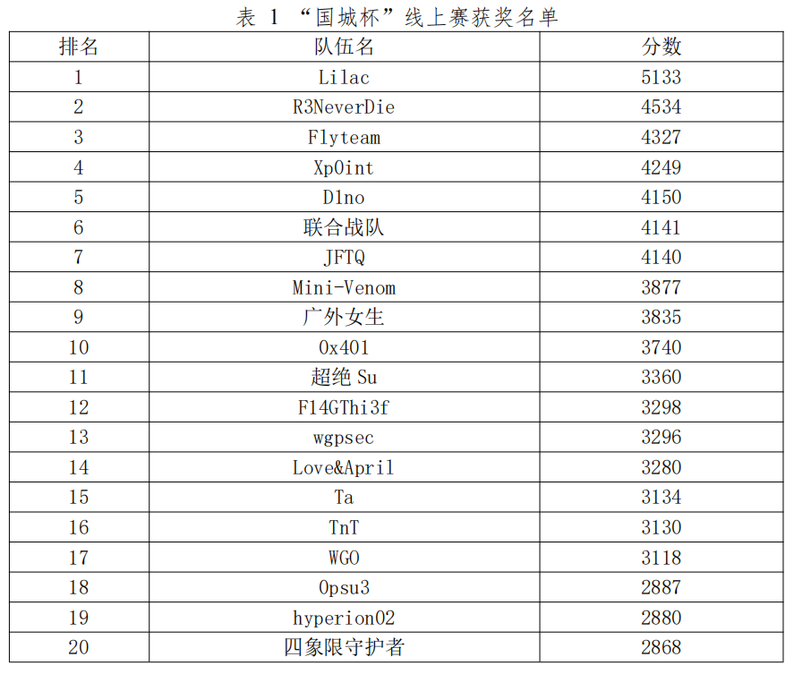
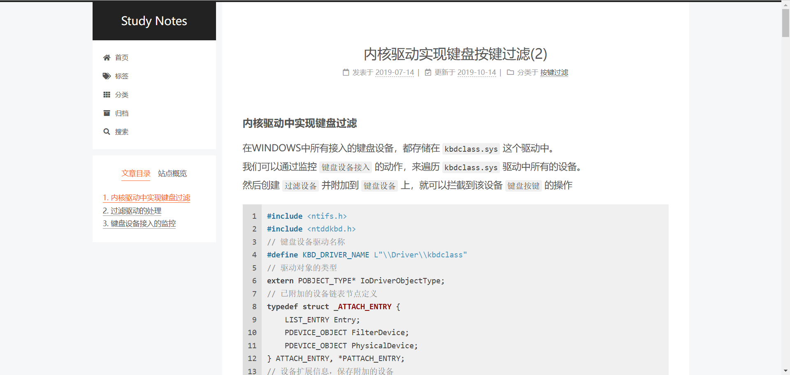
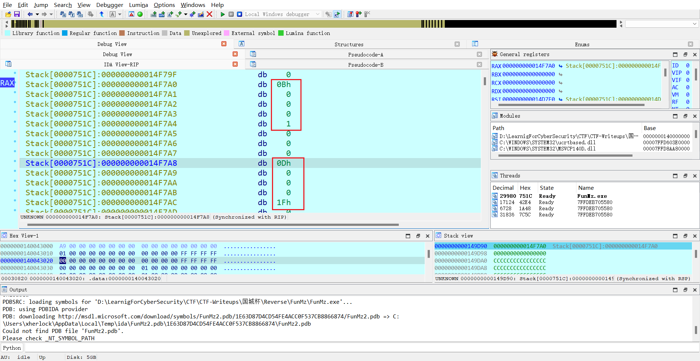
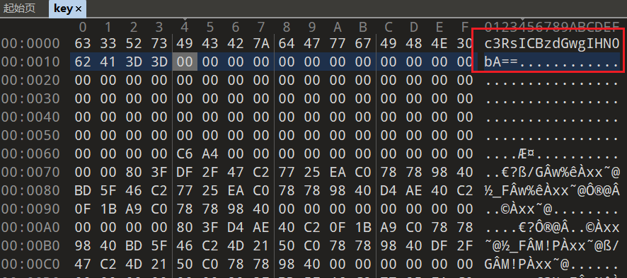

# 国城杯2024

最终排名15，十分可惜了，我就差一道题目，misc那道固件题几乎就做出来了，出了就可以进线下了。被队伍里的pwn/密码佬带飞，re 4道只出了2道，题目质量还可以，但是有些题出题人又玩抽象:angry:



## Reverse

### Crush's_secret

- [x] 就是考察算法识别

xxtea加密

```Python
import struct
from ctypes import c_uint32
"""
参数描述:
  DELTA: 神秘常数δ，它来源于黄金比率，以保证每一轮加密都不相同。但δ的精确值似乎并不重要，这里 TEA 把它定义为 δ=「(√5 - 1)231」
      v: 需要加解密的数据，格式为32位的无符号整数组成的数组
      n: n表示需要加密的32位无符号整数的个数（例：n为1时，只有v数组中的第一个元素被加密了），n不能大于v的长度
      k: 密钥，格式为4个32位无符号整数组成的数组，即密钥长度为128位
"""

def xxtea_encrypt(n, v, key):
    # 全部转为c_unit32格式
    v = [c_uint32(i) for i in v]
    r = 6 + 52 // n
    v1 = v[n-1].value
    delta = 0x9e3779b9
    total = c_uint32(0)
    for i in range(r):
        total.value += delta
        e = (total.value >> 2) & 3
        for j in range(n-1):
            v0 = v[j+1].value
            v[j].value += ((((v1 >> 5) ^ (v0 << 2)) + ((v0 >> 3) ^ (v1 << 4))) ^ ((total.value ^ v0) + (key[(j & 3) ^ e] ^ v1)))
            v1 = v[j].value
        v0 = v[0].value
        v[n-1].value += ((((v1 >> 5) ^ (v0 << 2)) + ((v0 >> 3) ^ (v1 << 4))) ^ ((total.value ^ v0) + (key[((n-1) & 3) ^ e] ^ v1)))
        v1 = v[n-1].value
    return [i.value for i in v]


def xxtea_decrypt(n, v, key):
    # 全部转为c_unit32格式
    v = [c_uint32(i) for i in v]
    r = 6 + 52 // n
    v0 = v[0].value
    delta = 0x9e3779b9
    total = c_uint32(delta * r)
    for i in range(r):
        e = (total.value >> 2) & 3
        for j in range(n-1, 0, -1):
            v1 = v[j-1].value
            v[j].value -= ((((v1 >> 5) ^ (v0 << 2)) + ((v0 >> 3) ^ (v1 << 4))) ^ ((total.value ^ v0) + (key[(j & 3) ^ e] ^ v1)))
            v0 = v[j].value
        v1 = v[n-1].value
        v[0].value -= ((((v1 >> 5) ^ (v0 << 2)) + ((v0 >> 3) ^ (v1 << 4))) ^ ((total.value ^ v0) + (key[(0 & 3) ^ e] ^ v1)))
        v0 = v[0].value
        total.value -= delta
    return [i.value for i in v]


k = [0x5201314, 0x52013140, 0x5201314, 0x52013140]
v = [0x5A764F8A, 0x5B0DF77, 0xF101DF69, 0xF9C14EF4, 0x27F03590, 0x7DF3324F, 0x2E322D74, 0x8F2A09BC, 0xABE2A0D7, 0xC2A09FE, 0x35892BB2, 0x53ABBA12]

# 解密
for i in range(0, len(v), 2):
    v[i:i+2] = xxtea_decrypt(2, v[i:i+2], k)

# 输出解密后的数据
str_list = []
for i in range(len(v)):
    str_list.append(struct.pack('>I', v[i]).decode()[::-1])
print('decrypted: %s' % ''.join(str_list))    # The_wind_stops_at_autumn_water_and_I_stop_at_you
```

### round

- [x] 有点意思，看群里交流就知道很多人卡在爆破了，不能直接爆破，有多种可能，因此要用深度遍历找到正确答案

apk里面的base64魔改了顺序，每四位交换中间两个即可base64解密得到用户名round_and

```Java
public int[] Makebox(String arg6) {
    int[] v1 = new int[0x400];
    int v2 = 0;
    int v3;
    for(v3 = 0; v3 < 0x400; ++v3) {
        v1[0x3FF - v3] = v3;
    }

    while(v2 < 0x400) {
        v1[v2] ^= arg6.charAt(v2 % arg6.length());
        ++v2;
    }

    return v1;
}

public int[] encode(Context arg1, String arg2) {
    return this.Makebox(this.encodeToBase64(arg2));
}
```

然后是创建了box数组，并和用户名异或

接着是Round操作，可以看到输入的12字节密码加密后和v3数组进行比较，因此可以爆破

```Java
package com.example.demo;

public class Round {
    public static class Result {
        private int num;
        private int rip;

        public Result(int arg1, int arg2) {
            this.num = arg1;
            this.rip = arg2;
        }

        public int getNum() {
            return this.num;
        }

        public int getRip() {
            return this.rip;
        }
    }

    public Result add(int[] arg1, int arg2, int arg3) {
        int v2 = ((arg2 + arg1[arg3]) % 0x400 + 0x400) % 0x400;
        return new Result(v2, (arg3 + v2) % 0x400);
    }

    public boolean round(int[] arg13, String arg14) {
        Result v10_1;
        int v0 = arg14.length();
        int[] v1 = new int[v0];
        int[] v3 = {0x160, 646, 0x2F0, 882, 65, 0, 0x7A, 0, 0, 7, 350, 360};
        int v4 = 33;
        int v6;
        for(v6 = 0; v6 < arg14.length(); ++v6) {
            int v7 = arg14.charAt(v6);
            int v9;
            for(v9 = 0; v9 < 0x20; ++v9) {
                int v10 = ((arg13[v4] ^ v7) % 5 + 5) % 5;
                if(v10 == 0) {
                    v10_1 = this.add(arg13, v7, v4);
                }
                else if(v10 == 1) {
                    v10_1 = this.sub(arg13, v7, v4);
                }
                else if(v10 == 2) {
                    v10_1 = this.xor(arg13, v7, v4);
                }
                else if(v10 == 3) {
                    v10_1 = this.shl(v7, v4);
                }
                else if(v10 == 4) {
                    v10_1 = this.shr(v7, v4);
                }
                else {
                    v10_1 = new Result(v7, v4);
                }

                v7 = v10_1.getNum();
                v4 = v10_1.getRip();
            }

            v1[v6] = v7;
        }

        if(v0 != 12) {
            return false;
        }

        int v13;
        for(v13 = 0; v13 < v0; ++v13) {
            if(v1[v13] != v3[v13]) {
                return false;
            }
        }

        return true;
    }

    public Result shl(int arg2, int arg3) {
        int v2 = (arg2 >> 3) % 0x400;
        return new Result(v2, (arg3 + v2) % 0x400);
    }

    public Result shr(int arg2, int arg3) {
        int v2 = (arg2 << 3) % 0x400;
        return new Result(v2, (arg3 + v2) % 0x400);
    }

    public Result sub(int[] arg1, int arg2, int arg3) {
        int v2 = ((arg2 - arg1[arg3]) % 0x400 + 0x400) % 0x400;
        return new Result(v2, (arg3 + v2) % 0x400);
    }

    public Result xor(int[] arg1, int arg2, int arg3) {
        int v1 = (arg1[arg3] ^ arg2) % 0x400;
        return new Result(v1, (arg3 + v1) % 0x400);
    }
}
```

需要注意每一轮v4值发生变化，同时不止一种解。因此使用递归实现深度遍历，找到最终12字节数组

```Java
key = b"c9m1bRmfY5Wk"
box = list(range(0x400))[::-1]
for i in range(0x400):
    box[i] ^= key[i%len(key)]

def add(box, c, v):
    v2 = ((c + box[v]) % 0x400 + 0x400) % 0x400
    return v2, (v + v2) % 0x400

def sub(box, c, v):
    v2 = ((c - box[v]) % 0x400 + 0x400) % 0x400
    return v2, (v + v2) % 0x400

def xor(box, c, v):
    v2 = ((c ^ box[v]) % 0x400 + 0x400) % 0x400
    return v2, (v + v2) % 0x400

def shl(c, v):
    v2 = (c >> 3) % 0x400
    return v2, (v + v2) % 0x400

def shr(c, v):
    v2 = (c << 3) % 0x400
    return v2, (v + v2) % 0x400


cmp = [0x160, 646, 0x2F0, 882, 65, 0, 0x7A, 0, 0, 7, 350, 360]
def recursive(v4, v):
    tmp = v4
    if len(v) == 12:
        print("".join(map(chr, v)))
        return
    for i in range(32, 127):
        c = i
        for j in range(32):
            v10 = ((box[v4]^c)%5+5)%5
            if v10 == 0:
                c, v4 = add(box, c, v4)
            elif v10 == 1:
                c, v4 = sub(box, c, v4)
            elif v10 == 2:
                c, v4 = xor(box, c, v4)
            elif v10 == 3:
                c, v4 = shl(c, v4)
            elif v10 == 4:
                c, v4 = shr(c, v4)
        if c == cmp[len(v)]:
            recursive(v4, v+[i])
        else:
            v4 = tmp

recursive(33, [])
```

~~~
_roun2t$e_%o
_roun2t$e_`o
_roun2t$e_go
_roun7t$e_%o
_roun7t$e_`o
_roun7t$e_go
_roun<'-n4TO
_roun<';<4TO
_roun<'po_%o
_roun<'po_`o
_roun<'po_go
_rounD_/o_%o
_rounD_/o_`o
_rounD_/o_go
_rounD_3o_%o
_rounD_3o_`o
_rounD_3o_go
_rounD_7<4TO
_rounD_PCi?O
_rounD_\Ci?O
_rounD_we_%o
_rounD_we_`o
_rounD_we_go        # 这个是正确的密码
_roun|Ff-i?O
~~~

得到整个flag为D0g3xGC{round_and_rounD_we_go}

### easy_key

- [ ] 第一次见到驱动逆向，给了个sys文件

题目是真简单，提示说用虚拟机是因为里面的逻辑是检查和删除本地环境的固件，实际上做题不需要

~~~c
__int64 __fastcall sub_180001A30(__int64 a1, __int64 a2, __int64 a3)
{
  int v3; // edx
  __int64 v4; // rdx
  char v6; // al
  unsigned int v7; // [rsp+2Ch] [rbp-15Ch]
  __int64 v8; // [rsp+30h] [rbp-158h]
  int v10[2]; // [rsp+40h] [rbp-148h] BYREF
  int v11; // [rsp+48h] [rbp-140h]
  int v12; // [rsp+4Ch] [rbp-13Ch]
  char v13[24]; // [rsp+50h] [rbp-138h] BYREF
  char v14[28]; // [rsp+68h] [rbp-120h] BYREF
  __int16 v15[50]; // [rsp+84h] [rbp-104h] BYREF
  __int64 v16[6]; // [rsp+E8h] [rbp-A0h] BYREF
  char v17[8]; // [rsp+118h] [rbp-70h] BYREF
  __int64 v18[6]; // [rsp+120h] [rbp-68h] BYREF
  char v19[8]; // [rsp+150h] [rbp-38h] BYREF
  __int64 v20; // [rsp+158h] [rbp-30h]
  __int64 v21; // [rsp+160h] [rbp-28h]
  __int64 v22; // [rsp+168h] [rbp-20h]
  __int64 v23; // [rsp+170h] [rbp-18h]
  __int64 v24; // [rsp+178h] [rbp-10h]
  unsigned int v25; // [rsp+180h] [rbp-8h]
  int v26; // [rsp+184h] [rbp-4h]

  v20 = a1;
  v21 = a2;
  v22 = a3;
  v23 = sub_180001730();
  if ( (a2 & 0xF) != 0 )
    sub_18000C5D0(16i64, a2, &off_18000D2D8);
  if ( (sub_180009560(*(unsigned int *)(a2 + 48)) & 1) != 0 )
  {
    if ( (a2 & 0xF) != 0 )
      sub_18000C5D0(16i64, a2, &off_18000D2F0);
    v8 = *(_QWORD *)(a2 + 24);
    v24 = v8;
    v7 = *(_QWORD *)(a2 + 56) >> 3;
    v25 = v7;
    if ( (v8 & 1) != 0 )
      sub_18000C5D0(2i64, v8, &off_18000D320);
    if ( *(_WORD *)(v8 + 4) )
    {
      v10[0] = sub_180003EF0(0i64, v7);
      v10[1] = v3;
      while ( 1 )
      {
        v11 = sub_180003ED0(v10);
        v12 = v4;
        if ( !v11 )
          break;
        v26 = v12;
        if ( (v8 & 1) != 0 )
          sub_18000C5D0(2i64, v8, &off_18000D368);
        if ( *(_WORD *)(v8 + 2) == 28 )
        {
          if ( (v8 & 1) != 0 )
            sub_18000C5D0(2i64, v8, &off_18000D380);
          if ( *(_WORD *)(v8 + 2) == 14 )
          {
            sub_180004C90(&unk_180010000);
          }
          else
          {
            sub_180004FB0(v13, &unk_180010000);
            v15[0] = 32;
            v15[1] = 42;
            v15[2] = 11;
            v15[3] = 34;
            v15[4] = 4;
            v15[5] = 45;
            v15[6] = 34;
            v15[7] = 42;
            v15[8] = 46;
            v15[9] = 42;
            v15[10] = 26;
            v15[11] = 42;
            v15[12] = 30;
            v15[13] = 7;
            v15[14] = 7;
            v15[15] = 48;
            v15[16] = 3;
            v15[17] = 4;
            v15[18] = 5;
            v15[19] = 3;
            v15[20] = 12;
            v15[21] = 11;
            v15[22] = 5;
            v15[23] = 32;
            v15[24] = 5;
            v15[25] = 12;
            v15[26] = 5;
            v15[27] = 7;
            v15[28] = 9;
            v15[29] = 30;
            v15[30] = 12;
            v15[31] = 10;
            v15[32] = 10;
            v15[33] = 32;
            v15[34] = 4;
            v15[35] = 12;
            v15[36] = 8;
            v15[37] = 18;
            v15[38] = 32;
            v15[39] = 48;
            v15[40] = 30;
            v15[41] = 5;
            v15[42] = 46;
            v15[43] = 10;
            v15[44] = 11;
            v15[45] = 11;
            v15[46] = 2;
            v15[47] = 33;
            v15[48] = 27;
            v15[49] = 42;
            sub_180005100(v14, v15);
            v6 = sub_180004A80(v13, v14);
            if ( (v6 & 1) != 0 )
            {
              sub_180006E40((__int64)v14);
              sub_180003F90(v16, (__int64)&off_18000D3E0, (__int64)v17);// nice input, see your tapped keys\n
              sub_180009420((__int64)v16);
            }
            else
            {
              sub_180006E40((__int64)v14);
              sub_180003F90(v18, (__int64)&off_18000D3A8, (__int64)v19);// try other input\n
              sub_180009420((__int64)v18);
            }
            sub_180004E50(&unk_180010000);
            sub_180006E40((__int64)v13);
          }
        }
        else
        {
          if ( (v8 & 1) != 0 )
            sub_18000C5D0(2i64, v8, &off_18000D3F0);
          LOWORD(v4) = *(_WORD *)(v8 + 2);
          sub_180004D90(&unk_180010000, v4);
        }
      }
    }
  }
  if ( (a2 & 0xF) != 0 )
    sub_18000C5D0(16i64, a2, &off_18000D338);
  if ( *(_BYTE *)(a2 + 65) )
    sub_180001F80(a2);
  if ( (a2 & 0xF) != 0 )
    sub_18000C5D0(16i64, a2, &off_18000D350);
  return *(unsigned int *)(a2 + 48);
}
~~~

定位关键字符串，发现前面有串数组很像flag。再去搜索发现了`'\Driver\Kbdclass'`的字眼



搜一下基本确定是键盘输入flag，搜下[虚拟键值](https://learn.microsoft.com/zh-cn/windows/win32/inputdev/about-keyboard-input)


```python
c = [32, 42, 11, 34, 4, 45, 34, 42, 46, 42, 26, 42, 30, 7, 7, 48, 3, 4, 5, 3, 12, 11, 5, 32, 5, 12, 5, 7, 9, 30, 12, 10, 10, 32, 4, 12, 8, 18, 32, 48, 30, 5, 46, 10, 11, 11, 2, 33, 27, 42]
key_dict = {0x1E: "A", 0x30: "B", 0x2E: "C", 0x20: "D", 0x12: "E", 0x21: "F", 0x22: "G", 0x23: "H", 0x17: "I", 0x24: "J", 0x25: "K", 0x26: "L", 0x32: "M", 0x31: "N", 0x18: "O", 0x19: "P", 0x10: "Q", 0x13: "R", 0x1F: "S", 0x14: "T", 0x16: "U", 0x2F: "V", 0x11: "W", 0x2D: "X", 0x15: "Y", 0x2C: "Z", 0x02: "1", 0x03: "2", 0x04: "3", 0x05: "4", 0x06: "5", 0x07: "6", 0x08: "7", 0x09: "8", 0x0A: "9", 0x0B: "0", 0x2a: "[shift]", 0xc: "-", 0x1a: "{", 0x1b: "}"}
flag = ""
for i in range(len(c)):
    if c[i] not in key_dict.keys():
        print(c[i])
        continue
    if c[i] == 42:
        continue
    elif c[i+1] == 42:
        flag += key_dict[c[i]]
    else:
        flag += key_dict[c[i]].lower()
print(flag)
```

### FunMz

- [ ] 神了，出题也是卷死了，都能出到魔方+地图，说实话不提示是立体魔方展开图谁能想到，当然还是有迹可循的

一解大佬的[wp](https://lilachit.notion.site/2024-Re-Pwn-WP-by-Lilac-2698b2aad54d420dac920fbdee1fb5d4)

~~~c
__int64 __fastcall sub_14001C2C0(__int64 a1)
{
  unsigned __int64 v1; // rax
  __int64 v2; // r8
  __int64 v3; // r8
  __int64 v4; // r8
  __int64 v5; // r8
  __int64 v6; // r8
  __int64 v7; // r8
  int i; // [rsp+24h] [rbp+4h]
  char v10[48]; // [rsp+1D0h] [rbp+1B0h] BYREF
  char v11[48]; // [rsp+200h] [rbp+1E0h] BYREF
  char v12[48]; // [rsp+230h] [rbp+210h] BYREF
  char v13[48]; // [rsp+260h] [rbp+240h] BYREF
  char v14[48]; // [rsp+290h] [rbp+270h] BYREF
  char v15[48]; // [rsp+2C0h] [rbp+2A0h] BYREF
  char v16[48]; // [rsp+2F0h] [rbp+2D0h] BYREF
  char v17[48]; // [rsp+320h] [rbp+300h] BYREF
  char v18[48]; // [rsp+350h] [rbp+330h] BYREF
  char v19[48]; // [rsp+380h] [rbp+360h] BYREF
  char v20[48]; // [rsp+3B0h] [rbp+390h] BYREF
  char v21[24]; // [rsp+3E0h] [rbp+3C0h] BYREF
  unsigned __int64 v22; // [rsp+3F8h] [rbp+3D8h]

  sub_140012CF8((__int64)&unk_14004A0FF);
  for ( i = 0; ; ++i )
  {
    v22 = i;
    v1 = sub_140012AEB(a1 + 4096);
    if ( v22 >= v1 )
      break;
    if ( *(_BYTE *)sub_14001215E(a1 + 4096, i) == 'R' )
    {
      if ( *(_BYTE *)sub_14001215E(a1 + 4096, i + 1) == 39 )
      {
        ++i;
        qmemcpy(v10, (const void *)sub_1400121C7(&unk_140043010, 3i64), 0xCui64);
        sub_14001204B(a1, v10, 0i64);
      }
      else
      {
        qmemcpy(v11, (const void *)sub_1400121C7(&unk_140043010, 3i64), 0xCui64);
        LOBYTE(v2) = 1;
        sub_14001204B(a1, v11, v2);
      }
    }
    else if ( *(_BYTE *)sub_14001215E(a1 + 4096, i) == 'U' )
    {
      if ( *(_BYTE *)sub_14001215E(a1 + 4096, i + 1) == 39 )
      {
        qmemcpy(v12, (const void *)sub_1400121C7(&unk_140043010, 4i64), 0xCui64);
        sub_14001204B(a1, v12, 0i64);
        ++i;
      }
      else
      {
        qmemcpy(v13, (const void *)sub_1400121C7(&unk_140043010, 4i64), 0xCui64);
        LOBYTE(v3) = 1;
        sub_14001204B(a1, v13, v3);
      }
    }
    else if ( *(_BYTE *)sub_14001215E(a1 + 4096, i) == 'F' )
    {
      if ( *(_BYTE *)sub_14001215E(a1 + 4096, i + 1) == 39 )
      {
        qmemcpy(v14, (const void *)sub_1400121C7(&unk_140043010, 0i64), 0xCui64);
        sub_14001204B(a1, v14, 0i64);
        ++i;
      }
      else
      {
        qmemcpy(v15, (const void *)sub_1400121C7(&unk_140043010, 0i64), 0xCui64);
        LOBYTE(v4) = 1;
        sub_14001204B(a1, v15, v4);
      }
    }
    else if ( *(_BYTE *)sub_14001215E(a1 + 4096, i) == 'L' )
    {
      if ( *(_BYTE *)sub_14001215E(a1 + 4096, i + 1) == 39 )
      {
        qmemcpy(v16, (const void *)sub_1400121C7(&unk_140043010, 2i64), 0xCui64);
        LOBYTE(v5) = 1;
        sub_14001204B(a1, v16, v5);
        ++i;
      }
      else
      {
        qmemcpy(v17, (const void *)sub_1400121C7(&unk_140043010, 2i64), 0xCui64);
        sub_14001204B(a1, v17, 0i64);
      }
    }
    else if ( *(_BYTE *)sub_14001215E(a1 + 4096, i) == 'D' )
    {
      if ( *(_BYTE *)sub_14001215E(a1 + 4096, i + 1) == 39 )
      {
        qmemcpy(v18, (const void *)sub_1400121C7(&unk_140043010, 5i64), 0xCui64);
        sub_14001204B(a1, v18, 0i64);
        ++i;
      }
      else
      {
        qmemcpy(v19, (const void *)sub_1400121C7(&unk_140043010, 5i64), 0xCui64);
        LOBYTE(v6) = 1;
        sub_14001204B(a1, v19, v6);
      }
    }
    else if ( *(_BYTE *)sub_14001215E(a1 + 4096, i) == 'B' )
    {
      if ( *(_BYTE *)sub_14001215E(a1 + 4096, i + 1) == 39 )
      {
        qmemcpy(v20, (const void *)sub_1400121C7(&unk_140043010, 1i64), 0xCui64);
        sub_14001204B(a1, v20, 0i64);
        ++i;
      }
      else
      {
        qmemcpy(v21, (const void *)sub_1400121C7(&unk_140043010, 1i64), 0xCui64);
        LOBYTE(v7) = 1;
        sub_14001204B(a1, v21, v7);
      }
    }
  }
  return 0i64;
}
~~~

比如该函数出现了RUFLDB，正好是魔方的六个层，魔方展开图通常是3*4个大方块，可以找到赋值的函数，但是内容过多最好还是动态调试

基本可以确定魔方6个面分别是123456，空的-1，打印下来

~~~
                  5 5 5 6 6 6 5 5 5                                     
                  5           5   5                                     
                  5   5   6 6 5 5 5                                     
                  6 6       5 6 6 6                                     
                  6     5 5 5 6 6 6                                     
                  6 6 6       6 6 6                                     
                  5 5 5 6 6 6   5 5                                     
                  5   5       5 5 5                                     
                  5 5 5 6 6 6 5 5 5                                     
4 4 4 3 3 3 4 4 4 1 1 1 2 2 2     1 3 3 3 4 4 4 3 3 3 2 2 2 1 1 1 2 2 2 
4 4 4         4       1 2   2   1 1   3 3 4 4     3 3 2           2   2 
4     3 3 3 4 4 4 1   1 2 2 2 1 1 1   3 3 4 4     3 3 2   2 1 1   2 2 2 
      4 4     3 3 2   2 1 1   2 2 2 4 4 4 3 3 3 4 4 4 1     2 2 2       
3   3                 2 1 1 1 2   2 4   4 3 3             1 2   2   1 1 
3   3 4 4     3   2 2 2       2 2 2 4 4 4 3 3   4 4 4 1   1 2   2   1 1 
4 4 4 3 3 3 4 4 4 1   1 2   2   1 1 3     4 4     3   2 2 2 1   1 2 2 2 
4   4   3 3 4   4 1   1 2       1 1 3 3   4 4 4   3   2 2 2     1 2   2 
4 4 4 3 3 3 4 4 4 1   1 2 2 2 1 1 1 3 3 3 4 4 4 3 3 3 2 2 2 1   1 2 2 2 
                  6   6 5 5 5 6 6 6                                     
                  6       5   6 6 6                                     
                  6   6 5 5   6 6 6                                     
                  5 5   6 6 6 5 5 5                                     
                  5 5 5   6   5 5 5                                     
                  5 5 5 6 6   5   5                                     
                  6 6 6 5   5   6 6                                     
                  6 6 6 5   5   6 6                                     
                  6 6 6 5   5 6 6 6
~~~

然后发现两点，第一点还原魔方，第二点里面的空位置走迷宫

1. 魔方很明显最简单的转法，就是每个层转180度，UUDDRRLLFFBB，顺序只能试试了，就是第一个input

2. 输入第一个正确后再dump下地图，此时很明显魔方归位正确，

   ~~~
                     5 5 5 5 5 5 5 5 5                                     
                     5       5   5   5                                     
                     5   5 5 5   5 5 5                                     
                     5   5       5 5 5                                     
                     5 5 5 5 5 5 5 5 5                                     
                     5 5 5 5       5 5                                     
                     5 5 5 5   5   5 5                                     
                     5   5 5   5 5 5 5                                     
                     5 5 5 5   5 5 5 5                                     
   4 4 4 4 4 4 4 4 4 1 1 1 1   1     1 3 3 3 3 3 3 3 3 3 2 2 2 2 2 2 2 2 2 
   4 4 4 4 4 4   4       1 1       1 1   3 3 3 3     3 3 2         2 2   2 
   4       4 4 4 4 4 1   1 1   1 1 1 1   3 3 3 3 3   3 3 2   2 2   2 2 2 2 
   4 4 4   4 4 4 4 4 1                         3 3   3 3 2   2 2   2 2 2 2 
   4   4                 1 1 1 1   1 1 3   3   3 3           2 2   2 2   2 
   4 4 4   4 4 4 4 4 1   1   1 1   1 1 3   3 3 3 3   3   2 2 2 2 2 2 2 2 2 
   4 4 4   4 4 4 4 4 1   1   1 1   1 1 3     3 3 3   3   2 2 2 2 2 2 2 2 2 
   4   4   4 4 4   4 1   1         1 1 3 3           3   2 2 2 2   2 2   2 
   4 4 4 4 4 4 4 4 4 1   1 1 1 1 1 1 1 3 3 3 3 3 3 3 3 3 2 2 2 2 2 2 2 2 2 
                     6   6 6 6 6 6 6 6                                     
                     6           6 6 6                                     
                     6   6   6 6 6 6 6                                     
                     6 6 6   6 6 6 6 6                                     
                     6 6 6   6       6                                     
                     6 6 6 6 6 6   6 6                                     
                     6 6 6 6 6 6   6 6                                     
                     6 6 6         6 6                                     
                     6 6 6 6 6 6 6 6 6 
   ~~~

   ~~~c
   __int64 __fastcall sub_140029C10(__int64 a1)
   {
     __int64 result; // rax
     __int64 v2; // rax
     __int64 v3; // rax
     int v4; // [rsp+24h] [rbp+4h]
     char *v5; // [rsp+68h] [rbp+48h]
     __int64 v6; // [rsp+88h] [rbp+68h]
     char v7; // [rsp+174h] [rbp+154h]
   
     sub_140012CF8((__int64)&unk_14004A326);
     v4 = 0;
     v5 = (char *)sub_140012041(a1 + 3912);
     v6 = sub_140012091(a1 + 3912);
     while ( 1 )
     {
       result = v6;
       if ( v5 == (char *)v6 )
         break;
       v7 = *v5;
       if ( *v5 == 'h' )
       {
         v4 += sub_140012CD5(a1, 0i64, 0xFFFFFFFFi64);
       }
       else
       {
         switch ( v7 )
         {
           case 'j':
             v4 += sub_140012CD5(a1, 1i64, 0i64);
             break;
           case 'k':
             v4 += sub_140012CD5(a1, 0xFFFFFFFFi64, 0i64);
             break;
           case 'l':
             v4 += sub_140012CD5(a1, 0i64, 1i64);
             break;
           default:
             v2 = sub_140012136(std::cout, "b//a");
             v3 = sub_140012136(v2, "d //inpu//t");
             std::ostream::operator<<(v3, sub_140012082);
             exit(1);
         }
       }
       ++v5;
     }
     if ( v4 )
       exit(2);
     return result;
   }
   ~~~

   接下来就是hjkl四个方位走地图，得找到起点终点，结合主函数找到判断点

   ~~~c
   v19 = *(int *)sub_14001219F(a1 + 3896, 1i64);
   v7 = (int *)sub_14001219F(a1 + 3896, 0i64);	// 动态调试完会发现这里两个坐标
   v8 = sub_140012CBC(a1, *v7);
   if ( *(_DWORD *)sub_140012019(v8, v19)
       || (v19 = *(int *)sub_14001219F(a1 + 3904, 1i64),
           v9 = (int *)sub_14001219F(a1 + 3904, 0i64),
           v10 = sub_140012CBC(a1, *v9),
           *(_DWORD *)sub_140012019(v10, v19)) )
     {
       v11 = sub_140012136(std::cout, "wrong!");
       std::ostream::operator<<(v11, sub_140012082);
     }
     else
     {
       sub_140012E01(a1);
       sub_14001292E(a1);
       if ( (unsigned __int8)sub_14001298D(a1 + 3888, a1 + 3904) )
       {
         v12 = sub_140012136(std::cout, "Great!");
         v13 = std::ostream::operator<<(v12, sub_140012082);
         sub_140012136(v13, "yourFlagIs: D0g3xGC{MD5(YourInputPath)}!");
       }
       else
       {
         v14 = sub_140012136(std::cout, "wrong path!");
         std::ostream::operator<<(v14, sub_140012082);
       }
     }
   ~~~

   

两个点坐标(11,1)，(13,31)，得到lljjlllllllkllllllllljjjljllllkkkllllkkkllljjj，md5完17A2D9ADF83E739AF392D287178A6C96

## Misc

### 保险柜的秘密

- [ ] 巨抽象，评价为玩三角洲玩的

固件逆向，根据提示搜到stm32固件，我照着[网上其他教程](https://juejin.cn/post/7312241785543081999)试着复原了下里面的函数

然后找到如下代码，基本可以确定输入0-9范围的4个数字给v6，然后求`1000 * (2 * v6[0] + 1) + 100 * (2 * v6[1] + 1) + 10 * (2 * v6[2] + 1);`

~~~c
void __noreturn main_init()
{
  int v0; // r4
  int inserted; // r0
  int v2; // r3
  int v3; // r5
  int v4; // r0
  int v5; // r1
  int v6[4]; // [sp+4h] [bp-14h]
  __int16 v7; // [sp+14h] [bp-4h] BYREF
  char v8; // [sp+16h] [bp-2h]
  char v9; // [sp+17h] [bp-1h]

  HAL_Init(8, 1);
  v7 = 1;
  v9 = 16;
  v8 = 3;
  My_Buttons_Init(&dword_40010800[0x100], &v7);
  v0 = 0;
  while ( 1 )
  {
    do
    {
      inserted = list_insert_tail();
      v3 = inserted;
    }
    while ( inserted < 0 );
    if ( inserted <= 9 )
    {
      v4 = v0++;
      v6[v4] = v3;
      if ( v0 == 4 )
      {
        v5 = 1000 * (2 * v6[0] + 1) + 100 * (2 * v6[1] + 1) + 10 * (2 * v6[2] + 1);
        PRINT_MESG_UART(v5 + 2 * v6[3] + 1, v5, 1, v2);
        v0 = 0;
      }
    }
  }
}
~~~

结果死活没搜到，结果最后才知道出题人给的题目描述里一堆抽象文字指的是三角洲行动游戏11月15号的代码，哦对还给了hint摩斯密码


8432按上面计算方式转换下，再转摩斯密码

### ez_steg0

额外学习下这道题，比赛试着做了下，只进行到解压密码获取的步骤

首先stegsolve查lsb找到反序的png十六进制字符串（根据文件头），写入得到password即可解压


然后在key文件里找到base64解密得到stl stl stl，查找该文件可知是STL（STereoLithography，立体光 刻），一种3D模型文件格式



[在线网站]( https://www.3dpea.com/cn/view-STL-online)获取异或key


根据[audio lsb](https://sumit-arora.medium.com/audio-steganography-the-art-of-hiding-secrets-within-earshot-part-2-of-2-c76b1be719b3)的脚本解密即可

~~~python
with open("flag", "rb") as f:
    data = f.read()
b = []
key = b"sSeCre7KeY?!!@$"
for i in range(len(data)):
    b.append(data[i]^key[i%len(key)])
with open("out.wav", "wb") as f:
    f.write(bytes(b))


import wave
song = wave.open("out.wav", mode='rb')
# Convert audio to byte array
frame_bytes = bytearray(list(song.readframes(song.getnframes())))

# Extract the LSB of each byte
extracted = [frame_bytes[i] & 1 for i in range(len(frame_bytes))]
# Convert byte array back to string
string = "".join(chr(int("".join(map(str,extracted[i:i+8])),2)) for i in range(0,len(extracted),8))
# Cut off at the filler characters
decoded = string.split("###")[0]

# Print the extracted text
print("Sucessfully decoded: "+decoded)
song.close()
~~~

