# 掌控安全CTF挑战赛-8月

## Re

### 双角出征，寸草不生

- [x] solved

jin.exe

~~~c
int __fastcall main(int argc, const char **argv, const char **envp)
{
  v3 = -1i64;
  hObject = CreateFileMappingW((HANDLE)0xFFFFFFFFFFFFFFFFi64, 0i64, 4u, 0, 0x32u, Name);
  lpBaseAddress = MapViewOfFile(hObject, 2u, 0, 0, 0x32ui64);
  sub_140001020("金角!\n");
  *(_DWORD *)lpBaseAddress = 49;
  while ( *(_DWORD *)lpBaseAddress != 50 )
    ;
  sub_140001020("到!\n");
  sub_140001020("双角出征,寸草不生!\n");
  sub_140001020("So,Time to Give Me Flag\n");
  sub_140001080("%s");
  do
    ++v3;
  while ( *((_BYTE *)&v9 + v3) );
  if ( v3 <= 0x1D )
  {
    v4 = lpBaseAddress;
    *(_OWORD *)lpBaseAddress = v9;
    v4[1] = v10;
    v4[2] = v11;
    v4[3] = v12;
    v4[4] = v13;
    v4[5] = v14;
    v4[6] = v15;
    *((_DWORD *)v4 + 28) = v16;
    Sleep(0x64u);
    while ( lpBaseAddress == &v9 )
      ;
    v9 = *(_OWORD *)lpBaseAddress;
    v10 = *((_OWORD *)lpBaseAddress + 1);
    v11 = *((_OWORD *)lpBaseAddress + 2);
    v12 = *((_OWORD *)lpBaseAddress + 3);
    v13 = *((_OWORD *)lpBaseAddress + 4);
    v14 = *((_OWORD *)lpBaseAddress + 5);
    v15 = *((_OWORD *)lpBaseAddress + 6);
    v16 = *((_DWORD *)lpBaseAddress + 28);
    v5 = 0i64;
    while ( *((unsigned __int8 *)&v9 + v5) == *(_DWORD *)((char *)&unk_140003330 + v5) )
    {
      v5 += 4i64;
      if ( v5 >= 116 )
      {
        v6 = "correct!";
        goto LABEL_14;
      }
    }
    v6 = "Damn,Maybe there's a bug or maybe you're wrong :)";
LABEL_14:
    sub_140001020(v6);
    v7 = lpBaseAddress;
    *(_WORD *)lpBaseAddress = 0;
    UnmapViewOfFile(v7);
    CloseHandle(hObject);
  }
  else
  {
    sub_140001020("Hey Guys It's Too Long\n");
  }
  return 0;
}
~~~

yin.exe

~~~c
int __fastcall main(int argc, const char **argv, const char **envp)
{
  v58[0] = 1;
  v3 = -1i64;
  hObject = CreateFileMappingW((HANDLE)0xFFFFFFFFFFFFFFFFi64, 0i64, 4u, 0, 0x32u, Name);
  lpBaseAddress = MapViewOfFile(hObject, 2u, 0, 0, 0x32ui64);
  while ( *(_WORD *)lpBaseAddress != 49 )
    ;
  sub_140001010("到!\n");
  sub_140001010("银角!\n");
  *(_WORD *)lpBaseAddress = 50;
  sub_140001010("双角出征,寸草不生!\n");
  si128 = _mm_load_si128((const __m128i *)&xmmword_1400032C0);
  v5 = &v64;
  v6 = 8;
  do
  {
    v5 += 64;
    *((__m128i *)v5 - 5) = _mm_add_epi32(_mm_shuffle_epi32(_mm_cvtsi32_si128(v6 - 8), 0), si128);
    v7 = v6 + 4;
    v8 = _mm_cvtsi32_si128(v6);
    *((__m128i *)v5 - 4) = _mm_add_epi32(_mm_shuffle_epi32(_mm_cvtsi32_si128(v6 - 4), 0), si128);
    v6 += 16;
    *((__m128i *)v5 - 3) = _mm_add_epi32(_mm_shuffle_epi32(v8, 0), si128);
    *((__m128i *)v5 - 2) = _mm_add_epi32(_mm_shuffle_epi32(_mm_cvtsi32_si128(v7), 0), si128);
  }
  while ( (int)(v6 - 8) < 256 );
  v9 = &v63;
  for ( i = 0; i < 256; ++i )
  {
    v9 = (__int128 *)((char *)v9 + 4);
    v11 = i;
    *((_DWORD *)v9 - 1) = (unsigned __int8)(*((_BYTE *)v9 - 4) + aFakeflagWhatCa[v11 % 0x18]) ^ 0x39;
  }
  do
    v12 = lpBaseAddress;
  while ( *(_WORD *)lpBaseAddress == 50 );
  v13 = *(_OWORD *)lpBaseAddress;
  v14 = *((_OWORD *)lpBaseAddress + 1);
  v66 = *((_DWORD *)lpBaseAddress + 28);
  v65[0] = v13;
  v15 = *((_OWORD *)lpBaseAddress + 2);
  v65[1] = v14;
  v16 = *((_OWORD *)lpBaseAddress + 3);
  v65[2] = v15;
  v17 = *((_OWORD *)lpBaseAddress + 4);
  v65[3] = v16;
  v18 = *((_OWORD *)lpBaseAddress + 5);
  v65[4] = v17;
  v19 = *((_OWORD *)lpBaseAddress + 6);
  *(_WORD *)lpBaseAddress = 0;
  v65[5] = v18;
  v65[6] = v19;
  do
    ++v3;
  while ( *((_BYTE *)v65 + v3) );
  v20 = 0;
  if ( v3 >= 2 )
  {
    if ( v3 < 0x10 )
      goto LABEL_15;
    v21 = (unsigned int *)v65 + 1;
    v22 = v3 & 0xF;
    v23 = 0i64;
    do
    {
      v24 = _mm_loadu_si128((const __m128i *)((char *)&v63 + v23 * 4));
      v23 += 16i64;
      v20 += 16;
      v25 = _mm_cvtsi32_si128(*(v21 - 1));
      v26 = _mm_cvtsi32_si128(*v21);
      v21 += 4;
      v27 = _mm_unpacklo_epi8(v25, v25);
      v28 = _mm_unpacklo_epi8(v26, v26);
      v29 = _mm_xor_si128(_mm_srai_epi32(_mm_unpacklo_epi16(v27, v27), 0x18u), v24);
      v30 = _mm_loadu_si128((const __m128i *)((char *)&v60 + v23 * 4));
      v56[v23 / 4] = (__int128)v29;
      v31 = _mm_cvtsi32_si128(*(v21 - 3));
      v32 = _mm_xor_si128(_mm_srai_epi32(_mm_unpacklo_epi16(v28, v28), 0x18u), v30);
      v33 = _mm_unpacklo_epi8(v31, v31);
      v34 = _mm_loadu_si128((const __m128i *)((char *)&v61 + v23 * 4));
      v56[v23 / 4 + 1] = (__int128)v32;
      v35 = _mm_cvtsi32_si128(*(v21 - 2));
      v36 = _mm_xor_si128(_mm_srai_epi32(_mm_unpacklo_epi16(v33, v33), 0x18u), v34);
      v37 = _mm_unpacklo_epi8(v35, v35);
      v38 = _mm_loadu_si128((const __m128i *)((char *)&v62 + v23 * 4));
      *(__m128i *)&dwMaximumSizeLow[v23] = v36;
      *(__m128i *)&v58[v23] = _mm_xor_si128(_mm_srai_epi32(_mm_unpacklo_epi16(v37, v37), 0x18u), v38);
    }
    while ( v20 < v3 - v22 );
    if ( v22 >= 2 )
    {
LABEL_15:
      v39 = (unsigned __int16 *)((char *)v65 + v20);
      v40 = v20;
      do
      {
        v41 = *v39;
        v20 += 2;
        v42 = _mm_loadl_epi64((const __m128i *)((char *)&v63 + v40 * 4));
        v40 += 2i64;
        ++v39;
        v43 = _mm_cvtsi32_si128(v41);
        v44 = _mm_unpacklo_epi8(v43, v43);
        *(_QWORD *)&v58[v40 + 2] = _mm_xor_si128(_mm_srai_epi32(_mm_unpacklo_epi16(v44, v44), 0x18u), v42).m128i_u64[0];
      }
      while ( v20 < (v3 & 0xFFFFFFFFFFFFFFFEui64) );
    }
  }
  if ( v20 < v3 )
  {
    v45 = (char *)v65 + v20;
    v46 = 4i64 * v20;
    do
    {
      v47 = *v45++;
      ++v20;
      *(_DWORD *)((char *)v59 + v46) = *(_DWORD *)((char *)&v63 + v46) ^ v47;
      v46 += 4i64;
    }
    while ( v20 < v3 );
  }
  v48 = v59[1];
  v49 = v62;
  *v12 = v59[0];
  v50 = v59[2];
  v12[1] = v48;
  v51 = v59[3];
  v12[2] = v50;
  v52 = v59[4];
  v12[3] = v51;
  v53 = v60;
  v12[4] = v52;
  v54 = v61;
  v12[5] = v53;
  v12[6] = v54;
  *((_DWORD *)v12 + 28) = v49;
  UnmapViewOfFile(v12);
  CloseHandle(hObject);
  return 1;
}
~~~

很明显两个程序互相通信传输数据；在yin里发现unk_140003330数组作为比较对象；在jin里发现了常量字符串处理，处理完的数据正好和yin传来的数据异或（动态调试查看，开头输入`flag{`可以发现前面的值等于unk数组）

~~~c
  for ( i = 0; i < 256; ++i )
  {
    v9 = (__int128 *)((char *)v9 + 4);
    v11 = i;
    *((_DWORD *)v9 - 1) = (unsigned __int8)(*((_BYTE *)v9 - 4) + aFakeflagWhatCa[v11 % 0x18]) ^ 0x39;
  }
~~~

解密脚本：

~~~python
s = [0x00000019, 0x00000037, 0x00000035, 0x00000036, 0x00000008, 0x0000001B, 0x00000036, 0x0000003E, 0x000000D4, 0x000000E6, 0x0000000A, 0x0000003C, 0x000000E6, 0x0000005A, 0x00000029, 0x00000016, 0x00000015, 0x0000007D, 0x0000001D, 0x0000004B, 0x000000D0, 0x0000002E, 0x000000C2, 0x000000CC, 0x00000038, 0x0000000B, 0x000000D9, 0x00000098, 0x00000026]
print(len(s))
fake_flag = "FakeFlag{what can i say}"
c = []
for i in range(29):
    c.append((i+ord(fake_flag[i%24]))^0x39)
print(c)
flag = ""
for i in range(29):
    flag += chr(s[i]^c[i])
print(flag)
~~~

`flag{Shin_Ai_Na_Ru_Anata_He!}`

### py

- [x] solved

考察pickle序列化完的代码反编译

~~~python
# Python 3.11.4
import pickle
code = b'\x80\x04ctypes\nFunctionType\nctypes\nCodeType\n(I1\nI0\nI0\nI1\nI13\nI3\nC\xb6\x97\x00t\x00\x00\x00\x00\x00\x00\x00\x00\x00\x00\x00\xa0\x01\x00\x00\x00\x00\x00\x00\x00\x00\x00\x00\x00\x00\x00\x00\x00\x00\x00\x00\x00\x00t\x01\x00\x00\x00\x00\x00\x00\x00\x00\x00\x00t\x05\x00\x00\x00\x00\x00\x00\x00\x00\x00\x00t\x06\x00\x00\x00\x00\x00\x00\x00\x00\x00\x00j\x04\x00\x00\x00\x00\x00\x00\x00\x00|\x00t\x0b\x00\x00\x00\x00\x00\x00\x00\x00\x00\x00t\r\x00\x00\x00\x00\x00\x00\x00\x00\x00\x00|\x00\xa6\x01\x00\x00\xab\x01\x00\x00\x00\x00\x00\x00\x00\x00\xa6\x01\x00\x00\xab\x01\x00\x00\x00\x00\x00\x00\x00\x00\xa6\x03\x00\x00\xab\x03\x00\x00\x00\x00\x00\x00\x00\x00\xa6\x01\x00\x00\xab\x01\x00\x00\x00\x00\x00\x00\x00\x00\xa6\x01\x00\x00\xab\x01\x00\x00\x00\x00\x00\x00\x00\x00S\x00(Nt(Vbytes\nVdecode\nVmap\nVint\nV__add__\nVrange\nVlen\nt(\x8c\x10BanG Its Mygo!!!tVLiang ge ren xiang biao da de han yi ne, shi\nVWo xi huan ni, Ni xi huan wo\nVDan shi ne, hui yan 13 ji\nI1\nC\x02\x02\x01C\x00tRcbuiltins\nglobals\n)R\x86R\x940g0\nC\x08btgipdhl\x85Rg0\nC\nssp+ai]h\\\\\x85R\x93g0\nC\x08btgipdhl\x85Rg0\nC\x05imnrp\x85R\x93VTell me your answer >\n\x85R\x85R\x940g0\nC\x06r`lakh\x85Rg0\nC\x04sdca\x85R\x93g0\nC\x08btgipdhl\x85Rg0\nC\nssp+ai]h\\\\\x85R\x93VD0_Y0u_Kn0w_Wh4t_th3_D0oR_Th1s_K3y_Op3ns?\n\x85R\x85R0g0\nC\x06r`lakh\x85Rg0\nC\tr`la^tn^k\x85R\x93g0\nC\x08btgipdhl\x85Rg0\nC\x03ldl\x85R\x93g1\n\x85R\x85R\x940g0\nC\x08btgipdhl\x85Rg0\nC\x03m`n\x85R\x93g0\nC\x08btgipdhl\x85Rg0\nC\x0bimr+[ZrhjVU\x85R\x93g1\ng0\nC\x08btgipdhl\x85Rg0\nC\x03m`n\x85R\x93g0\nC\x08btgipdhl\x85Rg0\nC\x0bimr+[Z[g\\VU\x85R\x93g0\nC\x08btgipdhl\x85Rg0\nC\x03m`n\x85R\x93g0\nC\x08btgipdhl\x85Rg0\nC\nimr+[ZikWV\x85R\x93g0\nC\x08btgipdhl\x85Rg0\nC\x03m`n\x85R\x93g0\nC\x08btgipdhl\x85Rg0\nC\x0eimr+[Zfl``\\iSR\x85R\x93g2\ng0\nC\x08btgipdhl\x85Rg0\nC\x0clhqq*ZYfmcUT\x85R\x93(I4\nlg0\nC\x08btgipdhl\x85Rg0\nC\x03ldl\x85R\x93g1\n\x85R\x86R\x87Rg0\nC\x08btgipdhl\x85Rg0\nC\x03m`n\x85R\x93g0\nC\x08btgipdhl\x85Rg0\nC\x0eimr+[Zll``\\iSR\x85R\x93g2\ng0\nC\x08btgipdhl\x85Rg0\nC\x0clhqq*ZYfmcUT\x85R\x93(I4\nlg0\nC\x08btgipdhl\x85Rg0\nC\x03ldl\x85R\x93g1\n\x85R\x86R\x87R\x87Rg0\nC\x08btgipdhl\x85Rg0\nC\x0clhqq*ZYfmcUT\x85R\x93(I255\nlg0\nC\x08btgipdhl\x85Rg0\nC\x03ldl\x85R\x93g1\n\x85R\x86R\x87R\x87R\x940g0\nC\x08btgipdhl\x85Rg0\nC\x10lhqq*ZY`]k_iY`QP\x85R\x93(VGood job! You made it!\nVNah, dont give up!\nlg0\nC\x08btgipdhl\x85Rg0\nC\nimr+[ZikWV\x85R\x93g0\nC\x08btgipdhl\x85Rg0\nC\x03amw\x85R\x93g0\nC\x08btgipdhl\x85Rg0\nC\x03m`n\x85R\x93g0\nC\x08btgipdhl\x85Rg0\nC\x0bimr+[ZrhjVU\x85R\x93(I235\nI128\nI107\nI33\nI10\nI206\nI158\nI151\nI158\nI88\nI130\nI190\nI155\nI207\nI94\nI28\nI65\nI9\nI102\nI5\nI241\nI184\nI74\nI129\nI3\nI46\nI216\nI20\nI112\nI95\nI201\nI86\nI215\nI220\nI220\nI7\nI45\nI81\nI145\nI229\nI152\nI241\nI4\nI135\nI16\nI118\nI102\nI144\nlg3\n\x87R\x85Rg0\nC\x08btgipdhl\x85Rg0\nC\nimr+[Zh^WV\x85R\x93g0\nC\x08btgipdhl\x85Rg0\nC\x03ldl\x85R\x93g2\n\x85RI48\n\x86R\x86R\x86R.'
print(pickle.loads(code))
~~~

首先代码可读性很差，查了很多资料找到两种比较好的方法，

1是`pickletools.dis(code)`，可以把opcode转为可读性稍微好的类似汇编代码

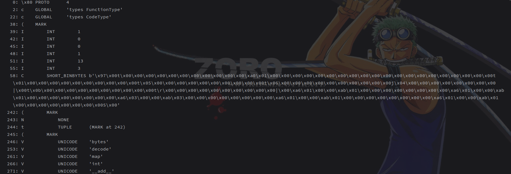

2是fickling可以配合ast把opcode转为ast

~~~python
from fickling.fickle import Pickled
import ast
code = b''
fickled_object = Pickled.load(code)
print(ast.dump(fickled_object.ast, indent=4))
~~~

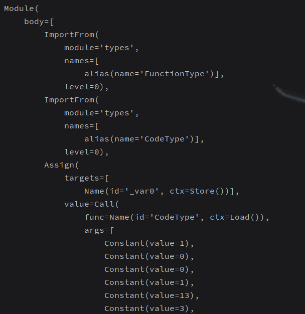

这里主要分析的是后者；观察到很多assign里传入很多可读字节参数，且都经过func-_var2处理，优先看`_var2`

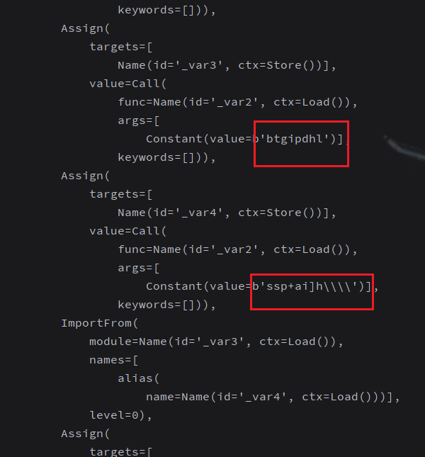

~~~ast
ImportFrom(
            module='types',
            names=[
                alias(name='FunctionType')],
            level=0),
        ImportFrom(
            module='types',
            names=[
                alias(name='CodeType')],
            level=0),
        Assign(
            targets=[
                Name(id='_var0', ctx=Store())],
            value=Call(
                func=Name(id='CodeType', ctx=Load()),
                args=[
                    Constant(value=1),
                    Constant(value=0),
                    Constant(value=0),
                    Constant(value=1),
                    Constant(value=13),
                    Constant(value=3),
                    Constant(value=b'\x97\x00t\x00\x00\x00\x00\x00\x00\x00\x00\x00\x00\x00\xa0\x01\x00\x00\x00\x00\x00\x00\x00\x00\x00\x00\x00\x00\x00\x00\x00\x00\x00\x00\x00\x00t\x01\x00\x00\x00\x00\x00\x00\x00\x00\x00\x00t\x05\x00\x00\x00\x00\x00\x00\x00\x00\x00\x00t\x06\x00\x00\x00\x00\x00\x00\x00\x00\x00\x00j\x04\x00\x00\x00\x00\x00\x00\x00\x00|\x00t\x0b\x00\x00\x00\x00\x00\x00\x00\x00\x00\x00t\r\x00\x00\x00\x00\x00\x00\x00\x00\x00\x00|\x00\xa6\x01\x00\x00\xab\x01\x00\x00\x00\x00\x00\x00\x00\x00\xa6\x01\x00\x00\xab\x01\x00\x00\x00\x00\x00\x00\x00\x00\xa6\x03\x00\x00\xab\x03\x00\x00\x00\x00\x00\x00\x00\x00\xa6\x01\x00\x00\xab\x01\x00\x00\x00\x00\x00\x00\x00\x00\xa6\x01\x00\x00\xab\x01\x00\x00\x00\x00\x00\x00\x00\x00S\x00'),
                    Tuple(elts=(<ast.Constant object at 0x000001E8A81FB850>,), ctx=Load()),
                    Tuple(elts=(<ast.Constant object at 0x000001E8A81FB8E0>, <ast.Constant object at 0x000001E8A81FB910>, <ast.Constant object at 0x000001E8A81FB940>, <ast.Constant object at 0x000001E8A81FB970>, <ast.Constant object at 0x000001E8A81FB9A0>, <ast.Constant object at 0x000001E8A81FB9D0>, <ast.Constant object at 0x000001E8A81FBA00>), ctx=Load()),
                    Tuple(elts=(<ast.Constant object at 0x000001E8A81FBA90>,), ctx=Load()),
                    Constant(value='Liang ge ren xiang biao da de han yi ne, shi'),
                    Constant(value='Wo xi huan ni, Ni xi huan wo'),
                    Constant(value='Dan shi ne, hui yan 13 ji'),
                    Constant(value=1),
                    Constant(value=b'\x02\x01'),
                    Constant(value=b'')],
                keywords=[])),
        Assign(
            targets=[
                Name(id='_var1', ctx=Store())],
            value=Call(
                func=Name(id='globals', ctx=Load()),
                args=[],
                keywords=[])),
        Assign(
            targets=[
                Name(id='_var2', ctx=Store())],
            value=Call(
                func=Name(id='FunctionType', ctx=Load()),
                args=[
                    Name(id='_var0', ctx=Load()),
                    Name(id='_var1', ctx=Load())],
                keywords=[])),
~~~

发现调用了types.CodeType函数，所以直接python模拟实现下

~~~python
code_obj = types.CodeType(1, 0, 0, 1, 13, 3,
                          b'\x97\x00t\x00\x00\x00\x00\x00\x00\x00\x00\x00\x00\x00\xa0\x01\x00\x00\x00\x00\x00\x00\x00'
                          b'\x00\x00\x00\x00\x00\x00\x00\x00\x00\x00\x00\x00\x00t\x01\x00\x00\x00\x00\x00\x00\x00\x00'
                          b'\x00\x00t\x05\x00\x00\x00\x00\x00\x00\x00\x00\x00\x00t\x06\x00\x00\x00\x00\x00\x00\x00'
                          b'\x00\x00\x00j\x04\x00\x00\x00\x00\x00\x00\x00\x00|\x00t\x0b\x00\x00\x00\x00\x00\x00\x00'
                          b'\x00\x00\x00t\r\x00\x00\x00\x00\x00\x00\x00\x00\x00\x00|\x00\xa6\x01\x00\x00\xab\x01\x00'
                          b'\x00\x00\x00\x00\x00\x00\x00\xa6\x01\x00\x00\xab\x01\x00\x00\x00\x00\x00\x00\x00\x00\xa6'
                          b'\x03\x00\x00\xab\x03\x00\x00\x00\x00\x00\x00\x00\x00\xa6\x01\x00\x00\xab\x01\x00\x00\x00'
                          b'\x00\x00\x00\x00\x00\xa6\x01\x00\x00\xab\x01\x00\x00\x00\x00\x00\x00\x00\x00S\x00',
                          (), ('bytes', 'decode', 'map', 'int', '__add__', 'range', 'len'), ('BanG Its Mygo!!!',),
                          'Liang ge ren xiang biao da de han yi ne, shi', 'Wo xi huan ni, Ni xi huan wo',
                          'Dan shi ne, hui yan 13 ji', 1, b'\x02\x01', b'', ())
a = types.FunctionType(code_obj, globals())(b'btgipdhl')
print(b'btgipdhl', a)
a = types.FunctionType(code_obj, globals())(b'ssp+ai]h\\\\')
print(b'ssp+ai]h\\\\', a)
a = types.FunctionType(code_obj, globals())(b'imnrp')
print(b'imnrp', a)
a = types.FunctionType(code_obj, globals())(b'r`lakh')
print(b'r`lakh', a)
a = types.FunctionType(code_obj, globals())(b'sdca')
print(b'sdca', a)
a = types.FunctionType(code_obj, globals())(b'r`la^tn^k')
print(b'r`la^tn^k', a)
a = types.FunctionType(code_obj, globals())(b'ldl')
print(b'ldl', a)
a = types.FunctionType(code_obj, globals())(b'm`n')
print(b'm`n', a)
a = types.FunctionType(code_obj, globals())(b'imr+[ZrhjVU')
print(b'imr+[ZrhjVU', a)
a = types.FunctionType(code_obj, globals())(b'imr+[Z[g\\VU')
print(b'imr+[Z[g\\VU', a)
a = types.FunctionType(code_obj, globals())(b'imr+[ZikWV')
print(b'imr+[ZikWV', a)
a = types.FunctionType(code_obj, globals())(b'imr+[Zfl``\\iSR')
print(b'imr+[Zfl``\\iSR', a)
a = types.FunctionType(code_obj, globals())(b'lhqq*ZYfmcUT')
print(b'lhqq*ZYfmcUT', a)
a = types.FunctionType(code_obj, globals())(b'imr+[Zh^WV')
print(b'imr+[Zh^WV', a)
a = types.FunctionType(code_obj, globals())(b'lhqq*ZY`]k_iY`QP')
print(b'lhqq*ZY`]k_iY`QP', a)
a = types.FunctionType(code_obj, globals())(b'lhqq*ZYfmcUT')
print(b'lhqq*ZYfmcUT', a)
a = types.FunctionType(code_obj, globals())(b'imr+[Zll``\\iSR')
print(b'imr+[Zll``\\iSR', a)
a = types.FunctionType(code_obj, globals())(b'amw')
print(b'amw', a)
~~~

现在可以看到字符串都转为了常见的函数

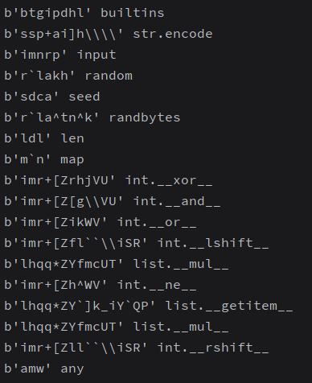

然后就比较笨的一个个手动还原了回去，大体得到了下面的加密代码，总之就是random固定字符串初始化，生成的字节经过多次处理后和flag异或得到代码里硬编码的数组

~~~python
import random
random.seed('D0_Y0u_Kn0w_Wh4t_th3_D0oR_Th1s_K3y_Op3ns?')
flag=input().encode()
a=random.randbytes(len(flag))
d=(map(int.__lshift__,a,list.__mul__([4],len(flag))))
e=map(int.__or__,d,map(int.__rshift__,a,list.__mul__([4],len(flag))))
print(list(e))
f=map(int.__or__,map(int.__lshift__,a,list.__mul__([4],len(flag))),e)
print(list(f))
g=map(int.__and__,f,list.__mul__([255],len(flag)))
h=map(int.__xor__,flag,g)
b = [235,128,107,33,10,206,158,151,158,88,130,190,155,207,94,28,65,9,102,5,241,184,74,129,3,46,216,20,112,95,201,86,215,220,220,7,45,81,145,229,152,241,4,135,16,118,102,144]
i=map(int.__xor__,b,h)
any(i)
~~~

逆向脚本如下：

~~~python
import random
random.seed('D0_Y0u_Kn0w_Wh4t_th3_D0oR_Th1s_K3y_Op3ns?')
b = [235,128,107,33,10,206,158,151,158,88,130,190,155,207,94,28,65,9,102,5,241,184,74,129,3,46,216,20,112,95,201,86,215,220,220,7,45,81,145,229,152,241,4,135,16,118,102,144]
print(len(b))
a=random.randbytes(48)
d=(map(int.__lshift__,a,list.__mul__([4],48)))
e=map(int.__or__,d,map(int.__rshift__,a,list.__mul__([4],48)))
f=map(int.__or__,map(int.__lshift__,a,list.__mul__([4],48)),e)
g=map(int.__and__,f,list.__mul__([255],48))
h=list(g)
print(h,len(h))
flag=""
for i in range(48):
    flag+=chr(b[i]^h[i])
print(flag)
~~~

`flag{D0_U_7h1nk_P1ckl3_1s_S4f3?1_d0_n0t_4nyW4y!}`

## Blockchain

### 签到

- [x] solved

直接复制sepolia地址到https://www.oklink.com/zh-hans/sepolia-test，点击合约--验证合约，编译器随便选，进去里面有个ABI数据很明显是flag

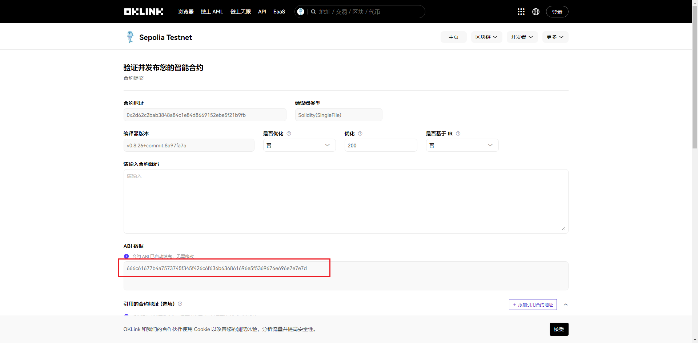

十六进制转字符串得到`flag{Just_4_Blockchain_Signin~~}`

### Break Through The Barrier

- [x] solved

最麻烦的一题，区块链现学现卖，卡在了账号没余额还不知道咋充进去钱，全是中国地区不可用。。。

首先https://sepolia.etherscan.io/address/0x9dBC28b33a0c3eC1e0c41B3793682b46648473AF#code直接看合约

~~~
// SPDX-License-Identifier: MIT
pragma solidity ^0.6.12;

contract BTTB {
    address public owner;
    mapping(address => uint256) public balances;

    constructor() public {
        owner = msg.sender;
    }

    function deposit(uint256 amount) public {
        require(amount <= 100, "Too much money! I can't stand it!");
        balances[msg.sender] += amount;
    }

    function withdraw(uint256 amount) public {
        require(
            balances[msg.sender] - amount >= 0,
            "You don't have that much money."
        );
        balances[msg.sender] -= amount;
    }

    function is_solved(address addr) public view returns (bool) {
        bool result = (balances[addr] == type(uint256).max);
        return result;
    }

    function end_challenge(address addr) public{
        require(msg.sender == owner, "Only the owner can end this challenge.");
        balances[addr] = 0;
    }
}
~~~

问了chatgpt知道了solidity ^0.6.12有整数溢出漏洞，0-1可以直接uint256-max，所以只需write contract中withdraw写个1即可

但前提条件

1. metamask创建个账号
2. 帐号上得有钱，不然没法交易，交易过程需要什么gas费，最后还是找了个每天登陆免费送一点比特币的网站使自己余额不为0才成功发起write contract交易

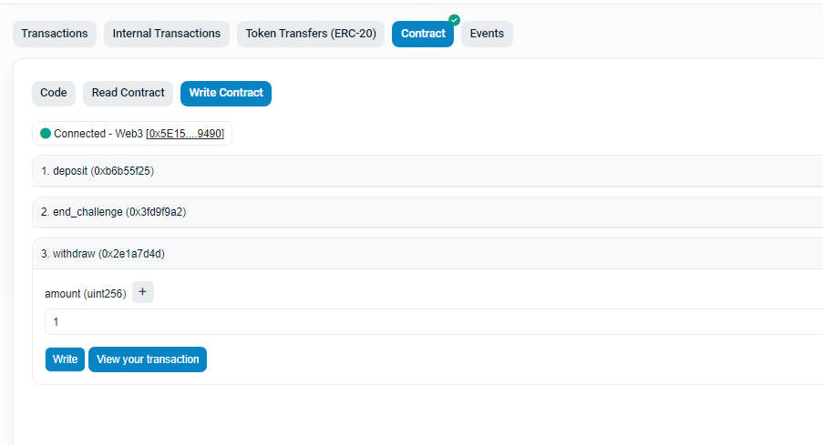

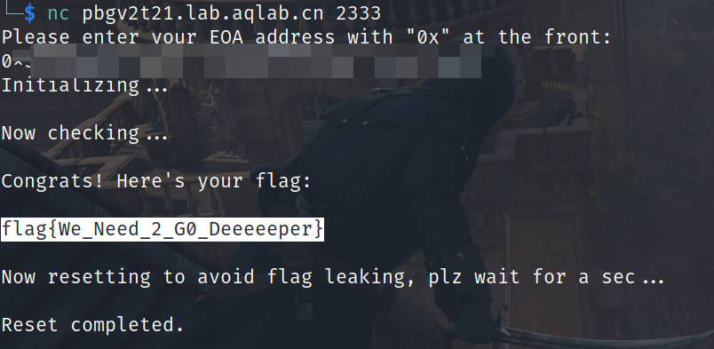

## Misc

###  我有一个朋友...

- [x] solved

不太懂触发的原理

### ez_Misc

- [ ] solved

没想到真是考察密码学一部分知识，没做出来的原因是直接复制了wireshark里的显示

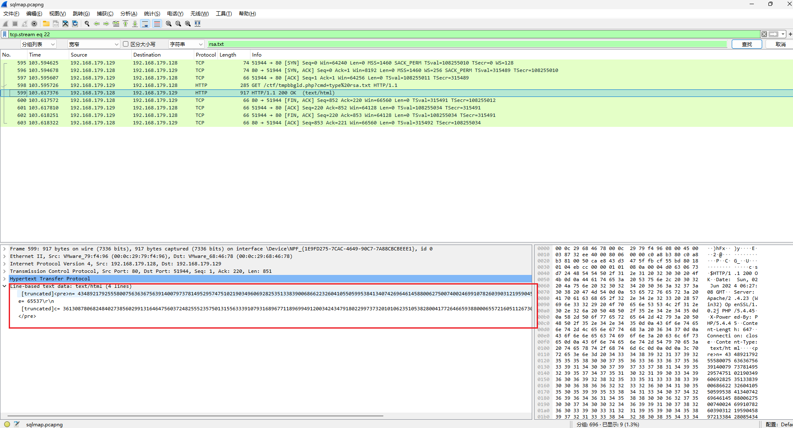

结果比赛后才发现不全，应该直接追踪HTTP字节流，这才是完整的

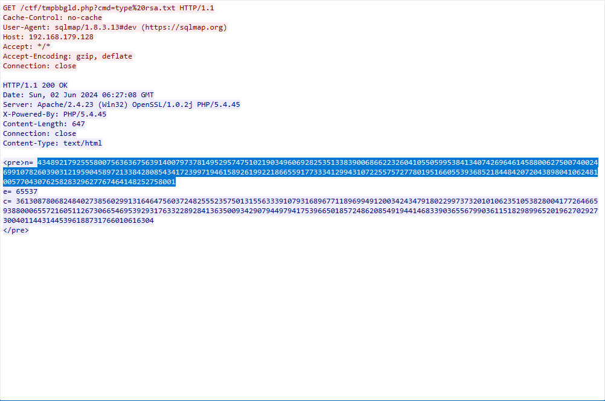

然后直接factordb，发现是个4次方数

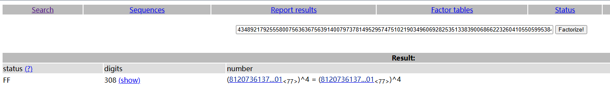

那么$\phi(n)=p^4-p^3$，即可解密rsa

~~~python
import gmpy2
from Crypto.Util.number import long_to_bytes
e = 65537
c = 36130878068248402738560299131646475603724825552357501315563339107931689677118969949120034243479180229973732010106235105382800417726466593880006557216051126730665469539293176332289284136350093429079449794175396650185724862085491944146833903655679903611518298996520196270292730040114431445396188731766010616304
n = 43489217925558007563636756391400797378149529574751021903496069282535133839006866223260410550599538413407426964614588006275007400246991078260390312195904589721338428085434172399719461589261992218665591773334129943107225575727780195166055393685218448420720438980410624810057704307625828329627767464148252758001
p = 81207361375222669491316104953044746246400146737625592406724026490508197814501
d = gmpy2.invert(e, p ** 4 - p ** 3)
m = pow(c, d, n)
print(long_to_bytes(m))
# b'flag{the_password_is_zkaq!!!}'
~~~

很明显得到的是解压密码，其中flag.zip里有flag.txt但仍然需要密码，key.txt里是`FGVAGVAFGDAX`，结合压缩包注释`我最喜欢和超人一起下棋了，哈哈哈哈哈哈！！！！！`搜索到和棋盘相关的密码解密输入密钥"superman"得到密码

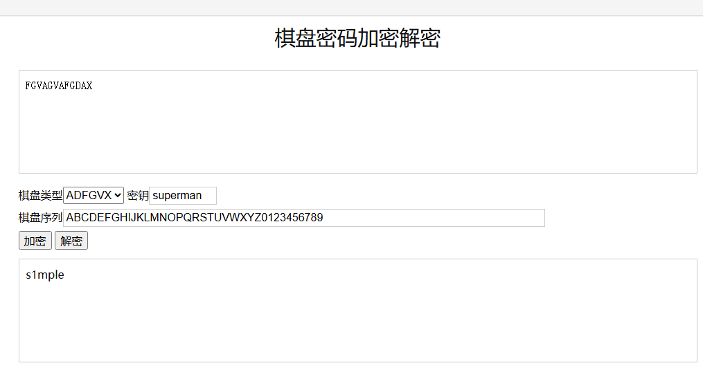

解压得到`flag{i_L0ve_th3_w0rLd}`，很简单的题，大意了，wireshark没认真找

## OSINT

### 摄影出片

- [x] solved

直接谷歌搜图搜到题目

https://www.cnblogs.com/Mar10/p/18281173

`zkaq{Arlington Street, Boston}`

