# 2024春秋杯网络安全联赛冬季赛

## Reverse

### ezre

学习到了新的知识：断点检测0xcc（后面Hgame里又碰到了类似的题目）

~~~c
unsigned __int64 main_program()
{
  unsigned int seed[2]; // [rsp+20h] [rbp-80h] BYREF
  __int64 v2; // [rsp+28h] [rbp-78h]
  char s[48]; // [rsp+30h] [rbp-70h] BYREF
  char s1[56]; // [rsp+60h] [rbp-40h] BYREF
  unsigned __int64 v5; // [rsp+98h] [rbp-8h]

  v5 = __readfsqword(0x28u);
  *(_QWORD *)seed = 0LL;
  v2 = 0LL;
  custom_md5_init(seed);
  srand(seed[0]);
  printf("Enter input: ");
  fgets(s, 43, stdin);
  if ( strlen(s) == 42 )
  {
    memset(s1, 0, 0x2BuLL);
    xor_string_with_rand(s, s1);
    if ( !memcmp(s1, &ida_chars, 0x2BuLL) )
      puts("right");
    else
      puts("wrong");
  }
  else
  {
    puts("Invalid input length.");
  }
  return v5 - __readfsqword(0x28u);
}
void __fastcall xor_string_with_rand(__int64 a1, __int64 a2)
{
  int i; // [rsp+18h] [rbp-8h]

  for ( i = 0; i <= 41; ++i )
    *(_BYTE *)(i + a2) = (rand() % 127) ^ *(_BYTE *)(i + a1);
}
~~~

custom_md5_init里很关键，发现对文件函数内容做了md5加密，位置为custom_md5_init + 1024后

~~~c
unsigned __int64 __fastcall custom_md5_init(__int64 a1)
{
  char v2[96]; // [rsp+20h] [rbp-470h] BYREF
  char v3[1032]; // [rsp+80h] [rbp-410h] BYREF
  unsigned __int64 v4; // [rsp+488h] [rbp-8h]

  v4 = __readfsqword(0x28u);
  qmemcpy(v3, custom_md5_init, 0x400uLL);
  MD5_Init(v2, (char *)custom_md5_init + 1024, 128LL);
  MD5_Update(v2, v3, 1024LL);
  MD5_Final(a1, v2);
  return v4 - __readfsqword(0x28u);
}
~~~

为了保证动态调试获取正确的srand seed值，需要保证断点下在custom_md5_init函数前，查看汇编代码发现只有main函数在前头，因此只需在这里下断点，然后xor_string_with_rand下个断点打印rand()%127值

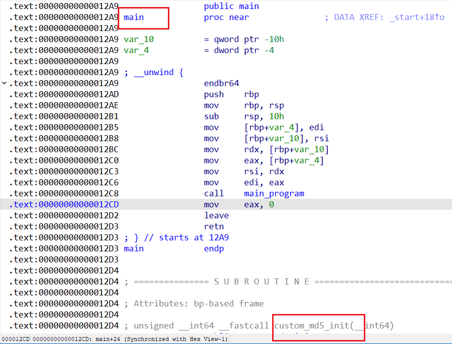

直接脚本异或获取flag

~~~python
xor = [58, 26, 43, 31, 110, 0, 50, 69, 82, 68, 34, 85, 58, 55, 125, 67, 123, 35, 82, 28, 96, 70, 10, 7, 86, 56, 114, 121, 16, 29, 82, 74, 47, 117, 97, 22, 117, 20, 92, 65, 88, 118]
cmp = [0x5C, 0x76, 0x4A, 0x78, 0x15, 0x62, 0x05, 0x7C, 0x6B, 0x21, 0x40, 0x66, 0x5B, 0x1A, 0x48, 0x7A, 0x1E, 0x46, 0x7F,
       0x28, 0x02, 0x75, 0x68, 0x2A, 0x34, 0x0C, 0x4B, 0x1D, 0x3D, 0x2E, 0x6B, 0x7A, 0x17, 0x45, 0x07, 0x75, 0x47, 0x27,
       0x39, 0x78, 0x61, 0x0B]
for i in range(42):
    print(chr(xor[i] ^ cmp[i]), end="")
~~~

### ko0h

ida反编译的是假flag逻辑，查看汇编代码发现有花指令，大部分是jz、jnz，直接nop

真正函数逻辑如下

~~~c
int __cdecl sub_402B60(int a1, signed int Size)
{
  char v3; // [esp+0h] [ebp-124h]
  signed int i; // [esp+D0h] [ebp-54h]
  _BYTE *v5; // [esp+DCh] [ebp-48h]
  char v6[14]; // [esp+E8h] [ebp-3Ch]
  char v7[38]; // [esp+F6h] [ebp-2Eh] BYREF
  int v8; // [esp+11Ch] [ebp-8h]

  v8 = strlen(Str);
  v6[0] = 24;
  v6[1] = -100;
  v6[2] = 71;
  v6[3] = 61;
  v6[4] = 59;
  v6[5] = -31;
  v6[6] = 41;
  v6[7] = 39;
  v6[8] = -97;
  v6[9] = 52;
  v6[10] = -125;
  v6[11] = -43;
  v6[12] = -19;
  v6[13] = -75;
  qmemcpy(v7, "nY", 2);
  v7[2] = 127;
  v7[3] = -34;
  v7[4] = 71;
  v7[5] = -41;
  v7[6] = 101;
  v7[7] = 63;
  v7[8] = 122;
  v7[9] = 51;
  v7[10] = 91;
  v7[11] = 100;
  v7[12] = -74;
  v7[13] = -6;
  v7[14] = -108;
  v7[15] = 85;
  v7[16] = -121;
  v7[17] = 66;
  v7[18] = 32;
  v7[19] = 6;
  v7[20] = 12;
  v7[21] = 105;
  v7[22] = -2;
  v7[23] = 114;
  v7[24] = -87;
  v7[25] = -28;
  v7[26] = -47;
  v7[27] = 124;
  v5 = malloc(Size);
  if ( !v5 )
    return -1;
  sub_4012AD(a1, (int)v5, Size, (int)Str, v8);
  for ( i = 0; i < Size; ++i )
  {
    if ( v6[i] != v5[i] )
      return 0;
  }
  sub_401096("yes", v3);
  return Size;
}
~~~

sub_4012AD是rc4加密，里面的异或魔改为减法操作，注意Str已经被hook替换掉了

~~~python
def KSA(key):
    """ Key-Scheduling Algorithm (KSA) 密钥调度算法"""
    S = list(range(256))
    j = 0
    for i in range(256):
        j = (j + S[i] + key[i % len(key)]) % 256
        S[i], S[j] = S[j], S[i]
    return S

def PRGA(S):
    """ Pseudo-Random Generation Algorithm (PRGA) 伪随机数生成算法"""
    i, j = 0, 0
    while True:
        i = (i + 1) % 256
        j = (j + S[i]) % 256
        S[i], S[j] = S[j], S[i]
        K = S[(S[i] + S[j]) % 256]
        yield K

def RC4(key, text):
    """ RC4 encryption/decryption """
    S = KSA(key)
    keystream = PRGA(S)
    res = []
    for char in text:
        res.append((char + next(keystream))&0xff)
    return bytes(res)

key = b"DDDDAAAASSSS"
text = [24, -100, 71, 61, 59, -31, 41, 39, -97, 52, -125, -43, -19, -75, ord("n"), ord("Y"), 127, -34, 71, -41, 101, 63, 122, 51, 91, 100, -74, -6, -108, 85, -121, 66, 32, 6, 12, 105, -2, 114, -87, -28, -47, 124]
print(RC4(key, text).decode())
~~~

### ezgo

第一天的题发现直接其实早就出了，没读好题，爆破出来的key为oadi，输入发现有提示only xxx can get right flag啥的以为做的不对，结果最后才发现zip早就正确还原了

函数逻辑为：

* main_init和main_main各有一个反调试，得绕过
* 输入4个字符的key
* base64加密，base64table已经在main_init里替换了，同时除了最后的等号都异或了12
* 对base64魔改加密后的结果进行部分位异或
* 中间有个检查时间的反调试也需要绕过
* 最终的8位key对zip.zip做了异或处理，最后写入文件

由于key只有四位可以爆破，检查最终前四位是zip文件头504b0304即可

~~~python
from base64 import b64encode
from itertools import product
from string import ascii_letters, digits

c = list(ascii_letters + digits)
xor = [0x0000000000000001, 0x0000000000000057, 0x000000000000002C, 0x000000000000007C, 0x00000000000000C7, 0x0000000000000072, 0x0000000000000020, 0x0000000000000070, 0x00000000000000A5, 0x0000000000000096, 0x0000000000000021, 0x00000000000000DC, 0x00000000000000A8, 0x0000000000000076, 0x0000000000000069, 0x0000000000000014, 0x00000000000000C5, 0x0000000000000024, 0x0000000000000025, 0x0000000000000002, 0x00000000000000B7, 0x000000000000007A, 0x00000000000000FC, 0x00000000000000F0, 0x00000000000000C4, 0x0000000000000049, 0x0000000000000056, 0x00000000000000C2, 0x00000000000000C1, 0x0000000000000095, 0x00000000000000EC, 0x0000000000000026, 0x00000000000000CC, 0x00000000000000F7, 0x00000000000000FF, 0x0000000000000073, 0x00000000000000E1, 0x000000000000003F, 0x0000000000000084, 0x0000000000000046, 0x00000000000000A9, 0x00000000000000F9, 0x000000000000003D, 0x000000000000000E, 0x0000000000000045, 0x00000000000000F1, 0x00000000000000DA, 0x0000000000000092, 0x00000000000000CE, 0x000000000000003B, 0x000000000000003C, 0x00000000000000A0, 0x0000000000000016, 0x00000000000000BC, 0x000000000000002D, 0x00000000000000BD, 0x00000000000000A4, 0x0000000000000032, 0x0000000000000090, 0x0000000000000062, 0x000000000000009D, 0x000000000000000C, 0x00000000000000DE, 0x00000000000000AD, 0x0000000000000040, 0x00000000000000CF, 0x000000000000004B, 0x000000000000004D, 0x000000000000006E, 0x0000000000000079, 0x00000000000000C8, 0x0000000000000085, 0x00000000000000D2, 0x00000000000000AC, 0x0000000000000099, 0x00000000000000E8, 0x000000000000001E, 0x00000000000000C9, 0x00000000000000D4, 0x0000000000000006, 0x0000000000000034, 0x0000000000000066, 0x00000000000000B8, 0x00000000000000D3, 0x0000000000000013, 0x00000000000000F4, 0x0000000000000042, 0x000000000000001B, 0x0000000000000063, 0x000000000000005F, 0x0000000000000082, 0x000000000000005B, 0x0000000000000091, 0x000000000000002A, 0x0000000000000033, 0x000000000000005D, 0x00000000000000B9, 0x000000000000007D, 0x00000000000000D5, 0x000000000000006C, 0x000000000000000D, 0x0000000000000028, 0x0000000000000008, 0x000000000000009B, 0x0000000000000018, 0x000000000000002E, 0x00000000000000A2, 0x0000000000000067, 0x000000000000005A, 0x00000000000000E6, 0x000000000000008A, 0x0000000000000019, 0x0000000000000050, 0x000000000000009C, 0x00000000000000B1, 0x00000000000000EF, 0x000000000000001F, 0x0000000000000012, 0x00000000000000BA, 0x0000000000000086, 0x0000000000000083, 0x0000000000000077, 0x0000000000000060, 0x0000000000000094, 0x00000000000000FD, 0x00000000000000F6, 0x0000000000000054, 0x00000000000000BF, 0x00000000000000A1, 0x0000000000000093, 0x0000000000000003, 0x00000000000000E7, 0x0000000000000058, 0x00000000000000E5, 0x000000000000009A, 0x000000000000007F, 0x0000000000000022, 0x00000000000000BE, 0x00000000000000D9, 0x0000000000000038, 0x0000000000000027, 0x0000000000000065, 0x00000000000000D7, 0x0000000000000023, 0x00000000000000FB, 0x0000000000000071, 0x00000000000000FA, 0x000000000000008F, 0x00000000000000F5, 0x000000000000006D, 0x0000000000000051, 0x000000000000009E, 0x00000000000000D6, 0x000000000000008B, 0x0000000000000089, 0x0000000000000011, 0x00000000000000CA, 0x000000000000000F, 0x000000000000008E, 0x00000000000000CB, 0x00000000000000B3, 0x00000000000000BB, 0x00000000000000F2, 0x0000000000000087, 0x0000000000000075, 0x000000000000005C, 0x000000000000002F, 0x0000000000000098, 0x000000000000002B, 0x000000000000001C, 0x00000000000000B4, 0x00000000000000C6, 0x000000000000000A, 0x000000000000004C, 0x0000000000000036, 0x000000000000001A, 0x0000000000000015, 0x0000000000000088, 0x000000000000001D, 0x00000000000000E4, 0x00000000000000C3, 0x0000000000000097, 0x0000000000000053, 0x0000000000000030, 0x000000000000004A, 0x000000000000003A, 0x00000000000000B5, 0x0000000000000061, 0x0000000000000055, 0x00000000000000C0, 0x00000000000000A7, 0x00000000000000DB, 0x0000000000000029, 0x0000000000000068, 0x00000000000000E2, 0x00000000000000E0, 0x0000000000000010, 0x0000000000000009, 0x0000000000000041, 0x0000000000000031, 0x00000000000000F3, 0x00000000000000AF, 0x00000000000000B6, 0x000000000000006A, 0x000000000000006F, 0x0000000000000000, 0x0000000000000005, 0x000000000000000B, 0x00000000000000E3, 0x00000000000000D1, 0x000000000000008D, 0x0000000000000047, 0x0000000000000074, 0x0000000000000078, 0x000000000000007B, 0x0000000000000064, 0x00000000000000DD, 0x00000000000000AB, 0x00000000000000B0, 0x0000000000000039, 0x0000000000000037, 0x00000000000000FE, 0x00000000000000ED, 0x0000000000000052, 0x00000000000000CD, 0x0000000000000081, 0x00000000000000F8, 0x00000000000000AA, 0x0000000000000048, 0x000000000000006B, 0x00000000000000D0, 0x00000000000000EB, 0x000000000000008C, 0x0000000000000044, 0x0000000000000059, 0x0000000000000017, 0x000000000000009F, 0x000000000000004F, 0x00000000000000B2, 0x0000000000000035, 0x00000000000000A3, 0x000000000000007E, 0x00000000000000EE, 0x000000000000004E, 0x00000000000000DF, 0x00000000000000E9, 0x0000000000000007, 0x0000000000000043, 0x00000000000000A6, 0x00000000000000AE, 0x00000000000000D8, 0x00000000000000EA, 0x0000000000000080, 0x000000000000003E, 0x0000000000000004, 0x000000000000005E]
print(xor[ord("S")])
standard_base64_chars = "ABCDEFGHIJKLMNOPQRSTUVWXYZabcdefghijklmnopqrstuvwxyz0123456789+/"
custom_base64_chars = "TSRQPONMLKJIHGFEDCBAUVWXYZabcdefghijklmnopqrstuvwxyz0123456789+/"

encode_map = {standard_base64_chars[i]: custom_base64_chars[i] for i in range(64)}

with open("zip.zip", "rb") as f:
    data = f.read()
for i in product(c, repeat=4):
    s = "".join(i)
    encode_s = b64encode(s.encode()).decode()
    encode_s = list(''.join([encode_map.get(c, c) for c in encode_s]).encode())
    for j in range(8):
        if encode_s[j] != ord("="):
            encode_s[j] = encode_s[j]^12
    encode_s[0] ^= 2
    encode_s[2] ^= 2
    encode_s[3] ^= 5
    encode_s[4] ^= 5
    encode_s[5] ^= 2
    encode_s[7] ^= 2
    new_data = []
    for j in range(4):
        if data[j]:
            new_data.append(data[j] ^ xor[encode_s[j % 8]] ^ encode_s[j % 8] ^ encode_s[j % 2 + 4])
        else:
            new_data.append(0)
    if new_data == [0x50, 0x4b, 3, 4]:
        print("".join(i))
        break
~~~

得到key值直接运行main输入即可得到正确zip，里面就是flag

### ez_vm

虽然对控制流进行了混淆，但还是可以看出来是tea类型的魔改加密，但挺让人恼火的是他魔改有点太狠了

~~~c
int __cdecl sub_F91E00(_BYTE *a1, int a2)
{
  int result; // eax
  __int64 v3; // [esp-8h] [ebp-2C8h]
  int j; // [esp+148h] [ebp-178h]
  int v5; // [esp+154h] [ebp-16Ch]
  int v6[21]; // [esp+158h] [ebp-168h]
  int i; // [esp+1ACh] [ebp-114h]
  int *v8; // [esp+1B8h] [ebp-108h]
  _BYTE *v9; // [esp+1C4h] [ebp-FCh]
  _DWORD *v10; // [esp+1D0h] [ebp-F0h]
  _DWORD *v11; // [esp+1DCh] [ebp-E4h]
  int v12; // [esp+1E8h] [ebp-D8h]
  int v13; // [esp+1F4h] [ebp-CCh]
  int v14; // [esp+200h] [ebp-C0h]
  unsigned int v15; // [esp+20Ch] [ebp-B4h]
  unsigned int v16; // [esp+218h] [ebp-A8h]
  int v17; // [esp+224h] [ebp-9Ch]
  unsigned int v18; // [esp+230h] [ebp-90h]
  int v19; // [esp+23Ch] [ebp-84h]
  int v20; // [esp+248h] [ebp-78h]
  int v21; // [esp+254h] [ebp-6Ch] BYREF
  int v22; // [esp+260h] [ebp-60h]
  int v23; // [esp+26Ch] [ebp-54h]
  int v24; // [esp+278h] [ebp-48h]
  int v25; // [esp+284h] [ebp-3Ch]
  int v26; // [esp+290h] [ebp-30h]
  int v27; // [esp+29Ch] [ebp-24h]
  int v28; // [esp+2A8h] [ebp-18h]
  int v29; // [esp+2B4h] [ebp-Ch]

  __CheckForDebuggerJustMyCode(&unk_F9D015);
  a1[36] = 0;
  a1[37] = 0;
  a1[38] = 0;
  a1[39] = 0;
  v17 = 0xABCDEF12;
  v16 = 0;
  v15 = 0;
  v14 = 0;
  v13 = 0;
  v12 = 1;
  v11 = 0;
  v10 = 0;
  v9 = 0;
  while ( 2 )
  {
    switch ( *(_DWORD *)(a2 + 4 * v14) )
    {
      case 0x66:
        if ( v12 == 32 )
        {
          v8 = &v21;
          for ( i = 0; i < 4; ++i )
            *((_BYTE *)v8 + i) = byte_F9B000[4 * *((unsigned __int8 *)v8 + i)];
          *v11 = v21;
          *v10 = v20;
          v14 -= 31;
          v12 = 1;
          ++v13;
          v16 = 0;
        }
        else
        {
          ++v12;
          v14 -= 31;
        }
        if ( v13 != 5 )
          continue;
        v9 = a1;
        v5 = 0x83845981;
        v6[0] = 0;
        v6[1] = 0x34402115;
        v6[2] = 0;
        v6[3] = 0xFB1F53D2;
        v6[4] = 0;
        v6[5] = 0x547564C9;
        v6[6] = 0;
        v6[7] = 0x3B42FCC6;
        v6[8] = 0;
        v6[9] = 0x2B67FCDE;
        v6[10] = 0;
        v6[11] = 0x675AB09C;
        v6[12] = 0;
        v6[13] = 0x1D47F41A;
        v6[14] = 0;
        v6[15] = 0x876D3272;
        v6[16] = 0;
        result = 0;
        v6[17] = 0x734D7D95;
        v6[18] = 0;
        for ( j = 0; j < 10; ++j )
        {
          if ( *(_DWORD *)&v9[4 * j] != v6[2 * j - 1] || v6[2 * j] )
          {
            puts("You are Wrong!");
            exit(0);
          }
          result = j + 1;
        }
        return result;
      case 0xA1:
        v16 += xor(v17, 0x8BE8CF37);            // 0x20252025
        v15 = v16 >> 7;                         // 0x404a40
        ++v14;
        continue;
      case 0xA2:
        if ( v12 == 1 )
          v11 = &a1[8 * v13];
        else
          *v11 = v21;
        v21 = *v11 + v22;
        ++v14;
        continue;
      case 0xA3:
        v20 = *v10 + v22;
        ++v14;
        continue;
      case 0xB2:
        if ( v12 == 1 )
          v10 = &a1[8 * v13 + 4];
        else
          *v10 = v20;
        v29 = v14 + 1;
        *(_DWORD *)(a2 + 4 * (v14 + 1)) = *v10;
        v14 += 2;
        continue;
      case 0xB3:
        if ( v12 == 1 )
          v11 = &a1[8 * v13];
        else
          *v11 = v21 - v22;
        v29 = v14 + 1;
        v24 = v22 + *v11;
        *(_DWORD *)(a2 + 4 * v29) = v24;
        v14 += 2;
        continue;
      case 0xC4:
        v29 = v14 + 1;
        v18 = *(_DWORD *)(a2 + 4 * v14 - 4);
        v27 = shl(v18, *(_DWORD *)(a2 + 4 * (v14 + 1)));
        v14 += 2;
        continue;
      case 0xC5:
        v29 = v14 + 1;
        v18 = *(_DWORD *)(a2 + 4 * v14 - 4);
        v26 = shr(v18, *(_DWORD *)(a2 + 4 * (v14 + 1)));
        v14 += 2;
        continue;
      case 0xC6:
        v19 = dword_F9B400[v28] + v16;	// 这里基本确定是key值
        v22 = xor(v25, v19);
        v22 = xor(v22, 3);
        ++v14;
        continue;
      case 0xD7:
        v25 = xor(v27, v26);
        v25 = xor(v25, 66);
        ++v14;
        continue;
      case 0xD8:
        v29 = v14 + 1;
        HIDWORD(v3) = *(_DWORD *)(a2 + 4 * (v14 + 1));
        if ( v15 )
        {
          LODWORD(v3) = v15;
          v28 = sub_F91037(v3);
          v15 = 0;
        }
        else
        {
          LODWORD(v3) = v16;
          v28 = sub_F91037(v3);
        }
        v14 += 2;
        continue;
      case 0xF4:
        if ( *(_DWORD *)(a2 + 4 * v14 + 4) == 0xE1 )
          v23 = v24;
        if ( *(_DWORD *)(a2 + 4 * v14 + 4) == 0xE2 )
          v23 = *v10;
        v25 += v23;
        v14 += 2;
        continue;
      default:
        puts("error");
        continue;
    }
  }
}
~~~

只能动态调试一步步看，纯考验调试耐心了，这是我当时记下来的加密流程

~~~
a=((((s[4:8]<<4)^(s[4:8]>>6)^66)+s[4:8])^(total+2)^3)
(((((a+s[:4])<<4)^((a+s[:4])>>6)^66)+(a+s[:4]))^(0x20252025+2)^3)+s[4:8]
~~~

比赛后复现wp发现几乎接近了，还是key那里的操作没搞懂；然后最后xtea加密完的结果前四字节做了字节替换，因此逆向要先把字节替换还原再xtea解密

~~~python
import struct
from ctypes import c_uint32

def xtea_encrypt(r, v, key):
    v0, v1 = c_uint32(v[0]), c_uint32(v[1])
    delta = 0x20252025
    total = c_uint32(0)
    for i in range(r):
        v0.value += (((v1.value << 4) ^ (v1.value >> 6) ^ 66) + v1.value) ^ (total.value + key[total.value & 3]) ^ 3
        total.value += delta
        v1.value += (((v0.value << 4) ^ (v0.value >> 6) ^ 66) + v0.value) ^ (total.value + key[(total.value >> 7) & 3]) ^ 3
    return v0.value, v1.value

def xtea_decrypt(r, v, key):
    v0, v1 = c_uint32(v[0]), c_uint32(v[1])
    delta = 0x20252025
    total = c_uint32(delta * r)
    for i in range(r):
        v1.value -= (((v0.value << 4) ^ (v0.value >> 6) ^ 66) + v0.value) ^ (total.value + key[(total.value >> 7) & 3]) ^ 3
        total.value -= delta
        v0.value -= (((v1.value << 4) ^ (v1.value >> 6) ^ 66) + v1.value) ^ (total.value + key[total.value & 3]) ^ 3
    return v0.value, v1.value

if __name__ == "__main__":
    key = [2, 0, 2, 5]
    b = [0x000000A4, 0x000000C4, 0x00000004, 0x000000CE, 0x00000014, 0x00000095, 0x000000E9, 0x00000011, 0x00000031, 0x00000018, 0x000000B6, 0x000000B0, 0x00000001, 0x00000026, 0x00000024, 0x0000006A, 0x0000007B, 0x00000012, 0x000000CB, 0x00000067, 0x000000DB, 0x000000F8, 0x000000D2, 0x0000007E, 0x0000009D, 0x000000D0, 0x0000000C, 0x0000005F, 0x00000082, 0x00000021, 0x00000087, 0x00000083, 0x00000086, 0x0000007C, 0x000000C2, 0x0000009F, 0x00000029, 0x000000CA, 0x000000BF, 0x00000049, 0x000000DE, 0x0000004E, 0x000000CD, 0x00000062, 0x00000053, 0x000000BE, 0x000000A7, 0x00000003, 0x0000002F, 0x000000B5, 0x000000AB, 0x00000094, 0x000000CC, 0x0000002E, 0x0000001D, 0x000000F3, 0x00000036, 0x00000010, 0x000000BA, 0x000000D7, 0x00000013, 0x00000035, 0x000000E5, 0x000000B3, 0x00000081, 0x0000001A, 0x000000A0, 0x000000E7, 0x00000025, 0x00000075, 0x000000AF, 0x00000051, 0x00000043, 0x0000005C, 0x00000050, 0x00000048, 0x000000D8, 0x000000A3, 0x0000003F, 0x00000071, 0x0000007A, 0x000000C7, 0x000000C6, 0x00000090, 0x000000B1, 0x000000BB, 0x000000FA, 0x000000DD, 0x000000B9, 0x000000F6, 0x000000A9, 0x000000B7, 0x00000064, 0x00000038, 0x000000DF, 0x000000E0, 0x00000008, 0x000000B2, 0x00000077, 0x00000033, 0x0000005B, 0x00000002, 0x0000005E, 0x00000079, 0x00000061, 0x00000007, 0x00000069, 0x00000023, 0x00000057, 0x0000004A, 0x000000FD, 0x000000C0, 0x0000002B, 0x000000A1, 0x000000D1, 0x00000028, 0x00000009, 0x0000006F, 0x00000080, 0x00000055, 0x000000FE, 0x00000042, 0x000000E3, 0x00000047, 0x00000044, 0x000000E1, 0x000000FF, 0x000000BC, 0x0000007D, 0x0000008B, 0x0000009A, 0x00000060, 0x000000AD, 0x00000097, 0x000000FB, 0x0000008D, 0x000000D6, 0x000000AC, 0x0000001E, 0x0000000F, 0x00000045, 0x000000EA, 0x000000F5, 0x0000004B, 0x0000002D, 0x0000003B, 0x00000022, 0x0000001C, 0x0000005A, 0x00000072, 0x00000046, 0x000000C3, 0x000000E4, 0x0000005D, 0x000000DA, 0x00000092, 0x0000009B, 0x0000000A, 0x000000BD, 0x00000099, 0x00000085, 0x00000034, 0x00000073, 0x000000A5, 0x00000056, 0x00000037, 0x0000004C, 0x00000016, 0x00000084, 0x000000A2, 0x000000B4, 0x0000006D, 0x00000054, 0x000000E6, 0x000000C1, 0x0000001F, 0x00000017, 0x0000003D, 0x00000088, 0x000000F7, 0x00000015, 0x00000058, 0x000000EF, 0x0000004D, 0x000000EE, 0x00000089, 0x00000068, 0x00000059, 0x000000B8, 0x00000020, 0x000000E8, 0x000000DC, 0x000000C9, 0x00000091, 0x000000FC, 0x000000D5, 0x000000C8, 0x00000041, 0x0000009E, 0x00000076, 0x00000078, 0x00000032, 0x00000019, 0x00000066, 0x00000065, 0x00000039, 0x0000006B, 0x000000C5, 0x00000052, 0x00000027, 0x000000A8, 0x00000006, 0x0000008E, 0x000000A6, 0x0000000D, 0x00000098, 0x0000008C, 0x000000F9, 0x00000005, 0x0000001B, 0x00000040, 0x0000008F, 0x0000004F, 0x0000003C, 0x000000EB, 0x00000070, 0x000000D9, 0x00000063, 0x000000D3, 0x000000E2, 0x0000002C, 0x000000F0, 0x00000093, 0x0000003A, 0x000000F4, 0x00000000, 0x000000F2, 0x000000AA, 0x0000007F, 0x0000002A, 0x00000030, 0x000000EC, 0x0000006C, 0x00000074, 0x0000006E, 0x000000F1, 0x0000000E, 0x0000003E, 0x000000ED, 0x00000096, 0x000000AE, 0x0000008A, 0x000000CF, 0x0000000B, 0x0000009C, 0x000000D4]
    v = [0x83845981, 0x34402115, 0xFB1F53D2, 0x547564C9, 0x3B42FCC6, 0x2B67FCDE, 0x675AB09C, 0x1D47F41A, 0x876D3272, 0x734D7D95]
    for k in range(0, len(v), 2):
        v[k] = list(struct.pack("<I", v[k]))
        for i in range(len(v[k])):
            v[k][i] = b.index(v[k][i])
        v[k] = struct.unpack("<I", bytes(v[k]))[0]
    for i in range(0, len(v), 2):
        v[i:i+2] = xtea_decrypt(32, v[i:i+2], key)
    str_list = []
    for i in range(len(v)):
        str_list.append(struct.pack('<I', v[i]).decode())
    print('decrypted: %s' % ''.join(str_list))
~~~

### skip

jeb反编译可知检查了用户名和密码，其中用户名调用so文件来检查，ida分析可知是des加密，里面的各种盒全被魔改了

~~~python
from Crypto.Util.number import long_to_bytes

# 初始置换IP
IP = [0x3A, 0x32, 0x2A, 0x22, 0x1A, 0x12, 0x0A, 0x02, 0x3C, 0x34, 0x2C, 0x24, 0x1C, 0x14, 0x0C, 0x04, 0x3E, 0x36, 0x2E, 0x26, 0x1E, 0x16, 0x0E, 0x06, 0x40, 0x38, 0x30, 0x28, 0x20, 0x18, 0x10, 0x08, 0x39, 0x31, 0x29, 0x21, 0x19, 0x11, 0x09, 0x01, 0x3B, 0x33, 0x2B, 0x23, 0x1B, 0x13, 0x0B, 0x03, 0x3D, 0x35, 0x2D, 0x25, 0x1D, 0x15, 0x0D, 0x05, 0x3F, 0x37, 0x2F, 0x27, 0x1F, 0x17, 0x0F, 0x07]

# 逆初始置换IP^-1
IP_INV = [0x28, 0x08, 0x30, 0x10, 0x38, 0x18, 0x40, 0x20, 0x27, 0x07, 0x2F, 0x0F, 0x37, 0x17, 0x3F, 0x1F, 0x26, 0x06, 0x2E, 0x0E, 0x36, 0x16, 0x3E, 0x1E, 0x25, 0x05, 0x2D, 0x0D, 0x35, 0x15, 0x3D, 0x1D, 0x24, 0x04, 0x2C, 0x0C, 0x34, 0x14, 0x3C, 0x1C, 0x23, 0x03, 0x2B, 0x0B, 0x33, 0x13, 0x3B, 0x1B, 0x22, 0x02, 0x2A, 0x0A, 0x32, 0x12, 0x3A, 0x1A, 0x21, 0x01, 0x29, 0x09, 0x31, 0x11, 0x39, 0x19]

# 循环左移位数表
SHIFT_TABLE = [
    1, 1, 2, 2, 2, 2, 2, 2, 1, 2, 2, 2, 2, 2, 2, 1
]

# 初始密钥置换PC-1
'''
PC-1是用于从初始密钥中生成56位的中间密钥（C0和D0）的置换表。
它从64位的初始密钥中筛选出56位，并丢弃了8位奇偶校验位。
这个置换是DES算法中的第一步，用于准备子密钥生成。
'''
PC_1 = [0x39, 0x31, 0x29, 0x21, 0x19, 0x11, 0x09, 0x01, 0x3A, 0x32, 0x2A, 0x22, 0x1A, 0x12, 0x0A, 0x02, 0x3B, 0x33, 0x2B, 0x23, 0x1B, 0x13, 0x0B, 0x03, 0x3C, 0x34, 0x2C, 0x24, 0x3F, 0x37, 0x2F, 0x27, 0x1F, 0x17, 0x0F, 0x07, 0x3E, 0x36, 0x2E, 0x26, 0x1E, 0x16, 0x0E, 0x06, 0x3D, 0x35, 0x2D, 0x25, 0x1D, 0x15, 0x0D, 0x05, 0x1C, 0x14, 0x0C, 0x04]

# 子密钥置换PC-2
'''
PC-2是用于从56位中间密钥生成每一轮的48位子密钥的置换表。
在DES中，子密钥是通过对中间密钥进行轮次迭代和置换生成的。
PC-2负责选择并排列中间密钥的位，以生成48位的子密钥。
'''
PC_2 = [0x0E, 0x11, 0x0B, 0x18, 0x01, 0x05, 0x03, 0x1C, 0x0F, 0x06, 0x15, 0x0A, 0x17, 0x13, 0x0C, 0x04, 0x1A, 0x08, 0x10, 0x07, 0x1B, 0x14, 0x0D, 0x02, 0x29, 0x34, 0x1F, 0x25, 0x2F, 0x37, 0x1E, 0x28, 0x33, 0x2D, 0x21, 0x30, 0x2C, 0x31, 0x27, 0x38, 0x22, 0x35, 0x2E, 0x2A, 0x32, 0x24, 0x1D, 0x20]

# S-盒
S_BOX = [0x06, 0x06, 0x04, 0x09, 0x06, 0x07, 0x04, 0x0B, 0x00, 0x02, 0x08, 0x0C, 0x0A, 0x08, 0x00, 0x01, 0x0C, 0x06, 0x09, 0x09, 0x03, 0x07, 0x0B, 0x05, 0x04, 0x0D, 0x01, 0x03, 0x0F, 0x08, 0x0A, 0x0D, 0x05, 0x0D, 0x0A, 0x02, 0x0C, 0x00, 0x0E, 0x0D, 0x0B, 0x0E, 0x05, 0x03, 0x02, 0x08, 0x0E, 0x03, 0x0E, 0x04, 0x0B, 0x07, 0x0F, 0x05, 0x01, 0x07, 0x01, 0x0C, 0x09, 0x00, 0x0A, 0x02, 0x0F, 0x0F, 0x0A, 0x02, 0x04, 0x08, 0x0C, 0x0F, 0x03, 0x0A, 0x04, 0x08, 0x03, 0x04, 0x0E, 0x05, 0x07, 0x0F, 0x0F, 0x08, 0x00, 0x07, 0x09, 0x04, 0x0D, 0x00, 0x05, 0x08, 0x0B, 0x0E, 0x06, 0x02, 0x02, 0x06, 0x0D, 0x09, 0x02, 0x03, 0x0A, 0x07, 0x01, 0x09, 0x05, 0x0F, 0x01, 0x0B, 0x09, 0x0E, 0x0D, 0x0B, 0x07, 0x0C, 0x0C, 0x05, 0x01, 0x0A, 0x0E, 0x06, 0x06, 0x00, 0x00, 0x0C, 0x03, 0x01, 0x0B, 0x0D, 0x0A, 0x00, 0x00, 0x06, 0x05, 0x0D, 0x09, 0x0E, 0x03, 0x01, 0x01, 0x08, 0x0D, 0x09, 0x08, 0x0F, 0x0C, 0x07, 0x01, 0x03, 0x0F, 0x07, 0x0B, 0x07, 0x05, 0x0A, 0x03, 0x0A, 0x02, 0x06, 0x08, 0x0A, 0x09, 0x03, 0x02, 0x0E, 0x0E, 0x0B, 0x0B, 0x02, 0x0D, 0x0F, 0x07, 0x06, 0x08, 0x04, 0x04, 0x0C, 0x00, 0x01, 0x0E, 0x05, 0x0C, 0x0C, 0x04, 0x02, 0x06, 0x09, 0x04, 0x05, 0x0B, 0x0F, 0x00, 0x0D, 0x06, 0x0C, 0x01, 0x0B, 0x0E, 0x00, 0x04, 0x04, 0x04, 0x02, 0x0F, 0x03, 0x03, 0x01, 0x01, 0x02, 0x08, 0x00, 0x09, 0x06, 0x00, 0x08, 0x0D, 0x02, 0x0C, 0x03, 0x03, 0x0A, 0x07, 0x0F, 0x0C, 0x08, 0x0F, 0x0E, 0x07, 0x04, 0x06, 0x0E, 0x01, 0x07, 0x07, 0x09, 0x06, 0x09, 0x0F, 0x05, 0x0B, 0x00, 0x0A, 0x0D, 0x0D, 0x09, 0x0D, 0x05, 0x05, 0x0B, 0x0C, 0x0B, 0x08, 0x02, 0x05, 0x0A, 0x0E, 0x0A, 0x05, 0x05, 0x07, 0x09, 0x09, 0x0D, 0x00, 0x05, 0x06, 0x0B, 0x0C, 0x05, 0x04, 0x0F, 0x00, 0x0C, 0x0B, 0x0D, 0x0D, 0x0A, 0x08, 0x02, 0x0D, 0x03, 0x03, 0x0E, 0x0E, 0x06, 0x09, 0x03, 0x00, 0x07, 0x0A, 0x09, 0x07, 0x08, 0x0A, 0x02, 0x01, 0x00, 0x06, 0x0E, 0x0F, 0x08, 0x0E, 0x0F, 0x02, 0x01, 0x07, 0x06, 0x0F, 0x0A, 0x03, 0x0C, 0x0C, 0x04, 0x01, 0x08, 0x04, 0x0B, 0x02, 0x01, 0x0B, 0x04, 0x0E, 0x06, 0x0E, 0x06, 0x00, 0x0D, 0x09, 0x05, 0x05, 0x0B, 0x00, 0x07, 0x02, 0x03, 0x00, 0x00, 0x03, 0x0D, 0x08, 0x02, 0x0F, 0x09, 0x01, 0x07, 0x09, 0x01, 0x0C, 0x04, 0x0A, 0x09, 0x08, 0x0B, 0x04, 0x01, 0x06, 0x0F, 0x0C, 0x0E, 0x0B, 0x02, 0x05, 0x0E, 0x0D, 0x04, 0x03, 0x07, 0x01, 0x0F, 0x0B, 0x0A, 0x03, 0x07, 0x08, 0x08, 0x0F, 0x05, 0x0C, 0x0C, 0x0A, 0x0A, 0x04, 0x06, 0x0D, 0x02, 0x0F, 0x0E, 0x0A, 0x03, 0x03, 0x0F, 0x0C, 0x0E, 0x00, 0x02, 0x0E, 0x0C, 0x08, 0x00, 0x05, 0x06, 0x0E, 0x02, 0x00, 0x01, 0x08, 0x01, 0x0D, 0x04, 0x0B, 0x04, 0x07, 0x0B, 0x09, 0x0F, 0x01, 0x0C, 0x05, 0x00, 0x07, 0x0D, 0x06, 0x0A, 0x06, 0x0C, 0x0B, 0x06, 0x0D, 0x03, 0x08, 0x04, 0x09, 0x09, 0x0D, 0x04, 0x02, 0x05, 0x01, 0x07, 0x09, 0x05, 0x07, 0x02, 0x08, 0x0F, 0x03, 0x0A, 0x0A, 0x0B, 0x04, 0x07, 0x04, 0x0F, 0x00, 0x05, 0x09, 0x0E, 0x08, 0x0B, 0x0D, 0x00, 0x07, 0x03, 0x01, 0x02, 0x01, 0x06, 0x07, 0x05, 0x0C, 0x04, 0x0D, 0x0D, 0x08, 0x01, 0x05, 0x0C, 0x0B, 0x09, 0x05, 0x0B, 0x06, 0x0A, 0x03, 0x01, 0x0F, 0x0E, 0x0E, 0x0F, 0x09, 0x09, 0x0F, 0x02, 0x0C, 0x0C, 0x0E, 0x00, 0x04, 0x08, 0x06, 0x03, 0x0B, 0x07, 0x03, 0x06, 0x0A, 0x02, 0x00, 0x02, 0x08, 0x0A, 0x0A, 0x0D]
S_BOX = [[[S_BOX[i * 64 + row * 16 + col] for col in range(16)] for row in range(4)] for i in range(8)]

# 扩展置换 E置换
E = [0x20, 0x01, 0x02, 0x03, 0x04, 0x05, 0x04, 0x05, 0x06, 0x07, 0x08, 0x09, 0x08, 0x09, 0x0A, 0x0B, 0x0C, 0x0D, 0x0C, 0x0D, 0x0E, 0x0F, 0x10, 0x11, 0x10, 0x11, 0x12, 0x13, 0x14, 0x15, 0x14, 0x15, 0x16, 0x17, 0x18, 0x19, 0x18, 0x19, 0x1A, 0x1B, 0x1C, 0x1D, 0x1C, 0x1D, 0x1E, 0x1F, 0x20, 0x01]

# P-盒
P = [0x10, 0x07, 0x14, 0x15, 0x1D, 0x0C, 0x1C, 0x11, 0x01, 0x0F, 0x17, 0x1A, 0x05, 0x12, 0x1F, 0x0A, 0x02, 0x08, 0x18, 0x0E, 0x20, 0x1B, 0x03, 0x09, 0x13, 0x0D, 0x1E, 0x06, 0x16, 0x0B, 0x04, 0x19]

def permute(block, table):
    """根据置换表对输入块进行置换"""
    return [block[i - 1] for i in table]

def left_shift(bits, n):
    """左移n位"""
    return bits[n:] + bits[:n]

def generate_subkeys(key):
    """生成16个子密钥"""
    # 初始密钥置换（PC-1）
    key = permute(key, PC_1)
    # 分为左右两部分
    left = key[:28]
    right = key[28:]
    subkeys = []
    for i in range(16):
        # 左移
        left = left_shift(left, SHIFT_TABLE[i])
        right = left_shift(right, SHIFT_TABLE[i])
        # 合并并置换（PC-2）
        combined = left + right
        subkey = permute(combined, PC_2)
        subkeys.append(subkey)
    return subkeys

def s_box_substitution(bits):
    """S盒替换"""
    output = []
    for i in range(8):
        # 每6位输入到S盒
        row = (bits[i * 6] << 1) + bits[i * 6 + 5]
        col = (bits[i * 6 + 1] << 3) + (bits[i * 6 + 2] << 2) + (bits[i * 6 + 3] << 1) + bits[i * 6 + 4]
        val = S_BOX[i][row][col]
        output.extend([int(bit) for bit in format(val, '04b')])
    return output

def des_encrypt_block(block, subkeys):
    """加密一个64位的数据块"""
    # 初始置换
    block = permute(block, IP)
    # 分为左右两部分
    left = block[:32]
    right = block[32:]
    # 16轮Feistel网络
    for i in range(16):
        # 扩展置换（E）
        expanded = permute(right, E)
        # 与子密钥异或
        xored = [expanded[j] ^ subkeys[i][j] for j in range(48)]
        # S盒替换
        sbox_output = s_box_substitution(xored)
        # P置换
        p_output = permute(sbox_output, P)
        # 与左半部分异或
        new_right = [left[j] ^ p_output[j] for j in range(32)]
        # 更新左右部分
        left = right
        right = new_right
    # 合并左右部分
    combined = right + left
    # 逆初始置换
    ciphertext = permute(combined, IP_INV)
    return ciphertext

def des_decrypt_block(block, subkeys):
    """解密一个64位的数据块"""
    # 解密与加密过程类似，只是子密钥顺序相反
    return des_encrypt_block(block, subkeys[::-1])

def num2bin(n):
    s = bin(n)[2:]
    s = s.zfill(round(len(s)/64)*64)
    return [int(i) for i in s]

# 示例
if __name__ == "__main__":
    # 密钥（64位）
    # key = num2bin(0x2179656B2179656B)
    key = num2bin(0x6b6579216b657921)
    # 生成子密钥
    subkeys = generate_subkeys(key)

    # 加密
    ciphertext = num2bin(0x7deae0db1bd66d55d1e9c0710c01132b)
    for i in range(0, len(ciphertext), 64):
        # 解密
        decrypted_text = des_decrypt_block(ciphertext[i:i+64], subkeys)
        print(long_to_bytes(int("".join([str(i) for i in decrypted_text]), 2)))
b'7d77cfe8'
b'\x08\x08\x08\x08\x08\x08\x08\x08'
~~~

借着chatgpt好不容易实现了个可以用的python脚本，易知用户名为'7d77cfe8'

checkpassword是skip32算法，要注意的是算法类里的FTABLE被jni hook替换了，还是借助try进行了隐藏

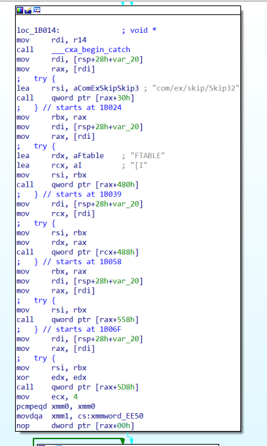

~~需要用frida hook获取值，这里frida还没学过先搁置~~。

frida已会一点：

~~~js
Java.perform(function() {
    var Skip32 = Java.use('com.ex.skip.Skip32');

    // 保存原始FTABLE的引用
    var originalFTABLE = Skip32.FTABLE.value;
    console.log(originalFTABLE);

    // Hook g函数
    var gFunc = Skip32.g;
    gFunc.implementation = function(arg3, arg4, arg5) {

        // 执行原始函数
        var result = this.call(arg3, arg4, arg5);

        // 调用后的FTABLE值
        console.log(originalFTABLE);

        console.log("g函数返回值: " + result);
        return result;
    };
});

~~~

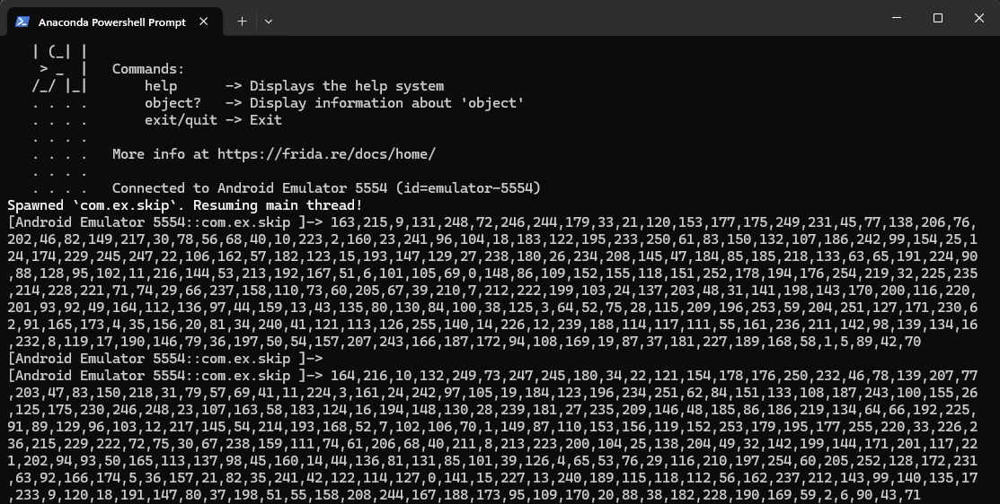

解密脚本很简单，skip32就是对称加密，只需要把skip32最后一个参数设置为0即可进行解密

~~~python
class Skip32:
    FTABLE = [164,216,10,132,249,73,247,245,180,34,22,121,154,178,176,250,232,46,78,139,207,77,203,47,83,150,218,31,79,57,69,41,11,224,3,161,24,242,97,105,19,184,123,196,234,251,62,84,151,133,108,187,243,100,155,26,125,175,230,246,248,23,107,163,58,183,124,16,194,148,130,28,239,181,27,235,209,146,48,185,86,186,219,134,64,66,192,225,91,89,129,96,103,12,217,145,54,214,193,168,52,7,102,106,70,1,149,87,110,153,156,119,152,253,179,195,177,255,220,33,226,236,215,229,222,72,75,30,67,238,159,111,74,61,206,68,40,211,8,213,223,200,104,25,138,204,49,32,142,199,144,171,201,117,221,202,94,93,50,165,113,137,98,45,160,14,44,136,81,131,85,101,39,126,4,65,53,76,29,116,210,197,254,60,205,252,128,172,231,63,92,166,174,5,36,157,21,82,35,241,42,122,114,127,0,141,15,227,13,240,189,115,118,112,56,162,237,212,143,99,140,135,17,233,9,120,18,191,147,80,37,198,51,55,158,208,244,167,188,173,95,109,170,20,88,38,182,228,190,169,59,2,6,90,43,71]

    @staticmethod
    def checkpass(password, key):
        target = [52, 0x8E, 0xE2, 0xAC, 108, 94, 80, 51, 11, 0xFB, 68, 0xA4, 0xE7, 6, 0x7C, 0xDF, 100, 62, 0x74, 70]
        password_array = target.copy()
        # password_array = Skip32.string_to_ascii_array(password)
        if len(password_array) != 20:
            return False

        for i in range(0, len(password_array), 4):
            block = (password_array[i] << 24) | (password_array[i + 1] << 16) | (password_array[i + 2] << 8) | password_array[i + 3]
            encrypted_block = Skip32.eee(block, key)
            password_array[i] = (encrypted_block >> 24) & 0xFF
            password_array[i + 1] = (encrypted_block >> 16) & 0xFF
            password_array[i + 2] = (encrypted_block >> 8) & 0xFF
            password_array[i + 3] = encrypted_block & 0xFF

        print("".join(map(chr, password_array)))
        for i in range(len(target)):
            if target[i] != password_array[i]:
                return False
        return True

    @staticmethod
    def eee(value, key):
        v = [(value >> 24) & 0xFF, (value >> 16) & 0xFF, (value >> 8) & 0xFF, value & 0xFF]
        Skip32.skip32(key, v, False)
        return (v[0] << 24) | (v[1] << 16) | (v[2] << 8) | v[3]

    @staticmethod
    def g(key, round, value):
        v5 = value & 0xFF
        v0 = (value >> 8) ^ Skip32.FTABLE[key[(round * 4) % 8] ^ v5]
        v5_1 = v5 ^ Skip32.FTABLE[key[((round * 4) + 1) % 8] ^ v0]
        v0_1 = v0 ^ Skip32.FTABLE[key[((round * 4) + 2) % 8] ^ v5_1]
        return (v0_1 << 8) | (Skip32.FTABLE[key[((round * 4) + 3) % 8] ^ v0_1] ^ v5_1)

    @staticmethod
    def skip32(key, data, encrypt):
        if encrypt:
            round_start, round_step = 0, 1
        else:
            round_start, round_step = 23, -1

        v3 = (data[0] << 8) | data[1]
        v5 = (data[2] << 8) | data[3]

        for _ in range(12):
            v5 ^= Skip32.g(key, round_start, v3) ^ round_start
            round_start += round_step
            v3 ^= Skip32.g(key, round_start, v5) ^ round_start
            round_start += round_step

        data[0] = (v5 >> 8) & 0xFF
        data[1] = v5 & 0xFF
        data[2] = (v3 >> 8) & 0xFF
        data[3] = v3 & 0xFF

    @staticmethod
    def string_to_ascii_array(s):
        return [ord(c) for c in s]

# 示例
if __name__ == "__main__":
    key = b"7d77cfe8"  # 8字节密钥，也就是前面的用户名8字节
    password = "testpassword12345678"  # 20字节密码

    skip32 = Skip32()
    result = skip32.checkpass(password, key)
~~~

最终答案是flag{username+password}

### mygo

纯恶心人的，上千行main只能动态一点点调试分析，也没啥逆向技术含金量

我把大概加密流程贴出来

* 输入字符串

* 检查长度30（输入a~z1~4来测试）

  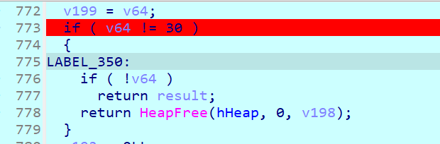

* 异或下标

  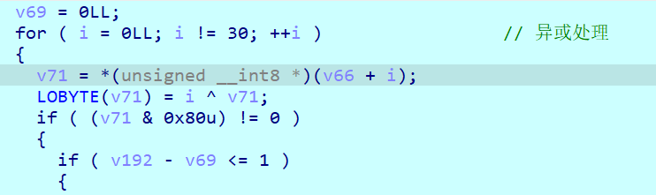

* 头尾不断交换

  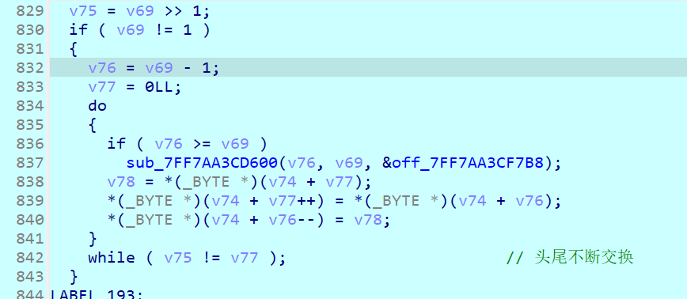

* 开始加载128位运算，载入的都是1~0xF，后面异或操作使得恢复原始字符串

  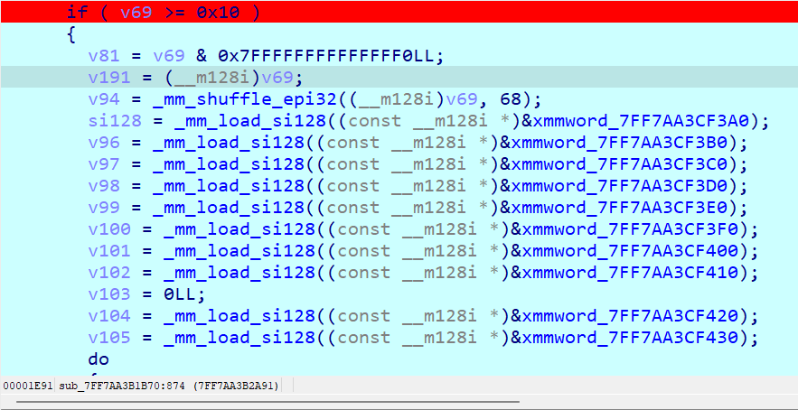

  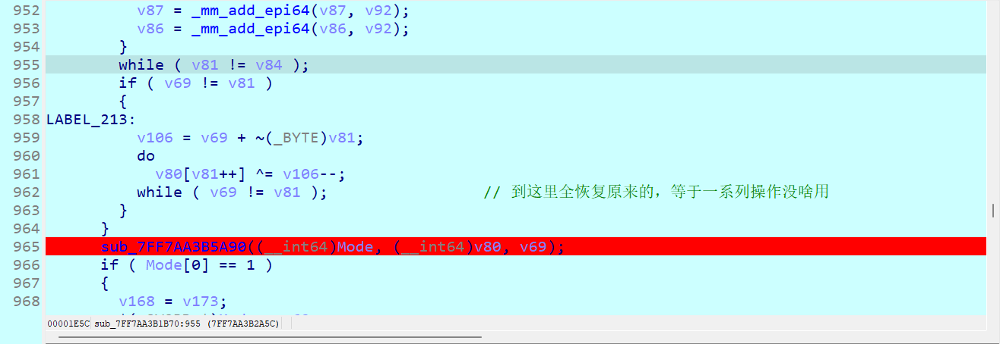

* 直到这里输入字符串都没变，开始取单字做乘法，但是qword会溢出所以有个截断

  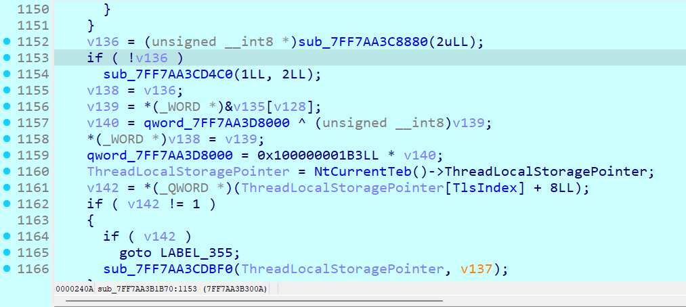

  此时只需要关注这个qword，发现他做的运算如下

  1. qword=0x100000001B3*(qword^input[i])&0xffffffffffffffff
  2. qword=0x100000001B3*(qword^input[i+1])&0xffffffffffffffff

  正好两两一组，相当于做了哈希

  后面有15组比较

  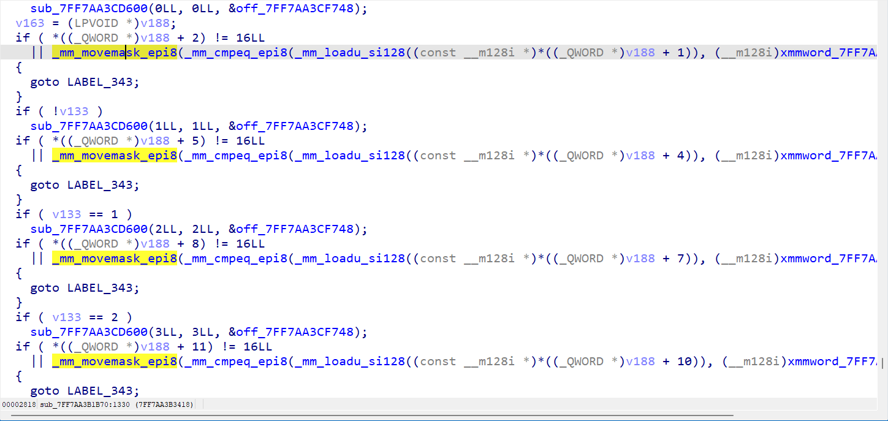

到这里就明了了，测试下发现正好是逆序

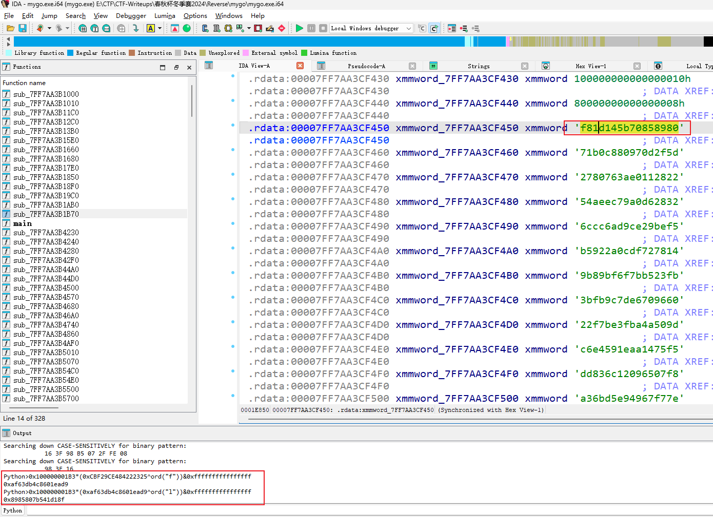

ok爆破启动

~~~python
from string import printable

qword = 0xCBF29CE484222325
s = "08985807b541d18fd5f2d079088c0b172282110ea367087223826d0a97ceea455feb92ec9da6ccc6418727fdc0a2295bbf325bb7f6fb98b90669076ed7c9bfb3d905a4abf3eb7f225f5741aae1954e6c8f70569021c638dde77f76949e5db63a7f98a3f5e1b1e3409b7cd1e5a8dea236d3c21142b990e7b8"

def brute(qword, i):
    q = qword
    for c1 in printable:
        for c2 in printable:
            q = qword
            q = 0x100000001B3 * (q ^ ord(c1)) & 0xffffffffffffffff
            q = 0x100000001B3 * (q ^ ord(c2)) & 0xffffffffffffffff
            if q == int(s[16*i:16*i+16], 16):
                return c1+c2, q

flag = ""
for i in range(15):
    f, qword = brute(qword, i)
    flag += f
print(flag)	# flag{BanGDream!ItsMyRust!!!!!}
~~~

### Nuitka

首先题目给的exe会在`C:\Users\xxx\AppData\Local\Temp\onefile_xxxx\`下生成新的exe以及python dll，查看可知程序是python打包过来的

还是动态调试不停的找输入点如下，这个函数里有“input”字符串且动调这里输入（测试字符为aaaaaaa），因此合理猜测当前函数是主函数

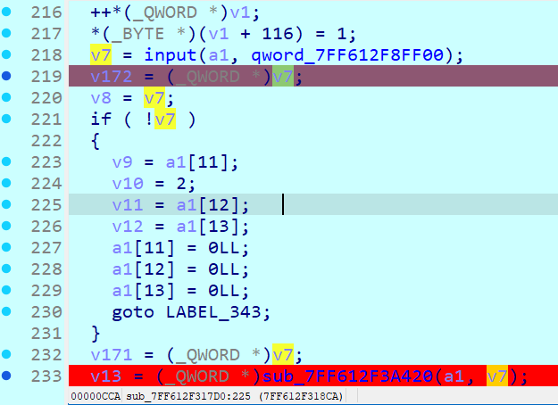

往下动调发现len函数

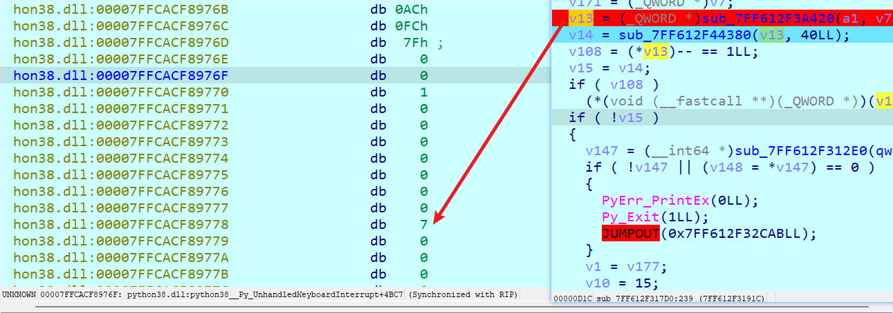

接着是cmp函数，发现要求输入长度为40否则v14、v15为0，进入if打印wrong并退出

重新输入40个a测试，发现进入大循环，下图这里出现了取值操作

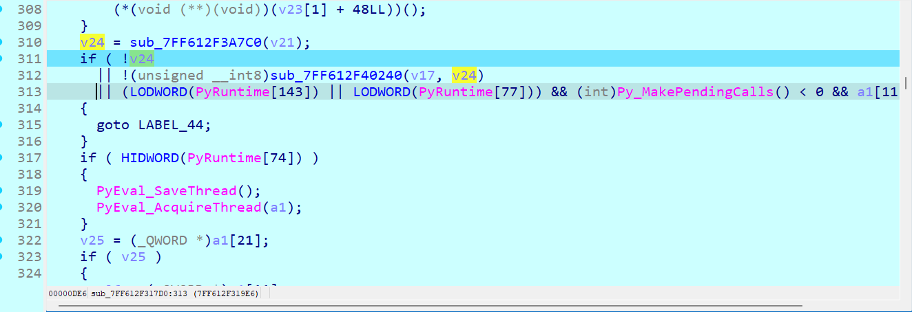

重复40次出来跑一段代码后再次进入新的while循环，碰到from_bytes

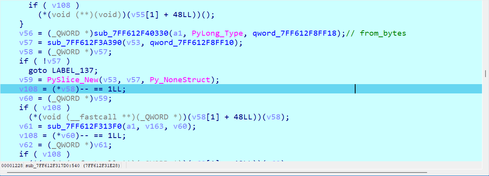

然后是little，基本可以推测出来int.from_bytes(bytes, "little")

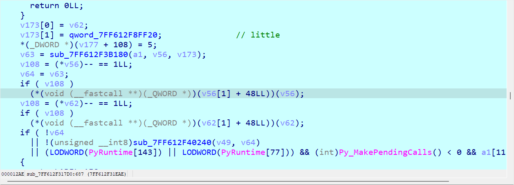

发现v63很可能是上面操作的返回值，但是值不是aaaa

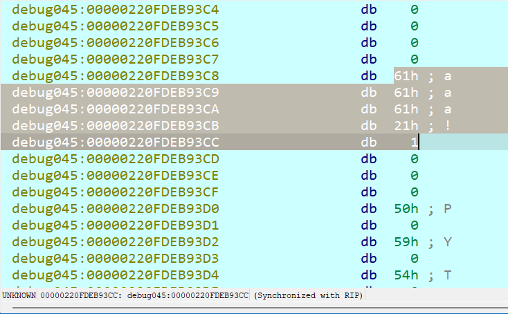

结合wp查了下。cython里貌似是30bits，所以0121相当于二进制00000001 00100001，本来是01100001，多出来的一位单独开了1字节

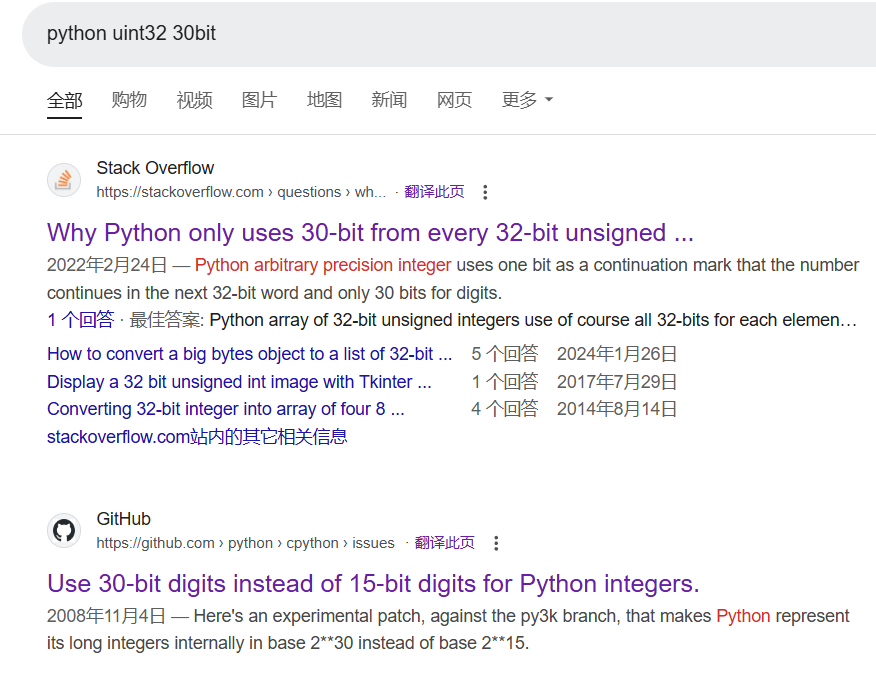

走完这个循环就是把40字节转为了10个unsigned int，一直走直到在进入一个循环，在里面发现了两个取值函数，取出0x61616161和0xf5138033（已转化）

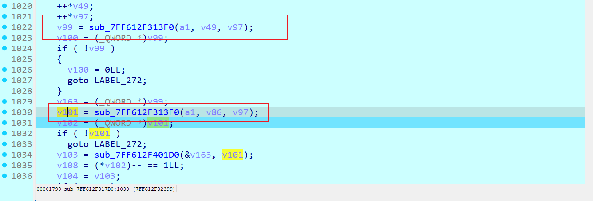

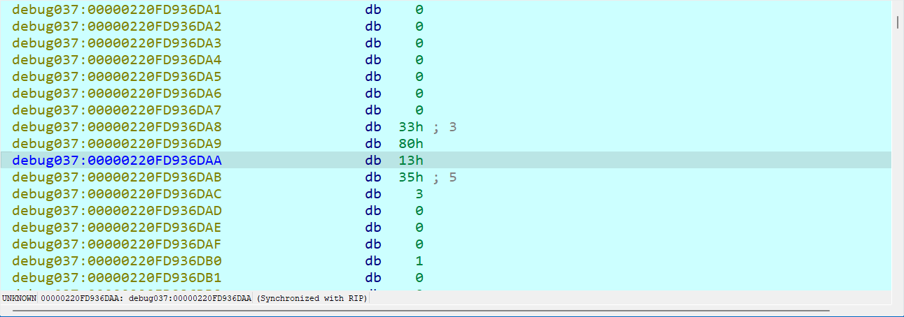

两个值都传入了sub_7FF612F401D0，看下函数里面的实现发现，确定是异或操作

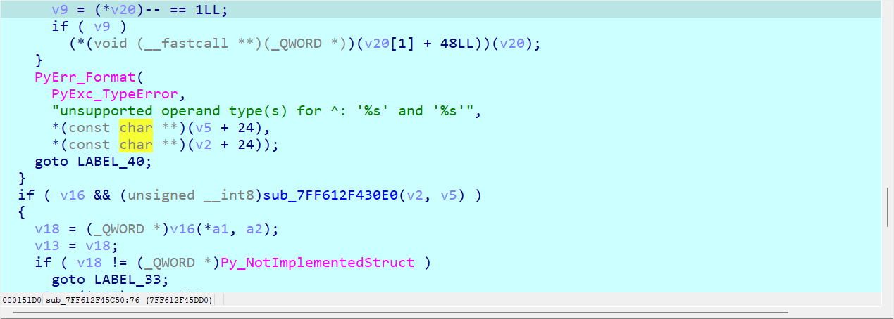

在下面的v100里找到了异或后的值

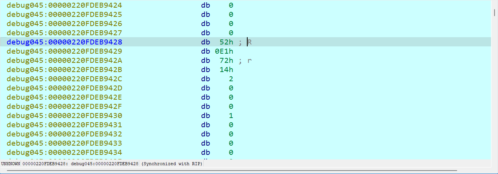

wp说的这两个一个异或值一个比较值列表，确实能找到列表里的值，但不知道怎么提取，只能硬扣了

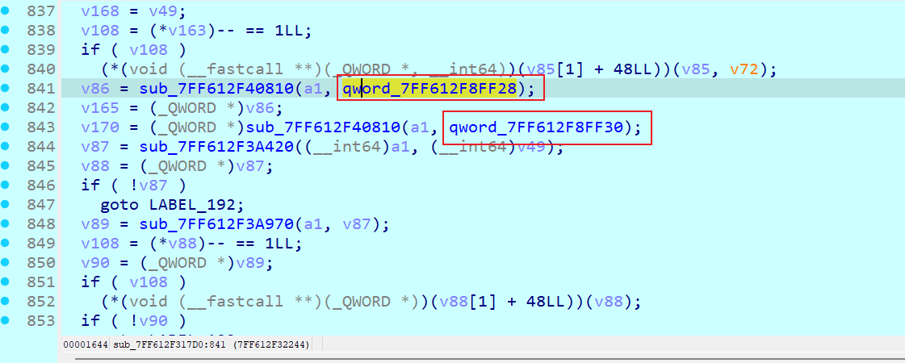

~~~python
xor = [0xf5138033, 0x985a0194, 0xb4C41B8F, 0x8B1E6089, 0x8DB7419B, 0xdC6873F3, 0x849FAA92, 0xb0D6B47E, 0xa3AD4395, 0xb3EA34C7]
cmp = [0x9272EC55, 0xa86F64EF, 0x8CA02DED, 0xbA2A4DEF, 0xe99A25FA, 0xf10B4BC2, 0xe2A89BF4, 0xd2E28553, 0x909920A3, 0xcEDD52A6]
for i in range(10):
    print(int.to_bytes(cmp[i]^xor[i], byteorder="little", length=4).decode(), end="")
~~~

总结下这种题做法：动态调试找输入点；找规律确定关键处理函数（有大段无用代码）；函数处理完返回值点进去找数据

很不喜欢这类题，感觉还没找到真正的做法，这题还是看着wp一点点猜函数和数据的才做出来的

### cpy

题目给了pyd和python脚本，脚本调用了pyd

~~~python
import encrypt
if encrypt.check(input("input flag:")):
    print("right flag!")    # python3.12才能跑起来
~~~

定位encrypt.check函数（直接搜字符串交叉引用）

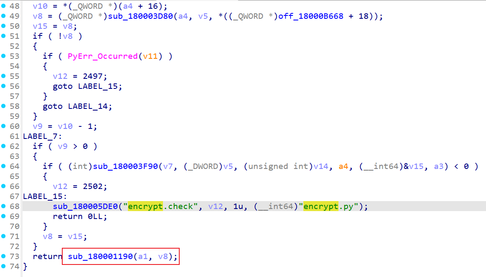

里面就一点点扣，找交叉引用

~~~c
// write access to const memory has been detected, the output may be wrong!
__int64 __fastcall sub_180001190(__int64 a1, _QWORD *a2)
{//...
  v2 = 0LL;
  v134 = 0LL;
  v3 = 0LL;
  v133 = 0LL;
  v4 = 0LL;
  v131 = 0LL;
  Item = 0LL;
  v132 = 0LL;
  v6 = 0LL;
  v136 = 0LL;
  v130 = 0LL;
  v8 = PyObject_Size(a2);
  if ( v8 == -1 )
  {
    v9 = 2;
    v10 = 2575;
    goto LABEL_135;
  }
  if ( v8 != 40 )//检查长度
  {
    result = Py_FalseStruct;
    if ( Py_FalseStruct != -1 )
    {
      ++Py_FalseStruct;
      return Py_FalseStruct;
    }
    return result;
  }
  v12 = PyList_New(5LL);
  if ( !v12 )
  {
    v9 = 4;
    v10 = 2606;
    goto LABEL_135;
  }
  v13 = off_18000B668;
  v14 = (_DWORD *)*((_QWORD *)off_18000B668 + 41);// 0xfbbc7f84591ff393
  if ( *v14 != -1 )
    ++*v14;
  **(_QWORD **)(v12 + 24) = v13[41];            // 0xfbbc7f84591ff393
  v15 = (_DWORD *)v13[38];
  if ( *v15 != -1 )
    ++*v15;
  *(_QWORD *)(*(_QWORD *)(v12 + 24) + 8LL) = v13[38];// 0x360c751ee6bd9abd
  v16 = (_DWORD *)v13[39];
  if ( *v16 != -1 )
    ++*v16;
  *(_QWORD *)(*(_QWORD *)(v12 + 24) + 16LL) = v13[39];// 0x60854fc80d82350a
  v17 = (_DWORD *)v13[37];
  if ( *v17 != -1 )
    ++*v17;
  *(_QWORD *)(*(_QWORD *)(v12 + 24) + 24LL) = v13[37];// 0x139692ebf3ee3c4f
  v18 = (_DWORD *)v13[40];
  if ( *v18 != -1 )
    ++*v18;
  v134 = v12;
  *(_QWORD *)(*(_QWORD *)(v12 + 24) + 32LL) = v13[40];// 0x8571b17650a42bd4
  v19 = PyList_New(4LL);
  if ( !v19 )
  {
    v9 = 5;
    v10 = 2633;
    goto LABEL_135;
  }
  v20 = off_18000B668;
  v21 = (_DWORD *)*((_QWORD *)off_18000B668 + 36);// 4132849165
  if ( *v21 != -1 )
    ++*v21;
  **(_QWORD **)(v19 + 24) = v20[36];
  v22 = (_DWORD *)v20[33];
  if ( *v22 != -1 )
    ++*v22;
  *(_QWORD *)(*(_QWORD *)(v19 + 24) + 8LL) = v20[33];// 3658760800
  v23 = (_DWORD *)v20[35];
  if ( *v23 != -1 )
    ++*v23;
  *(_QWORD *)(*(_QWORD *)(v19 + 24) + 16LL) = v20[35];// 4008823107
  v24 = (_DWORD *)v20[34];
  if ( *v24 != -1 )
    ++*v24;
  v133 = v19;
  *(_QWORD *)(*(_QWORD *)(v19 + 24) + 24LL) = v20[34];// 3828944742
  v25 = (_QWORD *)PyList_New(0LL);
  if ( !v25 )
  {
    v9 = 6;
    v10 = 2658;
    goto LABEL_119;
  }
  v26 = a2[1];
  v27 = -1LL;
  v135 = -1LL;
  if ( v26 == PyList_Type || v26 == PyTuple_Type )
  {
    Item = a2;
    if ( *(_DWORD *)a2 != -1 )
      ++*(_DWORD *)a2;
    v27 = 0LL;
  }
  else
  {
    Iter = PyObject_GetIter(a2);
    Item = (_QWORD *)Iter;
    if ( !Iter )
    {
      v9 = 6;
      v10 = 2665;
      goto LABEL_119;
    }
    v2 = *(__int64 (__fastcall **)(_QWORD *))(*(_QWORD *)(Iter + 8) + 224LL);
    if ( !v2 )
    {
      v9 = 6;
      v10 = 2667;
      goto LABEL_119;
    }
  }
  v29 = Item + 3;
  while ( !v2 )                                 // 循环，里面有ord操作
  {
    v30 = Item[2];
    if ( Item[1] == PyList_Type )
    {
      if ( v27 >= v30 )
        goto LABEL_94;
      v31 = *(_DWORD **)(Item[3] + 8 * v27);
      if ( *v31 != -1 )
        ++*v31;
      v29 = Item + 3;
      ++v27;
    }
    else
    {
      if ( v27 >= v30 )
      {
LABEL_94:
        v46 = 0;
        v6 = 0LL;
        goto LABEL_104;
      }
      v31 = (_DWORD *)v29[v27];
      if ( *v31 != -1 )
        ++*v31;
      ++v27;
    }
LABEL_51:
    v33 = v4;
    v4 = v31;
    if ( v33 )
    {
      if ( *v33 >= 0 )
      {
        v34 = (*(_QWORD *)v33)-- == 1LL;
        if ( v34 )
          Py_Dealloc(v33);
      }
    }
    v35 = *((_QWORD *)v4 + 1);
    v137 = 0LL;
    v36 = *(_DWORD *)(v35 + 168);
    if ( (v36 & 0x10000000) != 0 )
    {
      v37 = *((_QWORD *)v4 + 2);
      if ( v37 != 1 )
      {
        PyErr_Format(
          PyExc_ValueError,
          "only single character unicode strings can be converted to Py_UCS4, got length %zd",
          v37);
        v40 = 0xFFFFFFFFLL;
        goto LABEL_83;
      }
      v38 = v4[8];
      if ( (v38 & 0x1C) == 4 )
      {
        if ( (v38 & 0x20) != 0 )
        {
          if ( (v38 & 0x40) != 0 )
            v39 = (unsigned __int8 *)(v4 + 10);
          else
            v39 = (unsigned __int8 *)(v4 + 14);
        }
        else
        {
          v39 = (unsigned __int8 *)*((_QWORD *)v4 + 7);
        }
LABEL_82:
        v40 = *v39;
        goto LABEL_83;
      }
      if ( (v38 & 0x1C) == 8 )
      {
        if ( (v38 & 0x20) != 0 )
        {
          if ( (v38 & 0x40) != 0 )
            v40 = *((unsigned __int16 *)v4 + 20);
          else
            v40 = *((unsigned __int16 *)v4 + 28);
        }
        else
        {
          v40 = **((unsigned __int16 **)v4 + 7);
        }
      }
      else if ( (v38 & 0x20) != 0 )
      {
        if ( (v38 & 0x40) != 0 )
          v40 = (unsigned int)v4[10];
        else
          v40 = (unsigned int)v4[14];
      }
      else
      {
        v40 = **((unsigned int **)v4 + 7);
      }
    }
    else
    {
      if ( (v36 & 0x8000000) == 0 )
      {
        if ( v35 != PyByteArray_Type && !(unsigned int)PyType_IsSubtype() )
        {
          PyErr_Format(
            PyExc_TypeError,
            "ord() expected string of length 1, but %.200s found",
            *(_QWORD *)(*((_QWORD *)v4 + 1) + 24LL));
          goto LABEL_99;
        }
        v41 = *((_QWORD *)v4 + 2);
        if ( v41 != 1 )
        {
LABEL_98:
          PyErr_Format(PyExc_TypeError, "ord() expected a character, but string of length %zd found", v41);
LABEL_99:
          v10 = 2714;
LABEL_114:
          v9 = 6;
          if ( v4 )
          {
            if ( (int)*v4 >= 0 )
            {
              v34 = (*(_QWORD *)v4)-- == 1LL;
              if ( v34 )
                Py_Dealloc(v4);
            }
          }
          v6 = (int *)v137;
          goto LABEL_119;
        }
        v39 = (unsigned __int8 *)*((_QWORD *)v4 + 5);
        goto LABEL_82;
      }
      v41 = *((_QWORD *)v4 + 2);
      if ( v41 != 1 )
        goto LABEL_98;
      v40 = *((unsigned __int8 *)v4 + 32);
    }
LABEL_83:
    if ( (_DWORD)v40 == -1 )
      goto LABEL_99;
    v42 = (_DWORD *)PyLong_FromLong(v40);
    v137 = (__int64)v42;
    v43 = v42;
    if ( !v42 )
    {
      v10 = 2715;
      goto LABEL_114;
    }
    v44 = v25[2];
    if ( v25[4] <= v44 )
    {
      if ( (unsigned int)PyList_Append(v25, v42) )// 这里应该是ord列表
      {
        v10 = 2717;
        goto LABEL_114;
      }
      v43 = (_DWORD *)v137;
    }
    else
    {
      v45 = *v42 + 1;
      if ( v45 )
        *v43 = v45;
      *(_QWORD *)(v25[3] + 8 * v44) = v43;
      v25[2] = v44 + 1;
    }
    if ( (int)*v43 >= 0 )
    {
      v34 = (*(_QWORD *)v43)-- == 1LL;
      if ( v34 )
        Py_Dealloc(v43);
    }
  }
  v137 = v2(Item);
  v31 = (_DWORD *)v137;
  if ( v137 )
    goto LABEL_51;
  v47 = PyErr_Occurred(v32);
  if ( v47 )
  {
    if ( !(unsigned int)sub_1800062C0(v47, PyExc_StopIteration) )
    {
      v10 = 2706;
      goto LABEL_114;
    }
    PyErr_Clear();
  }
  v6 = 0LL;
  v46 = 0;
LABEL_104:
  if ( *(int *)Item >= 0 )
  {
    v34 = (*Item)-- == 1LL;
    if ( v34 )
      Py_Dealloc(Item);
  }
  if ( v4 )
  {
    if ( (int)*v4 >= 0 )
    {
      v34 = (*(_QWORD *)v4)-- == 1LL;
      if ( v34 )
        Py_Dealloc(v4);
    }
  }
  v48 = (int *)v25;
  v131 = (__int64)v25;
  v25 = 0LL;
  v49 = *((_QWORD *)v48 + 2);                   // 取长度
  if ( v49 == -1 )
  {
    v9 = 7;
    v10 = 2738;
    goto LABEL_135;
  }
  v56 = v49 % 8;                                // 
  v57 = 8 * ((v56 != 0) & (v56 >> 63));
  if ( v56 + v57 )
  {
    v58 = 8 - v56 - v57;
    v59 = v58;
    if ( v58 < 0 )
      v59 = 0LL;
    v25 = (_QWORD *)PyList_New(v59);
    if ( !v25 )
    {
      v9 = 8;
      v10 = 2751;
      goto LABEL_135;
    }
    v60 = 0LL;
    if ( v58 > 0 )
    {
      v61 = off_18000B668;
      do
      {
        v62 = (_DWORD *)v61[30];                // 0
        if ( *v62 != -1 )
          ++*v62;
        *(_QWORD *)(v25[3] + 8 * v60++) = v61[30];// 这里很明显补0
      }
      while ( v60 < v58 );
    }
    Item = (_QWORD *)PyNumber_Add(v48, v25);
    if ( !Item )
    {
      v9 = 8;
      v10 = 2760;
      goto LABEL_120;
    }
    if ( *(int *)v25 >= 0 )
    {
      v34 = (*v25)-- == 1LL;
      if ( v34 )
        Py_Dealloc(v25);
    }
    v63 = v48;
    v131 = (__int64)Item;
    v25 = 0LL;
    v48 = (int *)Item;
    if ( *v63 >= 0 )
    {
      v34 = (*(_QWORD *)v63)-- == 1LL;
      if ( v34 )
        Py_Dealloc(v63);
    }
  }
  Item = (_QWORD *)PyList_New(0LL);
  if ( !Item )
  {
    v9 = 9;
    v10 = 2783;
    goto LABEL_135;
  }
  v64 = *((_QWORD *)v48 + 2);
  if ( v64 == -1 )
  {
    v9 = 9;
    v10 = 2785;
    goto LABEL_124;
  }
  for ( i = 0LL; i < v64; v25 = 0LL )
  {
    v66 = *((_QWORD *)off_18000B668 + 19);
    v67 = *(__int64 (__fastcall **)(_QWORD, __int64))(PyLong_Type[1] + 144LL);
    if ( v67 )
      Attr = v67(PyLong_Type[0], v66);
    else
      Attr = PyObject_GetAttr(PyLong_Type[0], v66);
    v6 = (int *)Attr;
    if ( !Attr )
    {
      v130 = 0LL;
      v9 = 9;
      v10 = 2789;
      goto LABEL_124;
    }
    v69 = *((_QWORD *)v48 + 2);
    v70 = i;
    v71 = i + 8;
    if ( i < 0 )
    {
      v70 = v69 + i;
      if ( v69 + i < 0 )
        v70 = 0LL;
    }
    if ( v71 >= 0 )
    {
      if ( v71 > v69 )
        v71 = *((_QWORD *)v48 + 2);
    }
    else
    {
      v71 += v69;
    }
    v72 = v71 - v70;
    if ( v72 > 0 )
    {
      v74 = *((_QWORD *)v48 + 3) + 8 * v70;
      v75 = PyList_New(v72);
      v130 = (int *)v75;
      v73 = v75;
      if ( v75 )
      {
        v76 = *(_QWORD **)(v75 + 24);
        v77 = v74 - (_QWORD)v76;
        do
        {
          v78 = *(_DWORD **)((char *)v76 + v77);
          *v76 = v78;
          if ( *v78 != -1 )
            ++*v78;
          ++v76;
          --v72;
        }
        while ( v72 );
      }
      else
      {
        v73 = 0LL;
        v130 = 0LL;
      }
      v48 = (int *)v131;
    }
    else
    {
      v73 = PyList_New(0LL);
      v130 = (int *)v73;
    }
    if ( !v73 )
    {
      v9 = 9;
      v10 = 2791;
      goto LABEL_124;
    }
    v79 = 0LL;
    v80 = 0;
    if ( *((_QWORD *)v6 + 1) == PyMethod_Type )
    {
      v79 = (_DWORD *)*((_QWORD *)v6 + 3);
      if ( v79 )
      {
        v81 = (int *)*((_QWORD *)v6 + 2);
        if ( *v79 != -1 )
          ++*v79;
        if ( *v81 != -1 )
          ++*v81;
        v82 = v6;
        v6 = v81;
        if ( *v82 >= 0 )
        {
          v34 = (*(_QWORD *)v82)-- == 1LL;
          if ( v34 )
          {
            Py_Dealloc(v82);
            v73 = (__int64)v130;
          }
        }
        v80 = 1;
      }
    }
    v139[0] = v73;
    v138[1] = (__int64)v79;
    v139[1] = *((_QWORD *)off_18000B668 + 25);
    v25 = (_QWORD *)sub_180004330((__int64)v6, &v139[-v80], (unsigned int)(v80 + 2));
    if ( v79 )
    {
      if ( (int)*v79 >= 0 )
      {
        v34 = (*(_QWORD *)v79)-- == 1LL;
        if ( v34 )
          Py_Dealloc(v79);
      }
    }
    if ( *v130 >= 0 )
    {
      v34 = (*(_QWORD *)v130)-- == 1LL;
      if ( v34 )
        Py_Dealloc(v130);
    }
    v46 = 0;
    v130 = 0LL;
    if ( !v25 )
    {
      v9 = 9;
      v10 = 2812;
      goto LABEL_124;
    }
    if ( *v6 >= 0 )
    {
      v34 = (*(_QWORD *)v6)-- == 1LL;
      if ( v34 )
        Py_Dealloc(v6);
    }
    v83 = Item[2];
    v6 = 0LL;
    if ( Item[4] <= v83 )
    {
      if ( (unsigned int)PyList_Append(Item, v25) )
      {
        v9 = 9;
        v10 = 2816;
        goto LABEL_120;
      }
    }
    else
    {
      if ( *(_DWORD *)v25 != -1 )
        ++*(_DWORD *)v25;
      *(_QWORD *)(Item[3] + 8 * v83) = v25;
      Item[2] = v83 + 1;
    }
    if ( *(int *)v25 >= 0 )
    {
      v34 = (*v25)-- == 1LL;
      if ( v34 )
        Py_Dealloc(v25);
    }
    i += 8LL;                                   // 这里循环操作是每八个一组加到了item
  }
  v84 = Item;
  v131 = (__int64)Item;
  if ( *v48 >= 0 )
  {
    v34 = (*(_QWORD *)v48)-- == 1LL;
    if ( v34 )
      Py_Dealloc(v48);
  }
  v85 = Item[2];
  if ( v85 == -1 )
  {
    v9 = 10;
    v10 = 2830;
    goto LABEL_135;
  }
  v86 = 0LL;
  if ( v85 <= 0 )
    goto LABEL_311;
  while ( 2 )
  {
    v87 = v86;
    if ( v86 < 0 )
      v87 = v86 + v84[2];
    if ( v87 >= v84[2] )
    {
      v88 = PyLong_FromSsize_t(v86);            // 下标，后面还有个判断范围
      v89 = (int *)v88;
      if ( v88 )
      {
        Item = (_QWORD *)PyObject_GetItem(v84, v88);// 从前面的新数组里取出
        if ( *v89 >= 0 )
        {
          v34 = (*(_QWORD *)v89)-- == 1LL;
          if ( v34 )
            Py_Dealloc(v89);
        }
      }
      else
      {
        Item = 0LL;
      }
    }
    else
    {
      Item = *(_QWORD **)(v84[3] + 8 * v87);
      if ( *(_DWORD *)Item != -1 )
        ++*(_DWORD *)Item;
    }
    if ( !Item )
    {
      v9 = 11;
      v10 = 2842;
      goto LABEL_119;
    }
    v90 = v3;
    v3 = (int *)Item;
    if ( v90 )
    {
      if ( *v90 >= 0 )
      {
        v34 = (*(_QWORD *)v90)-- == 1LL;
        if ( v34 )
          Py_Dealloc(v90);
      }
    }
    v91 = 0;
    while ( 2 )
    {
      v92 = PyLong_FromLong((unsigned int)v91);
      Item = (_QWORD *)v92;
      if ( !v92 )
      {
        v9 = 12;
        v10 = 2855;
        goto LABEL_119;
      }
      v94 = v132;
      v132 = (int *)v92;
      if ( v94 )
      {
        if ( *v94 >= 0 )
        {
          v34 = (*(_QWORD *)v94)-- == 1LL;
          if ( v34 )
            Py_Dealloc(v94);
        }
      }
      v95 = *((_QWORD *)off_18000B668 + 32);    // 62
      if ( *((_QWORD *)v3 + 1) != PyLong_Type[0] )
      {
        v97 = PyNumber_Rshift(v3, *((_QWORD *)off_18000B668 + 32));// 取出的值右移62位，等于只有前2位
LABEL_254:
        Item = (_QWORD *)v97;
        goto LABEL_255;
      }
      v96 = *((_QWORD *)v3 + 2);
      if ( (v96 & 1) == 0 )
      {
        if ( v96 >= 0x10 )
        {
          switch ( (v96 >> 3) * (1 - (*((_QWORD *)v3 + 2) & 3LL)) )
          {
            case 0xFFFFFFFFFFFFFFFEuLL:
              v97 = PyLong_FromLongLong(
                      -(__int64)((unsigned int)v3[6] | ((unsigned __int64)(unsigned int)v3[7] << 30)) >> 62,
                      0x180000000uLL,
                      v93,
                      v95);
              break;
            case 2uLL:
              v97 = PyLong_FromLongLong(
                      (__int64)((unsigned __int64)(unsigned int)v3[7] << 30) >> 62,
                      0x180000000uLL,
                      v93,
                      v95);
              break;
            default:
              v97 = (*(__int64 (__fastcall **)(int *, _QWORD))(PyLong_Type[12] + 96LL))(
                      v3,
                      *((_QWORD *)off_18000B668 + 32));// 62
              break;
          }
        }
        else
        {
          v97 = PyLong_FromLong((unsigned int)((int)(v3[6] * (1 - (v96 & 3))) >> 31));
        }
        goto LABEL_254;
      }
      if ( *v3 != -1 )
        ++*v3;
      Item = v3;
LABEL_255:
      if ( !Item )                              // 上面右移完正常直接跳转到这里
      {
        v9 = 13;
        v10 = 2867;
        goto LABEL_119;
      }
      v98 = v136;
      v99 = (__int64)Item;
      v136 = (int *)Item;
      if ( v98 )
      {
        if ( *v98 >= 0 )
        {
          v34 = (*(_QWORD *)v98)-- == 1LL;
          if ( v34 )
            Py_Dealloc(v98);
        }
      }
      v100 = *((_QWORD *)off_18000B668 + 31);   // 2
      if ( *((_QWORD *)v3 + 1) != PyLong_Type[0] )
        goto LABEL_276;                         // 类似上面要跳转的
      v101 = *((_QWORD *)v3 + 2);
      if ( (v101 & 1) == 0 )
      {
        if ( v101 >= 0x10 )
        {
          switch ( (v101 >> 3) * (1 - (*((_QWORD *)v3 + 2) & 3LL)) )
          {
            case 0xFFFFFFFFFFFFFFFEuLL:
              v103 = -(__int64)((unsigned int)v3[6] | ((unsigned __int64)(unsigned int)v3[7] << 30));
              goto LABEL_273;
            case 2uLL:
              v103 = (unsigned int)v3[6] | ((unsigned __int64)(unsigned int)v3[7] << 30);
              goto LABEL_273;
            default:
              v104 = (*(__int64 (__fastcall **)(int *, _QWORD))(PyLong_Type[12] + 88LL))(
                       v3,
                       *((_QWORD *)off_18000B668 + 31));
              break;
          }
          goto LABEL_277;
        }
        v102 = v3[6] * (1 - (v101 & 3));
        if ( v102 == (4 * v102) >> 2 || !v102 )
        {
          v104 = PyLong_FromLong((unsigned int)(4 * v102));
LABEL_277:
          Item = (_QWORD *)v104;                // 左移2位后到这
          goto LABEL_278;
        }
        v103 = v102;
LABEL_273:
        if ( v103 == (__int64)(4 * v103) >> 2 )
        {
          v104 = PyLong_FromLongLong(4 * v103, v103, v93, v100);
          goto LABEL_277;
        }
LABEL_276:
        v104 = PyNumber_InPlaceLshift(v3, *((_QWORD *)off_18000B668 + 31));// 左移2位
        goto LABEL_277;
      }
      if ( *v3 != -1 )
        ++*v3;
      Item = v3;
LABEL_278:
      if ( !Item )                              // 左移2位到那边再到这
      {
        v9 = 14;
        v10 = 2879;
        goto LABEL_119;
      }
      v105 = v3;
      v3 = (int *)Item;                         // 把原始数据改了
      if ( *v105 >= 0 )
      {
        v34 = (*(_QWORD *)v105)-- == 1LL;
        if ( v34 )
          Py_Dealloc(v105);
      }
      v106 = PyNumber_InPlaceAnd(Item, *((_QWORD *)off_18000B668 + 42), v93, v100);// &0xffffffffffffffff
      Item = (_QWORD *)v106;
      if ( !v106 )
      {
        v9 = 15;
        v10 = 2891;
        goto LABEL_119;
      }
      v107 = v3;
      v3 = (int *)v106;                         // 再次修改值
      if ( *v107 >= 0 )
      {
        v34 = (*(_QWORD *)v107)-- == 1LL;
        if ( v34 )
          Py_Dealloc(v107);
      }
      v108 = sub_180004660(v133, v99);          // 取出值，v133数组正好是前面那个长度为4的列表
      Item = (_QWORD *)v108;                    // v99正好是上面8字节右移62位后的结果，相当于根据不同下标值取值
      if ( !v108 )
      {
        v9 = 16;
        v10 = 2903;
        goto LABEL_119;
      }
      v109 = PyNumber_InPlaceXor(v3, v108);     // 做了异或
      if ( !v109 )
      {
        v9 = 16;
        v10 = 2905;
        goto LABEL_124;
      }
      if ( *(int *)Item >= 0 )
      {
        v34 = (*Item)-- == 1LL;
        if ( v34 )
          Py_Dealloc(Item);
      }
      v110 = v3;
      v3 = (int *)v109;                         // 再次修改
      if ( *v110 >= 0 )
      {
        v34 = (*(_QWORD *)v110)-- == 1LL;
        if ( v34 )
          Py_Dealloc(v110);
      }
      v46 = 0;
      ++v91;
      v25 = 0LL;
      if ( v91 < 32 )                           // 这里知道了循环32次，且发现v3没有做下标变化，等于一直在加密
        continue;
      break;
    }
    v84 = (_QWORD *)v131;
    if ( v86 < 0 )
      v111 = v86 + *(_QWORD *)(v131 + 16);
    else
      v111 = v86;
    if ( v111 >= *(_QWORD *)(v131 + 16) )
    {
      v113 = PyLong_FromSsize_t(v86);
      v114 = (int *)v113;
      if ( !v113 )
        goto LABEL_313;
      v115 = PyObject_SetItem(v131, v113, v3);
      if ( *v114 >= 0 )
      {
        v34 = (*(_QWORD *)v114)-- == 1LL;
        if ( v34 )
          Py_Dealloc(v114);
      }
      if ( v115 < 0 )
      {
LABEL_313:
        v9 = 17;
        v10 = 2919;
        goto LABEL_135;
      }
      v46 = 0;
    }
    else
    {
      v112 = *(int **)(8 * v111 + *(_QWORD *)(v131 + 24));
      if ( *v3 != -1 )
        ++*v3;
      *(_QWORD *)(8 * v111 + *(_QWORD *)(v131 + 24)) = v3;
      if ( *v112 >= 0 )
      {
        v34 = (*(_QWORD *)v112)-- == 1LL;
        if ( v34 )
          Py_Dealloc(v112);
      }
    }
    if ( ++v86 < v85 )                          // 判断是否超出新数组长度
      continue;
    break;
  }
LABEL_311:
  v116 = v84[2];
  if ( v116 == -1 )
  {
    v9 = 18;
    v10 = 2929;
    goto LABEL_135;
  }
  v117 = PyLong_FromSsize_t(v116);
  v25 = (_QWORD *)v117;
  if ( !v117 )
  {
    v9 = 18;
    v10 = 2930;
    goto LABEL_135;
  }
  v138[0] = v117;
  Item = (_QWORD *)sub_180004330(qword_18000BE08, v138, 0x8000000000000001uLL);
  if ( !Item )
  {
    v9 = 18;
    v10 = 2932;
    goto LABEL_120;
  }
  if ( *(int *)v25 >= 0 )
  {
    v34 = (*v25)-- == 1LL;
    if ( v34 )
      Py_Dealloc(v25);
  }
  v118 = Item[1];
  if ( v118 == PyList_Type || v118 == PyTuple_Type )
  {
    v25 = Item;
    if ( *(_DWORD *)Item != -1 )
      ++*(_DWORD *)Item;
    v121 = 0LL;
    v135 = 0LL;
    v120 = 0LL;
  }
  else
  {
    v119 = PyObject_GetIter(Item);
    v25 = (_QWORD *)v119;
    if ( !v119 )
    {
      v9 = 18;
      v10 = 2940;
      goto LABEL_124;
    }
    v120 = *(__int64 (__fastcall **)(_QWORD *))(*(_QWORD *)(v119 + 8) + 224LL);
    if ( !v120 )
    {
      v9 = 18;
      v10 = 2942;
      goto LABEL_120;
    }
    v121 = -1LL;
  }
  if ( *(int *)Item >= 0 )
  {
    v34 = (*Item)-- == 1LL;
    if ( v34 )
      Py_Dealloc(Item);
  }
  v122 = v25 + 3;
  while ( 2 )
  {
    if ( !v120 )
    {
      if ( v121 >= v25[2] )
        goto LABEL_383;
      if ( v25[1] == PyList_Type )
      {
        v122 = v25 + 3;
        Item = *(_QWORD **)(v25[3] + 8 * v121);
      }
      else
      {
        Item = (_QWORD *)v122[v121];
      }
      if ( *(_DWORD *)Item != -1 )
        ++*(_DWORD *)Item;
      v135 = v121 + 1;
LABEL_351:
      v124 = v132;
      v125 = (__int64)Item;
      v132 = (int *)Item;
      if ( v124 )
      {
        if ( *v124 >= 0 )
        {
          v34 = (*(_QWORD *)v124)-- == 1LL;
          if ( v34 )
            Py_Dealloc(v124);
        }
      }
      Item = (_QWORD *)sub_180004660(v131, (__int64)Item);// 取出
      if ( !Item )
      {
        v9 = 19;
        v10 = 2998;
        goto LABEL_119;
      }
      v126 = sub_180004660(v134, v125);
      v6 = (int *)v126;
      if ( !v126 )
      {
        v9 = 19;
        v10 = 3000;
        goto LABEL_119;
      }
      v130 = (int *)PyObject_RichCompare(Item, v126, 3LL);// 比较
      v127 = v130;
      if ( !v130 )
      {
        v9 = 19;
        v10 = 3002;
        goto LABEL_119;
      }
      if ( *(int *)Item >= 0 )
      {
        v34 = (*Item)-- == 1LL;
        if ( v34 )
        {
          Py_Dealloc(Item);
          v127 = v130;
        }
      }
      Item = 0LL;
      if ( *v6 >= 0 )
      {
        v34 = (*(_QWORD *)v6)-- == 1LL;
        if ( v34 )
        {
          Py_Dealloc(v6);
          v127 = v130;
        }
      }
      v6 = 0LL;
      LOBYTE(v46) = v127 == (int *)Py_TrueStruct;
      if ( !(v46 | (v127 == (int *)Py_FalseStruct || v127 == (int *)Py_NoneStruct)) )
      {
        IsTrue = PyObject_IsTrue(v127);
        v127 = v130;
        v46 = IsTrue;
      }
      if ( v46 < 0 )
      {
        v9 = 19;
        v10 = 3005;
        goto LABEL_119;
      }
      if ( *v127 >= 0 )
      {
        v34 = (*(_QWORD *)v127)-- == 1LL;
        if ( v34 )
          Py_Dealloc(v127);
      }
      v34 = v46 == 0;
      v130 = 0LL;
      v46 = 0;
      v121 = v135;
      if ( !v34 )
      {
        if ( Py_FalseStruct != -1 )
          ++Py_FalseStruct;
        v53 = Py_FalseStruct;
        if ( *(int *)v25 >= 0 )
        {
          v34 = (*v25)-- == 1LL;
          if ( v34 )
            Py_Dealloc(v25);
        }
LABEL_389:
        v52 = (int *)v134;
        v54 = (int *)v133;
        v55 = v132;
        v50 = v136;
        v51 = (int *)v131;
        goto LABEL_390;
      }
      continue;
    }
    break;
  }
  Item = (_QWORD *)v120(v25);
  if ( Item )
    goto LABEL_351;
  v129 = PyErr_Occurred(v123);
  if ( !v129 )
    goto LABEL_383;
  if ( (unsigned int)sub_1800062C0(v129, PyExc_StopIteration) )
  {
    PyErr_Clear();
LABEL_383:
    if ( *(int *)v25 >= 0 )
    {
      v34 = (*v25)-- == 1LL;
      if ( v34 )
        Py_Dealloc(v25);
    }
    if ( Py_TrueStruct != -1 )
      ++Py_TrueStruct;
    v53 = Py_TrueStruct;                        // 这是返回值
    goto LABEL_389;
  }
  v9 = 18;
  v10 = 2982;
LABEL_119:
  if ( v25 )
  {
LABEL_120:
    if ( *(int *)v25 >= 0 )
    {
      v34 = (*v25)-- == 1LL;
      if ( v34 )
        Py_Dealloc(v25);
    }
  }
  if ( Item )
  {
LABEL_124:
    if ( *(int *)Item >= 0 )
    {
      v34 = (*Item)-- == 1LL;
      if ( v34 )
        Py_Dealloc(Item);
    }
  }
  if ( v6 )
  {
    if ( *v6 >= 0 )
    {
      v34 = (*(_QWORD *)v6)-- == 1LL;
      if ( v34 )
        Py_Dealloc(v6);
    }
  }
  if ( v130 )
  {
    if ( *v130 >= 0 )
    {
      v34 = (*(_QWORD *)v130)-- == 1LL;
      if ( v34 )
        Py_Dealloc(v130);
    }
  }
LABEL_135:
  v50 = v136;
  v51 = (int *)v131;
  sub_180005DE0("encrypt.check", v10, v9, (__int64)"encrypt.py");
  v52 = (int *)v134;
  v53 = 0LL;
  v54 = (int *)v133;
  v55 = v132;
  if ( v134 )
  {
LABEL_390:
    if ( *v52 >= 0 )
    {
      v34 = (*(_QWORD *)v52)-- == 1LL;
      if ( v34 )
        Py_Dealloc(v52);
    }
  }
  if ( v54 )
  {
    if ( *v54 >= 0 )
    {
      v34 = (*(_QWORD *)v54)-- == 1LL;
      if ( v34 )
        Py_Dealloc(v54);
    }
  }
  if ( v51 )
  {
    if ( *v51 >= 0 )
    {
      v34 = (*(_QWORD *)v51)-- == 1LL;
      if ( v34 )
        Py_Dealloc(v51);
    }
  }
  if ( v3 )
  {
    if ( *v3 >= 0 )
    {
      v34 = (*(_QWORD *)v3)-- == 1LL;
      if ( v34 )
        Py_Dealloc(v3);
    }
  }
  if ( v55 )
  {
    if ( *v55 >= 0 )
    {
      v34 = (*(_QWORD *)v55)-- == 1LL;
      if ( v34 )
        Py_Dealloc(v55);
    }
  }
  if ( v50 && *v50 >= 0 )
  {
    v34 = (*(_QWORD *)v50)-- == 1LL;
    if ( v34 )
      Py_Dealloc(v50);
  }
  return v53;
}
~~~

写个python正向+逆向脚本即可

~~~python
xor_list = [0xf656460d, 0xda144260, 0xeef1c943, 0xe4390f66]
cmp_list = [0xfbbc7f84591ff393, 0x360c751ee6bd9abd, 0x60854fc80d82350a, 0x139692ebf3ee3c4f, 0x8571b17650a42bd4]
# input_list = []
# input_list1 = [int.from_bytes(input_list[i:i+8], 'little', ) for i in range(0, len(input_list), 8)]
# for data in input_list1:
#     for i in range(32):
#         idx = data & 3
#         data <<= 2
#         data &= 0xffffffffffffffff
#         data ^= xor_list[idx]

for data in cmp_list:
    for i in range(32):
        idx = data & 3
        if idx == 0:
            data ^= xor_list[1]
            data = (data >> 2) | (1 << 62)
        elif idx == 1:
            data ^= xor_list[0]
            data = (data >> 2) | (0 << 62)
        elif idx == 2:
            data ^= xor_list[3]
            data = (data >> 2) | (3 << 62)
        else:
            data ^= xor_list[2]
            data = (data >> 2) | (2 << 62)
    print(data.to_bytes(8, 'little').decode(), end="")
~~~

### Pyhumor

0解题，但我花了一下午做出来，当时没去看很可惜了

这道题一看到pyhumor我就想起来TFCCTF 2024的一道[题目](http://blog.wxxpersonal.top/archives/2024-tfcctf-re-fu-xian#mcknight)，当时以为特别难没去做，给了pyd还有什么pytransform

但是我去使用pyarmor-unpacker方法3发现导出的pyc没法反编译，试了很久都不行还github找了很多其他工具都不管用，最后就去尝试pyarmor-unpacker里的方法2注入dll竟然发现可以了

需要：

* [code.py](https://github.com/Svenskithesource/PyArmor-Unpacker/blob/main/methods/method%202/code.py)
* https://github.com/call-042PE/PyInjector
* [process hacker](https://sourceforge.net/projects/processhacker/files/processhacker2/processhacker-2.39-setup.exe/download)
* 注入dll的[视频教程](https://www.youtube.com/watch?v=NkFs7A0q4DM)

运行完后可以拿到pyc且反编译成功拿到源码

~~~python
# Source Generated with Decompyle++
# File: out.pyc (Python 3.10)

__humor_enter__()

try:
    from hashlib import sha256
    from functools import reduce
    flag = input('Enter your flag: ')
    group_1 = [
        int.from_bytes(flag[1::3].encode(), 'big') % 998244353 == 156881262,
        sha256(flag[-16:].encode()).hexdigest().endswith('dcf56476457880bf5b39b295416f267b7a636324baeae1fd'),
        reduce((lambda x, y: x ^ y), map(ord, flag)) == 2]
    if not all(group_1):
        print('Wrong')
        exit(1)
    acc = 0
    for i in flag:
        i = ord(i) ^ 85
        acc |= i
        acc <<= 7 if i & 1 else 8
    if acc == 0xCDCB4322E6C376CC4C2D8C199E0D1818D8F861C788CFC181BE067F06380CF318EDD8CF98D98D9A800:
        print('Right')
finally:
    return None
    print('Wrong')
    exit(1)
    return None
    print('Stop reverse engineering me, enjoy your day :)')
    exit(1)
    return None

~~~

前半部分是校验，后面是加密

~~~python
from functools import reduce
from hashlib import sha256

acc = 0xCDCB4322E6C376CC4C2D8C199E0D1818D8F861C788CFC181BE067F06380CF318EDD8CF98D98D9A800
flag = ""
while acc:
    acc >>= 7
    if acc & 1 == 0:
        acc >>= 1
    flag += chr((acc^85)&0x7f)
flag = flag[::-1][1:]
print(flag)	# flag{9bc74ce3-a56d-467f-eb52-d5f3d8923c6f}
group_1 = [
        int.from_bytes(flag[1::3].encode(), 'big') % 998244353 == 156881262,
        sha256(flag[-16:].encode()).hexdigest().endswith('dcf56476457880bf5b39b295416f267b7a636324baeae1fd'),
        reduce((lambda x, y: x ^ y), map(ord, flag)) == 2]
if not all(group_1):
    print('Wrong')
    exit(1)
else:
    print('Correct')
~~~

### ooooore

需要patch下花指令，两种

~~~python
import idaapi
import idautils
import idc

# 定义要查找的模式和替换的字节
pattern = "E8 00 00 00 00 48 83 04 24 08 C3 E8 90 90 90" # 0F 85 06 00 00 00 0F 84 01 00 00 00 21
cur_addr = 0x10B0
end_addr = 0x7378

# 将模式转换为字节数组
pattern_bytes = bytes.fromhex(pattern.replace(" ", ""))
pattern_length = len(pattern_bytes)

# 遍历指定地址范围
for addr in range(cur_addr, end_addr):
    # 读取当前地址的字节
    if idc.get_wide_byte(addr) == pattern_bytes[0]:
        # 检查后续字节是否匹配模式
        if idc.get_bytes(addr, pattern_length) == pattern_bytes:
            # 替换为NOP（0x90）
            idaapi.patch_bytes(addr, b'\x90' * pattern_length)
            print(f"Patched at address: {hex(addr)}")

print("Patching complete.")
~~~

patch完可以很明显看出来是控制流平坦化，但是D810不知道为啥没法用，只能硬分析，发现两处地方改变输入值

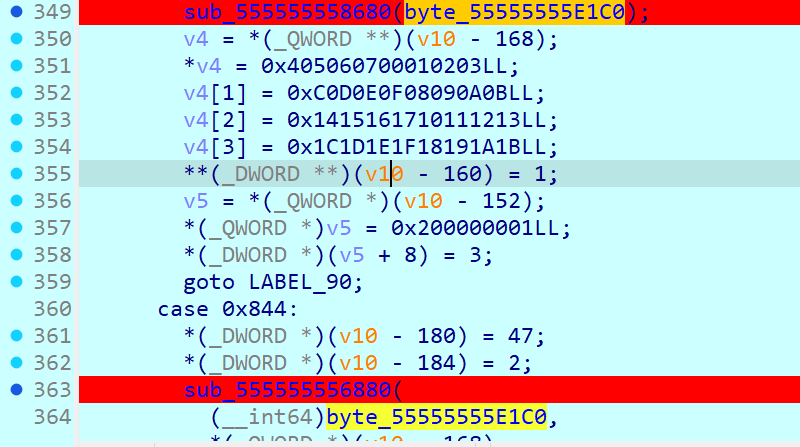

第一个函数里有rc4的字样，猜测单字节加密，测试下

~~~
aaaaaaaaaaaaaaaaaaaaaaaaaaaaaaaaaaaaaaaaaa
dnkcdcbjbdkiihhdkme`gdii`ckikimidkcekc`eec
[0x86, 0xE0, 0x7E, 0x29, 0x89, 0xB6, 0x37, 0xDB, 0x43, 0xE7, 0xCA, 0x13, 0xAE, 0xB8, 0x79, 0x8D, 0xA8, 0xCE, 0x09, 0x33, 0xAC, 0xD8, 0xFD, 0x2D, 0x28, 0x31, 0x62, 0xD7, 0xCC, 0x81, 0x41, 0xA8, 0x76, 0x3A, 0xC1, 0x01, 0xD5, 0x02, 0xE5, 0x45, 0xD2, 0x81, 0x00, 0x00, 0x00, 0x00, 0x00, 0x00, 0x00, 0x00, 0x00, 0x00, 0x00, 0x00, 0x00, 0x00, 0x00, 0x00, 0x00, 0x00, 0x00, 0x00, 0x00, 0x00]
~~~

~~~
baaaaaaaaaaaaaaaaaaaaaaaaaaaaaaaaaaaaaaaaa
gnkcdcbjbdkiihhdkme`gdii`ckikimidkcekc`eec
[0x85, 0xE0, 0x7E, 0x29, 0x89, 0xB6, 0x37, 0xDB, 0x43, 0xE7, 0xCA, 0x13, 0xAE, 0xB8, 0x79, 0x8D, 0xA8, 0xCE, 0x09, 0x33, 0xAC, 0xD8, 0xFD, 0x2D, 0x28, 0x31, 0x62, 0xD7, 0xCC, 0x81, 0x41, 0xA8, 0x76, 0x3A, 0xC1, 0x01, 0xD5, 0x02, 0xE5, 0x45, 0xD2, 0x81, 0x00, 0x00, 0x00, 0x00, 0x00, 0x00, 0x00, 0x00, 0x00, 0x00, 0x00, 0x00, 0x00, 0x00, 0x00, 0x00, 0x00, 0x00, 0x00, 0x00, 0x00, 0x00]
~~~

没问题，而且ord("a")^ord("d")==ord("b")^ord("g")，基本确定里面最后相当于异或，第二个加密分析同理

因此可以直接计算出异或值，找到最终cmp的值即可

~~~python
cmp = [0x81, 0xED, 0x7E, 0x2F, 0x93, 0xB6, 0x6F, 0x8D, 0x43, 0xE5, 0xC9, 0x11, 0xA9, 0xF4, 0x2B, 0xDB, 0xAD, 0xCB, 0x45, 0x66, 0xFA, 0xDF, 0xA9, 0x61, 0x28, 0x65, 0x31, 0xD7, 0x80, 0xD5, 0x18, 0xFE, 0x25, 0x6E, 0x94, 0x05, 0x83, 0x51, 0xB5, 0x42, 0xD2, 0x9D]
out = [0x86, 0xE0, 0x7E, 0x29, 0x89, 0xB6, 0x37, 0xDB, 0x43, 0xE7, 0xCA, 0x13, 0xAE, 0xB8, 0x79, 0x8D, 0xA8, 0xCE, 0x09, 0x33, 0xAC, 0xD8, 0xFD, 0x2D, 0x28, 0x31, 0x62, 0xD7, 0xCC, 0x81, 0x41, 0xA8, 0x76, 0x3A, 0xC1, 0x01, 0xD5, 0x02, 0xE5, 0x45, 0xD2, 0x81]
input = b"a"*42
for i in range(42):
    print(chr(cmp[i]^input[i]^out[i]), end="")
~~~

没想到这么简单

### easyasm

分析16位汇编码

~~~assembly
seg001:0000 word_10200      dw 15h                  ; DATA XREF: start+22↓r
seg001:0002                 db  30h ; 0
seg001:0003                 db  20h
seg001:0004                 db  40h ; @
seg001:0005                 db  30h ; 0
seg001:0006                 db  50h ; P
seg001:0007                 db  40h ; @
seg001:0008                 db  22h ; "
seg001:0009                 db  10h
seg001:000A                 db  11h
seg001:000B                 db  20h
seg001:000C                 db  66h ; f
seg001:000D                 db  16h
seg001:000E                 db  22h ; "
seg001:000F                 db  15h
seg001:0010                 db  99h
seg001:0011                 db  88h
seg001:0012                 db  55h ; U
seg001:0013                 db  41h ; A
seg001:0014                 db  44h ; D
seg001:0015                 db  40h ; @
seg001:0016                 db  88h
seg001:0017                 db  42h ; B
seg001:0018                 db  21h ; !
seg001:0019                 db  33h ; 3
seg001:001A                 db  33h ; 3
seg001:001B                 db  60h ; `
seg001:001C                 db 0FFh
seg001:001D                 db 0FFh
seg001:001E                 db  21h ; !
seg001:001F                 db  22h ; "
seg001:0020                 db  66h ; f
seg001:0021                 db  33h ; 3
seg001:0022                 db  2Ch ; ,
seg001:0023                 db  22h ; "
seg001:0024                 db 0CCh
seg001:0025                 db  2Ch ; ,
seg001:0026                 db 0CCh
seg001:0027                 db  22h ; "
seg001:0028                 db  22h ; "
seg001:0029                 db 0CCh
seg001:002A                 db 0C2h
seg001:002B                 db 0C2h
seg001:002C unk_1022C       db  44h ; D             ; DATA XREF: start+42↓o
seg001:002D                 db  7Ch ; |
seg001:002E                 db  43h ; C
seg001:002F                 db  72h ; r
seg001:0030                 db  1Dh
seg001:0031                 db  72h ; r
seg001:0032                 db  74h ; t
seg001:0033                 db  41h ; A
seg001:0034                 db    5
seg001:0035                 db  14h
seg001:0036                 db  19h
seg001:0037                 db  1Ah
seg001:0038                 db  19h
seg001:0039                 db  0Fh
seg001:003A                 db 0F5h
seg001:003B                 db  10h
seg001:003C                 db 0AEh
seg001:003D                 db  18h
seg001:003E                 db  6Dh ; m
seg001:003F                 db    1
seg001:0040                 db  10h
seg001:0041                 db  56h ; V
seg001:0042                 db    0
seg001:0043                 db  1Eh
seg001:0044                 db  26h ; &
seg001:0045                 db  71h ; q
seg001:0046                 db  65h ; e
seg001:0047                 db  73h ; s
seg001:0048                 db  78h ; x
seg001:0049                 db  72h ; r
seg001:004A                 db 0EBh
seg001:004B                 db  72h ; r
seg001:004C                 db  52h ; R
seg001:004D                 db    6
seg001:004E                 db 0AAh
seg001:004F                 db 0BBh
seg001:0050                 db 0A3h
seg001:0051                 db 0A4h
seg001:0052                 db  1Bh
seg001:0053                 db 0FCh
seg001:0054                 db 0C7h
seg001:0055                 db  82h
seg001:0056                 db  2Ah ; *
seg001:0057                 db  57h ; W
seg001:0058                 db  65h ; e
seg001:0059                 db  6Ch ; l
seg001:005A                 db  63h ; c
seg001:005B                 db  6Fh ; o
seg001:005C                 db  6Dh ; m
seg001:005D                 db  65h ; e
seg001:005E                 db  20h
seg001:005F                 db  74h ; t
seg001:0060                 db  6Fh ; o
seg001:0061                 db  20h
seg001:0062                 db  43h ; C
seg001:0063                 db  68h ; h
seg001:0064                 db  75h ; u
seg001:0065                 db  6Eh ; n
seg001:0066                 db  71h ; q
seg001:0067                 db  69h ; i
seg001:0068                 db  75h ; u
seg001:0069                 db  47h ; G
seg001:006A                 db  61h ; a
seg001:006B                 db  6Dh ; m
seg001:006C                 db  65h ; e
seg001:006D                 db  21h ; !
seg001:006E                 db  0Dh
seg001:006F                 db  0Ah
seg001:0070                 db  24h ; $
seg001:0071                 db  54h ; T
seg001:0072                 db  72h ; r
seg001:0073                 db  79h ; y
seg001:0074                 db  20h
seg001:0075                 db  41h ; A
seg001:0076                 db  67h ; g
seg001:0077                 db  61h ; a
seg001:0078                 db  69h ; i
seg001:0079                 db  6Eh ; n
seg001:007A                 db  2Ch ; ,
seg001:007B                 db  20h
seg001:007C                 db  69h ; i
seg001:007D                 db  63h ; c
seg001:007E                 db  68h ; h
seg001:007F                 db  75h ; u
seg001:0080                 db  6Eh ; n
seg001:0081                 db  71h ; q
seg001:0082                 db  69h ; i
seg001:0083                 db  75h ; u
seg001:0084                 db  20h
seg001:0085                 db  61h ; a
seg001:0086                 db  6Ch ; l
seg001:0087                 db  77h ; w
seg001:0088                 db  61h ; a
seg001:0089                 db  79h ; y
seg001:008A                 db  73h ; s
seg001:008B                 db  20h
seg001:008C                 db  73h ; s
seg001:008D                 db  74h ; t
seg001:008E                 db  61h ; a
seg001:008F                 db  6Eh ; n
seg001:0090                 db  64h ; d
seg001:0091                 db  20h
seg001:0092                 db  62h ; b
seg001:0093                 db  79h ; y
seg001:0094                 db  20h
seg001:0095                 db  79h ; y
seg001:0096                 db  6Fh ; o
seg001:0097                 db  75h ; u
seg001:0098                 db  0Dh
seg001:0099                 db  0Ah
seg001:009A                 db  24h ; $
seg001:009B                 db  43h ; C
seg001:009C                 db  6Fh ; o
seg001:009D                 db  6Eh ; n
seg001:009E                 db  67h ; g
seg001:009F                 db  72h ; r
seg001:00A0                 db  61h ; a
seg001:00A1                 db  74h ; t
seg001:00A2                 db  75h ; u
seg001:00A3                 db  6Ch ; l
seg001:00A4                 db  61h ; a
seg001:00A5                 db  74h ; t
seg001:00A6                 db  69h ; i
seg001:00A7                 db  6Fh ; o
seg001:00A8                 db  6Eh ; n
seg001:00A9                 db  73h ; s
seg001:00AA                 db  21h ; !
seg001:00AB                 db  20h
seg001:00AC                 db  51h ; Q
seg001:00AD                 db  41h ; A
seg001:00AE                 db  51h ; Q
seg001:00AF                 db  0Dh
seg001:00B0                 db  0Ah
seg001:00B1                 db  24h ; $
seg001:00B2                 db  50h ; P
seg001:00B3 byte_102B3      db 0                    ; DATA XREF: start+19↓r
seg001:00B4 unk_102B4       db  50h ; P             ; DATA XREF: start+3E↓o
seg001:00B5                 db    0
seg001:00B6                 db    0
seg001:00B7                 db    0
seg001:00B8                 db    0
seg001:00B9                 db    0
seg001:00BA                 db    0
seg001:00BB                 db    0
seg001:00BC                 db    0
seg001:00BD                 db    0
seg001:00BE                 db    0
seg001:00BF                 db    0
seg001:00BF seg001          ends
seg001:00BF
seg002:0000 ; ===========================================================================
seg002:0000
seg002:0000 ; Segment type: Pure code
seg002:0000 seg002          segment byte public 'CODE' use16
seg002:0000                 assume cs:seg002
seg002:0000                 assume es:nothing, ss:nothing, ds:nothing, fs:nothing, gs:nothing
seg002:0000
seg002:0000 ; =============== S U B R O U T I N E =======================================
seg002:0000
seg002:0000
seg002:0000 sub_102C0       proc near               ; CODE XREF: start+F↓p
seg002:0000                 push    ax
seg002:0001                 push    bx
seg002:0002                 push    cx
seg002:0003                 push    si
seg002:0004
seg002:0004 loc_102C4:                              ; CODE XREF: sub_102C0+29↓j
seg002:0004                 mov     bx, 1
seg002:0007                 mov     cx, ds:0
seg002:000B                 dec     cx
seg002:000C                 lea     si, ds:2
seg002:0010
seg002:0010 loc_102D0:                              ; CODE XREF: sub_102C0+22↓j
seg002:0010                 mov     ax, [si]
seg002:0012                 cmp     ax, [si+2]
seg002:0015                 jbe     short loc_102DF
seg002:0017                 xchg    ax, [si+2]
seg002:001A                 mov     [si], ax
seg002:001C                 mov     bx, 0
seg002:001F
seg002:001F loc_102DF:                              ; CODE XREF: sub_102C0+15↑j
seg002:001F                 add     si, 2
seg002:0022                 loop    loc_102D0
seg002:0024                 cmp     bx, 1
seg002:0027                 jz      short loc_102EB
seg002:0029                 jmp     short loc_102C4
seg002:002B ; ---------------------------------------------------------------------------
seg002:002B
seg002:002B loc_102EB:                              ; CODE XREF: sub_102C0+27↑j
seg002:002B                 pop     si
seg002:002C                 pop     cx
seg002:002D                 pop     bx
seg002:002E                 pop     ax
seg002:002F                 retn
seg002:002F sub_102C0       endp
seg002:002F
seg002:0030
seg002:0030 ; =============== S U B R O U T I N E =======================================
seg002:0030
seg002:0030
seg002:0030 sub_102F0       proc near               ; CODE XREF: start+46↓p
seg002:0030                 mov     ch, 0
seg002:0032                 mov     cl, ds:56h
seg002:0036                 cmp     cl, ds:0B3h
seg002:003A                 jbe     short loc_10300
seg002:003C                 mov     cl, ds:0B3h
seg002:0040
seg002:0040 loc_10300:                              ; CODE XREF: sub_102F0+A↑j
seg002:0040                 cld
seg002:0041                 repe cmpsb
seg002:0043                 jnz     short locret_1030B
seg002:0045                 mov     al, 2Ah ; '*'
seg002:0047                 cmp     al, ds:0B3h
seg002:004B
seg002:004B locret_1030B:                           ; CODE XREF: sub_102F0+13↑j
seg002:004B                 retn
seg002:004B sub_102F0       endp
seg002:004B
seg002:004C                 assume ss:seg000, ds:nothing
seg002:004C
seg002:004C ; =============== S U B R O U T I N E =======================================
seg002:004C
seg002:004C ; Attributes: noreturn
seg002:004C
seg002:004C                 public start
seg002:004C start           proc near
seg002:004C                 mov     ax, seg seg000
seg002:004F                 mov     ss, ax
seg002:0051                 mov     sp, 200h
seg002:0054                 mov     ax, seg seg001
seg002:0057                 mov     ds, ax
seg002:0059                 assume ds:seg001
seg002:0059                 mov     es, ax
seg002:005B                 assume es:seg001
seg002:005B                 call    sub_102C0
seg002:005E                 mov     dx, 0B2h
seg002:0061                 mov     ah, 0Ah
seg002:0063                 int     21h             ; DOS - BUFFERED KEYBOARD INPUT
seg002:0063                                         ; DS:DX -> buffer
seg002:0065                 mov     bl, byte_102B3
seg002:0069                 mov     byte ptr [bx+0B4h], 24h ; '$'
seg002:006E                 mov     cx, word_10200
seg002:0072                 add     cx, cx
seg002:0074                 mov     bx, 0
seg002:0077
seg002:0077 loc_10337:                              ; CODE XREF: start+3C↓j
seg002:0077                 mov     al, [bx+0B4h]
seg002:007B                 mov     ah, [bx+2]
seg002:007F                 xor     al, ah
seg002:0081                 mov     [bx+0B4h], al
seg002:0085                 add     bx, 1
seg002:0088                 loop    loc_10337
seg002:008A                 lea     di, unk_102B4
seg002:008E                 lea     si, unk_1022C
seg002:0092                 call    sub_102F0
seg002:0095                 jnz     short loc_1035A
seg002:0097                 jmp     short loc_10364
seg002:0097 ; ---------------------------------------------------------------------------
seg002:0099                 align 2
seg002:009A
seg002:009A loc_1035A:                              ; CODE XREF: start+49↑j
seg002:009A                 mov     dx, 71h ; 'q'
seg002:009D                 mov     ah, 9
seg002:009F                 int     21h             ; DOS - PRINT STRING
seg002:009F                                         ; DS:DX -> string terminated by "$"
seg002:00A1                 jmp     short loc_1036E
seg002:00A1 ; ---------------------------------------------------------------------------
seg002:00A3                 align 2
seg002:00A4
seg002:00A4 loc_10364:                              ; CODE XREF: start+4B↑j
seg002:00A4                 mov     dx, 9Bh
seg002:00A7                 mov     ah, 9
seg002:00A9                 int     21h             ; DOS - PRINT STRING
seg002:00A9                                         ; DS:DX -> string terminated by "$"
seg002:00AB                 jmp     short loc_1036E
seg002:00AB ; ---------------------------------------------------------------------------
seg002:00AD                 align 2
seg002:00AE
seg002:00AE loc_1036E:                              ; CODE XREF: start+55↑j
seg002:00AE                                         ; start+5F↑j
seg002:00AE                 mov     dx, 57h ; 'W'
seg002:00B1                 mov     ah, 9
seg002:00B3                 int     21h             ; DOS - PRINT STRING
seg002:00B3                                         ; DS:DX -> string terminated by "$"
seg002:00B5                 mov     ax, 4C00h
seg002:00B8                 int     21h             ; DOS - 2+ - QUIT WITH EXIT CODE (EXIT)
seg002:00B8 start           endp                    ; AL = exit code
seg002:00B8
seg002:00B8 seg002          ends
seg002:00B8
seg002:00B8
seg002:00B8                 end start
~~~

借助deepseek直接分析出来，先是冒泡排序2开始的数组，word为单位；然后异或输入并比较

~~~python
c = [0x44, 0x7C, 0x43, 0x72, 0x1D, 0x72, 0x74, 0x41, 0x05, 0x14, 0x19, 0x1A, 0x19, 0x0F, 0xF5, 0x10, 0xAE, 0x18, 0x6D, 0x01, 0x10, 0x56, 0x00, 0x1E, 0x26, 0x71, 0x65, 0x73, 0x78, 0x72, 0xEB, 0x72, 0x52, 0x06, 0xAA, 0xBB, 0xA3, 0xA4, 0x1B, 0xFC, 0xC7, 0x82]

def bubble_sort(arr):
    n = len(arr)
    # 遍历所有数组元素
    for i in range(n):
        swapped = False  # 优化：标记本轮是否有交换
        # 最后i个元素已排好序，无需再比较
        for j in range(0, n - i - 1):
            # 如果当前元素大于下一个元素，则交换
            if arr[j] > arr[j + 1]:
                arr[j], arr[j + 1] = arr[j + 1], arr[j]
                swapped = True
        # 如果本轮无交换，说明已完全有序，提前终止
        if not swapped:
            break
    return arr

arr = [0x2030, 0x3040, 0x4050, 0x1022, 0x2011, 0x1666, 0x1522, 0x8899, 0x4155, 0x4044, 0x4288, 0x3321, 0x6033, 0xFFFF, 0x2221, 0x3366, 0x222C, 0x2CCC, 0x22CC, 0xCC22, 0xC2C2]
xor = bubble_sort(arr)
for i in range(0, 42, 2):
    print(chr(c[i]^(xor[i//2]&0xff)), end="")
    print(chr(c[i+1]^(xor[i//2]>>8)), end="")

~~~

### easyvm

必须得动态调试，直接读有点困难（linux装个conda，配好python3.8，跑起来输入先不回车，然后ida附加python进程，F9跑到没法跑，输入按下回车即可断在下的断点代码位置，这里我在所有包含vm的操作里下了断点，主要是那些调用api位置的地方）

找到了比较位置，还是核心api richcompare，里面v8和v10都是结构体得下拉24字节才能找到要比较的字节

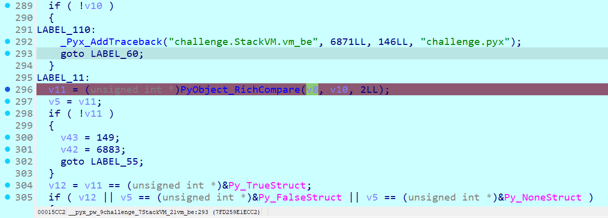

没什么好思路，vm.opcode又看不太懂只能手扣代码值

~~~
a+1
a+2
a+3
a+1
a+2
a+3==0x35
(a<<8 | 1)==0x3201 
(a<<8 | 2)==0x3202 
(a<<8 | 3)==0x6303
(a<<8 | 1)==0x6301 
(a<<8 | 1)==0x6301
(a<<8 | 2)==0x6602
(a<<8 | 3)==0x3203
a+1==0x2E
a+2==0x39
a+3==0x34
a+1==0x63
a+2==0x38
a+3==0x30
a+2==0x36
a<<1==0x6E
a<<2==0xDC
a<<3==0x310
(a<<8 | 1)==0x2d01 
(a<<8 | 2)==0x6202 
(a<<8 | 3)==0x6303
a<<1==0xCA
a<<2==0x184
a<<3==0x180
a<<3==0x330
a<<2==0xC8
a<<1==0x66
a<<3==0x180
a<<2==0x194
a<<3==0x180
a<<2==0x194
a<<1==0xFA

~~~

手动太慢了，还是得试试idapython，下条件断点在python api上，获取寄存器值并访问打印对应的数据

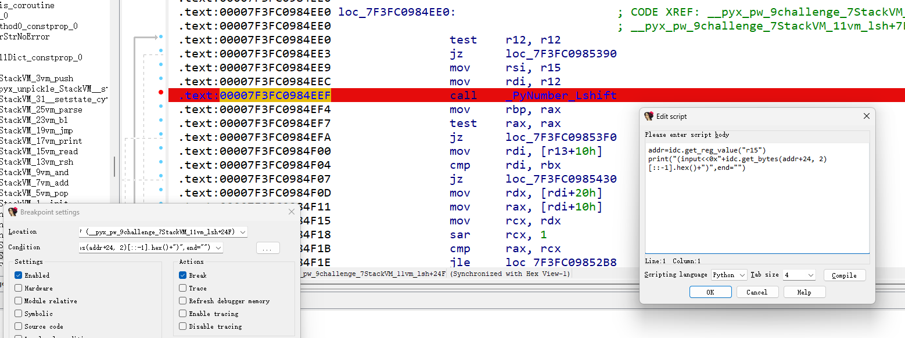

~~~python
// vm_lsh
addr=idc.get_reg_value("r15")
print("(input<<0x"+idc.get_bytes(addr+24, 2)[::-1].hex()+")",end="")
// vm_and
addr=idc.get_reg_value("r14")
print("|"+idc.get_bytes(addr+24, 2)[::-1].hex(),end="")
// vm_add
addr=idc.get_reg_value("r14")
print("input+0x"+idc.get_bytes(addr+24, 2)[::-1].hex(),end="")
// vm_be
addr=idc.get_reg_value("r13")
print("==0x"+idc.get_bytes(addr+24, 2)[::-1].hex())
~~~

比较强制跳转保证始终为True（动调的时候去改，在vm_execute刚开始下个断点，然后去vm_be里nop掉这个jz确保if进不去，然后取消vm_execute上的断点清空控制台，F9直接打印出来整个加密流程）

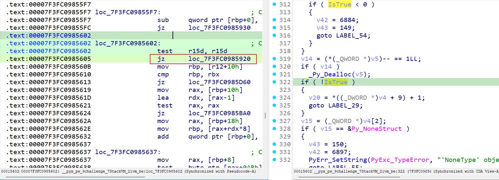

~~~
input+0x0001==0x0067
input+0x0002==0x006e
input+0x0003==0x0064
input+0x0001==0x0068
input+0x0002==0x007d
input+0x0003==0x0035
(input<<0008)|0001==0x3201
(input<<0008)|0002==0x3202
(input<<0008)|0003==0x6303
(input<<0008)|0001==0x6301
(input<<0008)|0001==0x6301
(input<<0008)|0002==0x6602
(input<<0008)|0003==0x3203
input+0x0001==0x002e
input+0x0002==0x0039
input+0x0003==0x0034
input+0x0001==0x0063
input+0x0002==0x0038
input+0x0003==0x0030
input+0x0002==0x0036
(input<<0001)==0x006e
(input<<0002)==0x00dc
(input<<0003)==0x0310
(input<<0008)|0001==0x2d01
(input<<0008)|0002==0x6202
(input<<0008)|0003==0x6303
(input<<0001)==0x00ca
(input<<0002)==0x0184
(input<<0003)==0x0180
(input<<0003)==0x0330
(input<<0002)==0x00c8
(input<<0001)==0x0066
(input<<0003)==0x0180
(input<<0002)==0x0194
(input<<0003)==0x0180
(input<<0002)==0x0194
(input<<0001)==0x00fa
Debugger: process has exited (exit code 0)
~~~

Perfect！效率大大提高不需要手动在那调试和查看值了，和前面一模一样

### 和谐

提取下abc反编译（下面只保留了关键代码）

~~~java
package p001entry.src.main.ets.pages;

/* renamed from: &entry.src.main.ets.pages.Index&, reason: invalid class name */
/* loaded from: E:\CTF\CTF-Writeups\春秋杯冬季赛2024\Reverse\hexie\modules.abc */
public class Index {

    /* renamed from: d */
    public Object m2d(Object functionObject, Object newTarget, Index this, Object arg0) {
        int i = (42 == arg0.length ? 1 : 0);// 长度42
        if (isfalse(isfalse(i) == null ? arg0.startsWith("flag{") : i) != null || isfalse(arg0.endsWith("}")) != null) {
            this.b = "ahahahahaha...";//检查格式
            return null;
        }
        int i2 = arg0.length / 16;
        for (int i3 = 0; (i3 < i2 ? 1 : 0) != 0; i3 = tonumer(i3) + 1) {
            Object g = this.g(arg0.slice(5 + (i3 * 16), 5 + (i3 * 16) + 16));//从第6位开始每16位加密一次并查表比较
            for (int i4 = 0; (i4 < g.length ? 1 : 0) != 0; i4 = tonumer(i4) + 1) {
                if ((g[i4] != this.c[this.c[256 + i4 + (i3 * 16)]] ? 1 : 0) != 0) {
                    this.b = "hahahaha...";
                    return null;
                }
            }
        }
        this.b = "Congratulations!";
        return null;
    }

    /* renamed from: g */
    public Object m3g(Object functionObject, Object newTarget, Index this, Object arg0) {
        Object newobjrange = Uint8Array(16);
        Object newobjrange2 = Uint32Array(36);
        toString = arg0.toString() + "0".repeat(16 - arg0.length)//不够补字符0
        Object newobjrange3 = import { default as util } from "@ohos:util".TextEncoder();
        newobjrange3.encodeIntoUint8Array(toString.toString(), newobjrange);
        Object m = this.m();
        for (int i = 0; (i < 4 ? 1 : 0) != 0; i = tonumer(i) + 1) {
            newobjrange2[i] = this.k(Uint8Array(newobjrange.slice(i * 4, (i + 1) * 4)));
        }
        for (int i2 = 0; (i2 < 32 ? 1 : 0) != 0; i2 = tonumer(i2) + 1) {
            newobjrange2[i2 + 4] = ((newobjrange2[i2 + 1] ^ newobjrange2[i2 + 2]) ^ newobjrange2[i2 + 3]) ^ m[i2];
            newobjrange2[i2 + 4] = this.l(newobjrange2[i2 + 4]);
            newobjrange2[i2 + 4] = newobjrange2[i2 + 4] ^ newobjrange2[i2];
        }
        for (int i3 = 0; (i3 < 4 ? 1 : 0) != 0; i3 = tonumer(i3) + 1) {
            newobjrange[4 * i3] = (newobjrange2[35 - i3] >> 24) & 255;
            newobjrange[(4 * i3) + 1] = (newobjrange2[35 - i3] >> 16) & 255;
            newobjrange[(4 * i3) + 2] = (newobjrange2[35 - i3] >> 8) & 255;
            newobjrange[(4 * i3) + 3] = newobjrange2[35 - i3] & 255;
        }
        return newobjrange;
    }

    /* renamed from: h */
    public Object m4h(Object functionObject, Object newTarget, Index this, Object arg0, Object arg1) {
        return (arg0 << arg1) | (arg0 >> (32 - arg1));
    }

    /* renamed from: i */
    public Object m5i(Object functionObject, Object newTarget, Index this, Object arg0) {
        return this.c[((arg0 >> 4) * 16) + (arg0 & 15)];
    }

    /* renamed from: j */
    public Object m6j(Object functionObject, Object newTarget, Index this, Object arg0) {
        Object obj = null;
        for (int i = 3; (i > (-1) ? 1 : 0) != 0; i = tonumer(i) - 1) {
            obj = ((obj == true ? 1 : 0) << 8) + this.i((arg0 >> (i * 8)) & 255);
        }
        return obj;
    }

    /* renamed from: k */
    public Object m7k(Object functionObject, Object newTarget, Index this, Object arg0) {
        Object obj = null;
        for (int i = 0; (i < 4 ? 1 : 0) != 0; i = tonumer(i) + 1) {
            obj = (obj == true ? 1 : 0) + (arg0[i] << (8 * (3 - i)));
        }
        return obj;
    }

    /* renamed from: l */
    public Object m8l(Object functionObject, Object newTarget, Index this, Object arg0) {
        j = this.j(arg0);
        return (((j ^ this.h(j, 2)) ^ this.h(j, 10)) ^ this.h(j, 18)) ^ this.h(j, 24);
    }

    /* renamed from: m */
    public Object m9m(Object functionObject, Object newTarget, Index this) {//相当于key expansion操作
        Object obj = this.c;
        Object slice = obj.slice(0, 16);//数组取前16字节
        Object newobjrange = Uint32Array(36);
        for (int i = 0; (i < 4 ? 1 : 0) != 0; i = tonumer(i) + 1) {
            newobjrange[i] = this.k(Uint8Array(slice.slice(i * 4, (i + 1) * 4)));//魔改点1：没有异或FK
        }
        for (int i2 = 0; (i2 < 32 ? 1 : 0) != 0; i2 = tonumer(i2) + 1) {
            newobjrange[i2 + 4] = (newobjrange[i2 + 1] ^ newobjrange[i2 + 2]) ^ newobjrange[i2 + 3];//魔改点2：没有异或CK
            newobjrange[i2 + 4] = this.j(newobjrange[i2 + 4]);
            newobjrange[i2 + 4] = (newobjrange[i2 + 4] ^ this.h(newobjrange[i2 + 4], 13)) ^ this.h(newobjrange[i2 + 4], 23);
            newobjrange[i2 + 4] = newobjrange[i2 + 4] ^ newobjrange[i2];
        }
        return newobjrange.slice(4, 36);
    }

    public Object Index(Object functionObject, Object newTarget, Index this, Object arg0, Object arg1, Object arg2, Object arg3, Object arg4, Object arg5) {
        Object obj = arg3;
        Object obj2 = arg4;
        if ((0 == obj ? 1 : 0) != 0) {
            obj = -1;
        }
        if ((0 == obj2 ? 1 : 0) != 0) {
            obj2 = null;
        }
        Object obj3 = super(arg0, arg2, obj, arg5);
        if (("function" == typeof(obj2) ? 1 : 0) != 0) {
            obj3.paramsGenerator_ = obj2;
        }
        obj3.__a = ObservedPropertySimplePU("", obj3, "a");
        obj3.__b = ObservedPropertySimplePU("", obj3, "b");
        obj3.c = Uint8Array(createarraywithbuffer([214, 144, 233, 254, 204, 225, 61, 183, 22, 182, 20, 194, 40, 251, 44, 5, 43, 103, 154, 118, 42, 190, 4, 195, 170, 68, 19, 38, 73, 134, 6, 153, 156, 66, 80, 244, 145, 239, 152, 122, 51, 84, 11, 67, 237, 207, 172, 98, 228, 179, 28, 169, 201, 8, 232, 149, 128, 223, 148, 250, 117, 143, 63, 166, 71, 7, 167, 252, 243, 115, 23, 186, 131, 89, 60, 25, 230, 133, 79, 168, 104, 107, 129, 178, 113, 100, 218, 139, 248, 235, 15, 75, 112, 86, 157, 53, 30, 36, 14, 94, 99, 88, 209, 162, 37, 34, 124, 59, 1, 33, 120, 135, 212, 0, 70, 87, 159, 211, 39, 82, 76, 54, 2, 231, 160, 196, 200, 158, 234, 191, 138, 210, 64, 199, 56, 181, 163, 247, 242, 206, 249, 97, 21, 161, 224, 174, 93, 164, 155, 52, 26, 85, 173, 147, 50, 48, 245, 140, 177, 227, 29, 246, 226, 46, 130, 102, 202, 96, 192, 41, 35, 171, 13, 83, 78, 111, 213, 219, 55, 69, 222, 253, 142, 47, 3, 255, 106, 114, 109, 108, 91, 81, 141, 27, 175, 146, 187, 221, 188, 127, 17, 217, 92, 65, 31, 16, 90, 216, 10, 193, 49, 136, 165, 205, 123, 189, 45, 116, 208, 18, 184, 229, 180, 176, 137, 105, 151, 74, 12, 150, 119, 126, 101, 185, 241, 9, 197, 110, 198, 132, 24, 240, 125, 236, 58, 220, 77, 32, 121, 238, 95, 62, 215, 203, 57, 72, 24, 138, 76, 64, 151, 159, 65, 33, 3, 90, 97, 15, 62, 105, 82, 235, 77, 240, 241, 90, 84, 179, 185, 34, 158, 119, 185, 189, 120, 106, 13, 138, 17, 68, 255, 127, 234, 11, 218, 151, 82, 97, 25, 170, 100, 201, 253, 150]));
        obj3.setInitiallyProvidedValue(arg1);
        obj3.finalizeConstruction();
        return obj3;
    }

    public Object rerender(Object functionObject, Object newTarget, Index this) {
        this.updateDirtyElements();
        return null;
    }
}
~~~

简单分析下可知sm4加密魔改了

~~~python
S_BOX = [0xD6, 0x90, 0xE9, 0xFE, 0xCC, 0xE1, 0x3D, 0xB7, 0x16, 0xB6, 0x14, 0xC2, 0x28, 0xFB, 0x2C, 0x05,
         0x2B, 0x67, 0x9A, 0x76, 0x2A, 0xBE, 0x04, 0xC3, 0xAA, 0x44, 0x13, 0x26, 0x49, 0x86, 0x06, 0x99,
         0x9C, 0x42, 0x50, 0xF4, 0x91, 0xEF, 0x98, 0x7A, 0x33, 0x54, 0x0B, 0x43, 0xED, 0xCF, 0xAC, 0x62,
         0xE4, 0xB3, 0x1C, 0xA9, 0xC9, 0x08, 0xE8, 0x95, 0x80, 0xDF, 0x94, 0xFA, 0x75, 0x8F, 0x3F, 0xA6,
         0x47, 0x07, 0xA7, 0xFC, 0xF3, 0x73, 0x17, 0xBA, 0x83, 0x59, 0x3C, 0x19, 0xE6, 0x85, 0x4F, 0xA8,
         0x68, 0x6B, 0x81, 0xB2, 0x71, 0x64, 0xDA, 0x8B, 0xF8, 0xEB, 0x0F, 0x4B, 0x70, 0x56, 0x9D, 0x35,
         0x1E, 0x24, 0x0E, 0x5E, 0x63, 0x58, 0xD1, 0xA2, 0x25, 0x22, 0x7C, 0x3B, 0x01, 0x21, 0x78, 0x87,
         0xD4, 0x00, 0x46, 0x57, 0x9F, 0xD3, 0x27, 0x52, 0x4C, 0x36, 0x02, 0xE7, 0xA0, 0xC4, 0xC8, 0x9E,
         0xEA, 0xBF, 0x8A, 0xD2, 0x40, 0xC7, 0x38, 0xB5, 0xA3, 0xF7, 0xF2, 0xCE, 0xF9, 0x61, 0x15, 0xA1,
         0xE0, 0xAE, 0x5D, 0xA4, 0x9B, 0x34, 0x1A, 0x55, 0xAD, 0x93, 0x32, 0x30, 0xF5, 0x8C, 0xB1, 0xE3,
         0x1D, 0xF6, 0xE2, 0x2E, 0x82, 0x66, 0xCA, 0x60, 0xC0, 0x29, 0x23, 0xAB, 0x0D, 0x53, 0x4E, 0x6F,
         0xD5, 0xDB, 0x37, 0x45, 0xDE, 0xFD, 0x8E, 0x2F, 0x03, 0xFF, 0x6A, 0x72, 0x6D, 0x6C, 0x5B, 0x51,
         0x8D, 0x1B, 0xAF, 0x92, 0xBB, 0xDD, 0xBC, 0x7F, 0x11, 0xD9, 0x5C, 0x41, 0x1F, 0x10, 0x5A, 0xD8,
         0x0A, 0xC1, 0x31, 0x88, 0xA5, 0xCD, 0x7B, 0xBD, 0x2D, 0x74, 0xD0, 0x12, 0xB8, 0xE5, 0xB4, 0xB0,
         0x89, 0x69, 0x97, 0x4A, 0x0C, 0x96, 0x77, 0x7E, 0x65, 0xB9, 0xF1, 0x09, 0xC5, 0x6E, 0xC6, 0x84,
         0x18, 0xF0, 0x7D, 0xEC, 0x3A, 0xDC, 0x4D, 0x20, 0x79, 0xEE, 0x5F, 0x3E, 0xD7, 0xCB, 0x39, 0x48
         ]

FK = [0xa3b1bac6, 0x56aa3350, 0x677d9197, 0xb27022dc]
CK = [
    0x00070e15, 0x1c232a31, 0x383f464d, 0x545b6269,
    0x70777e85, 0x8c939aa1, 0xa8afb6bd, 0xc4cbd2d9,
    0xe0e7eef5, 0xfc030a11, 0x181f262d, 0x343b4249,
    0x50575e65, 0x6c737a81, 0x888f969d, 0xa4abb2b9,
    0xc0c7ced5, 0xdce3eaf1, 0xf8ff060d, 0x141b2229,
    0x30373e45, 0x4c535a61, 0x686f767d, 0x848b9299,
    0xa0a7aeb5, 0xbcc3cad1, 0xd8dfe6ed, 0xf4fb0209,
    0x10171e25, 0x2c333a41, 0x484f565d, 0x646b7279
]

def wd_to_byte(wd, bys):
    bys.extend([(wd >> i) & 0xff for i in range(24, -1, -8)])

def bys_to_wd(bys):
    ret = 0
    for i in range(4):
        bits = 24 - i * 8
        ret |= (bys[i] << bits)
    return ret

def s_box(wd):
    """
    进行非线性变换，查S盒
    :param wd: 输入一个32bits字
    :return: 返回一个32bits字   ->int
    """
    ret = []
    for i in range(0, 4):
        byte = (wd >> (24 - i * 8)) & 0xff
        row = byte >> 4
        col = byte & 0x0f
        index = (row * 16 + col)
        ret.append(S_BOX[index])
    return bys_to_wd(ret)

def rotate_left(wd, bit):
    """
    :param wd: 待移位的字
    :param bit: 循环左移位数
    :return:
    """
    return (wd << bit & 0xffffffff) | (wd >> (32 - bit))

def Linear_transformation(wd):
    """
    进行线性变换L
    :param wd: 32bits输入
    """
    return wd ^ rotate_left(wd, 2) ^ rotate_left(wd, 10) ^ rotate_left(wd, 18) ^ rotate_left(wd, 24)

def Tx(k1, k2, k3, ck):
    """
    密钥扩展算法的合成变换
    """
    xor = k1 ^ k2 ^ k3 ^ ck
    t = s_box(k1 ^ k2 ^ k3)
    return t ^ rotate_left(t, 13) ^ rotate_left(t, 23)

def T(x1, x2, x3, rk):
    """
    加密算法轮函数的合成变换
    """
    t = x1 ^ x2 ^ x3 ^ rk
    t = s_box(t)
    return t ^ rotate_left(t, 2) ^ rotate_left(t, 10) ^ rotate_left(t, 18) ^ rotate_left(t, 24)

def key_extend(main_key):
    MK = [(main_key >> (128 - (i + 1) * 32)) & 0xffffffff for i in range(4)]
    # 将128bits分为4个字
    keys = [MK[i] for i in range(4)]
    # 生成K0~K3
    RK = []
    for i in range(32):
        t = Tx(keys[i + 1], keys[i + 2], keys[i + 3], CK[i])
        k = keys[i] ^ t
        keys.append(k)
        RK.append(k)
    return RK

def R(x0, x1, x2, x3):
    # 使用位运算符将数值限制在32位范围内
    x0 &= 0xffffffff
    x1 &= 0xffffffff
    x2 &= 0xffffffff
    x3 &= 0xffffffff
    s = f"{x3:08x}{x2:08x}{x1:08x}{x0:08x}"
    return s

def encode(plaintext, rk):
    X = [plaintext >> (128 - (i + 1) * 32) & 0xffffffff for i in range(4)]
    for i in range(32):
        t = T(X[1], X[2], X[3], rk[i])
        c = (t ^ X[0])
        X = X[1:] + [c]
    ciphertext = R(X[0], X[1], X[2], X[3])
    # 进行反序处理
    return ciphertext

def decode(ciphertext, rk):
    ciphertext = int(ciphertext, 16)
    X = [ciphertext >> (128 - (i + 1) * 32) & 0xffffffff for i in range(4)]
    for i in range(32):
        t = T(X[1], X[2], X[3], rk[31 - i])
        c = (t ^ X[0])
        X = X[1:] + [c]
    m = R(X[0], X[1], X[2], X[3])
    return m

if __name__ == '__main__':
    cmp = [214, 144, 233, 254, 204, 225, 61, 183, 22, 182, 20, 194, 40, 251, 44, 5, 43, 103, 154, 118, 42, 190, 4, 195, 170, 68, 19, 38, 73, 134, 6, 153, 156, 66, 80, 244, 145, 239, 152, 122, 51, 84, 11, 67, 237, 207, 172, 98, 228, 179, 28, 169, 201, 8, 232, 149, 128, 223, 148, 250, 117, 143, 63, 166, 71, 7, 167, 252, 243, 115, 23, 186, 131, 89, 60, 25, 230, 133, 79, 168, 104, 107, 129, 178, 113, 100, 218, 139, 248, 235, 15, 75, 112, 86, 157, 53, 30, 36, 14, 94, 99, 88, 209, 162, 37, 34, 124, 59, 1, 33, 120, 135, 212, 0, 70, 87, 159, 211, 39, 82, 76, 54, 2, 231, 160, 196, 200, 158, 234, 191, 138, 210, 64, 199, 56, 181, 163, 247, 242, 206, 249, 97, 21, 161, 224, 174, 93, 164, 155, 52, 26, 85, 173, 147, 50, 48, 245, 140, 177, 227, 29, 246, 226, 46, 130, 102, 202, 96, 192, 41, 35, 171, 13, 83, 78, 111, 213, 219, 55, 69, 222, 253, 142, 47, 3, 255, 106, 114, 109, 108, 91, 81, 141, 27, 175, 146, 187, 221, 188, 127, 17, 217, 92, 65, 31, 16, 90, 216, 10, 193, 49, 136, 165, 205, 123, 189, 45, 116, 208, 18, 184, 229, 180, 176, 137, 105, 151, 74, 12, 150, 119, 126, 101, 185, 241, 9, 197, 110, 198, 132, 24, 240, 125, 236, 58, 220, 77, 32, 121, 238, 95, 62, 215, 203, 57, 72, 24, 138, 76, 64, 151, 159, 65, 33, 3, 90, 97, 15, 62, 105, 82, 235, 77, 240, 241, 90, 84, 179, 185, 34, 158, 119, 185, 189, 120, 106, 13, 138, 17, 68, 255, 127, 234, 11, 218, 151, 82, 97, 25, 170, 100, 201, 253, 150]
    main_key = int(bytes(cmp[:16]).hex(), 16)
    rk = key_extend(main_key)
    print("flag{", end="")
    for i in range(3):
        dec = []
        for j in range(16):
            dec.append(cmp[cmp[256+j+16*i]])
        m = decode(bytes(dec).hex(), rk)
        print(bytes.fromhex(m).decode(), end="")
~~~

## 总结

这个比赛的re出的还是相当不错的，开学到现在才断断续续复现完所有题目，里面有不少python相关题目，趁着这个机会学习了新知识，也尝试了用自己方法做出来好几道题目
